# JPA 시작

## 프로젝트 생성

앞으로 H2데이터베이스와 메이븐을 사용해서 개발 할 것이다.


### 라이브러리 추가 (pom.xml)

```xml
<?xml version="1.0" encoding="UTF-8"?>
<project xmlns="http://maven.apache.org/POM/4.0.0"
         xmlns:xsi="http://www.w3.org/2001/XMLSchema-instance"
         xsi:schemaLocation="http://maven.apache.org/POM/4.0.0 http://maven.apache.org/xsd/maven-4.0.0.xsd">
    <modelVersion>4.0.0</modelVersion>

    <groupId>org.example</groupId>
    <artifactId>your-project</artifactId>
    <version>1.0-SNAPSHOT</version>

    <properties>
        <maven.compiler.source>11</maven.compiler.source>
        <maven.compiler.target>11</maven.compiler.target>
    </properties>

    <dependencies>
        <!-- Hibernate -->
        <dependency>
            <groupId>org.hibernate</groupId>
            <artifactId>hibernate-core</artifactId>
            <version>5.6.14.Final</version>
        </dependency>

        <!-- H2 -->
        <dependency>
            <groupId>com.h2database</groupId>
            <artifactId>h2</artifactId>
            <version>2.1.214</version>
        </dependency>
    </dependencies>
</project>
```

### JPA설정하기 - (persistence.xml)

`/META-INF/persistence.xml`

데이터 베이스 설정

```xml
<?xml version="1.0" encoding="UTF-8"?>
<persistence xmlns="http://xmlns.jcp.org/xml/ns/persistence" version="2.1">

    <persistence-unit name="jpabook">
        <properties>
            <!-- H2 데이터베이스 설정 -->
            <property name="javax.persistence.jdbc.driver" value="org.h2.Driver" />
            <property name="javax.persistence.jdbc.url" value="jdbc:h2:tcp://localhost/~/test" />
            <property name="javax.persistence.jdbc.user" value="sa" />
            <property name="javax.persistence.jdbc.password" value="" />
            <property name="hibernate.dialect" value="org.hibernate.dialect.H2Dialect" />

            <!-- 옵션 -->
            <property name="hibernate.show_sql" value="true" />
            <property name="hibernate.format_sql" value="true" />
            <property name="hibernate.use_sql_comments" value="true" />
            <property name="hibernate.id.new_generator_mappings" value="true" />
            <property name="hibernate.hbm2ddl.auto" value="create" />
        </properties>
    </persistence-unit>
</persistence>
```

### 데이터베이스 방언

- JPA는 특정 데이터베이스에 종속 x
- 각각의 데이터베이스가 제공하는 SQL 문법과 함수는 조금씩 다름
  - 가변 문자: MySQL은 VARCHAR, Oracle은 VARCHHAR2
  - 문자열을 자르는 함수: SQL표준은 SUBSTRING(), Oracle은 SUBSTR()
  - 페이징: MySQL은 LIMIT, Oracle은 ROWNUM

> 방언(dialect): SQL 표준을 지키지 않는 특정 데이터베이스만의 고유한 기능

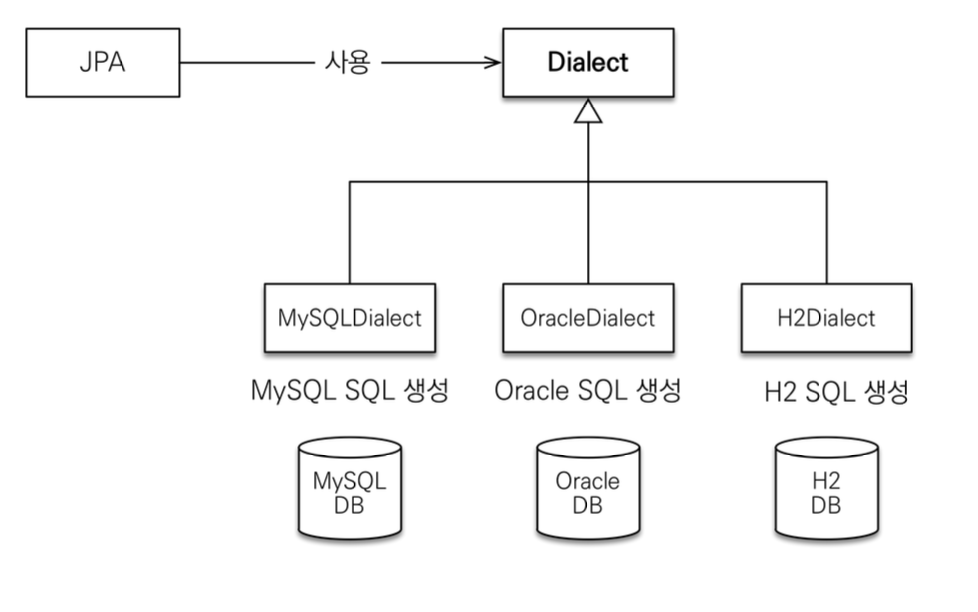<br>

- **hibernate.dialect**속성에 지정
  - H2: org.hibernate.dialect.H2Dialect
  - Oracle 10g: org.hibernate.dialect.Oracle10gDialect
  - MySQL: org.hibernate.dialect.MYSQL5InnoDBDialect
- 하이버네이트는 40가지 이상의 데이터베이스 방언 지원

## 애플리케이션 개발

### JPA 구동 방식

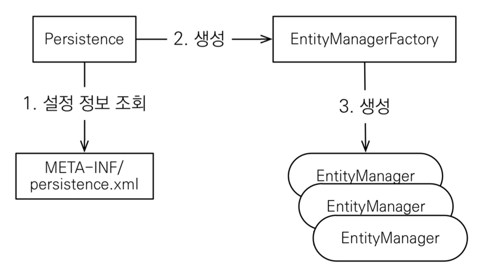<br>

### Member 클래스 생성

```java
package jpabasic.ex1hellojpa;

import jakarta.persistence.Column;
import jakarta.persistence.Entity;
import jakarta.persistence.Id;
import jakarta.persistence.Table;

@Entity
@Table(name = "MEMBER")
public class Member {

    @Id
    @Column(name = "ID")
    private String id;

    @Column(name = "NAME")
    private String username;

    private Integer age;

    // getter, setter
}
```

```sql
CREATE TABLE MEMBER (
                        ID VARCHAR(255) NOT NULL, --아이디(기본 키)
                        NAME VARCHAR(255),        --이름
                        AGE INTEGER NOT NULL,     --나이
                        PRIMARY KEY (ID)
)
```

- **@Entity**: JPA가 관리할 객체
- **@Id**: 데이터베이스 PK와 매핑

### 회원 저장

- 회원 등록
- 회원 수정
- 회원 삭제
- 회원 단 건 조회

```java

public class JpaMain {

    public static void main(String[] args) {

        //엔티티 매니저 팩토리 생성
        EntityManagerFactory emf = Persistence.createEntityManagerFactory("jpabook");
        EntityManager em = emf.createEntityManager(); //엔티티 매니저 생성

        EntityTransaction tx = em.getTransaction(); //트랜잭션 기능 획득
        tx.begin();

        Member member = new Member();
        member.setId(1L);
        member.setName("TestA");

        //등록
        em.persist(member);

        tx.commit();

        em.close();
        emf.close();
    }
}
```

- **엔티티 매니저 팩토리**는 하나만 생성해서 애플리케이션 전체에서 공유
- **엔티티 매니저**는 쓰레드간에 공유x(사용하고 버려야 한다.)
- **JPA의 모든 데이터 변경은 트랜잭션 안에서 실행**(`tx.begin() - tx.commit()`)

### 회원 단건 조회

```java
public class JpaMain {

    public static void main(String[] args) {
        EntityManagerFactory emf = Persistence.createEntityManagerFactory("jpabook");
        EntityManager em = emf.createEntityManager();

        EntityTransaction tx = em.getTransaction();
        tx.begin();

        try {
            Member findMember = em.find(Member.class, 1L);
            System.out.println("findMember.id = " + findMember.getId());
            System.out.println("findMember.name = " + findMember.getName());

            tx.commit();
        } catch (Exception e) {
            tx.rollback();
        } finally {
            em.close();
        }
        
        emf.close();
    }
}
```

트랜잭션에서 문제가 발생했을 경우 트랜잭션을 ROLLBACK해야 한다. 또한 문제 여부와 상관없이 `EntityManager`를 닫아서 DB Connection을 종료해야 한다.

### 회원 삭제

```java
public class JpaMain {

    public static void main(String[] args) {
        EntityManagerFactory emf = Persistence.createEntityManagerFactory("jpabook");
        EntityManager em = emf.createEntityManager();

        EntityTransaction tx = em.getTransaction();
        tx.begin();

        try {
            Member findMember = em.find(Member.class, 1L);
			em.remove(findMember);
            
            tx.commit();
        } catch (Exception e) {
            tx.rollback();
        } finally {
            em.close();
        }
        
        emf.close();
    }
}
```

### 회원 수정

```java
public class JpaMain {

    public static void main(String[] args) {
        EntityManagerFactory emf = Persistence.createEntityManagerFactory("jpabook");
        EntityManager em = emf.createEntityManager();

        EntityTransaction tx = em.getTransaction();
        tx.begin();

        try {
            Member findMember = em.find(Member.class, 1L);
			findMember.setName("HelloJPA");
            
            tx.commit();
        } catch (Exception e) {
            tx.rollback();
        } finally {
            em.close();
        }
        
        emf.close();
    }
}
```

자바 객체를 수정하듯이 DB를 수정할 수 있다. JPA를 통하여 객체를 가져올 경우 JPA에서 객체를 관리하여 트랜잭션 시점에 객체의 변경 여부를 감지하여 객체가 변경되었을 경우 UPDATE 쿼리를 생성한다.

### 회원 다수 조회

```java
public class JpaMain {

    public static void main(String[] args) {
        EntityManagerFactory emf = Persistence.createEntityManagerFactory("jpabook");
        EntityManager em = emf.createEntityManager();

        EntityTransaction tx = em.getTransaction();
        tx.begin();

        try {
			List<Member> result = em.createQuery("select m from Member as m", Member.class).getResultList();
            
			for (Member member : result) {
                System.out.println("member.name = " + member.getName());
            }
            
            tx.commit();
        } catch (Exception e) {
            tx.rollback();
        } finally {
            em.close();
        }
        
        emf.close();
    }
}
```

JPQL을 사용해서 다수의 객체를 조회하고 있다.

### JPQL

가장 단순한 조회 방법은 EntityManager.find(), 객체 그래프 탐색 방법은 a.getB().getC()이다.<br>하지만 만약에, 나이가 18살 이상인 회원을 모두 검색하고 싶으면 JPQL가 필요하다.

- JPA를 사용하면 엔티티 객체를 중심으로 개발
  - 문제는 검색 쿼리
  - JPA가 검색을 할 때도 테이블이 아닌 엔티티 객체를 대상으로 검색
  - 그러나 모든 DB데이터를 객체로 변환해서 검색하는 것은 불가능
  - 애플리케이션이 필요한 데이터만 DB에서 불러오려면 결국 검색 조건이 포함된 SQL이 필요하다.
- JPQL
  - JPA는 SQL을 추상화한 JPQL이라는 객체 지향 쿼리 언어 제공
  - SQL문법과 유사 SELECT, FROM, WHERE 등등 지원
  - JPQL은 엔티티 객체를 대상으로 쿼리
  - SQL은 데이터베이스 테이블을 대상으로 쿼리
  - 테이블이 아닌 객체를 대상으로 검색하는 객체 지향 쿼리
  - SQL을 추상화해서 특정 데이터베이스 SQL에 의존하지 않음
  - JPQL을 한마디로 정의하면 객체 지향 SQL

# 영속성 관리

## 영속성 컨텍스트

JPA에서 가장 중요한 2가지

- 객체외 관계형 데이터베이스 매핑하기 (정적인 영역)
- **영속성 컨텍스트** (동적인 영역)

### 엔티티 매니저 팩토리와 엔티티 매니저

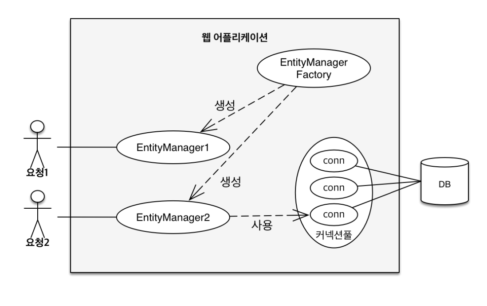<br>

웹 애플리케이션에서 요청이 들어온 경우 엔티티 매니저 팩토리는 고객의 요청이 들어올 때마다 엔티티 매니저를 생성하고 엔티티 매니저는 DB 커넥션 풀을 사용하여 DB에 접근한다.


### 영속성 컨텍스트

- JPA를 이해하는데 가장 중요한 용어
- 엔티티를 영구 저장하는 환경
- `EntityManager.persist(entity)`: 엔티티를 영속성 컨텍스트에 저장한다는 의미

영속성 컨텍스트는 논리적인 개념으로 **눈에 보이지 않음**.<br>엔티티 매니저를 통해서 영속성 컨텍스트에 접근

### 엔티티의 생명 주기

 - **비영속**(new/transient)
   - 영속성 컨텍스트와 전혀 관계가 없는 **새로운**싱테
 - **영속**(managed)
   - 영속성 컨텍스트에 **관리**되는 상태
 - **준영속**(detached)
   - 영속성 컨텍스트에 저장되었다가 **분리**된 상태
 - **삭제**(removed)
   - **삭제**된 상태

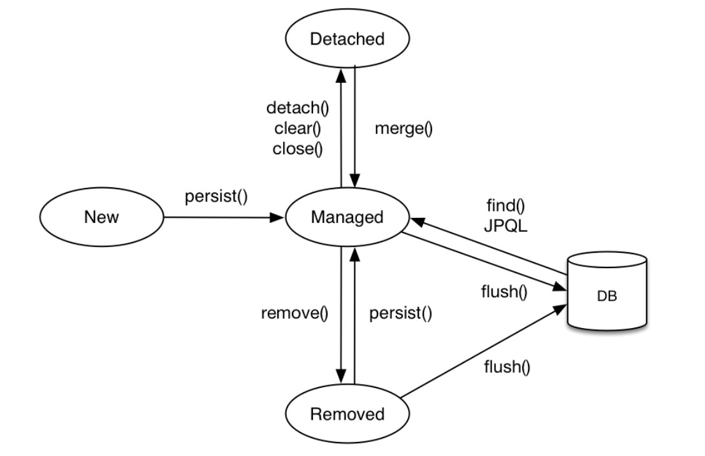<br>

### 비영속

영속성 컨텍스트와 전혀 관계가 없는 새로운 상태

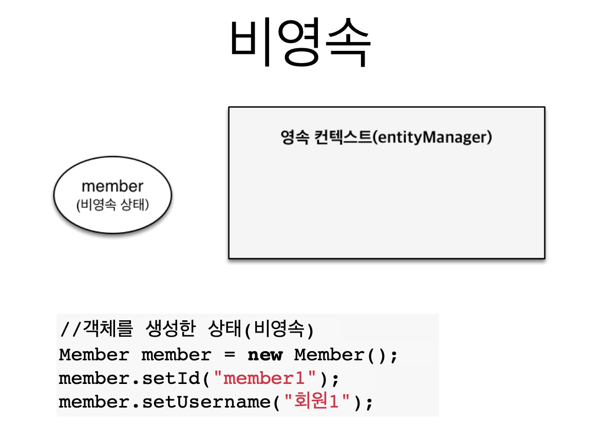<br>

### 영속

영속성 컨텍스트에 관리되는 상태

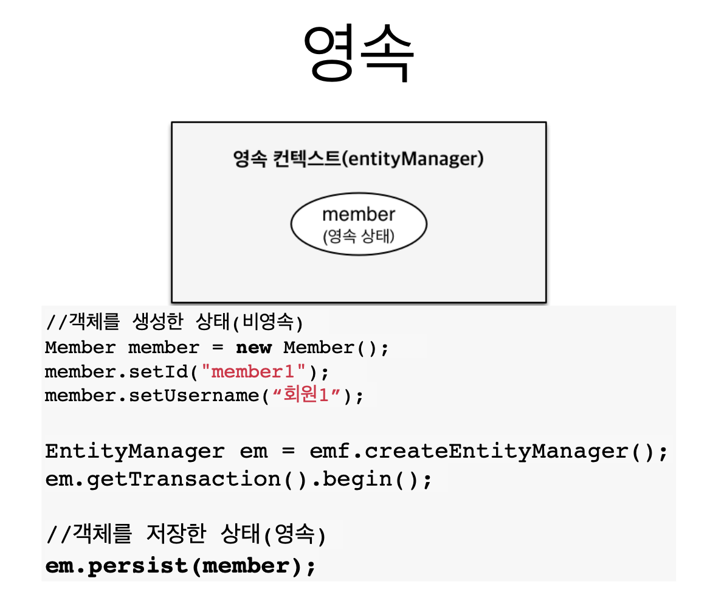<br>

### 준영속, 삭제

- 준영속: 영속성 컨텍스트에 저장되었다가 분리된 상태
- 삭제: 삭제된 상태

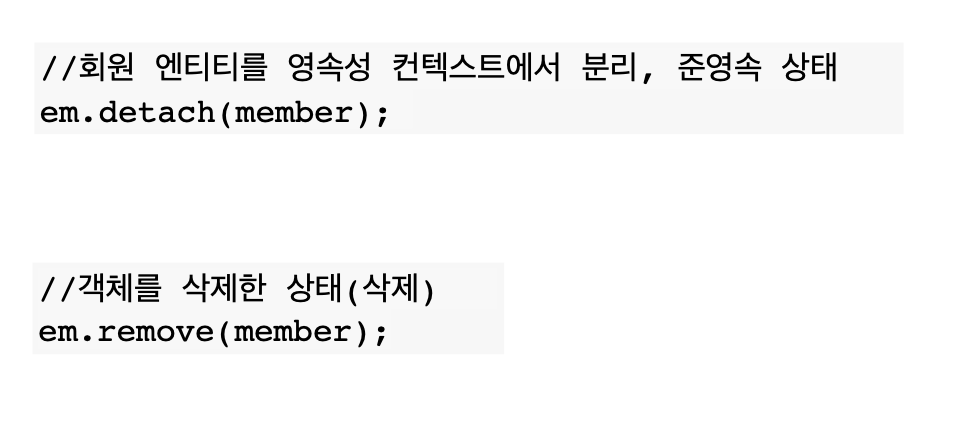<br>

### 영속성 컨텍스트의 이점

- 1차 캐시
- 동일성(identity)보장
- 트랜잭션을 지원하는 쓰기 지연(transactional write-behind)
- 변경 감지(Dirty Checking)
- 지연 로딩(Lazy Loading)

#### 1차 캐시

영속성 컨텍스트는 내부에 1차 캐시라는 것을 들고있다. (Map 형태)<br>1차 캐시 내부에는(엔티티 객체의 PK정보, 엔티티 객체, 최초 1차 캐시에 들오온 시점의 엔티티 정보)등이 있다.

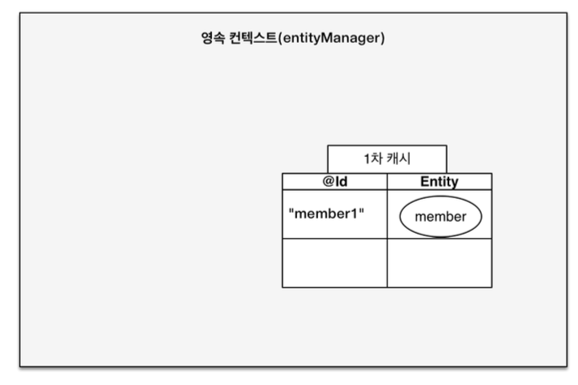<br>

```java
//엔티티를 생성한 상태 (비영속)
Member member = new Member();
member.setId("member1");
member.setName("회원1");

//엔티티를 영속
em.persist(member);
```

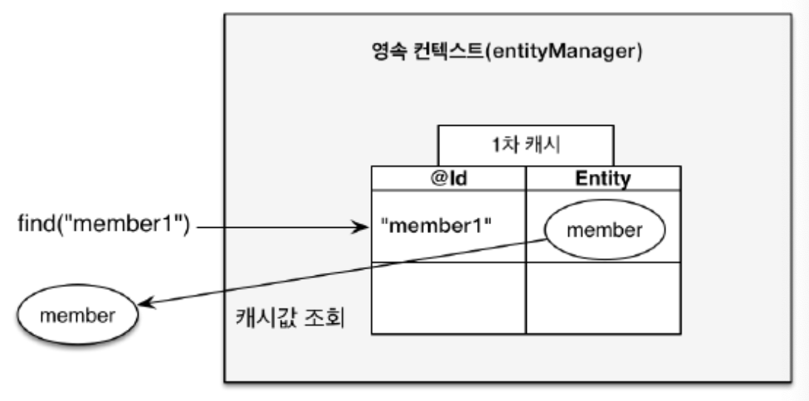<br>

```java
Member member = new Member();
member.setId("member1");
member.setUsername("회원1");

//1차 캐시에 저장됨
em.persist(member);

//1차 캐시에서 조회
Member findMember = em.find(Member.class, "member1");
```

JPA에서 조회를 할 경우 바로 DB에 접근하지 않고 영속성 컨텍스트 내의 1차 캐시에 접근한다.

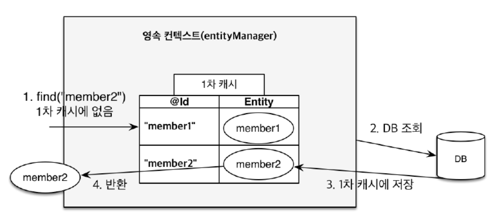<br>

```java
Member findMember2 = em.find(Member.class, "member2");
```

그러나 엔티티 매니저는 트랜잭션 단위로 존재하므로 어플리케이션 전체에서 공유하는 캐시(2차 캐시)와 달리 성능의 이점은 크지 않다.

#### 영속 엔티티의 동일성 보장

```java
Member a = em.find(Member.class, "member1");
member b = em.find(Member.class, "member1");
System.out.println(a == b); //동일성 비교 true
```

1차 캐시로 반복 가능한 읽기(REPEATEABLE READ)등급의 트랜잭션 격리 수준을 데이터베이스가 아닌 애플리케이션 차원에서 제공

#### 트랜잭션을 지원하는 쓰기 지연

```java
EntityManager em = emf.createEntityManager();
EntityTranscation transaction = em.getTransaction();
//엔티티 매니저는 데이터 변경시 트랜잭션을 시작해야 한다.
transaction.begin(); //[트랜잭션] 시작

em.persist(memberA);
em.persist(memberB);
//여기까지 INSERT SQL을 데이터베이스에 보내지 않는다.

//커밋하는 순간 데이터베이스에 INSERT SQL을 보낸다.
transaction.commit(); //[트랜잭션] 커밋
```

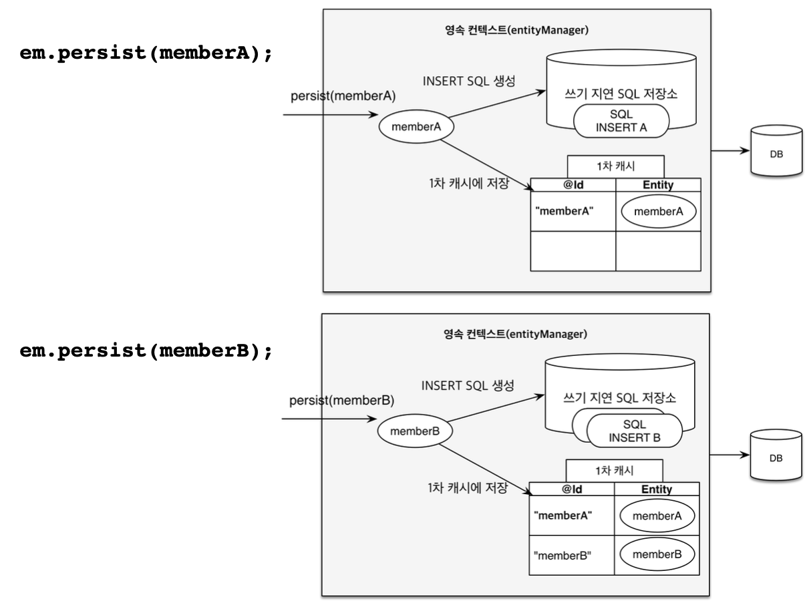<br>

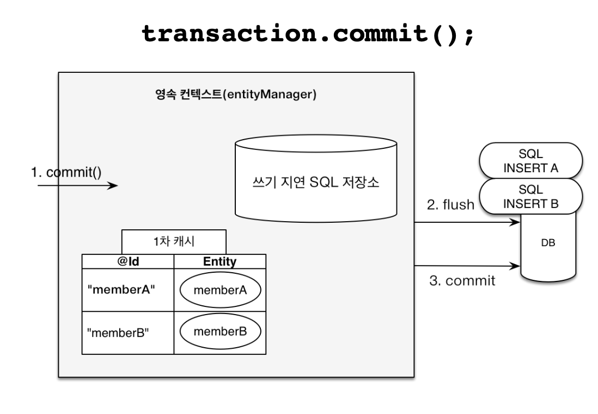<br>

#### 변경 감지(Dirty Checking)

```java
EntityManager dm = dmf.createEntityManager();
EntityTransaction transaction = em.getTransaction();
transaction.begin(); //[트랜잭션] 시작

//영속 엔티티 조회
Member memberA = em.find(Member.class, "memberA");

//영속 엔티티 데이터 수정
memberA.setUsername("hi");
memberA.setAge(10);

//em.update(member) 이런 코드가 있어야 하지 않을까?

transaction.commit(); //[트랜잭션] 커밋
```

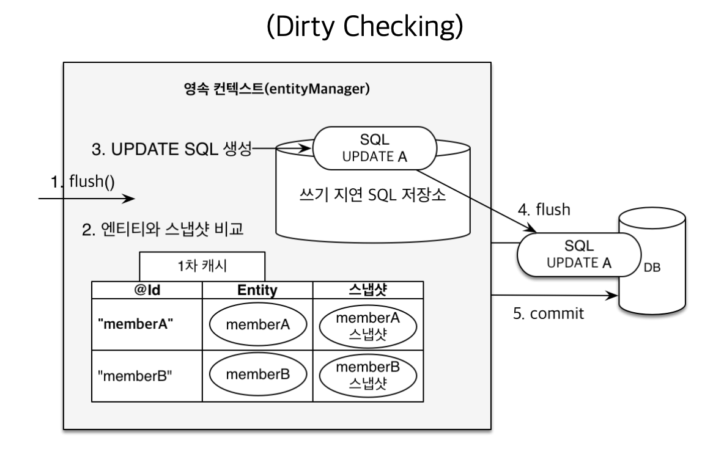<br>

### 플러시

영속성 컨텍스트의 변경내용을 데이터베이스에 반영

#### 플러시 발생

- 변경 감지
- 수정된 엔티티 쓰기 지연 SQL 저장소에 등록
- 쓰기 지연 SQL저장소의 쿼리를 데이터 베이스에 전송(등록, 수정, 삭제 쿼리)

#### 영속성 컨텍스트를 플러시하는 방법

- `em.flush()` - 직접 호출, 일반적인 경우에는 사용하지 않으나 테스트할 때 사용할 수 있음
- 트랜잭션 커밋 - 플리시 자동 호출
- JPQL 쿼리 실행 - 플리시 자동 호출

#### JPQl 쿼리 실행시 플러시가 자동으로 호출하는 이유

```java
em.persist(memberA);
em.persist(memberB);
em.persist(memberC);

//중간에 JPQL 실행
query = em.createQuery("select m from  Member m". Member.class);
List<Member> members = query.getResultList();
```

위의 코드를 보면 JPQl실행시 플러시가 호출되지 않으면 persist로 영속성 컨텍스트에 반영된 내용은 가져올 수 없다.

### 플러시 모드 옵션

```java
em.setFlushMode(FlushModeType.COMMIT)
```

- FlushModeType.AUTO: 커밋이나 쿼리를 실행할 때 플리서(기본값, 변경할 일은 거의 없다.)
- FlushModeType.COMMIT: 커밋할 때만 플러시

### 정리

**플러시**

- 영속성 컨텍스트를 비유지 않음
- 영속성 컨텍스트의 변경내용을 데이터베이스에 동기화
- 트랜잭션이라는 작업 단위가 중요 -> 커밋 직전에만 동기화하면 됨

### 준영속 상태

- 영속 -> 준영속
- 영속 상태의 엔티티가 영속성 컨텍스트에서 분리(detached)
- 영속성 컨텍스트가 제공하는 기능을 사용 못함

#### 준영속 상태로 만드는 방법

- `em.detach(entity)`: 특정 엔티티만 준영속 상태로 전환
- `em.clear()`: 영속성 컨텍스트를 완전히 초기화
- `em.close()`: 영속성 컨텍스트를 종료

# 엔티티 매핑

- 객체와 테이블 매핑: **@Entity**, **@Table**
- 필드와 컬럼 매핑: **@Column**
- 기본 키 매핑: **@Id**
- 연관관계 매핑: **ManyToOne**, **@JoinColumn**

## 객체와 테이블 매핑

### @Entity

- @Entity가 붙은 클래스는 JPA가 관리한다.
- JPA를 사용해서 테이블과 매핑할 클래스는 **@Entity**필수
- **주의**
  - **기본 생성자 필수**(파라미터가 없는 public또는 protected생성자)
  - final 클래스, enum, interface, inner 클래스 사용 x
  - 저장할 필드에 final 사용 x

### @Entity 속성 정리

속성: name

- JPA에서 사용할 엔티티 이름을 지정한다.
- 기본 값: 클래스 이름을 그대로 사용(예: Member)
- 같은 클래스 이름이 없으면 가급적 기본값을 사용한다.

### @Table

@Table은 엔티티와 매핑할 테이블 지정

|속성|기능|기본값|
|:----|:------|:--|
|name|매핑할 테이블 이름|엔티티 이름을 사용|
|catalog|데이터베이스 catalog 매핑| |
|schema|데이터베이스 schema매핑| |
|uniqueConstraints(DDL)|DDL생성 시에 유니크 제약 조건 생성| |

## 데이터베이스 스키마 자동 생성

- DDL을 애플리케이션 실행 시점에 자동 생성
- 테이블 중심 -> 객체 중심
- 데이터베이스 방언을 활용해서 데이터베이스에 맞는 적절한 DDL 생성
- 이렇게 **생성된 DDL은 개발 장비에서만 사용**
- 생성된 DDL은 운영서버에서는 사용하지 않거나, 적절히 다듬은 후 사용

### 속성

`hibernate.hbm2ddl.auto`

|옵션|설명|
|:---|:---|
|create|기존 테이블 삭제 후 다시 생성(DROP + CREATE)|
|create-drop|create와 같으나 종료 시점에 테이블 DROP|
|update|변경분만 반영(운영DB에는 사용하면 안됨)|
|validate|엔티티와 테이블이 정상 매핑되었는지만 확인|
|none|사용하지 않음|

**주의!**

- 운영장비에는 절대 create, create-drop, update 사용하면 안 된다.
- 개발 초기 단계는 create or update
- 테스트 서버는 update or validate
- 스테이징과 운영 서버는 validate or none

### DDL 생성 기능

- 제약조건 추가: 회원 이름은 필수, 10자 초과x: `@Column(nullable = false, length = 10)`
- 유니크 제약조건 추가: `@Table(uniqueConstraints = {@UniqueConstraint(name = "NAME_AGE_UNIQUE", columnNames = {"NAME", "AGE"} )})`
- DDL 생성 기능은 DDL을 자동 생성할 때만 사용되고 JPA의 생성 로직에는 영향을 주지 않는다.

## 필드와 컬럼 매핑

### 요구 사항 추가

- 회원은 일반 회원과 괸라자로 구분해야 한다.
- 회원 가입일과 수정일이 있어야 하낟.
- 회원을 설명할 수 있는 필드가 있어야 한다. 이 필드는 길이 제한이 없다.

```java
public enum RoleType {
    ADMIN, USER
}
```

```java
@Entity
@Table(name = "MEMBER04", uniqueConstraints = {@UniqueConstraint(
        name = "NAME_AGE_UNIQUE",
        columnNames = {"NAME", "AGE"})})
public class Member04 {

    @Id
    @Column(name = "ID")
    private String id;

    @Column(name = "NAME", nullable = false, length = 10)
    private String username;

    private Integer age;

    @Enumerated(EnumType.STRING)
    private RoleType roleType;

    @Temporal(TemporalType.TIMESTAMP)
    private Date createdDate;

    @Temporal(TemporalType.TIMESTAMP)
    private Date lastModifiedDate;

    @Lob
    private String description;

    @Transient
    private String temp;

    //Getter, Setter
```

```java
public class JpaMain {

    public static void main(String[] args) {

        EntityManagerFactory emf = Persistence.createEntityManagerFactory("jpabook");
        EntityManager em = emf.createEntityManager();
        EntityTransaction tx = em.getTransaction();

        try {
            tx.begin();
            Member04 member = new Member04();
            member.setId(1L);
            member.setUsername("A");
            member.setAge(10);
            member.setRoleType(RoleType.ADMIN);

            System.out.println("memberID = " + member.getId());
            em.persist(member);

            tx.commit();
        } catch (Exception e) {
            tx.rollback();
            System.out.println("e = " + e);
            System.out.println("====롤백 수행==");
        } finally {
            em.close();
        }
        emf.close();
    }
}
```

### 매핑 어노테이션 정리

`hibernate.hdm2ddl.auto`

|어노테이션|설명|
|:----|:---|
|@Column|컬럼 매핑|
|@Temporal|날짜 타입 매핑|
|@Enumerated|enum 타입 매핑|
|@Lob|BLOG, CLOG 매핑|
|@Transient|특정 필드를 컬럼에 매핑하지 않음(매핑 무시)|

#### @Column

|속성|설명|기본값|
|:--|:--|:--|
|name|필드와 매핑할 테이블의 컬럼 이름|객체의 필드 이름|
|insertable,<br>updateable|등록, 변경 가능 여부|TRUE|
|nullable(DDL)|null 값의 허용 여부를 설정한다. false로 설정하면 DDL생성시에 not null제약조건이 붙는다.||
|unique(DDL)|@Table의 uniqueConstraints와 같지만 한 컬럼에 간단히 유니크 제약조건을 걸 때 사용한다.||
|columnDefinition(DDL)|데이터베이스 컬럼 정보를 직접 줄 수 있다.<br>ex) varchar(100) default 'EMPTY'|필드의 자바 타입과 방언 정보를 사용함|
|length(DDL)|문자 길이 제약조건, String 타입에만 사용한다.|255|
|percision scale(DDL)|BigDecimal 타입에서 사용한다.(BigInteger도 사용할 수 있다.)<br>precision은 소수점을 포함한 전체 자리수를, scale은 소수의 자릿수다.<br> 참고로 double, float타입에는 적용되지 않는다. 아주 큰 숫자나 정밀한 소수를 다루어야 할 때만 사용한다.|percision=19,<br>scale=2|

#### @Enumerated

자바 enum 타입을 매핑할 때 사용

> [!CAUTION]
> ORDINAL 사용X

|속성|설명|기본값|
|:-----|:----|:-----|
|value|- EnumType.ORIDINAL: enum순서를 데이터베이스에 저장<br>- EnumType.STRING: enum 이름을 데이터베이스에 저장|EnumType.ORDINAL|

#### @Temporal

날짜 타입(java.util.Data, java.util.Calendar)을 매핑할 때 사용

참고: LocalDate, LocalDateTime을 사용할 때는 생략 가능(최신 하이버네이트 지원)

|속성|설명|기본값|
|:-----|:----|:-----|
|value|- **TemporalType.DATE**: 날짜, 데이터베이스 date타입과 매핑(2013-10-11)<br>- **TemporalType.TIME**: 시간, 데이터베이스 time타입과 매핑(11:11:11)<br>- **TemporalType.**: 날짜와 시작, 데이터베이스 timestamp 타입과 매핑(2013-10-11 11:11:11)||

#### @Lob

데이터베이스 BLOB, CLOB 타입이 매핑

- @Lob에는 지정할 수 있는 속성이 없다.
- 매핑하는 필드 타입이 문자면 CLOB매핑, 나머지는 BLOB 매핑
  - CLOB: String, char[], java.sql.CLOB
  - BLOB: byte[], java.sql. BLOB

#### @Transient

- 필드 매핑 X
- 데이터베이스에 저장X, 조회X
- 주로 메모리상에만 임시로 어떤 값을 보관하고 싶을 때 사용

## 기본 키 매핑

### 기본 키 매핑 어노테이션

- @Id
- @GeneratedValue

```java
@Id
@GeneratedValue(strategy = GenerationType.AUTO)
private Long id;
```

### 기본 키 매핑 방법

- 직접 할당: **@Id**만 사용
- 자동 생성(**@GeneratedValue**)
  - **IDENTITY**: 데이터베이스에 위임, MYSQL
  - **SEQUENCE**: 데이터베이스 시퀀스 오브젝트 사용, ORACLE
    - @SequenceGenerator 필요
  - **TABLE**: 키 생성용 테이블 사용, 모든 DB에서 사용
    - @TableGenerator 필요
  - **AUTO**: 방언에 따라 자동 지정, 기본값

#### IDENTITY 전략

- 기본 키 생성을 데이터베이스에 위임
- 주로 MYSQL, PostgreSQL, SQL Server, DB2에서 사용<br>(예: MYSQL의 AUTO_INCREMENT)
- JPA는 보통 트랜잭션 커밋 시점에 INSERT SQL 실행
- AUTO)INCREMENT는 데이터베이스에 INSERT_SQL을 실행한 후에 ID 값을 알 수 있음
- IDENTITY전략은 em.persit()시점에 즉시 INSERT SQL 실행하고 DB에서 식별자를 조회

```java
@Entity
public class Member {
    @Id
    @GeneratedValue(strategy = GenerationType.IDENTITY)
    private Long id;
}
```

#### SEQUENCE 전략

- 데이터베이스 시퀀스는 유일한 값을 순서대로 생성하는 특별한 데이터베이스 오브젝트 (ex: 오라클 시퀀스)
- 오라클, PostgreSQL, DB2, H2데이터베이스에서 사용

```java
@Entity
@SequenceGenerator(
    name = "MEMBER_SEQ_GENERATOR",
    sequenceName = "MEMBER_SEQ", //매핑할 데이터베이스 시퀀스 이름
    initalValue = 1, allocationsize = 1)
public class Member {
    @Id
    @GeneratedValue(strategy = GenerationType.SEQUENCE,
            generator = "MEMBER_SEQ_GENERATOR")
    private Long id;
}
```

| 속성            | 설명                                                                                                                                                    | 기본값 |
| :-------------- | :-------------------------------------------------------------------------------------------------------------------------------------- | :----------------- |
| name            | 식별자 생성기 이름                                                                                                                          | 필수                 |
| sequenceName    | 데이터베이스에 등록되어 있는 시퀀스 이름                                                                                                          | hibernate_sequence |
| initialValue    | DDL생성시에만 사용됨, 시퀀스 DDL을 생성할 때 처음 1 시작하는 수를 지정한다.                                                                             | 1                  |
| allocationSize  | 시퀀스를 한 번 호출에 증가하는 수(성능 최적화에 사용됨)<br>데이터베이스 시붠스 값이 하나씩 증가하도록 설정되어 있으면 이 값을 반드시 1로 설정해야 한다. | **50**             |
| catalog, schema | 데이터베이스 catalog, schema 이름 |                    |

#### TABLE 전략

- 키 생성 전용 테이블을 하나 만들어서 데이터베이스 시퀀스를 흉내내는 전략
- 장점: 모든 데이터베이스에 적용 가능
- 단점: 성능

```sql
create table MY_SEQUENCES (
    sequence_name varchar(255) not null
    next_val bigint,
    primary key ( sequence_name )
)
```

```java
@Entity
@TableGenerator(
    name = "MEMBER_SEQ_GENERATOR",
    table = "MY_SEQUENCES",
    pkColumnValue = "MEMber_SEQ", allocationSize = 1)
public class Member {
    @Id
    @GeneratedValue(strategy = GenerationType.TABLE,
                    generator = "MEMBER_SEQ_GENERATOR")
    private Long id;
}
```

### 권장하는 식별자 전략

- **기본 키 제약 조건**: null아님, 유일, **변하면 안된다**
- 미래까지 이 조건을 만족하는 자연키는 찾기 어렵다. 대리키(대체키)를 사용하자.
- 예를 들어 주민등록번호도 기본 키로 적절하지 않다.
- **권장: Long형 + 대체키 + 키 생성전략 사용**

## 실전 예제 - 1. 요구사항 분석과 기본 매핑

### 요구사항 분석

- 회원은 상품을 주문할 수 있다.
- 주문 시 여러 종료의 상품을 선택할 수 있다.

### 기능 목록

- 회원 기능
  - 회원 등록
  - 회원 조회
- 상품 기능
  - 상품 등록
  - 상품 수정
  - 상품 조회
- 주문 기능
  - 상품 주문
  - 주문 내역 조회
  - 주문 취소

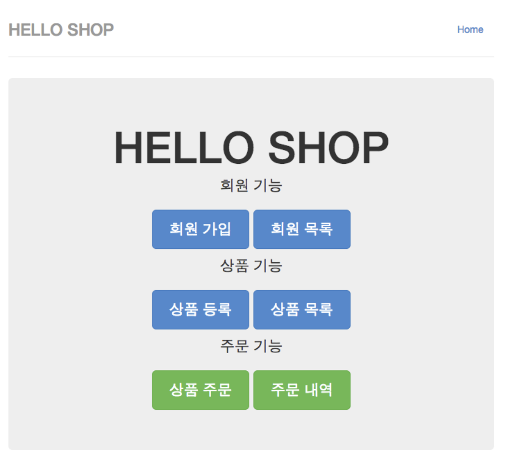<br>

### 도메인 모델 분석

- 회원과 주문의 관계: 회우너은 여러 번 주문할 수 있다. (일대다)
- 주문과 상품의 관계: 주문할 때 여러 상품을 선택할 수 있다. 반대로 같은 삼품도 여러 번 주문될 수 있다. 주문상품이라는 모델을 만들어서 다대다 관계를 일대다, 다대일 관계로 풀어냄

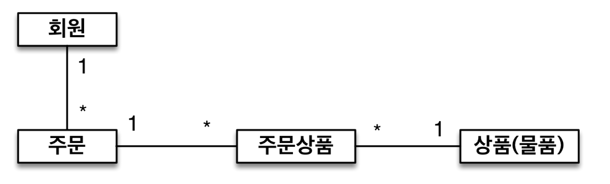<br>

### 테이블 설계

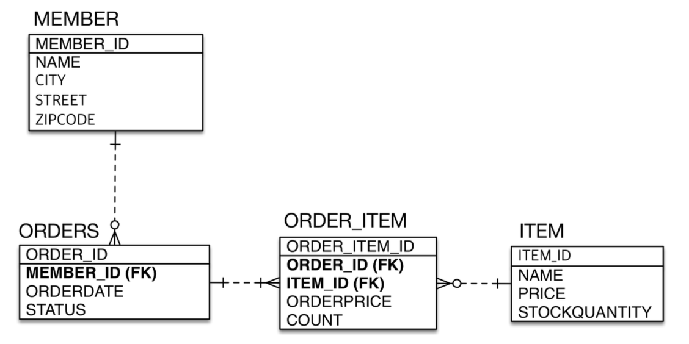<br>

### 엔티티 설계와 매핑

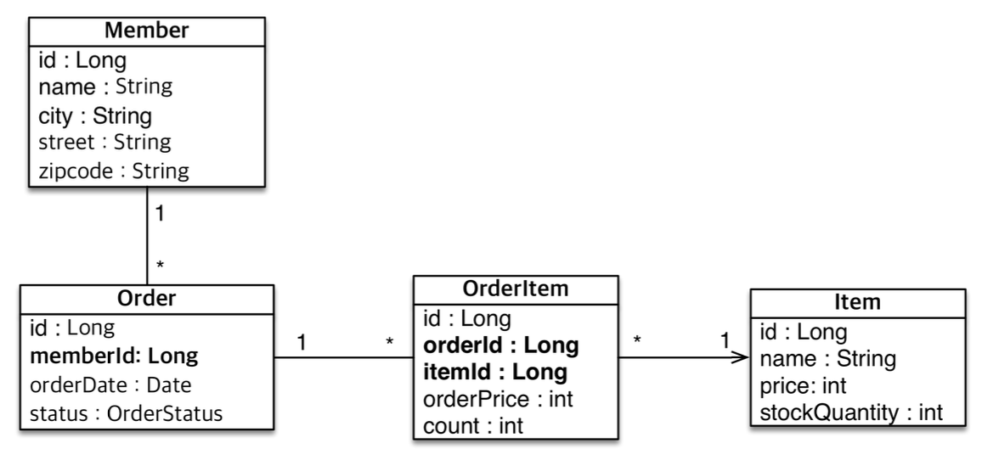<br>

### 데이터 중심 설계의 문제점

- 현재 방식은 객체 설계를 테이블 설계에 맞춘 방식
- 테이블의 외래키를 객체애 그대로 가져옴
- 객체 테이블 탐색이 불가능
- 참조가 없으므로 UML도 잘못됨

# 연관관계 매핑 기초

## 연관관계가 필요한 이유

**객체지향 설계외 목표는 자율적인 객체들의 협력 공동체를 만드는 것이다.**


### 예제 시나리오

- 회원과 팀이 있다
- 회원은 하나의 팀에만 소속될 수 있다.
- 회원과 팀은 다대일 관계다.

### 객체를 테이블에 밪추어 모델링

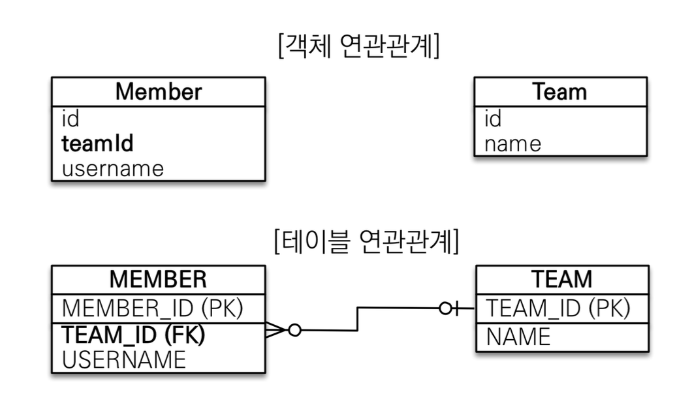<br>

### 객체를 테이블에 맞추어 모델링

(참고 대신에 외래 키를 그대로 사용)

```java
@Entity
public class Member {

    @Id @GeneratedValue
    private Long id;


    @Colum(name = "USERNAME")
    private String name;

    @Colum(name = "TEAM_ID")
    private Long teamId;
    
    ....
}

@Entity
public class Team {

    @Id @GeneratedValue
    private Long id;
    private String name;

    ...
}

```

```java
//팀 저장
Team team = new Team();
team.setName("TeamA");
em.persist(team);

//회원저장
Member member = new Member();
member.setName("member1");
member.setTeamId(team.getId());
em.persist(member);

//조회
Member findMember = em.find(Member.class, member.getId());

//연관관계가 없음
Team findTeam = em.find(Team.class, team.getId());
```

**객체를 테이블에 맞추어 데이터 중심으로 모델링하면, 협력 관계를 만들 수 없다.

- **테이블은 외래 키로 조인**을 사용해서 연관된 테이블을 찾는다.
- **객체는 참조**를 사용해서 연관된 객체를 찾는다.
- 테이블과 객체 사이에는 이런 큰 간격이 있다.

## 단방향 연관관계

### 객체 지향 모델링

(객체 연관관계 사용)

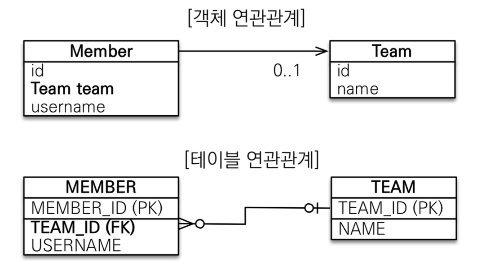<br>

```java
//팀저장
Team team = new Team();
team.setName("TeamA");
em.persist(team);

//회원 저장
Member member = new Member();
member.setName("member1")
member.setTeam(team); //단방향 연관관계 설정, 참조 저장
em.persist(member);

//조회
Member findMember = em.find(Member.class, member.getId());

//참조를 사용해서 연관관계 조회
Team findTeam = findMember.getTeam();
```

## 양방향 연관관계와 연관관계 주인

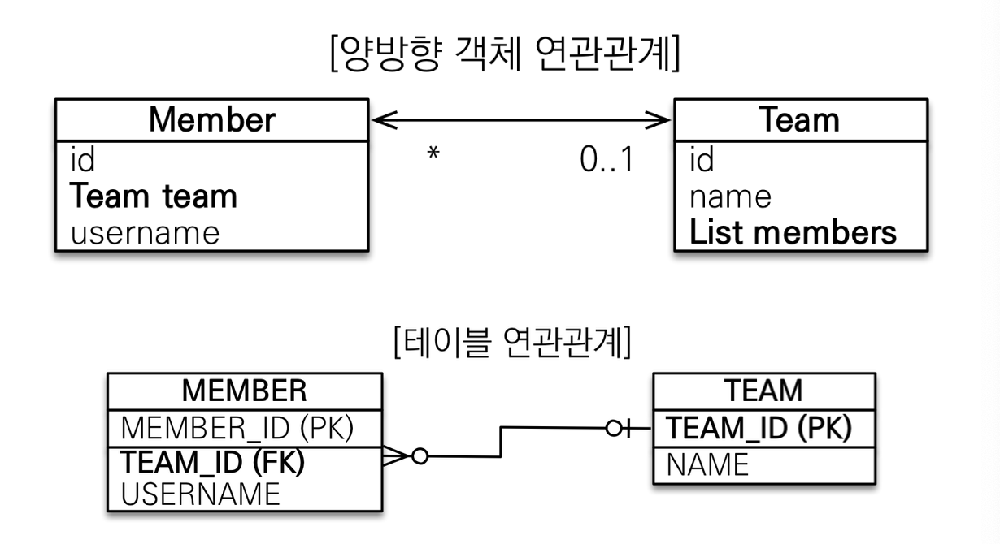<br>


```java
@Entity
public class Member {

    @Id @GeneratedValue
    private Long id;

    @Column(name = "USERNAME")
    private String name;

    @ManyToOne
    @JoinColumn(name = "TEAM_ID")
    private Team05 team;

    ...
}


@Entity
public class Team {

    @Id
    @GeneratedValue
    @Column(name = "TEAM_ID")
    private Long id;

    private String name;

    @OneToMany(mappedBy = "team")
    private List<Member05> members = new ArrayList<>();

    ...
}
```

```java
Team team = new Team();
team.setName("TeamA");
em.persist(team);

//회원저장
Member05 member = new Member05();
member.setName("member1");
member.setTeam(team); //단방향 연관관계 설정, 참조 저장
em.persist(member);

em.flush();
em.clear();

//조회
Team findTeam = em.find(Team.class, team.getId());

int memberSize = findTeam.getMembers().size();
System.out.println("memberSize = " + memberSize);
```

### 객체와 테이블이 관계를 맺는 차이

- 객체 연관관계 2개
  - 회원 -> 팀 연관관계 1개(단방향)
  - 팀 -> 회원 연관관계 1개(단방향)
- 테이블 연관관계 = 1개
  - 회원 <-> 팀의 연관관계 1개(양방향)

<br>

### 객체의 양방향 관계

객체의 **양방향 관계는 사실 양방향 관계가 아니라 서로 다른 단방향 관계2개다.**

객체를 양방향으로 참조하려면 **단방향 연관관계 2개**를 반들어야 한다.

A -> B (a.getB())

```java
class A {
    B b;
}
```

B -> A (b.getA())

```java
class B {
    A a;
}
```

### 테이블의 양방향 연관관계

테이블은 **외래 키 하나**로 두 테이블의 연관관계를 관리

MEMBER.TEAM_ID 외래 키 하나로 양방향 연관관계 가짐(양쪽으로 조인할 수 있다.)

```sql
SELECT *
FROM MEMBER M
JOIN TEAM T ON M.TEAM_ID = T.TEAM_ID

SELECT *
FROM TEAM T
JOIN MEMBER M ON T.TEAM_ID = M.TEAM_ID
```

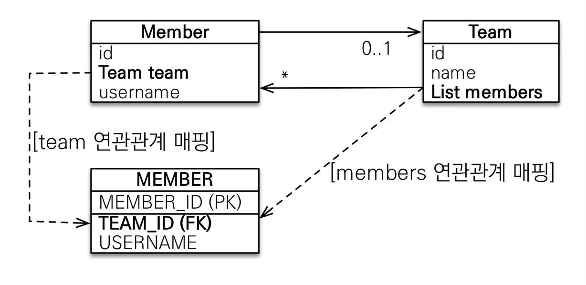<br>

### 연관관계 주인(Owner)

**양방향 매핑 규칙**

- 객체의 두 관계중 하나를 연관관계의 주인으로 지정
- **연관관계의 주인만이 외래 키를 관리(등록, 수정)**
- **주인이 아닌쪽은 읽기만 가능**
- 주인은 mappedBy 속성 사용 X
- 주인이 아니면 mappedBy속성으로 주인 지정

주인은 **외래 키**가 있는 곳을 주인으로 정해라

여기서는 **Member.team**이 연관관계의 주인

<br>

### 양방향 매핑시 가장 많이 하는 실수

(연관관계의 주인에 값을 입력하지 않음)

```java
Team team = new Team();
team.setName("TeamA");
em.persist(team);

Member member = new Member();
member.setName("member1");

//역방향(주인이 아닌 방향)만 연관관계 설정
team.getMembers().add(member);

em.persist(member);
```

| ID  | USERNAME | TEAM_ID  |
| :-- | :------- | :------- |
| 1   | member1  | **null** |

**양방향 매핑시 연관관계의 주인에 값을 입력해야 한다.**<br>(순수한 객체 관계를 고려하면 항상 양쪽 다 값을 입력해야 한다.)

```java
Team team = new Team();
team.setName("TeamA");
em.persist(team);

Member member = new Menber();
member.setName("member1");

team.getMembers().add(member);
//연관관계의 주인에 값 설정
member.setTeam(team); 

em.persist(member);
```

| ID  | USERNAME | TEAM_ID |
| :-- | :------- | :------ |
| 1   | member1  | **2**   |

- **순수 객체 상태를 고려해서 항상 양쪽에 값을 설정하자**
- 연관관계 편의 메소드를 생성하자
- 양방향 매핑시에 무한 루프를 조심하자
  - 예: toString(), lombok, JSON 생성 라이브러리

### 양방향 매핑 정리

- **단방향 매핑만으로도 이미 연관관계 매핑은 완료**
- 양방향 매핑은 반대 방향으로 조회(객체 그래프 탐색) 기능이 추가된 것 뿐
- JPQL에서 역방향으로 탐색할 일이 많음
- 단방향 매핑을 잘 하고 양방향은 필요할 때 추가해도 됨(테이블에 영향을 주지 않음)

### 연관관계의 주인을 정하는 기준

- 비즈니스 로직을 기준으로 연관관계의 주인을 선택하면 안됨
- **연관관계의 주인은 외래 키의 위치를 기준으로 정해야함**

## 실전예제2 - 연관관계 매핑 시작

## 테이블 구조

테이블 구조는 이전과 같다. 

<br>

## 객체 구조

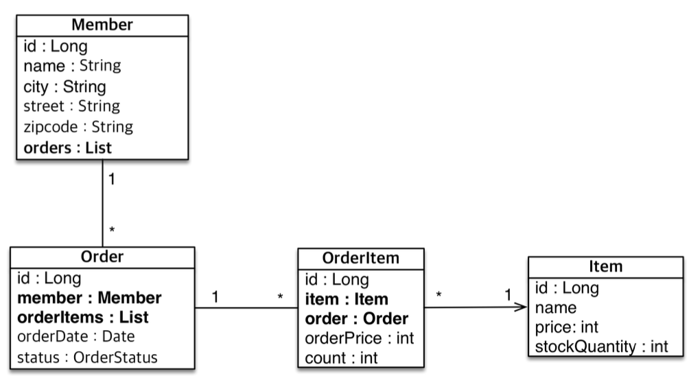<br>

# 다양한 연관관계 매핑

## 연관관계 매핑시 고려사항 3가지

- 다중성
- 단방향, 양방향
- 연관관계 주인

### 다중성

- 다대일: @ManyToOne
- 일대다: @OneToMany
- 일대일: @OneToOne
- 다대다: @ManyToMany

### 단방향, 양방향

- **테이블**
  - 외래 키 하나로 양쪽 조인 가능
  - 사실 방향이라는 개념이 없음
- **객체**
  - 참조용 필드가 있는 쪽으로만 참조 가능
  - 한쪽만 참조하면 단방향
  - 양쪽이 서로 참조하면 양방향

### 연관관계 주인

- 테이블은 **외래 키 하나**로 두 테이블이 연관관계를 맺음
- 객체 양방향 관계는 A->B, B->A처럼 **참조가 2군데**
- 객체 양방향 관계는 참조가 2군데 있음, 둘 중 테이블의 외래 키를 관리할 곳을 지정해야 함
- 연관관계의 주인: 외래 키를 관리하는 참조
- 주인의 반대편: 외래 키에 영향을 주지 않음, 단순 조회만 가능

## 다대일 [N:1]

### 다대일 단방향

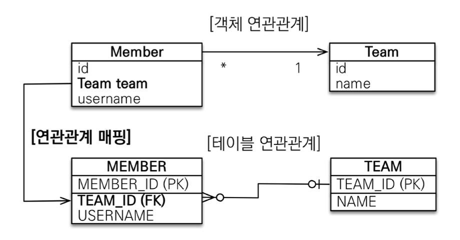<br>

- 가장 많이 사용하는 연관관계
- **다대일**의 반대는 **일대다**

### 다대일 양방향

<br>

- 외래 키가 있는 쪽이 연관관계 주인
- 양쪽을 서로 참조하도록 개발