# JPA 시작

## 프로젝트 생성

앞으로 H2데이터베이스와 메이븐을 사용해서 개발 할 것이다.

### 라이브러리 추가 (pom.xml)

```xml
<?xml version="1.0" encoding="UTF-8"?>
<project xmlns="http://maven.apache.org/POM/4.0.0"
         xmlns:xsi="http://www.w3.org/2001/XMLSchema-instance"
         xsi:schemaLocation="http://maven.apache.org/POM/4.0.0 http://maven.apache.org/xsd/maven-4.0.0.xsd">
    <modelVersion>4.0.0</modelVersion>

    <groupId>org.example</groupId>
    <artifactId>your-project</artifactId>
    <version>1.0-SNAPSHOT</version>

    <properties>
        <maven.compiler.source>11</maven.compiler.source>
        <maven.compiler.target>11</maven.compiler.target>
    </properties>

    <dependencies>
        <!-- Hibernate -->
        <dependency>
            <groupId>org.hibernate</groupId>
            <artifactId>hibernate-core</artifactId>
            <version>5.6.14.Final</version>
        </dependency>

        <!-- H2 -->
        <dependency>
            <groupId>com.h2database</groupId>
            <artifactId>h2</artifactId>
            <version>2.1.214</version>
        </dependency>
    </dependencies>
</project>
```

### JPA설정하기 - (persistence.xml)

`/META-INF/persistence.xml`

데이터 베이스 설정

```xml
<?xml version="1.0" encoding="UTF-8"?>
<persistence xmlns="http://xmlns.jcp.org/xml/ns/persistence" version="2.1">

    <persistence-unit name="jpabook">
        <properties>
            <!-- H2 데이터베이스 설정 -->
            <property name="javax.persistence.jdbc.driver" value="org.h2.Driver" />
            <property name="javax.persistence.jdbc.url" value="jdbc:h2:tcp://localhost/~/test" />
            <property name="javax.persistence.jdbc.user" value="sa" />
            <property name="javax.persistence.jdbc.password" value="" />
            <property name="hibernate.dialect" value="org.hibernate.dialect.H2Dialect" />

            <!-- 옵션 -->
            <property name="hibernate.show_sql" value="true" />
            <property name="hibernate.format_sql" value="true" />
            <property name="hibernate.use_sql_comments" value="true" />
            <property name="hibernate.id.new_generator_mappings" value="true" />
            <property name="hibernate.hbm2ddl.auto" value="create" />
        </properties>
    </persistence-unit>
</persistence>
```

### 데이터베이스 방언

- JPA는 특정 데이터베이스에 종속 x
- 각각의 데이터베이스가 제공하는 SQL 문법과 함수는 조금씩 다름
  - 가변 문자: MySQL은 VARCHAR, Oracle은 VARCHHAR2
  - 문자열을 자르는 함수: SQL표준은 SUBSTRING(), Oracle은 SUBSTR()
  - 페이징: MySQL은 LIMIT, Oracle은 ROWNUM

> 방언(dialect): SQL 표준을 지키지 않는 특정 데이터베이스만의 고유한 기능

<br>

- **hibernate.dialect**속성에 지정
  - H2: org.hibernate.dialect.H2Dialect
  - Oracle 10g: org.hibernate.dialect.Oracle10gDialect
  - MySQL: org.hibernate.dialect.MYSQL5InnoDBDialect
- 하이버네이트는 40가지 이상의 데이터베이스 방언 지원

## 애플리케이션 개발

### JPA 구동 방식

<br>

### Member 클래스 생성

```java
package jpabasic.ex1hellojpa;

import jakarta.persistence.Column;
import jakarta.persistence.Entity;
import jakarta.persistence.Id;
import jakarta.persistence.Table;

@Entity
@Table(name = "MEMBER")
public class Member {

    @Id
    @Column(name = "ID")
    private String id;

    @Column(name = "NAME")
    private String username;

    private Integer age;

    // getter, setter
}
```

```sql
CREATE TABLE MEMBER (
                        ID VARCHAR(255) NOT NULL, --아이디(기본 키)
                        NAME VARCHAR(255),        --이름
                        AGE INTEGER NOT NULL,     --나이
                        PRIMARY KEY (ID)
)
```

- **@Entity**: JPA가 관리할 객체
- **@Id**: 데이터베이스 PK와 매핑

### 회원 저장

- 회원 등록
- 회원 수정
- 회원 삭제
- 회원 단 건 조회

```java

public class JpaMain {

    public static void main(String[] args) {

        //엔티티 매니저 팩토리 생성
        EntityManagerFactory emf = Persistence.createEntityManagerFactory("jpabook");
        EntityManager em = emf.createEntityManager(); //엔티티 매니저 생성

        EntityTransaction tx = em.getTransaction(); //트랜잭션 기능 획득
        tx.begin();

        Member member = new Member();
        member.setId(1L);
        member.setName("TestA");

        //등록
        em.persist(member);

        tx.commit();

        em.close();
        emf.close();
    }
}
```

- **엔티티 매니저 팩토리**는 하나만 생성해서 애플리케이션 전체에서 공유
- **엔티티 매니저**는 쓰레드간에 공유x(사용하고 버려야 한다.)
- **JPA의 모든 데이터 변경은 트랜잭션 안에서 실행**(`tx.begin() - tx.commit()`)

### 회원 단건 조회

```java
public class JpaMain {

    public static void main(String[] args) {
        EntityManagerFactory emf = Persistence.createEntityManagerFactory("jpabook");
        EntityManager em = emf.createEntityManager();

        EntityTransaction tx = em.getTransaction();
        tx.begin();

        try {
            Member findMember = em.find(Member.class, 1L);
            System.out.println("findMember.id = " + findMember.getId());
            System.out.println("findMember.name = " + findMember.getName());

            tx.commit();
        } catch (Exception e) {
            tx.rollback();
        } finally {
            em.close();
        }
        
        emf.close();
    }
}
```

트랜잭션에서 문제가 발생했을 경우 트랜잭션을 ROLLBACK해야 한다. 또한 문제 여부와 상관없이 `EntityManager`를 닫아서 DB Connection을 종료해야 한다.

### 회원 삭제

```java
public class JpaMain {

    public static void main(String[] args) {
        EntityManagerFactory emf = Persistence.createEntityManagerFactory("jpabook");
        EntityManager em = emf.createEntityManager();

        EntityTransaction tx = em.getTransaction();
        tx.begin();

        try {
            Member findMember = em.find(Member.class, 1L);
			em.remove(findMember);
            
            tx.commit();
        } catch (Exception e) {
            tx.rollback();
        } finally {
            em.close();
        }
        
        emf.close();
    }
}
```

### 회원 수정

```java
public class JpaMain {

    public static void main(String[] args) {
        EntityManagerFactory emf = Persistence.createEntityManagerFactory("jpabook");
        EntityManager em = emf.createEntityManager();

        EntityTransaction tx = em.getTransaction();
        tx.begin();

        try {
            Member findMember = em.find(Member.class, 1L);
			findMember.setName("HelloJPA");
            
            tx.commit();
        } catch (Exception e) {
            tx.rollback();
        } finally {
            em.close();
        }
        
        emf.close();
    }
}
```

자바 객체를 수정하듯이 DB를 수정할 수 있다. JPA를 통하여 객체를 가져올 경우 JPA에서 객체를 관리하여 트랜잭션 시점에 객체의 변경 여부를 감지하여 객체가 변경되었을 경우 UPDATE 쿼리를 생성한다.

### 회원 다수 조회

```java
public class JpaMain {

    public static void main(String[] args) {
        EntityManagerFactory emf = Persistence.createEntityManagerFactory("jpabook");
        EntityManager em = emf.createEntityManager();

        EntityTransaction tx = em.getTransaction();
        tx.begin();

        try {
			List<Member> result = em.createQuery("select m from Member as m", Member.class).getResultList();
            
			for (Member member : result) {
                System.out.println("member.name = " + member.getName());
            }
            
            tx.commit();
        } catch (Exception e) {
            tx.rollback();
        } finally {
            em.close();
        }
        
        emf.close();
    }
}
```

JPQL을 사용해서 다수의 객체를 조회하고 있다.

### JPQL

가장 단순한 조회 방법은 EntityManager.find(), 객체 그래프 탐색 방법은 a.getB().getC()이다.<br>하지만 만약에, 나이가 18살 이상인 회원을 모두 검색하고 싶으면 JPQL가 필요하다.

- JPA를 사용하면 엔티티 객체를 중심으로 개발
  - 문제는 검색 쿼리
  - JPA가 검색을 할 때도 테이블이 아닌 엔티티 객체를 대상으로 검색
  - 그러나 모든 DB데이터를 객체로 변환해서 검색하는 것은 불가능
  - 애플리케이션이 필요한 데이터만 DB에서 불러오려면 결국 검색 조건이 포함된 SQL이 필요하다.
- JPQL
  - JPA는 SQL을 추상화한 JPQL이라는 객체 지향 쿼리 언어 제공
  - SQL문법과 유사 SELECT, FROM, WHERE 등등 지원
  - JPQL은 엔티티 객체를 대상으로 쿼리
  - SQL은 데이터베이스 테이블을 대상으로 쿼리
  - 테이블이 아닌 객체를 대상으로 검색하는 객체 지향 쿼리
  - SQL을 추상화해서 특정 데이터베이스 SQL에 의존하지 않음
  - JPQL을 한마디로 정의하면 객체 지향 SQL

# 영속성 관리

## 영속성 컨텍스트

JPA에서 가장 중요한 2가지

- 객체외 관계형 데이터베이스 매핑하기 (정적인 영역)
- **영속성 컨텍스트** (동적인 영역)

### 엔티티 매니저 팩토리와 엔티티 매니저

<br>

웹 애플리케이션에서 요청이 들어온 경우 엔티티 매니저 팩토리는 고객의 요청이 들어올 때마다 엔티티 매니저를 생성하고 엔티티 매니저는 DB 커넥션 풀을 사용하여 DB에 접근한다.


### 영속성 컨텍스트

- JPA를 이해하는데 가장 중요한 용어
- 엔티티를 영구 저장하는 환경
- `EntityManager.persist(entity)`: 엔티티를 영속성 컨텍스트에 저장한다는 의미

영속성 컨텍스트는 논리적인 개념으로 **눈에 보이지 않음**.<br>엔티티 매니저를 통해서 영속성 컨텍스트에 접근

### 엔티티의 생명 주기

 - **비영속**(new/transient)
   - 영속성 컨텍스트와 전혀 관계가 없는 **새로운**싱테
 - **영속**(managed)
   - 영속성 컨텍스트에 **관리**되는 상태
 - **준영속**(detached)
   - 영속성 컨텍스트에 저장되었다가 **분리**된 상태
 - **삭제**(removed)
   - **삭제**된 상태

<br>

### 비영속

영속성 컨텍스트와 전혀 관계가 없는 새로운 상태

<br>

### 영속

영속성 컨텍스트에 관리되는 상태

<br>

### 준영속, 삭제

- 준영속: 영속성 컨텍스트에 저장되었다가 분리된 상태
- 삭제: 삭제된 상태

<br>

### 영속성 컨텍스트의 이점

- 1차 캐시
- 동일성(identity)보장
- 트랜잭션을 지원하는 쓰기 지연(transactional write-behind)
- 변경 감지(Dirty Checking)
- 지연 로딩(Lazy Loading)

#### 1차 캐시

영속성 컨텍스트는 내부에 1차 캐시라는 것을 들고있다. (Map 형태)<br>1차 캐시 내부에는(엔티티 객체의 PK정보, 엔티티 객체, 최초 1차 캐시에 들오온 시점의 엔티티 정보)등이 있다.

<br>

```java
//엔티티를 생성한 상태 (비영속)
Member member = new Member();
member.setId("member1");
member.setName("회원1");

//엔티티를 영속
em.persist(member);
```

<br>

```java
Member member = new Member();
member.setId("member1");
member.setUsername("회원1");

//1차 캐시에 저장됨
em.persist(member);

//1차 캐시에서 조회
Member findMember = em.find(Member.class, "member1");
```

JPA에서 조회를 할 경우 바로 DB에 접근하지 않고 영속성 컨텍스트 내의 1차 캐시에 접근한다.

<br>

```java
Member findMember2 = em.find(Member.class, "member2");
```

그러나 엔티티 매니저는 트랜잭션 단위로 존재하므로 어플리케이션 전체에서 공유하는 캐시(2차 캐시)와 달리 성능의 이점은 크지 않다.

#### 영속 엔티티의 동일성 보장

```java
Member a = em.find(Member.class, "member1");
member b = em.find(Member.class, "member1");
System.out.println(a == b); //동일성 비교 true
```

1차 캐시로 반복 가능한 읽기(REPEATEABLE READ)등급의 트랜잭션 격리 수준을 데이터베이스가 아닌 애플리케이션 차원에서 제공

#### 트랜잭션을 지원하는 쓰기 지연

```java
EntityManager em = emf.createEntityManager();
EntityTranscation transaction = em.getTransaction();
//엔티티 매니저는 데이터 변경시 트랜잭션을 시작해야 한다.
transaction.begin(); //[트랜잭션] 시작

em.persist(memberA);
em.persist(memberB);
//여기까지 INSERT SQL을 데이터베이스에 보내지 않는다.

//커밋하는 순간 데이터베이스에 INSERT SQL을 보낸다.
transaction.commit(); //[트랜잭션] 커밋
```

<br>

<br>

#### 변경 감지(Dirty Checking)

```java
EntityManager dm = dmf.createEntityManager();
EntityTransaction transaction = em.getTransaction();
transaction.begin(); //[트랜잭션] 시작

//영속 엔티티 조회
Member memberA = em.find(Member.class, "memberA");

//영속 엔티티 데이터 수정
memberA.setUsername("hi");
memberA.setAge(10);

//em.update(member) 이런 코드가 있어야 하지 않을까?

transaction.commit(); //[트랜잭션] 커밋
```

<br>

### 플러시

영속성 컨텍스트의 변경내용을 데이터베이스에 반영

#### 플러시 발생

- 변경 감지
- 수정된 엔티티 쓰기 지연 SQL 저장소에 등록
- 쓰기 지연 SQL저장소의 쿼리를 데이터 베이스에 전송(등록, 수정, 삭제 쿼리)

#### 영속성 컨텍스트를 플러시하는 방법

- `em.flush()` - 직접 호출, 일반적인 경우에는 사용하지 않으나 테스트할 때 사용할 수 있음
- 트랜잭션 커밋 - 플리시 자동 호출
- JPQL 쿼리 실행 - 플리시 자동 호출

#### JPQl 쿼리 실행시 플러시가 자동으로 호출하는 이유

```java
em.persist(memberA);
em.persist(memberB);
em.persist(memberC);

//중간에 JPQL 실행
query = em.createQuery("select m from  Member m". Member.class);
List<Member> members = query.getResultList();
```

위의 코드를 보면 JPQl실행시 플러시가 호출되지 않으면 persist로 영속성 컨텍스트에 반영된 내용은 가져올 수 없다.

### 플러시 모드 옵션

```java
em.setFlushMode(FlushModeType.COMMIT)
```

- FlushModeType.AUTO: 커밋이나 쿼리를 실행할 때 플리서(기본값, 변경할 일은 거의 없다.)
- FlushModeType.COMMIT: 커밋할 때만 플러시

### 정리

**플러시**

- 영속성 컨텍스트를 비유지 않음
- 영속성 컨텍스트의 변경내용을 데이터베이스에 동기화
- 트랜잭션이라는 작업 단위가 중요 -> 커밋 직전에만 동기화하면 됨

### 준영속 상태

- 영속 -> 준영속
- 영속 상태의 엔티티가 영속성 컨텍스트에서 분리(detached)
- 영속성 컨텍스트가 제공하는 기능을 사용 못함

#### 준영속 상태로 만드는 방법

- `em.detach(entity)`: 특정 엔티티만 준영속 상태로 전환
- `em.clear()`: 영속성 컨텍스트를 완전히 초기화
- `em.close()`: 영속성 컨텍스트를 종료

# 엔티티 매핑

- 객체와 테이블 매핑: **@Entity**, **@Table**
- 필드와 컬럼 매핑: **@Column**
- 기본 키 매핑: **@Id**
- 연관관계 매핑: **ManyToOne**, **@JoinColumn**

## 객체와 테이블 매핑

### @Entity

- @Entity가 붙은 클래스는 JPA가 관리한다.
- JPA를 사용해서 테이블과 매핑할 클래스는 **@Entity**필수
- **주의**
  - **기본 생성자 필수**(파라미터가 없는 public또는 protected생성자)
  - final 클래스, enum, interface, inner 클래스 사용 x
  - 저장할 필드에 final 사용 x

### @Entity 속성 정리

속성: name

- JPA에서 사용할 엔티티 이름을 지정한다.
- 기본 값: 클래스 이름을 그대로 사용(예: Member)
- 같은 클래스 이름이 없으면 가급적 기본값을 사용한다.

### @Table

@Table은 엔티티와 매핑할 테이블 지정

|속성|기능|기본값|
|:----|:------|:--|
|name|매핑할 테이블 이름|엔티티 이름을 사용|
|catalog|데이터베이스 catalog 매핑| |
|schema|데이터베이스 schema매핑| |
|uniqueConstraints(DDL)|DDL생성 시에 유니크 제약 조건 생성| |

## 데이터베이스 스키마 자동 생성

- DDL을 애플리케이션 실행 시점에 자동 생성
- 테이블 중심 -> 객체 중심
- 데이터베이스 방언을 활용해서 데이터베이스에 맞는 적절한 DDL 생성
- 이렇게 **생성된 DDL은 개발 장비에서만 사용**
- 생성된 DDL은 운영서버에서는 사용하지 않거나, 적절히 다듬은 후 사용

### 속성

`hibernate.hbm2ddl.auto`

|옵션|설명|
|:---|:---|
|create|기존 테이블 삭제 후 다시 생성(DROP + CREATE)|
|create-drop|create와 같으나 종료 시점에 테이블 DROP|
|update|변경분만 반영(운영DB에는 사용하면 안됨)|
|validate|엔티티와 테이블이 정상 매핑되었는지만 확인|
|none|사용하지 않음|

**주의!**

- 운영장비에는 절대 create, create-drop, update 사용하면 안 된다.
- 개발 초기 단계는 create or update
- 테스트 서버는 update or validate
- 스테이징과 운영 서버는 validate or none

### DDL 생성 기능

- 제약조건 추가: 회원 이름은 필수, 10자 초과x: `@Column(nullable = false, length = 10)`
- 유니크 제약조건 추가: `@Table(uniqueConstraints = {@UniqueConstraint(name = "NAME_AGE_UNIQUE", columnNames = {"NAME", "AGE"} )})`
- DDL 생성 기능은 DDL을 자동 생성할 때만 사용되고 JPA의 생성 로직에는 영향을 주지 않는다.

## 필드와 컬럼 매핑

### 요구 사항 추가

- 회원은 일반 회원과 괸라자로 구분해야 한다.
- 회원 가입일과 수정일이 있어야 하낟.
- 회원을 설명할 수 있는 필드가 있어야 한다. 이 필드는 길이 제한이 없다.

```java
public enum RoleType {
    ADMIN, USER
}
```

```java
@Entity
@Table(name = "MEMBER04", uniqueConstraints = {@UniqueConstraint(
        name = "NAME_AGE_UNIQUE",
        columnNames = {"NAME", "AGE"})})
public class Member04 {

    @Id
    @Column(name = "ID")
    private String id;

    @Column(name = "NAME", nullable = false, length = 10)
    private String username;

    private Integer age;

    @Enumerated(EnumType.STRING)
    private RoleType roleType;

    @Temporal(TemporalType.TIMESTAMP)
    private Date createdDate;

    @Temporal(TemporalType.TIMESTAMP)
    private Date lastModifiedDate;

    @Lob
    private String description;

    @Transient
    private String temp;

    //Getter, Setter
```

```java
public class JpaMain {

    public static void main(String[] args) {

        EntityManagerFactory emf = Persistence.createEntityManagerFactory("jpabook");
        EntityManager em = emf.createEntityManager();
        EntityTransaction tx = em.getTransaction();

        try {
            tx.begin();
            Member04 member = new Member04();
            member.setId(1L);
            member.setUsername("A");
            member.setAge(10);
            member.setRoleType(RoleType.ADMIN);

            System.out.println("memberID = " + member.getId());
            em.persist(member);

            tx.commit();
        } catch (Exception e) {
            tx.rollback();
            System.out.println("e = " + e);
            System.out.println("====롤백 수행==");
        } finally {
            em.close();
        }
        emf.close();
    }
}
```

### 매핑 어노테이션 정리

`hibernate.hdm2ddl.auto`

|어노테이션|설명|
|:----|:---|
|@Column|컬럼 매핑|
|@Temporal|날짜 타입 매핑|
|@Enumerated|enum 타입 매핑|
|@Lob|BLOG, CLOG 매핑|
|@Transient|특정 필드를 컬럼에 매핑하지 않음(매핑 무시)|

#### @Column

|속성|설명|기본값|
|:--|:--|:--|
|name|필드와 매핑할 테이블의 컬럼 이름|객체의 필드 이름|
|insertable,<br>updateable|등록, 변경 가능 여부|TRUE|
|nullable(DDL)|null 값의 허용 여부를 설정한다. false로 설정하면 DDL생성시에 not null제약조건이 붙는다.||
|unique(DDL)|@Table의 uniqueConstraints와 같지만 한 컬럼에 간단히 유니크 제약조건을 걸 때 사용한다.||
|columnDefinition(DDL)|데이터베이스 컬럼 정보를 직접 줄 수 있다.<br>ex) varchar(100) default 'EMPTY'|필드의 자바 타입과 방언 정보를 사용함|
|length(DDL)|문자 길이 제약조건, String 타입에만 사용한다.|255|
|percision scale(DDL)|BigDecimal 타입에서 사용한다.(BigInteger도 사용할 수 있다.)<br>precision은 소수점을 포함한 전체 자리수를, scale은 소수의 자릿수다.<br> 참고로 double, float타입에는 적용되지 않는다. 아주 큰 숫자나 정밀한 소수를 다루어야 할 때만 사용한다.|percision=19,<br>scale=2|

#### @Enumerated

자바 enum 타입을 매핑할 때 사용

> [!CAUTION]
> ORDINAL 사용X

|속성|설명|기본값|
|:-----|:----|:-----|
|value|- EnumType.ORIDINAL: enum순서를 데이터베이스에 저장<br>- EnumType.STRING: enum 이름을 데이터베이스에 저장|EnumType.ORDINAL|

#### @Temporal

날짜 타입(java.util.Data, java.util.Calendar)을 매핑할 때 사용

참고: LocalDate, LocalDateTime을 사용할 때는 생략 가능(최신 하이버네이트 지원)

|속성|설명|기본값|
|:-----|:----|:-----|
|value|- **TemporalType.DATE**: 날짜, 데이터베이스 date타입과 매핑(2013-10-11)<br>- **TemporalType.TIME**: 시간, 데이터베이스 time타입과 매핑(11:11:11)<br>- **TemporalType.**: 날짜와 시작, 데이터베이스 timestamp 타입과 매핑(2013-10-11 11:11:11)||

#### @Lob

데이터베이스 BLOB, CLOB 타입이 매핑

- @Lob에는 지정할 수 있는 속성이 없다.
- 매핑하는 필드 타입이 문자면 CLOB매핑, 나머지는 BLOB 매핑
  - CLOB: String, char[], java.sql.CLOB
  - BLOB: byte[], java.sql. BLOB

#### @Transient

- 필드 매핑 X
- 데이터베이스에 저장X, 조회X
- 주로 메모리상에만 임시로 어떤 값을 보관하고 싶을 때 사용

## 기본 키 매핑

### 기본 키 매핑 어노테이션

- @Id
- @GeneratedValue

```java
@Id
@GeneratedValue(strategy = GenerationType.AUTO)
private Long id;
```

### 기본 키 매핑 방법

- 직접 할당: **@Id**만 사용
- 자동 생성(**@GeneratedValue**)
  - **IDENTITY**: 데이터베이스에 위임, MYSQL
  - **SEQUENCE**: 데이터베이스 시퀀스 오브젝트 사용, ORACLE
    - @SequenceGenerator 필요
  - **TABLE**: 키 생성용 테이블 사용, 모든 DB에서 사용
    - @TableGenerator 필요
  - **AUTO**: 방언에 따라 자동 지정, 기본값

#### IDENTITY 전략

- 기본 키 생성을 데이터베이스에 위임
- 주로 MYSQL, PostgreSQL, SQL Server, DB2에서 사용<br>(예: MYSQL의 AUTO_INCREMENT)
- JPA는 보통 트랜잭션 커밋 시점에 INSERT SQL 실행
- AUTO)INCREMENT는 데이터베이스에 INSERT_SQL을 실행한 후에 ID 값을 알 수 있음
- IDENTITY전략은 em.persit()시점에 즉시 INSERT SQL 실행하고 DB에서 식별자를 조회

```java
@Entity
public class Member {
    @Id
    @GeneratedValue(strategy = GenerationType.IDENTITY)
    private Long id;
}
```

#### SEQUENCE 전략

- 데이터베이스 시퀀스는 유일한 값을 순서대로 생성하는 특별한 데이터베이스 오브젝트 (ex: 오라클 시퀀스)
- 오라클, PostgreSQL, DB2, H2데이터베이스에서 사용

```java
@Entity
@SequenceGenerator(
    name = "MEMBER_SEQ_GENERATOR",
    sequenceName = "MEMBER_SEQ", //매핑할 데이터베이스 시퀀스 이름
    initalValue = 1, allocationsize = 1)
public class Member {
    @Id
    @GeneratedValue(strategy = GenerationType.SEQUENCE,
            generator = "MEMBER_SEQ_GENERATOR")
    private Long id;
}
```

| 속성            | 설명                                                                                                                                                    | 기본값 |
| :-------------- | :-------------------------------------------------------------------------------------------------------------------------------------- | :----------------- |
| name            | 식별자 생성기 이름                                                                                                                          | 필수                 |
| sequenceName    | 데이터베이스에 등록되어 있는 시퀀스 이름                                                                                                          | hibernate_sequence |
| initialValue    | DDL생성시에만 사용됨, 시퀀스 DDL을 생성할 때 처음 1 시작하는 수를 지정한다.                                                                             | 1                  |
| allocationSize  | 시퀀스를 한 번 호출에 증가하는 수(성능 최적화에 사용됨)<br>데이터베이스 시붠스 값이 하나씩 증가하도록 설정되어 있으면 이 값을 반드시 1로 설정해야 한다. | **50**             |
| catalog, schema | 데이터베이스 catalog, schema 이름 |                    |

#### TABLE 전략

- 키 생성 전용 테이블을 하나 만들어서 데이터베이스 시퀀스를 흉내내는 전략
- 장점: 모든 데이터베이스에 적용 가능
- 단점: 성능

```sql
create table MY_SEQUENCES (
    sequence_name varchar(255) not null
    next_val bigint,
    primary key ( sequence_name )
)
```

```java
@Entity
@TableGenerator(
    name = "MEMBER_SEQ_GENERATOR",
    table = "MY_SEQUENCES",
    pkColumnValue = "MEMber_SEQ", allocationSize = 1)
public class Member {
    @Id
    @GeneratedValue(strategy = GenerationType.TABLE,
                    generator = "MEMBER_SEQ_GENERATOR")
    private Long id;
}
```

### 권장하는 식별자 전략

- **기본 키 제약 조건**: null아님, 유일, **변하면 안된다**
- 미래까지 이 조건을 만족하는 자연키는 찾기 어렵다. 대리키(대체키)를 사용하자.
- 예를 들어 주민등록번호도 기본 키로 적절하지 않다.
- **권장: Long형 + 대체키 + 키 생성전략 사용**

## 실전 예제 - 1. 요구사항 분석과 기본 매핑

### 요구사항 분석

- 회원은 상품을 주문할 수 있다.
- 주문 시 여러 종료의 상품을 선택할 수 있다.

### 기능 목록

- 회원 기능
  - 회원 등록
  - 회원 조회
- 상품 기능
  - 상품 등록
  - 상품 수정
  - 상품 조회
- 주문 기능
  - 상품 주문
  - 주문 내역 조회
  - 주문 취소

<br>

### 도메인 모델 분석

- 회원과 주문의 관계: 회우너은 여러 번 주문할 수 있다. (일대다)
- 주문과 상품의 관계: 주문할 때 여러 상품을 선택할 수 있다. 반대로 같은 삼품도 여러 번 주문될 수 있다. 주문상품이라는 모델을 만들어서 다대다 관계를 일대다, 다대일 관계로 풀어냄

<br>

### 테이블 설계

<br>

### 엔티티 설계와 매핑

<br>

### 데이터 중심 설계의 문제점

- 현재 방식은 객체 설계를 테이블 설계에 맞춘 방식
- 테이블의 외래키를 객체애 그대로 가져옴
- 객체 테이블 탐색이 불가능
- 참조가 없으므로 UML도 잘못됨

# 연관관계 매핑 기초

## 연관관계가 필요한 이유

**객체지향 설계외 목표는 자율적인 객체들의 협력 공동체를 만드는 것이다.**


### 예제 시나리오

- 회원과 팀이 있다
- 회원은 하나의 팀에만 소속될 수 있다.
- 회원과 팀은 다대일 관계다.

### 객체를 테이블에 밪추어 모델링

<br>

### 객체를 테이블에 맞추어 모델링

(참고 대신에 외래 키를 그대로 사용)

```java
@Entity
public class Member {

    @Id @GeneratedValue
    private Long id;


    @Colum(name = "USERNAME")
    private String name;

    @Colum(name = "TEAM_ID")
    private Long teamId;
    
    ....
}

@Entity
public class Team {

    @Id @GeneratedValue
    private Long id;
    private String name;

    ...
}

```

```java
//팀 저장
Team team = new Team();
team.setName("TeamA");
em.persist(team);

//회원저장
Member member = new Member();
member.setName("member1");
member.setTeamId(team.getId());
em.persist(member);

//조회
Member findMember = em.find(Member.class, member.getId());

//연관관계가 없음
Team findTeam = em.find(Team.class, team.getId());
```

**객체를 테이블에 맞추어 데이터 중심으로 모델링하면, 협력 관계를 만들 수 없다.

- **테이블은 외래 키로 조인**을 사용해서 연관된 테이블을 찾는다.
- **객체는 참조**를 사용해서 연관된 객체를 찾는다.
- 테이블과 객체 사이에는 이런 큰 간격이 있다.

## 단방향 연관관계

### 객체 지향 모델링

(객체 연관관계 사용)

<br>

```java
//팀저장
Team team = new Team();
team.setName("TeamA");
em.persist(team);

//회원 저장
Member member = new Member();
member.setName("member1")
member.setTeam(team); //단방향 연관관계 설정, 참조 저장
em.persist(member);

//조회
Member findMember = em.find(Member.class, member.getId());

//참조를 사용해서 연관관계 조회
Team findTeam = findMember.getTeam();
```

## 양방향 연관관계와 연관관계 주인

<br>


```java
@Entity
public class Member {

    @Id @GeneratedValue
    private Long id;

    @Column(name = "USERNAME")
    private String name;

    @ManyToOne
    @JoinColumn(name = "TEAM_ID")
    private Team05 team;

    ...
}


@Entity
public class Team {

    @Id
    @GeneratedValue
    @Column(name = "TEAM_ID")
    private Long id;

    private String name;

    @OneToMany(mappedBy = "team")
    private List<Member05> members = new ArrayList<>();

    ...
}
```

```java
Team team = new Team();
team.setName("TeamA");
em.persist(team);

//회원저장
Member05 member = new Member05();
member.setName("member1");
member.setTeam(team); //단방향 연관관계 설정, 참조 저장
em.persist(member);

em.flush();
em.clear();

//조회
Team findTeam = em.find(Team.class, team.getId());

int memberSize = findTeam.getMembers().size();
System.out.println("memberSize = " + memberSize);
```

### 객체와 테이블이 관계를 맺는 차이

- 객체 연관관계 2개
  - 회원 -> 팀 연관관계 1개(단방향)
  - 팀 -> 회원 연관관계 1개(단방향)
- 테이블 연관관계 = 1개
  - 회원 <-> 팀의 연관관계 1개(양방향)

<br>

### 객체의 양방향 관계

객체의 **양방향 관계는 사실 양방향 관계가 아니라 서로 다른 단방향 관계2개다.**

객체를 양방향으로 참조하려면 **단방향 연관관계 2개**를 반들어야 한다.

A -> B (a.getB())

```java
class A {
    B b;
}
```

B -> A (b.getA())

```java
class B {
    A a;
}
```

### 테이블의 양방향 연관관계

테이블은 **외래 키 하나**로 두 테이블의 연관관계를 관리

MEMBER.TEAM_ID 외래 키 하나로 양방향 연관관계 가짐(양쪽으로 조인할 수 있다.)

```sql
SELECT *
FROM MEMBER M
JOIN TEAM T ON M.TEAM_ID = T.TEAM_ID

SELECT *
FROM TEAM T
JOIN MEMBER M ON T.TEAM_ID = M.TEAM_ID
```

<br>

### 연관관계 주인(Owner)

**양방향 매핑 규칙**

- 객체의 두 관계중 하나를 연관관계의 주인으로 지정
- **연관관계의 주인만이 외래 키를 관리(등록, 수정)**
- **주인이 아닌쪽은 읽기만 가능**
- 주인은 mappedBy 속성 사용 X
- 주인이 아니면 mappedBy속성으로 주인 지정

주인은 **외래 키**가 있는 곳을 주인으로 정해라

여기서는 **Member.team**이 연관관계의 주인

<br>

### 양방향 매핑시 가장 많이 하는 실수

(연관관계의 주인에 값을 입력하지 않음)

```java
Team team = new Team();
team.setName("TeamA");
em.persist(team);

Member member = new Member();
member.setName("member1");

//역방향(주인이 아닌 방향)만 연관관계 설정
team.getMembers().add(member);

em.persist(member);
```

| ID  | USERNAME | TEAM_ID  |
| :-- | :------- | :------- |
| 1   | member1  | **null** |

**양방향 매핑시 연관관계의 주인에 값을 입력해야 한다.**<br>(순수한 객체 관계를 고려하면 항상 양쪽 다 값을 입력해야 한다.)

```java
Team team = new Team();
team.setName("TeamA");
em.persist(team);

Member member = new Menber();
member.setName("member1");

team.getMembers().add(member);
//연관관계의 주인에 값 설정
member.setTeam(team); 

em.persist(member);
```

| ID  | USERNAME | TEAM_ID |
| :-- | :------- | :------ |
| 1   | member1  | **2**   |

- **순수 객체 상태를 고려해서 항상 양쪽에 값을 설정하자**
- 연관관계 편의 메소드를 생성하자
- 양방향 매핑시에 무한 루프를 조심하자
  - 예: toString(), lombok, JSON 생성 라이브러리

### 양방향 매핑 정리

- **단방향 매핑만으로도 이미 연관관계 매핑은 완료**
- 양방향 매핑은 반대 방향으로 조회(객체 그래프 탐색) 기능이 추가된 것 뿐
- JPQL에서 역방향으로 탐색할 일이 많음
- 단방향 매핑을 잘 하고 양방향은 필요할 때 추가해도 됨(테이블에 영향을 주지 않음)

### 연관관계의 주인을 정하는 기준

- 비즈니스 로직을 기준으로 연관관계의 주인을 선택하면 안됨
- **연관관계의 주인은 외래 키의 위치를 기준으로 정해야함**

## 실전예제2 - 연관관계 매핑 시작

## 테이블 구조

테이블 구조는 이전과 같다. 

<br>

## 객체 구조

<br>

# 다양한 연관관계 매핑

## 연관관계 매핑시 고려사항 3가지

- 다중성
- 단방향, 양방향
- 연관관계 주인

### 다중성

- 다대일: @ManyToOne
- 일대다: @OneToMany
- 일대일: @OneToOne
- 다대다: @ManyToMany

### 단방향, 양방향

- **테이블**
  - 외래 키 하나로 양쪽 조인 가능
  - 사실 방향이라는 개념이 없음
- **객체**
  - 참조용 필드가 있는 쪽으로만 참조 가능
  - 한쪽만 참조하면 단방향
  - 양쪽이 서로 참조하면 양방향

### 연관관계 주인

- 테이블은 **외래 키 하나**로 두 테이블이 연관관계를 맺음
- 객체 양방향 관계는 A->B, B->A처럼 **참조가 2군데**
- 객체 양방향 관계는 참조가 2군데 있음, 둘 중 테이블의 외래 키를 관리할 곳을 지정해야 함
- 연관관계의 주인: 외래 키를 관리하는 참조
- 주인의 반대편: 외래 키에 영향을 주지 않음, 단순 조회만 가능

## 다대일 [N:1]

### 다대일 단방향

<br>

- 가장 많이 사용하는 연관관계
- **다대일**의 반대는 **일대다**

### 다대일 양방향

<br>

- 외래 키가 있는 쪽이 연관관계 주인
- 양쪽을 서로 참조하도록 개발

## 일대다 [1:N]

### 일대다 단방향

<br>

- 일대다 단방향은 일대다(1:N)에서 **일(1)이 연관관계 주인**
- 테이블 일대다 관계는 항상 **다(N) 쪽에 외래 키가 있음**
- 객체와 테이블의 차이 때문에 반대편 테이블의 외래 키를 관리하는 특이한 구조
- @JoinColumn을 꼭 사용해야 함. 그렇지 않으면 조인 테이블 방식을 사용함(중간에 테이블을 하나 추가함)

- 일대다 단방향 매핑의 단점
  - 엔티티가 관리하는 외래 키가 다른 테이블에 있음
  - 연관관계 관리를 위해 추가로 UPDATE SQL 실행
- 일대다 단방향 매핑보다는 **다대일 양방향 매핑을 사용**하자

### 일대다 양방향

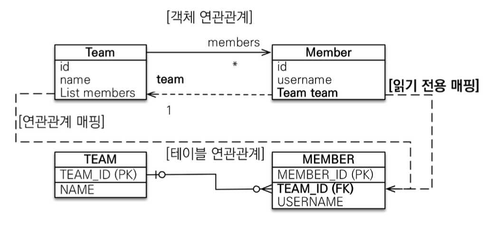<br>

- 이런 매핑은 공식적으로 존재X
- @JoinColum(insertable=false, updatable=false)
- 읽기 전용 필드를 사용해서 양방향처럼 사용하는 방법
- **다대일 양방향을 사용하자**

## 일대일 [1:1]

- **일대일** 관계는 그 반대도 **일대일**
- 주 테이블이나 대상 테이블 중에 외래 키 선택 가능
  - 주 테이블에 외래 키
  - 대상 테이블에 외래 키
- 외래 키에 데이터베이스 유니크(UNI)제약조건 추가

### 일대일: 주 테이블에 외래 키 단방향

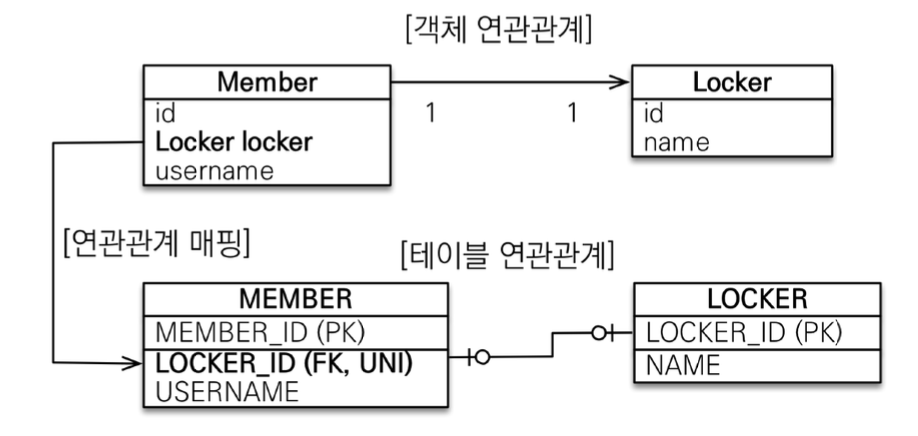<br>

- 다대일(@ManyToOne)단방향 매핑과 유사

### 일대일: 주 테이블에 외래 키 양방향

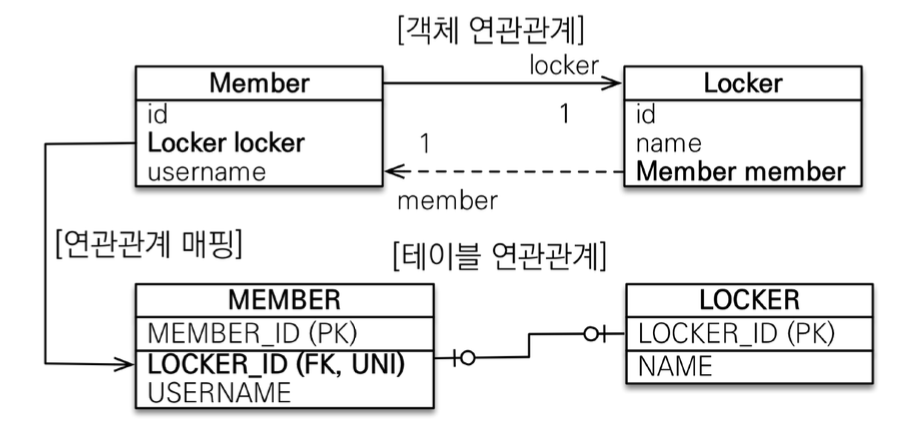<br>

- 다대일 양방향 매핑 처럼 **외래 키가 있는 곳이 연관관계의 주인**
- 반대편은 mappedBy 적용

### 일대일: 대상 테이블에 외래 키 단방향

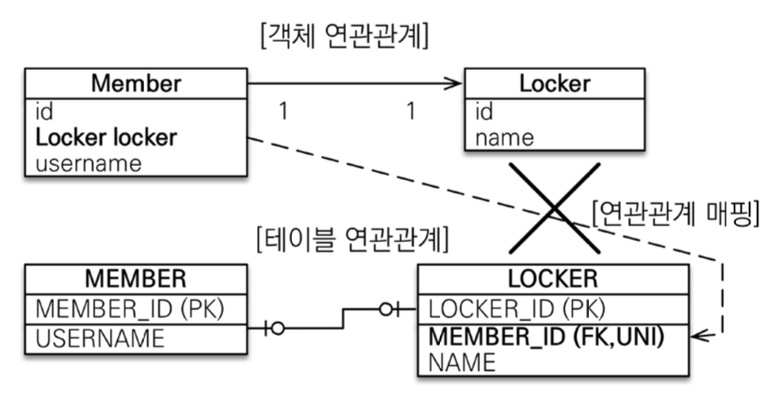<br>

- **단방향 관계는 JPA 지원 x**
- 양방향 관계는 지원

### 일대일: 대상 테이블에 외래 키 양방향

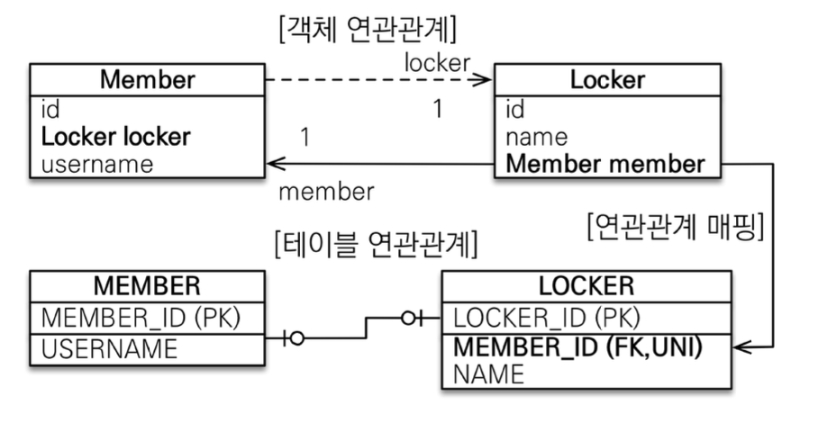<br>

- 사실 일대일 주 테이블에 외래 키 양방향과 매핑 방법은 같음

### 일대일 정리

- **주 테이블에 외래 키**
  - 주 객체가 대상 객체의 참조를 가지는 것 처럼 주 테이블에 외래 키를 두고 대상 테이블을 찾음
  - 객체지향 개발자 선호
  - JPA 매핑 편리
  - 장점: 주 테이블만 조회해도 대상 테이블에 데이터가 있는지 확인 가능
  - 단점: 값이 없으면 외래 키에 null허용
- **대상 테이블에 외래 키**
  - 대상 테이블에 외래 키가 존재
  - 전통적인 데이터베이스 개발자 선호
  - 장점: 주 테이블과 대상 테이블을 일대일에서 일대다 관계로 변경할 때 테이블 구조 유지
  - 단점: 프록시 기능의 한계로 **지연 로딩으로 설정해도 항상 즉시 로딩됨**(프록시는 뒤에서 설명)

## 다대다 [N:M]

- 관계형 데이터베이스는 정규화된 테이블 2개로 다대다 관계를 표현할 수 없음
- 연결 테이블은 추가해서 일대다, 다대일 관계로 풀어내야 함

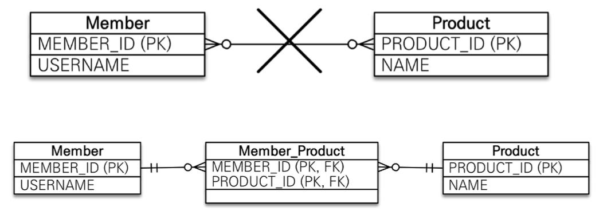<br>

- **객체는 컬렉션을 사용해서 객체 2개로 다대다 관계 가능**

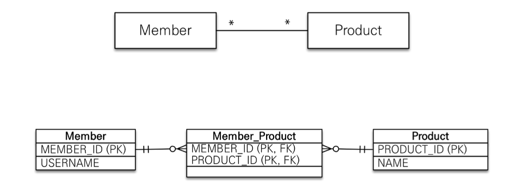<br>

- **@ManyToMany** 사용
- **@JoinTable**로 연결 테이블 지정
- 다대다 매핑: 단방향, 양방향 가능

### 다대다 매핑의 한계

- **편리해 보이지만 실무에서 사용X**
- 연결 테이블이 단순히 연결만 하고 끝나지 않음
- 주문시간, 수량 같은 데이터가 들어올 수 있음

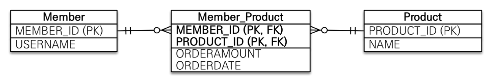<br>

### 다대다 한계 극복

- **연결 테이블용 엔티티 추가(연결 테이블을 엔티티로 승격)**
- **@ManyToMany -> @OneToMany, @ManyToOne

<br>

## 실전 예제 - 3. 다양한 연관관계 매핑

### 배송, 카테고리 추가 - 엔티티

- 주문과 배송은 1:1(**@OneToOne**)
- 상품과 카테고리는 N:M(**@ManyToMany**)

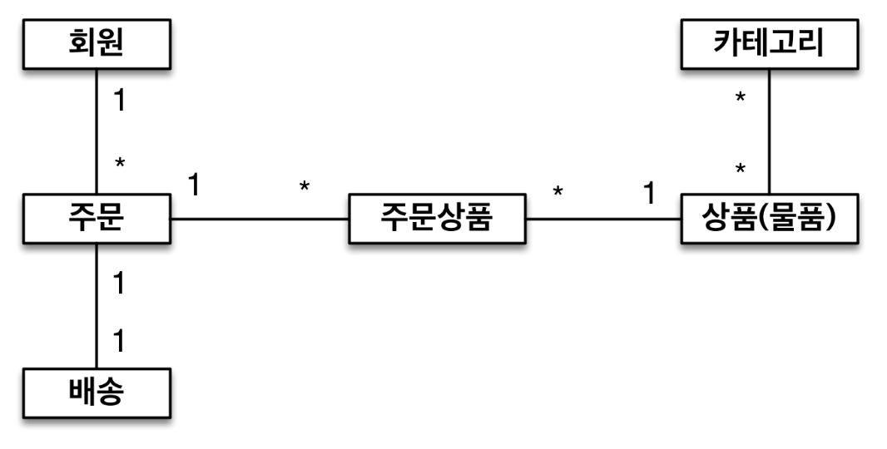<br>

### 배송, 카테고리 추가 - ERD

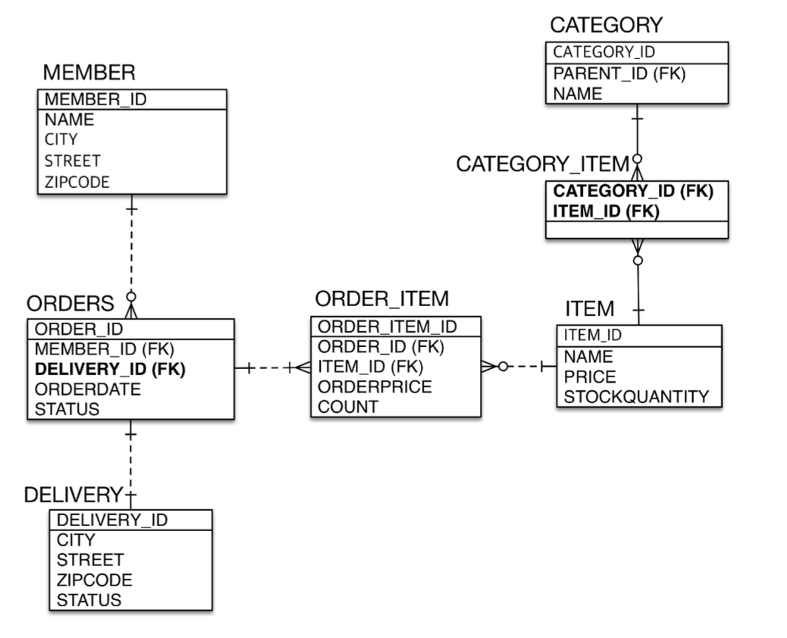<br>

### 배송, 카테고리 추가- 엔티티 상세

<br>

### N:M 관계는 1:N, N:1로

- 테이블의 N:M 관계는 중간 테이블을 이용해서 1:N, M:1
- 실전에서는 중간 테이블이 단순하지 않다.
- @ManyToMany는 제약: 필드 추가X, 엔티티 테이블 불일치
- 실전에서는 **@ManyToMany 사용x**

### @JoinColum

- 외래 키를 매핑할 때 사용

| 속성                 | 설명                                                                                | 기본 값                                 |
| :------------------- | ----------------------------------------------------------------------------------- | --------------------------------------- |
| **name**                 | 매핑할 외래 키 이름                                                                 | 필드명_참고하는 테이블의 기본 키 컬럼명 |
| referencedColumnName | 외래 키가 참조하는 대상 테이블의 컬럼명                                             | 참조하는 테이블의 기본키 컬럼명         |
| **foreignKey(DDL)**      | 외래 키 제약조건을 직접 지정할 수 있다.<br>이 속성은 테이블을 생성할 때만 사용한다. |                                         |
| unique <br>nullable insertable<br>updateable<br>columnDefinition<br>table |         @Column의 속성과 같다.           |                        |

### @ManyToOne - 주요 속성

- 다대일 관계 매핑

| 속성         | 설명                                                                                                                       | 기본값                                                  |
| :----------- | -------------------------------------------------------------------------------------------------------------------------- | ------------------------------------------------------- |
| **optional** | false로 설정하면 연관된 엔티티가 항상 있어야 한다                                                                          | TRUE                                                    |
| fetch        | 글로벌 페치 전략을 설정한다                                                                                                | @ManyToOne=FetchType.EAGER<br>@OneToMany=FetchType.LAZY |
| cascade      | 영속성 전이 기능을 사용한다.                                                                                               |                                                         |
| targetEntity | 연관된 엔티티의 타입 정보를 설정한다. 이 기능은 거의 사용하지 않는다. 컬럭션을 사용해도 제네릭으로 타입 정보를 알 수 있다. |                                                         |


### @OneToMany - 주요 속성

- 일대다 관계 매핑

|     속성     |              설명               |                         기본값                          |
| :----------: | :-----------------------------: | :-----------------------------------------------------: |
| **mappedBy** | 연관관계의 주인 필드를 선택한다 |                                                         |
|    fetch     |  글로벌 페치 전략을 설정한다.   | @ManyToOne=FetchType.EAGER<br>@OneToMany=FetchType.LAZY |
|   cascade    |   영속성 전이 기능을 사용한다   |                                                         |
| targetEntity | 연관된 엔티티의 타입 정보를 설정한다. 이 기능은 거의 사용하지 않는다. 컬렉션을 사용해도 제네릭으로 타입정보를 알 수 있다. |                                                         |

# 고급 매핑

## 상속관계 매핑

- 관계형 데이터베이스에는 상속 관계x
- 슈퍼타입 서브타입 관계라는 모델링 기법이 객체 상속과 유사

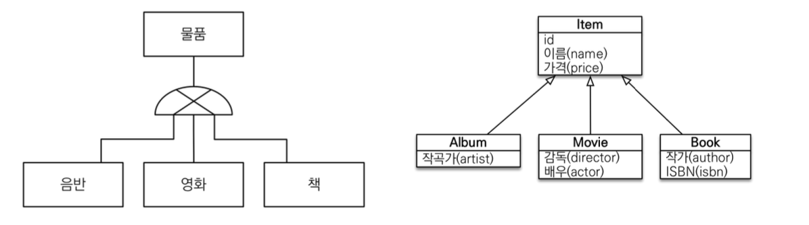<br>

- 슈퍼타입 서브타입 논리 모델을 실제 물리 모델로 구현하는 방법
  - 각각 테이블로 변환 -> 조인 전략
  - 통합 테이블로 변환 -> 단일 테이블 전략
  - 서브타입 테이블로 변환 -> 구현 클래스마다 테이블 전략

### 주요 어노테이션

- @Inheritance(strategy = inheritanceType.XXX)
  - **JOINED**: 조인 저략
  - **SINGLE_TABLE**: 단일 테이블 전략
  - **TABLE_PER)CLASS**: 구현 클래스마다 테이블 전략
- @DiscriminatorColumn(name="DTYPE")
- @DiscriminatorValue("XXX")

### 조인 전략

<br>

- 장점
  - 테이블 정규화
  - 외래 키 참조 무렬성 제약조건 활용가능
  - 저장공간 효율화
- 단점
  - 조회시 조인을 많이 사용, 성능 저하
  - 조회 쿼리가 복잡함
  - 데이터 저장시 INSERT SQL 2번 호출

### 단일 테이블 전략

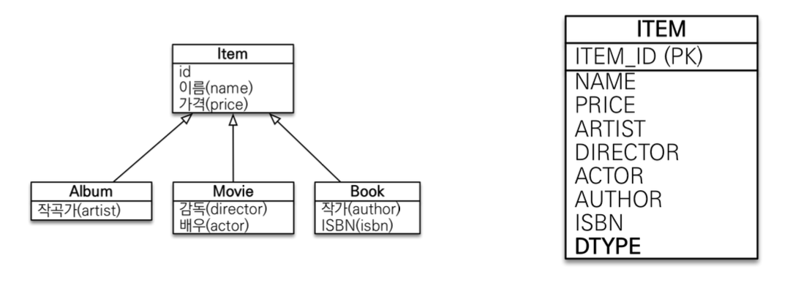<br>

- 장점
  - 조인이 필요 없으므로 일반적으로 조회 성능이 빠름
  - 조회 쿼리가 단순함
- 단점
  - 자식 엔티티가 매핑한 컬럼은 모두 null 허용
  - 단일 테이블에 모든 것을 저장하므로 테이블이 커질 수 있다. 상황에 따라서 조회 성능이 오히려 느려질 수 있다.

### 구현 클래스마다 테이블 전략

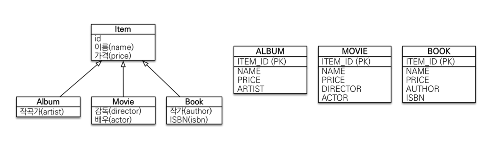<br>

- **이 전략은 데이터에이스 설계와 ORM 전무가 둘 다 추천X**
- 장점
  - 서브 타입을 명확하게 구분해서 처리할 때 효과적
  - not null 제약조건 사용 가능
- 단점
  - 여러 자식 테이블을 함께 조회할 때 성능이 느림(UNION SQL 필요)
  - 자식 테이블을 통합해서 쿼리하기 어려움

## @MappedSuperclass

- 공통 매핑 정보가 필요할 때 사용(id, name)

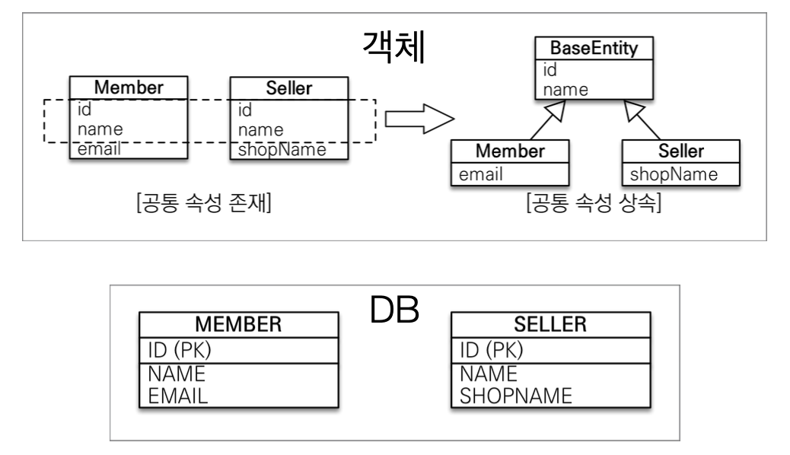<br>

- 상속관계 매핑X
- 엔티티X, 테이블과 매핑X
- 부모 클래스를 상속 받는 **자식 클래스에 매핑 정보만 제공**
- 조회, 검색 불가(**em.find(BaseEntity) 불가**)
- 직접 생성해서 사용할 일이 없으므로 **추상 클래스 권장**
- 테이블과 관계 없고, 단순히 엔티티가 공통으로 사용하는 매핑 정보를 모으는 역할
- 주로 등록일, 수정일, 등록자, 수정자 같은 전체 엔티티에서 공통으로 적용하는 정보를 모을 때 사용
- 참고: @Entity 클래스는 엔티티나 @MappedSuperclass로 지정한 클래스만 상속 가능

## 실전 예제 - 4. 상속관계 매핑

### 요구사항 추가

- 상품의 종류는 음반, 도서, 영화가 있고 이후 더 확장될 수 있다.
- 모든 데이터는 등록일과 수정일이 필수다.

### 도메인 모델

<br>

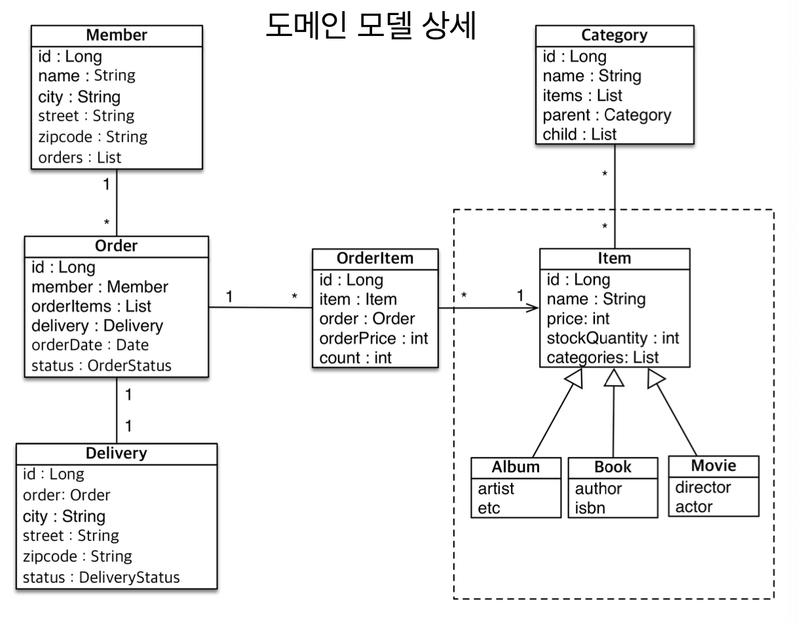<br>

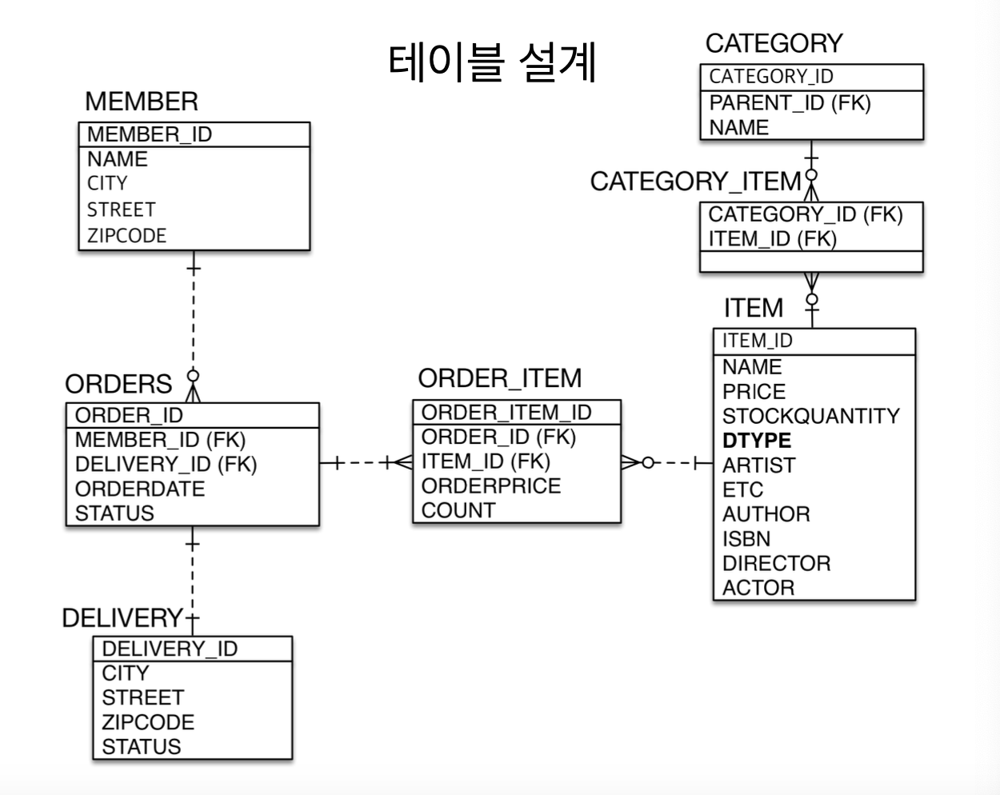<br>

# 프록시와 연관관계 관리

## 프록시

### Member를 조회할 때 Team도 함께 조회해야 할까?

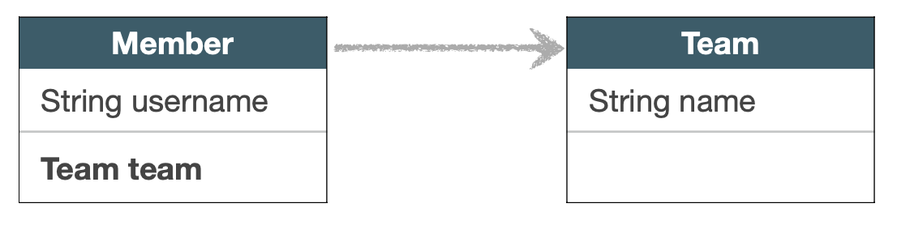<br>

**회원과 팀 함께 출력**

```java
public void printUserAndTeam(String memberId) {
    Member member = em.find(Member.class, memberId);
    Team Team = member.getTeam();
    System.out.println("회원 이름: " + member.getUsername());
    System.out.println("소속팀: " + team.getName());
}
```

**회원만 출력**

```java
public void printUser(String memberId) {
    Member member = em.find(Member.class, memberId);
    Team team = member.getTeam();
    System.out.println("회원 이름: " + member.getUsername());
}
```

### 프록시 기초

**em.find() vs em.**getReference()****

- em.find(): 데이터베이스를 통해서 실제 엔티티 객체 조회
- em.getReference(): **데이터베이스 조회를 미루는 가짜(프록시)엔티티 객체 조회

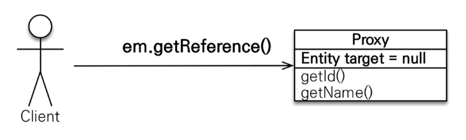<br>

### 프록시 특징

- 실제 클래스를 상속 받아서 만들어짐
- 실제 클래스와 겉 모양이 같다.
- 사용하는 입장에서는 진짜 객체인지 프록시 객체인지 구분하지 않고 사용하면 됨(이론상)

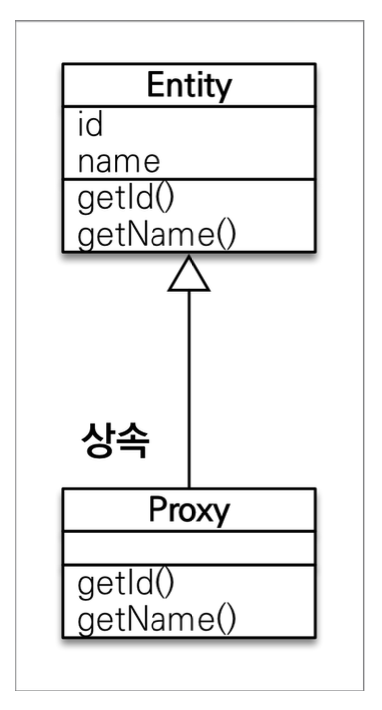<br>

- 프록시 객체는 실제 객체의 참조(target)를 보관
- 프록시 객체를 호출하면 프록시 객체는 실제 객체의 메소드 호출

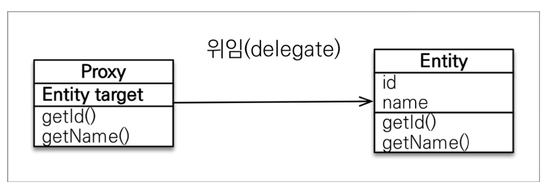<br>

### 프록시 객체의 초기화

```java
Member member = em.getReference(Member.class, "id1");
member.getName();
```

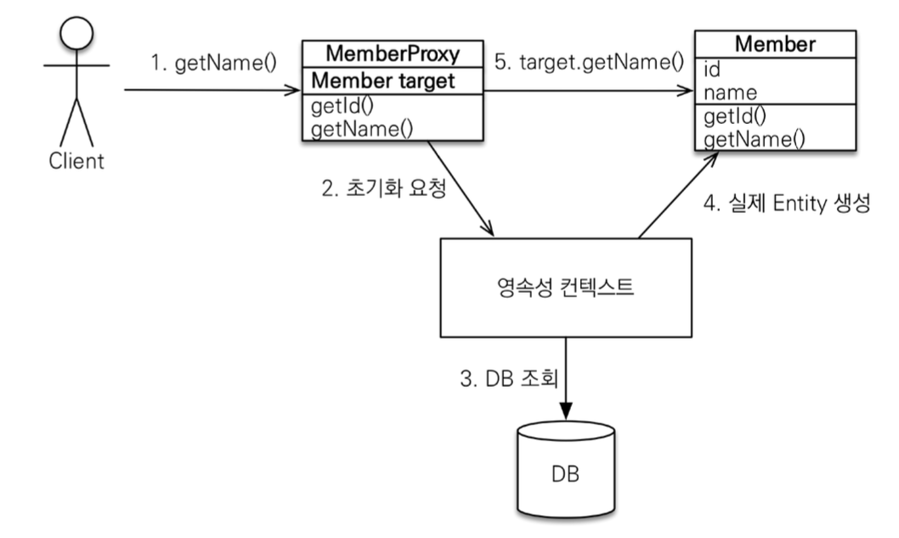<br>

### 프록시의 특징

- 프록시 객체는 처음 사용할 때 한번만 초기화
- 프록시 객체를 초기화 할 때, 프록시 객체가 실제 엔티티가 바뀌는 것은 아님, 초기화되면 프록시 객체를 통해서 실제 엔티티에 접근 가능
- 프록시 객체는 원본 엔티티를 상속 받음, 따라서 타입 체크시 주의해야 함(== 비교 실패, 대신 instance of 사용)
- 영속성 컨텍스트에 찾는 엔티티가 이미 있으면 em.**getReference()**를 호출해도 실제 엔티티 반환
- 영속성 컨텍스트의 도움을 받을 수 없는 준영속 상태일 때, 프록시를 초기화하면 문제 발생(하이버네이트는 org.hibernate.LazyInitializationException 예외를 터트림)

### 프록시 확인

- **프록시 인스턴스 초기화 여부 확인**<br>PersistenceUnitUtil.isLoaded(Object entity)

- **프록시 클래스 확인 방법**<br>entity.getClass().getName()출력(..javasist.. or HibernateProxy...) 

- **프록시 강제 초기화**<br>org.hibernate.Hibernate.initialize(entity);

- 참고: JPA 표준은 강제 초기화 없음<br>강제 호출: **member.getName()**


## 즉시 로딩과 지연 로딩

### Member를 조회할 때 Team도 함게 조회해야 할까?

단순히 member정보만 사용하는 비즈니스 로직<br>println(member.getName());

<br>

### 지연 로징 LAZY을 사용해서 프록시 조회

```java
@Entity
public class Member {
    @Id
    @GeneratedValue
    private Long id;

    @Column(name = "USERNAME")
    private String name;

    @ManyToOne(fetch = FetchType.LAZY) 
    @JoinColumn(name = "TEAM_ID")
    private Team team;
    ..
}
```

### 지연 로딩

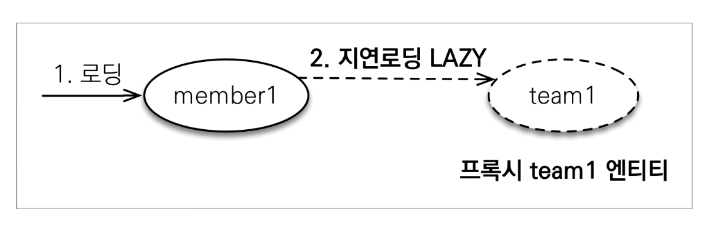<br>

### 지연 로딩 LAZY을 사용해서 프록시로 조회

<br>

```java
Member member = em.find(Member.class, 1L);
```

<br>

```java
Team team = member.getTeam();
team.getName(); //실제 team을 사용하는 시점에 초기화(DB 조회)
```

### Member와 Team을 자주사용한다면 EAGER

즉시 로딩 EAGER를 사용해서 함께 조회

```java
@Entity
public class Member {
    @Id
    @GeneratedValue
    private Long id;

    @Column(name = "USERNAME")
    private String name;

    @ManyToOne(fetch = FetchType.EAGER)
    @JoinColumn(name = "TEAM_ID")
    private Team team;
    ..
}
```

### 즉시 로딩

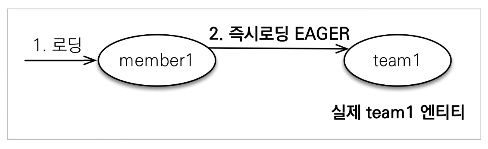<br>

### 즉시로딩 EAGER (Member조회시 항상 Team도 조회)

<br>

JPA 구현체는 가능하면 조인을 사용해서 SQL 한번에 함께 조회

### 프록시와 즉시로딩 주의

- **가급적 지연 로딩만 사용(특히 실무에서)**
- 즉시 로딩을 적용하면  예상하지 못한 SQL이 발생
- **즉시 로딩은 JPQL에서 N+1 문제를 일으킨다.**
- **@ManyToOne, @OneToOne은 기본이 즉시 로딩 -> LAZY로 설정**
- @OneToMany, @ManyToMany는 기본이 지연 로딩

## 지연 로딩 활용

- **Member**와 **Team**은 자주 함께 사용 -> **즉시 로딩**
- **Member**와 **Order**는 가끔 사용 -> **지연 로딩**
- **Order**와 **Product**는 자주 함께 사용 -> **즉시 로딩**

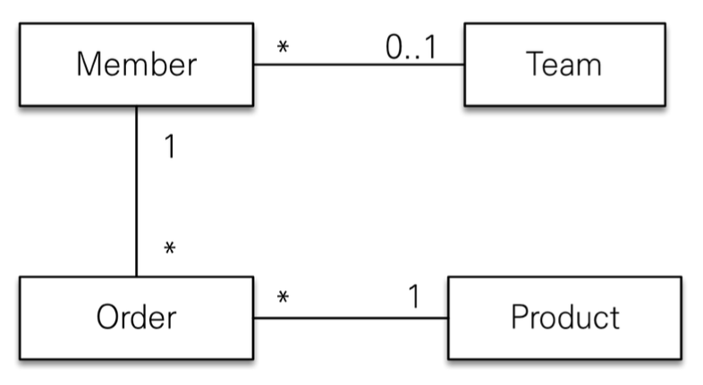<br>

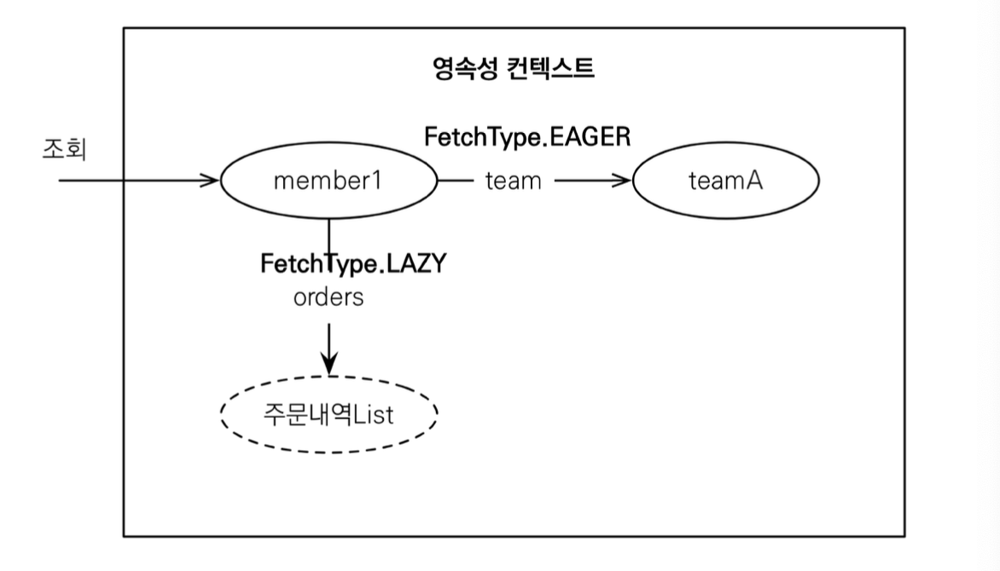<br>

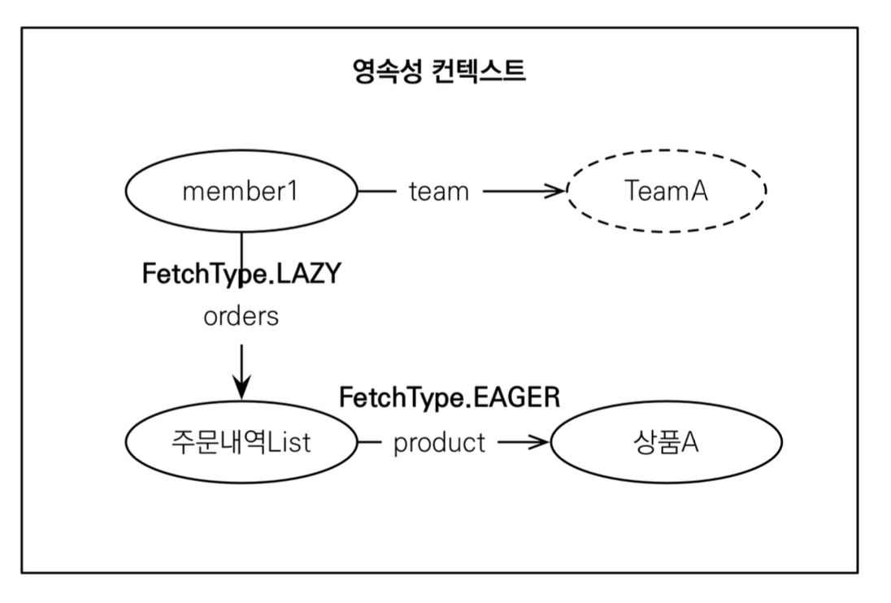<br>

### 지연 로딩 활용 - 실무

- **모든 연관관계에 지연 로딩을 사용해라!**
- **실무에서 즉시 로딩을 사용하지 마라!!!!**
- **JPQL fetch 조인이나, 엔티티 그래프 기능을 사용해라!**
- **즉시 로딩은 상상하지 못한 쿼리가 나간다**

## 영속성 전이: CASCADE

- 특정 엔티티를 영속 상태를 만들 때 연관된 엔티티도 함께 영속 상태로 만들고 싶을 때
- 예: 부모 엔티티를 저장할 때 자식 엔티티도 함께 저장

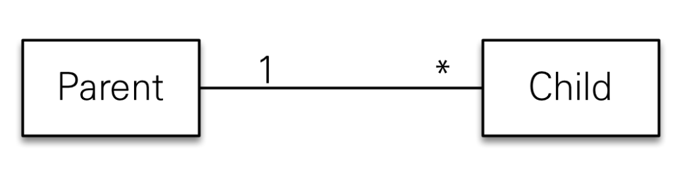<br>

### 영속성 전이: 저장

```java
@OneToMany(mappedBy="parent", cascade="CascadeType.PERSIST)
```

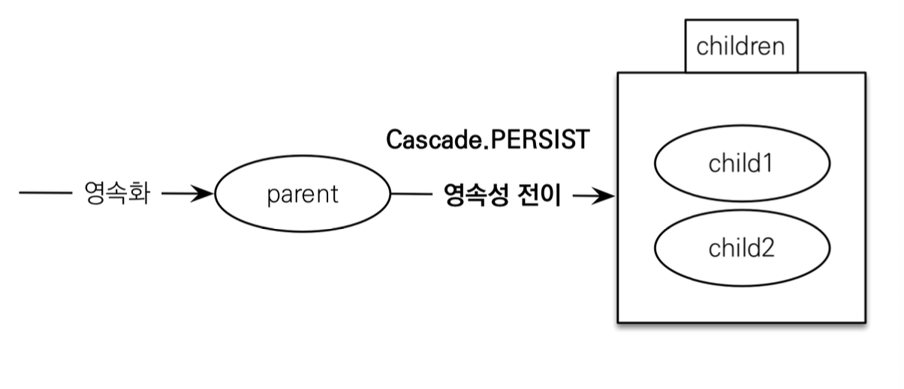<br>

### 영속성 전이: CASCADE - 주의!

- 영속성 전이는 연관관계를 매핑하는 것과 아무 관련이 없음
- 엔티티를 영속화 할 때 연관된 엔티티도 함께 영속화하는 편리함을 제공할 뿐

### CASCADE의 종류

- **ALL: 모두 적용**
- **PERSIST: 영속**
- **REMOVE: 삭제**
- MERGE: 병합
- REFRESH: REFRESH
- DETACH: DETACH

## 고아 객체

- 고아 객체 제거: 부모 엔티티와 연관관계가 끊어진 자직 엔티티를 자동으로 삭제
- **orphanRemoval = true**

```java
Parent parent1 = em.find(Parent.class, id);
parent1.getChildren().remove(0);
//자식 엔티티를 컬렉션에서 제거
//DELETE FROM CHILD WHERE ID=?
```

### 고아 객체 - 주의

- 참조가 제거된 엔티티는 다른 곳에서 참조하지 않는 고아 객체로 보고 삭제하는 기능
- **참조하는 곳이 하나일 때 사용해야 함!**
- **특정 엔티티가 개인 소유할 때 사용**
- @OneToOne, @OneToMany만 가능

> [!NOTE]
> 개념적으로 부모를 제거하면 자식은 고아가 된다. 따라서 고아 객체 제거 기능을 활성화 하면, 부모를 제거할 때 자식도 함께 제거된다. 이것은 CascadeType.REMOVE처럼 동작한다.

## 영속성 전이 + 고아 객체, 생명 주기

- **CascadeType.ALL + orphanRemoval=true**
- 스스로 생명주기를 관리하는 엔티티는 em.persist()로 영속화, em.remove()로 제거
- 두 옵션을 모두 활성화 하면 부모 엔티티를 통해서 자식의 생명 주기를 관리할 수 있음
- 도메인 주소 설계(DDD)의 Aggregate Root개념을 구현할 때 유용

## 실전 예제 - 5. 연관관계 관리

### 글로벌 페치 전략 설정

- 모든 연관관계를 지연 로딩으로
- @ManyToOne, @OneToOne은 기본이 즉시 로딩이므로 지연 로딩으로 변경

### 영속성 전이 설정

- **Order -> Delivery**를 영속성 전이 ALL 설정
- **Order -> OrderItem**을 영속성 전이 ALL 설정

# 값 타입

## 기본값 타입

### JPA의 데이터 타입 분류

- **엔티티 타입**
  - @Entity로 정의하는 객체
  - 데이터가 변해도 식별자로 지속해서 추적 가능
  - 예) 회원 엔티티의 키나 나이 값을 변경해도 식별자로 인식 가능
- **값 타입**
  - int, integer, String처럼 단순히 값으로 사용하는 자바 기본 타입이나 객체
  - 식별자가 없고 값만 있으므로 변경시 추적 불가
  - 예) 숫자 100을 200으로 변경하면 완전히 다른 값으로 대체

### 값 타입 분류

- **기본값 타입**
  - 자바 기본 타입(int, double)
  - 래퍼 클래스(Integer, Long)
  - String
- **임베디드 타입**(embedded type, 복합 값 타입)
- **컬렉션 값 타입**(collection value type)

### 기본값 타입

- 예: String name, int age
- 생명주기를 엔티티의 의존
  - 예) 회원을 삭제하면 이름, 나이 필드도 함께 삭제
- 값 타입은 공유하면X
  - 예) 회원 이름 변경시 다른 회원의 이름도 함께 변경되면 안됨

### 참고: 자바의 기본 타입은 절대 공유 X

- int, double같은 기본 타입(primitive type)은 절대 공유 X
- 기본 타입은 항상 값을 복사함
- Integer같은 래퍼 클래스나 String 같은 특수한 클래스는 공유 가능한 객체이지만 변경X

## 임베디드 타입(복합 값 타입)

### 임베디드 타입

- 새로운 값 타입을 직접 정의할 수 있음
- JPA는 임베디드 타입(embedded type)이라 함
- 주로 기본 값 타입을 모아서 만들어서 복합 값 타입이라고도 함
- int, String과 같은 값 타입

  
- 회원 엔티티는 이름, 근무 시작일, 근무 종료일, 주소 도시, 주소 번지, 주소 우편번호를 가진다.

<br>

- 회원 엔티티는 이름, 근무 기간, 집 주소를 가진다.

<br>

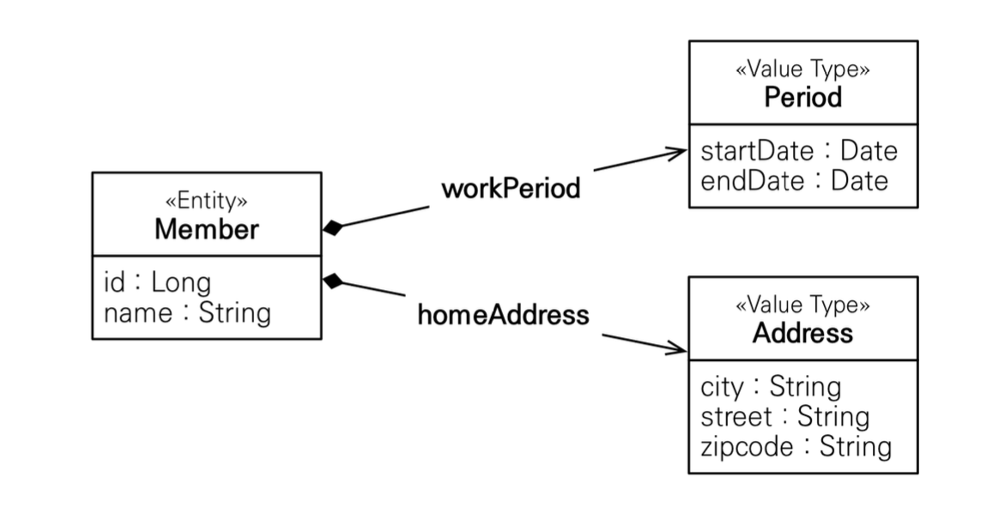<br>

### 임베디드 타입 사용법

- @Enbeddable: 값 타입을 정의하는 곳에 표시
- @Embedded: 값 타입을 사용하는 곳에 표시
- 기본 생성자 필수

### 임베디드 타입의 장점

- 재사용
- 높은 응집도
- Period.isWork()처럼 해당 값 타입만 사용하는 의미있는 메소드를 만들 수 있음
- 임베디드 타입을 포함한 모든 값 타입은, 값 타입을 소유한 엔티티에 생명주기를 의존함

### 임베디드 타입과 테이블 매핑

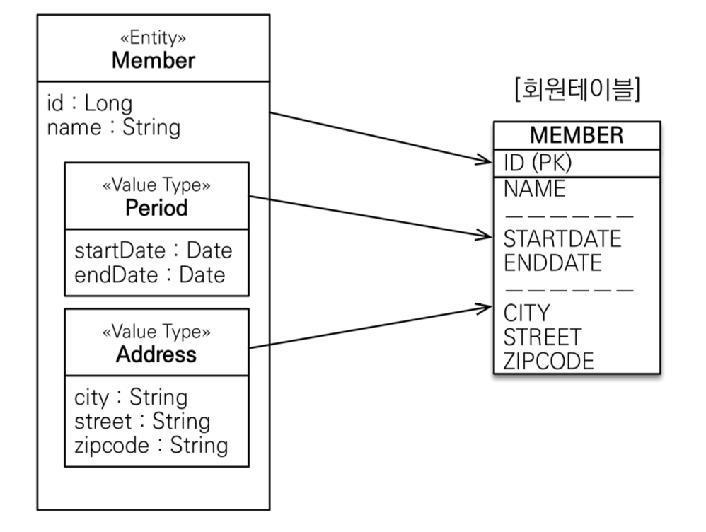<br>

- 임베디드 타입은 엔티티의 값일 뿐이다.
- 임베디드 타입을 사용하기 전과 후에 **매핑하는 테이블은 같다**
- 객체와 테이블을 아주 세밀하게(find-grained)매핑하는 것이 가능
- 잘 설계한 ORM애플리케이션은 매핑한 테이블의 수보다 클래스의 수가 더 많음

### 임베디드 타입과 연관관계

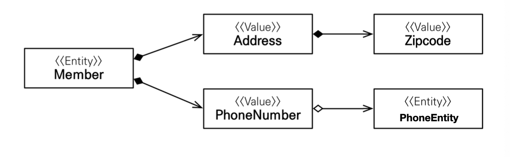<br>

### @AttributeOverride: 속성 재정의

- 한 엔티티에서 같은 값 타입을 사용하면?
- 컬럼 명이 중복됨
- **@AttributeOverrides, @AttributeOverride**를 사용해서 컬럼 명 속성을 재정의

### 임베디드 타입과 null

- 임베디드 타입의 값이 null이면 매핑한 컬럼 값은 모두 null

## 값 타입과 불변 객체

**값 타입은 복잡한 객체 세상을 조금이라도 단순화하려고 만든 개념이다. 따라서 값 타입은 단순하고 안전하게 다룰 수 있어야 한다.**

### 값 타입 공유 참조

- 임베디드 타입 같은 값 타입을 여러 엔티티에서 공유하면 위험함
- 부작용(side effect)발생

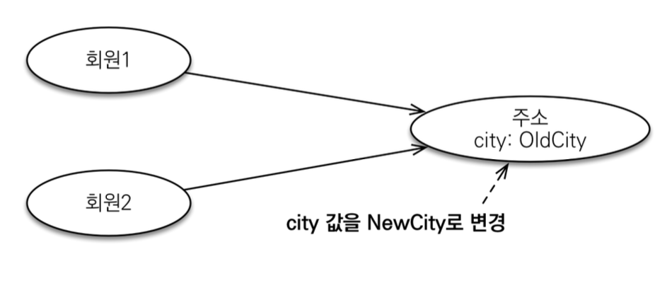<br>

### 값 타입 복사

- 값 타입의 실제 인스턴스인 값을 공유하는 것은 위험
- 대신 값(인스턴스)를 복사해서 사용

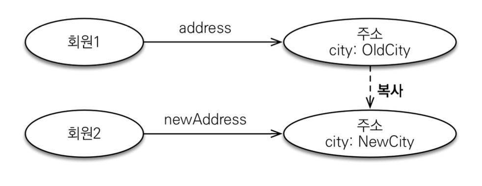<br>

### 객체 타입의 한계

- 항상 값을 복사해서 사용하면 공유 참조로 인해 발생하는 부작용을 피할 수 있다.
- 문제는 임베디드 타입처럼 **직접 정의한 값 타입은 자바의 기본 타입이 아니라 객체 타입이다.**
- 자바 기본 타입에 값을 대입하면 값을 복사한다.
- **객체 타입은 참조 값을 직접 대입하는 것을 막을 방법이 없다.**
- **객체의 공유 참조는 피할 수 없다.**

**기본 타입**

```java
int a = 10;
int b = a; //기본 타입은 값을 복사
b = 4;
```

**객체 타입**

```java
Address a = new Address("Old");
Address b = a; //객체 타입은 참조를 전달
b.setCity("New");
```

### 불변 객체

- 객체 타입은 수정할 수 없게 만들면 **부작용을 원천 차단**
- **값 타입은 불변 객체(immutable object)로 설계해야 함**
- **불변 객체: 생성 시점 이후 절대 값을 변경할 수 없는 객체**
- 생성자로만 값을 설정하고 수정자(Setter)를 만들지 않으면 됨

> [!TIP]
> Integer, String은 자바가 제공하는 대표적인 불변 객체

**불변이라는 작은 제약으로 부작용이라는 큰 재앙을 막을 수 있다.**

## 값 타입의 비교

- 값 타입: 인스턴스가 달라도 그 안에 값이 같으면 같은 것으로 봐야 함

```java
int a = 10;
int b = 10;
```

- **동일성(identity)비교**: 인스턴스의 참조 값을 비교, == 사용
- **동등성(equivalence)비교**: 인스턴스의 값을 비교, equals()사용
- 값 타입은 a.equals(b)를 사용해서 동등성 비교를 해야 함
- 값 타입의 equals()메소드를 적절하게 재정의(주로 모든 필드 사용)

## 값 타입 컬렉션

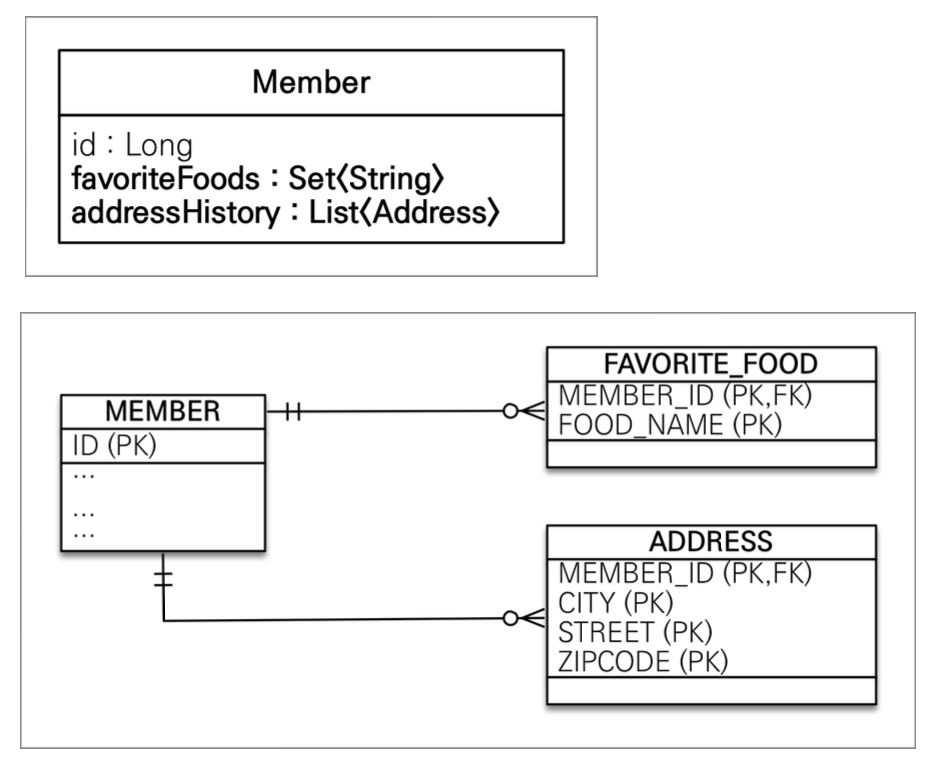<br>

- 값 타입을 하나 이상 저장할 때 사용
- @ElementCollection, @CollectionTable 사용
- 데이터베이스는 컬렉션을 같은 테이블에 저장할 수 없다.
- 컬렉션을 저장하기 위한 별도의 테이블이 필요함

### 값 타입 컬렉션 사용

- 값 타입 저장 예제
- 값 타입 조회 예제
  - 값 타입 컬렉션도 지연 로딩 전략 사용
- 값 타입 수정 예제

> [!TIP]
> 값 타입 컬렉션은 영속성 전이(Cascade) + 고아 객체 제거 기능을 필수로 가진다고 볼 수 있다.

### 값 타입 컬렉션의 제약사항

- 값 타입은 엔티티와 다르게 식별자 개념이 없다.
- 값은 변경하면 추적이 어렵다.
- 값 타입 컬렉션에 변경 사항이 발생하면, 주인 엔티티와 연관된 모든 데이터를 삭제하고, 값 타입 컬렉션에 있는 현재 값을 모두 다시 저장한다.
- 값 타입 컬렉션을 매핑하는 테이블은 모든 컬럼을 묶어서 기본 키를 구성해야 함: **null입력X, 중복 저장X**

### 값 타입 컬렉션 대안

- 실무에서는 상황에 따라 **값 타입 컬렉션 대신에 일대다 관계를 고려**
- 일대다 관계를 위한 엔티티를 만들고, 여기에서 값 타입을 사용
- 영속성 전이(Cascade) + 고아 객체 제거를 사용해서 값 타입 컬렉션처럼 사용

### 정리

- **엔티티 타입의 특징**
  - 식별자O
  - 생명 주기 관리
  - 공유
- **값 타입의 특징**
  - 식별자X
  - 생명 주기를 엔티티에 의존
  - 공유하지 않는 것이 안전(복사해서 사용)
  - 불변 객체로 만드는 것이 안전

> [!NOTE]
> 값 타입은 정말 값 타입이라 판단될 때만 사용<br>엔티티와 값 타입을 혼동해서 엔티티를 값 타입으로 만들면 안됨<br>식별자가 필요하고, 지속해서 값을 추적, 변경해야 한다면 그것은 값 타입이 아닌 엔티티로 만들어야 한다.

## 실전 예제 - 6. 값 타입 매핑

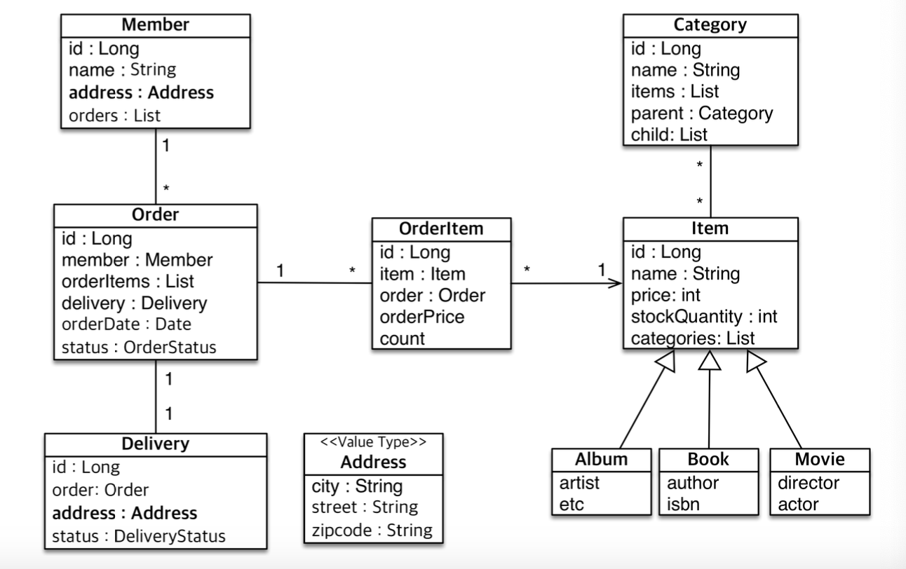<br>

# 객체지향 쿼리 언어(JPQL)

## 객체지향 쿼리 언어 소개

### JPA는 다양한 쿼리 방법을 지원

- **JPQL**
- JPA Criteria
- **QueryDSL**
- 네이티브 SQL
- JDBC API직접 사용, MyBatis, SpringJdbcTemplate 함께 사용

### JPQL 소개

- 가장 단순한 조회 방법
  - EntityManager.find()
  - 객체 그래프 탐색(a.getB().getC())
- **나이가 18살 이상인 회원을 모두 검색하고 싶다면?**

### JPQL

JPA를 사용하면 엔티티 객체를 중심으로 개발

문제는 검색 쿼리
- 검색을 할 때도 **테이블이 아닌 엔티티 객체를 대상으로 검색**
- 모든 DB데이터를 객체로 변환해서 검색하는 것은 불가능
- 애플리케이션이 필요한 데이터만 DB에서 불러오려면 결국 검색 조건이 포함된 SQL이 필요

- JPA는 SQL을 추상화된 JPQL이라는 객체 지향 쿼리 언어 제공
- SQL과 문법 유사, SELECT, FROM, WHERE, GROUP BY, HAVING, JOIN지원

JPQL과 SQL 비교
- JPQL은 엔티티 객체를 대상으로 쿼리
- SQL은 데이터베이스 테이블을 대상으로 쿼리

```java
//검색
String jpql = "select m From Member m where m.name like '%hello%'";

List<Member> result = em.createQuery(jpql, Member.class)
      .getResultList();
```

- 테이블이 아닌 객체를 대상으로 검색하는 객체 지향 쿼리
- SQL을 추상화해서 특정 데이터베이스 SQL에 의존X
- JPQL을 한마디로 정의하면 객체 지향 SQL

### JQPL과 실행된 SQL

```java
//검색
String jpql = "select m from Member m where m.age > 18";

List<Member> result = em.createQuery(jpql, Member.class)
      .getResultList();
```

```sql
-- 실행된 SQL
select 
  m.id as id,
  m.age as age,
  m.USERNAME as USERNAME,
  m.TEAM_ID as TEAM_ID
from
  Member m
where
  m.age>18

```

### Criteria 소개

- 문자가 아닌 자바코드로 JPQL을 작성할 수 있음
- JPQL 빌더 역할
- JPA 공식 기능
- **단점: 너무 복잡하고 실용성이 없다.**
- Criteria 대신에 **QueryDSL 사용 권장**

### QueryDSL 소개

```java
//JPQL
//select m from Member m where m.age > 18
JPAFactoryQuery query = new JPAQueryFactory(em);
QMember m = QMember.member;

List<Member> list = 
    query.selectFrom(m)
         .where(m.age.gt(18))
         .orderBy(m.name.desc())
         .fetch();
```

- 문자가 아닌 자바고드로 JPQL을 작성할 수 있음
- JPQL 빌더 역할
- 컴파일 시점에 문법 오류를 찾을 수 있음
- 동적쿼리 작성 편리함
- **단순하고 쉬움**
- **실무 사용 권장**

### 네이티브 SQL 소개

- JPA가 제공하는 SQL을 직접 사용하는 기능
- JPQL로 해결할 수 없는 특정 데이터베이스에 의존적인 기능
- 예) 오라클 CONNECT BY, 특정 DB만 사용하는 SQL 힌트

```java
String sql = 
  "SELECT ID, AGE, TEAM_ID, NAME FROM MEMBER WHERE NAME = 'kim'";

List<Member> resultList = em.createNativeQuery(sql, Member.class).getResultList();
```

### JDBC 직접 사용, SpringJdbcTemplate 등

- JPA를 사용하면서 JDBC커넥션을 직접 사용하거나, 스프링 JdbcTemplate, 마이바티스등을 함께 사용 가능
- 단 영속성 컨텍스트를 적절한 시점에 강제로 플러시 필요
- 예) JPA를 우회해서 SQL을 실행하기 직전에 영속성 컨텍스트 수동 플러시

## JPQL - 기본 문법과 쿼리 API

### JPQL 소개

- JPQL은 객체지향 쿼리 언어다. 따라서 테이블을 대상으로 쿼리를 하는 것이 아니라 **엔티티 객체를 대상으로 쿼리**한다.
- JPQL은 SQL을 추상화해서 특정데이터베이스 SQL에 의존하지 않는다.
- JPQL은 결국 SQL을 변환된다.

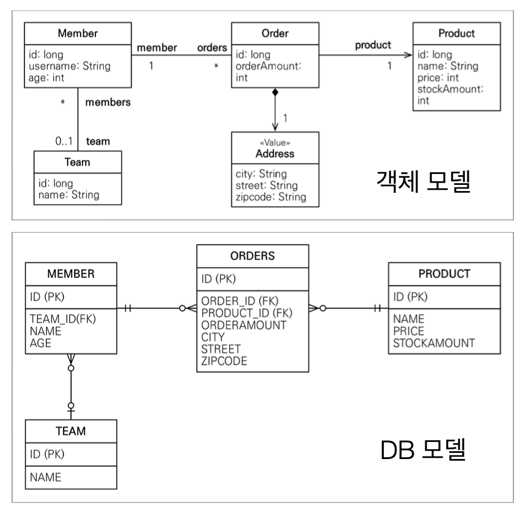<br>

### JPQL 문법

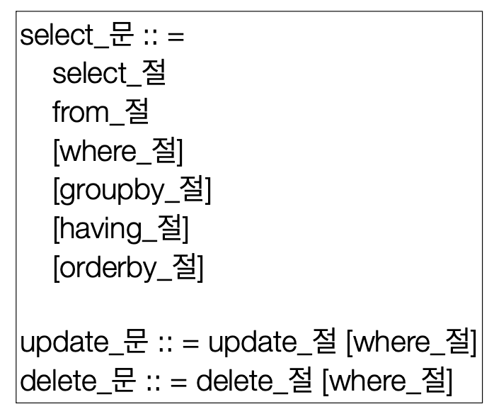<br>

- select m from **Member**as m where **m.age** > 18
- 엔티티와 속성은 대소문자 구분O (Member, age)
- JPQL키워드는 대소문자 구분X (SELECT, FROM, where)
- 엔티티 이름 사용, 테이블 이름이 아님(Member)
- **별칭은 필수(m)**(as는 생략가능)

### 집합과 정렬

```java
select
  COUNT(m),
  SUM(m.age),
  AVG(m.age),
  MAX(m.age),
  MIN(M.age)
from Member m
```

- GROUP BY, HAVING
- ORDER BY

### TypeQuery, Query

- TypeQuery: 반환타입이 명확할 때 사용
- Query: 반환 타입이 명확하지 않을 때 사용

```java
TypedQuery<Member> query = em.createQuery("SELECT m FROM Member m", Member.class);
```

```java
Query query = em.createQuery("SELECT m.username, m.age Member m");
```

### 결과 조회 API

- query.getResultList(): **결과가 하나 이상일 때**, 리스트 반환
  - 결과가 없으면 빈 리스트 반환
- query.getSingleResult(): **결과가 정확히 하나**, 단일 객체 반환
  - 결과가 없으면: javax.persistence.NoResultException
  - 둘 이상이면: javax.persistence.NonUniqueResultException

### 파라미터 바인딩 - 이름 기준, 위치 기준

```java
//쿼리: SELECT m FROM Member m where m.username=:username

query.setParameter("username", usernameParam);
```

```java
//쿼리: SELECT m FROM Member m where m.username=?1

query.setParameter(1, usernameParam);
```

## 프로젝션

- SELECT 절에 조회할 대상을 지정하는 것
- 프로젝션 대상: 엔티티, 임베디드 타입, 스칼라 타입(숫자, 문자등 기본 데이터 타입)
- SELECT **m** FROM Member m -> 엔티티 프로젝션
- SELECT **m.team** FROM Member m -> 엔티티 프로젝션
- SELECT **m.address** FROM Member m -> 임베디드 타입 프로젝션
- SELECT **m.username, m.age** FROM Member m -> 스칼라 타입 프로젝션
- DISTINCT로 중복 제거

### 프로젝션 - 여러 값 조회

- SELECT **m.username, m.age** FROM Member m

1. Query 타입으로 조회
2. Object[]타입으로 조회
3. new 명령어로 조회
   - 단순 값을 DTO로 바로 조회<br>SELECT **new** jpabook.jpql.UserDTO(m.username, m.age) FROM Member m
   - 패키지 명을 포함한 전체 클래스 명 입력
   - 순서와 타입이 일치하는 생성자 필요

## 페이징

### 페이징 API 예시

```java
String jpql = "select m from Member m order by m.age desc";
List<Member> resultList = em.createQuery(jpql, Member.class)
                    .setFirstResult(0)
                    .setMaxResults(10)
                    .getResultList();
```

### 페이징 API - MySQL 방언

```sql
SELECT 
  M.ID AS ID,
  M.AGE AS AGE,
  M.TEAM_ID AS TEAM_ID,
  M.NAME AS NAME
FROM
  MEMBER M
GROUP BY
  M.NAME DESC LIMIT ?, ?
```

### 페이징 API - Oracle 방언

```sql
SEECT * FROM
  ( SELECT FOW_.*, ROWNUM ROWNUM_
  FROM
    ( SELECT
        M.ID AS ID,
        M.AGE AS AGE,
        M.TEAM_ID AS TEAM_ID,
        M.NAME AS NAME
    FROM MEMBER M
    ORDER BY M.NAME
    ) ROW_
  WHERE ROWNUM <= ?
  )
WHERE ROWNUM_ > ?
```

## 조인

- 내부 조인
  - `SELECT m FROM Member m [INNER] JOIN m.team t
- 외부 조인
  - `SELECT m FROM Member m LEFT [OUTER] JOIN m.team t
- 세타 조인
  - `SELECT count(m) from Member m, Team t where m.username = t.name

### 조인 - ON 절

- ON절을 활용한 조인 (JPA 2.1부터 지원)
  - 1 조인대상 필터링
  - 2 연관관계 없는 엔티티 외부 조인(하이버네이트 5.1부터)

#### 조인 대상 필터링

예) 회원과 팀을 조인하면서, 팀 이름이 A인 팀만 조인

**JPQL**

```sql
SELECT m, t FROM Member m LEFT JOIN m.team on t.name = 'A'
```

**SQL**

```sql
SELECT m.*, t.* FROM
Member m LEFT JOIN Team t ON m.TEAM_ID=t.id and t.name='A'
```

#### 연관관계 없는 엔티티 외부 조인

에) 회원의 이름과 팀의 이림이 같은 대상 외부 조인

**JPQL**

```sql
SELECT m, t FROM
Member m LEFT JOIN Team t on m.username = t.name
```

**SQL**

```sql
SELECT m.*, t.* FROM
Member m LEFT JOIN Team t ON m.username = t.name
```

## 서브쿼리

- 나이가 평균보다 많은 회원

```sql
select m from Member m
where m.age > (select avg(m2.age) from Member m2)
```

- 한 건이라도 주문한 고객

```sql
select m from Member m
where (select count(o) from Order o where m = o.member) > 0
```

### 서브 쿼리 지원 함수

- [NOT] EXISTS (subquery): 서브쿼리에 결과가 존재하면 참
  - {ALL | ANY | SOME} (subquery)
  - ALL 모두 만족하면 참
  - ANY, SOME: 같은 의미, 조건을 하나라도 만족하면 참
- [NOT] IN (subquery): 서브쿼리의 결과 중 하나라도 같은것이 있으면 참

### 서브 쿼리 - 예제

- 팀 A 소속인 회원<br>select m from Member m<br>where **exists** (select t from m.team t where t.name = '팀A')
- 전체 상품 각각의 재고보다 주문량이 많은 주문들<br>select o from Order o<br>where o.orderAmount > **ALL**(select p.stockAmout from Product p)
- 어떤 팀이든 팀에 소속된 회원<br>select m from Member m<br>where m.team = **ANY**(select t from Team t)

### JPA 서브 쿼리 한계

- JPA는 WHERE, HAVING 절에서만 서브 쿼리 사용 가능
- SELECT 절도 가능(하이베네이트에서 지원)
- **FROM 절의 서브 쿼리는 현재 JPQL에서 불가능**
  - **조인으로 풀 수 있으면 풀어서 해결**

### 하이버네이트6 변경사항

- 하이버네이트6 부터는 **FROM 절의 서브쿼리를 지원**한다.
- [참조링크](https://in.relation.to/2022/06/24/hibernate-orm-61-features/)

## JPQL 타입 표현과 기타식

### JPQL 타입 표현

- 문자: 'HELLO', 'She', 's'
- 숫자: 10L(Long), 10D(Double), 10F(Float)
- Boolean: TRUE, FALSE
- ENUM: jpabook.MemberType.Admin (패키지명 포함)
- 엔티티 타입: TYPE(m) = Member(상속 관계에서 사용)

### JPQL 기타

- SQL과 문법이 같은 식
- EXISTS, IN
- AND, OR, NOT
- =, >, >=, <, <=, <>
- BETWEEN, LIKE, IS NULL

## 조건식

### 기본 CASE 식

```sql
select 
  case when m.age <= 10 then '학생요금'
       when m.age >= 60 then '경로요금'
       else '일반요금'
  end
from Member m
```

### 단순 CASE 식

```sql
select
  case t.name
    when '팀A' then '인센티브110%'
    when '팀B' then '인센티브120%'
    else '인센티브105%',
  end
from Team t
```

### 조건식 - CASE 식

- COALESCE: 하나씩 조회해서 null아니면 반환
- NULLIF: 두 값이 같으면 null반환, 다르면 첫번째 값 반환

사용자 이름이 없으면 이름 없는 회원 반환

```sql
select coalesce(m.username, '이름 없는 회원') from Member m
```

사용자 이름이 '관리자'면 null을 반환하고 나머지는 본인의 이름을 반환

```sql
select NULLIF(m.username, '관리자') from Member m
```

## JPQL 함수

### JPQL 기본 함수

- CONCAT
- SUMSTTRING
- TRIM
- LOWER, UPPER
- LENGTH
- LOCATE
- ABS, SQRT, MOD
- SIZE, INDEX(JPA 용도)

### 사용자 정의 함수 호출

- 하이버네이트는 사용전에 방언에 추가해야 한다
  - 사용하는 DB방언을 상속받고, 사용자 정의 함수를 등록한다.
  
```sql
select function('group_concat', i.name) from Item i
```

## JPQL - 경로 표현식

### 경로 표현식

- .(점)을 찍어 객체 그래프를 탐색하는 것

```sql
select m.username -- 상태 필드
  from Member m
    join m.team t -- 단일 값 연관 필드
    join m.orders o -- 컬렉션 값 연관 필드
  where t.name -- = '팀A'
```

### 경로 표현식 용어 정리

- **상태 필드**(state field): 단순히 값을 저장하기 위한 필드 (ex: m.username)
- **연관 필드**(association field): 연관관계를 위한 필드
  - **단일 값 연관 필드:**<br>@ManyToOne, @OneToOne, 대상이 엔티티(ex: m.team)
- **컬렉션 값 연관 필드:**<br>@OneToMany, @ManyToMany, 대상이 컬렉션(ex: m.orders)

### 경로 표현식 특징

- **상태 필드**(state field): 경로 탐색의 끝, 탐색X
- **단일 값 연관 경로:** 묵시적 내부조인(inner join)발생, 탐색O
- **컬렉션 값 연관 경로**: 묵시적 내부 조인 발생, 탐색X
  - FROM절에서 명시적 조인을 통해 별칭을 별칭을 얻으면 별칭을 통해 탐색 가능

### 상태 필드 경로 탐색

- JPQL: select m.username, m.age from Member m
- SQL: select m.username, m.age from Member m

### 단일 값 연관 경로 탐색

- JPQL: select **o.member** from Order o
- SQL:<br>select m.* from Orders o<br>**inner join Member m on o.member_id=m.id**

### 명시적 조인, 묵시적 조인

- 명시적 조인: join키워드 직접 사용
  - select m from Member m **join m.team t**
- 묵시적 조인: 경로 표현식에 의해 묵시적으로 SQL 조인 발생(내부 조인만 가능)
  - select **m.team** from Member m

### 경로 표현식 - 예제

- select o.member.team from Order 0 -> 성공
- select t.members from Team -> 성공
- select t.members.username from Tea t -> 실패
- select m.username from Team t join t.members m -> 성공

### 경로 탐색을 사용한 묵시적 조인 시 주의사항

- 항상 내부 조인
- 컬렉션은 경로 탐색의 끝, 명시적 조인을 통해 별칭을 얻어야 함
- 경로 탐색은 주로 SELECT, WHERE 절에서 사용하지만 묵시적 조인으로 인해 SQL의 FROM(JOIN)절에 영향을 줌

### 실무 조언

- **가급적 묵시적 조인 대신에 명시적 조인 사용**
- 조인은 SQL 튜닝에 중요 포인트
- 묵시적 조인은 조인이 일어나는 상황을 한눈에 파악하기 어려움

## JPQL 페치 조인(fetch join) - 기본

**실무에서 정말정말 중요함**

### 페치 조인(fetch join)

- SQL 조인 종류X
- JPQL에서 **성능 최적화**를 위해 제공하는 기능
- 연관된 엔티티나 컬렉션을 **SQL 한 번에 함께 조회**하는 기능
- join fetch 명령어 사용
- vocl whdls ::= [LEFT [OUTER] | INNER] JOIN FETCH 조인경로

### 엔티티 페치 조인

- 회원을 조회하면서 연관된 팀도 함께 조회(SQL 한번에)
- SQL을 보면 회원 뿐만 아니라 **팀(T.*)**도 함께 **SELECT**
- **[JPQL]**<br>select m from Member m **join fetch** m.team
- **[SQL]**<br> SELECT M.\*, T.\* FROM MEMBER M<br>**INNER JOIN TEAM T** ON M.TEAM_ID=T.ID

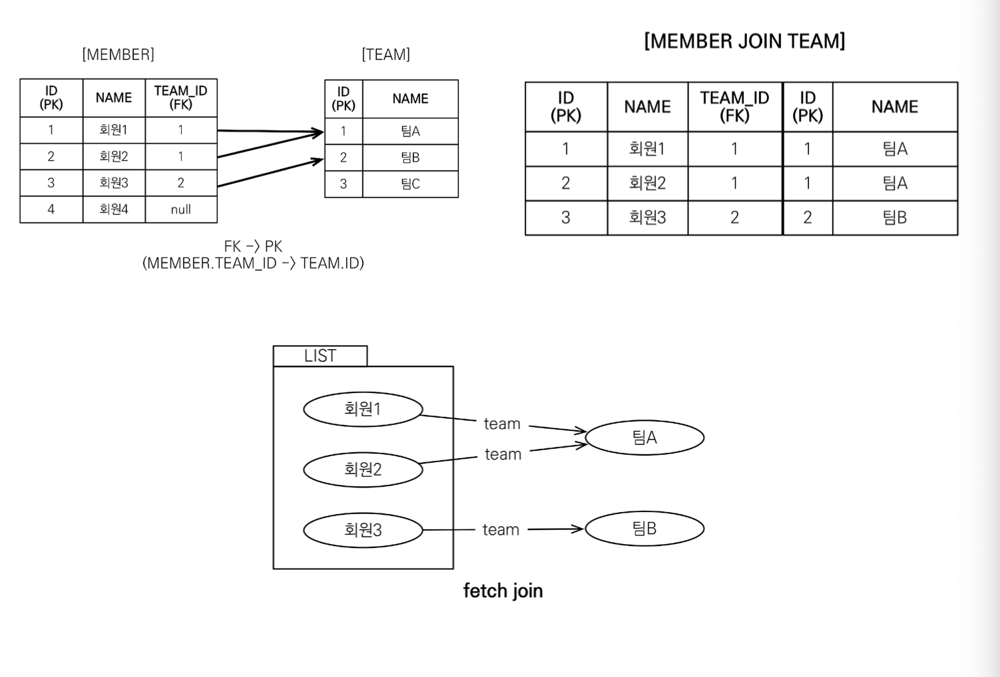<br>

### 페치 조인 사용 코드

```java
String jpql = "select m from Member m join fetch m.team";
List<Member> members = em.createQuery(jpql, Member.class)
                        .getResultList();

for (Member member : members) {
    //페치 조인으로 회원과 팀을 함께 조회해서 지연로딩 X
    System.out.println("username = " + member.getUsername() + ", " +
                        "teamName = " + member.getTeam().getName());
}
```

### 컬렉션 페치 조인

- 일대다 관계, 컬렉션 페치 조인
- **[JPQL]**<br>select t<br>from Team t **join fetch t.members**<br>where t.name= '팀A'
- **[SQL]**<br>SELECT T.\*, M.\*<br>FROM TEAM T<br>INNER JOIN MEMBER M ON T.ID=M.TEAM_ID<br>WHERE T.NAME = '팀A'

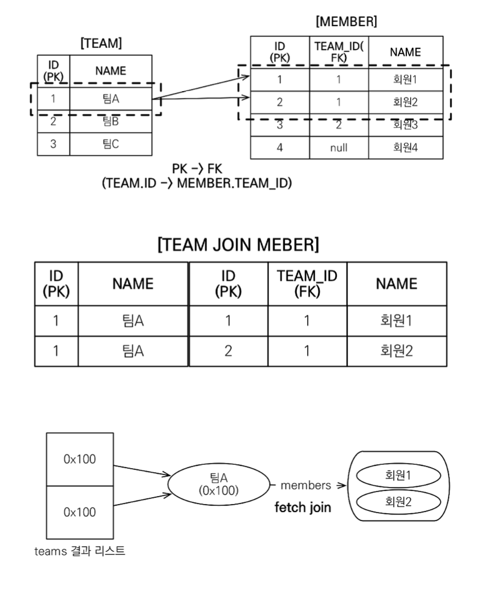<br>

### 컬렉션 페치 조인 사용 코드

```java
String jpql = "select t from Team t join fetch t.members where t.name= '팀A'";
List<Member> teams = em.createQuery(jpql, Team.class).getResultList();

for(Team team : teams) {
  System.out.println("teamname = " + team.getName() + ", team = " + team);
  for (Member member : team.getMembers()) {
    //페치 조인으로 팀과 회원을 함께 조회해서 지연 로딩 발생 안함
    System.out.println("-> username = " + member.getUsername() + ", member = " + member);
  }
}
```

teamname = 팀A, team = Team@0x100<br>-> username = 회원1, member = Member@0x200<br>-> username = 회원2, member = Member@0x300<br>
teamname = 팀A, team = Team@0x100<br>-> username = 회원1, member = Member@0x200<br>-> username = 회원2, member = Member@0x300

> [!TIP]
> member와 team을 저장할때 팀A에는 회원1, 2가 저장되어있다. 그러한 이유로 team의 getMembers로 조회하면 2번 출력이 된다. 중복을 제거하려면 `DISTINCT`를 사용하면 된다.

### 페치 조인과 DISTINCT

- SQL의 DISTINCT는 중복된 결과를 제거하는 명령
- JPQL의 DISTINCT는 2가지 기능 제공
  - SQL에 DISTINCT를 추가
  - 애플리케이션에서 엔티티 중복 제거


```sql
select distinct t
from Team t join fetch t.members
where t.name = '팀A'
```

SQL에 DISTINCT를 추가하지만 데이터가 다르므로 SQL에서 중복제거 실패

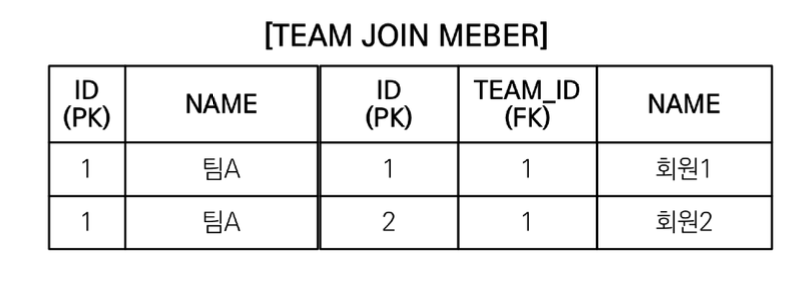<br>

DISTINCT가 추가로 애플리케이션에서 중복 제거 시도

같은 식별자를 가진 **Team 엔티티 제거**<br>

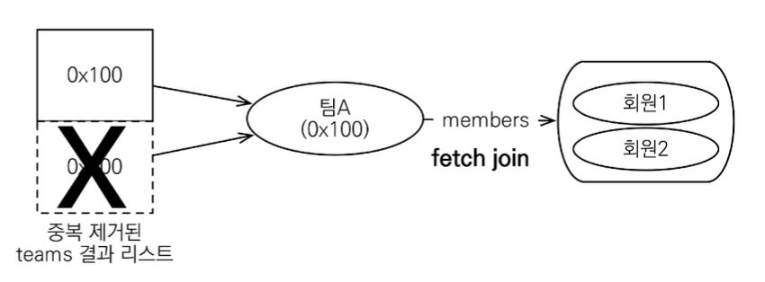<br>

[DISTINCT 추가시 결과]<br>
teamname = 팀A, team = Team@0x100<br>
-> username = 회원1, member = Member@0x200<br>-> username = 회원2, member = Member@0x300 

#### 하이버네이트6 변경사항

- DISTINCT가 추가로 애플리케이션에서 중복 제거시도
- **하이버네이트6 부터는 DISTINCT 명령어를 사용하지 않아도 애플리케이션에서 중복 제거가 자동으로 적용된다.**

### 페치 조인과 일반 조인의 차이

- 일반 조인 실행시 연관된 엔티티를 함께 조회하지 않음

**[JPQL]**<br>
```sql
select t
from Team t join t.members m
where t.name = '팀A'
```

**[SQL]**<br>
```sql
SELECT T.*
FROM TEAM T
INNER JOIN MEMBER M ON T.ID=M.TEAM_ID
WHERE T.NAME = '팀A'
```

### 페치 조인과 일반 조인의 차이

- JPQL은 결과를 반환할 때 연관관계 고려X
- 단지 SELECT절에 지정한 엔티티만 조회할 뿐
- 여기서는 팀 엔티티만 조회하고, 회원 엔티티는 조회X
- 페치 조인을 사용할 때만 연관된 엔티티도 함께 **조회(즉시 로딩)**
- **페치 조인은 객체 그래프를 SQL 한번에 조회하는 개념**

### 페치 조인 실행 예시

- 페치 조인은 연관된 엔티티를 함께 조회함

**[JPQL]**<br>
```sql
select t
from Team t join fetch t.members
where t.name = '팀A'
```

**[SQL]**<br>
```sql
SELECT T.*, M.*
FROM TEAM T
INNER JOIN MEMBER M ON T.ID=M.TEAM_ID
WHERE T.NAME = '팀A'
```

## JPQL 페치 조인(fetch join) - 한계

- **페치 조인 대상에는 별칭을 줄 수 없다**
  - 하이버네이트는 가능, 가급적 사용x
- **둘 이상의 컬렉션은 페치 조인 할 수 없다.**
- **컬렉션을 페치 조인하면 페이징 API(setFirstResult, setMaxResults)를 사용할 수 없다.**
  - 일대일, 다대일 같은 단일 값 연관 필드들은 페치 조인해도 페이징 가능
  - 하이버네이트는 경고 로그를 남기고 메모리에서 페이징(매우 위험)
- 연관된 엔티티들을 SQL 한 번으로 조회 - 성능 최적화
- 엔티티에 직접 적용하는 글로벌 로딩 전략보다 우선함
  - @OneToMany(fetch = FetchType.LAZY) //글로벌 로딩 전략
- 실무에서 글로벌 로딩 전략은 모두 지연 로딩
- 최적화가 필요한 곳은 페치 조인 적용

### 페치조인 - 정리

- 모든 것을 페치 조인으로 해결할 수는 없음
- 페치 조인은 객체 그래프를 유지할 때 사용하면 효과적
- 여러 테이블을 조인해서 엔티티가 가진 모양이 아닌 전혀 다른 결과를 내야 하면, 페치 조인보다는 일반 조인을 사용하고 필요한 데이터들만 조회해서 DTO로 반환하는 것이 효과적

## JPQL - 다형성 쿼리

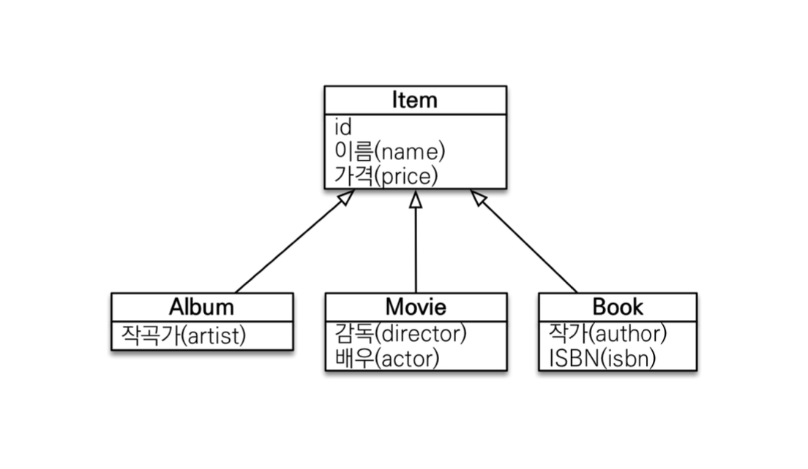<br>

### TYPE

- 조회 대상을 특정 자식으로 한정
- 예) item중에 Book, Movie를 조회해라

**[JPQL]**<br>
select i from i<br>where **type(i)** IN (Book, Movie)

**[SQL]**<br>
select i from i<br>where i.DTYPE in ('B', 'M')

### TREAT(JPA 2.1)

- 자바의 타입 캐스팅과 유사
- 상속 구조에서 부모 타입을 특정 자식 타입으로 다룰 때 사용
- FROM, WHERE, SELECT(하이버네이트 지원)사용
- 예) 부모인 Iteam과 자식 Book이 있다.

**[JPQL]**<br>select i from Item i<br>where treat(i as Book).author = 'kim'

**[SQL]**<br>select i.\* from Item i<br>where i.DTYPE = 'B' and i.author = 'kim'

## JPQL - 엔티티 직접 사용

### 엔티티 직접 사용 - 기본 키 값

- JPQL에서 엔티티를 직접 사용하면 SQL에서 해당 엔티티의 기본 키 값을 사용

**[JPQL]**<br>select **count(m.id)** from Member m //엔티티의 아이디를 사용<br>select **count(m)** from Member m //엔티티를 직접 사용

**[SQL]**(JPQL 둘 다 같은 다음의 SQL 실행)<br>
select count(m.id) as cnt from Member m

엔티티를 파라미터로 전달<br>
```java
String jpql = "select m from Member m where m = :member";
List resultList = em.createQuery(jpql)
                    .setParameter("member", member)
                    .getResultList();
```

식별자를 직접 전달<br>
```java
String jpql = "select m from Member m where m.id = :memberId";
List resultList = em.createQuery(jpql)
                    .setParameter("memberId", memberId)
                    .getResultList();
```

실행된 SQL<br>
```sql
select m.* from Member m where **m.id=?**
```

### 엔티티 직접 사용 - 외래 키 값

```java
Team team = em.find(Team.class, 1L);

String qlString = "select m from Member m where m.team = :team";
List resultList = em.createQuery(qlString)
                    .setParameter("team", team)
                    .getResultList();
```

```java
String qlString = "select m from Member m where m.team.id = :teamId";
List resultList = em.createQuery(qlString)
                    .setParameter("teamId", teamId)
                    .getResultList();
```

실행된 SQL<br>
```sql
select m.* from Member m where m.team_id=?
```

## JPQL - Named 쿼리

### Named쿼리 - 정적 쿼리

- 미리 정의해서 이름을 부여해두고 사용하는 JPQL
- 정적 쿼리
- 어노테이션, XML에 정의
- 애플리케이션 로딩 시점에 초기화 후 재사용
- **애플리케이션 로딩 시점에 쿼리를 검증**

### Named쿼리 - 어노테이션

```java
@Entity
@NamedQuery (
  name = "Member.findByUsername",
  query = "select m from Member m where m.username = :username")
public class Member {
  ...
}
```

```java
List<Member> resultList =
  em.createNamedQuery("Member.findByUsername", Member.class)
        .setParameter("username", "회원1")
        .getResultList();
```

## JPQL - 벌크 연산

### 벌크 연산

- 재고가 10개 미만인 모든 상품의 가격을 10% 상승하려면?
- JPA 변경 감지 기능으로 실행하려면 너무 많은 SQL 실행
1. 재고가 10개 미만인 상품을 리스트로 조회한다.
2. 상품 엔티티의 가격을 10% 증가한다.
3. 트랜잭션 커밋 시점에 변경감지가 동작한다.
- 변경된 데이터가 100건이라면 100번의 UPDATE SQL 실행

### 벌크 연산 예제

- 쿼리 한 번으로 여러 테이블 로우 변경(엔티티)
- **executeUpdate()의 결과는 영향받은 엔티티 수 반환**
- **UPDATE, DELETE 지원**
- **INSERT(insert into .. select, 하이버네이트 지원)**

```java
String qlString = "update Product p " +
                  "set p.price = p.price * 1.1 " +
                  "where p.stockAmount < :stockAmount";

int resultCont = em.createQuery(qlString)
                   .setParameter("stockAmount", 10)
                   .executeUpdate();
```

### 벌크 연산 주의

- 벌크 연산은 영속성 컨텍스트를 무시하고 데이터베이스에 직접 쿼리
  - 벌크 연산을 먼저 실행
  - **벌크 연산 수행 후 영속성 컨텍스트 초기화**