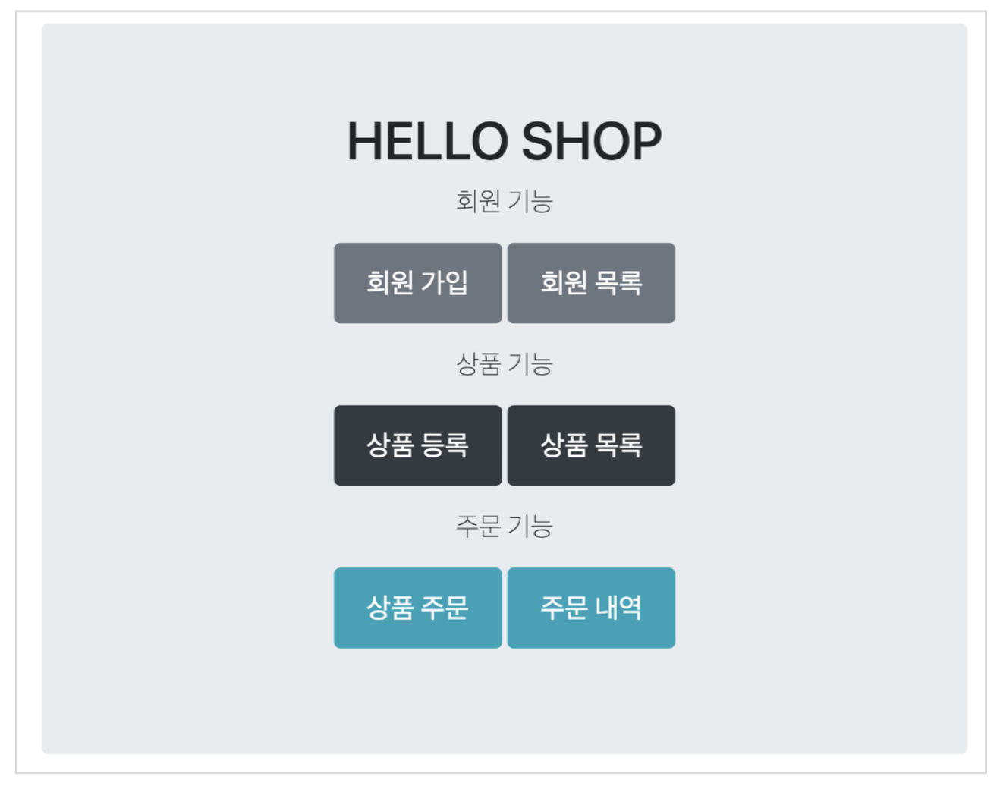
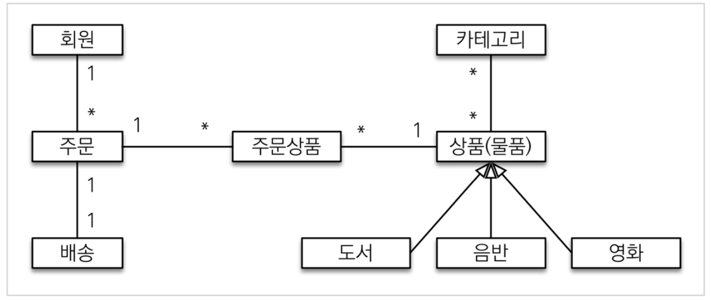
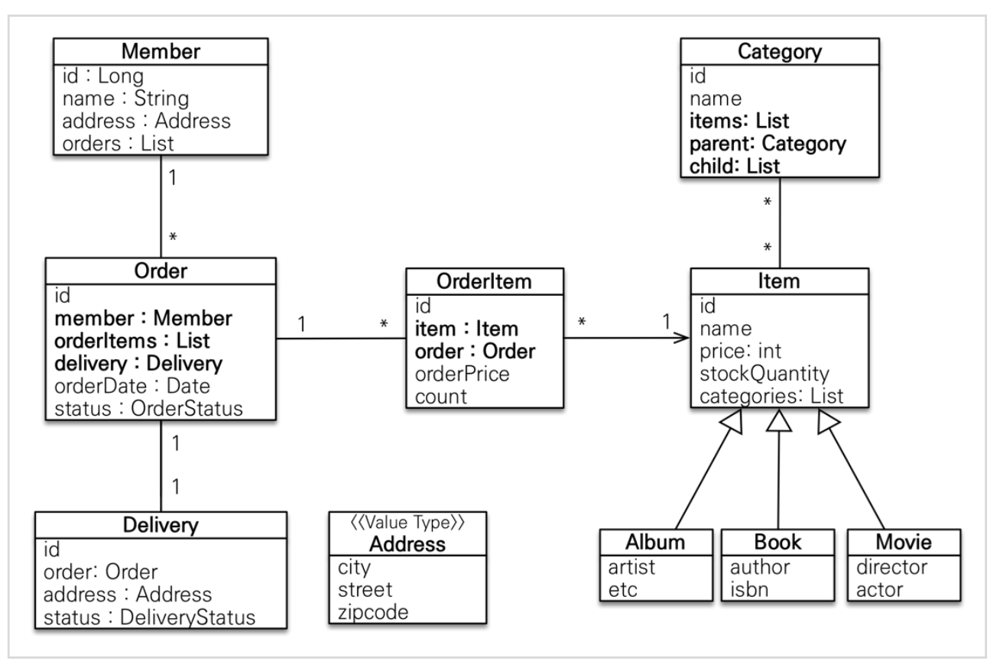
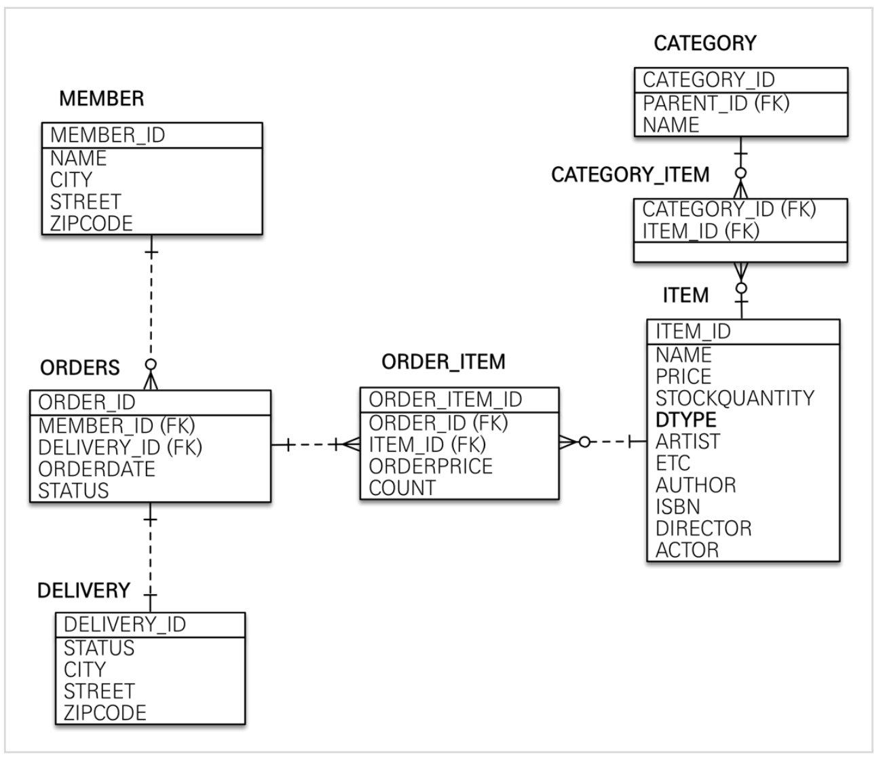
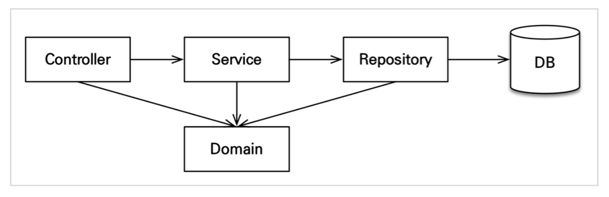

# 프로젝트 환경설정

## 프로젝트 생성

- [스프링 부트 스타터](https://start.spring.io)
- Project - **Gradle - Groovy** project
- Dependencies: web, thymeleaf, jpa, h2, lombok, validation
  - groupId: jpabook
  - artifactid: jpashop

## 라이브러리 살펴보기

- spring-boot-starter-web
  - spring-boot-starter-tomcat: 톰캣(웹서버)
  - spring-webmvc: 스프링 웹 MVC
- spring-boot-starter-thymeleaf: 타임리프 템플릿 엔진(View)
- spring-boot-starter-data-jpa
  - spring-boot-starter-aop
  - spring-boot-starter-jdbc
    - HikariCP 커넥션 풀 (부트 2.0기본)
  - hibernate + JPA: 하이버네이트 + JPA
  - spring-data-jpa: 스프링 데이터 JPA
- spring-boot-starter(공통): 스프링 부트 + 스프링 코어 + 로깅
  - spring-boot
    - spring-core
  - spring-boot-starter-logging
    - logback, slf4;

**테스트 라이브러리**

- spring-boot-starter-test
  - junit: 테스트 프레임워크
  - mockito: 목 라이브러리
  - assertj: 테스트 코드를 좀 더 편리하게 작성하게 도와주는 라이브러리
  - spring-test: 스프링 통합 테스트 지원
<br>

- 핵심 라이브러리
  - 스프링 MVC
  - 스프링 ORM
  - JPA, 하이버네이트
  - 스프링 데이터 JPA
- 기타 라이브러리
  - H2데이터베이스 클라이언트
  - 커넥션 풀: 부트 기본은 HikariCP
  - WEB(thymeleaf)
  - 로깅 SLF4J&LogBack
  - 테스트

> [!NOTE]
> 스프링 데이터 JPA는 스프링과 JPA를 이해하고 사용해야 하는 응용 기술이다.

## View 환경 설정

**thymeleaf 템플릿 엔진**

- thymeleaf 공식 사이트: https://www.thymeleaf.org/
- 스프링 공식 튜토리얼: https://spring.io/guides/gs/serving-web-content
- 스프링부트 메뉴얼: https://docs.spring.io/spring-boot/docs/2.1.6.RELEASE/reference/html/boot-features-developing-web-applications.html#boot-features-spring-mvc-template-engines

<br>

- 스프링 부트 thymeleaf viewName aovld
  - `resources:templates/`+(ViewName)+`.html`

**jpabook.jpashop.HelloController**

```java
@Controller
public class HelloController {

    @GetMapping("hello")
    public String hello(Model model) {
        model.addAttribute("data", "hello!");
        return "hello";
    }
}
```

**thymeleaf 템플릿엔진 동작 확인(hello.html)**

```html
<!DOCTYPE html>
<html lang="en" xmlns:th="http://www.thymeleaf.org">
<head>
    <meta charset="UTF-8">
    <title>Hello</title>
</head>
<body>
<p th:text="'안녕하세요. ' + ${data}" >안녕하세요</p>

</body>
</html>
```

위치: `resources/templates/hello.html`


- index.html 하나 만들기
  - `static/index.html`

```html
<!DOCTYPE html>
<html lang="en", xmlns:th="http://www.thymeleaf.org">
<head>
    <meta charset="UTF-8">
    <title>Hello</title>
</head>
<body>
Hello
<a href="/hello">hello</a>
</body>
</html>
```

> [!TIP]
> `spring-boot-devtools`라이브러리를 추가하면, `html`파일을 컴파일만 해주면 서버 재시작 없이 View파일 변경이 가능하다<br>인텔리제이 컴파일 방법: 메뉴 build -> Recompile

## H2 데이터베이스 설치

개발이나 테스트 용도로 가볍고 편리한 DB, 웹 화면 제공

- 데이터베이스 파일 생성 방법
  - `jdbc:h2:~/jpashop`(최소 한번)
  - `~/jpashop.mv.db`파일 생성 확인
  - 이후 부터는 `jdbc:h2:tcp://localhost/~/jpashop`이렇게 접속

> [!WARNING]
> H2데이터베이스의 MVCC옵션은 H2 1.4.198버전부터 제거되었스빈다. 1.4.200버전에서는 MVCC옵션을 사용하면 오류가 발생합니다.

## JPA와 DB설정, 동작확인

`main/resources/application.yml`

```yml
spring:
  datasource:
    url: jdbc:h2:tcp://localhost/~/jpashop
    username: sa
    password:
    driver-class-name: org.h2.Driver


  jpa:
    hibernate:
      ddl-auto: create
    properties:
      hibernate:
        show_sql: true
        format_sql: true

logging.level:
  org.hibernate.sql: debug
```

- `spring.jpa.hibernate.ddl-auto: create`
  - 이 옵션은 애플리케이션 실행 시점에 테이블을 drop하고, 다시 생성한다.

> [!TIP]
> 모든 로그 추력은 가급적 로거를 통해 남겨야 한다.<br>`show_sql`옵션은 `System.out`에 하이버네이트 실행 SQL을 남긴다.<br>`org.hibernate.SQL`옵션은 logger를 통해 하이버네이트 실행 SQL을 남긴다.

> [!WARNING]
> `application.yml`같은 `yml`파일은 띄어쓰기(스페이스)2칸으로 계층을 만듭니다. 따라서 띄어쓰기 2칸을 필수로 적어주어야 합니다.<br>예를 들어서 아래의 `datasource`는 `spring:`하위에 있고 앞에 띄어 쓰기 2칸이 있으므로 `spring.datasource`가 됩니다.

### 실제 동작하는지 확인하기

**회원 엔티티**<br>

```java
@Entity
@Getter @Setter
public class Member {

    @Id
    @GeneratedValue
    private Long id;

    private String username;
}
```

**회원 리포지토리**<br>

```java
@Repository
public class MemberRepository {

    @PersistenceContext
    EntityManager em;

    public Long save(Member member) {
        em.persist(member);
        return member.getId();
    }

    public Member find(Long id) {
        return em.find(Member.class, id);
    }
}
```

**테스트**<br>

```java
@RunWith(SpringRunner.class)
@SpringBootTest
public class MemberRepositoryTest {

    @Autowired
    MemberRepository memberRepository;


    @Test
    @Transactional
    @Rollback(value = false)
    public void testMember() throws Exception {
        //given
        Member member = new Member();
        member.setUsername("memberA");
        Long savedId = memberRepository.save(member);

        //when
        Member findMember = memberRepository.find(savedId);

        //then
        Assertions.assertThat(findMember.getId()).isEqualTo(member.getId());
        Assertions.assertThat(findMember.getUsername()).isEqualTo(member.getUsername());
        Assertions.assertThat(findMember).isEqualTo(member); //JPA 엔티티 동일성 보장
    }
}
```

# 도메인 분석 설계

## 요구사항 분석



## 도메인 모델과 테이블 설계

<br>

**회원, 주문, 상품의 관계**: 회원은 여러 상품을 주문할 수 있다. 그리고 한 번 주문할 때 여러 상품을 선택할 수 있으므로 주문과 상품은 다대다 관계다. 하지만 이런 다대다 관계는 관계형 데이터베이스는 물론이고 엔티티에서도 거의 사용하지 않는다. 따라서 그림처럼 주문상품이라는 엔티티를 추가해서 다대다 관계를 일대다, 다대일 관계로 풀어 냈다.

**상품 분류**: 상품은 도서, 음반, 영화로 구분되는데 상품이라는 공통 속성을 사용하므로 상속 구조로 표현했다.

### 회원 엔티티 분석

<br>

**회원(Member)**: 이름과 임베디드 타입인 주소(`Address`),그리고 주문(`orders`)리스트를 가진다.

**주문(Order)**: 한 번 주문시 여러 상품을 주문할 수 있으므로 주문과 주문상품(`OrderItem`)은 일대다 관계다. 주문은 상품을 주문한 회원과 배송 정보, 주문 날짜, 주문 상태(`satatus`)를 가지고 있다. 주문 상태는 열거형을 사용했는데 주문(`ORDER`), 취소(`CANCEL`)을 표현할 수 있다.

**상품(Item)**: 이름, 가격, 재고수량(`stockQuantity`)을 가지고 있다. 상품을 주문하면 재고 수량이 줄어든다. 상품 종류로는 도서, 음반, 영화가 있는데 각각은 사용하는 속성이 조금씩 다르다.

**배송(Delivery)**: 주문시 하나의 배송정보를 생성한다. 주문과 배송은 일대일 관계다.

**카테고리(Category)**: 상품과 다대다 관계를 맺는다. `parent`, `child`로 부모, 자식 카테고리를 연결한다.

**주소(Address)**: 값 타입(임베디드 타입)이다. 회원과 배송(Delivery)에서 사용한다.

> [!NOTE]
> 회원 엔티티 분석 그림에서 Order와 Delivery가 단방향 관계로 잘못 그려져 있다. 양방향 관계가 맞다.

> [!NOTE]
> 회원이 주문을 하기 때문에, 회원이 주문리스트를 가지는 것은 얼핏보면 잘 설계한 것 같지만, 객체 세상은 실제 세계와는 다르다. 실무에서는 회원이 주문을 참조하지 않고, 주문이 회원을 참조하는 것으로 충분한다. 여기서는 일대다, 다대일 양방향 연관관계를 설명하기 위해서 추가했다.

### 회원 테이블 분석

<br>

**MEMBER**: 회원 엔티티인 `Address`임베디드 타입 정보가 회원 테이블에 그대로 들어갔다. 이것은 `DELIVERY`테이블도 마찬가지다.

**ITEM**: 앨범, 도서, 영화 타입을 통합해서 하나의 테이블로 만들었다. `DTYPE`컬럼으로 타입을 구분한다.

> [!TIP]
> 테이블명이 `ORDER`가 아니라 `ORDERS`인 것은 데이터베이스가 `order by`때문에 예약어로 잡고 있는 경우가 많다. 그래서 관례상 `ORDERS`를 많이 사용한다.

> [!NOTE]
> 실제 코드에서는 DB에 소문자 + _ 스타일을 사용하겠다.<br>데이터베이스 테이블명, 컬럼에 대한 관럐는 회상마다 다르다. 보통은 대문자 + _ 나 소문자 + _ 방식 중에 하나를 지정해서 일관성 있게 사용한다. 여기서에서는 객체와 차이를 나타내기 위하 데이터베이스 테이블, 컬럼명은 대문자를 사용했지만, **실제 코드에서는 소문자 + _ 스타일을 사용하겠다.**

### 연관관계 매핑 분석

**회원과 주문**: 일대다, 다대일의 양방향 관계다. 따라서 연관관계의 주인을 정해야 하는데, 외래 키가 있는 주문을 연관관계의 주인으로 정하는 것이 좋다. 그러므로 `Order.name`를 `ORDERS.MEMBER_ID`외래 키와 매핑한다.

**주문상품과 주문**: 다대일 양방향 관계다. 외래 키가 주문상품에 있으므로 주문상품이 연관관계의 주인이다. 그러므로 `OrderItem.order`를 `ORDER_ITEM.ORDER_ID`외래 키와 매핑한다.

**주문상품과 상품**: 다대일 단방향 관계다. `OrderItem.item`을 `ORDER_ITEM.ITEM_ID`외래 키와 매핑한다.

**주문과 배송**: 일대일 양방향 관계다. `Oder.delivery`를 `ORDERS.DELIVERY_ID`외래 키와 매핑한다.

**카테고리와 상품**: `@ManyToMany`를 사용해서 매핑한다.(실무에서 @ManyToMany는 사용하지 말자. 여기서는 다대다 관계를 예제로 보여주기 위해 추가했을 뿐이다.)

> [!NOTE]
> **외래 키가 있는 곳을 연관관계 주인으로 정해라**<br>연관관계의 주인은 단순히 외래 키를 누가 관리하냐의 문제이지 비즈니스상 우위에 있다고 주문을 정하면 안된다. 예를 들어서 자동차와 바퀴가 있으면, 일대다 관계에서 항상 다쪽에 외래 키가 있으므로 외래 키가 있는 바퀴를 연관관계의 주인으로 정하면 된다. 물론 자동차를 연관관계의 주인으로 정하는 것이 불가능한 것은 아니지만, 자동차를 연관관계의 주인으로 정하면 자동차가 관리하지 않는 바퀴 테이블의 외래 키 값이 업데이트 되므로 관리와 유지보수가 어렵고, 추가적으로 별도의 업데이트 쿼리가 발생하는 성능 문제도 있다.

### 엔티티 클래스 개발

- 예제에서는 설멍을 쉽게하기 위해 엔티티 클래스에 Getter, Setter를 모두 열고, 최대한 단순하게 설계
- 실무에서는 가급적 Getter는 열어두고, Setter는 꼭 필요한 경우에만 사용하는 것을 추천

> [!NOTE]
> 이론적으로 Getter, Setter 모두 제공하지 않고, 꼭 필요한 별도의 메서드를 제공하는 게 가장 이상적이다. 하지만 실무에서 엔티티의 데이터는 조회할 일이 너무 많으므로, Getter의 경우 모두 열어두는 것이 편리하다. Getter는 아무리 호출해도 호출 하는 것 만으로 어떤 일이 발생하지는 않는다. 하지만 Setter는 문제가 다르다. Setter를 호출하면 데이터가 변한다. Setter를 막 열어두면 가까운 미래에 엔티티가 도대체 왜 변경되는지 추적하기 점점 힘들어진다. 그래서 엔티티를 변경할 때는 Setter 대신에 변경 지점이 명확하도록 변경을 위한 비즈니스 메서드를 별도로 제공해야 한다.

**회원 엔티티**

```java
package jpabook.jpashop.domain;

import jakarta.persistence.*;
import lombok.Getter;
import lombok.Setter;

import java.util.ArrayList;
import java.util.List;

@Entity
@Getter @Setter
public class Member {

    @Id @GeneratedValue
    @Column(name = "member_id")
    private Long id;

    private String name;

    @Embedded
    private Address address;

    @OneToMany(mappedBy = "member")
    private List<Order> orders = new ArrayList<>();
}
```

> [!NOTE]
> 엔티티의 식별자는 `id`를 사용하고 PK컬럼은 `member_id`를 사용했다. 엔티티는 타입(여기서는 `Member`)이 있으므로 `id`필드만으로 쉽게 구분할 수 있다. 테이블은 타입이 없으므로 구분이 어렵다. 그리고 테이블은 관례상 `테이블명 + id`를 많이 사용한다. 참고로 객체에서 `id`대신에 `memberId`를 사용해도 된다. 중요한 것은 일관성이다.

**주문 엔티티**

```java
package jpabook.jpashop.domain;

import jakarta.persistence.*;
import lombok.Getter;
import lombok.Setter;

import java.time.LocalDateTime;
import java.util.ArrayList;
import java.util.List;

@Entity
@Table(name = "orders")
@Getter @Setter
public class Order {

    @Id
    @GeneratedValue
    @Column(name = "order_id")
    private Long id;

    @ManyToOne(fetch = FetchType.LAZY)
    @JoinColumn(name = "member_id")
    private Member member; //주문 회원

    @OneToMany(mappedBy = "order", cascade = CascadeType.ALL)
    private List<OrderItem> orderItems = new ArrayList<>();

    @OneToOne(cascade = CascadeType.ALL, fetch = FetchType.LAZY)
    @JoinColumn(name = "delivery_id")
    private Delivery delivery;

    private LocalDateTime orderDate; // 주문 시간

    @Enumerated(EnumType.STRING)
    private OrderStatus status; //주문 상태 [ORDER, CANCEL]

    //==연관관계 메서드==//
    public void setMember(Member member) {
        this.member = member;
        member.getOrders().add(this);
    }

    public void addOrderItem(OrderItem orderItem) {
        orderItems.add(orderItem);
        orderItem.setOrder(this);
    }

    public void setDelivery(Delivery delivery) {
        this.delivery = delivery;
        delivery.setOrder(this);
    }

}
```

**주문 상태**

```java
package jpabook.jpashop.domain;

public enum DeliveryStatus {
    READY, COMP
}
```

**주문상품 엔티티**

```java
package jpabook.jpashop.domain;

import jakarta.persistence.*;
import lombok.Getter;
import lombok.Setter;

@Entity
@Table(name = "order_item")
@Getter @Setter
public class OrderItem {

    @Id
    @GeneratedValue
    @Column(name = "order_item_id")
    private Long id;

    @ManyToOne(fetch = FetchType.LAZY)
    @JoinColumn(name = "item_id")
    private Item item; //주문 상품

    @ManyToOne(fetch = FetchType.LAZY)
    @JoinColumn(name = "order_id")
    private Order order; //주문

    private int orderPrice; //주문 가격
    private int count; //주문 수량
}
```

**상품 엔티티**

```java
package jpabook.jpashop.domain;

import jakarta.persistence.*;
import lombok.Getter;
import lombok.Setter;

import java.util.ArrayList;
import java.util.List;

@Entity
@Inheritance(strategy = InheritanceType.SINGLE_TABLE)
@DiscriminatorColumn(name = "dtype")
@Getter @Setter
public abstract class Item {

    @Id @GeneratedValue
    @Column(name = "item_id")
    private Long id;

    private String name;
    private int price;
    private int stockQuantity;

    @ManyToMany(mappedBy = "items")
    private List<Category> categories = new ArrayList<Category>();
}
```

**상품 - 도서 엔티티**

```java
package jpabook.jpashop.domain.item;

import jakarta.persistence.DiscriminatorValue;
import jakarta.persistence.Entity;
import jpabook.jpashop.domain.Item;
import lombok.Getter;
import lombok.Setter;

@Entity
@DiscriminatorValue("B")
@Getter @Setter
public class Book extends Item {

    private String author;
    private String isbn;
}
```

**상품 - 음반 엔티티**

```java
package jpabook.jpashop.domain.item;

import jakarta.persistence.DiscriminatorValue;
import jakarta.persistence.Entity;
import jpabook.jpashop.domain.Item;
import lombok.Getter;
import lombok.Setter;

@Entity
@DiscriminatorValue("A")
@Getter @Setter
public class Album extends Item {

    private String artist;
    private String etc;
}
```

**상품 - 영화 엔티티**

```java
package jpabook.jpashop.domain.item;

import jakarta.persistence.DiscriminatorValue;
import jakarta.persistence.Entity;
import jpabook.jpashop.domain.Item;
import lombok.Getter;
import lombok.Setter;

@Entity
@DiscriminatorValue("M")
@Getter @Setter
public class Movie extends Item {

    private String director;
    private String actor;
}
```

**배송 엔티티**

```java
package jpabook.jpashop.domain;

import jakarta.persistence.*;
import lombok.Getter;
import lombok.Setter;

@Entity
@Getter @Setter
public class Delivery {

    @Id @GeneratedValue
    @Column(name = "delevery_id")
    private Long id;

    @OneToOne(mappedBy = "delivery", fetch = FetchType.LAZY)
    private Order order;

    @Embedded
    private Address address;

    @Enumerated(EnumType.STRING)
    private DeliveryStatus status; //ENUM [READY(준비), COMP(배송)]

}
```

**배송 상태**

```java
package jpabook.jpashop.domain;

public enum DeliveryStatus {
    READY, COMP
}
```

**카테고리 엔티티**

```java
package jpabook.jpashop.domain;

import jakarta.persistence.*;
import lombok.Getter;
import lombok.Setter;

import java.util.ArrayList;
import java.util.List;

@Entity
@Getter
@Setter
public class Category {

    @Id
    @GeneratedValue
    @Column(name = "category_id")
    private Long id;

    private String name;

    @ManyToMany
    @JoinTable(name = "category_item",
            joinColumns = @JoinColumn(name = "category_id"),
            inverseJoinColumns = @JoinColumn(name = "item_id"))
    private List<Item> items = new ArrayList<>();

    @ManyToOne(fetch = FetchType.LAZY)
    @JoinColumn(name = "parent_id")
    private Category parent;

    @OneToMany(mappedBy = "parent")
    private List<Category> child = new ArrayList<>();

    //==연관관계 메서드==//
    public void addChildCategory(Category child) {
        this.child.add(child);
        child.setParent(this);
    }
}
```

> [!NOTE]
> 실무에서는 `@MantToMany`를 사용하지 말자<br>`@ManyToMany`는 편리한 것 같지만, 중간 테이블(`CATEGORY_ITEM`)에 컬럼을 추가할 수 없고, 세밀하게 쿼리를 실행하기 어렵기 때문에 실무에서 사용하기에는 한계가 있다. 중간 엔티티(`CategoryItem`)를 만들고 `@ManyToOne`, `@OneToMany`로 매핑해서 사용하자. 정리하면 다대다 매핑을 일대다, 다대일 매핑으로 풀어내서 사용하자.

**주소 값 타입**

```java
package jpabook.jpashop.domain;

import jakarta.persistence.Embeddable;
import lombok.Getter;

@Embeddable
@Getter
public class Address {

    private String city;
    private String street;
    private String zipcode;

    protected Address() {
    }

    public Address(String city, String street, String zipcode) {
        this.city = city;
        this.street = street;
        this.zipcode = zipcode;
    }
}
```

> [!NOTE]
> 값 타입은 변경 불가능하게 설계해야 한다.<br>`@Setter`를 제거하고, 생성자에서 값을 모두 초기화해서 변경 불가능한 클래스를 만들자. JPA스펙상 엔티티나 임베디드 타입(`@Embeddable`)은 자바 기본 생성자(default constructor)를 `public`또는 `protected`로 설정해야 한다. `public`으로 두는 것 보다는 `protected`로 설정하는 것이 그나마 더 안전하다.<br>JPA가 이런 제약을 두는 이유는 JPA 구현 라이브러리가 객체 생성할 때 리플렉션 같은 기술을 사용할 수 있도록 지원해야 하기 때문이다.

## 엔티티 설계시 주의점

**엔티티에는 가급적 Setter를 사용하지 말자**<br>
Setter가 모두 열려있다. 변경 포인트가 너무 많아서, 유지보수가 어렵다. 나중에 리페토링으로 Setter 제거

### 모든 연관관계는 지연로딩으로 설정!

- 즉시로딩(`EAGER`)은 예측이 어렵고, 어떤 SQL이 실행될지 추적하기 어렵다. 특히 JPQL을 실행할 때 N+1 문제가 자주 발생한다.
- 실무에서 모든 연관관계는 지연로딩(`LAZY`)으로 설정해야 한다.
- 연관된 엔티티를 함께 DB에서 조회해야 하면, fetch join또는 엔티티 그래프 기능을 사용한다.
- @XToOne(OneToOne, ManyToOne)관계는 기본이 즉시로딩이므로 직접 지연로딩으로 설정해야 한다.

### 컬렉션은 필드에서 초기화 하자.

컬렉션은 필드에서 바로 초기화하는 것이 안전하다.

- `null`문제에 안전하다
- 하이버네이트는 엔티티를 영속화 할 때, 컬렉션을 감싸서 하이버네이트가 제공하는 내장 컬렉션을 변경한다. 만약 `getOrders()`처럼 임의의 메서드에서 컬렉션을 잘못 생성하면 하이버네이트 내부 메커니즘에 문제가 발생할 수 있다. 따라서 필드레벨에서 생성하는 것이 가장 안전하고, 코드도 간결하다.

```java
Member member = new Member();
System.out.println(member.getOrders().getClass());
em.persist(member);
System.out.println(member.getOrders().getClass());

//출력결과
class java.util.ArrayList
class org.hibernate.collerction.internal.PersistenBag
```

### 테이블, 컬럼명 생성전략

스프링 부트에서 하이버네이트 기본 매핑 전략을 변경해서 실제 테이블 필드명은 다름

하이버네이트 기존 구현: 엔티티의 필드명을 그대로 테이블의 컬럼명으로 사용<br>(`SpringPhysicalNamingStrategy`)

스프링 부트 신규 설정 (엔티티(필드) -> 테이블(컬럼))
1. 카멜케이스 -> 언더스코어(memberPoint -> member_point)
2. .(점) -> _(언더스코어)
3. 대문자 -> 소문자

**적용 2단계**<br>

1. 논리명 생성: 명시적으로 컬럼, 테이블명을 직접 적지 않으면 ImplicitNamingStrategy사용<br> `spring.jpa.hibernate.naming.implicit-strategy`:테이블이나, 컬럼명을 명시하지 않을 때 논리명 적용.
2. 물리명 적용: <br>`spring.jpa.hiberante.naming.physical-strategy`: 모든 논리명에 적용됨, 실제 테이블에 적용(username -> usernm등으로 회사 룰로 바꿀 수 있음)

# 애플리케이션 구현 준비

## 구현 요구사항

<br>

- 회원 기능
  - 회원 등록
  - 회원 조회
- 상품 기능
  - 상품 등록
  - 상품 수정
  - 상품 조회
- 주문 기능
  - 상품 주문
  - 주문 내역 조회
  - 주문 취소

**예제를 단순화 하기 위해 다은 기능은 구현X**

- 로그인과 권한 관리X
- 파라미터 검증과 예외 처리X
- 상품은 도서만 사용
- 카테고리는 사용X
- 배송 정보는 사용X

## 애플리케이션 아키텍처

<br>

**계층형 구조 사용**

- controller, web: 웹 계층
- service: 비즈니스 로직, 트랜잭션 처리
- repository: JPA를 직접 사용하는 계층, 엔티티 매니저 사용
- domain: 엔티티가 모여 있는 계층, 모든 계층에서 사용

**패키지 구조**

- jpabook.jpashop
  - domain
  - exception
  - repository
  - service
  - web

**개발순서: 서비스, 리포지토리 계층을 개발하고, 테스트 케이스를 작성해서 검증, 마직막에 웹 계층 적용**

# 회원 도메인 개발

**구현 기능**

- 회원 등록
- 회원 목록 조회

**순서**

- 회원 엔티티 코드 다시 보기
- 회원 리포지토리 개발
- 회원 서비스 개발
- 회원 기능 테스트

## 회원 리포지토리 개발

```java
package jpabook.jpashop.repository;

import jakarta.persistence.EntityManager;
import jakarta.persistence.PersistenceContext;
import jpabook.jpashop.domain.Member;
import org.springframework.stereotype.Repository;

import java.util.List;

@Repository
public class MemberRepository {

    @PersistenceContext
    private EntityManager em;

    public void save(Member member) {
        em.persist(member);
    }

    public Member findOne(Long id) {
        return em.find(Member.class, id);
    }

    public List<Member> findAll() {
        return em.createQuery("select m from Member m", Member.class)
                .getResultList();
    }

    public List<Member> findByName(String name) {
        return em.createQuery("select m from Member m where m.name = :name", jpabook.jpashop.domain.Member.class)
                .setParameter("name", name)
                .getResultList();
    }
}
```

**기술 설명**

- `@Repository`: 스프링 빈으로 등록, JPA 예외를 스프링 기반 예외로 예외 변환
- `@PersistenceContext`: 엔티티 매니저(`EntityManager`)주입
- `@PersistenceUnit`: 엔티티 매니저 팩토리(`EntityManagerFactory`)주입

**기능 설명**

- `save()`
- `findOne()`
- `findAll()`
- `findByName()`

## 회원 서비스 개발

**회원 서비스 코드**

```java
package jpabook.jpashop.service;

import jpabook.jpashop.domain.Member;
import jpabook.jpashop.repository.MemberRepository;
import org.springframework.beans.factory.annotation.Autowired;
import org.springframework.stereotype.Service;
import org.springframework.transaction.annotation.Transactional;

import java.util.List;

@Service
@Transactional(readOnly = true)
public class MemberService {

    @Autowired
    MemberRepository memberRepository;

    /**
     * 회원가입
     * @param member 회원가입 할 member
     * @return 가입한 member의 Id
     */
    public Long join(Member member) {
        validationDuplicateMember(member); //중복 회원 검증

        memberRepository.save(member);
        return member.getId();
    }

    private void validationDuplicateMember(Member member) {
        List<Member> findMembers = memberRepository.findByName(member.getName());

        if (!findMembers.isEmpty()) {
            throw new IllegalStateException("이미 존재하는 회원 입니다");
        }
    }

    /**
     * 전체 회원 조회
     * @return 전체 Member의 List
     */
    public List<Member> findMembers() {
        return memberRepository.findAll();
    }

    public Member findOne(Long memberId) {
        return memberRepository.findOne(memberId);
    }
}
```

### 기능 설명

- `@Service`
- `@Transactional`: 트랜잭션, 영속성 컨텍스트
  - `readOnly=true`: 데이터의 변경이 없는 읽기 전용 메서드에 사용, 영속성 컨텍스트를 플러시하지 않으므로 약간의 성능 향상(읽기 전용에는 다 적용)
  - 데이터베이스 드라이버가 지원하면 DB에서 성능 향상
- `@Autowired`
  - 생성자 Injection 많이 사용, 생성자가 하나면 생략 가능

> [!TIP]
> 실무에서는 검증 로직이 있어도 멀티 쓰레드 상황을 고려해서 회원 테이블의 회원명 컬럼에 유니크 제약 조건을 추가하는 것이 안전하다.

> [!TIP]
> 스프링 필드 주입 대신에 생성자 주입을 사용하자.

**필드 주입**

```java
public class MemberService {
  
  @Autowired
  MemberRepository memberRepository;

  ...
}
```

**생성자 주입**

```java
public class MemberService {
  
  private final MemberRepository memberRepository;

  public MemberService(MemberRepository memberRepository) {
    this.memberRepository = memberRepository;
  }
  ...
}
```

- 생성자 주입 방식을 권장
- 변경 불가능한 안전한 객체 생성 가능
- 생성자가 하나면, `@Autowired`를 생략할 수 있다.
- `final`키워드를 추가하면 컴파일 시점에 `memberRepository`를 설정하지 않는 오류를 체크할 수 있다.<br>(보통 기본 생성자를 추가할 때 발견)

### lombok

```java
@RequiredArgsConstructor
public class MemberService {
  private final MemberRepository memberRepository;
  ...
}
```

> [!TIP]
> 스프링 데이터 JPA를 사용하면 `EntityManager`도 주입 가능

```java
@Repository
@RequiredArgsConstructor
public class MemberRepository {

  private final EntityManager em;
  ...
}
```

### MemberService 최종 코드

```java
package jpabook.jpashop.service;

import jpabook.jpashop.domain.Member;
import jpabook.jpashop.repository.MemberRepository;
import lombok.RequiredArgsConstructor;
import org.springframework.beans.factory.annotation.Autowired;
import org.springframework.stereotype.Service;
import org.springframework.transaction.annotation.Transactional;

import java.util.List;

@Service
@Transactional(readOnly = true)
@RequiredArgsConstructor
public class MemberService {


    private final MemberRepository memberRepository;

    /**
     * 회원가입
     * @param member 회원가입 할 member
     * @return 가입한 member의 Id
     */
    public Long join(Member member) {
        validationDuplicateMember(member); //중복 회원 검증

        memberRepository.save(member);
        return member.getId();
    }

    private void validationDuplicateMember(Member member) {
        List<Member> findMembers = memberRepository.findByName(member.getName());

        if (!findMembers.isEmpty()) {
            throw new IllegalStateException("이미 존재하는 회원 입니다");
        }
    }

    /**
     * 전체 회원 조회
     * @return 전체 Member의 List
     */
    public List<Member> findMembers() {
        return memberRepository.findAll();
    }

    public Member findOne(Long memberId) {
        return memberRepository.findOne(memberId);
    }
}
```

## 회원 기능 테스트

**테스트 요구사항**

- 회원가입을 성공해야 한다,
- 회원가입 할 때 같은 이름이 있으면 예외가 발생한다.

**회원 가입 테스트 코드**

```java
package jpabook.jpashop.service;

import jpabook.jpashop.domain.Member;
import jpabook.jpashop.repository.MemberRepository;
import org.junit.Test;
import org.junit.runner.RunWith;
import org.springframework.beans.factory.annotation.Autowired;
import org.springframework.boot.test.context.SpringBootTest;
import org.springframework.test.context.junit4.SpringRunner;
import org.springframework.transaction.annotation.Transactional;

import static org.junit.Assert.*;

@RunWith(SpringRunner.class)
@SpringBootTest
@Transactional
public class MemberServiceTest {

    @Autowired
    MemberService memberService;

    @Autowired
    MemberRepository memberRepository;

    @Test
    public void 회원가입() throws Exception {
        //given
        Member member = new Member();
        member.setName("kim");

        //when
        Long saveId = memberService.join(member);

        //then
        assertEquals(member, memberRepository.findOne(saveId));
    }

    @Test
    public void 중복_회원_가입() throws Exception {
        //given
        Member member1 = new Member();
        member1.setName("kim");

        Member member2 = new Member();
        member2.setName("kim");

        //when
        memberService.join(member1);
        memberService.join(member2);

        //then
        fail("예외가 발생해야 한다.");
    }

}
```

**기술 설명**

- `@RunWith(SpringRunner.class)`: 스프링과 테스트 통합
- `@SpringBootTest`: 스프링 부트 띄우고 테스트(이게 없으면 `@Autowired`다 실패)
- `@Transactional`: 반복 가능한 테스트 지원, 각각의 테스트 실행할 때마다 트랜잭션을 시작하고 **테스트가 끝나면 트랜잭션을 강제로 롤백**(이 어노테이션이 테스트 케이스에서 사용될 때만 롤백)

**기능 설명**

- 회원 가입 테스트
- 중복 회원 예외처리 테스트

**테스트 케이스를 위한 설정**<br>
테스트는 케이스 격리된 환경에서 실행하고, 끝나면 데이터를 초기화하는 것이 좋다. 그런면에서 메모리 DB를 사용하는 것이 가장 이상적이다.<br>추가로 테스트 케이스를 위한 스프링 환경과, 일반적으로 애플리케이션을 실행하는 환경은 보통 다르므로 설정 파일을 다르게 사용하자.<br>다음과 같이 간단하게 테스트용 설정 파일을 추가하면 된다.

`test/resources/application.yml`

```yml
spring:
  datasource:
    url: jdbc:h2:tcp://localhost/~/jpashop
    username: sa
    password:
    driver-class-name: org.h2.Driver


  jpa:
    hibernate:
      ddl-auto: create
    properties:
      hibernate:
        format_sql: true
#        show_sql: true

logging:
  level:
    org.hibernate.SQL: debug
```

이제 테스트에서 스프링을 실행하면 이 위치에 있는 설정 파일을 읽는다.<br>(만약 이 위치에 없으면 `src/resources/application.yml`을 읽는다.)

스프링 부트는 datasource설정이 없으면, 기본적으로 메모리 DB를 사용하고, driver-class도 현재 등록된 라이브리리를 보고 찾아준다. 추가로 `ddl-auto`도 `create-drop`모드로 동작한다. 따라서 데이터소스나, JPA관련된 별도의 추가 설정을 하지 않아도 된다.

# 상품 도메인 개발

**구현 기능**

- 상품 등록
- 상품 목록 조회
- 상품 수정

**순서**

- 상품 엔티티(비즈니스 로직 추가)
- 상품 리포지토리 개발
- 상품 서비스 개발
- 상품 기능 테스트

## 상품 엔티티 개발(비즈니스 로직 추가)

**상품 엔티티 코드**

```java
package jpabook.jpashop.domain;

import jakarta.persistence.*;
import jpabook.jpashop.exception.NotEnoughStockException;
import lombok.Getter;
import lombok.Setter;

import java.util.ArrayList;
import java.util.List;

@Entity
@Inheritance(strategy = InheritanceType.SINGLE_TABLE)
@DiscriminatorColumn(name = "dtype")
@Getter @Setter
public abstract class Item {

    @Id @GeneratedValue
    @Column(name = "item_id")
    private Long id;

    private String name;
    private int price;
    private int stockQuantity;

    @ManyToMany(mappedBy = "items")
    private List<Category> categories = new ArrayList<Category>();

    //==비즈니스로직==//
    public void addStock(int quantity) {
        this.stockQuantity += quantity;
    }

    public void removeStock(int quantity) {
        int restStock = this.stockQuantity - quantity;
        if (restStock < 0) {
            throw new NotEnoughStockException("need more stock");
        }
        this.stockQuantity = restStock;
    }

}
```

**예외 추가**

```java
package jpabook.jpashop.exception;

public class NotEnoughStockException extends RuntimeException {

    public NotEnoughStockException() {
    }

    public NotEnoughStockException(String message) {
        super(message);
    }

    public NotEnoughStockException(String message, Throwable cause) {
        super(message, cause);
    }

    public NotEnoughStockException(Throwable cause) {
        super(cause);
    }
}
```

### 비즈니스 로직 분석

- `addStock()`메서드는 파라미터로 넘어온 수만큼 재고를 늘린다. 이 메서드는 재고가 증가하거나 상품 주문을 취소해서 재고를 다시 늘려야 할 때 사용한다.
- `removeStock()`메서드는 파라미터로 넘어온 수만큼 재고를 줄인다. 만약 재고가 부족하면 예외가 발생한다. 주로 상품을 주문할 때 사용한다.

## 상품 리포지토리 개발

**상품 리포지토리 코드**

```java
package jpabook.jpashop.repository;

import jakarta.persistence.EntityManager;
import jpabook.jpashop.domain.Item;
import lombok.RequiredArgsConstructor;
import org.springframework.stereotype.Repository;

import java.util.List;

@Repository
@RequiredArgsConstructor
public class ItemRepository {

    private final EntityManager em;

    public void save(Item item) {
        if (item.getId() == null) {
            em.persist(item);
        } else {
            em.merge(item);
        }
    }

    public Item findOne(Long id) {
        return em.find(Item.class, id);
    }

    public List<Item> findAll() {
        return em.createQuery("select i from Item i", Item.class)
                .getResultList();
    }
}
```

**기능 설명**

- `save()`
  - `id`가 없으면 신규로 보고 `persist()`실행
  - `id`가 있으면 이미 데이터베이스에 저장된 엔티티를 수정한다고 보고, `merge()`를 실행, 자세한 내용은 뒤에 웹에서 설명(지금은 그냥 저장한다 정도로 생각하자)

## 상품 서비스 개발

```java
package jpabook.jpashop.service;

import jpabook.jpashop.domain.Item;
import jpabook.jpashop.repository.ItemRepository;
import lombok.RequiredArgsConstructor;
import org.springframework.stereotype.Service;
import org.springframework.transaction.annotation.Transactional;

import java.util.List;

@Service
@Transactional(readOnly = true)
@RequiredArgsConstructor
public class ItemService {

    private final ItemRepository itemRepository;

    @Transactional
    public void saveItem(Item item) {
        itemRepository.save(item);
    }

    public List<Item> findItems() {
        return itemRepository.findAll();
    }

    public Item findOne(Long itemId) {
        return itemRepository.findOne(itemId);
    }
}
```

상품 서비스는 상품 리포지토리에 단순히 위임한 하는 클래스

**상품 기능 테스트**

상품 기능 테스트는 회원 테스트와 비슷하므로 생략

# 주문 도메인 개발

## 주문, 주문상품 엔티티 개발

## 주문 리포지토리 개발

## 주문 서비스 개발

## 주문 기능 테스트

## 주문 검색 기능 개발

# 웹 계층 개발

## 홈 화면과 레이아웃

## 회원등록

## 회원 목록 조회

## 상품 등록

## 상품 목록

## 상품 수정

## 변경 감지와 병합(merge)

## 상품 주문

## 주문 목록 검색, 취소