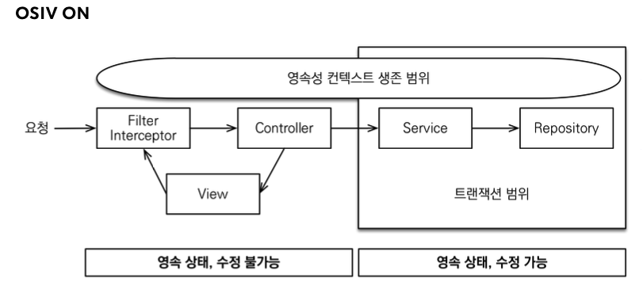
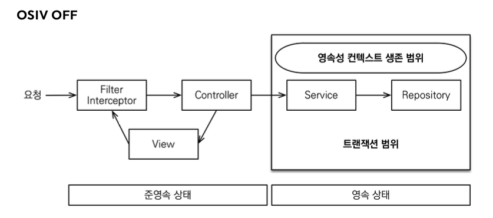

# API개발 기본

이번 스프링부트와 JPA 활용2에서는 활용 1편에서 사용한 코드를 이어서 작성하겠다.

## 회원 등록 API

```java
package jpabook.jpashop.api;

import jakarta.validation.Valid;
import jpabook.jpashop.domain.Member;
import jpabook.jpashop.service.MemberService;
import lombok.Data;
import lombok.RequiredArgsConstructor;
import org.springframework.web.bind.annotation.PostMapping;
import org.springframework.web.bind.annotation.RequestBody;
import org.springframework.web.bind.annotation.RestController;

@RestController
@RequiredArgsConstructor
public class MemberApiController {

    private final MemberService memberService;

    /**
     * 등록 V1: 요청 값으로 Member 엔티티를 직접 받는다.
     * 문제점
     * - 엔티티에 프레젠테이션 계층을 ㅜ이한 로직이 추가된다.
     *  - 엔티티에 API 검증을 위한 로직이 들어간다. (@NotEmpty 등등)
     *  - 실무에서는 회원 엔티티를 위한 API가 다양하게 만들어지는데, 한 엔티티에 각각의 API를 위한 모든 요청사항을 담기는 어렵다.
     *  - 엔티티가 변경되면 API 스펙이 변한다.
     *  결론
     *  - API 요청 스펙에 맞추어 별도의 DTO를 파라미터로 받는다.
     */
    @PostMapping("/api/v1/members")
    public CreateMemberResponse saveMemberV1(@RequestBody @Valid Member member) {
        Long id = memberService.join(member);
        return new CreateMemberResponse(id);
    }


    @Data
    static class CreateMemberRequest {
        private String name;

    }

    @Data
    static class CreateMemberResponse {
        private Long id;

        public CreateMemberResponse(Long id) {
            this.id = id;
        }
    }
}
```

### V1 엔티티를 Request Body에 직접 매핑

- 문제점
  - 엔티티에 프레젠테이션 계층을 위한 로직이 추가된다.
  - 엔티티에 API 검증을 위한 로직이 들어간다. (@NotEmpty 등등)
  - 실무에서는 회원 엔티티를 위한 API가 다양하게 만들어지는데, 한 엔티티에 각각의 API를 위한 모든 요청 요구사항을 담기는 어렵다.
  - 엔티티가 변경되면 API스펙이 변한다.
- 결론
  - API요청 스펙에 맞추어 별도의 DTO를 파라미터로 받는다.

### V2 엔티티 대신에 DTO를 RequestBody에 매핑

```java
/**
 * 등록 V2: 요청 값으로 Member 엔티티 대신에 별도의 DTO를 받는다.
 */
@PostMapping("/api/v2/members")
public CreateMemberResponse saveMemberV2(@RequestBody @Valid CreateMemberRequest request) {
    Member member = new Member();
    member.setName(request.getName());

    Long id = memberService.join(member);
    return new CreateMemberResponse(id);
}
```

- `CreateMemberRequest`를 `Member`엔티티 대신에 RequestBody와 매핑한다.
- 엔티티와 프레젠테이션 계층을 위한 로직을 분리할 수 있다.
- 엔티티와 API스펙을 명확하게 분리할 수 있다.
- 엔티티가 변해도 API 스펙이 변하지 않는다.

> [!TIP]
> 실무에서는 엔티티를 API스펙에 노출하면 안된다!

## 회원 수정 API

```java
/**
 * 수정 API
 */
@PutMapping("/api/v2/members/{id}")
public UpdateMemberResponse updateMemberV2(@PathVariable("id") Long id,
                                           @RequestBody @Valid UpdateMemberRequest request) {
    memberService.update(id, request.getName());
    Member findMember = memberService.findOne(id);
    return new UpdateMemberResponse(findMember.getId(), findMember.getName());
}

@Data
static class UpdateMemberRequest {
    private String name;
}

@Data
@AllArgsConstructor
static class UpdateMemberResponse {
    private Long id;
    private String name;
}
```

- 회원 수정도 DTO를 요청 파라미터에 매핑

```java
public class MemberService {

    private final MemberRepository memberRepository;
    
    // ...

    /**
     * 회원 수정
     */
    @Transactional
    public void update(Long id, String name) {
        Member member = memberRepository.findOne(id);
        member.setName(name);
    }

    // ...

}
```

> [!NOTE]
> 회원 수정 API `updateMemberV2`은 회원 정보를 부분 업데이트 한다. 여기서 PUT방식을 사용했는데, PUT은 전체 업데이트를 할 때 사용하는 것이 맞다. 부분 업데이트를 하려면 PATCH를 사용하거나 POST를 사용하는 것이 REST스타일에 맞다.

## 회원 조회 API

### 회원조회 V1: 응답 값으로 엔티티를 직접 외부에 노출

```java
@RestController
@RequiredArgsConstructor
public class MemberApiController {
    private final MemberService memberService;

    /**
     * 조회 V1: 응답 값으로 엔티티를 직접 외부에 노출한다.
     * 문제점
     * - 엔티티에 프레젠테이션 계층을 위한 로직이 추가된다.
     *  - 기본적으로 엔티티의 모든 값이 노출된다.
     *  - 응답 스펙을 맞추기 위해 로직이 추가된다. (@JsonIgnore, 별도의 뷰 로직 등등)
     *  - 실무에서는 같은 엔티티에 대해 API가 용도에 따라 다양하게 만들어지는데, 한 엔티티에 각각의 API를 위한 프레젠테이션 응답 로직을 담기는 어렵다.
     *  - 엔티티가 변경되면 API 스펙이 변한다.
     *  - 추가로 컬렉션을 직접 반환하면 향후 API스펙을 변경하기 어렵다. (별도의 Result 클래스 생성으로 해결)
     * 결론
     * - API 응답 스펙에 맞추어 별도의 DTO를 반환한다.
     */
    //조회 V1: 안 좋은 버전, 모든 엔티티가 노출, @JsonIgnore -> 이건 정말 최악, api가 이거 하나인가! 화면에 종속적이지 마라!
    @GetMapping("/api/v1/members")
    public List<Member> membersV1() {
        return memberService.findMembers();
    }
}
```

조회 V1: 응답 값으로 엔티티를 직접 외부에 노출함

- 문제점
  - 엔티티에 프레젠테이션 계층을 위한 로직이 추가된다.
  - 기본적으로 엔티티의 모든 값이 노출된다.
  - 응답 스펙을 맞추기 위해 로직이 추가된다. (@JsonIgnore, 별도의 뷰 로직 등등)
  - 실무에서는 같은 엔티티에 대해 API가 용도에 따라 다양하게 만들어지는데, 한 엔티티에 각각의 API를 위한 프레젠테이션 응답 로직을 담기는 어렵다.
  - 엔티티가 변경되면 API스펙이 변한다.
  - 추가로 컬렉션을 직접 반환하면 향후 API스펙을 변경하기 어렵다.(별도의 Result 클래스 생성으로 해결)
- 결론
  - API 응답 스펙에 맞추어 별도의 DTO를 반환한다.

> [!NOTE]
> 엔티티를 외부에 노출하지 말것!!!<br>실무에서는 `member`엔티티의 데이터가 필요한 API가 계속 증가하게 된다. 어떤 API는 `name`필드가 필요하지만, 어떤 API는 `name`필드가 필요없을 수 있다. 결론적으로 엔티티 대신에 API스펙에 맞는 별도의 DTO를 노출해야 한다.

### 회원조회 V2: 응답 값으로 엔티티가 아닌 별도의 DTO 사용

```java
/**
 * 조회 V2: 응답 값으로 엔티티가 아닌 별도의 DTO를 반환한다.
 */
@GetMapping("/api/v2/members")
public Result memberV2() {
    List<Member> findMembers = memberService.findMembers();
    //엔티티 > DTO 변환
    List<MemberDto> collect = findMembers.stream()
            .map(m -> new MemberDto(m.getName()))
            .toList();
        
    return new Result(collect);
}

@Data
@AllArgsConstructor
static class Result<T> {
    private T data;
}

@Data
@AllArgsConstructor
static class MemberDto {
    private String name;
}
```

- 엔티티를 DTO로 변환해서 반환한다.
- 엔티티가 변해도 API 스펙이 변경되지 않는다.
- 추가로 `Result`클래스로 컬렉션을 감싸서 향후 필요한 필드를 추가할 수 있다.

# API개발 고급 - 준비

## 소개

API 개발 고급 전반을 소개

## 조회용 샘플 데이터 입력

API개발 고급 설명을 위해 샘플 데이터를 입력하자.

- userA
  - JPA1 BOOK
  - JPA2 BOOK
- userB
  - SPRING1 BOOK
  - SPRING2 BOOK

```java
package jpabook.jpashop;

import jakarta.annotation.PostConstruct;
import jakarta.persistence.EntityManager;
import jpabook.jpashop.domain.*;
import jpabook.jpashop.domain.item.Book;
import lombok.RequiredArgsConstructor;
import org.springframework.stereotype.Component;
import org.springframework.transaction.annotation.Transactional;

@Component
@RequiredArgsConstructor
public class InitDb {

    private final InitService initService;

    @PostConstruct
    public void init() {
        initService.dbInit1();
        initService.dbInit2();
    }

    @Component
    @Transactional
    @RequiredArgsConstructor
    static class InitService {

        private final EntityManager em;

        public void dbInit1() {
            Member member = createMember("userA", "서울", "1", "1111");
            em.persist(member);

            Book book1 = createBook("JPA1 BOOK", 10000, 100);
            em.persist(book1);

            Book book2 = createBook("JPA2 BOOK", 20000, 100);
            em.persist(book2);

            OrderItem orderItem1 = OrderItem.createOrderItem(book1, 10000, 1);
            OrderItem orderItem2 = OrderItem.createOrderItem(book2, 20000, 2);
            Order order = Order.createOrder(member, createDelivery(member), orderItem1, orderItem2);
            em.persist(order);
        }

        public void dbInit2() {
            Member member = createMember("userB", "대전", "2", "2222");
            em.persist(member);

            Book book1 = createBook("SPRING1 BOOK", 20000, 200);
            em.persist(book1);

            Book book2 = createBook("SPRING2 BOOK", 40000, 300);
            em.persist(book2);

            Delivery delivery = createDelivery(member);

            OrderItem orderItem1 = OrderItem.createOrderItem(book1, 20000, 3);
            OrderItem orderItem2 = OrderItem.createOrderItem(book2, 40000, 4);

            Order order = Order.createOrder(member, delivery, orderItem1, orderItem2);
            em.persist(order);
        }

        private Member createMember(String name, String city, String street, String zipcode) {
            Member member = new Member();
            member.setName(name);
            member.setAddress(new Address(city, street, zipcode));
            return member;
        }

        private Book createBook(String name, int price, int stockQuantity) {
            Book book = new Book();
            book.setName(name);
            book.setPrice(price);
            book.setStockQuantity(stockQuantity);
            return book;
        }

        private Delivery createDelivery(Member member) {
            Delivery delivery = new Delivery();
            delivery.setAddress(member.getAddress());
            return delivery;
        }
    }
}
```

> [!NOTE]
> 주문 내역 화면에서는 회원당 주문 내역을 하나만 출력했으므로 하나만 노출된다.

# API 개발 고급 - 지연 로딩과 조회 성능 최적화

주문 + 배송정보 + 회원을 조회하는 API를 만들자<br>지연 로딩 때문에 발생하는 성능 문제를 단계적으로 해결해보자.

> [!TIP]
> 지금부터 설명하는 내용은 정말 중요하다. 실무에서 JPA를 사용하려면 100% 이해해야 한다. 안그러면 엄청난 고생을 하게 된다.

## 간단한 주문 조회 V1: 엔티티를 직접 노출

```java
package jpabook.jpashop.api;

import jpabook.jpashop.domain.Order;
import jpabook.jpashop.domain.OrderSearch;
import jpabook.jpashop.repository.OrderRepository;
import lombok.RequiredArgsConstructor;
import org.springframework.web.bind.annotation.GetMapping;
import org.springframework.web.bind.annotation.RestController;

import java.util.List;

/**
 * xToOne(ManyToOne, OneToOne) 관계 최적화
 * Order
 * Order -> Member
 * Order -> Delivery
 *
 */
@RestController
@RequiredArgsConstructor
public class OrderSimpleApiController {

    private final OrderRepository orderRepository;

    /**
     * V1. 엔티티 직접 노출
     * - Hibernate5Module 모듈 등록, LAZY=null 처리
     * - 양방향 관계 문제 발생 -> @JsonIgnore
     */
    @GetMapping("/api/v1/simple-orders")
    public List<Order> ordersV1() {
        List<Order> all = orderRepository.findAllByString(new OrderSearch());
        for (Order order : all) {
            order.getMember().getName(); //Lazy 강제 초기화
            order.getDelivery().getAddress(); //Lazy 강제 초기화
        }
        return all;
    }
}
```

- 엔티티를 직접 노출하는 것은 좋지 않다. (앞에서 이미 설명)
- `order` -> `member`와 `order` -> `delivery`는 지연 로딩이다. 따라서 실제 엔티티 대신에 프록시 존재
- jackson 라이브러리는 기본적으로 이 프록시 객체를 json으로 어떻게 생성해야 하는지 모름 -> 예외 발생
- `Hibernate5Module`을 스프링 빈으로 등록하면 해결(스프링 부트 사용중)

### 하이버네이트 모듈 등록

스프링 부트 버전에 따라서 모듈 등록 방법이 다르다. 스프링 부트 3.0부터는 `javax -> jakarta`로 변경되어서 지원 모듈도 다른 모듈을 등록해야 한다.


#### 스프링 부트 3.0이상 : Hibernate5JakartaModule 등록

`build.gradle`에 다음 라이브러리를 추가하자

```gradle
implementation 'com.fasterxml.jackson.datatype:jackson-datatype-hibernate5-jakarta'
```

`JpashopApplication`에 다음 코드를 추가하자

```java
@Bean
Hibernate5JakartaModule hibernate5JakartaModule() {
	return new Hibernate5JakartaModule();
}
```

- 기본적으로 초기화 된 프록시 객체만 노출, 초기화 되지 않은 프록시 객체는 노출 안함

다음과 같이 설정하면 강제로 지연 로딩 가능

```java
@Bean
Hibernate5JakartaModule hibernate5JakartaModule() {
	Hibernate5JakartaModule hibernate5Module = new Hibernate5JakartaModule();
	//강제 지연로딩 설정
	hibernate5Module.configure(Hibernate5JakartaModule.Feature.FORCE_LAZY_LOADING, true);
	return hibernate5Module;
}
```

- 이 옵션을 키면 `order -> member`, `member -> orders`양방향 연관관계를 계속 로딩하게 된다. 따라서 `@JsonIgnore`옵션을 한곳에 주어야 한다.

> [!CAUTION]
> 엔티티를 직접 노출할 때는 양방향 연관관계가 걸린 곳은 꼭! 한곳을 `@JsonIgnore`처리를 해야 한다. 안 그러면 양쪽을 서로 호출하면서 무한 루프가 걸린다.

> [!NOTE]
> 앞에서 계속 강조했듯이 정말 간단한 애플리케이션이 아니면 엔티티를 API응답으로 외부로 노출하는 것은 좋지 않다. 따라서 `Hibernate5Module`를 사용하기 보다는 DTO로 변환하는 것이 더 좋은 방법이다.

> [!CAUTION]
> 지연 로딩(LAZY)를 피하기 위해 즉시 로딩(EARGR)으로 설정하면 안된다! 즉시 로딩 때문에 연관관계가 필요 없는 경우에도 데이터를 항상 조회해서 성능 문제가 발생할 수 있다. 즉시 로딩으로 설정하면 성능 튜닝이 매우 어려워진다.<br>항상 지연로딩을 기본으로 하고, 성능 최적화가 필요한 경우에는 페치 조인(fetch join)을 사용해라(V3에서 설명)

## 간단한 주문 조회 V2: 엔티티를 DTO로 변환

OrderSimpleApiController - 추가

```java
/**
 * V2. 엔티티를 조회해서 DTO로 변환(fetch join 사용x)
 * - 단점: 지연로딩으로 쿼리 N번 호출
 */
@GetMapping("/api/v2/simple-orders")
public List<SimpleOrderDto> ordersV2() {
    List<Order> orders = orderRepository.findAllByString(new OrderSearch());

    return orders.stream()
            .map(SimpleOrderDto::new)
            .toList();
}


@Data
static class SimpleOrderDto {
    private Long orderId;
    private String name;
    private LocalDateTime orderDate; //주문 시간
    private OrderStatus orderStatus;
    private Address address;

    public SimpleOrderDto(Order order) {
        this.orderId = order.getId();
        this.name = order.getMember().getName();
        this.orderDate = order.getOrderDate();
        this.orderStatus = order.getStatus();
        this.address = order.getDelivery().getAddress();
    }
}
```

- 엔티티를 DTO로 변환하는 일반적인 방법이다.
- 쿼리가 총 1 + N + N번 실행된다. (v1과 쿼리수 결과는 같다.)
- `order`조회 1번(order 조회 결과 수가 N이 된다.)
- `order -> member`지연 로딩 조회 N번
- `order -> delivery`지연 로딩 조회 N번
- 예) order의 결과가 4개면 최악의 경우 1 + 4 + 4번 실행도니다.
  - 지연로딩은 영속성 컨텍스트에서 조회하므로, 이미 조회된 경우 쿼리를 생략한다.

## 간단한 주문 조회 V3: 엔티티를 DTO로 변환 - 페치 조인 최적화

OrderSimpleApiController - 추가

```java
/**
 * V3. 엔티티를 조회해서 DTO로 변환(fetch join 사용o)
 * - fetch join으로 쿼리 1번 호출
 * 참고: fetch join에 대한 자세한 내용은 JPA 기본편 참고(정말 중요함)
 */
@GetMapping("/api/v3/simple-orders")
public List<SimpleOrderDto> orderV3() {
    List<Order> orders = orderRepository.findAllWithMemberDelivery();

    return orders.stream().map(SimpleOrderDto::new)
            .toList();
}
```

OrderRepository - 추가 코드

```java
public List<Order> findAllWithMemberDelivery() {
    return em.createQuery(
                    "select o from Order o" +
                            " join fetch o.member m" +
                            " join fetch o.delivery d", Order.class)
            .getResultList();
}
```

- 엔티티를 페치 조인(fetch join)을 사용해서 쿼리 1번에 조회
- 페치 조인으로 `order -> member`, `order -> delivery`는 이미 조회 된 상태 이므로 지연로딩x

## 간단한 주문 조회 V4: JPA에서 DTO로 바로 조회

OrderSimpleApiController - 추가

```java
private final OrderSimpleQueryRepository orderSimpleQueryRepository;

/**
 * V4. JPA에서 DTO바로 조회
 * - 쿼리 1번 호출
 * - select 절에서 원하는 데이터만 선택해서 조회
 */
@GetMapping("/api/v4/simple-orders")
public List<OrderSimpleQueryDto> ordersV4() {
    return orderSimpleQueryRepository.findOrderDtos();
}
```

OrderSimpleQueryRepository조회 전용 리포지토리

```java
package jpabook.jpashop.repository.order.simplequery;

import jakarta.persistence.EntityManager;
import lombok.RequiredArgsConstructor;
import org.springframework.stereotype.Repository;

import java.util.List;

@Repository
@RequiredArgsConstructor
public class OrderSimpleQueryRepository {

    private final EntityManager em;

    public List<OrderSimpleQueryDto> findOrderDtos() {
        return em.createQuery(
                "select new " +
                        "jpabook.jpashop.repository.order.simplequery.OrderSimpleQueryDto(o.id, m.name, o.orderDate, o.status, d.address)" +
                        " from Order o" +
                        " join o.member m" +
                        " join o.delivery d", OrderSimpleQueryDto.class
        ).getResultList();
    }
}
```

OrderSimpleQueryDto 리포지토리에서 DTO직접 조회

```java
package jpabook.jpashop.repository.order.simplequery;

import jpabook.jpashop.domain.Address;
import jpabook.jpashop.domain.OrderStatus;
import lombok.Data;

import java.time.LocalDateTime;

@Data
public class OrderSimpleQueryDto {

    private Long orderId;
    private String name;
    private LocalDateTime orderDate;
    private OrderStatus orderStatus;
    private Address address;

    public OrderSimpleQueryDto(Long orderId, String name, LocalDateTime orderDate,
                               OrderStatus orderStatus, Address address) {
        this.orderId = orderId;
        this.name = name;
        this.orderDate = orderDate;
        this.orderStatus = orderStatus;
        this.address = address;
    }
}
```

- 일반적인 SQL을 사용할 때 처럼 원하는 값을 선택해서 조회
- `new`명령어를 사용해서 JPQL의 결과를 DTO로 즉시 변환
- SELECT 절에서 원하는 데이터를 직접 선택하므로 DB -> 애플리케이션 네트웍 용량 최적화(생각보다 미비)
- 리포지토리 재사용성 떨어짐, API 스펙에 맞춘 코드가 리포지토리에 들어가는 단점

## 정리

엔티티를 DTO로 변환하거나, DTO로 바로 조회하는 두가지 방법은 각각 장단점이 있다. 둘 중 상황에 따라서 더 나은 방법을 선택하면 된다. 엔티티로 조회하면 리포지토리 재사용성도 좋고, 개발도 단순해진다. 따라서 권장하는 방법은 다음과 같다.

### 쿼리 방식 선택 권장 순서

1. 우선 엔티티를 DTO로 변환하는 방법을 선택한다.
2. 필요하면 페치 조인으로 성능을 최적화 한다. -> 대부분의 성능 이슈가 해결된다.
3. 그래도 안되면 DTO로 직접 조회하는 방법을 사용한다.
4. 최후의 방법은 JPA가 제공하는 네이티브 SQL이나 스프링 JDBC Template을 사용해서 SQL을 직접 사용한다.

# API 개발 고급 - 컬렉션 조회 최적화

주문내역에서 추가로 주문한 상품 정보를 추가로 조회하자<br>Order기준으로 컬렉션인 Order 기준으로 컬렉션인 `OrderItem`와 `Item`이 필요하다.

앞의 예제에서는 toOne(OneToOne, ManyToOne) 관계만 있었다. 이번에는 컬렉션인 일대다 관계(OneToMany)를 조회하고, 최적화하는 방법을 알아보자

## 주문 조회 V1: 엔티티를 직접 노출

```java
package jpabook.jpashop.api;

import jpabook.jpashop.domain.Order;
import jpabook.jpashop.domain.OrderItem;
import jpabook.jpashop.domain.OrderSearch;
import jpabook.jpashop.repository.OrderRepository;
import lombok.RequiredArgsConstructor;
import org.springframework.web.bind.annotation.GetMapping;
import org.springframework.web.bind.annotation.RestController;

import java.util.List;

/**
 * V1. 엔티티 직접 노출
 * - 엔티티가 변하면 API 스펙이 변한다.
 * - 트랜잭션 안에서 지연 로딩 필요
 * - 양방향 연관관계 문제
 *
 * V2. 엔티티를 조회해서 DTO로 변환(fetch join 사용x)
 * - 트랜잭션 안에서 지연 로딩 필요
 * V3. 엔티티를 조회해서 DTO로 변환(fetch join 사용o)
 * - 페이징 시에는 N부분을 표기해야함(대신에 batch fetch size? 옵션을 주면 N -> 1 쿼리로 변경 가능)
 *
 * V4. JPA에서 DTO로 바로 조회, 컬렉션 N 조회 (1 + N Query)
 * - 페이징 가능
 * V5. JPA에서 DTO로 바로 조회, 컬렉션 1 조회 최적화 버전(1 + 1 Query)
 * - 페이징 가능
 * V6. JPA에서 DTO로 바로 조회, 플랙 데이터(1Query)
 * - 페이징 불가능...
 */
@RestController
@RequiredArgsConstructor
public class OrderApiController {

    private final OrderRepository orderRepository;

    /**
     * V1. 엔티티 직접 노출
     * - Hibernate5Module 모듈 등록, LAZY=null 처리
     * - 양방향 관계 문제 발생 -> @JsonIgnore
     */
    @GetMapping("/api/v1/orders")
    public List<Order> ordersV1() {
        List<Order> all = orderRepository.findAllByString(new OrderSearch());
        for (Order order : all) {
            order.getMember().getName();
            order.getDelivery().getAddress();
            List<OrderItem> orderItems = order.getOrderItems();
            orderItems.stream().forEach(o -> o.getItem().getName());
        }
        return all;
    }
}
```

- `orderItem`, `item`관계를 직접 초기화하면 `Hibernate5Module`설정에 의해 엔티티를 JSON으로 생성한다.
- 양방향 연관관계면 무한 루프에 걸리지 않도록 한곳에 `@JsonIgnore`를 추가해야 한다.
- 엔티티를 직접 노출하므로 좋은 방법은 아니다.

## 주문 조회 V2: 엔티티를 DTO로 변환

```java
@GetMapping("/api/v2/orders")
public List<OrderDto> ordersV2() {
    List<Order> orders = orderRepository.findAllByString(new OrderSearch());
    return orders.stream()
            .map(o -> new OrderDto(o))
            .toList();
}
```

OrderApiController에 추가

```java
@Data
static class OrderDto {
    private Long orderId;
    private String name;
    private LocalDateTime orderDate; //주문시간
    private OrderStatus orderStatus;
    private Address address;
    private List<OrderItemDto> orderItems;

    public OrderDto(Order order) {
        orderId = order.getId();
        name = order.getMember().getName();
        orderDate = order.getOrderDate();
        orderStatus = order.getStatus();
        address = order.getDelivery().getAddress();
        orderItems = order.getOrderItems().stream()
                .map(orderItem -> new OrderItemDto(orderItem))
                .toList();
    }
}

@Data
static class OrderItemDto {
    private String itemName; //상품 명
    private int orderPrice; //주문 가격
    private int count; //주문 수량

    public OrderItemDto(OrderItem orderItem) {
        itemName = orderItem.getItem().getName();
        orderPrice = orderItem.getOrderPrice();
        count = orderItem.getCount();
    }
}
```

- 지연 로딩으로 너무 많은 SQL 실행
- SQL 실행 수
  - `order` 1번
  - `member`, `address` N번(order 조회 수 만큼)
  - `orderItem` N번(order 조회 수 만큼)
  - `item` N번(orderItem 조회 수 만큼)

> [!NOTE]
> 지연 로딩은 영속성 컨텍스트에 있으면 영속성 컨텍스트에 있는 엔티티를 사용하고 없으면 SQL을 실행한다. 따라서 같은 영속성 컨텍스트에서 이미 로딩한 회원 엔티티를 추가로 조회하면 SQL을 실행하지 않는다.

## 주문 조회 V3: 엔티티를 DTO로 변환 - 페치 조인 최적화

OrderApiController에 추가

```java
@GetMapping("/api/v3/orders")
public List<OrderDto> ordersV3() {
    List<Order> orders = orderRepository.findAllWithItem();
    return orders.stream()
            .map(o -> new OrderDto(o))
            .toList();
}
```

OrderRepository에 추가

```java
public List<Order> findAllWithItem() {
    return em.createQuery(
            "select distinct o from Order o" +
                    " join fetch o.member m" +
                    " join fetch o.delivery d" +
                    " join fetch o.orderItems oi" +
                    " join fetch oi.item i", Order.class)
            .getResultList();
}
```

- 페치 조인으로 SQL이 1번만 실행됨
- `distinct`를 사용한 이유는 1대다 조인이 있으므로 데이터베이스 row가 증가한다. 그 결과 같은 order엔티티의 조회 수도 증가하게 된다. JPA의 distinct는 SQL에 distinct를 추가하고, 더해서 같은 엔티티가 조회되면, 애플리케이션에서 중복을 걸러준다. 이 예에서 order가 컬렉션 페치 조인 때문에 중복 조회되는 것을 막아준다.
- 단점 
  - 페이징 불가능

> [!NOTE]
> 컬렉션 페치 조인을 사용하면 페이징이 불가능하다. 하이버네이트는 경고 로그를 남기면서 모든 데이터를 DB에서 읽어오고, 메모리에서 페이징 해버린다(매우 위험하다).자세한 내용은 자바 ORM 표준 JPA프로그래밍의 페치 조인 부분을 참고하자.

> [!NOTE]
> 컬렉션 페치 조인은 1개만 사용할 수 있다. 컬렉션 둘 이상에 페치 조인을 사용하면 안된다. 데이터가 부정합하게 조회될 수 있다. 자세한 니용은 자바 ORM 표준 JPA프로그래밍을 참고하자.

## 주문 조회 V3.1: 엔티티를 DTO로 변환 - 페이징과 한계 돌파

## 페이징과 한계 돌파

- 컬렉션을 페치 조인하면 페이징이 불가능하다.
  - 컬렉션을 페치 조인하면 일대다 조인이 발생하므로 데이터가 예측할 수 없이 증가한다.
  - 일대다에서 일(1)을 기준으로 페이징을 하는 것이 목적이다. 그런데 데이터는 다(N)을 기준으로 row가 생성된다.
  - Order를 기준으로 페이징하고 싶은데, 다(N)인 OrderItem을 조이하면 OrderItem이 기준이 되어버린다.
  - (더 자세한 내용은 자바 ORM 표준 JPA 프로그래밍 - 페치 조인 한계 참조)
- 이 경우 하이버네이트는 경고 로그를 남기고 모든 DB데이터를 읽어서 메모리에서 페이징을 시도한다. 최악의 경우 장애로 이어질 수 있다.

### 한계 돌파

그러면 페이징 + 컬렉션 엔티티를 함게 조회하려면 어떻게 해야할까?<br>
지금부터 코드도 단순하고, 성능 최적화도 보장하는 매우 강력한 방법을 소개하겠다. 대부분의 페이징 + 컬렉션 엔티티 조회 문제는 이 방법으로 해결할 수 있다.

- 먼저 **ToOne**(OneToOne, ManyToOne)관계를 모두 페치조인 한다. ToOne관계는 row수를 증가시키지 않으므로 페이징 쿼리에 영향을 주지 않는다.
- 컬렉션은 지연 로딩으로 조회한다.
- 지연 로딩 성능 최적화를 위해 `hibernate.default_batch_fetch_size, @BatchSize`를 적용한다.
  - hibernate.default_batch_fetch_size: 글로벌 설정
  - @BatchSize: 개별 최적화
  - 이 옵션을 사용하면 컬렉션이나, 프록시 객체를 한꺼번에 설정한 size만큼 IN쿼리로 조회한다.

OrderRepository에 추가

```java
public List<Order> findAllWithMemberDelivery(int offset, int limit) {
    return em.createQuery(
                    "select o from Order o" +
                            " join fetch o.member m" +
                            " join fetch o.delivery d", Order.class)
            .setFirstResult(offset)
            .setMaxResults(limit)
            .getResultList();
}
```

OrderApiController에 추가

```java
/**
 * V3.1 엔티티를 조회해서 DTO로 변환 페이징 고려
 * - ToOne 관계만 우선 모두 페치 조인으로 최적화
 * - 컬렉션 관계는 hibernate.default_batch_fetch_size, @BatchSize로 최적화
 */
@GetMapping("/api/v3.1/orders")
private List<OrderDto> orderV3_page(@RequestParam(value = "offset", defaultValue = "0") int offset,
                                    @RequestParam(value = "limit", defaultValue = "100") int limit) {
    List<Order> orders = orderRepository.findAllWithMemberDelivery(offset, limit);
    return orders.stream()
            .map(o -> new OrderDto(o))
            .toList();
}
```

최적화 옵션

```yml
spring:
  jpa:
    properties:
      hibernate:
        default_batch_fetch_size: 1000
```

- 개별로 설정하려면 `@BatchSize`를 적용하면 된다.(컬렉션은 컬렉션 필드에, 엔티티는 엔티티 클래스에 적용)

<br>

- 장점
  - 쿼리 호출 수가 `1+N` -> `1+1`로 최적화 된다.
  - 조인보다 DB데이터 전송량이 최적화 된다.(Order와 OrderItem을 조인하면 Order가 OrderItem 만큼 중복해서 조회된다. 이 방법은 각각 조회하므로 전송해야할 중복 데이터가 없다.)
  - 페치 조인 방식과 비교해서 쿼리 호출 수가 약간 증가하지만, DB데이터 전송량이 감소한다.
  - 컬렉션 페치 조인은 페이징이 불가능 하지만 이 방법은 페이징이 가능하다.
- 결론
  - ToOne관계는 페치 조인해도 페이징에 영향을 주지 않는다. 따라서 ToOne 관계는 페치조인으로 쿼리 수를 줄이고 해결하고, 나머지는 `hibernate.default_batch_fetch_size`로 최적화 하자.

> [!NOTE]
> `default_batch_fetch_size`의 크기는 적당한 사이즈를 골라야 하는데, 100~1000사이를 선택하는 것을 권장한다. 이 전략을 SQL IN절을 사용하는데, 데이터베이스에 따라 IN절 파라미터를 1000으로 제한하기도 한다. 1000으로 잡으면 한번에 1000개를 DB에서 애플리케이션에 불러오므로 DB에 순간 부하가 증가할 수 있다. 하지만 애플리케이션은 100이든 1000이든 결국 전체 데이터를 로딩해야 하므로 메모리 사용량이 같다. 1000으로 설정하는 것이 성능상 가장 좋지만, 결국 DB든 애플리케이션이든 순간 부하를 어디까지 견딜 수 있는지로 결정하면 된다.

### 참고 - 스프링 부트 3.1 - 하이버네이트 6.2 변경사항 - array_contains

스프링 부트 3.1부터는 하이버네이트 6.2를 사용한다.<br>하이버네이트 6.2부터는 `where in`대신에 `array_contains`를 사용한다.

**where in 사용 문법**

```sql
where item.item_id in (?,?,?,?)
```

**array_contains 사용 문법**

```sql
where array_contains(?,item.item_id)
```
참고로 `where in`에서 `array_contains`를 사용하도록 변경해도 결과는 완전히 동일하다. 그런데 이렇게 변경하는 이유는 성능 최적화 때문이다.


`select ... where item.item_id in(?)`<br>
이러한 SQL을 실행할 때 데이터베이스는 SQL구문을 이해하기 위해 SQL을 파싱하고 분석하는 등 여러가지 복잡한 일을 처리해야 한다. 그래서 성능을 최적화하기 위해 이미 실행된 SQL구문은 파싱된 결과를 내부에 캐싱하고 있다. 이렇게 해두면 이후에 같은 모양의 SQL이 실행되어도 이미 파싱한 결과를 그대로 사용해서 성능을 최적화 할 수 있다. 참고로 여기서 말하는 캐싱은 SQL 구문 자체를 캐싱한다는 뜻이지 SQL의 실행 결과를 캐싱한다는 뜻이 아니다. SQL구문 자체를 캐싱하기 때문에 여기서 `?`에 바인딩 되는 데이터는 변경되어도 캐싱된 SQL결과를 그대로 사용할 수 있다.


그런데 `where in`쿼리는 동적으로 데이터가 변하는 것을 넘어서 SQL구문 자체가 변해버리는 문제가 발생한다.<br>
다음 예시는 in에 들어가는 데이터 숫자에 따라서 총 3개의 SQL 구문이 생성된다.<br>
```sql
where item.item_id in(?)
where item.item_id in(?,?)
where item.item_id in(?,?,?,?)
```
SQL입장에서 `?`로 바인딩 되는 숫자 자체가 다르기 때문에 완전히 다른 SQL이다. 따라서 총 3개의 SQL 구문이 만들어지고, 캐싱도 3개를 따로 해야한다. 이렇게 되면 성능 관점에서 좋지 않다.


`array_contains`를 사용하면 이런 문제를 깔끔하게 해결할 수 있다.<br>
이 문법은 결과적으로 `where in`과 동일하다. `array_contains`은 왼쪽에 배열을 넣는데, 배열에 들어있는 숫자가 오른쪽(item_id)에 있다면 참이된다.

예시)다음 둘은 같다.<br>
```sql
select ... where array_contains([1,2,3],item.item_id)
select ... item.item_id where in(1,2,3)
```

이 문법은 ?에 바인딩 되는 것이 딱1개 이다. 배열이 1개가 들어가는 것이다.<br>
```sql
select ... where array_contains(?,item.item_id)
```

따라서 배열에 들어가는 데이터가 늘어도 SQL구문 자체가 변하지 않는다. `?`에는 배열 하나만 들어가면 된다.

이런 방법을 사용하면 앞서 이야기한 동적으로 늘어나느 SQL구문을 걱정하지 않아도 된다.<br>결과적으로 데이터가 동적으로 늘어나도 같은 SQL구문을 그대로 사용해서 성능을 최적화 할 수 있다.

참고로 `array_contains`에서 `default_batch_fetch_size`에 맞추어 배열에 `null`값을 추가하는데, 이 부분은 아마도 특정 데이터베이스에 따라서 배열의 데이터 숫자가 같아야 최적화 되기 때문에 그런 것으로 추정된다.

## 주문 조회 V4: JPA에서 DTO 직접 조회

OrderApiController에 추가

```java
private final OrderQueryRepository orderQueryRepository;

@GetMapping("/api/v4/orders")
public List<OrderQueryDto> ordersV4() {
    return orderQueryRepository.findOrderQueryDtos();
}
```

OrderQueryRepository 생성

```java
package jpabook.jpashop.repository.order.query;

import jakarta.persistence.EntityManager;
import lombok.RequiredArgsConstructor;
import org.springframework.stereotype.Repository;

import java.util.List;

@Repository
@RequiredArgsConstructor
public class OrderQueryRepository {

    private final EntityManager em;

    /**
     * 컬렉션은 별도로 조회
     * Query: 루트 1번, 컬렉션 N번
     * 단건 조회에서 많이 사용하는 방식
     */
    public List<OrderQueryDto> findOrderQueryDtos() {
        //루트 조회(toOne 코드를 모두 한번에 조회)
        List<OrderQueryDto> result = findOrders();

        //루프를 돌면서 컬렉션 추가(추가 쿼리 실행)
        result.forEach(o -> {
            List<OrderItemQueryDto> orderItems = findOrderItems(o.getOrderId());
            o.setOrderItems(orderItems);
        });
        return result;
    }

    /**
     * 1:N 관계(컬렉션)를 제외한 나머지를 한번에 조회
     */
    private List<OrderQueryDto> findOrders() {
        return em.createQuery(
                "select new jpabook.jpashop.repository.order.query.OrderQueryDto(o.id, m.name, o.orderDate, o.status, d.address)" +
                        " from  Order o" +
                        " join o.member m" +
                        " join o.delivery d", OrderQueryDto.class)
                .getResultList();
    }

    /**
     * 1:N 관계인 orderItems 조회
     */
    private List<OrderItemQueryDto> findOrderItems(Long orderId) {
        return em.createQuery(
                        "select new jpabook.jpashop.repository.order.query.OrderItemQueryDto(oi.order.id, i.name, oi.orderPrice, oi.count)" +
                                " from OrderItem oi" +
                                " join oi.item i" +
                                " where oi.order.id = : orderId", OrderItemQueryDto.class)
                .setParameter("orderId", orderId)
                .getResultList();
    }
}
```

OrderQueryDto 생성

```java
package jpabook.jpashop.repository.order.query;

import jpabook.jpashop.domain.Address;
import jpabook.jpashop.domain.OrderStatus;
import lombok.Data;
import lombok.EqualsAndHashCode;

import java.time.LocalDateTime;
import java.util.List;

@Data
@EqualsAndHashCode(of = "orderId")
public class OrderQueryDto {

    private Long orderId;
    private String name;
    private LocalDateTime orderDate; //주문시간
    private OrderStatus orderStatus;
    private Address address;
    private List<OrderItemQueryDto> orderItems;

    public OrderQueryDto(Long orderId, String name, LocalDateTime orderDate, OrderStatus orderStatus, Address address) {
        this.orderId = orderId;
        this.name = name;
        this.orderDate = orderDate;
        this.orderStatus = orderStatus;
        this.address = address;
    }
}
```

OrderItemQueryDto 생성

```java
package jpabook.jpashop.repository.order.query;

import com.fasterxml.jackson.annotation.JsonIgnore;
import lombok.Data;

@Data
public class OrderItemQueryDto {

    @JsonIgnore
    private Long orderId; //주문번호
    private String itemName; //상품명
    private int orderPrice; //주문 가격
    private int count; //주문 수량

    public OrderItemQueryDto(Long orderId, String itemName, int orderPrice, int count) {
        this.orderId = orderId;
        this.itemName = itemName;
        this.orderPrice = orderPrice;
        this.count = count;
    }
}
```

- Query: 루트 1번, 컬렉션 N번 실행
- ToOne(N:1, 1:1) 관계들을 먼저 조회하고, ToMany(1:N) 관계는 각각 별도로 처리한다.
  - 이런 방식을 선택한 이유는 다음과 같다.
  - ToOne 관계는 조인해도 데이터 row수가 증가하지 않는다.
  - ToMany(1:N) 관계는 조인하면 row수가 증가한다.
- row수가 증가하지 않는 ToOne 관계는 조인으로 최적화 하기 쉬우므로 한번에 조회하고, ToMany관계는 최적화 하기 어려우므로 `findOrderItems()`같은 별도의 메서드로 조회한다.

## 주문 조회 V5: JPA에서 DTO 직접 조회 - 컬렉션 조회 최적화

OrderApiController에 추가

```java
@GetMapping("/api/v5/orders")
public List<OrderQueryDto> orderV5() {
    return orderQueryRepository.findAllByDto_optimization();
}
```

OrderQueryRepository에 추가

```java
/**
 * 최적화
 * Query: 루트 1번, 컬렉션 1번
 * 데이터를 한꺼번에 처리할 때 많이 사용하는 방식
 */
public List<OrderQueryDto> findAllByDto_optimization() {

    //루트 조회(toOne 코드를 모두 한번에 조회)
    List<OrderQueryDto> result = findOrders();

    //orderItem 컬렋견을 MAP 한방에 조회
    Map<Long, List<OrderItemQueryDto>> orderItemMap = findOrderItemMap(toOrderIds(result));

    //루프를 돌면서 컬렉션 추가(추가 쿼리 실행 x)
    result.forEach(o -> o.setOrderItems(orderItemMap.get(o.getOrderId())));

    return result;
}

private List<Long> toOrderIds(List<OrderQueryDto> result) {
    return result.stream()
            .map(o -> o.getOrderId())
            .toList();
}

private Map<Long, List<OrderItemQueryDto>> findOrderItemMap(List<Long> orderIds) {
    List<OrderItemQueryDto> orderItems = em.createQuery(
                    "select new jpabook.jpashop.repository.order.query.OrderItemQueryDto(oi.order.id, i.name, oi.orderPrice, oi.count)" +
                            " from OrderItem oi" +
                            " join oi.item i" +
                            " where oi.order.id in :orderIds", OrderItemQueryDto.class)
            .setParameter("orderIds", orderIds)
            .getResultList();

    return orderItems.stream()
            .collect(Collectors.groupingBy(OrderItemQueryDto::getOrderId));
}
```

- Query: 루트 1번, 컬렉션 1번
- ToOne 관계들을 먼저 조회하고, 여기서 얻은 식별자 orderId로 ToMany 관계인 `OrderItem`을 한꺼번에 조회
- MAP을 사용해서 매칭 성능 향상(O(1))

## 주문 조회 V6: JPA에서 DTO 직접 조회, 플랫 데이터 최적화

OrderApiController에 추가

```java
@GetMapping("/api/v6/orders")
public List<OrderQueryDto> orderV6() {
    List<OrderFlatDto> flats = orderQueryRepository.findAllByDto_flat();

    return flats.stream()
            .collect(groupingBy(o -> new OrderQueryDto(o.getOrderId(),
                            o.getName(), o.getOrderDate(), o.getOrderStatus(), o.getAddress()),
                    mapping(o -> new OrderItemQueryDto(o.getOrderId(),
                            o.getItemName(), o.getOrderPrice(), o.getCount()), toList())
            )).entrySet().stream()
            .map(e -> new OrderQueryDto(e.getKey().getOrderId(),
                    e.getKey().getName(), e.getKey().getOrderDate(), e.getKey().getOrderStatus(),
                    e.getKey().getAddress(), e.getValue())).toList();
}
```

OrderQueryDtodp 생성자 추가

```java
public OrderQueryDto(Long orderId, String name, LocalDateTime orderDate,        OrderStatus orderStatus,
                     Address address, List<OrderItemQueryDto> orderItems) {
    this.orderId = orderId;
    this.name = name;
    this.orderDate = orderDate;
    this.orderStatus = orderStatus;
    this.address = address;
    this.orderItems = orderItems;
}
```

OrderQueryRepository에 추가

```java
public List<OrderFlatDto> findAllByDto_flat() {
    return em.createQuery(
                    "select new jpabook.jpashop.repository.order.query.OrderFlatDto(o.id, m.name, o.orderDate, o.status, d.address, i.name, oi.orderPrice, oi.count)" +
                            " from Order o" +
                            " join o.member m" +
                            " join o.delivery d" +
                            " join o.orderItems oi" +
                            " join oi.item i", OrderFlatDto.class)
            .getResultList();
}
```

OrderFlatDto

```java
package jpabook.jpashop.repository.order.query;

import jpabook.jpashop.domain.Address;
import jpabook.jpashop.domain.OrderStatus;
import lombok.Data;

import java.time.LocalDateTime;

@Data
public class OrderFlatDto {

    private Long orderId;
    private String name;
    private LocalDateTime orderDate; //주문 시간
    private Address address;
    private OrderStatus orderStatus;

    private String itemName; //상품 명
    private int orderPrice; //주문 가격
    private int count; //주문 수량

    public OrderFlatDto(Long orderId, String name, LocalDateTime orderDate,
                         OrderStatus orderStatus,Address address, String itemName,
                        int orderPrice, int count) {
        this.orderId = orderId;
        this.name = name;
        this.orderDate = orderDate;
        this.address = address;
        this.orderStatus = orderStatus;
        this.itemName = itemName;
        this.orderPrice = orderPrice;
        this.count = count;
    }
}
```

- Query: 1번
- 단점
  - 쿼리는 한번이지만 조인으로 인해 DB에서 애플리케이션에 전달하는 데이터에 중복 데이터가 추가되므로 상황에 따라 V5보다 더 느릴 수도 있다.
  - 애플리케이션에서 추가 작업이 크다.
  - 페이징 불가능

## API 개발 고급 정리

정리

- 엔티티 조회
  - 엔티티를 조회해서 그대로 반환: V1
  - 엔티티 조회 후 DTO로 변환: V2
  - 페치 조인으로 쿼리 수 최적화: V3
  - 컬렉션 페이징과 한계 돌파: V3.1
    - 컬렉션은 페치 조인시 페이징이 불가능
    - ToOne 관계는 페치 조인으로 쿼리 수 최적화
    - 컬렉션은 페치 조인 대신에 지연로딩을 유지하고, `hibernate.default_batch_fetch_size`, `@BatchSize`로 최적화
- DTO 직접 조회
  - JPA에서 DTO를 직접 조회: V4
  - 컬렉션 조회 최적화 - 일대다 관계인 컬렉션은 IN절을 활용해서 메모리에 미리 조회해서 최적화: V5
  - 플랫 데이터 최적화 - JOIN 결과를 그대로 조회 후 애플리케이션에서 원하는 모양으로 직접 변환: V6

### 권장 순서

1. 엔티티 조회 방식으로 우선 접근
   1. 페치조인으로 쿼리 수를 최적화
   2. 컬렉션 최적화
      1. 페이징 필요 `hibernate.default_batch_fetch_size`, `@BatchSize`로 최적화
      2. 페이징 필요X -> 페치 조인 사용
2. 엔티티 조회 방식으로 해결이 안되면 DTO 조회 방식 사용
3. DTO 조회 방식으로 해결이 안되면 NativeSQL or 스프링 Jdbc Template

> [!TIP]
> 엔티티 조회 방식은 페치 조인이나, `hibernate.default_batch_fetch_size`, `@BatchSize`같이 코드를 거의 수정하지 않고, 옵션만 약간 변경해서, 다양한 성능 최적화를 시도할 수 있다. 반면에 DTO를 직접 조회하는 방식은 성능을 최적화 하거나 성능 최적화 방식을 변경할 때 많은 코드를 변경해야 한다.

> [!NOTE]
> 개발자는 성능 최적화와 코드 복잡도 사이에서 줄타기를 해야 한다. 항상 그런 것은 아니지만, 보통 성능 최적화는 단순한 코드를 복잡한 코드로 몰고간다.<br>엔티티 조회 방식은 JPA가 많은 부분을 최적화 해주기 때문에, 단순한 코드를 유지하면서, 성능을 최적화 할 수 있다.<br>반면에 DTO조회 방식은 SQL을 직접 다루는 것과 유사하기 때문에, 둘 사이에 줄타기를 해야 한다.

### DTO 조회 방식의 선택지

- DTO로 조회하는 방법도 각각 장단이 있다. V4, V5, V6에서 단순하게 쿼리가 1번 실행된다고 V6가 항상 좋은 방법인 것은 아니다
- V4는 코드가 단순하다. 특정 주문 한건만 조회하면 이 방식을 사용해도 성능이 잘 나온다. 예를 들어서 조회한 Order데이터가 1건이면 OrderItem을 찾기 위한 쿼리도 1번만 실행하면 된다.
- V5는 코드가 복잡하다. 여러 주문을 한꺼번에 조회하는 경우에는 V4대신에 이것을 최적화한 V5방식을 사용해야 한다. 예를 들어서 조회한 Order 데이터가 1000건인데, V4방식을 그대로 사용하면, 쿼리가 총 1 + 1000번 실행된다. 여기서 1은 Order를 조회한 쿼리고, 1000은 조회한 Order의 row수다. V5 방식으로 최적화 하면 쿼리가 총 1+1번만 실행된다. 상황에 따라 다르겠지만 운영 환경에서 100배 이상의 성능 차이가 날 수 있다.
- V6는 완전히 다른 접근방식이다. 쿼리 한번으로 최적화 되어서 상당히 좋아보이지만, Order를 기준으로 페이징이 불가능하다. 실무에서는 이정도 데이터면 수백이나, 수천건 단위로 페이징 처리가 꼭 필요하므로, 이 경우 선택하기 어려운 방법이다. 그리고 데이터가 많으면 중복 전송이 증가해서 V5와 비교해서 성능 차이도 미비하다

# API 개발 고급 - 실무 필수 최적화

## OSIV와 성능 최적화

- Open Session In View: 하이버네이트
- Open EntityManager In View: JPA

(관례상 OSIV라 한다.)

<br>

- `spring.jpa.open-in-view`: true 기본값

이 기본값을 뿌리면서 애플리케이션 시작 시점에 warn 로그를 남기는 것은 이유가 있다.<br>
OSIV 전략은 트랜잭션 시작처럼 최초 데이터베이스 커넥션 시점 시작부터 API응답이 끝날 때 까지 영속성 컨텍스트와 데이터베이스 커넥션을 유지한다. 그래서 지금까지 View Template이나 API 컨트롤러에서 지연 로딩이 가능했던 것이다.<br>
지연 로딩은 영속성 컨텍스트가 살아있어야 가능하고, 영속성 컨텍스트는 기본적으로 데이터베이스 커넥션을 유지한다.<br>이것 자체가 큰 장점이다.

그런데 이 전략은 너무 오랜시간동안 데이터베이스 커넥션 리소스를 사용하기 때문에, 실시간 트래픽이 중요한 애플리케이션에서는 커넥션이 모자랄 수 있다. 이것은 결국 장애로 이어진다.

예를 들어서 컨트롤러에서 외부 API를 호출하면 외부 API대기 시간 만큼 커넥션 리소스를 반환하지 못하고, 유지해야 한다.

<br>

- `spring.jpa.open-in-view: false` OSIV 종료

OSIV를 끄면 트랜잭션을 종료할 때 영속성 컨텍스트를 닫고, 데이터베이스 커넥션도 반환한다. 따라서 커넥션 리소스를 낭비하지 않는다.<br>OSIV를 그면 모든 지연로딩을 트랜잭션 안에서 처리해야 한다. 따라서 지금까지 작성한 많은 지연 로딩 코드를 트랜잭션 안으로 넣어야 하는 단점이 있다. 그리고 view template에서 지연로딩이 동작하지 않는다. 결론적으로 트랜잭션이 끝나기 전에 지연 로딩을 강제로 호출해 두어야 한다.

### 커먼드와 쿼리 분석

실무에서 **OSIV를 끈 상태**로 복잡성을 관리하는 좋은 방법이 있다. 바로 Command와 Query를 분리하는 것이다.<br> 참고: https://en.wikipedia.org/wiki/Command%E2%80%93query_separation

보통 비즈니스 로직은 특정 엔티티 몇 개를 등록하거나 수정하는 것이므로 성능이 크게 문제가 되지 않는다. 그런데 복잡한 화면을 출력하기 위한 쿼리는 화면에 맞추어 성능을 최적화 하는 것이 중요하다. 하지만 그 복잡성에 비해 핵심 비즈니스에 큰 영향을 주는 것은 아니다.<br>그래서 크고 복잡한 애플리케이션을 개발한다면, 이 둘의 관심사를 명확하게 분리하는 선택은 유지보수 관점에서 충분히 의미 있다.<br>단순하게 설명해서 다음처럼 분리하는 것이다.

- OrderService
  - OrderService: 핵심 비즈니스 로직
  - OrderQueryService: 화면이나 API에 맞춘 서비스(주로 읽기 전용 트랜잭션 사용)

보통 서브스 계층에서 트랜잭션을 유지한다. 두 서비스 모두 트랜잭션을 유지하면서 지연 로딩을 사용할 수 있다.

> [!TIP]
> 주로 고객 서비스의 실시간 API는 OSIV를 끄고, ADMIN처럼 커넥션을 많이 사용하지 않는 곳에서는 OSIC를 견다.
