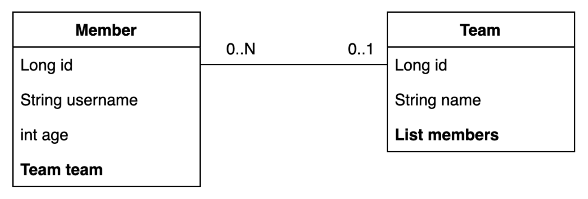
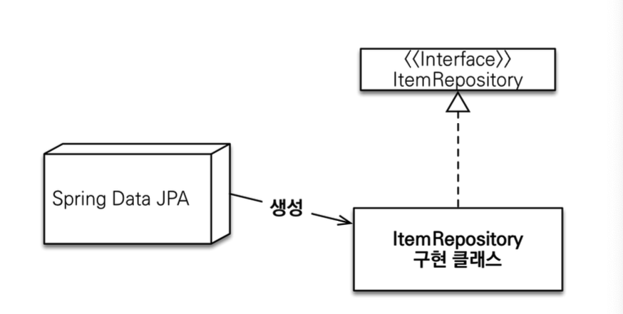
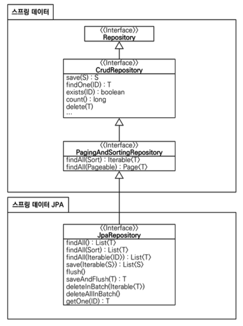

# 프로젝트 환경 설정

## 프로젝트 생성

- Project: **Gradle-Groovy** project
- 사용 기능: web, jpa, h2, lombok
  - SpringBootVersion: 3.x.x
  - groupId: study
  - artifactId: data-jpa

## 라이브러리 살펴보기

`./gradlew dependencies --configuration compileClasspath`

**스프링 부트 라이브러리 살펴보기**

- spring-boot-starter-web
  - spring-boot-starter-tomcat: 톰캣 (웹서버)
  - spring-webmvc: 스프링 웹 MVC
- spring-boot-starter-data-jpa
  - spring-boot-starter-aop
  - spring-boot-starter-jdbc
    - HikariCP 커넥션 풀
  - hibernate + JPA: 하이버네이트 + JPA
  - spring-data-jpa: 스프링 데이터 JPA
- spring-boot-starter(공통): 스프링 부트 + 스프링 코어 + 로깅
  - spring-boot
    - spring-core
  - spring-boot-starter-logging
    - logback, slf4j


## H2 데이터베이스 설치

개발이나 테스트 용도로 가볍고 편리한 DB, 웹 화면 제공

- 데이터베이스 파일 생성 방법
  - `jdbc:h2:~/datajpa` (최소 한번)
  - `~/datajpa.mv.db`파일 생성 확인
  - 이후 부터는 `jdbc:h2:tcp://localhost/~/datajpa`이렇게 접속

https://www.h2database.com

## 스프링 데이터 JPA와 DB 설정, 동작확인

`application.yml`

```yml
spring:
  datasource:
    url: jdbc:h2:tcp://localhost/~/datajpa
    username: sa
    password:
    driver-class-name: org.h2.Driver

  jpa:
    hibernate:
      ddl-auto: create
    properties:
      hibernate:
#        show_sql: true
        format_sql: true

logging:
  level:
    org.hibernate.sql: debug
#    org.hibernate.type: trace
```

> [!TIP]
> 모든 로그 출력은 가급적 로거를 통해 남겨야 한다.<br>`show_sql`: 옵션은 `System.out`에 하이버네이트 실행 SQL을 남긴다. `org.hibernate.sql`옵션은 logger를 통해 하이버네이트 실행 sQL을 남긴다.

### 실제 동작하는지 확인하기

회원 엔티티

```java
@Entity
@Getter @Setter
public class Member {

    @Id @GeneratedValue
    private Long id;
    private String username;
    ...
}
```

회원 JPA 리포지토리

```java
@Repository
public class MemberJpaRepository {

    @PersistenceContext
    private EntityManager em;

    public Member save(Member member) {
        em.persist(member);
        return member;
    }

    public Member find(Long id) {
        return em.find(Member.class, id);
    }
}
```

JPA 기반 테스트

```java
@SpringBootTest
@Transactional
@Rollback(value = false)
class MemberJpaRepositoryTest {

    @Autowired
    MemberJpaRepository memberJpaRepository;

    @Test
    public void testMember() {
        Member member = new Member("memberA");
        Member savedMember = memberJpaRepository.save(member);

        Member findMember = memberJpaRepository.find(savedMember.getId());

        Assertions.assertThat(findMember.getId()).isEqualTo(savedMember.getId());
        Assertions.assertThat(findMember.getUsername()).isEqualTo(savedMember.getUsername());

        Assertions.assertThat(findMember).isEqualTo(savedMember);
    }
}
```

스프링 데이터 JPA 리포지토리

```java
public interface MemberRepository extends JpaRepository<Member, Long> {
}
```

스프링 데이터 JPA 기반 테스트

```java
@SpringBootTest
@Transactional
@Rollback(value = false)
public class MemberRepositoryTest {

    @Autowired
    MemberRepository memberRepository;

    @Test
    public void testMember() {
        Member member = new Member("memberA");
        Member savedMember = memberRepository.save(member);

        Member findMember = memberRepository.findById(savedMember.getId()).get();

        Assertions.assertThat(findMember.getId()).isEqualTo(member.getId());
        Assertions.assertThat(findMember.getUsername()).isEqualTo(member.getUsername());
        Assertions.assertThat(findMember).isEqualTo(member);
    }
}
```

- Entity, Repository 동작 확인
- jar 빌드해서 동작 확인

> [!NOTE]
> 스프링 부트를 통해 복잡한 설정이 다 자동화 되었다. `persistence.xml`도 없고 `LocalContainerEntityManagerFactoryBean`도 없다. 스프링 부트를 통한 추가 설정을 스프링 부트 메뉴얼을 참고하자.

### 쿼리 파라미터 로그 남기기

- 로그를 다음을 추가하기 `org.hibernate.type`: SQL 실행 파라미터를 로그로 남긴다.
- 외부 라이브러리 사용
  - https://github.com/gavlyukovskiy/spring-boot-data-source-decorator
  
스프링 부트를 사용하려면 이 라이브러리만 추가하면 된다.

`implementation 'com.github.gavlyukovskiy:p6spy-spring-boot-starter:1.9.0'`

> [!TIP]
> 쿼리 파라미터를 로그로 남기는 외부 라이브러리는 시스템 자원을 사용하므로, 개발 단계에서는 편하게 사용해도 된다. 하지만 운영시스템에 젹용하려면 꼭 성능테스트를 하고 사용하는 것이 좋다.

# 예제 도메인 모델

## 예제 도메인 모델과 동작확인

**엔티티 클래스**

<br>

**ERD**

<br>

**Member 엔티티**

```java
package study.data_jpa.entity;

import jakarta.persistence.*;
import lombok.*;

@Entity
@Getter @Setter
@NoArgsConstructor(access = AccessLevel.PROTECTED)
@ToString(of = {"id", "username", "age"})
public class Member {

    @Id @GeneratedValue
    @Column(name = "member_id")
    private Long id;
    private String username;
    private int age;

    @ManyToOne(fetch = FetchType.LAZY)
    @JoinColumn(name = "team_id")
    private Team team;

    public Member(String username) {
        this(username, 0);
    }

    public Member(String username, int age) {
        this(username, age, null);
    }

    public Member(String username, int age, Team team) {
        this.username = username;
        this.age = age;
        if (team != null) {
            changeTeam(team);
        }
    }

    public void changeTeam(Team team) {
        this.team = team;
        team.getMembers().add(this);
    }
}
```

- 롬복 설정
  - @Setter: 실무에서 가급적 Setter는 사용하지 않기
  - @NoArgsConstructor AccessLevel.PROTECTED: 기본 생성자 막고 싶은데, JPA 스펙상 PROTECTED로 열어두어야 함
  - @ToString은 가급적 내부 필드만(연관관계 없는 필드만)
- `changeTeam()`으로 양방향 연관관계 한번에 처리(연관관계 편의 메서드)

**Team 엔티티**

```java
package study.data_jpa.entity;

import jakarta.persistence.*;
import lombok.*;

import java.util.ArrayList;
import java.util.List;

@Entity
@Getter @Setter
@NoArgsConstructor(access = AccessLevel.PROTECTED)
@ToString(of = {"id", "name"})
public class Team {

    @Id @GeneratedValue
    @Column(name = "team_id")
    private long id;
    private String name;

    @OneToMany(mappedBy = "team")
    List<Member> members = new ArrayList<>();

    public Team(String name) {
        this.name = name;
    }
}
```

- Member와 Team은 양방향 연관관계, `Member.team`이 연관관계의 주인, `Team.members`는 연관관계의 주인이 아님, 따라서 `Member.team`이 데이터베이스 외래키 값을 변경, 반대편은 읽기만 가능

**데이터 확인 테스트**

```java
package study.data_jpa.entity;

import jakarta.persistence.EntityManager;
import jakarta.persistence.PersistenceContext;
import org.junit.jupiter.api.Test;
import org.springframework.boot.test.context.SpringBootTest;
import org.springframework.test.annotation.Rollback;
import org.springframework.transaction.annotation.Transactional;

import java.util.List;

import static org.junit.jupiter.api.Assertions.*;

@SpringBootTest
public class MemberTest {

    @PersistenceContext
    EntityManager em;

    @Test
    @Transactional
    //@Rollback(value = false)
    public void testEntity() {
        Team teamA = new Team("teamA");
        Team teamB = new Team("teamB");
        em.persist(teamA);
        em.persist(teamB);

        Member member1 = new Member("member1", 10, teamA);
        Member member2 = new Member("member2", 20, teamA);
        Member member3 = new Member("member3", 30, teamB);
        Member member4 = new Member("member4", 40, teamB);

        em.persist(member1);
        em.persist(member2);
        em.persist(member3);
        em.persist(member4);

        //초기화
        em.flush();
        em.clear();

        //확인
        List<Member> members = em.createQuery("select m from Member m", Member.class)
                .getResultList();

        for (Member member : members) {
            System.out.println("member = " + member);
            System.out.println("-> member.team=" + member.getTeam());
        }
    }
}
```

- 가급적 순수 JPA로 동작 확인(뒤에서 변경)
- DB테이블 결과 확인
- 지연 로딩 동작 확인

# 공통 인터페이스 기능

## 순수 JPA기반 리포지토리 만들기

- 순수한 JPA 기반 리포지토리를 만들자
- 기본 CRUD
  - 저장
  - 변경 -> 변경감지 사용
  - 삭제
  - 전체 조회
  - 단건 조회
  - 카운트

> [!NOTE]
> JPA에서 수정은 변경감지 기능을 사용하면 된다.<br>트랜잭션 안에서 엔티티를 조회한 다음에 데이터를 변경하면, 트랜잭션 종료 시점에 변경감지 기능이 작동해서 변경된 엔티티를 감지하고 UPDATE SQL을 실행한다.

**순수 JPA 기반 리포지토리 - 회원**

```java
package study.data_jpa.repository;

import jakarta.persistence.EntityManager;
import jakarta.persistence.PersistenceContext;
import org.springframework.stereotype.Repository;
import study.data_jpa.entity.Member;

import java.util.List;
import java.util.Optional;

@Repository
public class MemberJpaRepository {

    @PersistenceContext
    private EntityManager em;

    public Member save(Member member) {
        em.persist(member);
        return member;
    }

    public void delete(Member member) {
        em.remove(member);
    }

    public List<Member> findAll() {
        return em.createQuery("select m from Member m", Member.class)
                .getResultList();
    }

    public Optional<Member> findById(Long id) {
        Member member = em.find(Member.class, id);
        return Optional.ofNullable(member);
    }

    public long count() {
        return em.createQuery("select count(m) from Member m", Long.class)
                .getSingleResult();
    }

    public Member find(Long id) {
        return em.find(Member.class, id);
    }
}
```

**순수 JPA 기반 리포지토리 - 팀**

```java
package study.data_jpa.repository;

import jakarta.persistence.EntityManager;
import jakarta.persistence.PersistenceContext;
import org.springframework.stereotype.Repository;
import study.data_jpa.entity.Team;

import java.util.List;
import java.util.Optional;

@Repository
public class TeamJpaRepository {

    @PersistenceContext
    private EntityManager em;

    public Team save(Team team) {
        em.persist(team);
        return team;
    }

    public void delete(Team team) {
        em.remove(team);
    }

    public List<Team> findAll() {
        return em.createQuery("select t from Team t", Team.class)
                .getResultList();
    }

    public Optional<Team> findById(Long id) {
        Team team = em.find(Team.class, id);
        return Optional.ofNullable(team);
    }

    public long count() {
        return em.createQuery("select count(t) from Team t", Long.class)
                .getSingleResult();
    }
}
```

- 회원 리포지토리와 거의 동일하다.

**순수 JPA기반 리포지토리 테스트**

```java
package study.data_jpa.repository;

import org.assertj.core.api.Assertions;
import org.junit.jupiter.api.Test;
import org.springframework.beans.factory.annotation.Autowired;
import org.springframework.boot.test.context.SpringBootTest;
import org.springframework.transaction.annotation.Transactional;
import study.data_jpa.entity.Member;

import java.util.List;

@SpringBootTest
@Transactional
class MemberJpaRepositoryTest {

    @Autowired
    MemberJpaRepository memberJpaRepository;

    @Test
    public void testMember() {
        Member member = new Member("memberA");
        Member savedMember = memberJpaRepository.save(member);

        Member findMember = memberJpaRepository.find(savedMember.getId());

        Assertions.assertThat(findMember.getId()).isEqualTo(savedMember.getId());
        Assertions.assertThat(findMember.getUsername()).isEqualTo(savedMember.getUsername());

        Assertions.assertThat(findMember).isEqualTo(savedMember);
    }

    @Test
    public void basicCRUD() {
        Member member1 = new Member("member1");
        Member member2 = new Member("member2");
        memberJpaRepository.save(member1);
        memberJpaRepository.save(member2);

        //단건 조회 검증
        Member findMember1 = memberJpaRepository.findById(member1.getId()).get();
        Member findMember2 = memberJpaRepository.findById(member2.getId()).get();
        Assertions.assertThat(findMember1).isEqualTo(member1);
        Assertions.assertThat(findMember2).isEqualTo(member2);

        //리스트 조회 검증
        List<Member> all = memberJpaRepository.findAll();
        Assertions.assertThat(all.size()).isEqualTo(2);

        //카운트 검증
        long count = memberJpaRepository.count();
        Assertions.assertThat(count).isEqualTo(2);

        //삭제 검증
        memberJpaRepository.delete(member1);
        memberJpaRepository.delete(member2);

        long deletedCount = memberJpaRepository.count();
        Assertions.assertThat(deletedCount).isEqualTo(0);

    }
}
```

- 기본 CRUD를 검증한다.

## 공통 인터페이스 설정


**JavaConfig설정 - 스프링 부트 사용시 생략 가능**

```java
@Configuration
@EnableJpaRepository(basePackages = "jpabook.jpashop.repository")
public class AppConfig {}
```

- 스프링 부트 사용시 `@SpringBootApplication` 위치를 지정(해당 패키지와 하위 패키지 인식)
- 만약 위치가 달라지면 `@EnableJpaRepositories` 필요 

**스프링 데이터 JPA가 구현 클래스 대신 생성**

<br>

- `org.springframework.data.repository.Repository`를 구현한 클래스는 스캔 대상
  - MemberRepository인터페이스가 동작한 이유
  - 실제 출력해보기(Proxy)
  - memberRepository.getClass() -> class com.sun.proxy.$ProxyXXX
- `@Repository`애노테이션 생략 가능
  - 컴포넌트 스캔을 스프링 데이터 JPA가 자동으로 처리
  - JPA예외를 스프링 예외로 변환하는 과정도 자동으로 처리 


## 공통 인터페이스 적용

순수 JPA로 구현한 `MemberJpaRepository`대신에 스프링 데이터 JPA가 제공하는 공통 인터페이스 사용

**스프링 데이터 JPA기반 MemberRepository**

```java
public interface MemberRepository extends JpaRepository<Member, Long> {
}
```

**MemberRepository 테스트**

```java
package study.data_jpa.repository;

import org.assertj.core.api.Assertions;
import org.junit.jupiter.api.Test;
import org.springframework.beans.factory.annotation.Autowired;
import org.springframework.boot.test.context.SpringBootTest;
import org.springframework.transaction.annotation.Transactional;
import study.data_jpa.entity.Member;

import java.util.List;

@SpringBootTest
@Transactional
public class MemberRepositoryTest {

    @Autowired
    MemberRepository memberRepository;

    @Test
    public void testMember() {
        Member member = new Member("memberA");
        Member savedMember = memberRepository.save(member);

        Member findMember = memberRepository.findById(savedMember.getId()).get();

        Assertions.assertThat(findMember.getId()).isEqualTo(member.getId());
        Assertions.assertThat(findMember.getUsername()).isEqualTo(member.getUsername());
        Assertions.assertThat(findMember).isEqualTo(member);
    }

    @Test
    public void basicCRUD() {
        Member member1 = new Member("member1");
        Member member2 = new Member("member2");
        memberRepository.save(member1);
        memberRepository.save(member2);

        //단건 조회 검증
        Member findMember1 = memberRepository.findById(member1.getId()).get();
        Member findMember2 = memberRepository.findById(member2.getId()).get();

        Assertions.assertThat(findMember1).isEqualTo(member1);
        Assertions.assertThat(findMember2).isEqualTo(member2);

        //리스트 조회 검증
        List<Member> all = memberRepository.findAll();
        Assertions.assertThat(all.size()).isEqualTo(2);

        //삭제 검증
        memberRepository.delete(member1);
        memberRepository.delete(member2);

        long deletedCount = memberRepository.count();
        Assertions.assertThat(deletedCount).isEqualTo(0);

    }

}
```

기존 순수 JPA기반 테스트에서 사용했던 코드를 그대로 스프링 데이터 JPA 리포지토리 기반 테스트로 변경해도 동일한 방식으로 동작

**TeamRepository 생성**

```java
package study.data_jpa.repository;

import org.springframework.data.jpa.repository.JpaRepository;
import study.data_jpa.entity.Team;

public interface TeamRepository extends JpaRepository<Team, Long> {
}
```

- TeamRepository는 테스트 생략
- Generic
  - T: 엔티티 타입
  - ID: 식별자 타입(PK)

## 공통 인터페이스 분석

- JpaRepository 인터페이스: 공통 CRUD 제공
- 제네릭은 <엔티티 타입, 식별자 타입> 설정

`JpaRepository`공통 기능 인터페이스

```java
public interface JpaRepository<T, ID extends Serializable> extends PagingAndSortingRepository<T, ID> {
    ...
}
```

`JpaRepository`를 사용하는 인터페이스

```java
public interface MemberRepository extends JpaRepository<Member, Long> {
}
```

### 공통 인터페이스 구성

<br>

**주의**

- `T findOne(ID)` -> `Optional<T> findById(ID)` 변경
- `boolean exists(ID)` -> `boolean existsById(ID)` 변경

**제네릭 타입**

- `T`: 엔티티
- `ID`: 엔티티의 식별자 타입
- `S`: 엔티티와 그 자식 타입

**주요 메서드**

- `save(S)`: 새로운 엔티티는 저장하고 이미 있는 엔티티는 병합한다.
- `delete(T)`: 엔티티 하나를 삭제한다. 내부에서 내부에서 `EntityManager.remove()`호출
- `findById(ID)`: 엔티티 하나를 조회한다. 내부에서 `EntityManager.find()`호출
- `getOne(ID)`: 엔티티를 프록시로 조회한다. 내부에서 `EntityManager.getReference()`호출
- `findAll(...)`: 모든 엔티티를 조회한다. 정렬(`Sort`)이나 페이징(`Pageable`)조건을 파라미터로 제공할 수 있다.

> [!TIP]
> `JpaRepository`는 대부분의 공통 메서드를 제공한다.

# 쿼리 메소드 기능

스프링 데이터 JPA가 제공하는 마법 같은 기능

**쿼리 메소드 기능 3가지**

- 메소드 이름으로 쿼리 생성
- 매소드 이름으로 JPA NamedQuery호출
- `@Query`어노테이션을 사용해서 리포지토리 인터페이스에 쿼리 직접 정의

## 메소드 이름으로 쿼리 생성

메소드 이름을 분석해서 JPQL 쿼리 실행

이름과 나이를 기준으로 회원을 조회하려면?

**순수 JPA 리포지토리**

```java
public List<Member> findByUsernameAndAgeGreaterThan(String username, int age) {
    return em.createQuery("select m from Member m where m.username =:username and m.age > :age", Member.class)
            .setParameter("username", username)
            .setParameter("age", age)
            .getResultList();
}
```

**순수 JPA 테스트 코드**

```java
@Test
public void findByUsernameAndAgeGreaterThan() {
    Member m1 = new Member("AAA", 10);
    Member m2 = new Member("AAA", 20);
    memberJpaRepository.save(m1);
    memberJpaRepository.save(m2);

    List<Member> result = memberJpaRepository.findByUsernameAndAgeGreaterThan("AAA", 15);
    Assertions.assertThat(result.get(0).getUsername()).isEqualTo("AAA");
    Assertions.assertThat(result.get(0).getAge()).isEqualTo(20);
    Assertions.assertThat(result.size()).isEqualTo(1);
}
```

**스프링 데이터 JPA**

```java
public interface MemberRepository extends JpaRepository<Member, Long> {

    List<Member> findByUsernameAndAgeGreaterThan(String username, int age);
}
```

- 스프링 데이터 JPA는 메소드 이름을 분석해서 JPQL을 생성하고 실행

**쿼리 메소드 필터 조건**

스프링 데이터 JPA 공식 문서 참고: https://docs.spring.io/spring-data/jpa/reference/jpa/query-methods.html#jpa.query-methods.query-creation

**스프링 데이터 JPA가 제공하는 쿼리 메소드 기능**

- 조회: find...By, read...By, query...By get...By
  - https://docs.spring.io/spring-data/jpa/reference/jpa/query-methods.html#jpa.query-methods.query-creation
  - 예:) findHelloBy처럼 ...에 식별하기 위한 내용(설명)이 들어가도 된다.
- COUNT: count...By 반환타입 `long`
- EXISTS: exists...By 반환타입 `boolean`
- DISTINCT: findDistinct, findMemberDistinctBy
- LIMIT: findFirst3, findFirst, findTop, findTop3

> [!NOTE]
> 이 기능은 엔티티의 필드명이 변경되면 인터페이스에 정의한 메서드 이름도 꼭 함께 변환해야 한다. 그렇지 않으면 애플리케이션을 시작하는 시점에 오류가 발생한다.<br>이렇게 애플리케이션 로딩 시점에 오류를 인지할 수 있는 것이 스프링 데이터 JPA의 매우 큰 장점이다.

## JPA NamedQuery

JPA의 NamedQuery를 호출할 수 있음

`@NamedQuery`어노테이션으로 Named 쿼리 정의

```java
@Entity
@NamedQuery(
        name = "Member.findByUsername",
        query = "select m from Member m where m.username = :username"
)
public class Member {
    ...
}
```

**JPA를 직접 사용해서 Named쿼리 호출**

```java
public class MemberRepository {
    public List<Member> findByUsername(String username) {
        ...
        List<Member> resultList = 
            em.createNamedQuery("Member.findByUsername", Member.class)
                .setParameter("username", username)
                .getResultList();
    }
}
```

**스프링 데이터 JPA로 NamedQuery 사용**

```java
@Query(name = "Member.findByUsername")
List<Member> findByUsername(@Param("username") String username);
```

`@Query`를 생략하고 메서드 이름만으로 Named쿼리를 호출할 수 있다.

**스프링 데이터 JPA로 Named 쿼리 호출**

```java
public interface MemberRepository 
            extends JpaRepository<Member, Long> {

    List<Member> findByUsername(@Param("username") String username);
}
```

- 스프링 데이터 JPA는 선언한 "도메인 클래스 + .(점) + 메서드 이름"으로 Named 쿼리를 찾아서 실행
- 만약 실행할 Named 쿼리가 없으면 메서드 이름으로 쿼리 생성 전략을 사용한다.
- 필요하면 전략을 변경할 수 있지만 권장하지 않는다.
  - 참고: https://docs.spring.io/spring-data/jpa/reference/jpa/query-methods.html#jpa.sample-app.finders.strategies

> [!TIP]
> 스프링 데이터 JPA를 사용하면 실무에서 Named Query를 직접 등록해서 사용하는 일은 드물다. 대신 `@Query`를 사용해서 리포지토리 메소드에 쿼리를 직접 정의한다.

## @Query, 리포지토리 메소드에 쿼리 정의하기

**메서드에 JPQL 쿼리 작성**

```java
public interface MemberRepository extends JpaRepository<Member, Long> {

    @Query("select m from Member m where m.username = :username and m.age = :age")
    List<Member> findUser(@Param("username") String username, @Param("age") int age);
}
```

- `@org.springframework.data.jpa.repository.Query`어노테이션을 사용
- 실행할 메서드에 정적 쿼리를 직접 작성하므로 이름 없는 Named 쿼리라 할 수 있음
- JPA Named 쿼리처럼 애플리케이션 실행 시점에 문법 오류를 발견할 수 있음(매우 큰 장점!)

> [!TIP]
> 실무에서는 메소드 이름으로 쿼리 생성 기능은 파라미터가 증가하면 메서드 이름이 매우 지저분해진다. 따라서 `@Query`기능을 자주 사용하게 된다.

## @Query, 값, DTO 조회하기

**단순히 값 하나를 조회**

```java
@Query("select m.username from Member m")
List<String> findUsernameList();
```

JPA 값 타입(`@Embedded`)도 이 방식으로 조회할 수 있다.

**DTO로 직접 조회**

```java
@Query("select new study.data_jpa.repository.MemberDto(m.id, m.username, t.name) " +
        "from Member m join m.team t")
List<MemberDto> findMemberDto();
```

> [!CAUTION]
> DTO로 직접 조회 하려면 JPA의 `new`명령어를 사용해야 한다. 그리고 다음과 같이 생성자가 맞는 DTO가 필요하다. (JPA와 사용방식이 동일하다.)

```java
package study.data_jpa.repository;

import lombok.Data;

@Data
public class MemberDto {
    private Long id;
    private String username;
    private String teamName;

    public MemberDto(Long id, String username, String teamName) {
        this.id = id;
        this.username = username;
        this.teamName = teamName;
    }
}
```

## 파라미터 바인딩

- 위치 기반
- 이름 기반

```sql
select m from Member m where m.username = ?0 //위치 기반
select m from Member m where m.username = :name //이름 기반
```

**파라미터 바인딩**

```java
public interface MemberRepository extends JpaRepository<Member, Long> {
    @Query("select m from Member m where m.username = :name")
    Member findMembers(@Param("name") String username);
}
```

> [!TIP]
> 코드 가독성과 유지보수를 위해 이름 기반 파라미터 바인딩을 사용하자

## 반환타입

스프링 데이터 JPA는 유연한 반환 타입 지원

```java
List<Member> findByUsername(String name); //컬렉션
Member findByUsername(String name); //단건
Optional<Member> findByUsername(String name); //단건 Optional
```

**조회 결과가 많거나 없으면?**

- 컬렉션
  - 결과없음: 빈 컬렉션 반환
- 단건 조회
  - 결과 없음: `null`반환
  - 결과가 2건 이상: `javax.persistence.NonuniqueResultException`예외 발생

> [!TIP]
> 단건으로 지정한 메서드를 호출하면 스프링 데이터 JPA는 내부에서 JPQL의 `Query.getSingleResult()`메서드를 호출한다. 이 메서드를 호출했을 때 조회 결과가 없으면 `javax.persistence.NoResultException`예외가 발생하는데 개발자 입장에서 다루기가 상당히 불편하다. 스프링 데이터 JPA는 단건을 조회할 때 이 예외가 발생하면 예외를 무시하고 대신에 `null`을 반환한다.

## 순수 JPA 페이징과 정렬


## 스프링 데이터 JPA 페이징과 정렬

## 벌크성 수정 쿼리

## @EntityGraph

## JPA Hint & Lock

# 확장 기능

# 스프링 데이터 JPA 분석

# 나머지 기능들