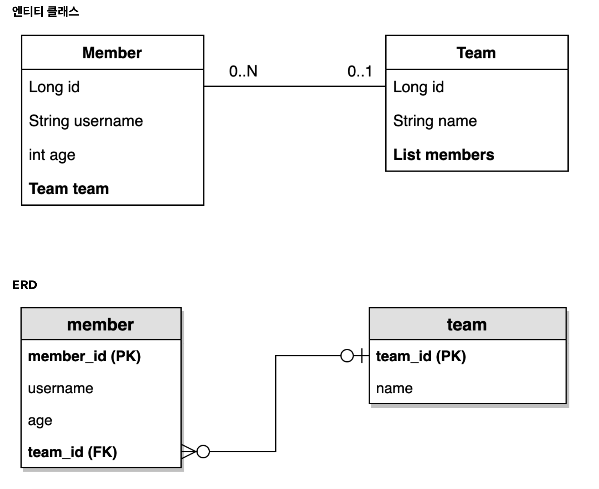

# 프로젝트 환경설정

## 프로젝트 생성

- 스프링 부트 스타터(https://start.spring.io/)
- Project: **Gradle - Groovy** Project
- 사용 기능: Spring Web, jpa, h2, lombok
  - SpringBootVersion: 3.x.x
  - groupId: study
  - artifactId: querydsl

## Query 설정과 검증

`build.gradle`에 주석을 참고해서 querydsl 설정 추가

```gradle
plugins {
	id 'java'
	id 'org.springframework.boot' version '3.2.0'
	id 'io.spring.dependency-management' version '1.1.4'
}


group = 'study'
version = '0.0.1-SNAPSHOT'

java {
	sourceCompatibility = '17'
}

configurations {
	compileOnly {
		extendsFrom annotationProcessor
	}
}


repositories {
	mavenCentral()
}


dependencies {
	implementation 'org.springframework.boot:spring-boot-starter-data-jpa'
	implementation 'org.springframework.boot:spring-boot-starter-web'
	implementation 'com.github.gavlyukovskiy:p6spy-spring-boot-starter:1.9.0'
	compileOnly 'org.projectlombok:lombok'
	runtimeOnly 'com.h2database:h2'
	annotationProcessor 'org.projectlombok:lombok'
	testImplementation 'org.springframework.boot:spring-boot-starter-test'


	//test 롬복 사용
	testCompileOnly 'org.projectlombok:lombok'
	testAnnotationProcessor 'org.projectlombok:lombok'

	//Querydsl 추가
	implementation 'com.querydsl:querydsl-jpa:5.0.0:jakarta'
	annotationProcessor "com.querydsl:querydsl-apt:${dependencyManagement.importedProperties['querydsl.version']}:jakarta"
	annotationProcessor "jakarta.annotation:jakarta.annotation-api"
	annotationProcessor "jakarta.persistence:jakarta.persistence-api"
}

clean {
	delete file('src/main/generated')
}

tasks.named('test') {
	useJUnitPlatform()
}
```

### Querydsl 환경설정 검증

**검증용 엔티티 생성**

```java
package study.querydsl.entity;

import jakarta.persistence.Entity;
import jakarta.persistence.GeneratedValue;
import jakarta.persistence.Id;
import lombok.Getter;
import lombok.Setter;

@Entity
@Getter @Setter
public class Hello {

    @Id @GeneratedValue
    private Long id;
}
```

**빌드 옵션을 intelliJ로 설정한 경우**

Build Project, Rebuild, main(), 또는 테스트를 실행하면 src/main/generated 폴더에 Q객체가 생성된다.

**빌드 옵션을 Gradle로 설정한 경우**

`./gradlew clean compileJava`

**Q 타입 생성 확인**

- build -> generated -> querydsl
  - study.querydsl.entity.QHello.java 파일이 생성되어 있어야 함

> [!TIP]
> Q타입은 컴파일 시점에 자동 생성되므로 버전관리(GIT)에 포함하지 않는 것이 좋다. 앞서 설정에서 생성 위치를 gradle build폴더 아래 생성되도록 했기 때문에 이 부분도 자연스럽게 해결된다. (대부분 gradle build 폴더를 git에 포함하지 않는다.)

**테스트 케이스로 실행 검증**

```java
package study.querydsl;

import com.querydsl.jpa.impl.JPAQueryFactory;
import jakarta.persistence.EntityManager;
import org.assertj.core.api.Assertions;
import org.junit.jupiter.api.Test;
import org.springframework.beans.factory.annotation.Autowired;
import org.springframework.boot.test.context.SpringBootTest;
import org.springframework.transaction.annotation.Transactional;
import study.querydsl.entity.Hello;
import study.querydsl.entity.QHello;

@SpringBootTest
@Transactional
class QuerydslApplicationTests {

	@Autowired
	EntityManager em;

	@Test
	void contextLoads() {

		Hello hello = new Hello();
		em.persist(hello);

		JPAQueryFactory query = new JPAQueryFactory(em);
		QHello qHello = QHello.hello; //Querydsl Q타입 동작 확인

		Hello result = query
				.selectFrom(qHello)
				.fetchOne();

		Assertions.assertThat(result).isEqualTo(hello);

		//lombok 동작 확인 (hello.getId())
		Assertions.assertThat(result.getId()).isEqualTo(hello.getId());
	}

}
```

- Querydsl Q타입이 정상 동작하는가?
- lombok이 정상 동작 하는가?

> [!TIP]
> 스프링 부트에 아무런 설정도 하지 않으면 h2 DB를 메모리 모드로 JVM안에서 실행한다.

## 라이브러리 살펴보기

### gradle 의존ㄴ관계 보기

`./gradlew dependencies --configuration compileClasspath`

### Querydsl 라이브러리 살펴보기

- querydsl-apt: Querydsl관련 코드 생성 기능 제공
- querydsl-jpa: querydsl 라이브러리

### 스프링 부트 라이브러리 살펴보기

- spring-boot-starter-web
  - spring-boot-starter-tomcat: 톰캣(웹서버)
  - spring-webmvc: 스프링 웹 MVC
- spring-boot-starter-data-jpa
  - spring-boot-starter-aop
  - spring-boot-starter-jdbc
    - HikariCP 커넥션 풀 (부트 2.0 기본)
  - hibernate + JPA: 하이버네이트 + JPA
  - spring-data-jpa: 스프링 데이터 JPA
- spring-boot-starter(공통): 스프링 부트 + 스프링 코어 + 로깅
  - spring-boot
    - spring-core
  - spring-boot-starter-logging
    - logback, slf4j

### 테스트 라이브러리

- spring-boot-starter-test
  - junit: 테스트 프레임워크, 스프링 부트 2.2부터 junit5(`jupiter`)사용
    - 과거 버전은 `vintage`
  - mockito: 목 라이브러리
  - assertj: 테스트 코드를 좀 더 편하게 작성하게 도와주는 라이브러리
  - spring-test: 스프링 통합 테스트 지원
- 핵심 라이브러리
  - 스프링 MVC
  - JPA, 하이버네이트
  - 스프링 데이터 JPA
  - Querydsl
- 기타 라이브러리
  - H2 데이터베이스 클라이언트
  - 커넥션 풀: 부트 기본은 HikariCP
  - 로깅 SLF4J & LogBack
  - 테스트

## 스프링 부트 설정 - JPA, DB

```yml
spring:
  datasource:
    url: jdbc:h2:tcp://localhost/~/querydsl
    username: sa
    password:
    driver-class-name: org.h2.Driver

  jpa:
    hibernate:
      ddl-auto: create
    properties:
      hibernate:
#        show_sql: true
        format_sql: true


logging:
  level:
    org.hibernate.sql: debug
#    org.hibernate.type: trace 
```

- spring.jpa.hibernate.ddl-auto: create
  - 이 옵션은 애플리케이션 실행 시점에 테이블을 drop하고, 다시 생성한다.

> [!TIP]
> 모든 로그 출력은 가급적 로거를 통해 남겨야 한다.<br>`show_sql`: 옵션은 `System.out`에 하이버네이트 실행 SQL을 남긴다. `org.hibernate.sql`옵션은 logger를 통해 하이버네이트 실행 SQL을 남긴다.

# 예제 도메인 모델

> [!NOTE]
> 스프링 데이터 JPA와 동일한 예제 도메인 모델을 사용합니다.


## 예제 도메인 모델과 동작확인

<br>

**Member 엔티티**

```java
package study.querydsl.entity;

import jakarta.persistence.*;
import lombok.*;

@Entity
@Getter @Setter
@NoArgsConstructor(access = AccessLevel.PROTECTED)
@ToString(of = {"id", "username", "age"})
public class Member {

    @Id @GeneratedValue
    @Column(name = "member_id")
    private Long id;
    private String username;
    private int age;

    @ManyToOne(fetch = FetchType.LAZY)
    @JoinColumn(name = "team_id")
    private Team team;

    public Member(String username) {
        this(username, 0);
    }

    public Member(String username, int age) {
        this(username, age, null);
    }

    public Member(String username, int age, Team team) {
        this.username = username;
        this.age = age;
        if (team != null) {
            changeTeam(team);
        }
    }

    public void changeTeam(Team team) {
        this.team = team;
        team.getMembers().add(this);
    }
}
```

- 롬복 설명
  - @Setter: 실무에서 가급적 Setter는 사용하지 않기
  - @NoArgsConstructor AccessLevel.PROTECTED: 기본 생성자 막고 싶은데, JPA스펙상 PROTECTED로 열어두어야 함
  - @ToString은 가급적 내부 필드만(연관관계 없는 필드만)
- `changeTeam()`으로 양방향 연관관계 한번에 처리(연관관계 편의 메소드)

**Team 엔티티**

```java
package study.querydsl.entity;

import jakarta.persistence.*;
import lombok.*;

import java.util.ArrayList;
import java.util.List;

@Entity
@Getter @Setter
@NoArgsConstructor(access = AccessLevel.PROTECTED)
@ToString(of = {"id", "name"})
public class Team {

    @Id @GeneratedValue
    @Column(name = "team_id")
    private Long id;
    private String name;

    @OneToMany(mappedBy = "team")
    private List<Member> members = new ArrayList<>();

    public Team(String name) {
        this.name = name;
    }
}
```
- Member와 Team은 양방향 연관관계, `Member.team`이 연관관계의 주인, `Team.members`는 연관관계의 주인이 아님, 따라서 `Member.team`이 데이터베이스 외래키 값을 변경, 반대편은 읽기만 가능

**데이터 확인 테스트**

```java
package study.querydsl.entity;

import jakarta.persistence.EntityManager;
import jakarta.persistence.PersistenceContext;
import org.junit.jupiter.api.Test;
import org.springframework.boot.test.context.SpringBootTest;
import org.springframework.test.annotation.Commit;
import org.springframework.transaction.annotation.Transactional;

import java.util.List;

import static org.junit.jupiter.api.Assertions.*;

@SpringBootTest
@Transactional
@Commit
class MemberTest {

    @PersistenceContext
    EntityManager em;

    @Test
    public void testEntity() {
        Team teamA = new Team("teamA");
        Team teamB = new Team("teamB");
        em.persist(teamA);
        em.persist(teamB);

        Member member1 = new Member("member1", 10, teamA);
        Member member2 = new Member("member2", 20, teamA);
        Member member3 = new Member("member3", 30, teamB);
        Member member4 = new Member("member4", 40, teamB);

        em.persist(member1);
        em.persist(member2);
        em.persist(member3);
        em.persist(member4);

        //초기화
        em.flush();
        em.clear();

        //확인
        List<Member> members = em.createQuery("select m from Member m", Member.class)
                .getResultList();

        for (Member member : members) {
            System.out.println("member = " + member);
            System.out.println("-> member.team = " + member.getTeam());
        }
    }
}
```

- 가급적 순수 JPA로 동작 확인(뒤에서 변경)
- db테이블 결과 확인
- 지연 로딩 동작 확인

# 기본 문법

## 시작 - JPQL vs Querydsl

**테스트 기본 코드**

```java
@SpringBootTest
@Transactional
public class QuerydslBasicTest {

    @PersistenceContext
    EntityManager em;

    @BeforeEach
    public void before() {
        Team teamA = new Team("teamA");
        Team teamB = new Team("teamB");
        em.persist(teamA);
        em.persist(teamB);

        Member member1 = new Member("member1", 10, teamA);
        Member member2 = new Member("member2", 20, teamA);
        Member member3 = new Member("member3", 30, teamB);
        Member member4 = new Member("member4", 40, teamB);

        em.persist(member1);
        em.persist(member2);
        em.persist(member3);
        em.persist(member4);
    }
}
```

- 지금부터는 이 예제로 실행

**Querydsl vs JPQL**

```java
@Test
public void startJPQL() {
    //member1을 찾아라.
    String qlString = "select m from Member m " +
            "where m.username = :username";

    Member findMember = em.createQuery(qlString, Member.class)
            .setParameter("username", "member1")
            .getSingleResult();

    assertThat(findMember.getUsername()).isEqualTo("member1");
}

@Test
public void startQuerydsl() {
    //member1을 찾아라.
    JPAQueryFactory queryFactory = new JPAQueryFactory(em);
    QMember m = new QMember("m");

    Member findMember = queryFactory
            .select(m)
            .from(m)
            .where(m.username.eq("member1")) //파라미터 바인딩 처리
            .fetchOne();

    assertThat(findMember.getUsername()).isEqualTo("member1");
}
```

- `EntityManager`로 `JPAQueryFactory`생성
- Querydsl은 JPQL빌더
- JPQL: 문자(실행 시점 오류), Querydsl: 코드(컴파일 시점 오류)
- JPQL: 파라미터 바인딩 직접, Querydsl: 파라미터 바인딩 자동 처리

### JPAQueryFactory를 필드로

- JPAQueryFactory를 필드로 제공하면 동시성 문제는 어떻게 될까? 동시성 문제는 JPAQueryFactory를 생성 할 때 제공하는 EntityManager(em)에 달려있다. 스프링 프레임워크는 여러 쓰레드에서 동시에 같은 EntityManager에 접근해도, 트랜잭션 마다 별도의 영속성 컨텍스트를 제공하기 때문에, 동시성 문제는 걱정하지 않아도 된다.

## 기본 Q-Type 활용

## 검색 조건 쿼리

## 결과 조회

## 정렬

## 페이징

## 집합

## 조인 - 기본 조인

## 조인 - on절

## 조인 - 페치 조인

## 서브 쿼리

## Case 문

## 상수, 문자 더하기


# 중급 문법

# 실무 활용 - 순수 JPA와 Querydsl

# 실무 활용 - 스프링 데이터 JPA와 Querydsl

# 스프링 데이터 JPA가 제공하는 Querydsl 기능

# 스프링 부트 3.x(2.6 이상), Querydsl 5.0 지원 방법
