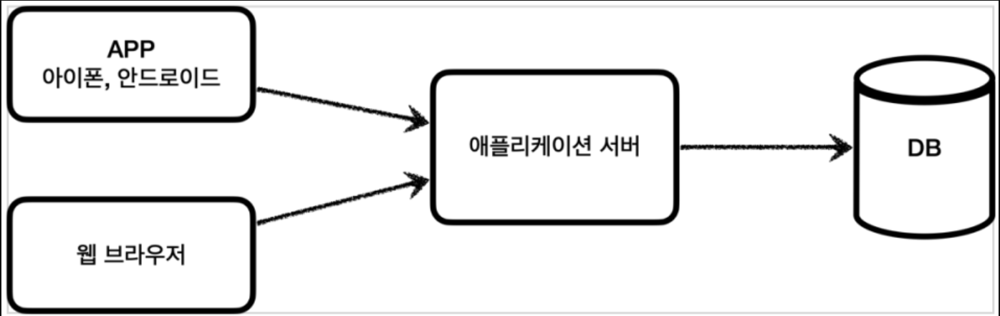
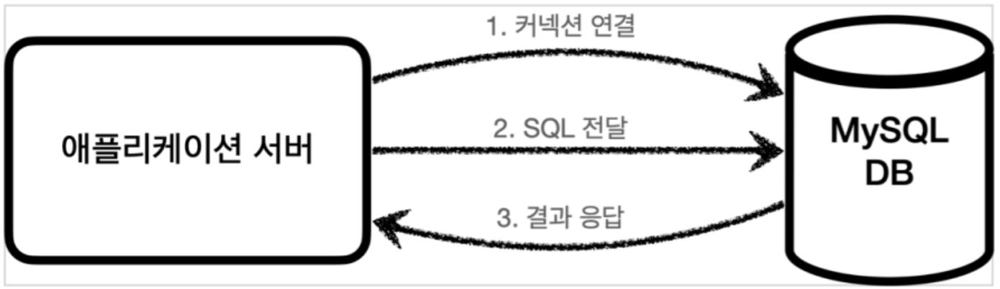
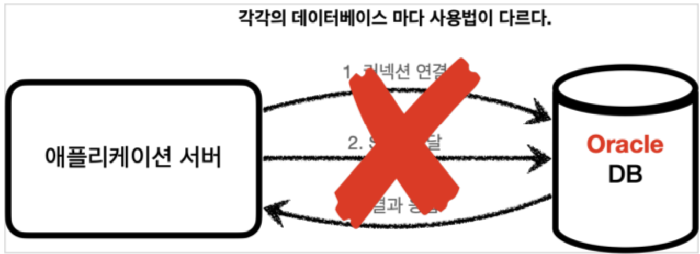
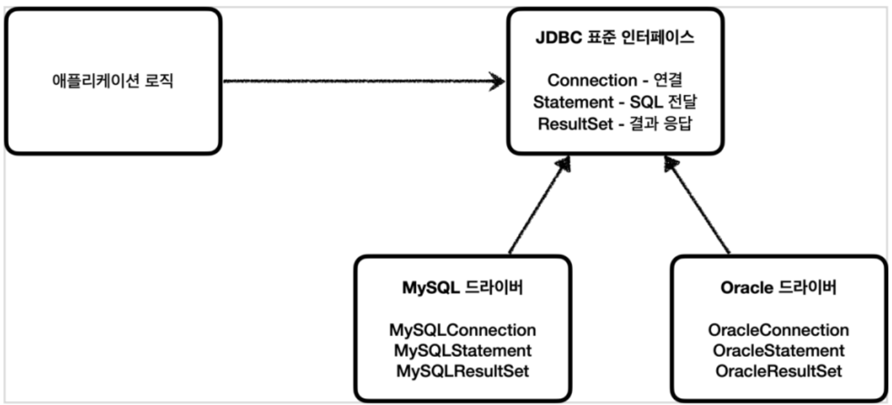
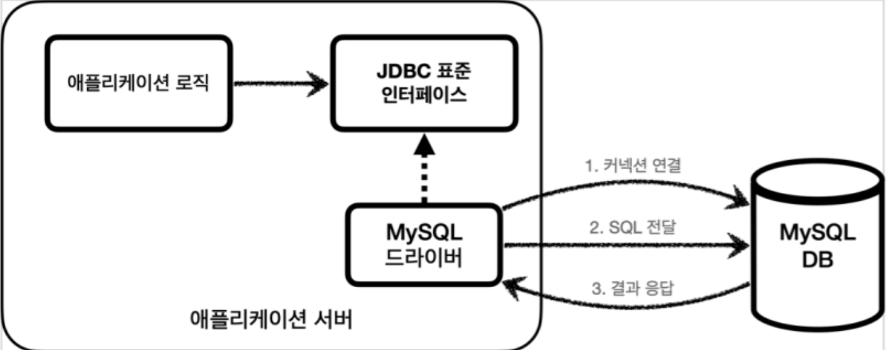
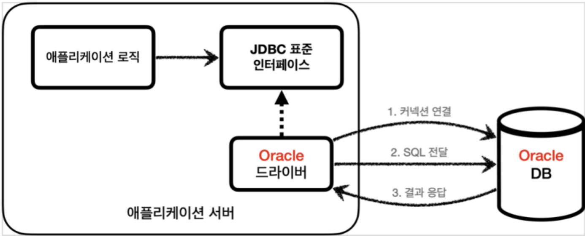
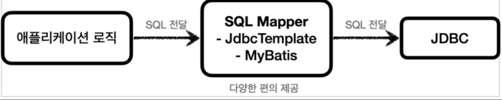
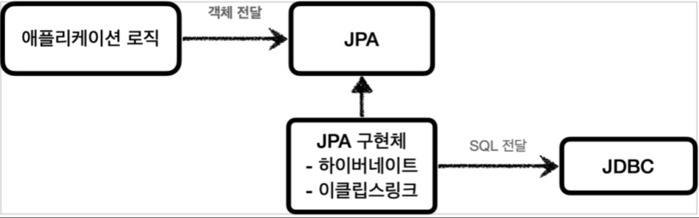

# JDBC 이해
## 프로젝트 생성

프로젝트 선택
- Project: Gradle - Groovy Project
- Language: Java
- Spring Boot: 2.7.16 
- Project Metadata
  - Group: hello
  - Artifact: jdbc
  - Name: jdbc
  - Package name: hello.jdbc
  - Packaging: Jar
  - Java: 11
- Dependencies
  - JDBC API
  - H2 Database
  - Lombok


실행시 콘솔에 `Started JdbcApplication` 로그가 보이면 성공이다.

## H2 데이터베이스 설정

H2 데이터베이스는 개발이나 테스트 용도로 사용하기 좋고 가볍고 편리한 DB이다. 그리고 SQL을 실행할 수 있는 웹 화면을 제공한다.

H2 실행<br>
/h2/bin/h2.sh 실행

### 테이블 생성하기

테이블 관리를 위해 프로젝트 루트에 `sql/schema.sql` 파일을 생성하자.

```sql
drop table memeber if exists cascade;
create table member
(
    member_id varchar(10),
    money     integer not null default 0,
    primary key (member_id)
);

insert into member(member_id, money) values ('hi1', 10000);
insert into member(member_id, money) values ('hi2', 20000);
```

방금 작성한 SQL을 H2 데이터베이스 웹 콘솔에 실행해서 `member`테이블을 생성한다. (이후 select 쿼리를 실행해서 저장한 데이터가 잘 나오는지 결과를 확인하자.)

## JDBC 이해

이제 본격적으로 JDBC에 대해서 알아보자

**JDBC 등장 이유**<br>
애플리케이션을 개발할 때 중요한 데이터는 데이터베이스에 보관한다. 보통은 아래와 같은 구조로 되어있다.

**클라이언트, 애플리케이션 서버, DB**<br>
<br>

클라이언트가 애플리케이션 서버를 통해 데이터를 저장하거나 조회하면, 애플리케이션 서버는 다음 과정을 통해서 데이터베이스를 사용한다.

**애플리케이션 서버와 DB - 일반적인 사용법**<br>

<br>

1. 커넥션 연결: 주로 TCP/IP를 사용해서 커넥션을 연결한다.
2. SQL 전달: 애플리케이션 서버는 DB가 이해할 수 있는 SQL을 연결된 커넥션을 통해 DB에 전달한다.
3. 결과 응답: DB는 전달된 SQL을 수행하고 그 결과를 응답한다. 애플리케이션 서버는 응답 결과를 활용한다.

여기서 잠시 과거로 돌아가보자. 과거에는 아래와 같은 문제가 있었다.

**애플리케이션 서버와 DB - DB 변경**<br>

<br>

- 문제는 각ㄱ각의 데이터베이스마다 1) 커넥션을 연결하는 방법, 2) SQL을 전달하는 방법, 그리고 3) 결과를 응답받는 방법이 모두 다르다는 점이다. (참고로 관계형데이터베이스는 수십개가 있다.)
- 여기에는 2가지 큰 문제가 있다.
  - 데이터베이스를 다른 종류의 데이터베이스로 변경하면 애플리케이션 서버에 개발된 데이터베이스 사용 코드도 함께 변경해야 한다.
  - 개발자가 각각의 데이터베이스마다 커넥션 연결, SQL 전달, 그리고 그 결과를 응답받는 방법을 새로 학습해야 한다.

이런 문제를 해결하기 위해 JDBC라는 자바 표준이 등장하였다.

### JDBC 표준 인터페이스

JDBC(Java Database Connectivity)는 자바에서 데이터베이스에 접속할 수 있도록 하는 자바 API이다.<br>
JDBC는 데이터베이스에서 자료를 쿼리하거나 업데이트하는 방법을 제공한다.

(참고) JDBC 표준 인터페이스<br>

<br>

- 대표적으로 다음 3가지 기능을 표준 인터페이스로 정의해서 제공한다.
  - `java.sql.Connection` - 연결
  - `java.sql.Statement` - SQL을 담은 내용
  - `java.sql.ResultSet` - SQL 요청 응답

자바는 이렇게 표준 인터페이스를 정의해두었다. 이제부터 개발자는 이 표준 인터페이스만 사용해서 개발하면 된다.

그런데 인터페이스만 있다고해서 기능이 동작하지 않는다. 이 JDBC 인터페이스를 각각의 DB 벤더(회사)에서 자신들의 DB에 맞도록 구현해서 라이브러리로 제공하는데, 이것을 JDBC 드라이버라 한다. (예를 들어서 MySQL DB에 접근할 수 있는 것은 MySQL JDBC 드라이버라 하고, Oracle DB에 접근할 수 있는 것은 Oracle JDBC 드라이버라 한다.)

MySQL 드라이버 사용<br>

<br>

Oracle 드라이버 사용 <br>

<br>

#### 정리
- JDBC의 등장으로 다음 2가지 문제가 해결되었다.
  - 데이터베이스를 다른 종류의 데이터베이스로 변경하면 애플리케이션 서버의 데이터베이스 사용코드도 함께 변경해야하는 문제
    - 애플리케이션 로직은 이제 JDBC 표준 인터페이스에만 의존한다. 따라서 데이터베이스를 다른 종류의 데이터베이스로 변경하고 싶으면 JDBC 구현 라이브러리만 변경하면 된다. 따라서 다른 종류의 데이터베이스로 변경해도 애플리케이션 서버의 사용코드를 그대로 유지할 수 있다.
  - 개발자가 각각의 데이터베이스마다 커넥션 연결, SQL 전달, 그리고 그 결과를 응답받는 방법을 새로 학습해야 하는 문제
    - 개발자는 JDBC 표준 인터페이스 사용법만 학습하면 된다. 한번 배워두면 수십개의 데이터베이스에 모두 동일하게 적용할 수 있다.

> [!TIP]
> 표준화의 한계
>
> - JDBC의 등장으로 많은 것이 편리해졌지만, 각각의 데이터베이스마다 SQL, 데이터타입 등의 일부 사용법이 다르다, ANSI SQL이라는 표준이 있기는 하지만 일반적인 부분만 공통화했기 때문에 한계가 있다. 대표적으로 실무에서 기본으로 사용하는 페이징 SQL은 각각의 데이터베이스마다 사용법이 다르다. 결국 데이터베이스를 변경하면 JDBC 코드는 변경하지 않아도 되지만 SQL은 해당 데이터베이스에 맞도록 변경해야 한다.
>   - 참고로 JPA를 사용하면 이렇게 각각의 데이터베이스마다 다른 SQL을 정의해야 하는 문제도 많은 부분 해결할 수 있다.

## JDBC와 최신 데이터 접근 기술

JDBC는 1997년에 출시될 정도로 오래된 기술이고, 사용하는 방법도 복잡하다. 그래서 최근에는 JDBC를 직접 사용하기 보다는 JDBC를 직접 사용하기 보다는 JDBC를 편리하게 사용하는 다양한 기술이 존재한다. 대표적으로 SQL Mapper와 ORM 기술로 나눌 수 있다.

**JDBC 직접 사용**<br>
<br>

**SQL Mapper**<br>
<br>

- 장전: JDBC를 편리하게 사용하도록 도와준다.
  - SQL 응답 결과를 객체로 편리하게 변환해준다.
  - JDBC의 반복 코드를 제거해준다.
- 단점: 개발자가 SQL을 직접 작성해야 한다.
- 대표 기술: 스프링 JdbcTemplate, MyBatis

**ORM 기술**<br>

<br>

- ORM은 객체를 관계형 데이터베이스 테이블과 매핑해주는 기술이다. 이 기술 덕분에 개발자는 반복적인 SQL을 직접 작성하지 않고, ORM 기술이 개발자 대신에 SQL을 동적으로 만들어 실행해준다. 추가로 각각의 데이터베이스마다 다른 SQL을 사용하는 문제도 중간에 해결해준다.
- 대표기술: JPA, 하이버네이트, 이클립스링크
- JPA는 자바 진영의 ORM 표준 인터페이스이고, 이것을 구현한 것으로 하이버네이트와 이클립스링크 등의 구현 기술이 있다.

**SQL Mapper vs ORM 기술**<br>

- SQL Mapper와 ORM 기술 둘 다 각각 장단점이 있다
- 쉽게 설명하자면 SQL Mapper는 SQL만 직접 작성하면 나머지 번거로운 일은 SQL Mapper가 대신 해결해준다. SQL Mapper는 SQL만 작성할 줄 알면 금방 배워서 사용할 수 있다.
- ORM기술은 SQL 자체를 작성하지 않아도 되어서 개발 생산성이 매우 높아진다. 편리한 반면에 쉬운 기술은 아니므로 실무에서 사용하려면 깊이있게 학습해야 한다.
- 나중에 뒷부분에서 다양한 데이터 접근 기술을 설명하는데, 그때 SQL Mapper인 JdbcTemplate과 MyBatis를 학습하고 코드로 활용해본다. 그리고 ORM의 대표 기술인 JPA도 학습하고 코드로 활용해본다. 이 과정을 통해서 각각의 기술들의 장단점을 파악하고, 이떤 기술을 언제 사용해야 하는지 자연스럽게 이해하게 될 것이다.

> [!IMPORTANT]
> 이런 기술들도 내부에서는 모두 JDBC를 사용한다. 따라서 JDBC를 직접 사용하지는 않더라도, JDBC가 어떻게 동작하는지 기본 원리를 알아두어야 한다. 그래야 해당 기술들을 더 깊이있게 이해할 수 있고, 무엇보다 문제가 발생했을 때 근본적인 문제를 찾아서 해결할 수 있다. **JDBC는 자바 개발자라면 꼭 알아두어야 하는 필수 기본 기술**이다.

## 데이터베이스 연결
## JDBC 개발 - 등록
## JDBC 개발 - 조회
## JDBC 개발 - 수정, 삭제