# JDBC 이해
## 프로젝트 생성

프로젝트 선택
- Project: Gradle - Groovy Project
- Language: Java
- Spring Boot: 2.7.16 
- Project Metadata
  - Group: hello
  - Artifact: jdbc
  - Name: jdbc
  - Package name: hello.jdbc
  - Packaging: Jar
  - Java: 11
- Dependencies
  - JDBC API
  - H2 Database
  - Lombok


실행시 콘솔에 `Started JdbcApplication` 로그가 보이면 성공이다.

## H2 데이터베이스 설정

H2 데이터베이스는 개발이나 테스트 용도로 사용하기 좋고 가볍고 편리한 DB이다. 그리고 SQL을 실행할 수 있는 웹 화면을 제공한다.

H2 실행<br>
/h2/bin/h2.sh 실행

### 테이블 생성하기

테이블 관리를 위해 프로젝트 루트에 `sql/schema.sql` 파일을 생성하자.

```sql
drop table memeber if exists cascade;
create table member
(
    member_id varchar(10),
    money     integer not null default 0,
    primary key (member_id)
);

insert into member(member_id, money) values ('hi1', 10000);
insert into member(member_id, money) values ('hi2', 20000);
```

방금 작성한 SQL을 H2 데이터베이스 웹 콘솔에 실행해서 `member`테이블을 생성한다. (이후 select 쿼리를 실행해서 저장한 데이터가 잘 나오는지 결과를 확인하자.)

## JDBC 이해

이제 본격적으로 JDBC에 대해서 알아보자

### JDBC 등장 이유

애플리케이션을 개발할 때 중요한 데이터는 데이터베이스에 보관한다. 보통은 아래와 같은 구조로 되어있다.

**클라이언트, 애플리케이션 서버, DB**<br>
<br>

클라이언트가 애플리케이션 서버를 통해 데이터를 저장하거나 조회하면, 애플리케이션 서버는 다음 과정을 통해서 데이터베이스를 사용한다.

**애플리케이션 서버와 DB - 일반적인 사용법**<br>

<br>

1. 커넥션 연결: 주로 TCP/IP를 사용해서 커넥션을 연결한다.
2. SQL 전달: 애플리케이션 서버는 DB가 이해할 수 있는 SQL을 연결된 커넥션을 통해 DB에 전달한다.
3. 결과 응답: DB는 전달된 SQL을 수행하고 그 결과를 응답한다. 애플리케이션 서버는 응답 결과를 활용한다.

여기서 잠시 과거로 돌아가보자. 과거에는 아래와 같은 문제가 있었다.

**애플리케이션 서버와 DB - DB 변경**<br>

<br>

- 문제는 각각의 데이터베이스마다 1) 커넥션을 연결하는 방법, 2) SQL을 전달하는 방법, 그리고 3) 결과를 응답받는 방법이 모두 다르다는 점이다. (참고로 관계형 데이터베이스는 수십개가 있다.)
- 여기에는 2가지 큰 문제가 있다.
  - 데이터베이스를 다른 종류의 데이터베이스로 변경하면 애플리케이션 서버에 개발된 데이터베이스 사용 코드도 함께 변경해야 한다.
  - 개발자가 각각의 데이터베이스마다 커넥션 연결, SQL 전달, 그리고 그 결과를 응답받는 방법을 새로 학습해야 한다.

이런 문제를 해결하기 위해 JDBC라는 자바 표준이 등장하였다.

### JDBC 표준 인터페이스

JDBC(Java Database Connectivity)는 자바에서 데이터베이스에 접속할 수 있도록 하는 자바 API이다.<br>
JDBC는 데이터베이스에서 자료를 쿼리하거나 업데이트하는 방법을 제공한다.

(참고) JDBC 표준 인터페이스<br>

<br>

- 대표적으로 다음 3가지 기능을 표준 인터페이스로 정의해서 제공한다.
  - `java.sql.Connection` - 연결
  - `java.sql.Statement` - SQL을 담은 내용
  - `java.sql.ResultSet` - SQL 요청 응답

자바는 이렇게 표준 인터페이스를 정의해두었다. 이제부터 개발자는 이 표준 인터페이스만 사용해서 개발하면 된다.

그런데 인터페이스만 있다고해서 기능이 동작하지 않는다. 이 JDBC 인터페이스를 각각의 DB 벤더(회사)에서 자신들의 DB에 맞도록 구현해서 라이브러리로 제공하는데, 이것을 JDBC 드라이버라 한다. (예를 들어서 MySQL DB에 접근할 수 있는 것은 MySQL JDBC 드라이버라 하고, Oracle DB에 접근할 수 있는 것은 Oracle JDBC 드라이버라 한다.)

MySQL 드라이버 사용<br>

<br>

Oracle 드라이버 사용 <br>

<br>

#### 정리
- JDBC의 등장으로 다음 2가지 문제가 해결되었다.
  - 데이터베이스를 다른 종류의 데이터베이스로 변경하면 애플리케이션 서버의 데이터베이스 사용코드도 함께 변경해야하는 문제
    - 애플리케이션 로직은 이제 JDBC 표준 인터페이스에만 의존한다. 따라서 데이터베이스를 다른 종류의 데이터베이스로 변경하고 싶으면 JDBC 구현 라이브러리만 변경하면 된다. 따라서 다른 종류의 데이터베이스로 변경해도 애플리케이션 서버의 사용코드를 그대로 유지할 수 있다.
  - 개발자가 각각의 데이터베이스마다 커넥션 연결, SQL 전달, 그리고 그 결과를 응답받는 방법을 새로 학습해야 하는 문제
    - 개발자는 JDBC 표준 인터페이스 사용법만 학습하면 된다. 한번 배워두면 수십개의 데이터베이스에 모두 동일하게 적용할 수 있다.

> [!TIP]
> 표준화의 한계
>
> - JDBC의 등장으로 많은 것이 편리해졌지만, 각각의 데이터베이스마다 SQL, 데이터타입 등의 일부 사용법이 다르다, ANSI SQL이라는 표준이 있기는 하지만 일반적인 부분만 공통화했기 때문에 한계가 있다. 대표적으로 실무에서 기본으로 사용하는 페이징 SQL은 각각의 데이터베이스마다 사용법이 다르다. 결국 데이터베이스를 변경하면 JDBC 코드는 변경하지 않아도 되지만 SQL은 해당 데이터베이스에 맞도록 변경해야 한다.
>   - 참고로 JPA를 사용하면 이렇게 각각의 데이터베이스마다 다른 SQL을 정의해야 하는 문제도 많은 부분 해결할 수 있다.

## JDBC와 최신 데이터 접근 기술

JDBC는 1997년에 출시될 정도로 오래된 기술이고, 사용하는 방법도 복잡하다. 그래서 최근에는 JDBC를 직접 사용하기 보다는 JDBC를 직접 사용하기 보다는 JDBC를 편리하게 사용하는 다양한 기술이 존재한다. 대표적으로 SQL Mapper와 ORM 기술로 나눌 수 있다.

**JDBC 직접 사용**<br>
<br>

**SQL Mapper**<br>
<br>

- 장전: JDBC를 편리하게 사용하도록 도와준다.
  - SQL 응답 결과를 객체로 편리하게 변환해준다.
  - JDBC의 반복 코드를 제거해준다.
- 단점: 개발자가 SQL을 직접 작성해야 한다.
- 대표 기술: 스프링 JdbcTemplate, MyBatis

**ORM 기술**<br>

<br>

- ORM은 객체를 관계형 데이터베이스 테이블과 매핑해주는 기술이다. 이 기술 덕분에 개발자는 반복적인 SQL을 직접 작성하지 않고, ORM 기술이 개발자 대신에 SQL을 동적으로 만들어 실행해준다. 추가로 각각의 데이터베이스마다 다른 SQL을 사용하는 문제도 중간에 해결해준다.
- 대표기술: JPA, 하이버네이트, 이클립스링크
- JPA는 자바 진영의 ORM 표준 인터페이스이고, 이것을 구현한 것으로 하이버네이트와 이클립스링크 등의 구현 기술이 있다.

**SQL Mapper vs ORM 기술**<br>

- SQL Mapper와 ORM 기술 둘 다 각각 장단점이 있다
- 쉽게 설명하자면 SQL Mapper는 SQL만 직접 작성하면 나머지 번거로운 일은 SQL Mapper가 대신 해결해준다. SQL Mapper는 SQL만 작성할 줄 알면 금방 배워서 사용할 수 있다.
- ORM기술은 SQL 자체를 작성하지 않아도 되어서 개발 생산성이 매우 높아진다. 편리한 반면에 쉬운 기술은 아니므로 실무에서 사용하려면 깊이있게 학습해야 한다.
- 나중에 뒷부분에서 다양한 데이터 접근 기술을 설명하는데, 그때 SQL Mapper인 JdbcTemplate과 MyBatis를 학습하고 코드로 활용해본다. 그리고 ORM의 대표 기술인 JPA도 학습하고 코드로 활용해본다. 이 과정을 통해서 각각의 기술들의 장단점을 파악하고, 이떤 기술을 언제 사용해야 하는지 자연스럽게 이해하게 될 것이다.

> [!IMPORTANT]
> 이런 기술들도 내부에서는 모두 JDBC를 사용한다. 따라서 JDBC를 직접 사용하지는 않더라도, JDBC가 어떻게 동작하는지 기본 원리를 알아두어야 한다. 그래야 해당 기술들을 더 깊이있게 이해할 수 있고, 무엇보다 문제가 발생했을 때 근본적인 문제를 찾아서 해결할 수 있다. **JDBC는 자바 개발자라면 꼭 알아두어야 하는 필수 기본 기술**이다.

## 데이터베이스 연결

애플리케이션과 데이터베이스를 연결해두자.<br>
(주의) H2 데이터베이스 서버를 먼저 실행해두자.

코드로 바로 적용해보자

**ConnectionConst생성**<br>
`src/main/java/hello/jdbc/connection/ConnectionConst.java`<br>
```java
package hello.jdbc.connection;

public class ConnectionConst {
    public static final String URL = "jdbc:h2:tcp://localhost/~/test";
    public static final String USERNAME = "sa";
    public static final String PASSWORD = "";

}
```

- 데이터 베이스에 접속하는데 필요한 기본 정보를 편리하게 사용할 수 있도록 상수로 만들었다.
- 이제 JDBC를 사용해서 실제 데이터베이스에 연결하는 코드를 작성해보자.

**DBConnectionUtil생성**<br>
`src/main/java/hello/jdbc/connection/DBConnectionUtil.java`<br>
```java
package hello.jdbc.connection;

import lombok.extern.slf4j.Slf4j;

import java.sql.Connection;
import java.sql.DriverManager;
import java.sql.SQLException;

@Slf4j
public class DBConnectionUtil {

    public static Connection getConnection() {
        try {
            Connection connection = DriverManager.getConnection(
                    ConnectionConst.URL,
                    ConnectionConst.USERNAME,
                    ConnectionConst.PASSWORD);
            log.info("get connection={}, class={}", connection, connection.getClass());

            return connection;
        } catch (SQLException e) {
            throw new IllegalStateException(e);
        }
    }
}
```
- 데이터베이스에 연결하려면 JDBC가 제공하는 `DriverManager.getConnection(...)`를 사용하면 된다. 이렇게 하면 라이브러리에 있는 데이터베이스 드라이버를 찾아서 해당 드라이버가 제공하는 커넥션을 반환해준다. 여기서는 H2 데이터베이스 드라이버가 작동해서 실제 데이터베이스와 커넥션을 맺고 그 결과를 반환해준다.
- (참고) External Libraries > h2database 라이브러리 > Driver 클래스 참고 (org.h2.Driver)

간단한 학습용 데스트 코드를 만들어서 실행해보자.

**DBConnectionUtilTest 생성**: test/java/hello/jdbc 패키지 내부에 connetcion 패키지를 생성하고, 그 내부에 DBConnectionUtilTest클래스를 생성하자

```java
package hello.jdbc.connection;

import lombok.extern.slf4j.Slf4j;
import org.assertj.core.api.Assertions;
import org.junit.jupiter.api.Test;

import java.sql.Connection;

@Slf4j
class DBConnectionUtilTest {

    @Test
    void connection() {
        Connection connection = DBConnectionUtil.getConnection();
        Assertions.assertThat(connection).isNotNull();
    }

}
```

실행 결과를 보면 `class=class org.h2.jdbc.JdbcConnection` 부분을 확인할 수 있다. <br>이것이 바로 H2데이터베이스 드라이버가 제공하는 H2 전용 커넥션이다. 물론 이 커넥션은 JDBC 표준 커넥션 인터페이스인 `java.sql.Connection`인터페이스를 구현하고 있다.

그러면 도대체 H2 데이터베이스 드라이버를 어떻게 찾는걸까?

**JDBC DriverManager 연결 이해**<br>
지금까지 코드로 확인해 본 과정을 좀 더 자세히 알아보자.

**JDBC 커넥션 인터페이스와 구현**<br>
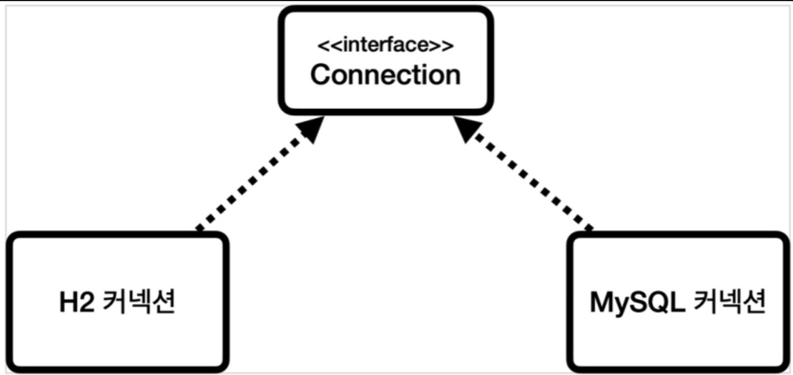<br>

- JDBC는 `java.sql.Connection`표준 커넥션 인터페이스를 정의한다.
- H2 데이터베이스 드라이버는 JDBC Connection 인터페이스를 구현한, `org.h2.jdbc.JdbcConnection`이라는 구현체를 제공한다.

**DriverManager 커넥션 요청 흐름**<br>
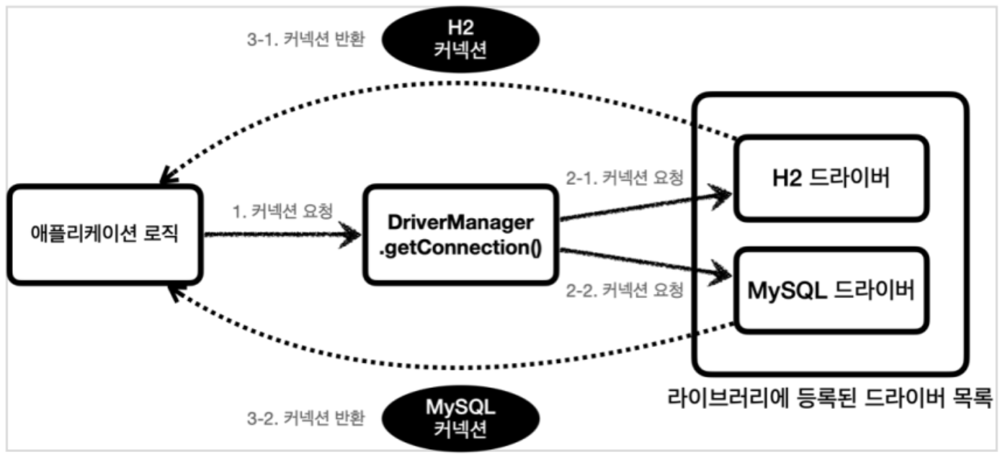<br>

JDBC가 제공하는 `DriverManager`는 라이브러리에 등록된 DB 드라이버들을 관리하고, 커넥션을 획득하는 기능을 제공한다.
1. 애플리케이션 로직에서 커넥션이 필요하면 `DriverManager.getConnection()`을 호출한다
2. `DriverManager`는 라이브러리에 등록된 드라이버 목록을 자동으로 인식한다. 이 드라이버들에게 순서대로 다음 정보를 넘겨서 커넥션을 획득할 수 있는지 확인한다.
   - URL: 예) `jdbc:h2:tcp://localhost/~/test`
   - 이름, 비밀번호 등 접속에 필요한 추가 정보
   - 여기서 각각의 드라이버는 URL정보를 체크해서 본인이 처리할 수 있는 요청인지 확인한다. 얘를 들어서 URL이 `jdbc:h2`로 시작하면 이것은 h2 데이터베이스에 접근하기 위한 규칙이다. 따라서 H2 드라이버는 본인이 처리할 수 있으므로 실제 데이터베이스에 연결해서 커넥션을 획득하고 이 커넥션을 클라이언트에 반환한다. 반면에 URL이 `jdbc:h2`로 시작햇는데 MySQL 드라이버가 먼저 실행되면 이 경우 본인이 처리할 수 없다는 결과를 반환하게 되고, 다음 드라이버에게 순서가 넘어간다.
3. 이렇게 찾은 커넥션 구현체가 클라이언트에 반환된다.
   - 우리는 H2 데이터베이스 드라이버만 라이브러리에 등록했기 때문에 H2 드라이버가 제공하는 H2 커넥션을 제공받는다. 물론 H2 커넥션은 JDBC가 제공하는 `java.sql.Connection` 인터페이스를 구현하고 있다.

> [!TIP]
> H2 데이터베이스 드라이버 라이브러리<br>
> 
> runtimeOnly 'com.h2database:h2

## JDBC 개발 - 등록

이제 본격적으로 JDBC를 사용해서 애플리케이션을 개발해보자<br>
여기서는 JDBC를 사용해서 회원(`Member`)데이터를 데이터베이스에 관리하는 기능을 개발해보자.

코드로 적용해보자.

**Member 생성**<br>
`src/main/java/hello/jdbc/domain`<br>
```java
package hello.jdbc.domain;

import lombok.Data;

@Data
public class Member {

    private String memberId;
    private int money;

    public Member() {
    }

    public Member(String memberId, int money) {
        this.memberId = memberId;
        this.money = money;
    }
}

```

회원의 ID와 해당 회원이 소지한 금액을 표현하는 단순한 클래스이다. 앞서 만들어둔 `member`테이블에 데이터를 저장하고 조회할 때 사용한다.

가장 먼저, JDBC를 사용해서 이렇게 만든 회원 객체를 데이터베이스에 저장해보자.

**MemberRepositoryV0생성 - 회원 등록**<br>
`src/main/java/hello/jdbc/repository/MemberRepositoryV0`<br>

```java
package hello.jdbc.repository;

import hello.jdbc.connection.DBConnectionUtil;
import hello.jdbc.domain.Member;
import lombok.extern.slf4j.Slf4j;

import java.sql.*;

/**
 * JDBC - DriverManager 사용
 */
@Slf4j
public class MemberRepositoryV0 {

    public Member save(Member member) throws SQLException {
        String sql = "insert into member(member_id, money)values (?, ?)";

        Connection con = null;
        PreparedStatement pstmt = null;

        try{
            con = getConnection();
            pstmt = con.prepareStatement(sql);
            pstmt.setString(1, member.getMemberId());
            pstmt.setInt(2, member.getMoney());
            pstmt.executeUpdate();
            return member;
        } catch (SQLException e) {
            log.error("db error");
            throw e;
        } finally {
            close(con, pstmt, null);

        }

    }

    private void close(Connection con, Statement stmt, ResultSet rs) {

        if (rs != null) {
            try {
                rs.close();
            } catch (SQLException e) {
                log.info("error", e);
            }
        }

        if (stmt != null) {
            try {
                stmt.close();
            } catch (SQLException e) {
                log.info("error", e);
            }
        }
    }

    private Connection getConnection() {
        return DBConnectionUtil.getConnection();
    }
}
```

### 코드 분석

**커넥션 획득**<br>
`getConnection()`: 이전에 만들어둔 `DBConnectionUtil`를 통해서 데이터베이스 커넥션을 획득한다.

**save() - SQL 전달**<br>
- `sql`: 데이터베이스에 전달한 SQL을 정의한다. 여기서는 데이터를 등록해야 하므로 `insert sql`을 정의했다.
- `con.prepareStatement(sql)`: 데이터베이스에 전달한 SQL과 파라미터로 전달할 데이터들을 준비한다.
  - `sql`: `insert into member(member_id, money) values(? , ?)"`
  - `pstmt.setString(1, member.getMemberId())`: SQL의 첫번째 `?`에 값을 지정한다. 문자이므로 `setString`을 사용한다.
  - `pstmt.setInt(2, member.getMoney())`: SQL의 두번째 `?`에 값을 저정한다. `Int`형 숫자이므로 `setInt`를 지정한다.
- `pstmt.executeUpdate()`: `Statement`를 통해 준비된 SQL을 커넥션을 통해 실제 데이터베이스에 전달한다. 참고로 `executeUpdate()`은 `int`를 반환하는데, 영향받은 DB row수를 반환한다. 여기서는 하나의 row를 등록했으므로 1을 반환한다.
  - 참고) executeUpdate()<br> 
    ```java
        int executeUpdate() throws SQLException; 
    ```

**리소스 정리**<br>
- 쿼리를 실행하고 나면 리소스를 정의해야 한다. 여기서는 `Connection`, `PreparedStatement`를 사용했다.
- 리소스를 정리할 때는 항상 역순으로 해야한다. `Connection`을 먼저 획득하고 `Connection`을 통해 `PreparedStatement`를 만들었기 때문에, 리소스를 반환할때는 `PreparedStatement`를 먼저 종료하고, 그 다음에 `Connection`을 종료하면 된다.<br> (참고로 여기서 사용하지 않은 `ResultSet`은 결과를 조회할 때 사용한다. 조금 뒤에 조회 부분에서 알아보자.)

> [!WARNING]
> 리소스 정리는 꼭! 해주어야 한다. 따라서 예외가 발생하든, 하지 않든 항상 수행되어야 하므로 `finally` 구문에 주의해서 작성해야 한다. 만약 이 부분을 놓치게 되면 커넥션이 끊어지지 않고 계속 유지되는 문제가 발생할 수 있다. 이런 것을 리소스 누수라고 하는데, 걸과적으로 커넥션 부족으로 장애가 발행할 수 있다.


> [!TIP]
> `PreparedStatment`는 `Statement`의 자식타입인데, `?`를 통한 파라미터 바인딩을 가능하게 해준다. (참고로 SQL injection 공격을 예방하려면 `PreparedStatment`를 통한 파라미터 바인딩 방식을 사용해야 한다.)

### 테스트 코드

```java
package hello.jdbc.repository;

import hello.jdbc.domain.Member;
import org.junit.jupiter.api.Test;

import java.sql.*;

import static org.junit.jupiter.api.Assertions.*;

class MemberRepositoryV0Test {

    MemberRepositoryV0 repository = new MemberRepositoryV0();

    @Test
    void crud() throws SQLException {
        Member member = new Member("memberV0", 10000);
        repository.save(member);
    }
}
```

정상적으로 실행이 되었고, 데이터베이스에서 `select * from member` 쿼리를 실행하면 데이터가 저장된 것을 확인할 수 있다.<br>
참고로 이 테스트는 반복해서 실행하면 PK 중복 오류가 발생한다. 이 경우 `delete from member`쿼리로 데이터를 삭제한 다음에 다시 실행하자.

## JDBC 개발 - 조회

이번에는 JDBC를 통해 이전에 저장한 데이터를 조회하는 기능을 개발해보자.

### MemberRepositoryV0 - 회원 조회 추가(findById)
```java
package hello.jdbc.repository;

import hello.jdbc.connection.DBConnectionUtil;
import hello.jdbc.domain.Member;
import lombok.extern.slf4j.Slf4j;

import java.sql.*;
import java.util.NoSuchElementException;

/**
 * JDBC - DriverManager 사용
 */
@Slf4j
public class MemberRepositoryV0 {

    public Member save(Member member) throws SQLException {
        String sql = "INSERT INTO member(member_id, money) VALUES (?,?)";

        Connection con = null;
        PreparedStatement pstmt = null;

        try {
            con = getConnection();
            pstmt = con.prepareStatement(sql);
            pstmt.setString(1,member.getMemberId());
            pstmt.setInt(2,member.getMoney());
            pstmt.executeUpdate();
            return member;

        }catch (SQLException e){
            log.error("db error",e);
            throw e;
        }finally {
            close(con,pstmt,null); //rs,stmt,con이 전부 닫혀야 하기 때문에
        }
    }

    public Member findById(String memberId) throws SQLException {
        String sql = "select * from member where member_id = ?";

        Connection con = null;
        PreparedStatement pstmt = null;
        ResultSet rs = null;

        try {
            con = getConnection();
            pstmt = con.prepareStatement(sql);
            pstmt.setString(1, memberId);

            rs = pstmt.executeQuery();
            if (rs.next()) {
                Member member = new Member();
                member.setMemberId(rs.getString("member_id"));
                member.setMoney(rs.getInt("money"));
                return member;
            } else {
                throw new NoSuchElementException("member not found memberId =" + memberId);
            }
        } catch (SQLException e) {
            log.error("error", e);
            throw e;
        } finally {
            close(con, pstmt, rs);
        }
    }

    private void close(Connection con, Statement stmt, ResultSet rs) {
        if(rs != null){
            try {
                rs.close();
            } catch (SQLException e){
                log.info("error",e);
            }
        }

        if(stmt != null){
            try {
                stmt.close();
            } catch (SQLException e) {
                log.info("error" , e);
            }
        }
        if(con != null){
            try {
                con.close();
            } catch (SQLException e) {
                log.info("error" , e);
            }
        }
    }

    private Connection getConnection(){
        return DBConnectionUtil.getConnection();
    }
}
```

### 코드 분석

**findById() - 쿼리 실행**<br>
- `sql`: 데이터 조회를 위한 select SQL을 준비한다.
- `rs = pstmt.executeQuery()`: 데이터를 변경할 때는 `executeUpdate()`를 사용하지만, 데이터를 조회할 때는 `executeQuery()`를 사용한다. `executeQuery()`는 결과를 `ResultSet`에 담아서 반환한다.

**ResultSet**<br>
- `ResultSet`은 다음과 같이 생긴 데이터 구조이다. 보통 select 쿼리의 결과가 순서대로 들어간다. (아래 ResultSet 결과 예시 참고)
  - 예를 들어서 `select member_id, money`라고 지정하면 `member_id`, `money`라는 이름으로 데이터가 저장된다.(참고로 `select *`을 사용하면 테이블의 모든 칼럼을 다 지정한다.)
- `ResultSet`내부에 있는 커서(`cursor`)를 이동해서 다음 데이터를 조회할 수 있다. (ResultSet은 내부에서ㅓ 커서라는 것이 있는데, 이것을 이동해서 다음 데이터를 조회할 수 있다.)
- `rs.next()`: 이것을 호출하면, 커서가 다음으로 이동한다. 참고로 최초의 커서는 데이터를 가리키고 있지 않기 때문에 `rs.next()`를 최초 한번은 호출해야 데이터를 조회할 수 있다.
  - `rs.next()`의 결과가 `true`면 커서의 이동 결과에 데이터가 있다는 뜻이다.
  - `rs.next()`의 결과가 `false`면 더이상 커서가 가리키는 데이터가 없다는 뜻이다.
- `rs.getString("member_id")`: 현재 커서가 가리키는 있는 위치의 `member_id`데이터를 `String`타입으로 반환한다.
- `rs.getInt("money")`: 현재 커서가 가리키고 있는 위치의 `money` 데이터를 `int`타입으로 반환한다.

**ResultSet 결과 예시**<br>
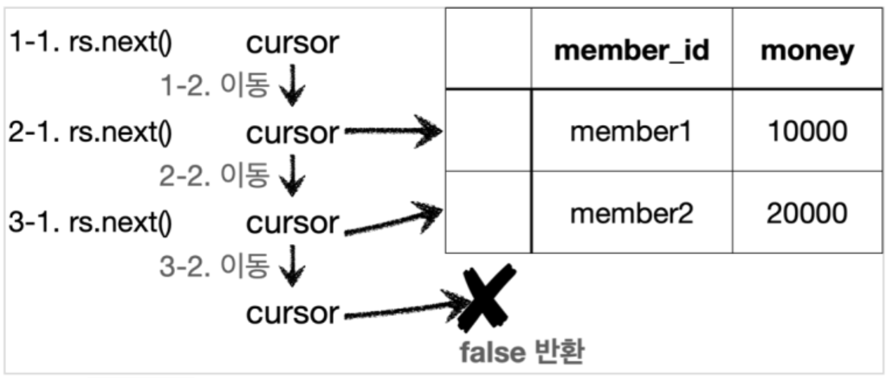<br>

- 참고로 위 `ResultSet`의 결과 예시는 회원이 2명 조회디는 경우이다.
  - `1-1`에서 `rs.next()`를 호출한다.
  - `1-2`의 결과로 `cursor`가 다음으로 이동한다. 이 경우 `cursor`가 가리키는 데이터가 있으므로 `true`를 반환한다.
  - `2-1`에서 `rs.next()`를 호출한다.
  - `2-2`의 결과로 `cursor`가 다음으로 이동한다. 이 경우 `cursor`가 가리키는 데이터가 있으므로 `true`를 반환한다.
  - `3-1`에서 `rs.next()`를 호출한다.
  - `3-2`의 결과로 `cursor`가 다음으로 이동한다. 이 경우 `cursor`가 가리키는 데이터가 없으므로 `false`를 반환한다.
  - (참고) 예제의 `findById()`에서는 회원 하나를 조회하는 것이 목적이다. (SQL을 보면 Pk인 member_id를 항상 지정하는 것을 확인할 수 있다.) 따라서 조회 결과가 항상 1건이므로 `while`대신에 `if`를 사용한다.

### 테스트 코드

```java
package hello.jdbc.repository;

import hello.jdbc.domain.Member;
import lombok.extern.slf4j.Slf4j;
import org.junit.jupiter.api.Test;

import java.sql.*;

import static org.assertj.core.api.Assertions.*;

@Slf4j
class MemberRepositoryV0Test {

    MemberRepositoryV0 repository = new MemberRepositoryV0();

    @Test
    void crud() throws SQLException {

        //save
        Member member = new Member("memberV0", 10000);
        repository.save(member);

        //findById
        Member findMember = repository.findById(member.getMemberId());
        log.info("findMember={}", findMember);
        assertThat(findMember).isEqualTo(member);
    }
}
```
중복으로 실행할 경우 PK 중복 오류가 발생한다. `delete from member`을 이용하자.

실행 결과 로그를 확인해보자.<br>
`MemberRepositoryV0Test -- findMember=Member(memberId=memberV0, money=10000)`

- 회원을 등록하고 그 결과를 바로 조회해서 확인해 보았다.
- 참고로 실행 결과에 `member` 객체의 참조 값이 아니라 실제 데이터가 보이는 이유는 롬복의 `@Data`가 `toString()`을 적절히 오버라이딩해서 보여주기 때문이다.
- `isEqualTo()`: `findMember.euals(member)`를 비교한다. 결과가 참인 이유는 롬복의 `@Data`는 해당 객체의 모든 필드를 사용하도록 `equals()`를 오버라이딩 하기 때문이다. (member == findMember와 같이 인스턴스 비교를 하게되면 서로 다르기 때문에 false이다.)

## JDBC 개발 - 수정, 삭제

수정과 삭제는 등록과 비슷하다. 등록, 수정, 삭제처럼 데이터를 변경하는 쿼리는 `executeUpdate()`를 사용하면 된다.

### MemberRepositoryV0 - 회원 수정 추가(update)

```java
public void update(String memberId, int money) throws SQLException {
    String sql = "update member set money=? where member_id=?";

    Connection con = null;
    PreparedStatement pstmt = null;

    try {
        con = getConnection();
        pstmt = con.prepareStatement(sql);
        pstmt.setInt(1, money);
        pstmt.setString(2, memberId);

        int resultSize = pstmt.executeUpdate();
        log.info("resultSize={}", resultSize);
    } catch (SQLException e) {
        log.error("error", e);
        throw e;
    } finally {
        close(con, pstmt, null);
    }
}
```

`executeUpdate()`는 쿼리를 실행하고 영향받은 row수를 반환한다. 여기서는 하나의 데이터만 변경하기 때문에 결과로 1이 반환된다. 만약 회원이 100명이고, 모든 회원 데이터를 한번에 수정하는 update sql을 실행하면 결과는 100이 된다.

### 회원 수정 테스트

```java
//update(money : 10000 -> 20000)
repository.update(member.getMemberId(), 20000);
Member updatedMember = repository.findById(member.getMemberId());
assertThat(updatedMember.getMoney()).isEqualTo(20000);
```

### MemberRepositoryV0 - 회원 삭제 추가(delete)

```java
public void delete(String memberId) throws SQLException {
    String sql = "delete from member where member_id=?";

    Connection con = null;
    PreparedStatement pstmt = null;

    try {
        con = getConnection();
        pstmt = con.prepareStatement(sql);
        pstmt.setString(1, memberId);
        pstmt.executeUpdate();
    } catch (SQLException e) {
        log.error("db error", e);
        throw e;
    } finally {
        close(con, pstmt, null);
    }
}
```

### 회원 삭제 테스트 코드

```java
repository.delete(member.getMemberId());
Assertions.assertThatThrownBy(
        () -> repository.findById(member.getMemberId())).isInstanceOf(NoSuchElementException.class);
```

# 커넥션 풀과 데이터소스 이해

## 커넥션 풀 이해

먼저 커넥션 풀에 대해서 알아보자.

**데이터베이스 커넥션을 매번 획득**<br>

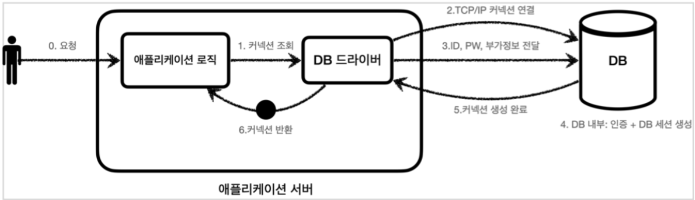<br>

데이터베이스 커넥션을 획득할 때는 다음과 같은 복잡한 과정을 거친다.
1. 애플리케이션 로직은 DB 드라이버를 통해 커넥션을 조회한다.
2. DB드라이버는 DB와 `TCP/IP`커넥션을 연결한다. 물론 이 과정에서 3way handshake와 같은 `TCP/IP` 연결을 위한 네트워크 동작이 발생한다.
3. DB드라이버는 `TCP/IP` 커넥션이 연결되면 ID, PW와 기타 부가정보를 DB에 전달한다
4. DB는 ID, PW를 통해 내부 인증을 완료하고, 내부에 DB세션을 생성한다,
5. DB는 커넥션 생성이 완료되었다는 응답을 보낸다.
6. DB 드라이버는 커넥션 객체를 생성해서 클라이언트에 반환한다.

이렇게 커넥션을 새로 만드는 것은, 과정도 복잡하고 시간도 많이 소모되는 일이다. DB는 물론이고 애플리케이션 서버에서도 `TCP/IP` 커넥션을 새로 생성하기 위한 리소스를 매번 사용해야 한다.<br>
진짜 문제는 고객이 애플리케이션을 사용할 때, SQL을 실행하는 시간 뿐만 아니라 커넥션을 새로 만드는 시간이 추가되기 때문에 결과적으로 응답 속도에 영향을 준다. 이것은 사용자에게 좋지 않은 경험을 줄 수 있다.(참고, 데이터베이스마다 커넥션을 생성하는 시간은 다르다. 시스템 상황마다 다르지만 MySQL계열은 수 ms정도로 매우 빨리 커넥션을 확보할 수 있다. 반면에 수십 밀리초 이상 걸리는 데이터베이스들도 있다.)

이런 문제를 한번에 해결하는 아이디어가 바로 커넥션을 미리 생성해두고 사용하는 커넥션 풀이라는 방법이다. 커넥션 풀은 이름 그대로 커넥션을 관리하는 풀(수영장 풀을 상상하면 된다)이다.

**커넥션 풀 초기화**<br>

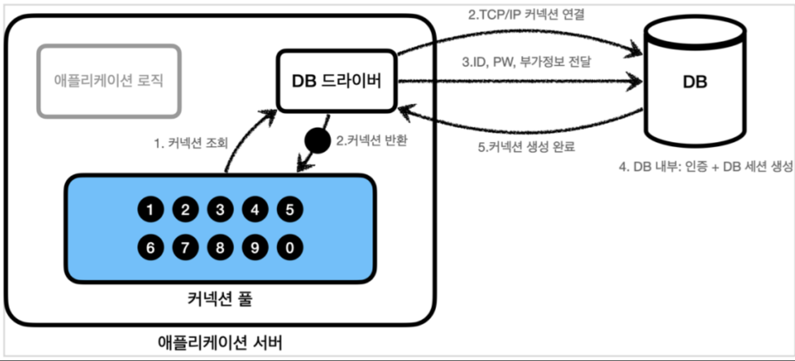<br>

애플리케이션을 시작하는 시점에, 커넥션 풀은 필요한 만큼 커넥션을 미리 확보해서 풀에 보관한다. 보통 얼마나 보관할 지는 서비스의 특징과 서버 스펙에 따라 다르지만 기본 값은 보통 10개이다.

**커넥션 풀의 연결 상태**<br>

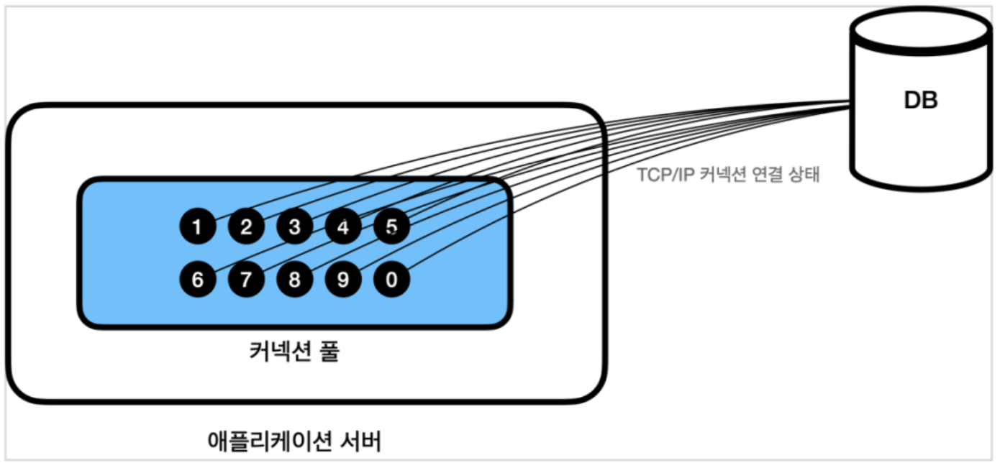<br>

커넥션 풀에 들어있는 커넥션은 TCP/IP로 DB와 커넥션이 연결되어 있는 상태이기 때문에 언제든지 즉시 SQL을 DB에 전달할 수 있다.

**커넥션 풀 사용 1**<br>

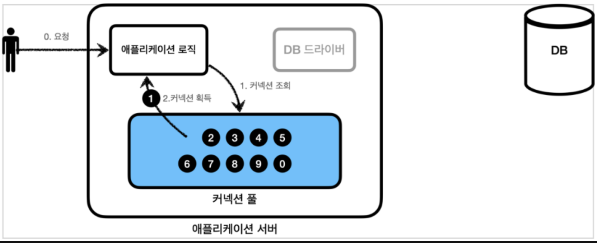<br>

- 애플리케이션 로직에서 이제는 DB 드라이버를 통해서 새로운 커넥션을 획득하는 것이 아니다.
- 이제는 커넥션 풀을 통해 이미 생성되어 있는 커넥션을 객체 참조로 그냥 가져다 쓰기만 하면 된다.
- 커넥션 풀에 커넥션을 요청하면 커넥션 풀은 자신이 가지고 있는 커넥션 중에 하나를 반환한다.

**커넥션 풀 사용2**<br>

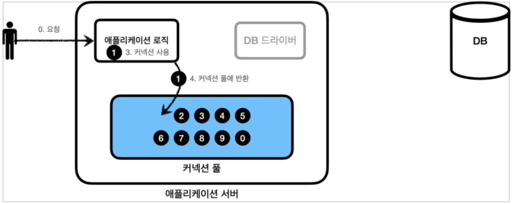<br>

- 애플리케이션 로직은 커넥션 풀에서 받은 커넥션을 사용해서 SQL을 데이터베이스에 전달하고 그 결과를 받아서 처리한다.
- 커넥션을 모두 사용하고 나면 이제는 커넥션을 종료하는 것이 아니라, 다음에 다시 사용할 수 있도록 해당 커넥션을 그래로 커넥션 풀에 반환하면 된다. 여기서 주의할 점은 커넥션을 종료하는 것이 아니라 커넥션이 살아있는 상태로 커넥션 풀에 반환해야 한다는 점이다.

> [!NOTE]
> - 적절한 커넥션 풀 숫자는 서비스의 특징과 애플리케이션 서버 스펙, DB서버 스펙에 따라 다르기 때문에 성능 테스트를 통해 정해야 한다.
> - 커넥션 풀은 서버당 최대 커넥션 수를 제한할 수 있다. 따라서 DB에 무한정 연결이 생성되는 것을 막아주어서 DB를 보호하는 효과도 있다.
> - 이런 커넥션 풀은 얻는 이점이 매우 크기 때문에 **실무에서는 항상 기본으로 사용**한다.
> - 커넥션 풀은 개념적으로 단순해서 직접 구현할 수도 있지만, 사용도 편리하고 성능도 뛰어난 오픈소스 커넥션 풀이 많기 때문에 오픈소스를 사용하는 것이 좋다.
> - 대표적인 커넥션 풀 오픈소스는 `commons-dbcp2`, `tomcat-jdbc pool`, `HikariCP`등이 있다
> - 성능과 사용의 편리한 측면서에 최근에는 `hikariCP`를 주로 사용한다. 스프링 부트 2.0부터는 기본 커넥션 풀로 `hikariCP`를 제공한다. 성늘, 사용의 편리함, 안전성 측면에서 이미 검증이 되었기 때문에 커넥션 풀을 사용할 때는 고민할 것 없이 `hikariCP`를 사용하면 된다. 실무에서도 레거시 프로젝트가 이닌 이상 대부분 `hikariCP`를 사용한다.

## DataSource 이해

커넥션을 얻는 방법은 앞서 학습한 JDBC `DriverManager`를 직접 사용하거나, 커넥션 풀을 사용하는 등 다양한 방법이 존재한다.

**커넥션을 획득하는 다양한 방법**<br>

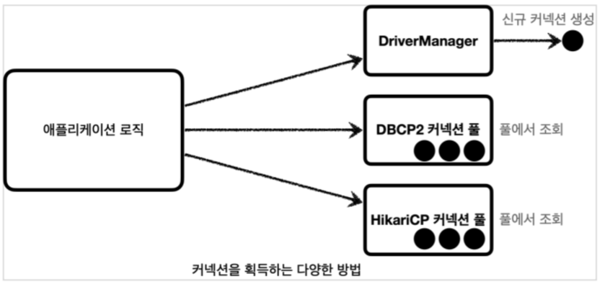<br>

직접 DriverManager를 통해서 항상 새로운 커넥션을 생성할 수도 있고, 커넥션 풀을 통해서 풀에 있는 커넥션을 사용할 수도 있다.

**DriverManager를 통해 커넥션 획득**<br>

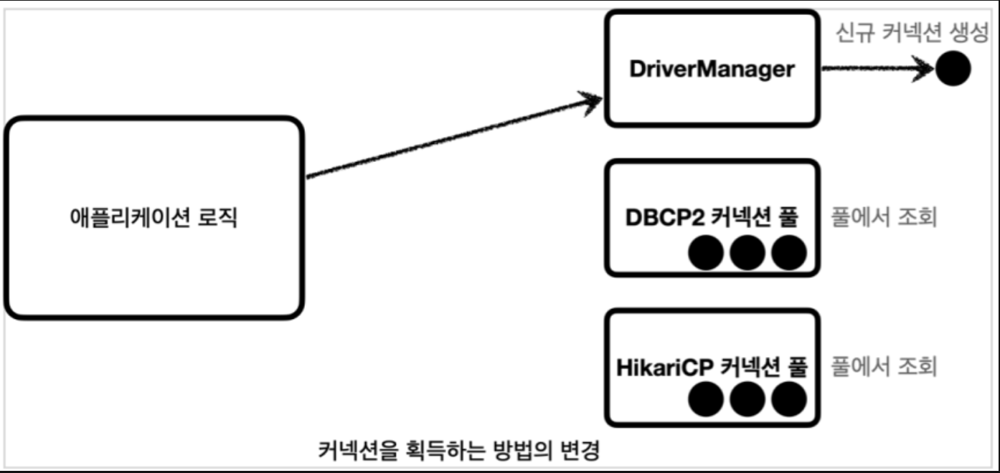<br>

- `DriverManager`를 통해서 커넥션을 획득하게 되면, 항상 신규 커넥션이 생성되고 그것을 반환받게 된다.
- 앞서 JDBC로 개발한 애플리케이처럼 `DriverManager`를 통해서 커넥현을 획득하다가, 커넥션 풀을 사용하는 방법으로 변경하려면 어떻게 해야할까?

**DriverManager를 통해 커넥션 획득하려다 커넧션 풀로 변경시 문제**<br>

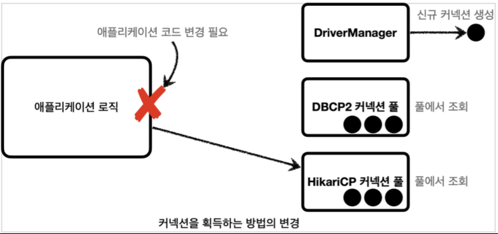<br>

- 예를 들어서, 애플리케이션 로직에서 `DriverManager`를 사용해서 커넥션을 획득하다가 `HikariCP`같은 커넥션 풀을 사용하도록 변경하면 커넥션을 획득하는 애플리케이션 코드도 함께 변경해야 한다. 의존관계가 `DriverManager`에서 `HikariCP`로 변경되기 때문이다. 물론 둘의 사용법도 조금씩 다를 것이다.

**커넥션을 획득하는 방법을 추상화**<br>
(-> 커넥션을 어떻게 얻을것인가? 그 방법을 추상화)<br>

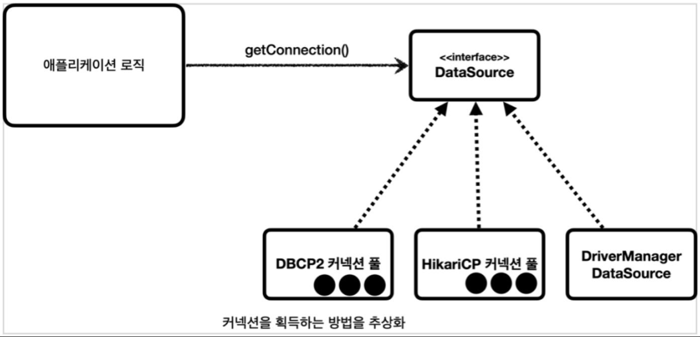<br>

- 자바에서는 이런 문제를 해결하기 위해 `javax.sql.DataSource`라는 인터페이스를 제공한다.
- `DataSource`는 **커넥션을 획득하는 방법을 추상화**하는 인터페이스이다.
- **이 인터페이스의 핵심 기능은 커넥션 조회 하나이다.** (다른 일부 기능도 있지만 크게 중요하지 않다.)

> [!NOTE]
> - 대부분의 커넥션 풀은 `DataSource` 인터페이스를 이미 구현해두었다. 따라서 개발자는 `DBCP2 커넥션 풀`, `HikariCP 커넥션 풀`의 코드를 직접 의존하는 것이 아니라, `DataSource`인터페이스에만 의존하도록 애플리케이션 로직을 작성하면 된다.
> - 커넥션 풀 구현 기술을 변경하고 싶으면 해당 구현체로 갈아끼우기만 하면 된다.
> - `DriverManager`는 `DataSource`인터페이스를 사용하지 않는다. 따라서 `DriverManager`는 직접 사용해야 한다. 따라서 `DriverManager`를 사용하다가 `DataSource`기반의 커넥션 풀을 사용하도록 변경하면 관련 코드를 다 고쳐야 한다. 이런 문제를 해결하기 위해 스프링은 `DriverManager`도 `DataSource`를 통해서 사용할 수 있도록 `DriverManagerDataSource`라는 `DataSource`를 구현한 클래스를 제공한다. (`DriverManagerDataSource`를 사용하면, 내부에서 `DriverManager`를 통해 커넥션을 항상 새로 생성하여 반환해준다.)
> - 자바는 `DataSource`를 통해 커넥션을 획득하는 방법을 추상화했다. 이제 애플리케이션 로직은 `DataSource`인터페이스에만 의존하면 된다. 덕분에 `DriverManagerDataSource`를 통해서 `DriverManager`를 사용하다가 커넥션 풀을 사용하도록 코드를 변경해도 애플리케이션 로직은 변경하지 않아도 된다.

## DataSource 예제1 - DriverManager

예제를 통해 `DataSource`를 알아보자.

먼저 기존에 개발했던 `DriverManager`를 통해서 커넥션을 획득하는 방법을 다시 한 번 확인해보자.

### ConnectionTest - 드라이버 매니저
`test/java/hello/jdbc/connection/ConnectinoTest`<br>
```java
package hello.jdbc.connection;

import lombok.extern.slf4j.Slf4j;
import org.junit.jupiter.api.Test;

import java.sql.Connection;
import java.sql.DriverManager;
import java.sql.SQLException;

@Slf4j
public class ConnectionTest {

    @Test
    void driverManager() throws SQLException {
        Connection con1 = DriverManager.getConnection(
                ConnectionConst.URL, ConnectionConst.USERNAME, ConnectionConst.PASSWORD
        );
        Connection con2 = DriverManager.getConnection(
                ConnectionConst.URL, ConnectionConst.USERNAME, ConnectionConst.PASSWORD
        );

        log.info("connection={}, class={}", con1, con1.getClass());
        log.info("connection={}, class={}", con2, con2.getClass());
    }
}
```

이번에는 스프링이 제공하는 `DataSource`가 적용된 `DriverManager`인 `DriverManagerDataSource`를 사용해보자.

### ConnectionTest - 데이터소스 드라이버 매니저 추가

```java
@Test
void dataSourceDriverManager() throws SQLException {
    //DriverManagerDataSource - 항상 새로운 커넥션을 획득
    DriverManagerDataSource dataSource = new DriverManagerDataSource(
            ConnectionConst.URL, ConnectionConst.USERNAME, ConnectionConst.PASSWORD
    );

    useDataSource(dataSource);
}

private void useDataSource(DataSource dataSource) throws SQLException {
    Connection con1 = dataSource.getConnection();
    Connection con2 = dataSource.getConnection();

    log.info("connection={}, class={}", con1, con1.getClass());
    log.info("connection={}, class={}", con2, con2.getClass());
}
```

기존 코드와 비슷하지만 `DriverManagerDataSource`는 `DataSource`를 통해서 커넥션을 획득할 수 있다. 참고로 `DriverManagerDataSource`는 스프링이 제공하는 코드이다.<br>

> [!TIP]
> DriverManagerDataSource에서 남겨주는 로그를 보자. "Creating new JDBC DriverManager Connection to [jdbc:h2:tcp://localhost/~/test]" -> JDBC DriverManager 를 통해서 jdbc:h2:tcp://localhost/~/test에 접근해서 커넥션을 만들었음을 알 수 있다.

### 파라미터 차이

기존 `DriverManager`를 통해서 커넥션을 획득하는 방법과 `DataSource`를 통해서 커넥션을 획득하는 방법에는 큰 차이가 있다.

**DriverManager**<br>
```java
Connection con1 = DriverManager.getConnection(URL, USERNAME, PASSWORD);
Connection con2 = DriverManager.getConnection(URL, USERNAME, PASSWORD);
```

**Datasource**<br>
```java
    @Test
    void dataSourceDriverManager() throws SQLException {
        //DriverManagerDataSource - 항상 새로운 커넥션을 획득
        DriverManagerDataSource dataSource = new DriverManagerDataSource(
                URL, USERNAME, PASSWORD
        );

        useDataSource(dataSource);
    }

    private void useDataSource(DataSource dataSource) throws SQLException {
        Connection con1 = dataSource.getConnection();
        Connection con2 = dataSource.getConnection();

        log.info("connection={}, class={}", con1, con1.getClass());
        log.info("connection={}, class={}", con2, con2.getClass());
    }
```

`DriverManager`는 커넥션을 획득할 때 마다 `URL`, `USERNAME`, `PASSWORD` 같은 파라미터를 계속 전달해야 한다. 반면에 `DataSource`를 사용하는 방식은, 처음 객체를 생성할 때만 필요한 파라미터를 남겨두고, 커넥션을 획득할 때는 단순히 `dataSource.getConnection()`만 호출하면 된다.

### 설정과 사용의 분리

- **설정**: `DataSource`를 만들고 필요한 속성들을 사용해서 `URL`, `USERNAME`, `PASSWORD`같은 부분을 입력하는 것을 말한다. 이렇게 설정과 관련된 속성들은 한 곳에 있는 것이 향후 변경에 더 유연하게 대처할 수 있다.
- **사용**: 설정은 신경쓰지 않고, `DataSource`의 `getConnection()`만 호출해서 사용하면 된다.

### 설정과 사용의 분리 설명

- 이 부분(설정과 사용의 분리)이 작아보이지만 큰 차이를 만들어내는데, 필요한 데이터를 `DataSource`가 만들어지는 시점에 미리 다 넣어두게 되면, `DataSource`를 사용하는 곳에서는 `dataSource.getConnection()`만 호출하면 되므로, `URL`, `USERNAME`, `PASSWORD`같은 속성들에 의존하지 않아도 된다. 그냥 `DataSource`만 주입받아서 `getConnection()`만 호출하면 된다.
- 쉽게 이야기해서 리포지토리(Repository)는 `DataSource`만 의존하고, 이런 속성들은 몰라도 된다.
- 애플리케이션을 개발해보면 보통 설정은 한 곳에서 하지만, 사용은 수 많은 곳에서 하게 된다.
- 덕분에 객체를 설정하는 부분과, 사용하는 부분을 좀 더 명확하게 분리할 수 있다.

## DataSource 예제2 - 커넥션 풀

이번에는 `DataSource`를 통해 커넥션 풀을 사용하는 예제를 알아보자.

### ConnectionTest - 데이터소스 풀 추가

```java
@Test
void dataSourceConnectionPool() throws SQLException, InterruptedException {
    //커넥션 풀링: HikariProxyConnection(Proxy) -> JdbcConnection(Target)
    HikariDataSource dataSource = new HikariDataSource();
    dataSource.setJdbcUrl(URL);
    dataSource.setUsername(USERNAME);
    dataSource.setPassword(PASSWORD);
    dataSource.setMaximumPoolSize(10); //default: 10 (DEFAULT_POOL_SIZE)
    dataSource.setPoolName("MyPool");

    useDataSource(dataSource);
    Thread.sleep(1000); //커넥션 풀에서 커넥션 생성 시간 대기
}

private void useDataSource(DataSource dataSource) throws SQLException {
    Connection con1 = dataSource.getConnection();
    Connection con2 = dataSource.getConnection();

    log.info("connection={}, class={}", con1, con1.getClass());
    log.info("connection={}, class={}", con2, con2.getClass());
}
```

- HikariCP 커넥션 풀을 사용했다. `HikariDataSource`는 `DataSource`인터페이스를 구현하고 있다.
- 커넥션 풀 최대 사이즈를 10으로 지정하고, 풀의 이름을 `MyPool`이라고 지정했다.
- 커넥션 풀에서 커넥션을 생성하는 작업은 애플리케이션 실행 속도에 영향을 주지 않기 위해 별도의 쓰레드에서 작동해야 한다. 별도의 쓰레드에서 동작하기 때문에 테스트가 먼저 종료되어 버린다. 예제처럼 `Thread.sleep`을 통해 대기 시간을 주어야 쓰레드 풀에 커넥션이 생성되는 로그를 확안할 수 있다.

### 만약 10개 이상 커넥션을 획득하면 어떻게 될까?

실행할 경우 `MyPool - Pool stats (total=10, active=10, idle=0, waiting=1)`로그를 보면, 커넥션 풀의 10개 커넥션이 모두 사용중이고, 1개가 대기상태인 것을 확인할 수 있따. 그리고 이후 30초 뒤에 SQLTransientConnectionException 예외가 발생하여 오류가 발생한 것을 확인할 수 있다.

### 실행결과를 분석하자

- **HikariConfig**
  - `HikariCP`관련 설정을 확인할 수 있다. 풀의 이름(`MyPool`)과 최대 풀 수 (`10`)등을 확인할 수 있다.
- **MyPool connection adder**
  - 별도의 쓰레드를 사용해서 커넥션 풀에 커넥션을 채우고 있는 것을 확인할 수 있다. 이 쓰레드는 커넥션 풀에 커녁션을 최대 풀 수 (`10`)까지 채운다.
  - 그렇다면 왜 별도의 쓰레드를 사용해서 커넥션 풀에 커넥션을 채우는 것일까?
    - 커넥션 풀에 커넥션을 채우는 것은 상대적으로 오래걸리는 일이다. 애플리케이션을 실행할 때 커넥션 풀을 채울 때 까지 마냥 대기하고 있다면 애플리케이션 실행 시간이 늦어진다. 따라서 이렇게 별도의 쓰레드를 사용해서 커넥션 풀을 채워야 애플리케이션 실행 시간에 영향을 주지 않는다.
- **커넥션 풀에서 커넥션 획득**
  - 커넥션 풀에서 커넥션을 획득하고 그 결과를 출력했다. 여기선는 커넥션 풀에서 커넥션을 2개 획득하고 반환하지는 않았다. 따라서 풀에 있는 10개의 커넥션 중에 2개를 애플리케이션이 가지고 있는 상태이다. 그래서 마지막 로그를 보면 사용중인 커넥션 `active=2`, 풀에서 대기 상태인 커넥션 `idle=8`을 확인할 수 있다.(`Mypool - After adding stats(total=10, active=2, idle=8, waiting=0)`)

## DataSource 적용

이번에는 `DataSource`를 애플리케이션에 적용해보자.

학습시 참고 잘료도 기존 코드는 그대로 유지하기 우해, 기존 코드를 복사해서 새로 만들자.

- `MemberRepositoryV0` -> `MemberRepositoryV1`
- `MemeberRepositoryV0Test` -> `MemeberRepositoryV1Test`

### MemberRepositoryV1 - 수정

```java
package hello.jdbc.repository;

import hello.jdbc.connection.DBConnectionUtil;
import hello.jdbc.domain.Member;
import lombok.extern.slf4j.Slf4j;
import org.springframework.jdbc.support.JdbcUtils;

import javax.sql.DataSource;
import java.sql.*;
import java.util.NoSuchElementException;

/**
 * JDBC - DriverManager 사용
 */
@Slf4j
public class MemberRepositoryV1 {

    private final DataSource dataSource;

    public MemberRepositoryV1(DataSource dataSource) {
        this.dataSource = dataSource;
    }

    public Member save(Member member) throws SQLException { ... }

    public Member findById(String memberId) throws SQLException { ... }

    public void update(String memberId, int money) throws SQLException { ... }

    public void delete(String memberId) throws SQLException { ... }


    private void close(Connection con, Statement stmt, ResultSet rs) {
        JdbcUtils.closeResultSet(rs);
        JdbcUtils.closeStatement(stmt);
        JdbcUtils.closeConnection(con);
    }

    private Connection getConnection() throws SQLException {
        Connection con = dataSource.getConnection();
        log.info("get connection={}, class={}", con, con.getClass());
        return con;
    }
}
```

- `DataSource` 의존관계 주입
  - 외부에서 `DataSource`를 주입 받아서 사용한다. 이제 직접 만든 `DBConnectionUtil`을 사용하지 않아도 된다.
  - `DataSource`는 표준 인터페이스이기 때문에 `DriverManagerDataSource`에서 `HikariDataSource`로 변경되어도 해당 코드를 변경하지 않아도 된다. (둘 다 표준 인터페이스인 `DataSource`를 구현하고 있기 때문)
- `JdbcUtils` 편의 메서드
  - 스프링은 JDBC를 편리하게 다룰 수 있는 `JdbcUtils`라는 편의 메서드를 제공한다.
  - `JdbcUtils`을 사용하면 커넥션을 좀 더 편리하게 닫을 수 있다.

### MemberRepositoryV1Test - 수정 (DriverManagerDataSource 사용)

```java
package hello.jdbc.repository;

import hello.jdbc.domain.Member;
import lombok.extern.slf4j.Slf4j;
import org.assertj.core.api.Assertions;
import org.junit.jupiter.api.BeforeEach;
import org.junit.jupiter.api.Test;
import org.springframework.jdbc.datasource.DriverManagerDataSource;

import java.sql.SQLException;
import java.util.NoSuchElementException;

import static hello.jdbc.connection.ConnectionConst.*;
import static org.assertj.core.api.Assertions.assertThat;

@Slf4j
class MemberRepositoryV1Test {

    MemberRepositoryV1 repository;

    @BeforeEach
    void beforeEach() {
        DriverManagerDataSource dataSource = new DriverManagerDataSource(
                URL, USERNAME, PASSWORD
        );
        repository = new MemberRepositoryV1(dataSource);
    }

    @Test
    void crud() throws SQLException {

        //save
        System.out.println("-----------save-----------");
        Member member = new Member("memberV0", 10000);
        repository.save(member);

        //findById
        System.out.println("-----------findById-----------");
        Member findMember = repository.findById(member.getMemberId());
        log.info("findMember={}", findMember);
        assertThat(findMember).isEqualTo(member);

        //update(money : 10000 -> 20000)
        System.out.println("-----------update-----------");
        repository.update(member.getMemberId(), 20000);
        Member updatedMember = repository.findById(member.getMemberId());
        log.info("memberid={}", member.getMemberId());
        log.info("money={}", member.getMoney());
        assertThat(updatedMember.getMoney()).isEqualTo(20000);

        System.out.println("-----------delete-----------");
        repository.delete(member.getMemberId());
        Assertions.assertThatThrownBy(
                () -> repository.findById(member.getMemberId())).isInstanceOf(NoSuchElementException.class);
    }
}
```

- (참고) @BeforeEach: 각 테스트가 실행되기 직전에 호출된다.
- `MemberRepositoryV1`은 `DataSource` 의존관계 주입이 필요하다.

### MemberRepositoryV1Test - 수정 (HikariDataSource 사용)

```java
@Slf4j
class MemberRepositoryV1Test {

    MemberRepositoryV1 repository;

    @BeforeEach
    void beforeEach() {
        //커넥션 풀링: HikariProxyConnection -> JdbcConnection
        HikariDataSource dataSource = new HikariDataSource();
        dataSource.setJdbcUrl(URL);
        dataSource.setUsername(USERNAME);
        dataSource.setPassword(PASSWORD);

        repository = new MemberRepositoryV1(dataSource);

        ...
    }
```

- 커넥션 풀 사용시 `conn0`커넥션이 재사용된 것을 확인할 수 있다. (참고로 커넥션 close시, 커넥션 풀인 경우에는 커넥션을 닫는게 아니라 커넥션 풀에 반환한다.)
- 테스트는 순서대로 실핻되기 때문에 커넥션을 사용하고 다시 돌려주는 것을 반복한다. 따라스 `conn0`만 사용된다.(참고. 커넥션을 꺼낼 때는 처음에 있는 사용 가능한 것을 꺼낸다.)
- 웹 애플리케이션에 동시에 여러 요청이 들어오면 여러 쓰레드에서 커넥션 풀의 커넥션을 다양하게 가져가는 상황을 확인할 수 있다.

> [!NOTE]
> HikariProxyConnection 객체 인스턴스 주소는 다 다르다. Hikari에서는 커넥션 풀에서 커넥션을 반환해줄 때, HikariProxyConnection 이라는 객체를 생성하고, 거기에 실제 커넥션을 wrapping해서 반환한다. (따라서 HikariProxyConnection 객체 인스턴스 주소는 다 다르지만, 그 안에 실제 커넥션은 동일하다.)<br>
> **핵심은 커넥션 풀을 사용하면, 같은 커넥션을 재사용할 수 있다는 점이다.**

> [!TIP]
> **DI**<br>
> `DriverManagerDataSource` -> `HikariDataSource`로 변경해도 `MemberRepositoryV1`의 코드는 전혀 변경하지 않아도 된다. `MemberRepositoryV1`는 `DataSource`인터페이에만 의존하기 때문이다. 이것이 `DataSource`를 사용하는 장점이다. (`MemberRepositoryV1`는 `DataSource` 인터페이스에만 의존한다. 구현체가 바뀌더라도 코드를 변경하지 않아도 된다.)

# 트랙잭션 이해

## 트랜젝션 - 개념 이해

데이터를 저장할 때 단순히 파일에 저장해도 되는데, 데이터베이스에 저장하는 이유는 무엇일까><br>
여러가지 이유가 있지만, 가장 대표적인 이유는 바로 데이터베이스는 트랜잭션이라는 개념을 지원하기 때문이다.

트랜잭션을 이름 그래로 번역하면 거리래는 뜻이다. 이것을 쉽게 풀어서 이야기하면, 데이터베이스에서 트랜잭션은 하나의 거래를 안전하게 처리하도록 보장해주는 것을 뜻한다. 그런데 하나의 거래를 안전하게 처리하려면 생각보다 고려해야할 점이 많다. 예를들어서 A의 5000원을 B에게 계좌이체한다고 생각해보자. A의 잔고를 5000원 감소하고, B의 잔고를 5000원 증가해야 한다.

**5000원 계좌 이체**<br>
("5000원을 계좌이체한다."라는 이 하나의 트랜잭션, 즉 이 하나의 거래는 사실 아리 2개로 이루어져있따.)

- A의 잔고를 5000원 감소
- B의 잔고를 5000원 증가

계좌이체라는 거래는 이렇게 2가지 작업이 합쳐져서 하나의 작업처럼 동작해야 한다.<br>
만약 1번은 성공했는데 2번에서 시스템에 문제가 발생하면, 계좌이체는 실패고, A의 잔고만 5000원 감소하는 심각한 문제가 발생한다.

데이터베이스가 제공하는 트랜잭션이라는 기능을 사용하면 1번과 2번 둘다 함께 성공해야 저장하고, 중간에 하나라도 실패하면 거개 전의 상태로 돌아갈 수 있다. 만약 1번은 성공했는데 2번에서 시스템에 문제가 발생하면 계좌 이체는 실패하고, 거래 전의 상태로 완전히 돌아갈 수 있다. 결과적으로 A의 잔고가 감소하지 않는다.

모든 작업이 성공해서 데이터베이스에 정상 반영하는 것을 커밋(`Commit`)이라 하고, 작업 중 하나라도 실패해서 거래 이전으로 되돌리는 것을 롤백(`Rollback`)이라 한다.

### 트랜잭션 ACID

트랙잭션은 ACID라 하는 원자성(Atomicity), 일관성(Consistency), 격리성(Isolation), 지속성(Durability)를 보장해야 한다.

- **원자성**: 트랜잭션 내에서 실행한 작업들은 마치 하나의 작업인 것처럼 모두 성공 하거나 모두 실패해야 한다.
- **일관성**: 모든 트랜잭션은 일관성이 있는 데이터베이스 상태를 유지해야 한다. 예를 들어 데이터베이스에서 정한 무결성 제약 조건을 항상 만족해야 한다.
- **격리성**: 동시에 실행되는 트랜잭션이 서로에게 영향을 미치지 않도록 격리한다. 예를 들어 동시에 같은 데이터를 수정하지 못하도록 해야한다. 격리성은 동시성과 관련된 성능 이슈로 인해 트랜잭션 격리 수준을 선택할 수 있다.
- **지속성**: 트랜잭션을 성공적으로 끝내면 그 결과가 항상 기록되어야 한다. 중간에 시스템에 문제가 발생해도 데이터베이스 로그들을 사용해서 성공한 트랜잭션 내용을 복구해야 한다.

트랜잭션은 원자성, 일관성, 지속성을 보장한다. 문제는 격리성인데 트랜잭션 간에 격리성을 완벽히 보장하려면 트랜잭션을 거의 순서대로 실행해야 한다. 이렇게 하면 동시 처리 성능이 매우 나빠진다. 이런 문제로 인해 ANSI표준은 트랜잭션의 격리수준을 4단계로 나누어 정의했다.

### 트랜잭션 격리 수준 - Isoloation level

- READ UNCOMMITED(커밋되지 않은 읽기)
- READ COMMITTED(커밋된 읽기)
- REPEATABLE READ(반복 가능한 읽기)
- SERIALIZABLE(직렬화 가능)

> [!TIP]
> 여기선느 일반적으로 많이 사용하는 READ COMMITTED(커밋된 읽기) 트랜잭션 격리 수준을 기준으로 설명한다.

## 데이터베이스 연결 구조와 DB 세션

트랜잭션을 더 자세히 이해하기 위해서, 데이터베이스 서버 연결 구조와 DB세션에 대해 알아보자.

**데이터베이스 연결구조1**<br>

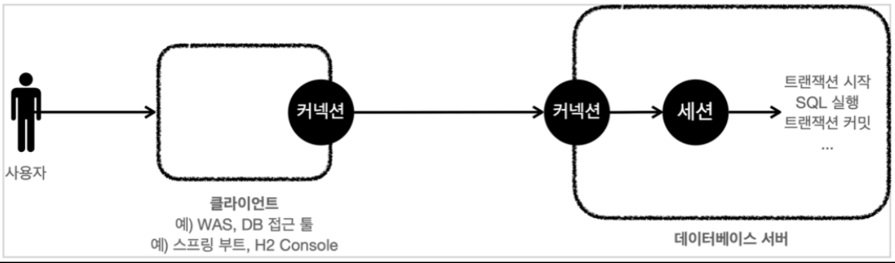<br>

- 사용자는 웬 애플리케이션 서버(WAS)나 DB 접근 툴 같은 클라이언트를 사용해서 데이터베이스 서버에 접근할 수 있다. 클라이언트는 데이터베이스 서버에 연결을 요청하고 커넥션을 맺게 된다. 이떼 데이터베이스 서버는 내부에 세션이라는 것을 만든다. 그리고 앞으로 해당 커넥션을 통한 모든 요청은 이 세션을 통해 실행하게 된다.
- 쉽게 이야기해서 개발자가 클라이언트를 통해 SQL을 전달하면 현재 커넥션에 연결된 세션이 SQL을 실행한다.
- 세션은 트랜잭션을 시작하고, 커밋 또는 롤백을 통해 트랜잭션을 종룧나다. 그리고 이후에 새로운 트랜잭션을 다시 시작할 수 있다.
- 사용자가 커넥션을 닫거나, 또는 DBA(DB 관리자)가 세션을 강제로 종료하면 세션은 종료된다.

**데이터베이스 연결구조2**<br>

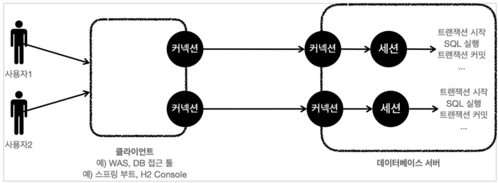<br>

커넥션 푸링 10개의 커넥션을 생성하면, 세션도 10개 만들어진다.

## 트랜잭션 - DB 예제1 - 개념이해

트랜잭션 동작을 예제를 통해 확인하자.<br>
이번 내용에서는 먼저 트랜잭션의 동작 개념의 전체 그림을 이해하는데 집중하자.<br>
(다음 내용에서부터 실제 SQL을 실행하면서 실습해보겠다.)

참고로 지금부터 설명하는 내용은 트랜잭션 개념의 이해를 돕기 위해 예시로 설명하는 것이다.<br>
구체적인 실제 구현 방식은 데이터베이스마다 다르다.

### 트랜잭션 사용법

- 데이터 변경 쿼리를 실행하고 데이터베이스에 그 결과를 반영하려면 커밋 명령어인 `commit`을 호출하고, 결과를 반영하고 싶지 않으면 롤백 명령인 `rollback`을 호출하면 된다.
- **커밋을 호출하기 전까지는 임시로 데이터를 저장**하는 것이다. 따라서 해당 트랜잭션을 시작한 세션(사용자)에게만 변경 데이터가 보이고 다른 세션(사용자)에게는 변경 데이터가 보이지 않는다.
- 등록, 수정, 삭제 모두 같은 원리로 동작한다. 앞으로는 등록, 수정, 삭제를 간단히 **변경**이라는 단어로 표현하겠다.

### 기본 데이터

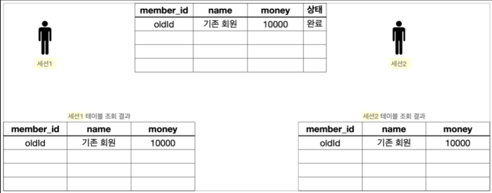<br>

세션1, 세션2 둘다 가운데 있는 기본 테이블을 조회하면 해당 데이터가 그대로 조회된다.

**세션1 - 신규 데이터 추가**<br>

<br>

- 세션1은 트랜잭션을 시작하고 신규 회원 1, 신규회원2를 DB에 추가했다. 아직 커밋은 하지 않은 상태이다.
- 그러면 새로운 데이터는 임시 상태로 저장된다.(위 그림에서 상태는 우리가 눈으로 볼 수 있는 것은 아니고 DB내부에서 관리하는 것이다. 참고로 이에 대한 구현은 데이터베이스마다 다르다.)
- 세션1은 `select`쿼리를 실행해서 본인이 입력한 신규 회원1, 신규 회원2를 조회할 수 있다.
- 세션2는 `select`쿼리를 실행해도 신규 회원들을 조회할 수 없다. 왜냐햐면 세션1이 아직 커밋을 하지 않았기 때문에다. (커밋을 해야 실제 데이터베이스에 반영됨)

### 커밋하지 않은 데이터를 다른 곳에서 조회할 수 있으면 어떤 문제가 발생할까?

- 예를 들어서 커밋하지 않는 데이터가 보인다면, 세션2는 데이터를 조회했을 때 신규 회원1, 2가 보일것이다. 따라서 신규 회원1, 신규 회원2가 있다고 가정하고 어떤 로직을 수행할 수 있다. 그런데 세션1이 롤백을 수행하면 신규 회원1, 신규 회원2의 데이터가 사라지게 된다. 따라서 데이터 정합성에 큰 문제가 발생한다.
- 세션2에서 세션1이 아직 커밋하지 않은 변경 데이터가 보인다면, 세션1이 롤백했을 때 심각한 문제가 발생할 수 있다. 따라서 커밋 전의 데이터는 다른 세션에서 보이지 않는다.

### 세션 1 - 신규 데이터 추가 후 commit

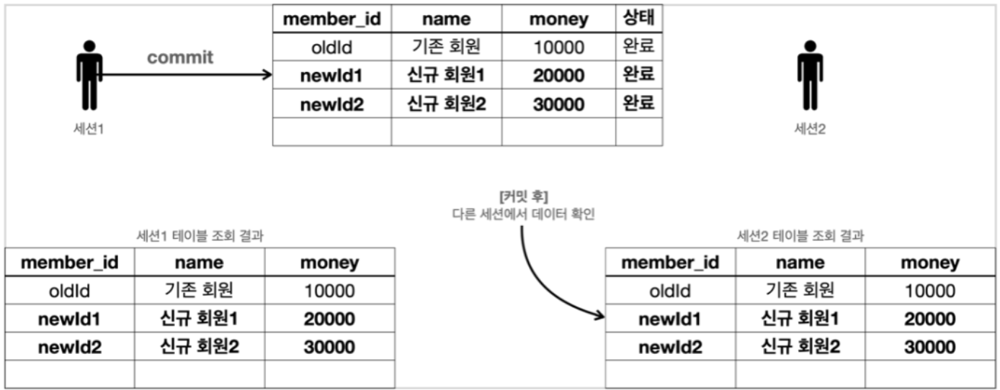<br>

- 세션1이 신규 데이터를 추가한 후에 `commit`을 호출했다.
- `commit`으로 새로운 데이터가 실제 데이터베이스에 반영된다. 데이터의 상태도 임시 -> 완료로 변경되었다.
- 이제 다른 세션에서도 회원 테이블을 조회하면 신규 회원들을 확인할 수 있다.

### 세션 1 - 신규 데이터 추가 후 rollback

<br>

- 세션1이 신규 데이터를 추가한 후에 `commit`대신에 `rollback`을 호출했다.
- 세션1이 데이터베이스에 반영한 모든 데이터가 처음 상태로 복구된다.
- 수정하거나 삭제한 데이터도 `rollback`을 호출하면 모두 트랜잭션을 시작하기 직전의 상태로 복구된다.

## 트랜잭션 - DB 예제2 - 자동 커밋, 수동 커밋

이전에 설명한 예제를 돌려보기 전에 먼저 자동 커밋, 수동 커밋에 대해 알아보자.<br>
참고로 예제에 사용되는 스키마는 이전에 실습했던 것과 동일하다. (`sql/schema.sql`)

### 자동 커밋

- 트랜잭션을 사용하려면 먼저 자동 커밋과 수동 커밋을 이해해야 한다.
- 자동 커밋으로 설정하면 각각의 쿼리 실행 직후에 자동 커밋을 호출한다. 따라서 커밋이나 롤백을 직접 호출하지 않아도 되는 편리함이 있다. 하지만 쿼리를 하나하나 실행할 때마다 자동으로 커밋이 되어버리기 때문에 우리가 원하는 트랜잭션 기능을 제대로 사용할 수 없다.

### 자동 커밋 설정

```sql
set autocommit true
insert into meber(member_id, money) values ('data1', 10000); //자동커밋
insert into meber(member_id, money) values ('data2', 10000); //자동커밋
```

- 따라서 `commit`, `rollback`을 직접 호출하면서 트랜잭션 기능을 제대로 수행하려면 자동 커밋을 끄고 수동 커밋을 사용해야 한다.
- (참고) 자동 커밋의 경우에도 쿼리마다 내부에서 짧은 트랜잭션이 일어난다.

### 수동 커밋 설정

```sql
set autocommit false; //수동 커밋 
insert into meber(member_id, money) values ('data3', 10000); //자동커밋
insert into meber(member_id, money) values ('data4', 10000); //자동커밋
commit; //수동 커밋
```

- 보통 자동 커밋 모드가 기본으로 설정된 경우가 많기 때문에, 수동 커밋 모드로 설정하는 것을 트랜잭션을 시작한다고 표현할 수 있다.
- 수동 커밋 설정을 하면 이후에 꼭 `commit`, `rollback`을 호출해야 한다. (호출하지 않으면, 데이터가 실제 DB에 반영되지 않는다.)
  - (참고) 호출하지 않고 DB 트랜잭션 수행 타임아웃 설정시간을 넘어가게 되면, 자동으로 롤백된다. (트랜잭션 수행 타임아웃 시간은 DB마다 다르니 참고하자)
  
참고로 수동 커밋 모드나 자동 커밋 모드는 한번 설정하면 해당 세션에서는 계속 유지도니다. 중간에 변경하는 것은 가능하다.

이제 본격적으로 트랜잭션 예제를 실습해보자.

## 트랜잭션 - DB 예제3 - 트랜잭션 실습

지금까지 설명한 예시를 직접 확인해보자.<br>
먼저 H2 데이터베이스 웹 콘솔 창을 2개 열어두자

> [!CAUTION]
> H2데이터베이스 웹 콘솔 창을 2개 열때, 기존 URL을 복사하면 안된다. 꼭 `http://localhost:8082`를 직접 연결해서 완전히 새로운 세션에서 연결하도록 하자.

### 1 커밋 - COMMIT

### 1-1 기본 데이터를 다음과 같이 맞추어두자.

<br>

기본 데이터 SQL<br>
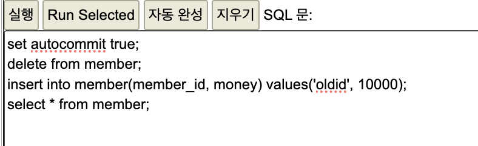<br>

- 자동 커밋 모드를 사용했기 때문에 별도로 커밋을 호출하지 않아도 된다.(세션1, 세션2에서 모두 정상적으로 조회됨을 확인할 수 있습니다.)
- (참고) 참고로 이미지의 `name`필드는 이해를 돕기 위해 그린 것이고 실제로는 없다.

### 1-2 세션1 - 신규 데이터 추가

<br>

세션1- 신규 데이터 추가 SQL<br>

```sql
//트랜잭션 시작
set autocommit false; //수동커밋모드

insert into member(member_id, money) values ('newId1', 10000);
insert into member(member_id, money) values ('newId2', 10000);
```
세션1, 세션2에서 `select * from member;`쿼리를 실행해서 결과를 확인하자

결과를 비교하면 아직 세션1이 커밋을 하지 않은 상태이기 때문에 세션1에서는 입력한 데이터가 보이지만, 세션 2에서는 입력한 데이터가 보이지 않은 것을 확인할 수 있다.

### 1-3 세션1 - 신규 데이터 추가 후 commit


세션1에서 커밋(`commit`)을 호출해보고 세선1, 세센2에서 `select * from member`쿼리를 실행해서 결과를 확인해보자

세션 1이 트랜잭션을 커밋했기 때문에 데이터베이스에 실제 데이터가 반영된다. 커밋 이후에는 모든 세션에서 데이터를 조회할 수 있다.

### 2 롤백 - rollback

### 2-1 기본 데이터를 다음과 같이 맞추어두자.

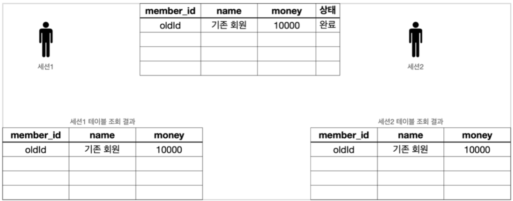<br>

기본 데이터 SQL<br>
```sql
set autocommit true;
delete from member;
insert into member(member_id, money) values ('oldid', 10000);
select * from member;
```

### 2-2 세션1 - 신규 데이터 추가

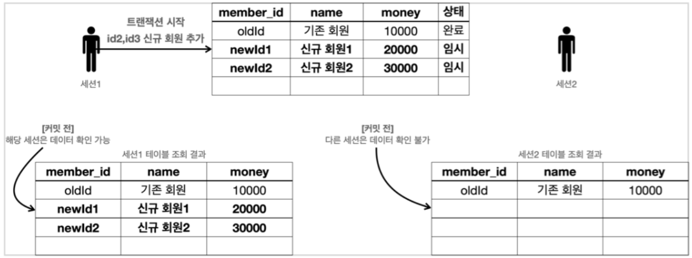<br>

세션1 - 신규 데이터 추가 SQL

```sql
set autocommit false;

insert into member(member_id, money) values ('newId1', 10000);
insert into member(member_id, money) values ('newId2', 10000);
```

세션1에서 트랜잭션을 시작 상태로 만든 다음에 데이터를 추가하자.

세션1, 세션2에서 `select * from member;`쿼리를 실행해서 결과를 확인하자

세션1이 아직 커밋하지 않은 상태이므로 세션1에서는 입력한 데이터가 보이지만, 세션2에서는 입력한 데이터가 보이지 않는다.

### 2-3 세션1 - 신규 데이터 추가 후 rollback

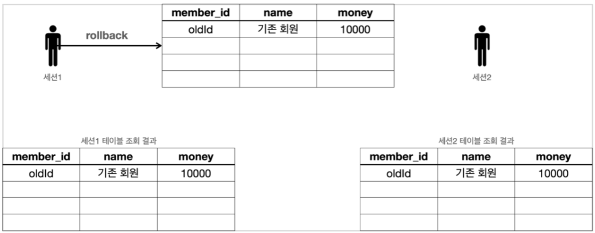<br>

세션1에서 롤백을 호출해보자. (`rollback;`) 그리고 세션1, 세션2에서 `select * from member;` 쿼리를 실행해서 결과를 확인하자.

실행해보면 롤백으로 인해 데이터가 DB에 반영되지 않은 것을 확인할 수 있다.

## 트랜잭션 - DB 예제4 - 계좌이체

이번에는 계좌이체 예제를 통해 트랜잭션이 어떻게 사용되는지 조금 더 자세히 알아보자.<br>
다음 3가지 상황을 준비했다.

- 계좌이체 정상
- 계좌이체 문제 상황 - 커밋
- 계좌이체 문제 상황 - 롤백

먼저, 계좌이체가 발생하는 정상 흐름을 알아보자.

### 1 계좌이체 정상

### 1-1 기본 데이터 세팅

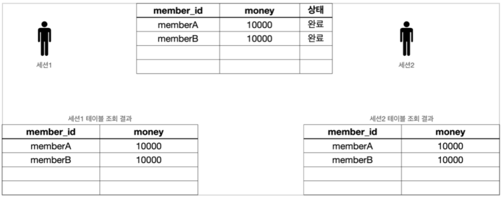<br>

기본 데이터 입력 SQL<br>

```sql
set autocommit true;
delete from member;
insert into member(member_id, money) values ('memberA', 10000);
insert into member(member_id, money) values ('memberB', 10000);
select * from member
```

### 1-2 세션1 - 계좌이체 실행

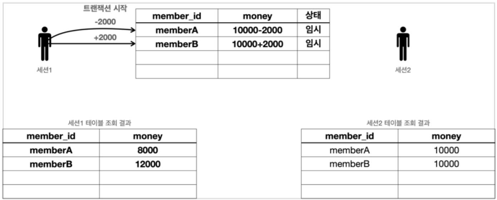<br>

`memberA`의 돈을 `memberB`에게 2000원 계좌이체하는 트랜잭션을 실행해보자. 아래와 같이 2번의 `update`쿼리가 수행되어야 한다.

계좌이체 실행 SQL<br>

```sql
set autocommit false;

update member set money = 10000 - 2000 where member_id = 'memberA';
update member set money = 10000 + 2000 where member_id = 'memberB';
```

- `set autocommit false`로 설정한다
- 아직 커밋하지 않았으므로 다른 세션에는 기존 데이터가 조회된다.

### 1-3 세션1 - 계좌이체 실행 커밋

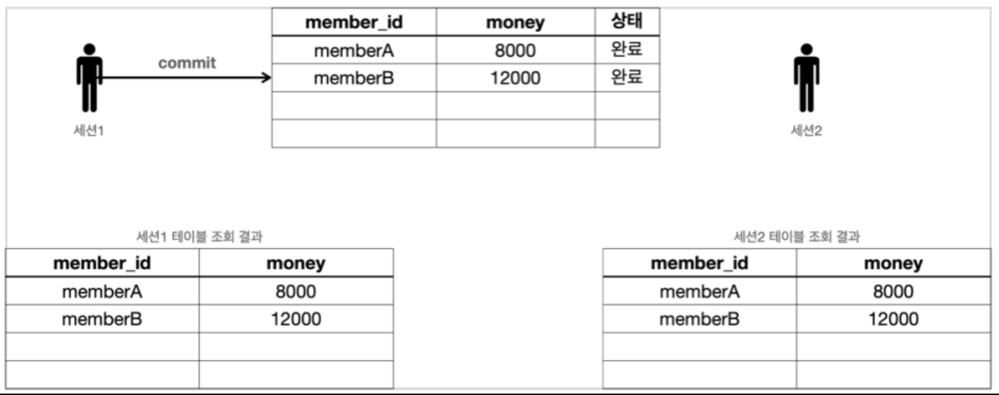<br>

- `commit`명령어를 실행하면 데이터베이스에 결과가 반영된다
- 다른 세션에서도 `memberA`의 금애긍ㄹ 8000원으로 줄어들고, `memberB`의 금액이 12000원으로 증가한 것을 확인할 수 있다.

이번에는 계조이체 도중에 문제가 발생하는 상황을 알아보자

### 2 계좌이체 문제 상황 - 커밋

### 2-1 기본 데이터 세팅

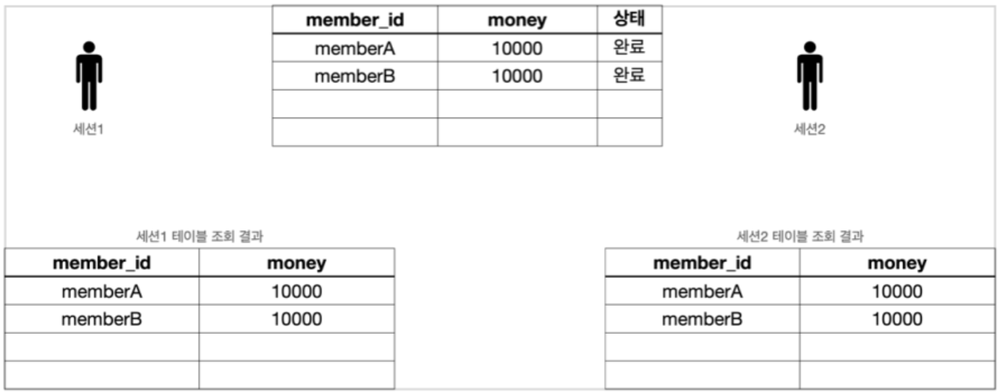<br>

기본 데이터 입력 - sql<br>

```sql
set autocommit true;
delete from member;
insert into member(member_id, money) values ('memberA', 10000);
insert into member(member_id, money) values ('memberB', 10000);
select * from member
```

처음으로 돌리기위해 데이터를 초기화해놓자

### 2-2 계좌이체 실행

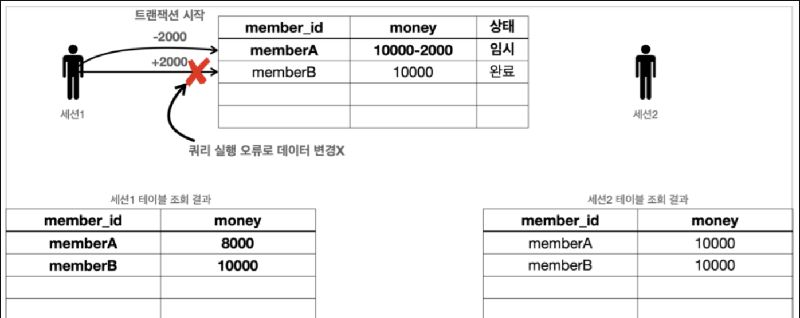<br>

- 계좌이체를 실행하는 도중에 SQL에 문제가 발생했다. 그래서 `memberA`의 돈을 2000원 줄이는 것에는 성공했지만, `memberB`의 돈을 2000원 증가시키는 것에 실패한다.
- 아래 쿼리에서 두 번째 SQL은 `member_idddd`라는 필드에 오타가 있다. 두 번째 update 쿼리를 실행하면 SQL 오류가 발생하는 것을 확인할 수 있다.

**계좌이체 실행 SQL - 오류**<br>
```sql
set autocommit false;

update member set money = 10000 - 2000 where member_id = 'memberA'; //성공
update member set money = 10000 + 2000 where member_iddd = 'memberA'; //쿼리 예외 발생
```

여기서 문제는 `memberA`의 돈은 2000원 줄어들었지만, `memberB`의 돈은 2000원 증가하지 않았다는 점이다. 결과적으로 계좌이체는 실패하고 `memberA`의 돈만 2000원 줄어든 상황이다.

**강제커밋**<br>

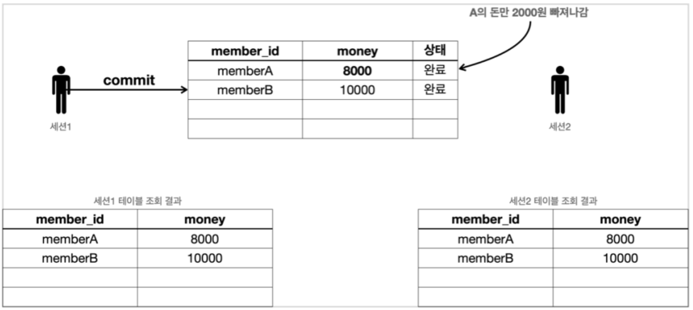<br>

- 만약 이 상황에서 강제로 `commit`을 호출하면 어떻게 될까?
- 결과적으로 계좌이체는 실패한 것인데, `memberA`의 돈만 2000원 줄어드는 아주 심각한 문제가 발생한다.
- 이렇게 중간에 문제가 발생했을 때는 커밋을 호출하면 안된다. 롤백을 호출해서 데이터를 트랜잭션 시작 시점으로 원복해야 한다.

중간에 문제가 발생했을 때 롤백을 호출해서 트랜잭션 시작 시점으로 데이터를 원복해보자.

### 3 계좌이체 문제 상황 - 롤백

### 3-1 기본 데이터 세팅

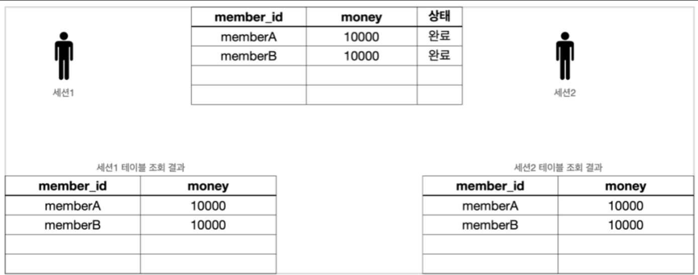<br>

**기본 데이터 입력 - SQL**<br>

```sql
set autocommit true;
delete from member;
insert into member(member_id, money) values ('memberA', 10000);
insert into member(member_id, money) values ('memberB', 10000);
select * from member;
```

예제를 처음으로 돌리기 위해 데이터를 초기화 하자.

### 3-2 계좌이체 실행

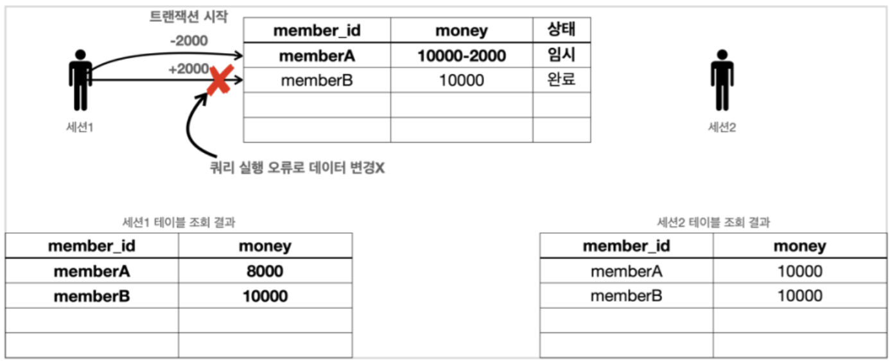<br>

계좌이체를 실행하는 도중에 SQL에 문제가 발생한다, 그래서 `memberA`의 돈을 2000원 줄이는 것에는 성공했지만, `memberB`의 돈을 2000원 증가시키는 것에 실패한다. 아래 두 번째 update쿼리를 실행하면 SQL오류가 발생하는 것을 확인할 수 있다.

**계좌이체 실행 SQL - 오류**<br>

```sql
set autocommit false;

update member set money = 10000 - 2000 where member_id = 'memberA'; //성공
update member set money = 10000 + 2000 where member_iddd = 'memberA'; //쿼리 예외 발생

select * from member
```

여기서 문제는 `memberA`의 돈은 2000원 줄어들었지만, `memberB`의 돈은 2000원 증가하지 않았다는 점이다. 결과적으로 계좌이체는 실패하고 `memberA`의 돈만 2000원 줄어든 상황이다.

**롤백**<br>

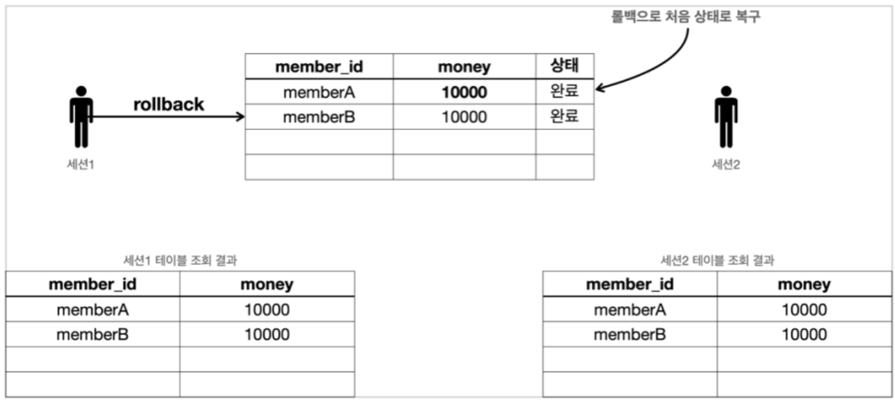<br>

```sql
rollback;
select * from member;
```

- 이럴 때는 롤백을 호출해서 트랜잭션을 시작하기 전 단계롤 데이터를 복구해야 한다.
- 롤백을 사용한 덕분에 계좌이체를 실행하기 전 상태로 돌아왔다. `memberA`의 돈도 이전 상태인 10000원으로 유지되는 것을 확인할 수 있다.

### 정리

- **원자성**: 트랜잭션 내에서 실행한 작업들은 마치 하나의 작업인 것처럼 모두 성공하너가 모두 실패해야 한다.
  - 트랜잭션의 원자성 덕분에 여러 SQL 명령어를 마치 하나의 작업인 것 처럼 처리할 수 있었다. 성공하면 한 번에 반영하고, 중간에 실패해도 마치 하나의 작업을 되돌리는 것 처럼 간단히 되돌릴 수 있다.
- **오토 커밋**
  - 만약 오토 커밋 모드로 동작하는데, 계좌이체 중간에 실패하면 어떻게 될까? 쿼리를 하나 실행할 때마다 바로바로 커밋이 되어버리기 때문에 `memberA`의 돈만 2000원 줄어드는 심각한 문제가 발생한다.
- **트랜잭션 시작**
  - 따라서 이런 종류의 작업은 꼭 수동 커밋 모드를 사용해서 수동으로 커밋, 롤백할 수 있도록 해야 한다. 보통 이렇게 자동 커밋 모드에서 수동 커밋 모드로 전환하는 것을 트랜잭션을 시작한다고 표현한다.

## DB 락 - 개념 이해

세션1이 트랜잭션을 시작하고 데이터를 수정하는 동안 아직 커밋을 수행하지 않았는데, 세션2에서 동시에 같은 데이터를 수정하게 되면 여러가지 문제가 발생한다. 바로 트랜잭션의 원자성이 깨지는 것이다. 여기에 더해서 세션1이 중간에 롤백을 하게 되면 세션2는 잘못된 데이터를 수정하는 문제가 발생한다.

이런 문제를 방지하려면, 세션이 트랜잭션을 시작하고 데이터를 수정하는 동안에는 커밋이나 롤백 전까지 다른 세션에서 해당 데이터를 수정할 수 없게 막아야 한다.

### 락0

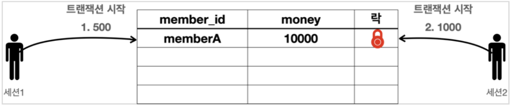<br>

- 세션1은 `memberA`의 금액을 500원으로 변경하고 싶고, 세션2는 같은 `memberA`의 금액을 1000원으로 변경하고 싶다.
- 데이터베이스는 이런 문제를 해결하기 위해 락(Lock)이라는 개념을 제공한다.
- 다음 예시를 통해 동시에 데이터를 수정하는 문제를 락으로 어떻게 해결하는지 자세히 알아보자.

### 락1
<br>

1. 세션1은 트랙잭션을 시작한다.
2. 세션1은 `memberA`의 `money`를 500으로 변경을 시도한다. 이때, 데이터를 변경하기 위해서는 해당 로우의 락을 먼저 획득해야 한다. 락이 남아 있으므로 세션1은 락을 획득한다. (세션1이 세션2보다 조금 더 빨리 요청했다.)
3. 세션1은 락을 획득했으므로 해당 로우에 update sql을 수행한다.

### 락2

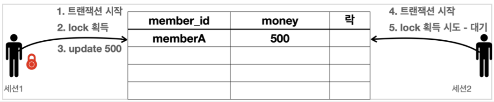<br>

1. 세션2는 트랜잭션을 시작한다
2. 세션2도 `memberA`의 `money` 데이터를 변경하려고 시도한다. 이때 해당 로우의 락을 먼저 획득해야 한다. 그런데 락이 없으므로 락이 돌아올 때까지 대기한다.

참고로 세션2가 락을 무한정 대기하는 것은 아니다. 락 대기 시간을 넘어가면 락 타임아웃 오류가 발생한다. 락 대기 시간은 설정할 수 있다.

### 락3

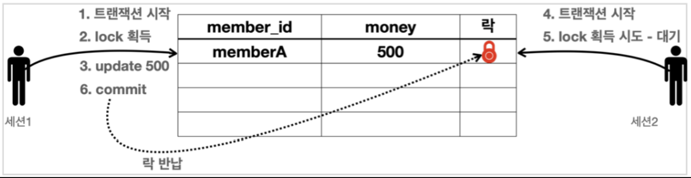<br>

1. 세션1은 커밋을 수행한다. 커밋으로 트랜잭션이 종료되었으므로 락도 반납한다.

### 락4

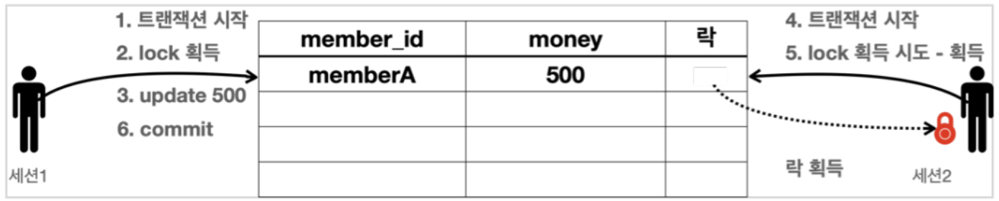<br>

락을 획득하기 위해 대기하던 세션2가 락을 획득한다.

### 락5

<br>

1. 세션2는 update sql을 수행한다.

### 락6

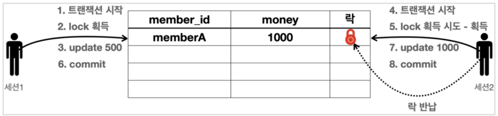<br>

1. 세션2는 커밋을 수행하고 트랜잭션이 종료되었으므로 락을 반납한다.

## DB 락 - 변경

앞서 배운 내용을 실습해보자

### 락0

<br>

기본 데이터 입력<br>
```sql
set autocommit true;
delete from member;
insert into member(member_id, money) values ('memberA', 10000);
```

### 락1

<br>

**세션 1 - 업데이트**<br>

```sql
set autocommit false;
update member set money=500 where member_id = 'memberA';
```

세션1이 트랜잭션을 시작하고, `memberA`의 데이터를 500원으로 업데이트했다. 아직 커밋은 하지 않았다. (따라서 세션1에서만 `memberA`의 돈이 500원으로 조회된다.)

`memberA`로우의 락은 세션1이 가지게 된다.

### 락2

<br>

세션2 - 수정 시도

```sql
SET LOOK_TIMEOUT 60000;
set autocommit false;
update member set money=1000 where member_id='memberA';
```

- 세션2는 `memberA`의 데이터를 1000원으로 수정하려 한다.
- 세션1이 트랜잭션을 커밋하거나 롤백해서 종료하지 않았으므로 아직 세션1이 락을 가지고 있다. 따라서 세션2는 락을 획득하지 못하기 때문에 데이터를 수정할 수 없다. 세션2는 락이 돌아올 때 까지 대기하게 된다.
- `SET LOOK_TIMEOUT 60000`: 락 획득 시간을 60초로 설정한다. 60초안에 락을 얻지 못하면 예외가 발생한다. (참고로 H2데이터 베이스에서는 딱 60초에 예외가 발생하지는 않고, 시간이 조금 더 걸릴 수 있다.)

### 락3

<br>

세션1은 커밋을 수행한다. 커밋으로 트랜잭션이 종료되었으므로 락을 반납한다.

**세션 1 - 커밋**<br>

```sql
COMMIT;
```

세션1이 커밋하면 이후에 락을 반납하고 다음 시나리오가 이어진다..

### 락5

<br>

세션2는 update sql을 정상 수행한다.

### 락6

<br>

세션2는 커밋을 수행하고 트랜잭션이 종료되었으므로 락을 반납한다.

**세션2 - 커밋**<br>
```sql
COMMIT;
```

### 세션2 락 타임아웃

- `SET LOCK_TIMEOUT`: 락 타임아웃 시간을 설정한다.
  - 예) `SET LOCK_TIMEOUT 10000` 10초, 세션2에 설정하면 세션2가 10초 동안 대기해도 락을 얻지 못하면 락 타임아웃 오류가 발생한다.
- 위 시나리오 중간에 락을 오랜기간 대기하면 어떻게 되는지 알아보자. 10초 정도 기다리면 세션2에서는 다음과 같은 락 타임아웃 오류가 발생한다.<br>

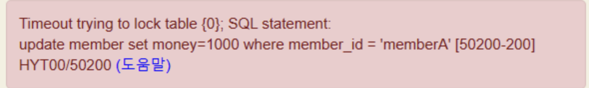<br>\

세션1이 `memberA`의 데이터를 변경하고, 트랜잭션을 아직 커밋하지 않았다. 따라서 세션2는 세션1이 트랜잭션을 커밋하거나 롤백할 때 까지 대기해야 한다. 기다리면 락 타임아웃 오류가 발생하는 것을 확인할 수 있다.

> [!TIP]
> 테스트 도중 락이 꼬이는 문제가 발생할 수 있다. 이럴 때는 H2 서버를 내렸다가 다시 올리자.

## DB 락 - 조회

### 일반적인 조회는 락을 사용하지 않는다.

데이터베이스마다 다르지만, 보통 데이터를 조회할 때는 락을 획득하지 않고 바로 데이터를 조회할 수 있다. 예를 들어서 세션1이 락을 획득하고 데이터를 변경하고 있어도, 세션2에서 데이터를 조회는 할 수 있다. 물론 세션2에서 조회가 아니라 데이터를 변경하려면 락이 필요하기 때문에 락이 돌아올 때 까지 대기해야 한다.

### 조회와 락

데이터를 조회할 때도 락을 획득하고 싶을때가 있다. 이럴 때는 select for update구문을 사용하면 된다. 이렇게 하면 세션1이 조회 시점에을 가져가버리기 때문에 다른 세션에서 해당 데이터를 변경할 수 없다. 물론 이 경우도 트랙잭션을 커밋하면 반납한다. 

### 조회 시점에 락이 필요한 경우는 언제일까?

트랜잭션 종료 시점까지 해당 데이터를 다른 곳에서 변경하지 못하도록 강제로 막아야 할 때 사용한다.<br>
예를 들어서 애플리케이션 로직에서 `memberA`의 금액을 조회한 다음에 이 금액 정보로 애플리케이션에서 어떤 계산을 수행한다. 그런데 이 계산이 돈과 관련된 매우 중요한 계산이여서 계산이 완료할 때 까지 `memberA`의 금액을 다른곳에서 변경하면 안된다. 이럴 때 조회 시점에 락을 획득하면 된다.

**확인해보자**<br>

실습을 위해 데이터를 기본 데이터를 입력하자.<br>

```sql
set autocommit true;
delete from member;
insert into member(member_id, money) values ('memberA', 10000);
```

***세션 1**<br>

```sql
set autocommit false;
select * from member where member_id='memberA' for update;
```

`select for update` 구문을 사용하면 조회를 하면서 동시에 선택한 로우의 락도 획득한다.<br>
세션1은 트랙잭션을 종료할 때 까지 `memberA`의 로우의 락을 보유한다.

**세션 2**<br>

```sql
set autocommit false;
update member set money=500 where member_id='memberA';
```

세션2는 데이터를 변경하고 싶다. 데이터를 변경하려면 락이 필요하다.<br>
세션1이 `memberA` 로우의 락을 획득했기 때문에 세션2는 락을 획득할 때 까지 대기한다.<br>
이후 세션1이 커밋을 수행하면 세션2가 락을 획득하고 데이터를 변경한다. 만약 락 타임아웃 시간이 지나면 락 타임아웃 예외가 발생한다.

> [!IMPORTANT]
> 트랜잭션과 락은 데이터베이스마다 실제 동작하는 방식이 조금씩 다르기 때문에, 해당 베이터베이스 메뉴얼을 확인해보고, 의도한대로 동작하는지 테스트한 이후에 사용하자.

## 트랜잭션 - 적용 1

## 트랜잭션 - 적용 2