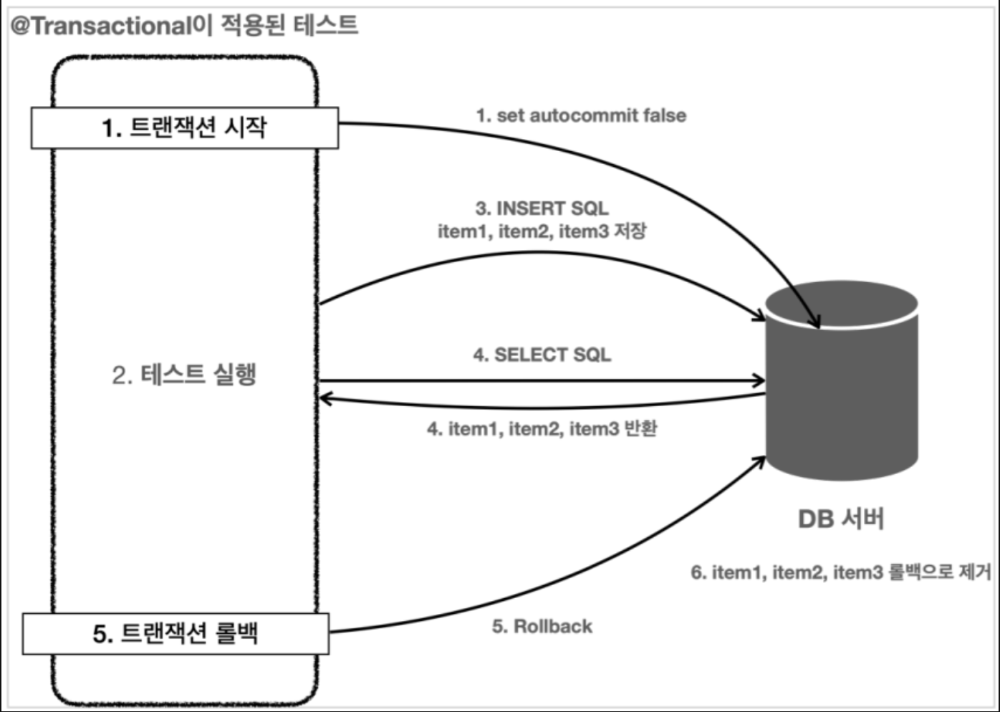
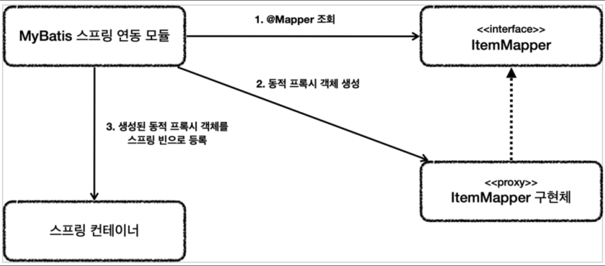
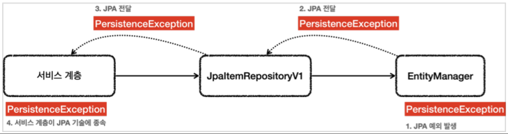
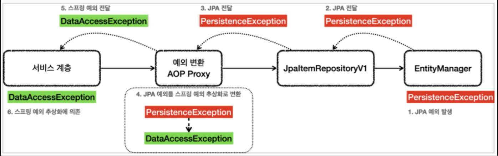
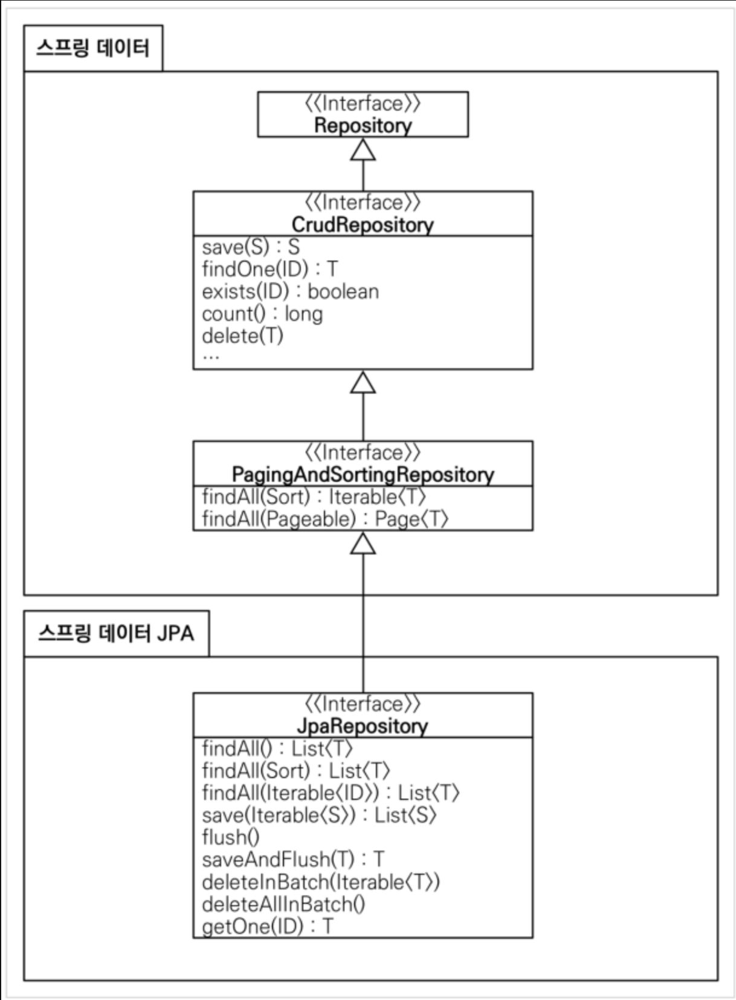
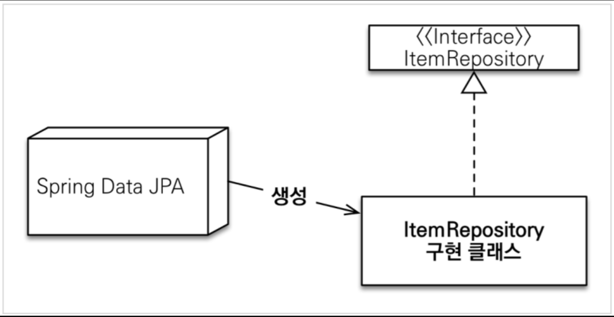
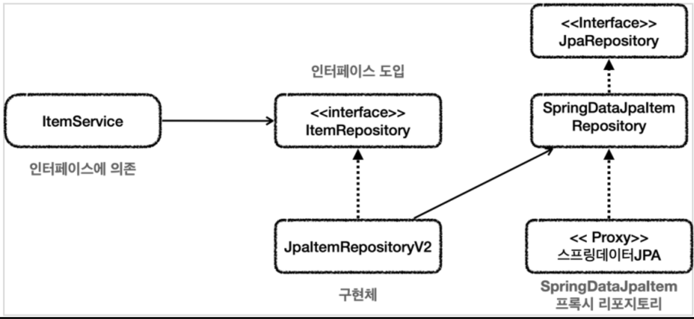
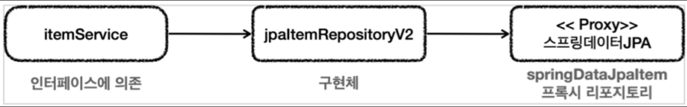

# 데이터 접근 기술 - 시작

## 데이터 접근 기술 진행 방식 소개

앞으로 실무에서 주로 사용하는 다음과 같은 다양한 데이터 접근 기술들을 학습한다.

**적용 데이터 접근 기술**

- JdbcTemplate
- MyBatis
- JPA, Hibernate
- 스프링 데이터 JPA
- Querydsl

여기에는 크게 2가지 분류가 있다.

**SQLMapper**

- JdbcTemplate
- MyBatis

**ORM 관련 기술**

- JPA, Hibernate
- 스프링 데이터 JPA
- Querydsl

**ORM 주요 기능**

- JdbcTemplate이나 MyBatis같은 SQL 매퍼 기술은 SQL을 개발자가 직접 작성해야 하지만, JPA를 사용하면 기본적으로 SQL은 JPA가 대신 작성하고 처리해준다. 개발자는 저장하고 싶은 객체를 마치 자바 컬렉션에 저장하고 조회하듯이 사용하면 ORM기술이 데이터베이스에 해당 객체를 저장하고 조회해준다.
- JPA는 자바 진영의 ORM 표준이고, HIbernate(하이버네이트)는 JPA에서 가장 많이 사용하는 구현체이다. 자바에서 ORM을 사용할 때는 JPA 인터페이스를 사용하고, 그 구현체로 하이버네이트를 사용한다고 생각하면 된다.
- 스프링 데이터 JPA, Quertdsl은 JPA를 더 편리하게 사용할 수 있게 도와주는 프로젝트이다. 실무에서는 JPA를 사용하면 이 프로젝트도 꼭! 함께 사용하는 것이 좋다.

### 학습 목표

데이터 저장 기술들은 하나하나 별도의 책이나 강의로 다루어야 할 정도로 내용이 방대하다. 특히 JPA의 경우 스프링과 학습 분량이 비슷할 정도로 공부해야 할 내용이 많다. 그래서 세세한 기능을 설명하기 보다는 주로 해당 기술이 왜 필요한지, 각 기술의 장단점은 무엇인지 설명하는데 초점을 맞춘다.

- 데이터 접근 기술에 대한 기본 예외와 전체 큰 그림을 그린다.
- 각 기술들의 핵심 기능 위주로 학습한다.
- 각 기술들을 점진적으로 도입하는 과정을 통해서 각 기술의 특징과 장단점을 자연스럽게 이해할 수 있다.

먼저 메모리 가반으로 완성되어 있는 프로젝트를 확인하고, 이 프로젝트에 데이터 접근 기술을 하나씩 추가해보자.

## 프로젝트 설정과 메모리 저장소

스프링 MVC 1에서 마지막에 완성한 상품 관리 프로젝트를 떠올려 보자. 해당 프로젝트는 단순히 메모리에 상품 데이터를 저장하도록 되어 있었다. 여기셍 메모리가 아닌 실제 데이터 접근 기술들을 하나씩 적용해가면서, 각각의 데이터 접근 기술들을 어떻게 사용하는지, 장단점은 무엇인지 코드로 이해하고 학습해보자.

MVC1편에서 개발한 상품 관리 프로젝트를 황용하자

## 프로젝트 구조 설명1 - 기본

### 도메인 분석

**item**

```java
@Data
public class Item {

    private Long id;

    private String itemName;
    private Integer price;
    private Integer quantity;

    public Item() {
    }

    public Item(String itemName, Integer price, Integer quantity) {
        this.itemName = itemName;
        this.price = price;
        this.quantity = quantity;
    }
}
```

`Item`은 상품 자체를 나타내는 객체이다. 이름, 가격, 수량을 속성으로 가지고 있다.

### 리포지토리 분석

**itemRepository 인터페이스**

```java
public interface ItemRepository {

    Item save(Item item);

    void update(Long itemId, ItemUpdateDto updateParam);

    Optional<Item> findById(Long id);

    List<Item> findAll(ItemSearchCond cond);
}
```

- 메모리 구현체에서 향후 다양한 데이터 접근 기술 구현체로 손쉽게 변경하기 위해 리포지토리에 인터페이스를 도입했다.
- 각각의 기느은 메서드 이름으로 충분히 이해가 될 것이다.
- findAll의 경우 itemSearchCond이 넘어간다. (상품명, 가격제한 검색조건으로 상품 목록을 조회해야 하기 때문이다)

**ItemSearchCond**

```java
@Data
public class ItemSearchCond {

    private String itemName;
    private Integer maxPrice;

    public ItemSearchCond() {
    }

    public ItemSearchCond(String itemName, Integer maxPrice) {
        this.itemName = itemName;
        this.maxPrice = maxPrice;
    }
}
```

- 검색 조건으로 사용된다. 검색 조건에는 상품명, 최대 가격이 있다. 참고로 상품명의 일부만 포함되어도 검색이 가능해야 한다. (`like` 검색)
- (참고) `cond` -> `condition`을 줄여서 사용했다. (이 프로젝트에서 검색 조건은 뒤에 `Cond`를 붙이도록 규칙을 정했다.)

**ItemUpdateDto**

```java
@Data
public class ItemUpdateDto {
    private String itemName;
    private Integer price;
    private Integer quantity;

    public ItemUpdateDto() {
    }

    public ItemUpdateDto(String itemName, Integer price, Integer quantity) {
        this.itemName = itemName;
        this.price = price;
        this.quantity = quantity;
    }
}
```

- 상품을 수정할 때 사용하는 객체이다
- 단순히 데이터를 전달하는 용도로 사용되므로 DTO를 뒤에 붙였다. (DTO에 대한 설명은 아래에 참고)

**MemortyItemRepository**

```java
package hello.itemservice.repository.memory;

@Repository
public class MemoryItemRepository implements ItemRepository {

    private static final Map<Long, Item> store = new HashMap<>(); //static
    private static  long sequence = 0L; //static

    @Override
    public Item save(Item item) {
        item.setId(++sequence);
        store.put(item.getId(), item);
        return item;
    }

    @Override
    public void update(Long itemId, ItemUpdateDto updateParam) {
        Item findItem = findById(itemId).orElseThrow();
        findItem.setItemName(updateParam.getItemName());
        findItem.setPrice(updateParam.getPrice());
        findItem.setQuantity(updateParam.getQuantity());
    }

    @Override
    public Optional<Item> findById(Long id) {
        return Optional.ofNullable(store.get(id));
    }

    @Override
    public List<Item> findAll(ItemSearchCond cond) {
        String itemName = cond.getItemName();
        Integer maxPrice = cond.getMaxPrice();
        return store.values().stream()
                .filter(item -> {
                    if (ObjectUtils.isEmpty(itemName)) {
                        return true;
                    }
                    return item.getItemName().contains(itemName);
                }).filter(item -> {
                    if (maxPrice == null) {
                        return true;
                    }
                    return item.getPrice() <= maxPrice;
                }).collect(Collectors.toList());
    }

    public void clearStore() {
        store.clear();
    }
}
```

- `ItemRepository`인터페이스를 구현한 메모리 저장소이다.
- 메모리이기 때문에 자바를 다시 실행하면 기존에 저장된 데이터가 모두 사라진다
- `save`, `update`, `findById`는 쉽게 이해할 수 있을 것이다. 참고로 `findById`는 `Optional`을 반환해야 하기 때문에 `Optional.ofNullable`을 사용했다.
- `findAll`은 `ItemSearchCond` 이라는 검색 조건을 받아서 내부에서 데이터를 검색하는 기능을 한다. 데이터베이스를 보면 `where` 구문을 사용해서 필요한 데이터를 필터링하는 과정을 거치는 것이다.
  - 여기서 자바 스트림을 사용한다.
  - `itemName`이나, `maxPrice`가 `null`이거나 비었으면 해당 조건을 무시한다
  - `itemName`이나, `manPrice`에 값이 있을 때만 해당 조건으로 필터링 기능을 수행한다
- `clearStroe()`는 메모리에 저장된 `Item`을 모두 삭제해서 초기화한다. 테스트 용도로만 사용한다.

### [참고] DTO (data transfer object)

- 데이터 전송 객체
- DTO는 기능은 없고 주로 데이터 잔달만 하는 용도로 사용되는 객체를 뜻한다
  - 참고로 DTO에 기능이 있으면 안되는 가? 그것은 아니다. 객체의 주 목적이 데이터를 전송하는 것이라면 DTO라 할 수 있다.
- 객체 이름에 DTO를 꼭 붙여야 하는 것은 아니다. 대신 붙여두면 용도를 명확히 알 수 있다는 장점이 있다
- 이전에 설명한 `ItemSearchCond`도 DTO역할을 하지만, 이프로젝트에서 `Cond`는 검색 조건으로 사용한다는 규칙을 정했다. 따라서 DTO를 붙이지 않아도 된다. `ItemSearchComdDto`이렇게 하면 너무 복잡해진다. 그리고 Cond라는 것만 봐도 용도를 알 수 있다.
- 참고로 이런 규칙은 정해진 것 없기 때문에 해당 프로젝트 안에서 일관성 있게 규칙을 정하면 된다.(이 프로젝트에서는 Cond는 DTO라는 범위까지 포함한다고 규칙을 정한 것.)

### 서비스 분석

**itemService 인터페이스**

```java
package hello.itemservice.service;

public interface ItemService {

    Item save(Item item);

    void update(Long itemId, ItemUpdateDto updateParam);

    Optional<Item> findById(Long id);

    List<Item> findItems(ItemSearchCond itemSearch);
}
```

- 서비스의 구현체를 쉽게 설명하기 위해 인터페이스를 사용했다
- 참고로 서비스는 구현체를 변경할 일이 많지는 않기 때문에 사실 서비스에 인터페이스를 잘 도입하지는 않는다
  - 여기서는 예제 설명 과정에서 구현체를 변경할 예정이어서 인터페이스를 도입했다.

**itemServiceV1**

```java
package hello.itemservice.service;

@Service
@RequiredArgsConstructor
public class ItemServiceV1 implements ItemService{

    private final ItemRepository itemRepository;

    @Override
    public Item save(Item item) {
        return itemRepository.save(item);
    }

    @Override
    public void update(Long itemId, ItemUpdateDto updateParam) {
        itemRepository.update(itemId, updateParam);
    }

    @Override
    public Optional<Item> findById(Long id) {
        return itemRepository.findById(id);
    }

    @Override
    public List<Item> findItems(ItemSearchCond cond) {
        return itemRepository.findAll(cond);
    }
}

```

- `ItemServiceV1`서비스 구현체는 대부분의 기능을 단순히 리포지토리에 위임한다.

### 컨트롤러 분석

**HomeController**

```java
package hello.itemservice.web;

@Controller
@RequiredArgsConstructor
public class HomeController {

    @RequestMapping("/")
    public String home() {
        return "redirect:/items";
    }
}
```

단순히 홈으로 요청이 왔을 때 `items`로 이동하는 컨트롤러이다.

**ItemController**

```java
package hello.itemservice.web;

@Controller
@RequestMapping("/items")
@RequiredArgsConstructor
public class ItemController {

    private final ItemService itemService;

    @GetMapping
    public String items(@ModelAttribute("itemSearch") ItemSearchCond itemSearch, Model model) {
        List<Item> items = itemService.findItems(itemSearch);
        model.addAttribute("items", items);
        return "items";
    }

    @GetMapping("/{itemId}")
    public String item(@PathVariable long itemId, Model model) {
        Item item = itemService.findById(itemId).get();
        model.addAttribute("item", item);
        return "item";
    }

    @GetMapping("/add")
    public String addForm() {
        return "addForm";
    }


    @PostMapping("/add")
    public String addItem(@ModelAttribute Item item, RedirectAttributes redirectAttributes) {
        Item savedItem = itemService.save(item);
        redirectAttributes.addAttribute("itemId", savedItem.getId());
        redirectAttributes.addAttribute("status", true);
        return "redirect:/items/{itemId}";
    }

    @GetMapping("/{itemId}/edit")
    public String editForm(@PathVariable Long itemId, Model model) {
        Item item = itemService.findById(itemId).get();
        model.addAttribute("item", item);
        return "editForm";
    }

    @PostMapping("{itemId}/edit")
    public String edit(@PathVariable Long itemId, @ModelAttribute ItemUpdateDto updateParam) {
        itemService.update(itemId, updateParam);
        return "redirect:/items/{itemId}";
    }
}
```

- 상품을 CRUD하는 컨트롤러이다.

## 프로젝트 구조 설명2 - 설정

**스프링 부트 설정 분석**

### MemoryConfig - 빈 수동 등록

```java
package hello.itemservice.config;

@Configuration
public class MemoryConfig {

    @Bean
    public ItemService itemService() {
        return new ItemServiceV1(itemRepository());
    }

    @Bean
    public ItemRepository itemRepository() {
        return new MemoryItemRepository();
    }
}
```

- `ItemServiceV1`, `MemoryItemRepository`를 스프링 빈으로 등록하고 생성자를 통해 의존관계를 주입한다.
- 참고로 여기서는 서비스와 리포지토리는 구현체를 편리하게 변경하기 위해, 이렇게 수동으로 빈을 등록했다.
- 컨트롤러는 컴포넌트 스캔을 사용한다.

### TestDataInit

```java
package hello.itemservice;

@Slf4j
@RequiredArgsConstructor
public class TestDataInit {

    private final ItemRepository itemRepository;

    /**
     * 확인용 초기 데이터 추가
     */
    @EventListener(ApplicationReadyEvent.class)
    public void initData() {
        log.info("test data init");
        itemRepository.save(new Item("itemA", 10000, 10));
        itemRepository.save(new Item("itemB", 20000, 20));
    }
}
```

- 애플리케이션을 실행할 때 초기 데이터를 저장한다
- 리스트에서 데이터가 잘 나오는지 편리하게 확인할 용도로 사용한다.
  - 이 기능이 없으면 서버를 실행할 때 마다 데이터를 입력해야 리스트에 나타난다.(메모리여서 서버를 내리면 데이터가 제거된다)
- `@EventListener(ApplicationReadyEvent.class)`: 스프링 컨테이너가 완전히 초기화를 다 끝내고, 실행 준비가 되었을 때 발생하는 이벤트이다. 스프링이 이 시점에서 해당 애노테이션이 붙은 `initData()`메서드를 호출해준다. (참고로 스프링에서 발생하는 이벤트이기 때문에 TestDataInit가 스프링 빈으로 등록되어 있어야 initData가 호출된다.)
  - 참고로 이 기능 대신 `@PostConstruct`를 사용할 경우 AOP 같은 부분이 아직 다 처리되지 않은 시점에 호출될 수 있기 때문에, 간혹 문제가 발생할 수 있다. 예를 들어서 `@Transactional`과 관련된 AOP가 적용되지 않은 상태로 호출될 수 있다.
  - `@EventListener(ApplicationReadyEvent.class)`는 AOP를 포함한 스프링 컨테이너가 완전히 초기화 된 이후에 호출되기 때문에 이런 문제가 발생하지 않는다.

### ItemServiceApplication

```java
package hello.itemservice;

@Import(MemoryConfig.class)
@SpringBootApplication(scanBasePackages = "hello.itemservice.web")
public class ItemServiceApplication {

	public static void main(String[] args) {
		SpringApplication.run(ItemServiceApplication.class, args);
	}

	@Bean
	@Profile("local")
	public TestDataInit testDataInit(ItemRepository itemRepository) {
		return new TestDataInit(itemRepository);
	}
}
```

- `@Import(MemoryConfig.class)`: 앞서 설정한 `MemoryConfig`를 설정 파일로 사용한다.
- `scanBasePackages = "hello.itemservice.web"`: 여기서는 컨트롤러만 컴포넌트 스캔을 사용하고, 나머지는 직접 수동 등록한다. 그래서 컴포넌트 스캔 경로를 `hello.itemservice.web`하위로 지정했다.
- `@Profile("local")`: 특정 프로필의 경우에만 해당 스프링 빈을 등록한다. 여기서는 `local`이라는 이름의 프로필이 사용되는 경우에만 `testDataInit`이라는 스프링 빈을 등록한다. 이 빈은 앞서 본 것인데, 편의상 초기 데이터를 만들어서 저장하는 빈이다.

### 프로필

스프링은 로딩 시점에 `application.properties`의 `spring.profiles.active`속성을 읽어서 프로필로 사용한다.<br>
이 프로필은 로컬(나의 PC), 운영환경, 테스트 실행 등등 다양한 환경에 따라서 다른 설정을 할 때 사용하는 정보이다.

예를 들어서 로컬PC에서는 로컬 PC에 설치된 데이터베이스에 접근해야 하고, 운영 환경에서는 운영 데이터베이스에 접근해야 한다면 서로 설정 정보가 달라야 한다. 심지어 환경에 따라서 다른 스프링 빈을 등록해야 할 수 도 있다. 프로필을 사용하면 이런 문제를 깔끔하게 해결할 수 있다.

#### main 프로필

`application.properties`<br>
```properties
spring.profiles.active=local
```

`application.properties`는 `/src/main`하위의 자바 객체를 실행할 때 (주로 `main()`)동작하는 스프링 설정이다. `spring.profiles.active=local`이라고 하면 스프링은 `local`이라는 프로필로 동작한다. 따라서 직전에 설정한 `	@Profile("local")`가 동작하고, `testDataInit`가 스프링 빈으로 등록된다.

#### test 프로필

```properties
spring.profiles.active=test
```

- 주로 테스트 케이스를 실행할 때 동작한다.
- `spring.profiles.active=test`로 설정하면 `test`라는 프로필로 동작한다. 이 경우 직전에 설명한 `@Profile("local")`는 프로필 정보가 맞지 않아서 동작하지 않는다. 따라서 `testDataInit`이라는 스프링 빈도 등록되지 않고, 초기 데이터도 추가하지 않는다.

프로필 기능을 사용해서 스프링으로 웹 애플리케이션을 로컬(`local`)에서 직접 실행할 때는 `testDataInit`이 스프링 빈으로 등록된다. 따라서 등록한 초기화 데이터를 편리하게 확인할 수 있다. 초기화 데이터 덕분에 편리한 점도 있지만, 테스트 케이스를 실행할 때는 문제가 될 수 있다. 테스트에서 이런 데이터가 들어있다면 오류가 발생할 수 있다. 예를 들어서 데이터를 하나 저장하고 전체 카운트를 확인하는데 1이 아니라 `testDataInit`때문에 데이터가 2건 추가되어서 3이 되는 것이다. 프로필 덕분에 테스트 케이스에서는 `test`프로필이 실행된다. 따라서 `TestDataInit`는 스프링 빈으로 추가되지 않고, 따라서 초기 데이터도 추가되지 않는다.

> [!TIP]
> 프로필에 대한 스프링 부트 공식 메뉴얼은 다음을 참고하자. (https://docs.spring.io/spring-boot/docs/current/reference/html/features.html#features.profiles)

## 프로젝트 구조 설명3 - 테스트

### ItemRepositoryTest

```java
package hello.itemservice.repository;

@SpringBootTest
class ItemRepositoryTest {

    @Autowired
    ItemRepository itemRepository;

    @AfterEach
    void afterEach() {
        //MemoryItemRepository의 경우 제한적으로 사용
        if (itemRepository instanceof MemoryItemRepository) {
            ((MemoryItemRepository) itemRepository).clearStore();
        }
    }

    @Test
    void save() {
        //given
        Item item = new Item("itemA", 10000, 10);

        // when
        Item savedItem = itemRepository.save(item);

        // then
        Item findItem = itemRepository.findById(item.getId()).get();
        assertThat(findItem).isEqualTo(savedItem);
    }

    @Test
    void updateItem() {
        //given
        Item item = new Item("item1", 10000, 10);
        Item savedItem = itemRepository.save(item);
        Long iteId = savedItem.getId();

        //when
        ItemUpdateDto updateParam = new ItemUpdateDto("item2", 20000, 30);
        itemRepository.update(iteId, updateParam);

        //then
        Item findItem = itemRepository.findById(iteId).get();
        assertThat(findItem.getItemName()).isEqualTo(updateParam.getItemName());
        assertThat(findItem.getPrice()).isEqualTo(updateParam.getPrice());
        assertThat(findItem.getQuantity()).isEqualTo(updateParam.getQuantity());
    }

    @Test
    void findItems() {
        //given
        Item item1 = new Item("itemA-1", 10000, 10);
        Item item2 = new Item("itemA-2", 20000, 20);
        Item item3 = new Item("itemB-1", 30000, 30);

        itemRepository.save(item1);
        itemRepository.save(item2);
        itemRepository.save(item3);

        //둘 다 없음 검증
        test(null, null, item1, item2, item3);
        test("", null, item1, item2, item3);

        //itemName 검증
        test("itemA", null, item1, item2);
        test("temA", null, item1, item2);
        test("itemB", null, item3);

        //maxPrice 검증
        test(null, 10000, item1);

        // 둘 다 있음 검증
        test("itemA", 10000, item1);
    }

    void test(String itemName, Integer maxPrice, Item... items) {
        List<Item> result = itemRepository.findAll(new ItemSearchCond(itemName, maxPrice));
        assertThat(result).containsExactly(items);
    }
}
```

- `afterEach`: 테스트는 서로 영향을 주면 안된다. 따라서 각각의 테스트가 끝나고 나면 저장한 데이터를 제거해야 한다. `@AfterEach`는 각각의 테스트의 실행이 끝나는 시점에 호출된다. 여기서는 메모리 저장소를 완전히 삭제해서 다음 테스트에 영향을 주지 않도록 초기화 한다.
- 인터페이스에는 `clearStore()`가 없기 때문에 `MemoryItemRepository`인 경우에만 다운 케스팅을 해서 데이터를 초기화한다. 뒤에서 학습하겠지만, 실제 DB를 사용하는 경우에만 테스트가 끝난 후에 트랜잭션을 롤백해서 데이터를 초기화 할 수 있다.
- `save()`: 상품을 하나 저장하고 잘 저장되었는지 검증한다
- `updateItem()`: 상품을 하나 수정하고 잘 수정되었는지 검증한다.
- `findItems()`: 상품을 찾는 테스트이다.
  - 상품명과 상품 가격 조건을 다양하게 비교하는 것을 확인할 수 있다.
  - 문자의 경우 `null`조건도 있지만, 빈 문자(`""`)의 경우에도 잘 동작하는지 검증한다.

> [!NOTE]
> 인터페이스를 테스트하자. 여기서는 `MemoryItemRepository`구현체를 테스트 하는 것이 아니라 `ItemRepository`인터페이스를 테스트하는 것을 확인할 수 있다. 인터페이스를 대상으로 테스트하면 향후 다른 구현체로 변경되었을 때 해당 구현체가 잘 동작하는지 같은 테스트로 편리하게 검증할 수 있다.

## 데이터베이스 테이블 생성

이제부터 다양한 데이터 접근 기술들을 활용해서 메모리가 아닌 데이터베이스에 데이터를 보관하는 방밥을 알아보자

먼저 H2데이터베이스에 접근해서 item 테이블을 생성하자.

```sql
drop table if exists item CASCADE;
create table item
{
    id          brigint generated by default as identity,
    item_name   varchar(10),
    price       integer,
    quantity    integer,
    primary key (id)
};
```

- `generated by default as identity`
  - `identity`전략이라고 하는데, 기본 키 생성을 데이터베이스에 위임하는 방법이다. MySQL의 Auto increment와 같은 방법이다.
  - 여기서 PK로 사용되는 id는 개발자가 직접 지정하는 것이 아니라 비워두고 저장하면 된다. 그러면 데이터베이스가 순서대로 증가하는 값을 사용해서 넣어준다.

테이블을 생성했으면 잘 동작하는지 다음 SQL을 실행해보자

```sql
insert into item(item_name, price, quantity) values ('itemTest', 10000, 10);
select * from item;
```

### 참고 - 권장하는 식벽자 선택 전략

- 데이터베이스 기본 키는 다음 3가지 조건을 모두 만족해야 한다.
  - `null`값은 허용하지 않는다.
  - 유일해야 한다.
  - 변해선 안 된다.
  
- 테이블의 기본 키를 선택하는 전략은 크게 2가지가 있다
  - 자연 키 (natural key)
    - 비즈니스에 의미가 있는 키
    - 예: 주민등록번호, 이메일, 전화번호
  - 대리 키(surrogate key)
    - 비즈니스와 관련 없는 임의로 만들어진 키, 대체 키로도 불린다,
    - 예: 오라클 시퀀스, auto_increment, identity, 키생성 테이블 사용

**자연 키 보다는 대리 키를 권장한다**

자연키와 대리키는 일장일단이 있지만 될 수 이씅면 대리 키의 사용을 권장한다. 예를 들어 자연 키의 전화번호를 기본 키로 선택한다면 그 번호가 유일할 수는 있지만, 전화번호가 없을 수도 있고 전화번호가 변경될 수도 있다. 따라서 기본 키로 적당하지 않다. 문제는 주민등록번호처럼 그럴듯하게 보이는 값이다. 이 값은 `null`이 아니고 유일하며 변하지 않는다는 3가지 조건을 모두 만족하는 것 같다. 하지만 현실과 비즈니스 규칙은 생각보다 쉽게 변한다. 주민등록번호 조차도 여러가지 이유로 변경 될 수 있다.

**비즈니스 환경은 언젠가 변한다**

기본 키의 조건을 현재는 물론이고 미래까지 충족하는 자연 키를 찾기는 쉽지 않다. 대리 키는 비즈니스와 무관한 임의의 값이므롬 요구사항이 변경되어도 기본 키가 변경되는 일은 드물다. 대리 키를 기본 키로 사용하되 주민등록번호나 이메일처럼 자연 키의 후보가 되는 컬럼들은 필요에 따라 유니크 인덱스를 설정해서 사용하는 것을 권장한다.<br>참고로 JPA는 모든 엔티티에 일관된 방식으로 대리 키 사용을 권장한다. 비즈니스 요구사항은 계속해서 변하는데 테이블은 한 번 정의하면 변경하기 어렵다. 그러면에서 외부 풍파에 쉽게 흔들리지 않는 대리 키가 일반적으로 좋은 선택이라 생각한다.

# 데이터 접근 기술 - 스프링 JdbcTemplate

## JdbcTemplate 소개와 설정

SQL을 직접 사용하는 경우에 스프링이 제공하는 JdbcTemplate은 아주 좋은 선택지다.<br>JdbcTemplate은 JDBC를 매우 편리하게 사용할 수 있게 도와준다.

**장점**

- 설정의 편리함
  - JdbcTemplate은 `spring-jdbc`라이브러리에 포함되어 있는데, 이 라이브러리는 스프링으로 JDBC를 사용할 때 기본으로 사용하는 라이브러리이다. 그리고 별도의 복잡한 설정 없이 바로 사용할 수 있다
- 반복 문제 해결
  - JdbcTemplate은 템플릿 콜백 패턴을 사용해서, JDBC를 직접 사용할 때 발생하는 대부분의 반복 잡업을 대신 처리해준다
  - 개발자는 SQL을 작성하고, 전달할 파라미터를 정의하고, 응답 값을 매핑하기만 하면 된다.
  - 우리가 생각할 수 있는 대부분의 반복 작업을 대신 처리해준다.
    - 커넥션 획득
    - `statement`를 준비하고 실행
    - 결과를 반복해도록 루프를 실행
    - 커넥션 종료, `statement`, `resultset`종료
    - 트랜잭션 다루기 위한 커넥션 동기화
    - 예외 발생시 스프링 예외 변환기 실행

**단점**

- 동적 SQL을 해결하기 어렵다.

직접 JdbcTemplate을 설정하고 적용하면서 이해해보자.

### JdbcTemplate 설정

`build.gradle`추가

```gradle
//JdbcTemplate추가
implementation 'org.springframework.boot:spring-boot-starter-jdbc'
//H2 데이터베이스 추가
runtimeOnly 'com.h2database:h2'
```

- `org.springframework.boot:spring-boot-starter-jdbc`를 추가하면 JdbcTemplate이 들어있는 `spring-jdbc`가 라이브러리에 포함된다. (= JdbcTemplate은 `spring-jdbc`라이브러리만 추가하면 된다. 별도의 추가 설정 과정은 없다.)
- 여기서는 H2 데이터베이스에 접속해야 하기 때문에 H2 데이터베이스의 클라이언트 라이브러리(Jdbc Driver)도 추가하자. (`runtimeOnly 'com.h2database:h2'`)

## JdbcTemplate 적용1 - 기본

이제부터 본격적으로 JdbcTemplate을 사용해서 메모리에 저장하던 데이터를 데이터베이스에 저장해보자.

`ItemRepository` 인터페이스가 있으니 이 인터페이스를 기반으로 JdbcTemplate을 사용하는 새로운 구현체를 개발하자.

### JdbcTemplateItemRepositoryV1

```java
package hello.itemservice.repository;

/**
 * JdbcTemplate
 */
@Slf4j
public class JdbcTemplateItemRepositoryV1  implements ItemRepository{

    private final JdbcTemplate template;

    public JdbcTemplateItemRepositoryV1(DataSource dataSource) {
        this.template = new JdbcTemplate(dataSource);
    }

    @Override
    public Item save(Item item) {
        String sql = "insert into item(item_name, price, quantity) values(?, ?, ?)";
        KeyHolder keyHolder = new GeneratedKeyHolder();
        template.update(connection -> {
            //자동 증가 키
            PreparedStatement ps = connection.prepareStatement(sql, new String[]{"id"});
            ps.setString(1, item.getItemName());
            ps.setInt(2, item.getPrice());
            ps.setInt(3, item.getQuantity());
            return ps;
        }, keyHolder);

        long key = keyHolder.getKey().longValue();
        item.setId(key);

        return item;
    }


    @Override
    public void update(Long itemId, ItemUpdateDto updateParam) {
        String sql = "update item set item_name=?, price=?, quantity=? where id = ?";
        template.update(sql,
                updateParam.getItemName(),
                updateParam.getPrice(),
                updateParam.getQuantity(),
                itemId
        );
    }


    @Override
    public Optional<Item> findById(Long id) {
        String sql = "select id, item_name, price, quantity from item where id = ?";
        try {
            Item item = template.queryForObject(sql, itemRowMapper(), id);
            return Optional.of(item);
        } catch (EmptyResultDataAccessException e) {
            return Optional.empty();
        }
    }


    @Override
    public List<Item> findAll(ItemSearchCond cond) {
        String itemName = cond.getItemName();
        Integer maxPrice = cond.getMaxPrice();

        String sql = "select id, item_name, price, quantity from item";
        //동적 쿼리

        if (StringUtils.hasText(itemName) || maxPrice != null) {
            sql += " where";
        }

        boolean andFlag = false;
        List<Object> param = new ArrayList<>();
        if (StringUtils.hasText(itemName)) {
            sql += " item_name like concat('%',?,'%')";
            param.add(itemName);
            andFlag = true;
        }
        if (maxPrice != null) {
            if (andFlag) {
                sql += " and";
            }
            sql += "price <= ?";
            param.add(maxPrice);
        }

        log.info("sql={}", sql);
        return template.query(sql, itemRowMapper(), param.toArray());
    }

    private RowMapper<Item> itemRowMapper() {
        return ((rs, rownNum) -> {
            Item item = new Item();
            item.setId(rs.getLong("id"));
            item.setItemName(rs.getString("item_name"));
            item.setPrice(rs.getInt("price"));
            item.setQuantity(rs.getInt("quantity"));
            return item;
        });
    }
}
```

### 코드분석

- **기본**
  - `JdbcTemplateItemRepositoryV1`은 `ItemRepository`인터페이스를 구현했다.
  - `this.template = new JdbcTemplate(dataSource)`
    - `JdbcTemplate`은 데이터소스(`dataSource`)가 필요하다.
    - `JdbcTemplateItemRepositoryV1()`생성자를 보면 `dataSource`를 의존 관계 주입 받고 생성자 내부에서 `JdbcTemplate`을 생성한다. 스프링에서는 `JdbcTemplate`을 사용할 때 관례상 이 방법을 많이 사용한다.
    - 물론 `JdbcTemplate`을 스프링 빈으로 직접 등록하고 주입받아도 된다.
- **save()**
  - 데이터를 저장한다
  - `template.update()`: 데이터를 변경할 때는 `update()`를 사용하면 된다. (여기서 말하는 변경이라는 것은 insert, update, delete를 모두 포함한다.)
    - `INSERT`, `UPDATE`, `DELETE` SQL에 사용한다.
    - `template.update()`의 반환 값은 `int`인데, 영향받은 로우 수를 반환한다.
  - 데이터를 저장할 때 PK생성에 `identity` (auto increment)방식을 사용하기 때문에, PK인 ID값을 개발자가 직접 지정하는 것이 아니라 비워두고 저장해야 한다. 그러면 데이터베이스가 PK인 ID를 대신 생성해준다.
  - 문제는 이렇게 데이터베이스가 대신 생성해주는 PK ID값은 데이터베이스가 생성하기 때문에, 데이터베이스에 INSERT가 완료되어야 생성된 PK ID값을 확인할 수 있다.
  - `KeyHolder`와 `connection.prepareStatement(sql, new String[]{"id"})`를 사용해서 `id`를 지정해주면 `INSERT`쿼리 실행 이후에 데이터베이스에 생성된 ID값을 조회할 수 있다.
  - 물론 데이터베이스에서 생성된 ID값을 조회하는 것은 순수 JDBC로도 가능하지만, 코드가 훨씬 더 복잡하다
  - 참고로 뒤에서 설명하겠지만 JdbcTemplate이 제공하는 `SimpleJdbcInsert`라는 훨씬 편리한 기능이 있으므로 대략 이렇게 사용한다 정도로만 알아두면 된다.
- **update()**
  - 데이터를 업데이트 한다.
  - `template.update()`: 데이터를 변경할 때는 `update()`를 사용하면 된다.
    - 쿼리 `?`에 바인딩할 파라미터를 순서대로 전달하면 된다.
    - 반환 값은 해당 쿼리의 영향을 받은 로우 수이다. 여기서는 `where id = ?`를 지정했기 때문에 영향 받은 로우수는 최대 1개이다.
- **findById()**
  - 데이터를 하나 조회한다
  - `template.quertyForObject()`
    - 결과 로우가 하나일 때 사용한다
    - `RowMapper`는 데이터베이스의 반환 결과인 `ResultSet`을 객체로 변환한다
    - 결과가 없으면 `EmptyResultDataAccessException`예외가 발생한다.
    - 결과가 둘 이상이면 `IncorrectResultSizeDataAccessException`예외가 발생한다.
  - `ItemRepository.findById()`인터페이스는 결과가 없을 때 `Optional`을 반환해야 한다. 따라서 결과가 없으면 예외를 잡아서 `Optional.empty`를 대신 반환하면 된다.
- **findAll()**
  - 데이터를 리스트로 조회한다. 그리고 검색 조건으로 적절한 데이터를 찾는다.
  - `template.query()`
    - 결과가 하나 이상일 때 사용한다.
    - `RowMapper`는 데이터베이스의 반환 결과인 `ResultSet`을 객체로 변환한다.
    - 결과가 없으면 빈 컬렉션을 반환한다.
    - 동적 쿼리에 대한 부분은 바로 다음에 다룬다
- **itemRowMapper()**
  - 데이터베이스의 조회 결과를 객체로 변환할 때 사용한다.
  - JDBC를 직접 사용할 때 `ResultSet`을 사용했던 부분을 떠올리면 된다. 차이가 있다면, JdbcTemplate이 다음과 같은 루프를 대신 돌려주고, 개발자는 `RowMapper`를 구현해서 그 내부 코드만 채운다고 이해하면 된다.

## JdbcTemplate 적용2 - 동적 쿼리 문제

결과를 검색하는 `findAll()`을 보자.<br>여기서 어려운 부분은 사용자가 검색하는 값에 따라서 실행하는 SQL이 동적으로 달라져야 한다는 점이다.

예를 들어서 다음과 같다

- 검색 조건이 없는 경우
  - `select id, item_name, price, quantity from item`
- 상품명(`itemName`)으로 검색한 경우
  - `select id, item_name, price, quantity from item where item_name like concat ('%',?,'%')`
- 최대 가격(`maxPrice`)으로 검색한 경우
  - `select id, item_name, price, quantity from item where price <= ?`
- 상품명 (`itemName`), 최대 가격(`maxPrice`)둘 다 검색한 경우
  - `select id, item_name, price, quantity from item where item_name like concat('%',?,'%') and price <= ?`

결과적으로 4가지 상황에 따른 SQL을 동적으로 생성해야 한다.<br>동적 쿼리가 언듯 보면 쉬워 보이지만, 막상 개발해보면 생각보다 다양한 상황을 고민해야 한다. 예를 들어서 어떤 경우에는 `where`를 앞에 넣고 어떤 경우에는 `and`를 넣어야 하는지 등을 모두 계산해야 한다. 그리고 각 상황에 맞추어 파라미터도 생성해댜 한다. 물론 실무에서는 이보다 훨씬 더 복잡한 동적 쿼리들이 사용된다.

참고로 이후에 설명할 MyBatis의 가장 큰 장점은 SQL을 직접 작성할 때 동적 쿼리를 쉽게 작성할 수 있다는 점이다.

## JdbcTemplate 적용3 - 구성과 실행

실제 코드가 동작하도록 구성하고 실행해보자

### JdbcTemplateV1Config 생성

```java
package hello.itemservice.config;

@Configuration
@RequiredArgsConstructor
public class JdbcTemplateV1Config {

    private final DataSource dataSource;

    @Bean
    public ItemService itemService() {
        return new ItemServiceV1(itemRepository());
    }

    @Bean
    public ItemRepository itemRepository() {
        return new JdbcTemplateItemRepositoryV1(dataSource);
    }
}
```

- `ItemRepository`구현체로 `JdbcTemplateItemRepositoryV1`이 사용되도록 했다. 이제 메모리 저장소가 아니라 실제 DB에 연결하는 JdbcTemplate이 사용된다.

### ItemServiceApplication - 변경

```java
package hello.itemservice;

//@Import(MemoryConfig.class)
@Import(JdbcTemplateV1Config.class)
@SpringBootApplication(scanBasePackages = "hello.itemservice.web")
public class ItemServiceApplication {

	public static void main(String[] args) {
		SpringApplication.run(ItemServiceApplication.class, args);
	}

	@Bean
	@Profile("local")
	public TestDataInit testDataInit(ItemRepository itemRepository) {
		return new TestDataInit(itemRepository);
	}
}
```

### 데이터베이스 접근 설정


```properties
spring.profiles.active=local
spring.datasource.url=jdbc:h2:tcp://localhost/~/test
spring.datasource.username=sa
spring.datasource.password=
```

- 이렇게 설정만 하면 스프링 부트가 해당 설정을 사용해서 커넥션 풀과 `DataSource`, 트랜잭션 매니저를 스프링 빈으로 자동 등록한다.

### 실행

- 실행해보면 잘 동작한는 것을 확인할 수 있다. 그리고 DB에 실제 데이터가 저장되는 것도 확인할 수 있다
- 참고로 서버를 다시 시작할 때 마다 `TestDataInit`이 실행되기 때문에 `itemA`, `itemB`도 데이터베이스에 계속 추가된다. 메모리와 다르게 서버가 내려가도 데이터베이스는 유지되기 때문이다

### 로그추가

JdbcTemplate이 실행하는 SQL로그를 확인하려면 `application.properties`에 다음을 추가하면 된다. `main`, `test`설정이 분리되어 있기 때문에 둘다 확인하려면 두 곳에 모두 추가해야 한다

```properties
#jdbcTemplate sql log
logging.level.org.springframework.jdbc=debug
```

## JdbcTemplate - 이름 지정 파라미터1

### 순서대로 바인딩

JdbcTemplate을 기본으로 사용하면 파라미터를 순서대로 바인딩 한다.<br>예를 들어서 다음 코드를 보자

```java
@Override
public void update(Long itemId, ItemUpdateDto updateParam) {
    String sql = "update item set item_name=?, price=?, quantity=? where id = ?";
    template.update(sql,
            updateParam.getItemName(),
            updateParam.getPrice(),
            updateParam.getQuantity(),
            itemId
    );
}
```

여기서는 `itemName`, `price`, `quantity`가 SQL에 있는 `?`에 순서대로 바인딩 된다. 따라서 순서만 잘 지키면 문제가 될 것은 없다. 그런데 문제는 변경시점에 발생한다.

누군가 다음과 같이 SQL 코드의 순서를 변경했다고 가정해보자. (`price`와 `quantity`의 순서를 변경했다.)

```java
@Override
public void update(Long itemId, ItemUpdateDto updateParam) {
    String sql = "update item set item_name=?, quantity=?, price=? where id = ?";
    template.update(sql,
            updateParam.getItemName(),
            updateParam.getPrice(),
            updateParam.getQuantity(),
            itemId
    );
}
```

이렇게 되면 다음과 같은 순서로 데이터가 바인딩 된다.<br>`item_name=itemName, quantity=price, price=quantity`

결과적으로 `price`와 `quantity`가 바뀌는 매우 심각한 문제가 발생한다. 이럴일이 없을 것 같지만, 실무에서는 파라미터가 10~20개가 넘어가는 일도 아주 많다. 그래서 미래에 필드를 추가하거나, 수정하면서 이런 문제가 충분히 발생할 수 있다.

버그 중에서 가장 고치기 힘든 버그는 데이터베이스에 데이터가 잘못 들어가는 버그다. 이것은 코드만 고치는 수준이 아니라 데이터베이스의 데이터를 복구해야 하기 때문에 버그를 해결하는데 들어가는 리소스가 어마어마하다.

**개발을 할 때는 코드를 몇줄 줄이는 편리함도 중요하지만, 모호함도 제거해서 코드를 명확하게 만드는 것이 유지보수 관점에서 매우 중요하다.**

이처럼 파라미터를 순서대로 바인딩하는 것은 편리하기는 하지만, 순서가 맞지 않아서 버그가 발생할 수도 있으므로 주의해서 사용해야 한다.

### 이름 지정 바인딩

JdbcTemplate는 이런 문제를 보완하기 위해 `NamedParameterJdbcTemplate`라는 (순서가 이닌) 이름을 지정해서 파라미터를 바인딩하는 기능을 제공한다.

지금부터 코드로 알아보자.

#### JdbcTemplateItemRepositoryV2 생성

```java
package hello.itemservice.repository;

/**
 * NamedParameterJdbcTemplate
 */
@Slf4j
public class JdbcTemplateItemRepositoryV2 implements ItemRepository{

    private final NamedParameterJdbcTemplate template;

    public JdbcTemplateItemRepositoryV2(DataSource dataSource) {
        this.template = new NamedParameterJdbcTemplate(dataSource);
    }

    @Override
    public Item save(Item item) {
        String sql = "insert into item(item_name, price, quantity) " +
                "values(:itemName, :price, :quantity)";

        SqlParameterSource param = new BeanPropertySqlParameterSource(item);
        KeyHolder keyHolder = new GeneratedKeyHolder();
        template.update(sql, param, keyHolder);

        long key = keyHolder.getKey().longValue();
        item.setId(key);

        return item;
    }


    @Override
    public void update(Long itemId, ItemUpdateDto updateParam) {
        String sql = "update item " +
                "set item_name=:itemName, price=:price, quantity=:quantity " +
                "where id =:id";

        SqlParameterSource param = new MapSqlParameterSource()
                .addValue("itemName", updateParam.getItemName())
                .addValue("price", updateParam.getPrice())
                .addValue("quantity", updateParam.getQuantity())
                .addValue("id", itemId);

        template.update(sql, param);
    }


    @Override
    public Optional<Item> findById(Long id) {
        String sql = "select id, item_name, price, quantity from item where id = :id";
        try {
            Map<String, Object> param = Map.of("id", id);
            Item item = template.queryForObject(sql, param, itemRowMapper());
            return Optional.of(item);
        } catch (EmptyResultDataAccessException e) {
            return Optional.empty();
        }
    }

    @Override
    public List<Item> findAll(ItemSearchCond cond) {
        String itemName = cond.getItemName();
        Integer maxPrice = cond.getMaxPrice();

        SqlParameterSource param = new BeanPropertySqlParameterSource(cond);

        String sql = "select id, item_name, price, quantity from item";

        //동적 쿼리
        if (StringUtils.hasText(itemName) || maxPrice != null) {
            sql += " where";
        }

        boolean andFlag = false;

        if (StringUtils.hasText(itemName)) {
            sql += " item_name like concat('%',:itemName,'%')";
            andFlag = true;
        }
        if (maxPrice != null) {
            if (andFlag) {
                sql += " and";
            }
            sql += "price <= :maxPrice";
        }

        log.info("sql={}", sql);
        return template.query(sql, param, itemRowMapper());
    }

    private RowMapper<Item> itemRowMapper() {
        return BeanPropertyRowMapper.newInstance(Item.class);
    }
}
```

#### 코드 분석

- **기본**
  - `JdbcTemplateItemRepositoryV2`는 `ItemRepository`인터페이스를 구현했다.
  - `this.template = new NamedParameterJdbcTemplate(dataSource)`
    - `NamedParameterJdbcTemplate`도 내부에 `dataSource`가 필요하다.
    - `JdbcTemplateItemRepositoryV2` 생성자를 보면 의존관계 주입은 `dataSource`를 받고 내부에서 `NamedParameterJdbcTemplate`을 생성해서 가지고 있다. 스프링에서는 `JdbcTemplate`관련 기능을 사용할때 관례상 이 방법을 많이 사용한다.
  - 물론 `NamedParameterJdbcTemplate`을 스프링 빈으로 직접 등록하고 주입받아도 된다.
- **save()**
  - SQL에서 `?`대신에 `:파라미터이름`을 받는 것을 확인할 수 있다.
  - 추가로 `NamedParameterJdbcTemplate`은 데이터베이스가 생성해주는 키를 매우 쉽게 조회하는 기능도 제공해준다.

## JdbcTemplate - 이름 지정 파라미터2

### 이름 지정 파라미터

파라미터를 전달하려면 `Map`처럼 `key`, `value`데이터 구조를 만들어서 전달해야 한다.<br>여기서 `key`는 `:파라미터이름`으로 지정한, 파라미터의 이름이고, `value`는 해당 파라미터의 값이 된다.

다음 코드를 보면 이렇게 만든 파라미터(`param`)를 전달하는 것을 확인할 수 있다.
- `template.update(sql, param, keyHolder);`
- `template.update(wql, param);`

이름 지정 바인딩에서 자주 사용하는 파라미터 종류는 크게 3가지가 있다.

- `Map`
- `SqlParameterSource`
  - `MapSqlParameterSource`
  - `BeanPropertySqlParameterSource`

#### Map

단순히 `Map`을 사용한다. `findById()`코드에서 확인할 수 있다.

```java
String sql = "select id, item_name, price, quantity from item where id = :id";
        
Map<String, Object> param = Map.of("id", id);
Item item = template.queryForObject(sql, param, itemRowMapper());
```

#### MapSqlParameterSource

- `SqlParameterSource`인터페이스의 구현체이다.
- `Map`과 유사한데, SQL 타입을 지정할 수 있는 등 SQL에 좀 더 특화된 기능을 제공한다.
- `MapSqlParameterSource`는 메서드 체인을 통해 편리한 사용법도 제공한다.(`ex>/addValue(...).addValue(...).addValue(...)...`)
- `update()`코드에서 확인할 수 있다.

```java
SqlParameterSource param = new MapSqlParameterSource()
        .addValue("itemName", updateParam.getItemName())
        .addValue("price", updateParam.getPrice())
        .addValue("quantity", updateParam.getQuantity())
        .addValue("id", itemId);

template.update(sql, param);
```

### BeanPropertySqlParameterSource

- `SqlParameterSource`인터페이스의 구현체이다.
- 자바빈 프로퍼티 규약을 통해서 자동으로 파라미터 객체를 생성한다. (예: `getXxx() -> xxx, getItemName() -> itemName`)
- 예를 들어서 `getItemName()`, `getPrice()`가 있으면 다음과 같은 데이터를 자동으로 만들어낸다
  - `key=itemName, value=상품명 값`
  - `key=price, value=가격 값`
- `save()`, `findAll()`코드에서 확인할 수 있다.

```java
SqlParameterSource param = new BeanPropertySqlParameterSource(item);
KeyHolder keyHolder = new GeneratedKeyHolder();
template.update(sql, param, keyHolder);
```

- 여기서 보면 `BeanPropertySqlParameterSource`가 많은 것을 자동화 해주기 때문에 가장 좋아보이지만, `BeanPropertySqlParameterSource`를 항상 사용할 수 있는 것은 아니다.
- 예를 들어서 `update()`에서는 SQL에 `:id`를 바인딩 해야 하는데, `update()`에서 사용하는 `ItemUpdateDto`에는 `itemId`가 없다. 따라서 `BeanPropertySqlParameterSource`를 사용할 수 없고, 대신에 `MapSqlParameterSource`를 사용했다.

#### BeanPropertyRowMapper

참고로 이번 코드에서 `JdbcTemplateItemRepositoryV1`과 비교해서 변화된 부분이 하나 더 있다. 바로 `BeanPropertyRowMapper`를 사용한 것이다.

JdbcTemplateItemRepositoryV1-itemRowMapper()

```java
private RowMapper<Item> itemRowMapper() {
    return ((rs, rownNum) -> {
        Item item = new Item();
        item.setId(rs.getLong("id"));
        item.setItemName(rs.getString("item_name"));
        item.setPrice(rs.getInt("price"));
        item.setQuantity(rs.getInt("quantity"));
        return item;
    });
}
```

JdbcTemplateItemRepositoryV2-itemRowMapper()

```java
private RowMapper<Item> itemRowMapper() {
    return BeanPropertyRowMapper.newInstance(Item.class);
}
```

`BeanPropertyRowMapper`는 `ResultSet`의 결과를 받아서 자바빈 규약에 맞추어 데이터를 변환한다. 예를 들어서 데이터베이스에서 조회한 결과가 `select id, price`라고 하면 다음과 같은 코드를 작성해준다.(실제로는 내부에서 리플렉션 같은 기능을 사용한다.)

```java
Item item = new Item();
item.setId(rs.getLong("id"));
item.setPrice(rs.getInt("price"));
```

데이터베이스에서 조회한 결과 이름을 기반으로 `setid()`, `setPrice()`처럼 자바빈 프로퍼티 규약에 맞춘 메서드를 호출하는 것이다.

### 별칭

그런데 `select item_name`의 경우 `setItem_name()`이라는 메서드가 없기 때문에 골치가 아프다. 이런 경우 개발자가 조회 SQL을 다음과 같이 고치면 된다. `select item_name as itemName` 별칭 `as`을 사용해서 SQL 조회 결과의 이름을 변경하는 것이다. 실제로 이 방법은 자주 사용된다. 특히 데이터베이스 컬럼 이름과 객체 이름이 완전히 다를 때 문제를 해결할 수 있다. 예를 들어서 데이터베이스에서 `member_name`이라고 되어 있는데 객체에 `username`이라고 되어 있다면 다음과 같이 해결할 수 있다. `select member_name as username` 이렇게 데이터베이스 칼럼 이름과 객체의 이름이 다를 때 별칭 (`as`)을 사용해서 문제를 많이 해결한다. `JdbcTemplate`은 물론이고, `MyBatis`같은 기술에서도 자주 사용된다.

### 관계 불일치

- 자바 객체는 카멜(`camelCase`)표기법을 사용한다. `itemName`처럼 중간에 낙타 봉이 올라와 있는 표기법이다.
- 반면에 관계형 데이터베이스에서는 주로 언더스코어를 사용하는 `snake_case`표기법을 사용한다.
- 이 부분을 관례로 많이 사용하다 보니 `BeanPropertyRowMapper`는 언더스코어 표기법을 카멜로 자동 변환해준다. 따라서 `select item_name`으로 조회해도 `seetItemName()`에 문제 없이 값이 들어간다.
- 정리하면 `snake_case`는 자동으로 해결되니 그냥 두면 되고, 컬럼 이름과 객체 이름이 완전히 다른 경우에는 조회 SQL에서 별칭을 사용하면 된다.

## JdbcTemplate - 이름 지정 파라미터3

이제 이름 지정 파라미터를 사용하도록 구성하고 실행해보자.

### JdbcTemplateV2Config 생성

```java
package hello.itemservice.config;

@Configuration
@RequiredArgsConstructor
public class JdbcTemplateV2Config {

    private final DataSource dataSource;

    @Bean
    public ItemService itemService() {
        return new ItemServiceV1(itemRepository());
    }

    @Bean
    public ItemRepository itemRepository() {
        return new JdbcTemplateItemRepositoryV2(dataSource);
    }
}
```

앞서 개발한 `JdbcTemplateItemRepositoryV2`를 사용하도록 스프링 빈에 등록한다.

### ItemServiceApplication - 변경

```java
package hello.itemservice;

//@Import(MemoryConfig.class)
//@Import(JdbcTemplateV1Config.class)
@Import(JdbcTemplateV2Config.class)
@SpringBootApplication(scanBasePackages = "hello.itemservice.web")
public class ItemServiceApplication {

	public static void main(String[] args) {
		SpringApplication.run(ItemServiceApplication.class, args);
	}

	@Bean
	@Profile("local")
	public TestDataInit testDataInit(ItemRepository itemRepository) {
		return new TestDataInit(itemRepository);
	}
}
```

다음과 같이 변경하면 정상적으로 실행됨을 볼 수 있다.

## JdbcTemplate - SimpleJdbcInsert

JdbcTemplate은 INSERT SQL를 직접 작성하지 않아도 되도록 `SimpleJdbcInsert`라는 편리한 기능을 제공한다.

### JdbcTemplateItemRepositoryV3 생성

```java
package hello.itemservice.repository;

/**
 * SimpleJdbcInsert
 */
@Slf4j
public class JdbcTemplateItemRepositoryV3 implements ItemRepository{

    private final NamedParameterJdbcTemplate template;
    private final SimpleJdbcInsert jdbcInsert;

    public JdbcTemplateItemRepositoryV3(DataSource dataSource) {
        this.template = new NamedParameterJdbcTemplate(dataSource);
        this.jdbcInsert = new SimpleJdbcInsert(dataSource)
                .withTableName("item")
                .usingGeneratedKeyColumns("id");
    }

    @Override
    public Item save(Item item) {
        SqlParameterSource param = new BeanPropertySqlParameterSource(item);
        Number key = jdbcInsert.executeAndReturnKey(param);
        item.setId(key.longValue());
        return item;
    }

    ...
}
```

나머지 코드 부분(update(), findById(), ...)은 기존과 같다.

### 코드 분석

#### 기본 

- `JdebTemplateItemRepositoryV3`은 `ItemRepository`인터페이스를 구현했다.
- `this.jdbcInsert = new SimpleJdbcInsert(dataSource)`: 생성자를 보면 의존관계 주입은 `dataSource`를 받고 내부에서 `SimpleJdbcInsert`을 생성해서 가지고 있다. 스프링에서는 `JdbcTemplate`관련 기능을 사용할 때 관례상 이 방법을 많이 사용한다.
  - 물론 `SimpleJdbcInsert`을 스프링 빈으로 직접 등록하고 주입받아도 된다.

#### SimpleJdbcInsert

```java
this.jdbcInsert = new SimpleJdbcInsert(dataSource)
        .withTableName("item")
        .usingGeneratedKeyColumns("id");
        // .usingGeneratedKeyColumns("item_name", "price", "quantity"); // 생략가능
```

- `withTableName`: 데이터를 저장할 테이블 명을 지정한다.
- `usingGeneratedKeyColumns`: `key`를 생성하는 PK컬럼 명을 지정한다.
- `usingColumns`: INSERT SQL에 사용할 컬럼을 지정한다. 특정 값만 저장하고 싶을 때 사용한다. 생략할 수 있다. (생략시 모든 컬럼을 쓴다.)
- (참고) `SimpleJdbcInsert`는 생성 시점에 데이터베이스 테이블의 메타 데이터를 조회한다. 따라서 어떤 컬럼이 있는지 확인할 수 있으므로 `usingColums`을 생략할 수 있다. 만약 특정 컬럼만 지정해서 저장하고 싶다면 `usingColumns`를 사용하면 된다.

#### save()

```java
@Override
public Item save(Item item) {
    SqlParameterSource param = new BeanPropertySqlParameterSource(item);
    Number key = jdbcInsert.executeAndReturnKey(param);
    item.setId(key.longValue());
    return item;
}
```

`jdbcInsert.executeAndReturnKey(param)`을 사용해서 INSERT SQL을 실행하고, 생성된 키 값도 매우 편리하게 조회할 수 있다.

나머지 코드 부분은 기존과 같다.

### JdbcTemplateV3Config - 생성

```java
package hello.itemservice.config;

@Configuration
@RequiredArgsConstructor
public class JdbcTemplateV3Config {

    public final DataSource dataSource;

    @Bean
    public ItemService itemService() {
        return new ItemServiceV1(itemRepository());
    }

    @Bean
    public ItemRepository itemRepository() {
        return new JdbcTemplateItemRepositoryV3(dataSource);
    }

}
```

`JdbcTemplateItemRepositoryV3`를 사용하도록 스프링 빈에 등록한다.

### ItemServiceApplication - 변경

```java
package hello.itemservice;

@Import(JdbcTemplateV3Config.class)
@SpringBootApplication(scanBasePackages = "hello.itemservice.web")
public class ItemServiceApplication {

	public static void main(String[] args) {
		SpringApplication.run(ItemServiceApplication.class, args);
	}

	@Bean
	@Profile("local")
	public TestDataInit testDataInit(ItemRepository itemRepository) {
		return new TestDataInit(itemRepository);
	}
}
```

`JdbcTemplateV3Config.class`를 설정으로 사용하도록 변경되었다.

정상적으로 실행되는 것을 확인할 수 있다.<br>애플리케이션을 실행해보면 SimpleJdbcInsert 이 어떤 INSERT SQL을 만들어서 사용하는지 로그로 확인할 수 있다. ( o.s.jdbc.core.simple.SimpleJdbcInsert : Compiled insert object: insert string is [INSERT INTO item (ITEM_NAME, PRICE, QUANTITY) VALUES(?, ?, ?)] )

## JdbcTemplate 기능 정리

JdbcTemplate의 기능을 간단히 정리해보자

### 주요 기능
JdbcTemplate이 제공하는 주요 기능은 다음과 같다.

- `JdbcTemplate`
  - 순서 기반 파라미터 바인딩을 지원한다
- `NamedParameterJdbcTemplate`
  - 이름 기반 파라미터 바인딩을 지원한다. (권장)
- `SimpleJdbcInsert`
  - INSERT SQL을 편리하게 사용할 수 있다,
- `SimpleJdbcCall`
  - 스토어드 프로시저를 편리하게 호출할 수 있다.
  - (참고) 스토어드 프로시저를 사용하기 위한 `SimpleJdbcCall`에 대한 자세한 내용은 스프링 공식 메뉴얼을 참고하자(`https://docs.spring.io/spring-framework/reference/data-access/jdbc/simple.html#jdbc-simple-jdbc-call-1`)

### JdbcTemplate 사용법 정리

JdbcTemplate에 대한 사용법은 스프링 공식 메뉴얼에 자세히 소개되어 있다. 여기서는 스프링 공식 메뉴얼이 제공하는 예제를 통해 Jdbctemplate의 기능을 간단히 정리해보자. (참고) 스프링 공식 JdbcTemplate 사용 방법 공식메뉴열: https://docs.spring.io/spring-framework/reference/data-access/jdbc/core.html#jdbc-JdbcTemplate

### 조회

#### 단건 조회 - 숫자 조회

```java
int rowCount = jdbcTemplate.queryForObject("select count(*) from t_actor", Integer.class);
```

하나의 로우를 조회할 때는 `queryForObject()`를 사용하면 된다. 지금처럼 조회 대상이 객체가 아니라 단순 데이터 하나라면 타입을 `Integer.class`, `String.class`와 같이 지정해주면 된다.

#### 단건 조회 - 숫자 조회, 파라미터 바인딩

```java
int countOfActorsNamedJoe = jdebTemplate.queryForObject(
    "select count(*) from t_actor where first_name= ?", Integer.class, "Joe");
```

숫자 하나와 파라미터 바인딩 예시이다.

#### 단건 조회 - 객체 조회

```java
Actor actor = jdbcTemplate.queryForObject(
    "{select first_name, last_name from t_actor where id = ?"},
    (reusltSet, rowNum) -> {
        Actor newActor = new Actor();
        newActor.sertFirstName(resultSet.getString("first_name"));
        newActor.setLastName(resultSet.getString("last_name"));
        return newActor;
    }, 1212L
);
```
객체 하나를 조회한다.<br>결과를 객체로 매핑해야 하므로 `RowMapper`를 사용해야 한다. 여기서는 람다를 사용했다.

#### 목록 조회 - 객체

```java
List<Actor> actors = jdbcTemplate.query(
    "select first_name, last_name from t_actor",
    (reusltSet, rowNum) -> {
        Actor actor = new Actor();
        actor.setFirstName(resultSet.getString("first_name"));
        actor.setLastName(resultSet.getString("last_name"));
        return actor;
    });
```

여러 로우를 조회할 때는 `query()`를 사용하면 된다. 결과를 리스트로 반환한다.<br>결과를 객체로 매핑해야 하므로 `RowMapper`를 사용해야 한다. 여기서는 람다를 사용했다.

```java
private final RowMaaper<Actor> actorRowMapper = (resultSet, rowNum) -> {
    Actor actor = new Actor();
    actor.setFirstName(resultSet.getString("first_name"));
    actor.setLastName(resultSet.getString("last_name"));
    return actor;
};

public List<Actor> findAllActors() {
    return this.jdbcTemplate.query("select first_name, last_name from t_actor", actorRowMapper);
}
```

여러 로우를 조회할 때는 `query()`를 사용하면 된다. 결과를 리스트로 반환한다.<br>여기서는 `RowMapper`를 분리했다. 이렇게 하면 여러 곳에서 재사용 할 수 있다.

### 변경(INSERT, UPDATE, DELETE)

데이터를 변경할 때는 `jdbcTemplate.update()`를 사용하면 된다. 참고로 `int`반환값을 반환하는데, SQL 실행 결과에 영향받은 로우 수를 반환한다.

#### 등록

```java
jdbcTemplate.upate(
    "insert into t_actor (first_name, last_name) values(?, ?)",
    "Leonor", "Watling");
)
```

#### 수정

```java
jdbcTemplate.update(
    "update t_actor set last_name = ? where id = ?",
    "Banjo", 5276L
);
```

#### 삭제

```java
jdbcTemplate.update(
    "delete from t_actor where id = ?",
    Long.valueOf(actroId)
);
```

### 기타 기능

임의의 SQL을 실행할 때는 `execute()`를 사용하면 된다. 테이블을 생성하는 DDL에 사용할 수 있다.

#### DDL

```java
jdbcTemplate.execute("create table mytable (id integer, name varchar(100))");
```

#### 스토어드 프로시저 호출

```java
jdbcTemplate.update(
    "call SUPPORT.REFRESH_ACTORS_SIMMARY(?)",
    Long.valueOf(unionId)
);
```

## 정리

실무에서 가장 간단하고 실용적인 방법으로 SQL을 사용하려면 JdbcTempate을 사용하면 된다. JPA와 같은 ORM기술을 사용하면서 동시에 SQL을 직접 작성할 때가 있는데, 그때도 JdbcTemplate을 함께 사용하면 된다.

그런데 JdbcTemplate의 최대 단점이 있는데, 바로 동적 쿼리 문제를 해결하지 못한다는 점이다. 그리고 SQL을 자바 코드로 작성하기 때문에 SQL라인이 코드를 넘어갈 때 마다 문자 더하기를 해주어야 하는 단점도 있다.

이러한 동적 쿼리 문제를 해결하면서 동시에 SQL도 편리하게 작성할 수 있게 도와주는 기술이 바로 MyBatis이다. (참고로 JOOQ라는 기술도 동적 쿼리 문제를 편리하게 해결해주지만 사용자가 많지 않아서 여기서는 다루지 않는다.)

# 데이터 접근 기술 - 테스트 

## 테스트 - 데이터베이스 연동

데이터 접근 기술에 대해서 더 알아보기 전에 데이터베이스에 연동하는 테스트에 대해서 알아보자. 데이터 접근 기술은 실제 데이터베이스에 점근해서 데이터를 잘 저장하고 조회할 수 있는지 확인하는 것이 필요하다.

지금부터 테스트를 실행할 때 실제 데이터베이스를 연동해서 진행해보자<br>(앞서 개발한 `ItemRepositoryTest`를 통해서 테스트를 진행할 것이다.)

테스트를 실행하기 전에 먼저 지금가지 설정한 `application.properties`를 확인해보자.

main - `src/main/resources/application.properties`

```properties
spring.profiles.active=local
spring.datasource.url=jdbc:h2:tcp://localhost/~/test
spring.datasource.username=sa
spring.datasource.password=

#jdbcTemplate sql log
logging.level.org.springframework.jdbc=debug
```

test - `src/test/resources/application.properties`

```properties
spring.profiles.active=test
```

테스트 케이스는 `src/test`에 있기 때문에, 실행하면 `src/test`에 있는 `application.properties`파일이 우선순위를 가지고 실행된다. 그런데 문제는 테스트용 설정에는 `spring.datasource.url`과 같은 데이터베이스 연결 설정이 없다는 점이다.

따라서 테스트 케이스에서도 데이터베이스에 접속할 수 있게 test의 `application.properties`를 수정하자

test - `src/test/resources/application.properties`

```properties
spring.profiles.active=test
spring.datasource.url=jdbc:h2:tcp://localhost/~/test
spring.datasource.username=sa
spring.datasource.password=

logging.level.org.springframework.jdbc=debug
```

### 테스트 실행 - DB 로컬 DB

`ItemRepositoryTest` 테스트 코드를 확인해보자

#### @SpringBootTest

`ItemRepositoryTest`는 `@SpringBootTest`를 사용한다. `@SpringBootTest`는 `@SpringBootApplication`를 찾아서 설정으로 사용한다.

#### @SpringBootApplication

```java
//@Import(MemoryConfig.class)
//@Import(JdbcTemplateV1Config.class)
//@Import(JdbcTemplateV2Config.class)
@Import(JdbcTemplateV3Config.class)
@SpringBootApplication(scanBasePackages = "hello.itemservice.web")
public class ItemServiceApplication {
    ...
}
```

`@SpringBootApplication` 설정이 과거에는 `MemoryConfig.class`를 사용하다가, 이제는 `JdbcTemplateV3Config.class`를 사용하도록 변경되었다. 따라서 테스트 코드도 `JdbcTemplate`을 통해 실제 데이터베이스를 호출하게 되었다.

### 테스트 실행 (`ItemReposirotyTest 테스트 전체를 실행해보자.)

- 실행결과는 다음과 같다
  - `updateitem()`: 성공
  - `save()`: 성공
  - `findItems()`: 실패

`ItemRepositoryTest.findItems()` - findItems() 코드를 확인해보면 상품을 3개 저장하고, 조회한다.

```java
@Test
void findItems() {
    //given
    Item item1 = new Item("itemA-1", 10000, 10);
    Item item2 = new Item("itemA-2", 20000, 20);
    Item item3 = new Item("itemB-1", 30000, 30);

    itemRepository.save(item1);
    itemRepository.save(item2);
    itemRepository.save(item3);

    //둘 다 없음 검증
    test(null, null, item1, item2, item3);
    test("", null, item1, item2, item3);

    //itemName 검증
    test("itemA", null, item1, item2);
    test("temA", null, item1, item2);
    test("itemB", null, item3);

    //maxPrice 검증
    test(null, 10000, item1);

    // 둘 다 있음 검증
    test("itemA", 10000, item1);
}
```

결과적으로 테스트에서 저장한 3개의 데이터가 조회되어야 하는데, 기대보다 더 많은 데이터가 조회되었다.

### 실패 원인

왜 이런 문제가 발생하는 것일까?

문제는 H2데이터베이스에 이미 과거에 서버를 실행하면서 저장했던 데이터가 보관되어 있기 때문이다. 이 데이터가 현재 테스트에 영향을 준다. H2데이터베이스 콘솔을 열어서 데이터를 확인하자.

## 테스트 - 데이터베이스 분리

로컬에서 사용하는 애플리케이션 서버와 테스트에서 같은 데이터베이스를 사용하고 있으니 테스트에서 문제가 발생한다. 이런 문제를 해결하려면 테스트를 다른 환경과 철저하게 분리해야 한다.

가장 간단한 방법은 테스트 전용 데이터베이스를 별도로 운영하는 것이다.

- H2 데이터 베이스를 용도에 따라 2가지로 구분하면 된다.
  - `jdbc:h2:tcp://localhost/~/test`: local에서 접근하는 서버 전용 데이터베이스
  - `jdbc:h2:tcp://localhost/~/testcase`: test케이스에서 사용하는 전용 데이터베이스

### 데이터 베이스 파일 생성 방법

- 데이터베이스 서버를 종료하고 다시 실행한다
- 사용자명은 `sa`입력
- JDBC URL에 `jdbc:h2:~/testcase`입력 후 연결
- 이후부터는 `jdbc:h2:tcp://localhost/~/testcase`으로 접속 

test 케이스 전용 데이터베이스를 생성했다.

### 테이블 생성하기

`testcase`데이터베이스에도 `item`테이블을 생성하자.

```sql
drop table if exists item CASCADE;
create table item
(
    id        bigint generated by default as identity,
    item_name varchar(10),
    price     integer,
    quantity  integer,
    primary key (id)
);
```

### 접속 정보 변경

이제 접속 정보를 변경하자. 참고로 `main`에 있는 `application.properties`는 그대로 유지하고, `test`에 있는 `application.properties`만 변경해야 한다.

```properties
spring.profiles.active=test
spring.datasource.url=jdbc:h2:tcp://localhost/~/testcase
spring.datasource.username=sa
spring.datasource.password=
```

### 다시 테스트를 실행

- `findItems()`테스트만 단독으로 실행해보자
- 처음에는 실행에 성공한다
- 그런데 같은 `findItems()` 테스트를 다시 실행하면 테스트에 실패한다.
- 테스트를 2번째 실행할 때 실패하는 이유는 `testcase`데이터베이스에 접속해서 `item`테이블의 데이터를 확인하면 알 수 있다.
- 처음 테스트를 실행할 때 저장한 데이터가 계속 남아있기 때문에 두번째 테스트에 영향을 준 것이다.
- 이 문제는 `save()`같은 다른 테스트가 먼저 실행되고 나서 `findItems()`를 실행할 때도 나타난다. 다른 테스트에서 이미 데이터를 추가했기 때문이다. 결과적으로 테스트 데이터가 오염된 것이다.
- 이 문제를 해결하려면 각각의 테스트가 끝날 때 마다 해당 테스트에서 추가한 데이터를 삭제해야 한다. 그래야 다른 테스트에 영향을 주지 않는다.

### 테스트의 원칙

- **테스트는 다른 테스트와 격리해야 한다.**
- **테스트는 반복해서 실행할 수 있어야 한다.**

물론 테스트가 끝날 때마다 추가한 데이터에 대해 `DELETE SQL`을 사용해도 되겠지만, 이 방법도 궁극적인 해결책은 아니다. 만약 테스트 과정에서 데이터를 이미 추가했는데, 테스트가 실행되는 도중에 예외가 발생하거나 애플리케이션이 종료되어 버려서 테스트 종료 시점에 `DELETE SQL`을 호출하지 못할 수 도 있다. 그러면 결국 데이터가 남아있게 된다.

이런 문제를 어떻게 해결할 수 있을까?

## 테스트 - 데이터 롤백

### 트랜잭션과 롤백 전략

이때 도움이 되는 것이 바로 트랜잭션이다.<br>테스타가 끝나고 나서 트랜잭션을 강제로 롤백해벼리면 데이터가 깔끔하게 제거된다.<br>테스트를 하면서 데이터를 이미 저장했는데, 중간에 테스트가 실패해서 롤백을 호출하지 못해도 괜찮다.<br>트랜잭션을 커밋하지 않았기 때문에 데이터베이스에 해당 데이터가 반영되지 않는다.<br>이렇게 트랜잭션을 활용하면 테스트가 끝나고 나서 데이터를 깔끔하게 원래 상태로 되돌릴 수 있다.

예를 들어서 다음 순서와 같이 각각의 테스트 실행 직전에 트랜잭션을 시작하고, 각각의 테스트 실행 직후에 트랜잭션을 롤백해야 한다. 그래야 다음 테스트에 데이터로 인한 영향을 주지 않는다.

1. 트랜잭션 시작
2. 테스트 A 실행
3. 트랜잭션 롤백

4. 트랜잭션 시작
5. 테스트 B 실행
6. 트랜잭션 롤백

테스트는 각각의 테스트 실행 전 후로 동작하는 `@BeforeEach` , `@AfterEach`라는 편리한 기능을 제공한다.<br>테스트에 트랜잭션과 롤백을 적용하기위해 다음 코드를 추가하자.

### ItemRepositoryTest 수정

```java
@SpringBootTest
class ItemRepositoryTest {

    @Autowired
    ItemRepository itemRepository;

    //트랜잭션 관련 코드
    @Autowired
    PlatformTransactionManager transactionManager;
    TransactionStatus status;

    @BeforeEach
    void beforeEach() {
        //트랜잭션 시작
        status = transactionManager.getTransaction(new DefaultTransactionDefinition());
    }

    @AfterEach
    void afterEach() {
        //MemoryItemRepository의 경우 제한적으로 사용
        if (itemRepository instanceof MemoryItemRepository) {
            ((MemoryItemRepository) itemRepository).clearStore();
        }
        //트랜잭션 롤백
        transactionManager.rollback(status);
    }
    ...
}
```

- 트랜잭션 관리자는 `PlatformTransactionManager`를 주입받아서 사용하면 된다. 참고로 스프링 부트는 자동으로 적절한 트랜잭션 매니저를 스프링 빈으로 등록해준다.
- `@BeforeEach`: 각각의 테스트 케이스를 실행하기 직전에 호출된다. 따라서 여기서 트랜잭션을 시작하면 된다. 그러면 각각의 테스트를 트랜잭션 범위안에서 실행할 수 있다.
  - `transactionManager.getTransaction(new DefaultTransactionDefinition())`로 트랜잭션을 시작한다.
- `@AfterEach`: 각각의 테스트 케이스가 완료된 직후에 호출된다. 따라서 여기서 트랜잭션을 롤백하면 된다. 그러면 데이터를 트랜잭션 실행 전 상태로 복구 할 수 있다.
  - `transactionManager.rollback(status)`로 트랜잭션을 롤백한다.

- 테스트를 실행하기 전에 먼저 테스트에 영향을 주지 않도록 `testcase`데이터베이스에 접근해서 기존 데이터를 깔끔하게 삭제하자.
  - 모든 ITEM데이터 삭제: `delete from item`
  - 데이터가 모두 삭제되었는지 확인: `SELECT * FROM ITEM`

- `ItemRepositoryTest`를 실행해보자
  - 여러번 반복해서 실행해도 테스트가 성공하는 것을 확인할 수 있다.(데이터베이스에 데이터가 남지 않기 때문에 다른 테스트에 영향을 주지 않는다.)

그런데 뭔가 테스트 전 후로 계속 트랜잭션 코드를 넣어주고 하는게 약간 불편하다.<br>다음 내용을 통해 이를 편리하게 해결할 수 있는 방법에 대해 알아보자.

## 테스트 - @Transactional

스프링은 테스트 데이터 초기화를 위해 트랜잭션을 적용하고 롤백하는 방식을 `@Transactional`애노테이션 하나로 깖끔하게 해결해준다.

### ItemRepositoryTest 수정

```java
@Transactional
@SpringBootTest
class ItemRepositoryTest {

    @Autowired
    ItemRepository itemRepository;


    @AfterEach
    void afterEach() {
        //MemoryItemRepository의 경우 제한적으로 사용
        if (itemRepository instanceof MemoryItemRepository) {
            ((MemoryItemRepository) itemRepository).clearStore();
        }
    }
    ...
}
```

`@Transactional`을 추가하자 (이를 통해 이전에 테스트에 트랙잭션과 롤백을 위한 코드가 필요가 없어졌다.)

여러번 반복해서 실행해도 테스트가 성공하는 것을 확인할 수 있다.

### @Transactional 원리

스프링이 제공하는 `@Transactional`애노테이션은 로직이 성공적으로 수행되면 커밋하도록 동작한다. 그런데 `@Transactional`애노테이션을 테스트에서 사용하면 아주 특별하게 동작한다.<br>`@Transactional`이 테스트에 있으면 스프링은 테스트를 트랜잭션 안에서 실행하고, 테스트가 끝나면 트랜잭션을 자동으로 롤백시켜 버린다.

`findItems()`를 예시로 알아보자

#### @Transactional이 적용된 테스트 동작 방식

<br>

1. 테스트에 `@Transactional` 애노테이션이 테스트 메서드나 클래스에 있으면 먼저 트랜잭션을 시작한다
2. 테스트 로직을 실행한다. 테스트가 끝날 때 까지 모든 로직은 트랜잭션 안에서 수행된다.
   - 트랜잭션은 기본적으로 전파되기 때문에, 리포지토리에서 사용하는 JdbcTemplate도 같은 트랜잭션을 사용한다.
3. 테스트를 실행하는 동안 INSERT SQL을 사용해서 `item1`, `item2`, `item3`를 데이터베이스에 저장한다
   - 물론 테스트가 리포지토리를 호출하고, 리포지토리는 JdbcTemplate을 사용해서 데이터를 저장한다.
4. 검증을 위해서 SELECT SQL로 데이터를 조회한다. 여기서는 앞서 저장한 `item1`, `item2`, `item3`이 조회되었다.
   - SELECT SQL도 같은 트랜잭션을 사용하기 때문에 저장한 데이터를 조회할 수 있다. 다른 트랜잭션에서는 해당 데이터를 확인할 수 없다.
   - 여기서 `assertThat()`으로 검증이 모두 끝난다.
5. `@Transactional`이 테스트에 있으면 테스트가 끝나면 트랜잭션을 강제로 롤백한다.
6. 롤백에 의해 앞서 데이터베이스에 저장한 `item1`, `item2`, `item3`의 데이터가 제거된다.

> [!TIP]
> 테스트 케이스의 메서드나 클래스에 `@Transactional`을 직접 붙여서 사용할 때만 이렇게 동작한다. 그리고 트랜잭션을 테스트에서 시작하기 때문에 서비스, 리포지토리에 있는 `@Transactional`도 테스트에서 시작한 트랜잭션에 참여한다.

> [!NOTE]
> 테스트가 끝난 후 개발자가 직접 데이터를 삭제하지 않아도 되는 편리함을 제공한다.<br>테스트가 샐행 중에 데이터를 증록하고 중간에 테스트가 강제로 종료되어도 걱정이 없다.<br>트랜잭션 범위 안에서 테스트를 진행하기 때문에 동시에 다른 테스트가 진행되어도 서로 영향을 주지 않는 장점이 있다.<br>`@Transactional`덕분에 "테스트는 다른 테스트와 격리되어야 한다", "테스트는 반복해서 실행할 수 있어야 한다"라는 원칙을 지킬 수 있게 되었다.

### (참고) 강제로 커밋하기 - @Commit

`@Transactional`을 테스트에서 사용하면 테스트가 끝나면 바로 롤백되기 때문에 테스트 과정에서 저장한 모든 데이터가 사라진다. 당연히 이렇게 되어야 하지만, 정말 가끔은 데이터베이스에 데이터가 잘 보관되었는지 최종 결과를 눈으로 확인하고 싶을 때도 있다. 이럴 때는 다음과 같이 `@Commit`을 클래스 또는 메서드에 붙이면 테스트 종료 후 롤백 대신 커밋이 호출된다. 참고로 `@Rollback(value = false)`를 사용해도 된다.

## 테스트 - 임베디드 모드 DB

테스트 케이스를 실행하기 위해서 별도의 데이터베이스를 설치하고, 운영하는 것은 상당히 번잡한 작업이다. 단순히 테스트를 검증할 용도로만 사용하기 때문에 테스트가 끝나면 데이터베이스의 데이터를 모두 삭제해도 된다. 더 나아가서 테스트가 끝나면 데이터베이스 자체를 제거해도 된다.

### 임베디드 모드

H2 데이터베이스는 자바로 개발되어 있고, JVM안에서 메모리 모드로 동작하는 특별한 기능을 제공한다. 그래서 애풀리케이션을 실행할 때 H2 데이터베이스도 해당 JVM 메모리에 포함해서 함께 실행할 수 있다. DB를 애플리케이션에 내장해서 함께 실행한다고 해서 임베디드 모드(Embedded modee)라 한다. 물론 애플리케이션이 종료되면 임베디드 모드로 동작하는 H2 데이터베이스도 함께 종료되고, 데이터도 모두 사라진다. 쉽게 이야기해서 애플리케이션에서 자바 메모리를 함께 사용하는 라이브러리처럼 동작하는 것이다.

이제 H2 데이터베이스를 임베디드 모드로 사용해보자.

### 임베디드 모드 직접 사용

임베디드 모드를 직접 사용하는 방법은 다음과 같다.

#### ItemServiceApplication - 추가

```java
package hello.itemservice;

//@Import(MemoryConfig.class)
//@Import(JdbcTemplateV1Config.class)
//@Import(JdbcTemplateV2Config.class)
@Slf4j
@Import(JdbcTemplateV3Config.class)
@SpringBootApplication(scanBasePackages = "hello.itemservice.web")
public class ItemServiceApplication {

	public static void main(String[] args) {
		SpringApplication.run(ItemServiceApplication.class, args);
	}

	@Bean
	@Profile("local")
	public TestDataInit testDataInit(ItemRepository itemRepository) {
		return new TestDataInit(itemRepository);
	}

	@Bean
	@Profile("test")
	public DataSource dataSource() {
		log.info("메모리 데이터베이스 초기화");
		DriverManagerDataSource dataSource = new DriverManagerDataSource();
		dataSource.setDriverClassName("org.h2.Driver");
		dataSource.setUrl("jdbc:h2:mem:db;DB_CLOSE_DELAY=-1");
		dataSource.setUsername("sa");
		dataSource.setPassword("");
		return dataSource;
	}
}
```

- `@Profile("test")`
  - 프로필이 `test`인 경우에만 데이터소스를 스프링 빈으로 등록한다.
  - 테스트 케이스에만 이 데이터소스를 스프링 빈으로 등록해서 사용하겠다는 뜻이다.
- `dataSource()`
  - `jdbc:h2:mem:db`: 이 부분이 중요하다. 데이터소스를 만들때 이렇게만 적으면 임베디드 모드(메모리 모드)로 동작하는 H2데이터 베이스를 사용할 수 있다.
  - `DB_CLOSE_DELAY=-1`: 임베디드 모드에서는 데이터베이스 커넥션 연결이 모두 끊어지면 데이터베이스도 종료되는데, 그것을 방지하는 설정이다.
  - 이 데이터소스(dataSource)를 사용하면 메모리 DB를 사용할 수 있다.(직접 등록했기 때문에 테스트 케이스에서는 항상 위 데이터소스가 사용된다.)

### 실행

이제 `ItemRepositoryTest` 테스트를 메모리 DB를 통해 실행해보자.<br>
앞에서 설정은 끝났다. 이제 테스트를 실행만 하면 새로 등록한 메모리 DB에 접근하는 데이터소스를 사용하게 된다.

그런데 막상 실행해보면 `TABLE "ITEM" not found`라는 오류를 볼 수 있다. 생각해보면 메모리 DB에는 아직 테이블을 만들지 않았다.

테스트를 실행하기 전에 테이블을 먼저 생성해주어야 한다.<br>수동으로 할 수도 있지만 스프링 부트는 이 문제를 해결할 아주 편리한 기능을 제공해준다.

### 스프링 부트 - 기본 SQL 스크립트를 사용해서 데이터베이스를 초기화하는 기능

메모리 DB는 애플리케이션이 종료될 때 함께 사라지기 때문에, 애플리케이션 실행 시점에 데이터베이스 테이블도 새로 만들어주어야 한다.<br>JDBC나 JdbcTemplate를 직접 사용해서 테이블을 생성하는 DDL을 호출해도 되지만, 너무 불편하다. 스프링 부트는 SQL 스크립트를 실행해서 애프리케이션 로딩 시점에 데이터베이스를 초기화하는 기능을 제공한다.

다음 파일을 생성하자(`src/test/resources/chema.sql`)

```sql
drop table if exists item CASCADE;
create table item
(
    id        bigint generated by default as identity,
    item_name varchar(10),
    price     integer,
    quantity  integer,
    primary key (id)
);
```

이러면 `ItemRepositoryTest`를 실행해보면 테스트가 정상 수행되는 것을 확인할 수 있다.


## 테스트 - 스프링 부트와 임베디드 모드

스프링 부트는 개발자에게 정말 많은 편리함을 제공하는데, 임베디드 데이터베이스에 대한 설정도 기본으로 제공한다.<br>스프링 부트는 데이터베이스에 대한 별다른 설정이 없으면 임베디드 데이터베이스를 사용한다.

앞서 직접 작성했던 메모리 DB용 데이터소스를 주석처리하자. (ItemServiceApplication 수정)

그리고 테스트에서 데이터베이스에 접근하는 설정 정보도 주석처리하자.(src/test/resources/application.properties)

이렇게 별다른 정보가 없으면 스프링 부트는 임베디드 모드로 접근하는 데이터소스(`dataSource`)를 만들어서 제공한다. 바로 앞서 직접 만든 데이터소스(`ItemServiceApplication - dataSource`)와 비슷하다 생각하면 된다.

참고로 로그를 보면 다음 부분을 확인할 수 있는데 `jdbc:h2:mem`뒤에 임의의 데이터베이스 이름이 들어가 있다. 이것은 혹시라도 여러 데이터소스가 사용될 때 같은 데이터베이스를 사용하면서 발생하는 충돌을 방지하기 위해 스프링 부트가 임의의 이름을 부여한 것이다.

`conn0: url=jdbc:h2:mem:c90f829a-29f4-420a-bb08-166c859271d3`

임베디드 데이터베이스 이름을 스프링 부트가 기본으로 제공하는 `jdbc:h2:mem:testdb`로 고정하고 싶으면 `application.properties`에 다음 설정을 추가하면 된다.

`spring.datasource.generate-unique-name=false`

임베디드 데이터베이스에 대한 스프링 부트: https://docs.spring.io/spring-boot/docs/current/reference/html/data.html#data.sql.datasource.embedded


# 데이터 접근 기술 - MyBatis

## MyBatis 소개

MyBatis는 앞서 설명한 JdbcTemplate보다 더 많은 기능을 제공하는 SQL Mapper이다.<br>기본적으로 JdbcTemplate이 제공하는 대부분의 기능을 제공한다.

JdbcTemplate과 비교해서 MyBatis의 가장 매력적인 점은 SQL을 XML에 편리하게 작성할 수 있고 또 동적 쿼리를 매우 편리하게 작성할 수 있다는 점이다.

먼저 SQL이 여러줄에 걸쳐 있을 때 둘을 비교해보자

#### JdbcTemplate - SQL 여러줄

```java
String sql = "update item " +
        "set item_name=:itemName, price=:price, quantity=:quantity " +
        "where id =:id";
```

#### MyBatis - SQL 여러줄

```xml
<update id="update">
    update Item
    set Item_name=#{itemName},
    price=#{price},
    quantity=#{quantity}
    where id = #{id}
</update>
```

MyBatis는 XML에 작성하기 때문에 라인이 길어져도 문자 더하기에 대한 불편함이 없다.

다음으로 상품을 검색하는 로직을 통해 동적 쿼리를 비교하자

#### JdbcTemplate - 동적 쿼리

```java
String sql = "select id, item_name, price, quantity from item";

//동적 쿼리
if (StringUtils.hasText(itemName) || maxPrice != null) {
    sql += " where";
}

boolean andFlag = false;

if (StringUtils.hasText(itemName)) {
    sql += " item_name like concat('%',:itemName,'%')";
    andFlag = true;
}
if (maxPrice != null) {
    if (andFlag) {
        sql += " and";
    }
    sql += " price <= :maxPrice";
}

log.info("sql={}", sql);
return template.query(sql, param, itemRowMapper());
```

#### MyBatis - 동적 쿼리

```xml
<select id="findAll" resultType="Item">
    select id, item_name, price, quantity
    from item
    <where>
        <if test="itemName != null and itemName != ''">
            and item_name like concat('%',#{itemName},'%')
        </if>
        <if test="maxPrice != null">
            and price &lt;= #{maxPrice}
        </if>
    </where>
</select>
```

JdbcTemplate은 자바 코드로 직접 동적쿼리를 작성해야 한다. 반면에 MyBatis는 동적 쿼리를 매우 편리하게 작성할 수 있는 다양한 기능들을 제공해준다.

### 설정의 장단점

JdbcTemplate은 스프링에 내장된 기능이고, 별도의 설정없이 사용할 수 있다는 장점이 있다. 반면에 MyBatis는 약간의 설정이 필요하다.

### 정리

프로젝트에서 동적 쿼리와 복잡한 쿼리가 많다면 MyBatis를 사용하고, 단순한 쿼리들이 많으면 JdbcTemplate을 선택해서 사용하면 된다. 물론 둘을 함께 사용해도 된다. 하지만 MyBatis를 선택했다면 그것으로 충분할 것이다.

### 참고

여기서는 MyBatis의 기능을 하나하나를 자세하게 다루지는 않는다. MyBatis를 왜 사용하는지, 그리고 주로 사용하는 기능 위주로 다룰 것이다.<br>MyBatis 공식 사이트: https://mybatis.org/mybatis-3/ko/index.html

## MyBatis 설정

`mybatis-spring-boot-starter`라이브러리를 사용하면 MyBatis를 스프링과 통합하고, 설정도 아주 간단히 할 수 있다.

`build.gradle`에 다음 의존 관계를 추가한다,

```gradle
dependencies{
    implementation 'org.mybatis.spring.boot:mybatis-spring-boot-starter:3.0.3'
}
```

참고로 뒤에 버전 정보가 붙는 이유는 스프링 부트가 버전을 관리해주는 공식 라이브러리가 아니기 때문이다. 만약 스프링 부트3.0이상을 사용한다면 버전을 3.0.3이상을 사용해야 한다.

**MyBatis를 추가하면 다음 라이브러리가 추가된다.**
- `mybatis-spring-boot-starter`: MyBatis를 스프링 부트에서 편리하게 사용할 수 있게 시작하는 라이브러리
- `mybatis-spring-boot-autoconfigure`: MyBatis와 스프링 부트 설정 라이브러리
- `mybatis-spring`: MyBatis와 스프링을 연동하는 라이브러리
- `mybatis`: MyBatis 라이브러리

라이브러리 추가는 완료되었다. 다음을 설정하자<br>(참고)웹 애플리케이션을 실행하는 `main`, 테스트를 실행하는 `test`각 위치의 `application.properties`를 모두 수정해줘야 한다. 설정을 변경해도 반영이 안된다면 이 부분을 꼭 확인하자.

**main** - `application.properties`

```properties
#MyBatis
mybatis.type-aliases-package=hello.itemservice.domain
mybatis.configuration.map-underscore-to-camel-case=true
logging.level.hello.itemservice.repository.mybatis=trace
```

**test** - `application.properties`

```properties
#MyBatis
mybatis.type-aliases-package=hello.itemservice.domain
mybatis.configuration.map-underscore-to-camel-case=true
logging.level.hello.itemservice.repository.mybatis=trace
```

**설명**

- `mybatis.type-aliases-package`
  - 마이바티스에서 타입 정보를 사용할 때는 패키지 이름을 적어주어야 하는데, 여기에 명시하면 패키지 이름을 생략할 수 있다.
  - 지정한 패키지와 그 하위 패키지가 자동으로 인식한다
  - 여러 위치를 지정하려면 `,`, `;`로 구분하면 된다
- `mybatis.configuration.map-underscore-to-camel-case`
  - JdbcTemplate의 `BeanPropertyRowMapper`에서 처럼 언더바를 카멜로 자동 변경해주는 기능을 활성화 한다. 아래 관례의 불일치 내용을 참고하자
- `logging.level.hello.itemservice.repository.mybatis`
  - (해당 위치의)MyBatis에서 실행되는 쿼리 로그를 확인할 수 있다.

### 관례의 불일치

자바 객체에는 주로 카멜(`camelCase`)표기법을 사용한다. `itemName`처럼 중간에 낙타 봉이 올라와 있는 표기법이다.

반면에 관계형 데이터베이스에서는 주로 언더스코어를 사용하는 `snake_case`표기법을 사용한다. `item_name`처럼 중간에 언더스코어를 사용하는 표기법이다.

이렇게 관례로 많이 사용하다 보니 `map-underscore-to-camel-case`기능을 활성화 하면 언더스코어 표기법을 카멜로 자동 변환해준다. 따라서 DB에서 `select item_name`으로 조회해도 객체의 `itemName`(`setItemName()`)속성에 값이 정상 입력된다.

정리하면 해당 옵션을 켜면 `snake_case`는 자동으로 해결되니 그냥 두면 되고, 컬럼 이름과 객체 이름이 완전히 다른 경우에는 조회 SQL에서 별칭(as)을 사용하면 된다.

## MyBatis 적용1 - 기본

이제부터 본격적으로 MyBatis를 사용해서 데이터베이스에 데이터를 저장해보자<br>XML에 작성한다는 점을 제외하고는 JDBC 반복을 줄여준다는 점에서 기존 JdbcTemplate과 거의 유사하다.

### ItemMapper 인터페이스 생성

```java
package hello.itemservice.repository.mybatis;

@Mapper
public interface ItemMapper {

    void save(Item item);

    void update(@Param("id") Long id, @Param("updateParam") ItemUpdateDto updateParam);

    Optional<Item> findById(Long id);

    List<Item> findAll(ItemSearchCond itemSearch);
}
```

- 마이바티스 매핑 XML을 호출해주는 매퍼 인터페이스이다.
- 이 인터페이스에는 `@Mapper`애노테이션을 붙여주어야 한다. 그래야 MyBatis에서 인식할 수 있다.
- 이 인터페이스의 메서드를 호출하려면, 다음에 보이는 `xml`의 해당 SQL을 실행하고 결과를 돌려준다
- `ItemMapper`인터페이스의 구현체의 대한 부분은 뒤에서 별도로 설명한다. (구현체가 자동으로 만들어진다.)

이제 같은 위치에 실행할 SQL이 있는 XML 매핑 파일을 만들어주면 된다.<br>(참고로 자바 코드가 아니기 때문에 `src/main/resources`하위에 만들되, 패키지 위치는 맞추어 주어야 한다.)

### ItemMapper.xml 생성

```xml
<?xml version="1.0" encoding="UTF-8" ?>
<!DOCTYPE mapper PUBLIC "-//mybatis.org//DTO Mapper 3.0//EN"
        "http://mybatis.org/dtd/mybatis-3-mapper.dtd">

<mapper namespace="hello.itemservice.repository.mybatis.ItemMapper">

    <insert id="save" useGeneratedKeys="true" keyProperty="id">
        INSERT INTO ITEM ( ITEM_NAME, PRICE, QUANTITY)
        VALUES ( #{itemName}, #{price}, #{quantity})
    </insert>

    <update id="update">
        UPDATE ITEM
        SET ITEM_NAME = #{updateParam.itemName},
            PRICE = #{updateParam.price},
            QUANTITY = #{updateParam.quantity}
        WHERE ID = #{id}
    </update>

    <select id="findById" resultType="Item">
        SELECT ID, ITEM_NAME, PRICE, QUANTITY
        FROM ITEM
        WHERE ID = #{id}
    </select>

    <select id="findAll" resultType="Item">
        SELECT ID, ITEM_NAME, PRICE, QUANTITY
        FROM ITEM
        <where>
            <if test="itemName != null and itemName != ''">
                AND ITEM_NAME LIKE CONCAT('%',#{itemName}, '%')
            </if>
            <if test="maxPrice != null">
                AND PRICE &lt;= #{maxPrice}
            </if>
        </where>
    </select>
</mapper>
```

- `namespace`: 앞서 만든 매퍼 인터페이스를 지정하면 된다.
- (주의) 경로와 핑ㄹ 이름에 주의하자

**참고 - XML 파일 경로 수정하기**

- XML 파일을 원하는 위치에 두고 싶으면 `application.properteis`에 다음과 같이 설정하면 된다.(기본은 XML 파일의 위치를 매퍼와 맞춰줘야 한다. 그런데 XML 파일을 한군데 몰아넣고 보고싶다거나, 나만의 분류체계를 가지고 보고 싶은 경우 아래와 같이 설정하면 된다.)
  - `mybatis.mapper-locations=classpath:mapper/**/*.xml`
  - 이렇게 하면 `resources/mapper`를 포함한 그 하위 폴더에 있는 XML을 XML매핑파일로 인식한다. 이경우 파일 이름은 자유롭게 설정해도 된다.
- 참고로 위와 같이 적용한 경우, 테스트의 `application.properties`파일도 함께 수정해야 한다. 그래야 테스트를 실행할 때 인식할 수 있다.

### 코드 분석

```xml
<insert id="save" useGeneratedKeys="true" keyProperty="id">
    INSERT INTO ITEM ( ITEM_NAME, PRICE, QUANTITY)
    VALUES ( #{itemName}, #{price}, #{quantity})
</insert>
```
- insert SQL은 `<insert>`를 사용하면 된다.
- `id`에는 매퍼 인터페이스에 설정한 메서드 이름을 지정하면 된다. 여기서는 메서드 이름이 `save()`이르모 `save`로 지정하면 된다.
- 파라미터는 `#{}`문법을 사용하면 된다. 그리고 매퍼에서 넘긴 객체의 프로퍼티 이름을 적어주면 된다.
- `#{}`문법을 사용하면 `PreparedStatement`를 사용한다. JDBC의 `?`를 치환한다 생각하면 된다.
- `useGeneratedKeys`는 데이터베이스가 키를 생성해 주는 `IDENTITY` 전략일 때 사용한다. `KeyProperty`는 생성되는 키의 속성 이름을 지정한다. insert가 끝나면 `item`객체의 `id`속성에 생성된 값이 입력된다. 

### updat - update

```java
void update(@Param("id") Long id, 
            @Param("updateParam") ItemUpdateDto updateParam);
```

```xml
<update id="update">
    UPDATE ITEM
    SET ITEM_NAME = #{updateParam.itemName},
        PRICE = #{updateParam.price},
        QUANTITY = #{updateParam.quantity}
    WHERE ID = #{id}
</update>
```

- Upate SQL은 `<update>`를 사용하면 된다.
- 여기서는 파라미터가 `Long id`, `ItemUpdateDto updateParam`으로 2개이다.<br>파라미터가 1개만 있으면 `@Param`을 지정하지 않아도 되지만, 파리미터가 2개 이사잉면 `@Param`으로 이름을 지정해서 파라미터를 구분해야 한다.

### select - findById

```xml
<select id="findById" resultType="Item">
    SELECT ID, ITEM_NAME, PRICE, QUANTITY
    FROM ITEM
    WHERE ID = #{id}
</select>
```

- Select SQL은 `<select>`를 사용하면 된다.
- `resultType`은 반환 타입 명시하면 된다. 여기서는 결과를 `Item`객체에 매핑한다.
  - 앞서 `application.properties`에 `mybatis.type-aliasespackage=hello.itemservice.domain`속성을 지정한 덕분에 모든 패키지명을 다 적지는 않아도 된다. 그렇지 않으면 모든 패키지 명을 다 적어야 한다.
  - JdbcTemplate은 `BeanPropertyRowMapper`처럼 SELECT SQL의 결과릂 편리하게 객체로 바로 변환해준다.
  - `mybatis.configuration.map-underscore-to-camel-case=true`속성을 지정한 덕분에 언더스코어를 카멜 표기법으로 자동으로 처리해준다. (`item_name` -> `itemName`)
- 자바 코드에서 반환 객체가 하나이면 `Item`, `Optional`과 같이 사용하면 되고, 반환 객체가 하나 이상이면 컬렉션을 사용하면 된다. 주로 `List`를 사용한다. 아래 findAll을 참고하자

### select - findAll

```xml
<select id="findAll" resultType="Item">
    SELECT ID, ITEM_NAME, PRICE, QUANTITY
    FROM ITEM
    <where>
        <if test="itemName != null and itemName != ''">
            AND ITEM_NAME LIKE CONCAT('%',#{itemName}, '%')
        </if>
        <if test="maxPrice != null">
            AND PRICE &lt;= #{maxPrice}
        </if>
    </where>
</select>
```

- Mybatis는 `<where>`, `<if>`같은 동적 쿼리 문법을 통해 편리한 동적 쿼리를 지원한다.
- `<if>`는 해당 조건이 만족하면 구문을 추가한다
- `<where>`은 적절하게 `where`문장을 만들어준다.
  - 예제에서 `<if>`가 모두 실패하게 되면 SQL `where`를 만들지 않는다.
  - 예제에서 `<if>`가 하나라도 성공하면 처음 나타나는 `and`를 `where`로 변환해준다

### XML 특수문자

가격을 비교하는 조건을 보자<br>`and price &lt;= #{maxPrice}`

여기에 보면 `<=`를 사용하지 않고 `&lt;=`를 사용한 것을 확인할 수 있다.<br>그 이유는 XML에서 데이터 영역에 `<`, `>`같은 특수 문자를 사용할 수 없기 때문이다. 이유는 간단한데, XML에서 TAG가 시작하거나 종료할 때 `<`,`>`와 같은 특수문자를 사용하기 때문이다. (참고 `< : &lt;` , `> : &gt;` , & : `&amp;`))

다른 해결 방안으로는 XML에서 지원하는 `CDATA` 구문 문법을 사용하는 것이다. 이 구문안에서는 특수 문자를 사용할 수 있다. 대신 이 구문 안에서는 XML TAG가 단순 문자로 인식되기 때문에 `<if>`, `<where>`등이 적용되지 않는다.

**XML CDATA 사용**

```xml
<select id="findAll" resultType="Item">
    SELECT ID, ITEM_NAME, PRICE, QUANTITY
    FROM ITEM
    <where>
        <if test="itemName != null and itemName != ''">
            AND ITEM_NAME LIKE CONCAT('%',#{itemName}, '%')
        </if>
        <if test="maxPrice != null">
            <![CDATA[
                AND PRICE <= #{maxPrice} 
            ]]>
        </if>
    </where>
</select>
```

특수문자와 CDATA 각각 상황에 따른 장단점이 있으므로 원하는 방법을 그때그때 선택하면 된다.

## MyBatis 적용2 - 설정과 실행

### MyBatisItemRepository 생성

```java
package hello.itemservice.repository.mybatis;

@Repository
@RequiredArgsConstructor
public class MyBatisItemRepository implements ItemRepository {

    private final ItemMapper itemMapper;

    @Override
    public Item save(Item item) {
        itemMapper.save(item);
        return item;
    }

    @Override
    public void update(Long itemId, ItemUpdateDto updateParam) {
        itemMapper.update(itemId, updateParam);

    }

    @Override
    public Optional<Item> findById(Long id) {
        return itemMapper.findById(id);
    }

    @Override
    public List<Item> findAll(ItemSearchCond cond) {
        return itemMapper.findAll(cond);
    }
}
```

- `ItemRepository`를 구현해서 `MyBatisItemRepository`를 만들자
- `MyBatisItemRepository`는 단순히 `ItemMapper`에 기능을 위임한다.

### MyBatisConfig 생성

```java
package hello.itemservice.config;

@Configuration
@RequiredArgsConstructor
public class MyBatisConfig {

    private final ItemMapper itemMapper;

    @Bean
    public ItemService itemService() {
        return new ItemServiceV1(itemRepository());
    }

    @Bean
    public ItemRepository itemRepository() {
        return new MyBatisItemRepository(itemMapper);
    }
}
```

- `MyBatisConfig`는 `ItemMapper`를 주입받고, 필요한 의존관계를 만든다. ( mybatis 모듈이 dataSource나 트랜잭션 매니저를 다 읽어서 매퍼와 연결시켜준다. )

### ItemServiceApplication - 변경 

```java
@Slf4j
@Import(MyBatisConfig.class)
@SpringBootApplication(scanBasePackages = "hello.itemservice.web")
public class ItemServiceApplication {
    ...
}
```

`@Import(MyBatisConfig.class)`: 앞서 설명한 `MyBatisConfig.class`를 사용하도록 설정했다.

**테스트를 실행해보자** (ItemReposiroyTest 전체 실행)

## MyBatis 적용3 - 분석

생각해보면 지금까지 진행한 내용중에 약간 이상한 부분이 있다.<br>`ItemMapper`매퍼 인터페이스의 구현체가 없는데 어떻게 동작한 것일까? (어떻게 의존관계 주입이 된걸까?)

이 부분은 MyBatis 스프링 연동 모듈에서 자동으로 처리해주는데 다음과 같다.

### 설정 원리

<br>

1. 애플리케이션 로딩 시점에 MyBatis스프링 연동 모듈은 `@Mapper`가 붙어있는 인터페이스를 조사한다.
2. 해당 인터페이스가 발견되면 동적 프록시 기술을 사용해서 `ItemMapper`인터페이스의 구현체를 만든다.
3. 생성된 구현체를 스프링 빈으로 등록한다. (따라서 우리가 주입받는 것은 MyBatis 스프링 연동 모듈이 만든 동적 프록시 객체를 받은 것이다.)

실제 동적 프록시 기술이 사용되었는지 간단히 확인해보자

### MyBatisitemRepository - 로그 추가

```java
@Slf4j
@Repository
@RequiredArgsConstructor
public class MyBatisItemRepository implements ItemRepository {

    private final ItemMapper itemMapper;

    @Override
    public Item save(Item item) {
        log.info("itemMapper class={}", itemMapper.getClass());
        itemMapper.save(item);
        return item;
    }

    ...
}
```

실행해서 주입받은 `ItemMapper`의 클래스를 출력해보자

**실행결과**

```txt
itemMapper class=class jdk.proxy3.$Proxy72
```

출력해보면 JDK 동적 프록시가 적용된 것을 확인할 수 있다.

### 매퍼 구현체

- 마이바티스 스프링 연동 모듈이 만들어주는 `ItemMapper`의 구현체 덕분에 인터페이스 만으로 편리하게 XML의 데이터를 찾아서 호출할 수 있다.
- 원래 마이바티스를 사용하려면 더 번잡한 코드를 거쳐야 하는데, 이런 부분을 인터페이스 하나로 매우 깔끔하고 편리하게 사용할 수 있다.
- 매퍼 구현체는 예외 반환까지 처리해준다. MyBatis에서 발생한 예외를 스프링 예외 추상화인 `DataAccessException`에 맞게 변환해서 반환해준다. JdbcTemplate이 제공하는 예외 변환 기능을 여기서도 제공한다고 이해하면 된다.

### 정리

- 매퍼 구현체 덕분에 마이바티스를 스프링에 편리하게 통합해서 사용할 수 있다.
- 매퍼 구현체를 사용하면 스프리 예외 추상화도 함께 적용된다
- 마이바티스 스프링 연동 모듈이 많은 부분을 자동으로 설정해주는데, 데이터베이스 커넥션,, 트랜잭션과 관련된 기능도 마이바티스와 함께 연동하고, 동기화 해준다.

### 참고

마이바티스 스프링 연동 모듈이 자동으로 등록해주는 부분은 `MybatisAutoConfiguration`클래스를 참고하자.

## MyBatis 기능 정리1 - 동적 쿼리

MyBatis에서 주로 사용하는 주요 기능을 공식 메뉴얼이 제공하는 예제를 통해 간단히 정리해보자

- MyBatis 공식 메뉴얼: https://mybatis.org/mybatis-3/ko/index.html
- MyBatis 스프링 공식 메뉴얼: https://mybatis.org/spring/ko/index.html

### 동적 SQL

마이바티스가 제공하는 최고의 기능이자 마이바티스를 사용하는 이유는 바로 동적 SQL 기능 때문이다.<br>동적 쿼리를 위해 제공되는 기능은 다음과 같다.

- `if`
- `choose (when, otherwise)`
- `trim (where, set)`
- `foreach`

공식 메뉴얼에서 제공하는 예제를 통해 동적 SQL을 알아보자

#### if

```xml
<select id="findActiveBlogWithTitleLike"
        resultType="Blog">
    SELECT * FROM BLOG
    WHERE state = 'ACTIVE'
    <if test="title != null">
        AND title like #{title}
    </if>
</select>
```

- 해당 조건에 따라 값을 추가할지 말지 판단한다.
- if 내부의 문법은 OGNL을 사용한다. 자세한 내용은 OGNL을 검색해보자.

#### chose, when, otherwise

```xml
<select id="indActiveBlogLike"
        resusltType="Blog">
    SELECT * FROM BLOG WHERE state = 'ACTIVE'
    <choose>
        <when test="title != null">
            AND title like #{title}
        </when>
        <when test="author != null and author.name != null">
            AND author_name like #{author.name}
        </when>
        <otherwise>
            AND featured = 1
        </otherwise>
    </choose>
</select>
```

- 자바의 switch 구문과 유사한 구문도 사용할 수 있다

### trim, where, set

```xml
<select id="findActiveBlogLike"
        resultType="Blog">
    SELECT * FROM BLOG
    WHERE
    <if test="state != null">
        state = #{state}
    </if>
    <if test="title != null">
        AND title like #{title}
    </if>
    <if test="author != null and author.name != null">
        AND author_name like #{author.name}
    </if>
</select>
```

- 이 예제의 문제점은 모두 맞고하지 않을 때 발생한다. (`SELECT * FROM BLOG WHERE`)
- title만 만족할 때도 문제가 발생한다. (`SELECT * FROM BLOG WHERE AND title like ‘someTitle'`)
- 결국 `WHERE`문을 언제 넣어야 할지 상황에 따라서 동적으로 달라지는 문제가 있다. 이때 `<where>`를 사용하면 이런 문제를 해결할 수 있다.

**<where> 사용**

```xml
<select id="findActiveBlogLike"
        resultType="Blog">
    SELECT * FROM BLOG
    <where>
        <if test="state != null">
            state = #{state}
        </if>
        <if test="title != null">
            AND title like #{title}
        </if>
        <if test="author != null and author.name != null">
            AND author_name like #{author.name}
        </if>
    </where>
</select>
```

- `<where>`는 문장이 없으면 `where`를 추가하지 않는다. 문장이 있으면 `where`를 추가한다. 만약 `and`가 먼저 시작되면 `and`를 지운다.
- 참고로 다음과 같이 `trim`이라는 기능을 사용해도 된다. 이렇게 정의하면 `<where>`와 같은 기능을 수행한다.

```xml
<trim prefix="WHERE" prefixOverrides="AND |OR">
    ...
</trim>
```

#### foreach

```xml
<select id="selectPostIn" resultType="domain.blog.Post">
    SELECT *
    FROM POST P
    <where>
        <foreach item="item" index-"index" collection="list"
        open="ID in (" separator="," close=")" nullalbe="true">
        #{item}
        </foreach>
    </where>
</select>
```

- 컬렉션을 반복 처리할 때 사용한다. `where in (1,2,3,4,5,6)`와 같은 문장을 쉽게 완성할 수 있다.
- 파라미터로 `List`를 전달하면 된다.

동적쿼리에 대한 자세한 내용은 다음을 참고하자.<br>https://mybatis.org/mybatis-3/ko/dynamic-sql.html

## MyBatis 기능 정리2 - 기타 기능

### 애노테이션으로 SQL 작성

다음과 같이 XML 대신에 애노테이션에 SQL을 작성할 수 있다.

```java
@Select("select id, item_name, price, quantity, from item where id=#{id}")
Optional<Item> findById(Long id);
```

- `@Insert`, `@Update`, `@Delete`, `@Select`기능이 제공된다
- 이 경우 XML에는 `<select id="findById"> ~ </select>`는 제거해야 한다.
- 동적 SQL이 해결되지 않으므로 간단한 경우에만 사용한다.
- 애노테이션으로 SQL 작성에 대한 더 자세한 내용은 다음을 참고하자.<br>https://mybatis.org/mybatis-3/ko/java-api.html

### 문자열 대체(String Substitution)

`#{}`문법은 ?을 넣고 파라미터를 바인딩하는 `PreparedStatement`를 사용한다. 때로는 파라미터 바인딩이 아니라 문자 그대로를 처리하고 싶은 경우도 있다. 이때는 `${}`를 사용하면 된다.

```java
@Select("select * from user where ${column} = #{value}")
User findByColumn(@Param("column") String column, @Param("value") String value);
```

> [!CAUTION]
> `${}`를 사용하면 SQL 인젝션 공격을 당할 수 있다. 따라서 가급적으로 사용하면 안된다. 사용하더라도 매우 주의깊게 사용해야 한다.

### 재사용 가능한 SQL 조각

`<sql>`을 사용하면 SQL 코드를 재사용할 수 있다.

```xml
<sql id="userColums"> ${alias}.id, ${alias}.username, ${alias}.password </sql>
```

`<include>`를 통해서 `<sql>`조각을 찾아서 사용할 수 있다.

```xml
<select id="selectUsers" resultType="map>
    select
        <include refid="userColumns"><property name="alias" value="t1"/></include>,
        <include refid="userColumns"><property name="alias" value="t2"/></include>,
    from some_table t1
        cross join some_table t2
</select?
```

프로퍼티 값을 전달할 수 있고, 해당 값은 내부에서 사용할 수 있다.

```xml
<sql id="sometable">
    ${prefix}Table
</sql>

<sql id="someinclude">
    from
    <include refid="${include_target}"/>
</sql>

<select id="select" resultType="map">
    select
        field1, field2, field3
    <include refid="someinclude">
        <property name="prefix" value="Some"/>
        <property name="include_target" value="sometable"/>
    </include>
</select>
```

### Result Maps

결과를 매핑할 때 테이블은 `user_id`이지만 객체는 `id`이다.

이 경우 컬럼명은 객체의 프로퍼티 명이 다르다. 그러면 다음과 같이 별칭(`as`)을 사용하면 된다.

```xml
<select id="selectUsers" resultType="User">
    select
        user_id             as "id",
        user_name           as "userName",
        hashed_password     as "hashedPassword"
    from some_table
    where id = #{id}
</select>
```

별칭을 사용하지 않고도 문제를 해결할 수 있는데, 다음과 같이 `resultMap`을 선언해서 사용하면 된다.

```xml
<resultMap id="userResultMap" type="User">
    <id property="id" coulum="userid" />
    <result property="username" column="user_name" />
    <result property="password" column="hashed_password"/> 
</resultMap>

<select id="selectUsers" resultMap="userResultMap">
    select user_id, user_name, hashed_password
    from some_table
    where id = #{id}
</select>
```

### 복잡한 결과 매핑

MyBatis도 매우 복잡한 결과에 객체 연관관계를 고려해서 데이터를 조회하는 것이 가능하다.<br>이때는 `<association>`, `<collection>`등을 사용한다.<br>이 부분은 성능과 실효성 측면에서 많은 고민이 필요하다.<br>JPA는 객체와 관계형 데이터베이스를 ORM 개념으로 매핑하기 때문에 이런 부분이 자연스럽지만, MyBatis에서는 들어가는 공수도 많고, 성능을 최적화 하기도 어렵다. 따라서 해당 기능을 사용할 때는 신중하게 사용해다 한다.<br>해당 기능에 대한 자세한 내용은 공식 메뉴얼을 참고하자.

### 참고

결과 매핑에 대한 자세한 내용은 다음을 참고하자<br>https://mybatis.org/mybatis-3/ko/sqlmap-xml.html#Result_Maps


# 데이터 접근 기술 - JPA

## JPA 시작

스프링과 JPA는 자바 엔터프라이즈(기업) 시장의 주력 기술이다.<br>스프링이 DI컨테이너를 포함한 애플리케이션 전반의 다양한 기능을 제공한다, JPA는 ORM 데이터 접근 기술을 제공한다.

스프링 + 데이터 접근기술의 조합을 구글 트랜드로 비교했을 때

- 글로벌에서는 스프링 + JPA 조합을 80% 이상 사용한다
- 국내에서도 스프링 + JPA 조합을 50% 정도 사용하고, 2015년 부터 점점 그 추세가 증가하고 있다.

JPA는 스프링만큼이나 방대하고, 학습해야할 분량도 많다. 하지만 한번 배워두면 데이터 접근 기술에서 매우 큰 생산성 향상을 얻을 수 있다. 대표적으로 JdbcTemplate이나 MyBatis 같은 SQL 매퍼 기술은 SQL을 개발자가 직접 작서애햐 하지만, JPA를 사용하면 SQL도 JPA가 대신 작성하고 처리해준다.

실무에서는 JPA를 더욱 편리하게 사용하기 위해 스프링 데이터 JPA와 Querydsl이라는 기술을 함께 사용한다.<br>중요한 것은 JPA이다. 스프링 데이터 JPA, Querydsl은 JPA를 편리하게 사용하도록 도와주는 도구라 생각하면 된다.

여기에서는 모든 내용을 다루지는 않고, JPA와 스프링 데이터 JPA, 그리고 Querydsl로 이어지는 전체 그림을 볼 것이다. 그리고 이 기술들을 우리 애플리케이션에 적용하면서 자연스럽게 왜 사용해야 하는지, 그리고 어떤 장점이 있는지 이해할 수 있게 된다.<br>이렇게 전체 그림을 보고 나면 앞으로 어떻게 공부해야 할지 쉽게 접근할 수 있을 것이다.

## JPA 설정

`spring-boot-starter-data-jpa`라이브러리를 사용하면 JPA와 스프링 데이터 JPA를 스프링 부트와 통합하고, 설정도 아주 간단히 할 수 있다.

`spring-boot-starter-data-jpa`의존 관계 추가

```gradle
//JPA, 스프링 데이터 JPA 추가
implementation 'org.springframework.boot:spring-boot-starter-data-jpa'
```

`spring-boot-starter-data-jpa`는 `spring-boot-starter-jdbc`도 함께 포함(의존)한다. 따라서 해당 라이브러리 의존관계를 제거해도 된다.(참고로 mybatis-spring-boot-starter 도 spring-bootstarter-jdbc 를 포함하기 때문에 제거해도 된다.)

추가하면 다음과 같은 라이브러리가 추가된다.

- `jakarta.persistence-api`: JPA 인터페이스
- `hiberanete-core`: JPA 구현체인 하이버네이트 라이브러리
- `spring-data-jpa`: 스프링 데이터 JPA 라이브러리

`application.properties`main+test에 다음 설정을 추가하자.(로그와 관련된 설정)

```properties
#JPA
logging.level.org.hibernate.SQL=DEBUG
logging.level.org.hibernate.type.descriptor.sql.BasicBinder=TRACE
```

- `org.hibernate.SQL=DEBUG`: 하이버네이트가 생성하고 실행하는 SQL을 확인할 수 있다.
- `org.hibernate.tupe.descriptor.sql.BasicBinder=TRACE`: SQL에 바인딩 되는 파라미터를 확인할 수 있다.
- `spring.jpa.show-sql=true`: 참고로 이런 설정도 있다. 이전 설정은 `logger`를 통해서 SQL이 출력된다. 이 설정은 `System.out`콘솔을 통해서 SQL이 출력된다. 따라서 이 설정은 권장하지는 않는다. (둘다 켜면 `logger`, `System.out`둘다 로그가 출력되어서 같은 로그가 중복해서 출력된다.)

**(참고) 스프링 부트 3.0**<br>
스프링 부트 3.0 이상을 사용하면 하이버네이트 6 버전이 사용되는데, 로그 설정 방식이 달라졌다. 다음과 같이 로그를 설정해야 한다.

```properties
#JPA log
logging.level.org.hibernate.SQL=DEBUG
logging.level.org.hibernate.orm.jdbc.bind=TRACE
```

## JPA 적용1 - 개발

JPA에서 가장 중요한 부분은 객체와 테이블을 매핑하는 것이다.<br>JPA가 제공하는 애노테이션을 사용해서 `Item`객체와 테이블을 매핑해보자.

### Item - ORM 매핑

```java
package hello.itemservice.domain;

import jakarta.persistence.*;
import lombok.Data;

@Data
@Entity
public class Item {

    @Id @GeneratedValue(strategy = GenerationType.IDENTITY)
    private Long id;

    @Column(name = "item_name", length = 10)
    private String itemName;
    private Integer price;
    private Integer quantity;

    public Item() {
    }

    public Item(String itemName, Integer price, Integer quantity) {
        this.itemName = itemName;
        this.price = price;
        this.quantity = quantity;
    }
}
```

- `@Entity`: JPA가 사용하는 객체라는 뜻이다. 이 에노테이션이 있어야 JPA가 인식할 수 있다. 이렇게 `@Entity`가 붙은 객체를 JPA에서는 엔티티라 한다.
- `@Id`: 테이블의 PK와 해당 필드를 매핑한다.
- `@GeneratedValue(strategy = GenerationType.IDENTITY)`: PK 생성 값을 데이터베이스에서 생성하는 `IDENTITY`방식을 사용한다. 예) MySQL auto increment
- `@Column`: 객체의 필드를 테이블의 컬럼과 매핑한다.
  - `name = "item_name"`: 객체는 `itemName`이지만 테이블의 컬럼은 `item_name`이므로 이렇게 매핑했다.
  - `length = 10`: JPA의 매핑 정보로 DDL(`create table`)도 생성할 수 있는데, 그때 컬럼의 길이 값으로 활용된다.(`varchar 10`)
  - `@Column`을 생략할 경우, 필드의 이름을 테이블 컬럼 이름으로 사용한다. 참고로 지금처럼 스프링 부트와 통합해서 사용하면 필드 이름을 테이블 컬럼 명으로 변경할 때 객체의  필드의 카멜 케이스를 테이블 컬럼의 언더스코어로 자동으로 변환해준다. (`itemName` -> `item_name`, 따라서 위 예제의 `@Colum(name="item_name")`를 생략해도 된다.)
- (참고) JPA는 `public`또는 `protected`의 기본 생성자가 필수이다. 기본 생성자를 꼭 넣어주자. (`public Item() {}`)

이렇게 하면 기본 매핑은 모두 끝난다. 이제 JPA를 실제 사용하는 코드를 작성해보자.

### JpaItemRepositoryV1 생성

```java
package hello.itemservice.repository.jpa;

@Slf4j
@Repository
@Transactional
public class JpaItemRepositoryV1 implements ItemRepository {

    private final EntityManager em;

    public JpaItemRepositoryV1(EntityManager em) {
        this.em = em;
    }

    @Override
    public Item save(Item item) {
        em.persist(item);
        return item;
    }

    @Override
    public void update(Long itemId, ItemUpdateDto updateParam) {
        Item findItem = em.find(Item.class, itemId);
        findItem.setItemName(updateParam.getItemName());
        findItem.setPrice(updateParam.getPrice());
        findItem.setQuantity(updateParam.getQuantity());
    }

    @Override
    public Optional<Item> findById(Long id) {
        Item item = em.find(Item.class, id);
        return Optional.ofNullable(item);
    }

    @Override
    public List<Item> findAll(ItemSearchCond cond) {
        String jpql = "select i from Item i";

        Integer maxPrice = cond.getMaxPrice();
        String itemName = cond.getItemName();

        if (StringUtils.hasText(itemName) || maxPrice != null) {
            jpql += " where";
        }

        boolean andFlag = false;
        if (StringUtils.hasText(itemName)) {
            jpql += " i.itemName like concat('%',:itemName,'%')";
            andFlag = true;
        }

        if (maxPrice != null) {
            if (andFlag) {
                jpql += " and";
            }
            jpql += " i.price <= :maxPrice";
        }

        log.info("jpql={}", jpql);

        TypedQuery<Item> query = em.createQuery(jpql, Item.class);
        if (StringUtils.hasText(itemName)) {
            query.setParameter("itemName", itemName);
        }
        if (maxPrice != null) {
            query.setParameter("maxPrice", maxPrice);
        }

        return query.getResultList();
    }
}
```

- `private final EntityManager em`: 생성자를 보면 스프링을 통해 엔티티 매니저(`EntityManager`)라는 것을 주입받은 것을 확인할 수 있다. JPA의 모든 동작은 엔티티 매니저를 통해서 이루어진다. 엔티티 매니저는 내부에 데이터소스를 가지고 있고, 데이터베이스에 접근할 수 있다.
- `@Transactional`: JPA의 모든 데이터 변경(등록, 수정, 삭제)은 트랜잭션 안에서 이루어져야 한다. 조회는 트랜잭션이 없어도 가능하다. 변경의 경우 일반적으로 서비스 계층에서 트랜잭션을 시작하기 때문에 문제가 없다. 하지만 이번 예제에서는 복잡한 비즈니스 로직이 없어서 서비스 계층에서 트랜잭션을 걸지 않았다. JPA에서는 데이터 변경시 트랜잭션이 필수다. 따라서 리포지토리에 트랜잭션을 걸어주었다. 다시한번 강조하지만 일반적으로 비즈니스 로직을 시작하는 서비스 계층에 트랜잭션을 걸어주는 것이 맞다.(참고로 개발하다보면 repository에 걸때도 있다. service가 없거나 하는 등)

먼저 설정을 완료하고 실행한 다음에, 코드를 분석하자

### JpaConfig 생성

```java
package hello.itemservice.config;

@Configuration
public class JpaConfig {

    private final EntityManager em;

    public JpaConfig(EntityManager em) {
        this.em = em;
    }

    @Bean
    public ItemService itemService() {
        return new ItemServiceV1(itemRepository());
    }

    @Bean
    public ItemRepository itemRepository() {
        return new JpaItemRepositoryV1(em);
    }
}
```

### ItemServiceApplication - 변경

```java
@Slf4j
@Import(JpaConfig.class)
@SpringBootApplication(scanBasePackages = "hello.itemservice.web")
public class ItemServiceApplication {
    ...
}
```

`JpaConfig`를 사용하도록 변경했다.

### 테스트 실행

테스트를 싱행하면 정상적으로 실행 된다.

> [!TIP]
> JPA를 설정하려면 `EntityManagerFactory`, JPA 트랜잭션 매니저(`JpaTransactionManager`), 데이터소스 등등 다양한 설정을 해야 한다. 스프링 부트는 이 과정을 모두 자동화 해준다.

## JPA 적용2 - 리포지토리 분석

`JpaItemRepositoryV1`코드를 분석해보자.

### save() 

```java
@Override
public Item save(Item item) {
    em.persist(item);
    return item;
}
```

- `em.persist(item)`: JPA에서 객체를 테이블에 저장할 때는 엔티티 매니저가 제공하는 `persist()`메서드를 사용하면 된다.

#### JPA가 만들어서 실행한 SQL

```sql
insert into item (item_name,price,quantity,id) values (?,?,?,default)
```

JPA가 만들어서 실행한 SQL을 보면 `id`에 값이 빠져있는 것을 확인할 수 있다. PK 키 생성전략을 `IDENTITY`로 사용했기 때문에 JPA가 이런 쿼리를 만들어서 실행한 것이다. 물론 쿼리 실행 이후에 `Item`객체의 `id`필드에 데이터베이스가 생성한 PK값이 들어간다.(JPA가 INSERT SQL 실행 이후에 생성된 ID결과를 받아서 넣어준다.)

PK 매핑 참고

```java
@Data
@Entity
public class Item {

    @Id @GeneratedValue(strategy = GenerationType.IDENTITY)
    private Long id;

    ...
}
```

### update()

```java
@Override
public void update(Long itemId, ItemUpdateDto updateParam) {
    Item findItem = em.find(Item.class, itemId);
    findItem.setItemName(updateParam.getItemName());
    findItem.setPrice(updateParam.getPrice());
    findItem.setQuantity(updateParam.getQuantity());
}
```

#### JPA가 만들어서 실행한 SQL

```sql
update item set item_name=?, price=?, quantity=? where id=?
```

- `em.update()`같은 메서드를 전혀 호출하지 않았다. 그런데 어떻게 UPDATE SQL이 실행되는 걸까>
- JPA는 트랜잭션이 커밋되는 시점에, 변경된 엔티티 객체가 있는지 확인한다. 특정 엔티티 객체가 변경된 경우에는 UPDATE SQL을 실행한다.
- JPA가 어떻게 변경된 엔티티 객체를 찾는지 명확하게 이해햐려면 영속성 컨텍스트라는 JPA내부 원리를 이해해야 한다. 지금은 트랜잭션 커밋 시점에 JPA가 변경된 엔티티 객체를 찾아서 UPDATE SQL을 수행한다고 이해햐면 된다.
- 테스트의 경우 마지막에 트랜잭션이 롤백되기 때문에 JPA는 UPDATE SQL을 실행하지 않는다. 테스트에서 UPDATE SQL을 확인하려면 `@Commit`을 붙이면 확인할 수 있다.

### findById()

```java
@Override
public Optional<Item> findById(Long id) {
    Item item = em.find(Item.class, id);
    return Optional.ofNullable(item);
}
```

JPA에서 엔티티 객체를 PK를 기준으로 조회할 때는 `find()`를 사용하고 조회타입과 PK값을 주면 된다. 그러면 JPA가 다음과 같은 조회 SQL응ㄹ 만들어서 실행하고, 결과로 객체를 바로 변환해준다.

#### JPA가 만들어서 실행한 SQL

```sql
select
    item0_.id as id1_0_0_,
    item0_.item_name as item_name2_0_0_,
    item0_.price as price3_0_0_,
    itme0_.quantity as quantity4_0_0
from item item0_
where item0_.id=?
```

- JPA(하이버네이트)가 만들어서 실행한 SQL은 별칭이 조금 복잡하다. 조인이 발생하거나 복잡한 조건에서도 문제 없도록 기계적으로 만들다 보니 이런 결과가 나온 듯 하다
- JPA에서 단순히 PK를 기준으로 조회하는 것이 아닌, 여러 데이터를 복잡한 조건으로 데이터를 조회하려면 어떻게 하면 될까? (-> jpql 이라는 것을 사용하면 된다.)

### findAll

```java
@Override
public List<Item> findAll(ItemSearchCond cond) {
    String jpql = "select i from Item i";

    // 동적 쿼리 생략

    TypedQuery<Item> query = em.createQuery(jpql, Item.class);
    return query.getResultList();
}
```

#### JPQl

- JPA는 JPQL(Java Persistence Query Language)이라는 객체지향 쿼리 언어를 제공한다. 주로 여러 데이터를 복잡한 조건으로 조회할 때 사용한다.
- SQL이 테이블 대상으로 한다면, JPQL은 엔티티 객체를 대상으로 SQL을 실행한다 생각하면 된다. 엔티티 객체를 대상으로 하기 때문에 `from`다음에 `Item`엔티티 객체 이름이 들어간다. 엔티티 객체와 속성의 대소문자는 구분해야 한다.
- JPQL은 SQL과 문법이 거의 비슷하기 때문에 개발자들이 쉽게 적응할 수 있다.
- 결과적으롤 JPQL을 실행하면 그 안에 포함된 엔티티 객체의 매핑 정보를 활용해서 SQL을 만들게 된다.

#### 실행된 JPQL

```sql
select i from Item i
where i.itemName like concat('%',:itemName,'%')
    and i.price <= :maxPrice
```

#### JPQL을 통해 실행된 SQL

```sql
select
  item0_.id as id1_0_,
  item0_.item_name as item_nam2_0_,
  item0_.price as price3_0_,
  item0_.quantity as quantity4_0_
from item item0_
where (item0_.item_name like ('%'||?||'%'))
  and item0_.price<=?
```

**(참고) 파라미터**

- JPQL에서 파라미터는 다음과 같이 입력한다.
  - `where price <= :maxPrice`
- 파라미터 바인딩은 다음과 같이 사용한다.
  - `query.setParameter("maxPrice", maxPrice)`

### 동적 쿼리 문제

JPA를 사용해도 동적 쿼리 문제가 남아있다. 동적 쿼리는 뒤에서 설명하는 Querydsl이라는 기술을 활용하면 매우 깔끔하게 사용할 수 있다. 실무에서는 동적 쿼리 문제때문에, JPA를 사용할 때 Querydsl도 함께 선택하게 된다.

## JPA 적용3 - 예외 반환

JPA의 경우 예외가 발생하면 JPA 예외가 발생하게 된다.

```java
@Repository
@Transactional
public class JpaItemRepositoryV1 implements ItemRepository {

    private final EntityManager em;

    @Override
    Public Item save(Item item) {
        em.persist(item);
        return item;
    }
}
```

- `EntityManager`는 순수한 JPA 기술이고, 스프링과는 관계가 없다. 따라서 엔티티 매니저는 예외가 발생하면 JPA관련 예외를 발생시킨다.
- JPA는 `PersistenceException`과 그 하위 예외를 발생시킨다.
  - 추가로 JPA는 `IllegalStateExcepiton`, `IllegalArgumentException`을 발생시킬 수 있다.
- 그렇다면 JPA예외를 스프링 예외 추상화(`DataAccessException`)로 어떻게 변환할 수 있을까?
- 비밀은 바로 `@Repository`에 있다.

### 예외 반환 전

<br>

### @Repository의 기능

- `@Repository`가 붙은 클래스는 컴포넌트 스캔의 대상이 된다.
- `@Repository`가 붙은 클래스는 예외 변환 AOP의 적용 대상이 된다.
  - 스프링과 JPA를 함께 사용하는 경우 스프링은 내부적으로 JPA예외 변환기(`PersistenceExceptionTranslator`)를 등록하면 된다.
  - 예외 변환 AOP 프록시는 JPA관련 예외가 발생하면 JPA예외 변환기를 통해 발생한 예외를 스프링 데이터 접근 예외로 변환한다.

### 예외 반환 후

<br>

결과적으로 리포지토리에 `@Repository`애노테이션만 있으면 스프링이 예외 변환을 처리하는 AOP를 만들어준다.

### 참고

- 스프링 부트는 `PersistenceExceptionTranslationPostProcessor`를 자동으로 등록하는데, 여기에서 `@Repository`를 AOP 프록시로 만드는 어드바이저가 등록된다.
- 복잡한 과정을 거쳐서 실제 예외를 반환하는데, 실제 JPA 예외를 변환하는 코드는 `EntityManagerFactoryUtils.convertJpaAccessExceptionIfPossible()`이다.

# 데이터 접근 기술 - 스프링 데이터 JPA

## 스프링 데이터 JPA 주요 기능

스프링 데이터 JPA는 JPA를 편리하게 사용할 수 있도록 도와주는 라이브러리이다.<br>수많은 편리한 기능을 제공하지만 가장 대표적인 기능은 다음과 같다.

- 공통 인터페이스 기능
- 쿼리 메서드 가능

### 공통 인터페이스 기능

<br>

- `JpaRepository`인터페이스를 통해서 기본적인 CRUD 기능을 제공한다.
- 공통화 가능한 기능이 거의 모두 포함되어 있다.
- `CrudRepository`에서 `findOne()` -> `findById()`로 변경되었다.

### JpaRepository 사용법

```java
public interface ItemRepository extends JpaRepository<Item, Long> {
}
```

- `JpaRepository`인터페이스를 인터페이스 상속 받고, 제네릭에 관리할 `<엔티티, 엔티티ID>`를 주면 된다.
- 그러면 `JpaRepository`가 제공하는 기본 CRUD 기능을 모두 사용할 수 있다.

### 스프링 데이터 JPA가 구현 클래스를 대신 생성

<br>

- `JpaRepository`인터페이스만 상속 받으면 스프링 데이터 JPA가 프록시 기술을 사용해서 구현 클래스를 만들어준다. 그리고 만든 구현 클래스의 인스턴스를 만들어서 스프링 빈으로 등록한다.
- 따라서 개발자는 구현 클래스 없이 인터페이스만 만듦녀 기본 CRUD 기능을 사용할 수 있다.

### 쿼리 메서드 기능

스프링 데이터 JPA는 인터페이스에 메서드만 적어두면, 메서드 이름을 분석해서 쿼리를 자동으로 만들고 실행해주는 기능을 제공한다. 

#### 순수 JPA 리포지토리

```java
public List<Member> findByUsernameAndAgeGreaterThan(String username, int age) {
    return em.createQuery("select m from Member m where m.username = :username and m.age > :age")
             .setParameter("username", usernaem)
             .setParameter("age", age);
             .getResultList();
}
```

순수 JPA를 사용하면 직접 JPQL을 작성하고, 파라미터도 직접 바인딩 해야 한다.

#### 스프링 데이터 JPA

```java
public interface MemberRepository extends JpaRepository<Member, Long> {
    List<Member> findByUsernameAndAgeGreaterThan(String username, int age);
}
```

- 스프링 데이터 JPA는 메서드 이름을 분석해서 필요한 JPQL을 만들고 실행해준다. 물론 JPQL은 JPA가 SQL로 번역해서 실행한다.
- 물론 그냥 아물 이름이나 사용하는 것은 아니고 다음과 같은 규칙을 따라야 한다.

### 스프링 데이터 JPA가 제공하는 쿼리 메소드 기능

- 조회: `find...By`, `read...By`, `query...By`, `get...By`
- COUNT: `count...By` 반환 타입 `long`
- EXISTS: `exists...By` 반환타입 `boolean`
- 삭제: `delete...By`, `remove...By` 반환타입 `long`
- DISTINCT: `findDistinct`, `findMemberDistinctBy`
- LIMIT: `findFirst3`, `findFirst`, `findTop`, `findTop3`
- (참고) 쿼리 메소드 필터 조건
  - 스프링 테이터 JPA 공식 문서 참고
    - https://docs.spring.io/spring-data/jpa/reference/#jpa.query-methods.query-creation


### JPQL 직접 사용하기 

```java
public interface SpringDataJpaItemRepository extends JpaRepository<Item, Long> {

    //쿼리 메서드 기능
    List<Item> findByItemNameLike(String itemName);

    //쿼리 직접 실행
    @Query("select i from Item i where i.itemName like :itemNmae and i.price <= :price")
    List<Item> findItems(@Param("itemName") String itemName, @Param("price") Integer price);
}
```

- 쿼리 메서드 기능 대신에 직접 JPQl을 사용하고 싶을 때는 `@Query`와 함께 JPQl을 작성하면 된다. 이때는 메서드 이름으로 실행하는 규칙은 무시된다.
- 참고로 스프링 데이터 JPA는 JPQL뿐만 아니라 JPA의 네이티브 쿼리 기능도 지원하는데, JPQL대신에 SQL을 직접 사용할 수 있다.

> [!IMPORTANT]
> 스프링 데이터 JPA는 JPA를 편리하게 사용하도록 도와주는 도구이다. 따라서 JPA 자체를 잘 이해하는 것이 가장 중요하다.

## 스프링 데이터 JPA 적용1

스프링 데이터 JPA는 `spring-boot-starter-data-jpa`라이브러리를 넣어주면 된다.

### 설정

```gradle
dependencies {
	implementation 'org.springframework.boot:spring-boot-starter-data-jpa'
}
```

- 그런데 이미 앞에서 JPA를 설정하면서 `spring-boot-starter-data-jpa`라이브러리를 넣어주었다. 여기에는 `JPA`, 하이버네이트, 스프링 데이터 JPA(`spring-data-jpa`), 그리고 스프링 JDBC 관련 기능도 모두 포함되어 있다.
- 따라서 스프링 데이터 JPA가 이미 추가되어있으므로 별도의 라이브러리 설정은 하지 않아도 된다.

### 스프링 데이터 JPA 적용

#### SpringDataJpaItemRepository 생성

```java
package hello.itemservice.repository.jpa;

public interface SpringDataJpaItemRepository extends JpaRepository<Item, Long> {

    List<Item> findByItemNameLike(String itemName);

    List<Item> findByPriceLessThanEqual(Integer price);

    //쿼리 메서드 (아래 메서드와 같은 기능 수행)
    List<Item> findByItemNameLikeAndPriceLessThanEqual(String itemName, Integer price);

    // 쿼리 직접 실행
    @Query("select i from Item i where i.itemName like :itemName and i.price <= :price")
    List<Item> findItems(@Param("itemName") String itemName, @Param("price") Integer price);
}
```

- 스프링 데이터 JPA가 제공하는 `JpaRepository`인터페이스를 인터페이스 상속 받으면 기본적으로 CRUD 기능을 사용할 수 있다.
- 그런데 이름으로 검색하거나, 가격으로 검색하는 기능은 공통으로 제공할 수 있는 기능이 아니다. 따라서 쿼리 메서드 기능을 사용하거나 `@Query`를 사용해서  직접 쿼리를 실행하면 된다.
- 여기서는 데이터 조건에 따라 4가지로 분류해서 검색한다.
  - 모든 데이터 조회
  - 이름 조회
  - 가격 조회
  - 이름 + 가격 조회
- 동적 쿼리를 사용하면 좋겠지만, 스프링 데이터 JPA는 동적 쿼리에 약하다. 이번에는 직접 4가지 상황을 스프링 데이터 JPA로 구현해보자. 그리고 이 문제는 이후에 Querydsl에서 동적 쿼리를 깔끔하게 해결하겠다.
- (참고) 스프링 데이터 JPA도 `Example`이라는 기능으로 약간의 동적 쿼리를 지원하지만 실무에서 사용하기는 기능이 빈약하다. 실무에서 JPQL 동적 쿼리는 Querydsl을 사용하는 것이 좋다.

### 코드 설명

- **findAll()**
  - 코드에는 보이지 않지만 `JpaRepository`공토 인터페이스가 제공하는 기능이다.
  - 모든 `Item`을 조회한다.
  - 다음과 같은 JPQl이 실행된다.
    - `select i from Item i`
- **findByItemNameLike()**
  - 이름 조건만 검색했을 때 사용하는 쿼리 메서드이다.
  - 다음과 같은 JPQL이 실행된다.
    - `select i from Item i where i.name like ?`
- **findByPriceLessThanEqual()**
  - 가격 조건만 검색했을 때 사용하는 쿼리 메서드이다
  - 다음과 같은 JPQL이 실행된다.
    - `select i from Item i where i.price <= ?`
- **findByItemNameLikeAndPriceLessThanEqual()**
  - 이름과 가격 조건을 검색했을 때 사용하는 쿼리 메서드이다.
  - 다음과 같은 JPQl이 실행된다.
    - `select i from Item i where i.itemName like ? and i.price <= ?`
- **findItems()**
  - 메서드 이름으로 쿼리를 실행하는 기능은 다음과 같은 단점이 있다.
    - 조건이 많은면 메서드 이름이 너무 길어진다
    - 조인 같은 복잡한 조건을 사용할 수 없다.
    - 메서드 이름으로 쿼리를 실행하는 기능은 간단한 경우에는 매우 유용하지만, 복잡해지면 직접 JPQL 쿼리를 작성하는 것이 좋다.
  - 쿼리를 직접 실행하려면 `@Query`애노테이션을 사용하면 된다.
  - 메서드 이름으로 쿼리를 실행할 때는 파라미터 순서대로 입력하면 되지만, 쿼리를 직접 실행할 때는 파라미터를 명시적으로 바인딩 해야 한다.
  - 파라미터 바인딩은 `@Param("itemName")`애노테이션을 사용하고, 애노테이션의 값에 파라미터 이름을 주면 된다.

## 스프링 데이터 JPA 적용2

### JpaItemRepositoryV2 생성

```java
package hello.itemservice.repository.jpa;

@Repository
@Transactional
@RequiredArgsConstructor
public class JpaItemRepositoryV2 implements ItemRepository {

    private final SpringDataJpaItemRepository repository;

    @Override
    public Item save(Item item) {
        return repository.save(item);
    }

    @Override
    public void update(Long itemId, ItemUpdateDto updateParam) {
        Item findItem = repository.findById(itemId).orElseThrow();
        findItem.setItemName(updateParam.getItemName());
        findItem.setPrice(updateParam.getPrice());
        findItem.setQuantity(updateParam.getQuantity());
    }

    @Override
    public Optional<Item> findById(Long id) {
        return repository.findById(id);
    }

    @Override
    public List<Item> findAll(ItemSearchCond cond) {
        String itemName = cond.getItemName();
        Integer maxPrice = cond.getMaxPrice();

        //두 조건이 모두 있는 경우
        if (StringUtils.hasText(itemName) && maxPrice != null) {
            return repository.findItems("%" + itemName + "%", maxPrice);
        } else if (StringUtils.hasText(itemName)) {
            return repository.findByItemNameLike("%" + itemName + "%");
        } else if (maxPrice != null) {
            return repository.findByPriceLessThanEqual(maxPrice);
        } else {
            //아무 조건이 없는 경우 
            return repository.findAll();
        }
    }
}
```

### 의존관계와 구조

- `ItemService`는 `ItemRepository`에 의존하기 때문에 `ItemService`에서 `SpringDataJpaItemRepository`를 그대로 사용할 수 없다.
- 물론 `ItemService`가 `SpringDataJpaItemRepository`를 직접 사용하도록 코드를 코치면 되겠지만, 우리는 `ItemService`코드의 변경없이 `ItemService`가 `ItemRepository`에 대한 의존을 유지하면서 DI를 통해 구현 기술을 변경하고 싶다.
- 따라서 조금 복잡하지만, 새로운 리포지토리를 만들어서 이 문제를 해결해보자. 여기서는 `JpaItemRepositoryV2`가 `ItemRepository`와 `SpringDataJpaItemRepository`사이를 맞추기 위한 어댑터 처럼 사용된다.

### 클래스 의존 관계

<br>

`JpaItemRepositoryV2`는 `ItemRepository`를 구현한다. 그리고 `SpringDataJpaItemRepository`를 사용한다.

### 런타임 객체 의존 관계

<br>

- 런타임 객체 의존관계는 다음과 같이 동작한다.
- `itemService` -> `jpaItemRepositoryV2` -> `SpringDataJpaItemRepository(프록시 객체)`

이렇게 중간에서 `JpaItemRepositoryV2`가 어댑터 역할을 해준 덕분에 `ItemService`가 사용하는 `ItemRepostory`인터페이스를 그대로 유지할 수 있고 클라이언트인 `ItemService`의 코드를 변경하지 않아도 되는 장점이 있다.

다음으로 기능에 대해 알아보자

- **save()**
  - `repository.save(item)`
  - 스프링 데이터 JPA가 제공하는 `save()`를 호출한다.
- **update()**
  - 스프링 데이터 JPA가 제공하는 `findById()`메서드를 사용해서 엔티티를 찾는다.
  - 그리고 데이터를 수정한다.
  - 이후 트랜잭션이 커밋될 때 변경 내용이 데이터베이스에 반영된다.(JPA가 제공하는 기능이다.)
- **findAll()**
  - 데이터를 조건에 따라 4가지로 분류해서 검색한다.
    - 모든 데이터 조회
    - 이름 조회
    - 가격 조회
    - 이름 + 가격 조회
  - 모든 조건에 부합할 때는 `findByItemNameLikeAndPriceLessThanEqual()`를 사용해도 되고, `repository.findItems()`를 사용해도 된다. 그런데 보는 것 처럼 조긴이 2개만 되어도 이름이 너무 길어지는 단점이 있다. 따라서 스프링 데이터 JPA가 제공하는 메서드 이름으로 쿼리를 자동으로 만들어주는 기능과 `@Query`로 직접 쿼리를 작성하는 기능 중에 적절한 선택이 필요하다.
  - 추가로 코드를 잘 보면 동적 쿼리가 아니라 상황에 따라 각각 스프링 데이터 JPA의 메서드를 호출해서 상당히 비효율적인 코드인 것을 알 수 있다. 앞서 이야기했듯이 스프링 데이터 JPA는 동적 쿼리 기능에 대한 지원이 매우 약하다. 이부분은 이후에 Querydsl을 사용해서 개선해보자.

기능을 모두 개발했으니, 설정하고 실행해보자.

### SpringDataJpaConfig 생성

```java
package hello.itemservice.config;

@Configuration
@RequiredArgsConstructor
public class SpringDataJpaConfig {

    private final SpringDataJpaItemRepository springDataJpaItemRepository;

    @Bean
    public ItemService itemService() {
        return new ItemServiceV1(itemRepository());
    }

    @Bean
    public ItemRepository itemRepository() {
        return new JpaItemRepositoryV2(springDataJpaItemRepository);
    }
}
```

`SpringDataJpaItemRepository`는 스프링 데이터 JPA가 프록시 기술로 만들어주고 스프링 빈으로도 등록해준다.

### ItemServiceApplication - 변경

```java
@Slf4j
@Import(SpringDataJpaConfig.class)
@SpringBootApplication(scanBasePackages = "hello.itemservice.web")
public class ItemServiceApplication {
    ...
}
```

`SpringDataJpaConfig`를 사용하도록 변경했다.

이렇게 수행하면 정상적으로 동작한다.

### 참고 - 예외 변환

스프링 데이터 JPA도 스프링 예외  추상화를 지원한다. 스프링 데이터 JPA가 만들어주는 프록시에서 이미 예외 반환을 처리하기 때문에, `@Repository`와 관계없이 예외가 변환된다.

## 정리

스프링 데이터 JPA의 대표적인 기능을 알아보았다. 스프링 데이터 JPA는 이 외에도 정말 수 많은 편리한 기능을 제공한다. 심지어 우리가 어렵게 사용하는 페이징을 위한 기능들도 제공한다. 스프링 데이터 JPA는 단순히 편리함을 넘어서 많은 개발자들이 똑같은 코드로 중복 개발하는 부분을 개선해준다.(스프링 데이터 JPA는 실무에서 기본으로 선택하는 기술이다.)