# 스프링 MVC1편 - 백엔드 웹 개발 핵심 기술

## 소개

백엔드 웹 개발 핵심 기술

- 여기서는 웹 애플리케이션이라는게 뭔지 이해하기 위한 학습을 진행한다
- 생짜 서블릿코드, JSP, MVC패턴도 적용해 볼 것이다. 그리고 MVC 프레임워크를 직접 만들어 볼 것이다.
- 그리고 그 위에서 스프링 MVC의 핵심 구조를 깊이 있게 파악해 볼 것이고, 그 기반을 토대로 스프링 MVC의 기본 기능들을 하나씩 학습해 볼 것이다.
- 마지막으로 실제 웹 페이지와 웹 애플리케이션을 만들어서 웹 개발을 해볼것이다.

## 웹 서버, 웹 애플리케이션 서버

- 웹 - HTTP 기반

  - 웹은 HTTP를 기반으로 통신한다
  - 모든 것이 HTTP - HTTP 메시지에 모든 것을 전송
    - HTML, TEXT
    - IMAGE, 음성, 영상, 파일
    - JSON, XML (API)
    - 거의 모든 형태의 데이터 전송 가능
    - 서버간에 데이터를 주고 받을 때도 대부분 HTTP 사용

- 웹 서버

  - HTTP 기반으로 동작
  - 정적 리소스 제공, 기타 부가기능
  - 정적(파일) HTML, CSS, JS, 이미지, 영상
  - 예) NGINX, APACHE

- 웹 애플리케이션 서버 (WAS-Web Application Server)

  - HTTP 기반으로 동작
  - 웹 서버 기능 포함+ (정적 리소스 제공 가능)
  - 프로그램 코드를 실행해서 애플리케이션 로직 수행
    - 동적 HTML, HTTP API(JSON)
    - 서블릿, JSP, 스프링 MVC
  - 예) 톰캣(Tomcat), Jetty, Undertow

- 웹 서버, 웹 애플리케이션 서버(WAS)차이

  - 웹 서버는 정적 리소스(파일), WAS는 애플리케이션 로직
  - 그런데 사실은 둘의 용어도 경계도 모호함
    - 웹 서버도 프로그램을 실행하는 기능을 포함하기도 함
    - 웹 애플리케이션 서버도 웹 서버의 기능을 제공함
  - 자바는 서블릿 컨테이너 기능을 제공하면 WAS
    - 서블릿 없이 자바코드를 실행하는 서버 프레임워크도 있음
  - 그냥 이렇게 정리하자
    - WAS는 애플리케이션 코드를 실행하는데 더 특화되어있다.<br>(크게는, 웹 서버는 정적 리소스(파일)를 제공하는 서버, WAS는 애플리케이션 로직을 실행하는 서버다라고 생각하자.)

## 서블릿

이번에는 서블릿에 대해서 알아보자

다음과 같이 HTML Form양식을 작성하고 전송버튼을 클릭했다고 가정해보자<br>
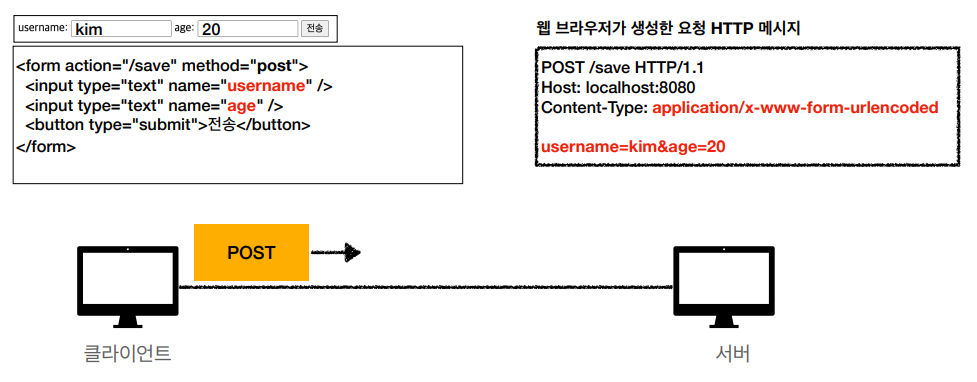<br>

그리고 웹 애플리케이션 서버를 우리가 직접 구현해야 한다고 가정해보자. 서버에서 처리해야 하는 업무는 다음과 같다.<br>
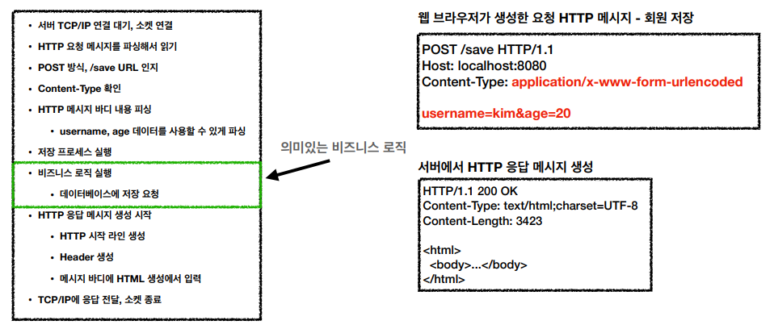<br>

그러면 우리는 위와 같은 과정의 로직을 다 작성해야 할 것이다. 그런데 사실상 의미있는 비즈니스 로직은 username과 age를 가지고 데이터베이스에 저장 요청하는게 끝이다. 그런데 전/후 단계가 너무 많다. 모두가 다 똑같이 이것을 개발하고 있기에는 너무 효율적이지 않아서 **서블릿**이라는게 등장한다.

### 서블릿을 지원하는 WAS사용

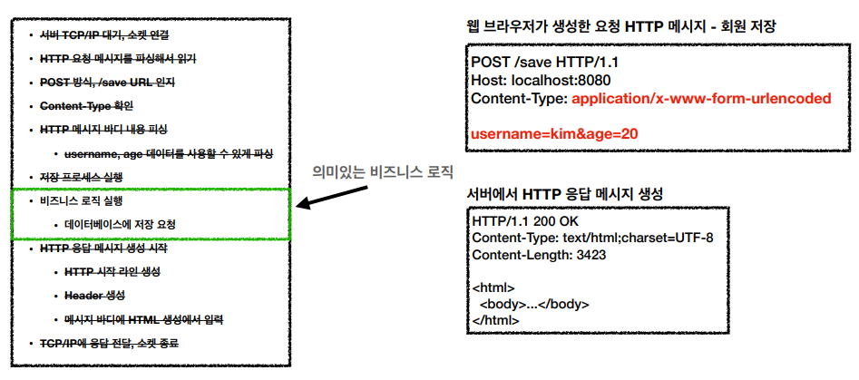<br>
서블릿은 위 이미지에서, 의미있는 비즈니스 로직 영역을 제외한 전/후 모든 작업을 모두 지원해준다

<br/>**서블릿**

- 특징
  ```java
  @WebServlet(name = "helloServlet", urlPatterns = "/hello")
  public class HelloServlet extends HttpServlet {
    @Override
    protected void service(HttpServletRequest request, HttpServletResponse response){
      // 애플리케이션 로직
    }
  }
  ```
  - urlPatterns(/hello)의 URL이 호출되면 서블릿 코드가 실행
  - HTTP 요청 정보를 편리하게 사용할 수 있는 HttpServletRequest
  - HTTP 응답 정보를 편리하게 제공할 수 있는 HttpServletResponse.
  - 개발자는 HTTP 스펙을 매우 편리하게 사용
- HTTP 요청, 응답 흐름
  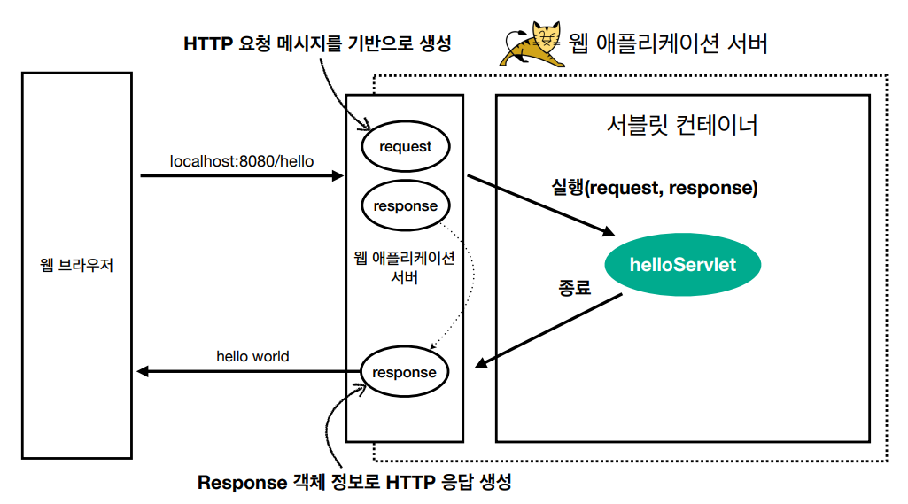
  (HTTP요청시)
  - WAS는 Request, Response객체를 새로 만들어서 서블릿 객체 호출.
  - 개발자는 Request 객체에서 HTTP 요청 정보를 편리하게 꺼내서 사용.
  - 개발자는 Response 객체에 HTTP 응답 정보를 편리하게 입력.
  - WAS는 Response 객체에 담겨있는 내용으로 HTTP응답 정보를 생성
- **서블릿 컨테이너**
  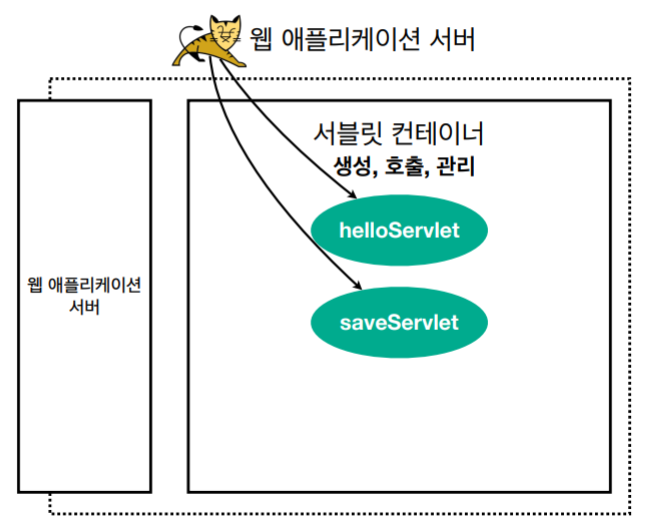
  - 톰캣처럼 서블릿을 지원하는 WAS를 서블릿 컨테이너라고 함
  - 서블릿 컨테이너는 서블릿 객체 생성, 초기화, 호출, 종료하는 생명주기 관리
  - 서블릿 객체는 **싱글톤**으로 관리
    - 고객의 요청이 올 때 마다 계속 객체를 생성하는 것은 비효율
      - request, response 객체는 요청이 올 때 마다 항상 객체가 새로 생성되어야 한다. 그런데 helloServlet 이라는 것은 굳이 항상 생성할 필요가 있을까? 객체를 매번 생성할 필요가 없다. (다 같이 재사용한다.)
    - 최초 로딩 시점에 서블릿 객체를 미리 만들어두고 재활용
    - 모든 고객 요청은 동일한 서블릿 객체 인스턴스에 접근
    - **공유 변수 사용 주의**
    - 서블릿 컨테이너 종료시 함께 종료
  - JSP도 서블릿으로 변환 되어서 사용
  - 동시 요청을 위한 멀티 쓰레드 처리 지원

### 동시 요청 - 멀티 쓰레드

이번에는 동시 요청 - 멀티 쓰레드에 대해서 알아보자

클라이언트에서 서버로 요청을 하면 서버는 응답을 한다


클라이언트가 요청을 하면 TCP/IP 커넥션 연결이 되고, servlet을 호출한다
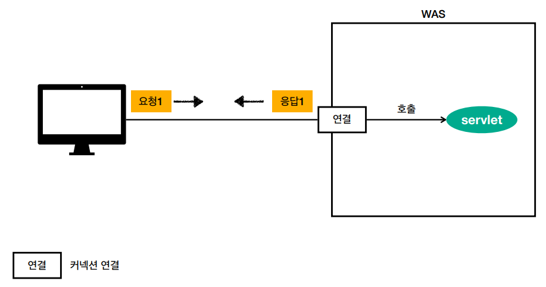

그런데 서블릿을 누가 호출하는걸까? 바로 "쓰레드"라는게 호출한다.
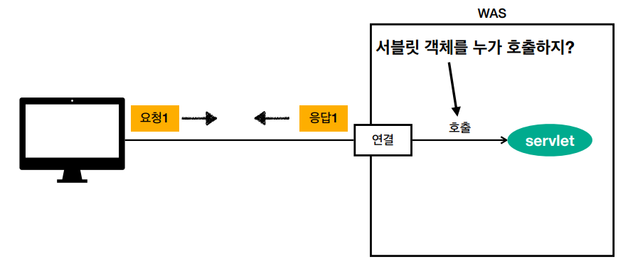

**쓰레드**

- 애플리케이션 코드를 하나하나 순차적으로 실행하는 것은 쓰레드
- 자바 메인 메서드를 처음 실행하면 main이라는 이름의 쓰레드가 실행.
- 쓰레드가 없다면 자바 애플리케이션 실행이 불가능
- 쓰레드는 한번에 하나의 코드 라인만 수행
- 그래서 동시 처리가 필요하면 쓰레드를 추가로 생성해줘야 한다.

**단일 요청-쓰레드 하나 사용**

- 동시처리가 필요하기 이전에, 쓰레드 하나가 있다고 가정해보자
  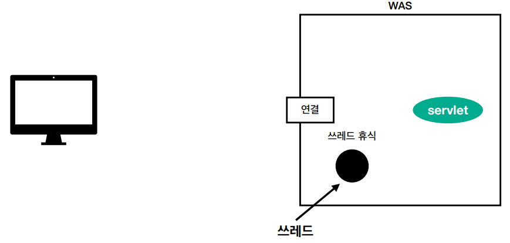
- 이제 클라이언트 요청이 왔다고 가정해보자. 그러면 쓰레드가 할당된다. 그리고 이 쓰레드를 가지고 서블릿이 호출된다
  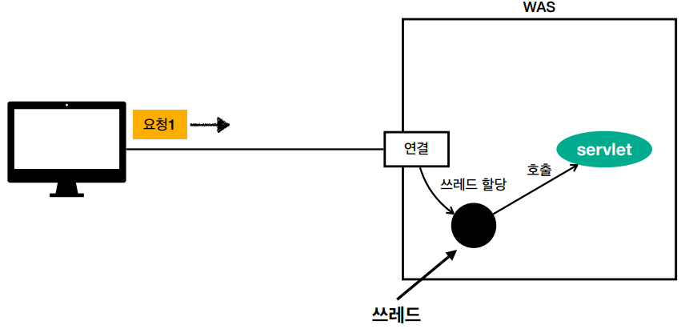
- 그리고 나서 쓰레드를 가지고 응답까지 다 되고 나면, 쓰레드는 휴식한다.
  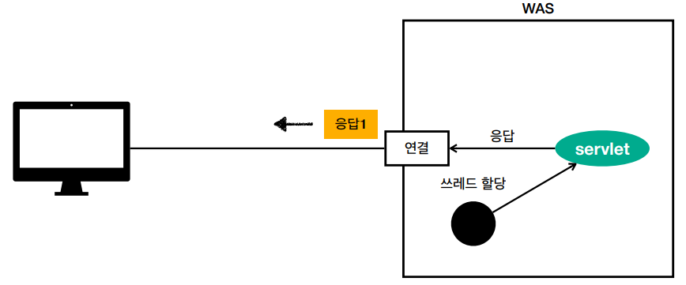
  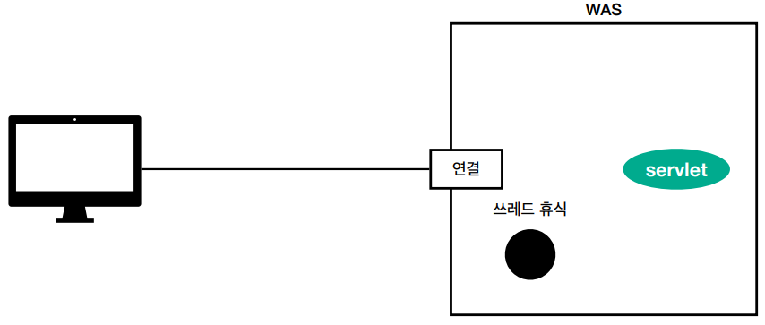

**다중 요청-쓰레드 하나 사용**

- 쓰레드는 하나인데 다중 요청이 들어왔다고 가정해보자.<br>먼저 요청1이 들어왔다. 그래서 쓰레드를 할당해서 요청을 처리하다가 여러 이유로 인해 처리가 지연되고 있다.
  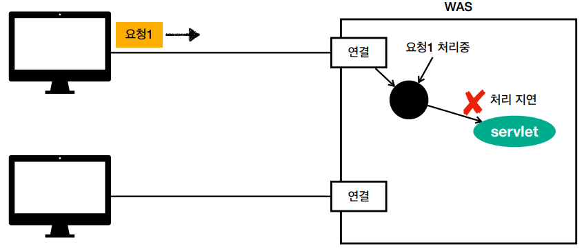
- 그때 요청2가 들어온다. 그런데 쓰레드는 현재 하나밖에 없다. 그러면 요청2는 해당 쓰레드를 기다려야한다.
  
- 결국 1번도 처리중이고, 2번도 1번이 쓰레드를 다 사용하고 줘야하는데 1번이 계속 쓰레드를 점유하고 있으니, 수행 자체를 할 수 없다.(이렇게 되면 기다리다가 나중에 둘 다 타임아웃나거나 오류가 발생할 수 있다.)
  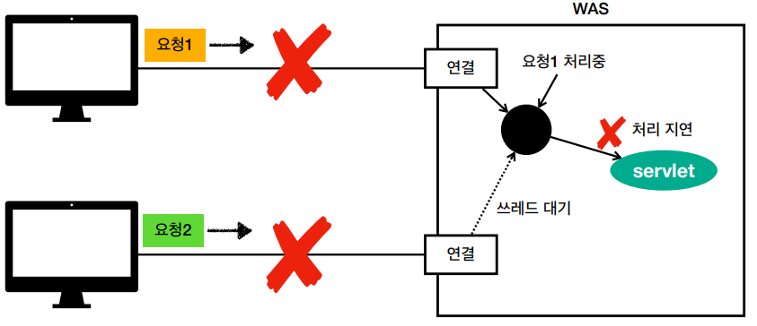
- 이것을 해결하려면, 아주 단순하게 매 요청마다 신규 쓰레드를 생성하면 된다.(요청이 올 때 마다 무조건 쓰레드는 새로 만드는 것.)
  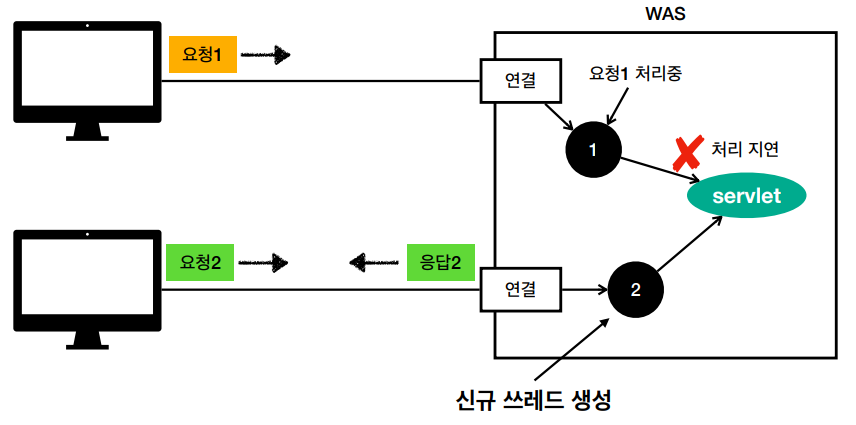

<br>

**요청하면 쓰레드 생성(하도록 WAS를 설계하면...!)**

- 장점
  - 동시 요청을 처리할 수 있다
  - 리소스(CPU, 메모리)가 허용할 때 까지 처리 가능
  - 하나의 쓰레드가 지연되어도, 나머지 쓰레드는 정상 동작한다.
- 단점
  - 쓰레드는 생성 비용은 매우 비싸다
    - 고객의 요청이 올 때 마다 쓰레드를 생성하면, 응답 속도가 늦어진다
  - 쓰레드는 컨텍스트 스위칭 비용이 발생한다
  - 쓰레드 생성에 제한이 없다 - 고객의 요청이 너무 많이 오면, CPU, 메모리 임계점을 넘어서 서버가 죽을 수 있다.
    이것을 해결하기 위해서, 보통 WAS들은 다 아래와 같은 식으로 구현이 되어있다.(내부에 쓰레드 풀이라는 것을 사용한다.)

### 쓰레드풀

- 참고(1)
  
  - 1번과 2번이 요청이 온다
  - 그러면 쓰레드 풀에게 놀고있는 쓰레드를 달라고 요청한다.(참고, 풀 안에 쓰레드를 미리 만들어둔다. 여기서는 200개 라고 가정)
  - 그렇게 되면 1번과 2번에게 할당했으니, 쓰레드 풀에는 198개가 된다
  - 1번과 2번 요청이 완료되면 해당 쓰레드를 죽이지 않고, 쓰레드 풀에 다시 반납한다.(그러면 다시 쓰레드 풀에는 쓰레드가 200개가 된다.)
- 참고(2)
  
  - 이제 200개의 쓰레드가 이미 실행중이라고 가정해보자
  - 이후에 요청1과 요청2가 들어왔다. 그러면 이 요청들은 쓰레드 풀에 쓰레드가 없기 때문에, (설정에 따라)대기하거나 거절될 수 있다.(거절은 요청을 처리할 수 없으므로 요청을 뱉는다. 대기는 어느정도까지 대기를 받을지 설정할 수 있다.)

<br>

**쓰레드 풀 - 요청마다 쓰레드 생성의 단점 보안**

- 특징
  - 필요한 쓰레드를 쓰레드 풀에 보관하고 관리한다
  - 쓰레드 풀에 생성가능한 쓰레드의 최대치를 관리한다.<br>톰캣은 최대 200개 기본 설정(변경가능)
- 사용
  - 쓰레드가 필요하면 이미 생성되어 있는 쓰레드를 쓰레드 풀에서 꺼내서 사용한다
  - 사용을 종료하면 쓰레드 풀에 해당 쓰레드를 반납한다
  - 최대 쓰레드가 모두 사용중이어서 쓰레드 풀에 쓰레드가 없으면?
    - 기다리는 요청은 거절하거나 특정 숫자만큼만 대기하도록 설정할 수 있다.
- 장점
  - 쓰레드가 미리 생성되어 있으므로, 쓰레드를 생성하고 종료하는 비용(CPU)이 절약되고, 응답 시간이 빠르다
  - 생성 가능한 쓰레드의 최대치가 있으므로 너무 많은 요청이 들어와도 기존 요청은 안전하게 처리할 수 있다.

**쓰레드 풀 - 실무 팁**

- WAS의 주요 튜닝 포인트는 최대 쓰레드(max thread) 수이다.
- 이 값을 너무 낮게 설정하면?
  - 동시 요청이 많으면, 서버 리소스는 여유롭지만, 클라이언트는 금방 응답 지연
- 이 값을 너무 높게 설정하면?
  - 동시 요청이 많으면, CPU, 메모리 리소스 임계점 초과로 서버 다운
- 장애 발생시?
  - 클라우드면 일단 서버부터 늘리고, 이후에 튜닝
  - 클라우드가 아니면 열심히 튜닝

**쓰레드 풀 - 쓰레드 풀의 적정 숫자**

- 적정 숫자는 어떻게 찾나요?
- 애플리케이션 로직의 복잡도, CPU, 메모리, IO 리소스 상황에 따라 모두 댜름
- 성능 테스트를 꼭 해봐야 한다
  - 최대한 실제 서비스와 유사하게 성능 테스트 시도
  - 툴: 아파치 ab, 제이미터, nGrinder

**핵심은 WAS가 멀티 쓰레드를 지원한다는 것.**

- 멀티 쓰레드에 대한 부분은 WAS가 처리
- 개발자가 멀티 쓰레드 관련 코드를 신경쓰지 않아도 됨
- 개발자는 마치 싱글 쓰레드 프로그래밍을 하듯이 편리하게 소스 코드를 개발
- 멀티 쓰레드 환경이므로 싱글톤 객체(서블릿, 스프링 빈)는 주의해서 사용(공유 변수 등)

### HTML, HTTP API, CSR, SSR

이번에는 [HTML, HTTP API, CSR, SSR]에 대해 백엔드 개발자가 숙지해야할 부분을 알아보자.

**백엔드 개발자가 HTTP를 통해서 데이터를 제공할 때 고민해야할 포인트 3가지**

- 정적 리소스를 어떻게 제공할 것인가?
- 동적으로 제공되는 HTML 페이지를 어떻게 제공할 것인가?
- HTTP API를 어떻게 제공할 것인가?

- 정적리소스
  - 고정된 HTML, CSS, JS, 이미지, 영상 등을 제공
  - 주로 웹 브라우저
    - 클라이언트에서 요청시, 웹 서버는 이미 생성된 파일을 제공한다
- HTML 페이지
  - 동적으로 필요한 HTML파일을 생성해서 전달(ex. 주문내역)
  - 웹 브라우저: HTML 해석
    - 웹 브라우저에서 동적 HTML 요청시, WAS에서 주문내역 정보 조회 후, 프로그래밍을 통해 HTML을 동적으로 생성한다. 생성된 HTML을 웹 브라우저에 내려운다.
- HTTP API
  - HTML이 아니라 데이터를 전달
  - 주로 JSON 형식 사용
  - 다양한 시스템에서 호출
  - 데이터만 주고 받음, UI화면이 필요하면, 클라이언트가 별도 처리
  - 웹, 웹 클라이언트, 서버 to 서버

HTTP API - 다양한 시스템 연동

- 주로 JSON 형태로 데이터 통신
- UI클라이언트 접점
  - 앱 클라이언트(아이폰, 안드로이드, PC 앱)
  - 웹 브라우저에서 자바스크립트를 통해 HTTP API호출
  - React, Vue.j같은 웹 클라이언트
- 서버 to 서버
  - 주문 서버 -> 결제 서버
  - 기업간 데이터 통신

**서버사이드 렌더링(SSR), 클라이언트 사이드 렌더링(CSR)**

- SSR - 서버 사이드 렌더링
  - HTML 최종 결과를 서버에서 만들어서 웹 브라우저에 전달
  - 주로 정적인 화면에 사용
  - 관련기술: JSP, 타임리프 -> **백엔드 개발자**
- CSR - 클라이언트 사이드 렌더링
  - HTML결과를 자바스크립트를 사용해 웹 브라우저에서 동적으로 생성해서 적용
  - 주로 동적인 화면에 사용, 웹 환경을 마치 앱처럼 필요한 부분부분 변경할 수 있음
  - 예) 구글 지도, Gmail, 구글 캘린더
  - 관련기술: React, Vue.js -> 웹 프론트엔드 개발자
- 참고
  - React, Vue.js를 CSR + SSR 동시에 지원하는 웹 프레임워크도 있음
  - SSR을 사용하더라도, 자바스크립트를 사용해서 화면 일부를 동적으로 변경 가능

어디까지 알아야 하나요? (벡엔드 개발자 입장에서 UI기술)

- 백엔드 - 서버 사이드 렌더링 기술
  - JSP, 타임리프
  - 화면이 정적이고, 복잡하지 않을 때 사용
  - 백엔드 개발자는 서버 사이드 렌더링 기술 학슬 필수
- 웹 프론트엔드 - 클라이언트 사이드 렌더링 기술
  - React, Vue.js
  - 복잡하고 동적인 UI 사용
  - 웹 프론트엔드 개발자의 전문 분야
- 선택과 집중
  - 백엔드 개발자의 웹 프론트엔드 개술 학습은 옵션
  - 백엔드 개발자는 서버, DB, 인프라 등등 수 많은 백엔드 기술을 공부해야 된다
  - 웹 프론트엔드도 깊이있게 잘 하려면 숙련에 오랜 시간이 필요

### 자바 백엔드 웹 기술 역사

이번에는 자바 백엔드 웹 기술 역사에 대해서 알아보자

자바 웹 기술 역사 - 과거 기술

- 서블릿 - 1997
  - HTML 생성이 어려움
- JSP - 1999
  - HTML생성은 편리하지만, 비즈니스 로직까지 너무 많은 역할 담당
- 서블릿, JSP 조합 MVC패턴 사용
  - 모델, 뷰, 컨트롤러로 역할을 나누어 개발
- MVC프레임워크
  - MVC 패턴 자동화, 복잡한 웹 기술을 편리하게 사용할 수 있는 다양한 기능 지원
  - 스트럿츠, 웹워크, 스프링 MVC(과거 버전)

자바 웹 기술 역사 - 현재 사용 기술

- 애노테이션 기반의 스프링 MVC등장
  - @Controller
  - MVC프레임워크의 춘추 전국 시대 마무리
- 스프링 부트의 등장
  - 스프링 부트는 서버를 내장
  - 과거에는 서버에 WAS를 직접 설치하고, 소스는 War파일을 만들어서 설치한 WAS에 배포
  - 스프링 부트는 빌드 결과(Jar)에 WAS서버 포함 -> 빌드 배포 단순화

자바 웹 기술 역사 - 최신 기술(스프링 웹 기술 분화)

- Web Servlet - Spring MVC
- Web Reactive - Spring WebFlux

자바 웹 기술 역사 - 최신 기술(스프링 웹 플럭스(WebFlux))

- 특징
  - 비동기 넌 블러킹 처리
  - 최소 쓰레드로 최대 성능 - 쓰레드 컨텍스트 스위칭 비용 효율화
  - 함수형 스타일로 개발 - 동시처리 코드 효율화
  - 서블릿 기술 사용X
- 그런데
  - 웹 플럭스는 기술적 난이도 매우 높음
  - 아직은 RDB지원 부족
  - 일반 MVC의 쓰레드 모델도 충분히 빠르다
  - 실무에서 아직 많이 사용하지는 않음

자바 뷰 템플릿 역사 - HTML을 편리하게 생성하는 뷰 기능

- JSP
  - 속도 느림, 기능 부족
- 프리마커(Freemarker), Velocity(벨로시티)
  - 속도 문제 해결, 다양한 기능
- 타임리프(Thymeleaf)
  - 내추럴 템플릿: HTML의 모양은 유지하면서 뷰 템플릿 적용 가능
  - 스프링 MVC와 강력한 기능 통합
  - 최선의 선택, 단 성능은 프리마커, 벨로시티가 더 빠름

### servlet 프로젝트 생성

ServletApplication에 `@ServletComponentScan` 에노테이션을 추가
`@ServletComponentScan`은 서블릿 자동 등록된다.

- 그러면 이제 서블릿 만들어보자.(서블릿 등록)

  - src > main > java > hello > servlet > basic 패키지를 생성하고, 내부에 HelloServlet 클래스를 생성

    ```java
    package hello.servlet.basic;


    @WebServlet(name = "helloServlet", urlPatterns = "/hello")
    public class HelloServlet extends HttpServlet {

        @Override
        protected void service(HttpServletRequest request, HttpServletResponse response) throws ServletException, IOException {
            System.out.println("HelloServlet.service");
        }
    }
    ```

    - 서블릿은 `HttpServlet`이라는 것을 상속받아야 한다.
    - 그리고 `@WebServlet`애노테이션을 넣고, name(서블릿 이름): helloServlet, urlPatterns(URL 매핑): /hello를 입력한다. (HTTP 요청을 통해 매핑된 URL이 호출되면, 서블릿 컨테이너는 해당 서블릿의 다음 메서드를 실행한다. `protected void service(HttpServletRequest request, HttpServletResponse response)`)
    - service 메서드를 재정의한다.
    - 웹 브라우저에서 localhost:8080/hello를 호출해보면 빈 화면이 노출(아무것도 응답하지 않았기 때문에 빈 화면이 노출됨.)되고, 콘솔에는 정상적으로 "HelloServlet.service"이 노출됨을 확인할 수 있다.

- 이번에는 다음과 같이 작성후 실행 해보자

  ```java
  package hello.servlet.basic;

  @WebServlet(name = "helloServlet", urlPatterns = "/hello")
  public class HelloServlet extends HttpServlet {

      @Override
      protected void service(HttpServletRequest request, HttpServletResponse response) throws ServletException, IOException {
          System.out.println("HelloServlet.service");

          System.out.println("request = " + request);
          System.out.println("response = " + response);

          String username = request.getParameter("username");
          System.out.println("username = " + username);

          response.setContentType("text/plain");
          response.setCharacterEncoding("utf-8");
          response.getWriter().write("hello " + username);

          // localhost:8080/hello?username=sung 으로 접속시
          // HelloServlet.service
          // request = org.apache.catalina.connector.RequestFacade@4b6b5279
          // response = org.apache.catalina.connector.ResponseFacade@391193c7
          // username = sung

          // 웹 페이지에서는
          // hello sung으로 나옴
      }
  }

  ```

  - `request.getParameter`를 사용해서 쿼리 파라미터(쿼리 스트링)정보를 조회할 수 있다.
  - `response`를 사용해서 응답 정보를 입력할 수 있다. (setContentType, setCharacterEncoding를 통해서 헤더 정보를 입력해준다. 그리고 write를 통해 HTTP 응답메시지 바디에 들어갈 정보를 입력한다.)
  - 실행해보면 웹 브라우저에 데이터가 정상적으로 노출되면 콘솔에서도 정상적으로 확인할 수 있다.

> [!TIP]
> HTTP 요청 메시지 로그로 확인하기
>
> - application.properties파일에 다음과 같이 수정
>
> ```txt
> logging.level.org.apache.coyote.http11=debug
> ```
>
> - 수정 후 다시 재구동하면 서버가 받은 HTTP요청 메시지를 출력하는 것을 확인할 수 있다.
> - (참고) 운영서버에 이렇게 모든 요청 정보를 다 남기면 성능저하가 발생할 수 있다. 개발 단계에서만 적용하자

지금까지의 내용을 그림으로 동작 방식을 알아보자

- **서블릿 컨테이너 동작 방식 설명**
  - 내장 톰캣 서버 생성
    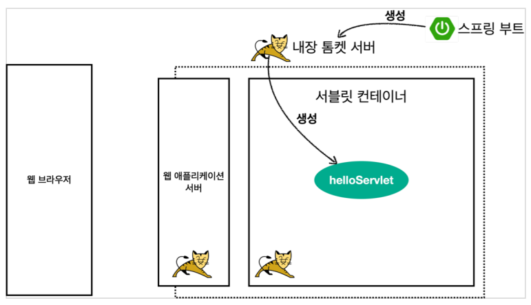
    - 스프링 부트 프로젝트를 생성하여 실행해보았다. 그러면 스프링 부트가 실행하면서 내장 톰캣 서버를 띄워준다. (톰캣 서버는 내부에 서블릿 컨테이너 기능을 가지고 있다.)
    - 그러면서 서블릿 컨테이너를 통해서 서블릿을 다 생성해준다. (서블릿 컨테이너 안에 helloServlet이 생성됨)
  - HTTP요청, HTTP응답 메시지
    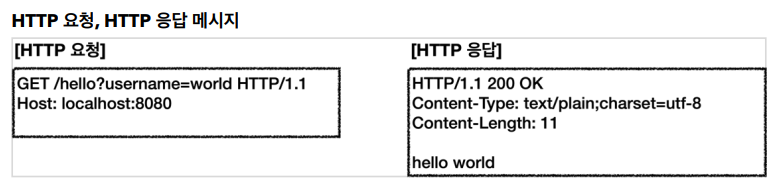
    - 웹 브라우저를 통해 /hello?username=world를 입력하여 요청하면, 웹 브라우저는 이미지 왼쪽과 같이 HTTP 요청 메시지를 만들어서 서버에 던져준다.
  - 웹 애플리케이션 서버의 요청 응답 구조
    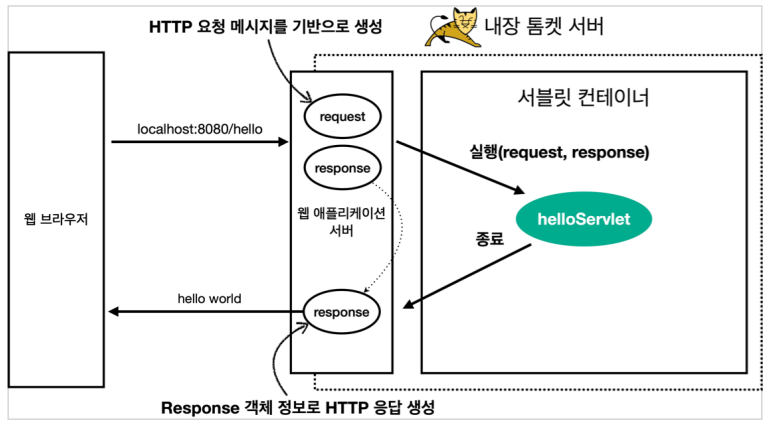
    - 그러면 서버는 request, response 객체를 만들어서 (싱글톤으로 등록된) helloServlet의 service 메서드를 호출한다. 그러면서 request, response를 넘겨준다.
    - service 메서드내에서 필요한 로직들을 작성한다. (강의에서는 response에 헤더 정보, 메시지 정보 입력하였다.)
    - 이후 해당 메서드가 종료되고 나가면서 WAS 서버가 response 정보를 가지고 HTTP 응답 메시지 정보를 만들어서 반환한다.
    - (참고) HTTP 응답에서 Content-Length와 같은 부가적인 정보들은 웹 애플리케이션 서버가 자동으로 생성해준다.

### HttpServletRequest - 개요

HttpServletRequest - 개요

- **HttpServletRequest 역할**
  - HTTP 요청 메시지를 개발자가 직접 파싱해서 사용해도 되지만, 매우 불편할 것이다. 서블릿은 개발자가 HTTP요청 메시지를 편리하게 사용할 수 있도록 개발자 대신에 HTTP요청 메시지를 파싱한다. 그리고 그 결과를 `HttpServletRequest`객체에 담아서 제공한다. (그래서 우리가 이를 편리하게 사용할 수 있는 것)
  - HttpServletRequest를 사용하면 다음과 같은 Http 요청 메시지를 편리하게 조회할 수 있다.
    - **HTTP 요청 메시지**
      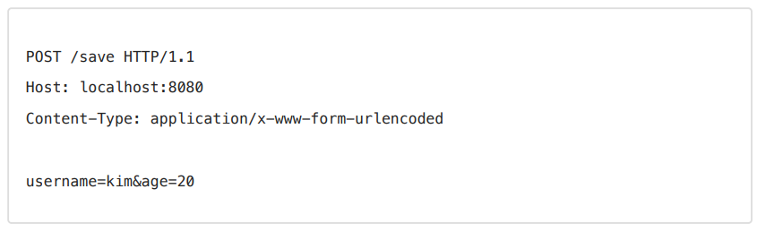
      - START LINE
        - HTTP 메소드
        - URL
        - 쿼리 스트링
        - 스키마, 프로토콜
      - 헤더
        - 헤더 조회
      - 바디
        - form 파라미터 형식 조회
        - message body 데이터 직접 조회
  - HttpServletRequest 객체는 추가로 여러가지 부가기능도 함께 제공한다. - **임시 저장소 기능** - 해당 HTTP 요청이 시작부터 끝날 때 까지 유지되는 임시 저장소 - 저장: `request.setAttribute(name, value)` - 조회: `request.getAttribute(name)` - 세션 관리 기능 - `request.getSession(create: true)`
    > [!IMPORTANT]
    >
    > HttpServletRequest, HttpServletResponse를 사용할 때 **가장 중요한 점은 이 객체들이 HTTP 요청 메시지, HTTP 응답 메시지를 편리하게 사용하도록 도와주는 객체**라는 점이다. 따라서 이 기능에 대해서 깊이있는 이해를 하려면 HTTP 스펙이 제공하는 요청, 응답메시지 자체를 이해햐야 한다.

### HttpServletRequest - 기본 사용법

HttpServletRequest가 제공하는 기본 기능들을 알아보자.

- src > main > java > hello > servlet > basic > request 패키지 생성 후, RequestHeaderServlet 클래스를 생성

  ```java
  package hello.servlet.basic.request;

  import jakarta.servlet.ServletException;
  import jakarta.servlet.annotation.WebServlet;
  import jakarta.servlet.http.Cookie;
  import jakarta.servlet.http.HttpServlet;
  import jakarta.servlet.http.HttpServletRequest;
  import jakarta.servlet.http.HttpServletResponse;

  import java.io.IOException;
  import java.util.Enumeration;

  @WebServlet(name = "requestHeaderServlet", urlPatterns = "/request-header")
  public class RequestHeaderServlet extends HttpServlet { // 헤더 정보 출력을 위한 서블릿

      @Override
      protected void service(HttpServletRequest request, HttpServletResponse response) throws ServletException, IOException {
          printStar(request);
          printHeader(request);
          printHeaderUtils(request);
          printEtc(request);
      }

      private void printStar(HttpServletRequest request) {
          System.out.println("--- REQUEST-LINE - start ---");
          System.out.println("request.getMethod() = " + request.getMethod()); // GET
          System.out.println("request.getProtocol() = " + request.getProtocol()); // HTTP/1.1
          System.out.println("request.getScheme() = " + request.getScheme()); // http
          // 전체 URL: https://localhost:8080/request-header
          System.out.println("request.getRequestURL() = " + request.getRequestURL());
          // 경로: /request-header
          System.out.println("request.getRequestURI() = " + request.getRequestURI());
          // 쿼리 스트링: username=h1
          System.out.println("request.getQueryString() = " + request.getQueryString());
          // https 사용 유무
          System.out.println("request.isSecure() = " + request.isSecure());
          System.out.println("--- REQUEST-LINE - end ---");
          System.out.println();
      }

      private void printHeader(HttpServletRequest request) {
          System.out.println("--- Headers - start ---");

          Enumeration<String> headerNames = request.getHeaderNames();
          while (headerNames.hasMoreElements()) {
              String headerName = headerNames.nextElement();
              System.out.println(headerName + ": " + headerName);
          }

          System.out.println("--- Headers - end ---");
          System.out.println();
      }

      private void printHeaderUtils(HttpServletRequest request) {
          System.out.println("--- Header 편의 조회 start ---");
          System.out.println("[Host 편의 조회]");
          System.out.println("request.getServerName() = " + request.getServerName());
          System.out.println("request.getServerPort() = " + request.getServerPort());
          System.out.println();

          System.out.println("[Accept-Language 편의 조회]");
          request.getLocales().asIterator()
                  .forEachRemaining(locale -> System.out.println("locale = " + locale));
          System.out.println("request.get = " + request.getLocale());
          System.out.println();

          System.out.println("[cookie 편의 조회]");
          if (request.getCookies() != null) {
              for (Cookie cookie : request.getCookies()) {
                  System.out.println(cookie.getName() + ": " + cookie.getValue());
              }
          }
          System.out.println();

          System.out.println("[Content 편의 조회]");
          System.out.println("request.getContentType() = " + request.getContentType());
          System.out.println("request.getContentLength = " + request.getContentLength());
          System.out.println("request.getCharacterEncoding() = " + request.getCharacterEncoding());

          System.out.println("--- Header 편의 조회 end ---");
          System.out.println();
      }

      private void printEtc(HttpServletRequest request) {
          System.out.println("--- 기타 조회 start ---");
          System.out.println("[Remote 정보");
          System.out.println("request.getRemoteHost() = " + request.getRemoteHost());
          System.out.println("request.getRemoteAddr() = " + request.getRemoteAddr());
          System.out.println("request.getRemotePort() = " + request.getRemotePort());
          System.out.println();
          System.out.println("[Local 정보]");
          System.out.println("request.getLocalName() = " + request.getLocalName());
          System.out.println("request.getLocalAddr() = " + request.getLocalAddr());
          System.out.println("request.getLocalPort() = " + request.getLocalPort());
          System.out.println("--- 기타 조회 end---");

      }
  }

  ```

  ### HTTP 요청 데이터 - 개요

  이번에는 HTTP 요청 데이터에 대해서 알아보자
  (HTTP 요청 메시지를 통해 클라이언트에서 서버로 데이터를 전달하는 방법을 알아보자)

  **주로 다음 3가지 방법을 사용한다**

  - GET - 쿼리 파라미어
    - /url\*?username=hello&age=20
    - 메시지 바디 없이, URL의 쿼리 파라미터에 데이터를 포함해서 전달
    - 예) 검색, 필터 페이징등에서 많이 사용하는 방식
  - POST - HHTML Form
    - content-type: application/x-www-form-urlencoded
    - 메시지 바디에 쿼리 파라미터 형식으로 전달 (username=hello&age=20)
    - 예) 회원 가입, 상품 주문, HTML Form 사용
  - HTTP message body에 데이터를 직접 담아서 요청
    - HTTP API에서 주로 사용 JSON, XML, TEXT
    - 데이터 형식은 주로 JSON 사용
    - POST, PUT, PATCH

### HTTP 요청 데이터 - GET 쿼리 파라미터

이번에는 HTTP요청 데이터 중에, 가장 먼저 GET방식의 쿼리 파라미터로 전송되는 데이터를 어떻게 사용할 수 있는지 알아보자

다음 데이터를 클라이언트에서 서버로 전송해보자

**전달데이터**

- username=hello
- age=20

메시지 바디 없이, URL의 쿼리 파라미터를 사용해서 데이터를 전달하자
예) 검색, 필터, 페이징등에서 많이 사용하는 방식.

쿼리 파라미터는 URL에 다음과 같이 ? 를 시작으로 보낼 수 있다. 추가 파라미터는 &로 구분하면 된다
예) `http://localhost:8080/request-param?username=hello&age=20`

이렇게 전달된 데이터를 서버에서는 HttpServletRequest가 제공하는 다음 메서드를 통해 쿼리 파라미터를 편리하게 조회할 수 있다.

**쿼리 파라밈터 조회 메서드**

- 단일 파라미터 조회
  - `String username = request.getParameter("username");`
- 파라미터 이름을 모두 조회
  - `Enumeration parameterNames = request.getParameterNames();`
- 파라미터를 Map으로 조회
  - `Map parameterMap = request.getParameterMap();`
- 복수 파라미터 조회
  - `String[] usernames = request.getParameterValues("username");`

예시를 확인해보자

- src > main > java > hello > servlet > basic > request 패키지 아래 RequestParamServlet 클래스를 생성

  ```java
  package hello.servlet.basic.request;

  @WebServlet(name = "requestParamServlet", urlPatterns = "/request-param")
  public class RequestParamServlet extends HttpServlet {

      @Override
      protected void service(HttpServletRequest request, HttpServletResponse response) throws ServletException, IOException {

          System.out.println("[전체 파라미터 조회] - start");

          /*
          Enumeration<String> parameterNames = request.getParameterNames();
          while(parameterNames.hasMoreElements()) {
              String paramName = parameterNames.nextElement();
              System.out.println(paramName + "=" + request.getParameter(paramName));
          }
          */

          request.getParameterNames().asIterator()
                  .forEachRemaining(paramName ->
                          System.out.println(paramName + " = " +
                                  request.getParameter(paramName)));

          System.out.println("[전체 파라미터 조회] - end");

          System.out.println("[단일 파라미터 조회] - start");
          String username = request.getParameter("username");
          String age = request.getParameter("age");
          System.out.println("username = " + username);
          System.out.println("age = " + age);
          System.out.println("[단일 파라미터 조회] - end");


          // 파라미터 이름이 중복해서 넘어갈 수 있다. 이런 경우 내부 우선순위에 의해서 먼저 잡히는것이 나오게 된다.
          System.out.println("[이름이 같은 복수 파라미터 조회] - start");
          String[] usernames = request.getParameterValues("username");
          for(String name : usernames) System.out.println("username = " + name);
          System.out.println("[이름이 같은 복수 파라미터 조회] - end");
          response.getWriter().write("ok");
      }
  }
  ```

> [!TIP]
>
> 복수 파라미터에서 단일 파라미터 조회
>
> `username=hello&username=kim` 과 같이 파라미터 이름은 하나인테, 값이 중복되면 어떻게 될까? <br>`request.getParameter()`는 하나의 파라미터 이름에 대해서 단 하나의 값만 있을 때 사용해야 한다. <br>지금처럼 중복일 때는 `request.getParameterValuest()`를 사용해야 한다.<br>참고로 이렇게 중복일 때 `request.getParameter()`를 사용하면 `request.getParameterValues()`의 첫번째 값을 반환한다.

### HTTP 요청 데이터 - POST HTML Form

이번에는 HTML의 Form을 사용해서 클라이언트에서 서버로 데이터를 전송해보자
(주로 회원 가입, 상품 주문 등에서 사용하는 방식이다.)

**특징**

- content-type: `application/x-www-form-urlencoded`
- 메시지 바디에 쿼리 파라미터 형식으로 데이터를 전달한다.

예제로 확인하자

- src > main > webapp > basic 폴더 생성 후 내부에 hello-form.html 을 생성

  ```html
  <!DOCTYPE html>
  <html>
    <head>
      <meta charset="UTF-8" />
      <title>Title</title>
    </head>
    <body>
      <form action="/request-param" method="post">
        username: <input type="text" name="username" /> age: <input type="text" name="age" />
        <button type="submit">전송</button>
      </form>
    </body>
  </html>
  ```

> [!NOTE]
>
> - POSt의 HTML Form을 전송하면 웹 브라우저는 다음 형식으로 HTTP 메시지를 만든다
>   - 요청 URL: `http://localhost:8080/request-param`
>   - content-type: `application/x-www-form-urlencoded`
>   - message body: `username=hello&age=20`
> - application/x-www-form-urlencoded 형식은 앞서 GET에서 살펴본 쿼리 파라미터 형식과 같다. 따라서 서버에서 요청 데이터 조회시 쿼리 파라미터 조회 메서드를 그대로 사용하면 된다. (클라이언트(웹 브라우저) 입장에서는 두 방식에 차이가 있지만, 서버 입장에서는 둘의 형식이 동일하므로, request.getParameter() 로 편리하게 구분없이 조회할 수 있다.) **정리하면 request.getParameter() 는 GET URL 쿼리 파라미터 형식도 지원하고, POST HTML Form 형식도 둘 다 지원한다.**

> [!TIP]
>
> - **content-type은 HTTP메시지 바디의 데이터 형식으로 지정한다**
> - **GET URL 쿼리 파라미터 형식**으로 클라이언트에서 서버로 데이터를 전달할 때는 HTTP 메시지 바디를 사용하지 않기 때문에 **content-type**이 없다.
> - **POST HTML Form 형식**으로 데이터 전달하면 HTTP 메시지 바디에 해당 데이터를 포함해서 보내기 때문에 바디에 포함된 데이터가 어떤 형식인지 content-type을 꼭 지정해야 한다. 이렇게 폼으로 데이터를 전송하는 형식을 application/x-www.form-urlencoded라 한다.

postman 테스트

- x-www-form-urlencoded
  - Key -> username
  - Value -> kim

### HTTP요청 데이터 - API 메시지 바디 - 단순 테스트

- HTTP message body에 데이터를 직접 담아서 서버에 요청
  - HTTP API에서 주로 사용, JSON ,XML, TEXT
  - 데이터 형식은 주로 JSON사용
  - POST, PUT, PATCH

먼저 가장 단순한 텍스트 메시지를 HTTP 메시지 바디에 담아서 전송하고, 읽어보자.<br>(참고. HTTP 메시지 바디의 데이터를 InputStream을 사용해서 직접 읽을 수 있다.)

- src > main > java > hello > servlet > basic > request > RequestBodyStringServlet 클래스를 생성하고 postman으로 실행해보자.

  ```java
  package hello.servlet.basic.request;

  @WebServlet(name = "requestBodyStringServlet", urlPatterns = "/request-body-string")
  public class RequestBodyStringServlet extends HttpServlet {

      @Override
      protected void service(HttpServletRequest request, HttpServletResponse response) throws ServletException, IOException {
          ServletInputStream inputStream = request.getInputStream();
          String messageBody = StreamUtils.copyToString(inputStream, StandardCharsets.UTF_8);

          System.out.println("messageBody = " + messageBody);

          response.getWriter().write("ok");

          // messageBody = hello!
      }
  }
  ```

- postman에서 `http://localhost:8080/request-body-string`으로 post로 raw text `hello!`전송
  - HTTP 메시지 바디에 넣은 데이터가 그대로 노출됨을 확인할 수 있다
  - (참고) 문자 전송
  - POST `http://localhost:8080/request-body-string`
  - content-type: text/plain
  - message body: hello!
  - 결과: messageBody = hello!

> [!TIP]
>
> inputStream은 byte코드를 반환한다. byte코드를 우리가 읽을 수 있는 문자(String)로 보려면 문자표 (Charset)를 지정해주어야 한다. 여기서는 UTF_8 Charset을 지정해줌

### HTTP 요청 데이터 - API 메시지 바디 - JSON

이번에는 HTTP API에서 주로 사용하는 JSON형식으로 데이터를 전달해보자

JSON형식 전송

- POST `http://localhost:8080/request-body-json`
- content-type: application/json
- message body: `{"username": "hello", "age": 20}`
- 결과: `messageBody = {"username": "hello", "age": 20}`

JSON 형식 파싱 추가<br>
(보통 JSON을 그대로 쓰지는 않는다. 객체로 바꿔서 사용한다. 그래서 JSON 형식으로 파싱할 수 있게 객체를 하나 생성하자.)

- src > main > java > hello > servlet > basic 디렉토리 아래 HelloData 클래스를 생성하자.

  ```java
  package hello.servlet.basic;

  import lombok.Getter;
  import lombok.Setter;

  @Getter
  @Setter
  public class HelloData {
      private String username;
      private  int age;
  }

  ```

  - src > main > java > hello > servlet > basic > request 내부에 RequestBodyJsonServlet 클래스를 생성

  ```java
  package hello.servlet.basic.request;

  @WebServlet(name = "requestBodyJsonServlet", urlPatterns = "/request-body-json")
  public class RequestBodyJsonServlet extends HttpServlet {

      private ObjectMapper objectMapper = new ObjectMapper();

      @Override
      protected void service(HttpServletRequest request, HttpServletResponse response) throws ServletException, IOException {
          ServletInputStream inputStream = request.getInputStream();
          String messageBody = StreamUtils.copyToString(inputStream, StandardCharsets.UTF_8);
          System.out.println("messageBody = " + messageBody);

          HelloData helloData = objectMapper.readValue(messageBody, HelloData.class);
          System.out.println("helloData.getUsername() = " + helloData.getUsername());
          System.out.println("helloData.getAge() = " + helloData.getAge());

          response.getWriter().write("ok");
      }
  }

  ```

> [!TIP]
>
> - JSON 결과를 파싱해서 사용할 수 있는 자바 객체로 변화하려면 Jackson, Gson 같은 JSON변환 라이브러리를 추가해서 사용해야한다. 스프링 부트로 spring MVC를 선택하면 기본으로 Jackson 라이브러리(`ObjectMapper`)를 함께 제공한다.
> - HTML form 데이터도 메시지 바디를 통해 전송되므로 inputStream을 통해 직접 읽을 수 있다. 하지만 편리한 파리미터 조회 기능( `request.getParameter(...)` )을 이미 제공하기 때문에 파라미터 조회 기능을 사용하면 된다.

### HttpServletResponse - 기본 사용법

- 역할
  - **HTTP 응답 메시지 생성**
    - HTTP 응답코드 지정
    - 헤더 생성
    - 바디 생성
  - **편의 기능 제공**
    - Content-type, 쿠키, Redirect

코드로 확인해보자

- HTTP 응답 메시지 생성<br>(src > main > java > hello > servlet > basic > response 패키지를 생성하고, 내부에 ResponseHeaderServlet 클래스를 생성하고 실행해보자.)

  ```java
  package hello.servlet.basic.response;

  @WebServlet(name = "responseHeaderServlet", urlPatterns = "/response-header")
  public class ResponseHeaderServlet extends HttpServlet {

      @Override
      protected void service(HttpServletRequest request, HttpServletResponse response) throws ServletException, IOException {

          // [status-line]
          response.setStatus(HttpServletResponse.SC_OK);

          // [response-headers]
          response.setHeader("Content-Type", "text/plain;charset=utf-8");
          response.setHeader("Cache-Control", "no-cache, no-store, must-revalidate");
          response.setHeader("Pragma", "no-cache");
          response.setHeader("myHeader", "hello");

          // [message body]
          PrintWriter writer = response.getWriter();
          writer.println("ok");
      }
  }
  ```

편의 기능을 확인해보자

- ResponseHeaderServlet 클래스에 아래 코드를 추가해보자.

  ```java
  private void content(HttpServletResponse response) {
        response.setContentType("text/plain");
        response.setCharacterEncoding("utf-8");
    }

  private void cookie(HttpServletResponse response) {
        Cookie cookie = new Cookie("myCookie", "good");
        cookie.setMaxAge(600); // 600초
        response.addCookie(cookie);
    }

  private void redirect(HttpServletResponse response) throws IOException {
        response.sendRedirect("/basic/hello-form.html");
    }
  ```

### HTTP 응답 데이터 - 단순 텍스트, HTML

이전까지는 start-line, header등에서 알아보았다.<br>
이번에는 HTTP 응답 데이터 부분에 집중해서 알아보자

**HTTP응답 메시지는 주로 다음 내용을 담아서 전달한다**

- 단순 텍스트 응답
  - 앞에서 살펴보았다.(`writer.println("ok")`)
- HTML응답
- HTTP API - MessageBody JSON 응답

### HttpServletResponse - HTML 응답

- src > main > java > hello > servlet > basic > response 패키지 내부에 ResponseHtmlServlet 클래스를 생성하고 실행

  ```java
  package hello.servlet.basic.response;

  @WebServlet(name = "responseHtmlServlet", urlPatterns = "/response-html")
  public class ResponseHtmlServlet extends HttpServlet {

      @Override
      protected void service (HttpServletRequest request, HttpServletResponse response) throws ServletException, IOException {
          response.setContentType("text/html");
          response.setCharacterEncoding("utf-8");

          PrintWriter writer = response.getWriter();
          writer.println("<html>");
          writer.println("<body>");
          writer.println("  <div>안녕?</div>");
          writer.println("</body>");
          writer.println("</html>");
      }

  }
  ```

  > [!TIP]
  >
  > - HTTP응답으로 HTML을 반환할 때는 content-type을 text/html로 지정해야 한다
  > - 서블릿으로 HTML을 렌더링할때는 위와 같이 직접작성해야한다. (자바 코드로 작성하기 때문에 로직을 넣으면 동적으로 HTML 생성이 가능하다. (IF문도 넣을 수 있는 등)))

### HTTP 응답 데이터 - API JSON

이번에는 HTTP API를 만들때 주로 사용하는 응답 데이터를 JSON 형식으로 보내는 방법에 대해서 알아보자.

- src > main > java > hello > servlet > basic > response 패키지 내부에 ResponseJsonServlet 클래스를 생성후 실행

  ```java
  package hello.servlet.basic.response;


  @WebServlet(name = "responseJsonServlet", urlPatterns = "/response-json")
  public class ResponseJsonServlet extends HttpServlet {

      private ObjectMapper objectMapper = new ObjectMapper();

      @Override
      protected void service(HttpServletRequest request, HttpServletResponse response) throws ServletException, IOException {
          response.setContentType("application/json");
          // application/json은 기본적으로 utf-8을 지원해서 아래코드는 의미x
          // response.setCharacterEncoding("utf-8");

          HelloData helloData = new HelloData();
          helloData.setUsername("kim");
          helloData.setAge(20);

          String result = objectMapper.writeValueAsString(helloData);
          response.getWriter().write(result);
      }
  }
  ```

  - HTTP응답으로 JSON을 반환할 때는 content-type을 `application/json`로 지정해야 한다.<br>
    Jackson 라이브러리가 제공하는 `objectMapper.writeValueAsString()` 를 사용하면 객체를 JSON 문자로 변경할 수 있다.

## 서블릿, JSP, MVC 패턴

이전에는 서블릿에 대해서 알아보았다.<br>
이번에는 간단하게 저장/조회 기능만 제공하는 회원 관리 웹 애플리케이션을 만들어 볼 것이다

처음에는 서블릿으로 만들어 볼 것이고, 이렇게 서블릿으로 구현하다 보면 불편한 점들이 확인될 것이다.<br>
그래서 이후에는 그 불편한 점을 개선한 JSP로 만들어 . 볼것이다. 그러나 JSP로 만들어도 불편한 점들이 나오는데, 이를 개선하기 위해 MVC패턴이 등장한다. 그래서 MVC패턴을 적용해서 불편한 문제들을 하나씩 해결해 나갈것이다.

### 회원 관리 웹 애플리케이션 요구사항

회원정보

- 이름 : username
- 나이 : age

기능 요구 사항

- 회원 저장
- 회원 목록 조회

`회원 도메일 모델`: src > main > java > hello > servlet > domain 패키지를 생성하고 내부에 member 패키지를 생성하자. 그리고 Member 클래스를 생성

```java
package hello.servlet.domain.member;

@Getter
@Setter
public class Member {

    private Long id;
    private String username;
    private int age;

    public Member() {
    }

    public Member(String username, int age) {
        this.username = username;
        this.age = age;
    }
}
```

`회원 저장소`: src > main > java > hello > servlet > domain > member 패키지 내부에 MemberRepository 클래스를 생성. (회원 저장소는 싱글톤 패턴을 적용. 스프링을 사용하면 스프링 빈으로 등록하면 되지만, 지금은 최대한 스프링 없이 순수 서블릿 만드로 구현하는 것이 목적이다. 싱글톤 패턴은 객체를 단 하나만 생성해서 공유해야 하므로 생성자를 `private`접근자로 막아둔다)

```java
package hello.servlet.domain.member;

public class MemberRepository {

    private static Map<Long, Member> store = new HashMap<>();
    private static long sequence = 0L;
    private static final MemberRepository memberRepository = new MemberRepository();

    public static MemberRepository getInstance(){
        return memberRepository;
    }

    public Member save(Member member) {
        member.setId(++sequence);
        store.put(member.getId(), member);
        return member;
    }

    public Member findById(Long id) {
        return store.get(id);
    }

    public List<Member> findAll() {
        return new ArrayList<>(store.values());
    }

    public void clearStore() {
        store.clear();
    }
}
```

테스트 코드를 만들자

```java
package hello.servlet.domain.member;

class MemberRepositoryTest {

    MemberRepository memberRepository = MemberRepository.getInstance();

    @AfterEach
    void 초기화() {
        memberRepository.clearStore();
    }

    @Test
    void save() {
        // given
        Member hello = new Member("hello", 20);

        // when
        Member saveMember = memberRepository.save(hello);

        // then
        Member findMember = memberRepository.findById(saveMember.getId());
        assertThat(findMember).isEqualTo(saveMember);
    }

    @Test
    void findAll() {
        // given
        Member member1 = new Member("member1", 20);
        Member member2 = new Member("member2", 30);

        memberRepository.save(member1);
        memberRepository.save(member2);

        // when
        List<Member> result = memberRepository.findAll();

        // then
        assertThat(result.size()).isEqualTo(2);
        assertThat(result).contains(member1, member2);
    }
}
```

### 서블릿으로 회원 관리 웹 애플리케이션 만들기

이제 본격적으로 서블릿으로 회원 관리 웹 애플리케이션을 만들어보자.<br>
가장 먼저 서블릿으로 회원 등록 HTML폼을 만들자

`회원 등록 폼`: src > main > java > hello > servlet > web 패키지를 생성하고, 내부에 servlet 패키지를 생성한다. 그리고 servlet 패키지 아래 MemberFormServlet 클래스를 생성

```java
package hello.servlet.web.servlet;

@WebServlet(name = "memberFormServlet", urlPatterns = "/servlet/members/new-form")
public class MemberFormServlet extends HttpServlet {

    private MemberRepository memberRepository = MemberRepository.getInstance();

    @Override
    protected void service(HttpServletRequest request, HttpServletResponse response) throws ServletException, IOException {
        response.setContentType("text/html");
        response.setCharacterEncoding("utf-8");

        PrintWriter w = response.getWriter();
        w.write("<!DOCTYPE html>\n" +
                "<html>\n" +
                "<head>\n" +
                "  <meta charset=\"UTF-8\">\n" +
                "<title>Title</title>\n" +
                "</head>\n" +
                "<body>\n" +
                "<form action=\"/servlet/members/save\" method=\"post\">" +
                "  username: <input type=\"text\" name=\"username\" />\n" +
                "  age:      <input type=\"text\" name=\"age\" />\n" +
                "  <button type=\"submit\">전송</button>\n" +
                "</form>\n" +
                "</body>\n" +
                "</html>\n");
    }
}
```

- MemberFormServlet 은 단순하게 회원 정보를 입력할 수 있는 HTML Form을 만들어서 응답한다. (자바 코드로 HTML을 제공해야 하므로 쉽지 않은 작업이다.)
- HTML Form 데이터를 POST로 전송해도, 전달 받는 서블릿을 아직 만들지 않았다. 그래서 오류가 발생하는 것이 정상이다.

이번에는 HTML Form에서 데이터를 입력하고 전송을 누르면 실제 회원 데이터가 저장되도록 해보자.<br>
전송 방식은 POST HTML Form에서 배운내용과 같다

`회원저장` src > main > java > hello > servlet > web > servlet 내부에 MemberSaveServlet 클래스를 생성하자.

```java
package hello.servlet.web.servlet;

import hello.servlet.domain.member.Member;
import hello.servlet.domain.member.MemberRepository;
import jakarta.servlet.ServletException;
import jakarta.servlet.annotation.WebServlet;
import jakarta.servlet.http.HttpServlet;
import jakarta.servlet.http.HttpServletRequest;
import jakarta.servlet.http.HttpServletResponse;

import java.io.IOException;
import java.io.PrintWriter;

@WebServlet(name = "memberSaveServlet", urlPatterns = "/servlet/members/save")
public class MemberSaveServlet extends HttpServlet {

    private MemberRepository memberRepository = MemberRepository.getInstance();

    @Override
    protected void service(HttpServletRequest request,
                           HttpServletResponse response) throws ServletException, IOException {

        System.out.println("MemberSaveServlet.service");

        String username = request.getParameter("username");
        int age = Integer.parseInt(request.getParameter("age"));

        Member member = new Member(username, age);
        memberRepository.save(member);

        response.setContentType("text/html");
        response.setCharacterEncoding("utf-8");

        PrintWriter w = response.getWriter();
        w.write("<!DOCTYPE html>\n" +
                "<html>\n" +
                "<head>\n" +
                "  <meta charset=\"utf-8\" />\n" +
                "</head>\n" +
                "<body>\n" +
                "성공\n" +
                "<ul>\n" +
                "  <li>id=" + member.getId() + "</li>\n" +
                "  <li>username=" + member.getUsername() + "</li>\n" +
                "  <li>age=" + member.getAge() + "</li>\n" +
                "</ul>\n" +
                "<a href=\"/index.html\">메인</a>\n" +
                "</body>\n" +
                "</html>\n");
    }

```

- 이름, 나이 입력 후 전송 버튼 클릭시 정상적으로 저장됨을 확인할 수 있다.
- MemberSaveServlet은 다음 순서로 동작함
  - 파라미터를 조회해서 Member객체를 만듬
  - Member 객체를 MemberRepository를 통해서 저장한다.
  - Member 객체를 사용해서 결과 화면용 HTML을 동적으로 만들어서 응답한다.

이번에는 저장된 모든 회원 목록을 조회하는 기능을 만들어보자

`회원 목록`: src > main > java > hello > servlet > web > servlet 패키지 내부에 MemberListServlet 클래스를 생성

```java
package hello.servlet.web.servlet;

@WebServlet(name = "memberListServlet", urlPatterns = "/servlet/members")
public class MemberListServlet extends HttpServlet {

    MemberRepository memberRepository = MemberRepository.getInstance();

    @Override
    protected void service (HttpServletRequest request,
                            HttpServletResponse response) throws ServletException, IOException {

        List<Member> members = memberRepository.findAll();

        response.setContentType("text/html");
        response.setCharacterEncoding("utf-8");

        PrintWriter writer = response.getWriter();
        writer.write("<!DOCTYPE htm>\n");
        writer.write("<html>\n");
        writer.write("<head>\n");
        writer.write("  <meta charset=\"utf-8\">\n");
        writer.write("  <title>Title</title>\n");
        writer.write("</head>\n");
        writer.write("<body>\n");
        writer.write("<a href=\"/index.html\">메인</a>\n");
        writer.write("<table>\n");
        writer.write("  <thead>\n");
        writer.write("  <th>id</th>\n");
        writer.write("  <th>username</th>\n");
        writer.write("  <th>age</th>\n");
        writer.write("  </thead>\n");
        writer.write("  <tbody>\n");

        for (Member member : members) {
            writer.write("    <tr>\n");
            writer.write("      <td>" + member.getId() + "\n");
            writer.write("      <td>" + member.getUsername() + "\n");
            writer.write("      <td>" + member.getAge() + "\n");
            writer.write("    </tr>\n");
        }

        writer.write("  </tbody>\n");
        writer.write("</table>\n");
        writer.write("</body>\n");
        writer.write("</html>\n");
    }
}
```

- MemberListServlet은 다음 순서로 동작한다
  - memberRepository.findAll() 을 통해 모든 회원을 조회한다.
  - 회원 목록 HTML을 for 루프를 통해서 회원 수 만큼 동적으로 생성하고 응답한다.

> [!TIP]
> 템플릿 엔진으로
>
> - 지금까지 서블릿과 자바 코드만으로 HTML을 만들어보았다. 서블릿 덕분에 동적으로 원하는 HTML을 마음껏 만들 수 있다. 정적인 HTML 문서라면 화면이 계속 달라지는 회원의 저장 결과라던가, 회원 목록 같은 동적인 HTML을 만드는 일은 불가능 할 것이다.
> - 그런데, 코드에서 보듯이 이것은 매우 복잡하고 비효율 적이다. 자바 코드로 HTML을 만들어 내는 것 보다 차라리 HTML 문서에 동적으로 변경해야 하는 부분만 자바 코드를 넣을 수 있다면 더 편리할 것이다. 이것이 바로 템플릿 엔진이 나온 이유이다. 템플릿 엔진을 사용하면 HTML 문서에서 필요한 곳만 코드를 적용해서 동적으로 변경할 수 있다.
> - 템플릿 엔진에는 JSP, Thymeleaf, Freemarker, Velocity등이 있다. 다음 시간에는 JSP로 동일한 작업을 진행해보자.

> [!NOTE]
> 참고
>
> - JSP는 성능과 기능면에서 다른 템플릿 엔진과의 경쟁에서 밀리면서, 점점 사장되어 가는 추세이다. 템플릿 엔진들은 각각 장단점이 있는데, 강의에서는 JSP는 앞부분에서 잠깐 다루고, 스프링과 잘 통합되는 Thymeleaf를 사용한다.
> - Welcome 페이지 변경: 이제부터 서블릿에서 JSP, MVC 패턴, 직접 만드는 MVC 프레임워크, 그리고 스프링까지 단계적으로 확인해볼 것이다. 따라서 편리하게 각 내용을 참고할 수 있도록 welcome 페이지를 변경하자.

### JSP로 회원 관리 웹 애플리케이션 만들기

JSP를 사용하려면 먼저 다음 라이브러리를 추가해야 한다

```
// JSP 추가 시작
implementation 'org.apache.tomcat.embed:tomcat-embed-jasper'
implementation 'javax.servlet:jstl'
// JSP 추가 끝
```

`회원 등록 폼 JSP`: src > main > webapp > jsp 폴더를 생성하고, 내부에 members 폴더를 생성한다. 그리고 members 내부에 new-form.jsp 파일을 생성한다.

```jsp
<%@ page contentType="text/html;charset=UTF-8" language="java" %>
<html>
<head>
    <title>Title</title>
</head>
<body>
    <form action="/jsp/members/save.jsp" method="post">
        username: <input type="text" name="username">
        age:      <input type="text" name="age">
        <button type="submit">전송</button>
    </form>
</body>
</html>
```

- 첫 줄은 JSP문서라는 뜻이다. JSP 문서는 이렇게 시작해야 한다.<br>
  ( `<%@ page contentType="text/html;charset=UTF-8" language="java" %>`)
- 회원 등록 폼 JSP를 보면 첫 줄을 제외하고는 완전히 HTML와 똑같다. JSP는 서버 내부에서 서블릿으로 변환되는데, 우리가 만들었던 MemberFormServlet과 거의 비슷한 모습으로 변환된다.
- (참고) JSP는 .java가 아닌 .jsp이므로 webapp 밑에서 개발해야 한다.
- (참고) webapp밑에 있는 파일들은 주소만 치면 바로 들어갈 수 있다.

`회원 저장 JSP`: src > main > webapp > jsp > members 폴더 내부에 save.jsp 파일을 생성한다.

```jsp
<%@ page import="hello.servlet.domain.member.MemberRepository" %>
<%@ page import="hello.servlet.domain.member.Member" %>
<%@ page contentType="text/html;charset=UTF-8" language="java" %>
<%
    System.out.println("save.jsp");

    MemberRepository memberRepository = MemberRepository.getInstance();
    String username = request.getParameter("username");
    int age = Integer.parseInt(request.getParameter("age"));

    Member member = new Member(username, age);
    System.out.println("member = " + member);
    memberRepository.save(member);
%>
<html>
<head>
    <title>Title</title>
</head>
<body>
    성공
    <ul>
        <li>id=<%= member.getId() %></li>
        <li>username=<%= member.getUsername() %></li>
        <li>age=<%= member.getAge() %></li>
    </ul>
    <a href="/index.html">메인</a>
</body>
</html>
```

- 입력폼에서 데이터 입력을 하고 전송버튼 클릭 시, 정상적으로 저장됨을 확인할 수 있다.
- (참고) JSP는 자바 코드를 그대로 다 사용할 수 있다.
  - <%@ page import="hello.servlet.domain.member.MemberRepository" %>: 자바의 import 문과 같다.
  - <% ~~ %>: 이 부분에는 자바 코드를 입력할 수 있다.
  - <%= ~~ %>: 이 부분에는 자바 코드를 출력할 수 있다.
- 회원 저장 JSP를 보면, 회원 저장 서블릿 코드와 같다. 다른 점이 있다면, HTML을 중심으로 하고, 자바 코드를 부분부분 입력해주었다. <% ~ %> 를 사용해서 HTML 중간에 자바 코드를 출력하고 있다.

`회원 목록 JSP`: src > main > webapp > jsp > members.jsp를 생성

```jsp
<%@ page import="hello.servlet.domain.member.MemberRepository" %>
<%@ page import="hello.servlet.domain.member.Member" %>
<%@ page import="java.util.List" %>
<%@ page contentType="text/html;charset=UTF-8" language="java" %>
<%
    MemberRepository memberRepository = MemberRepository.getInstance();
    List<Member> members = memberRepository.findAll();
%>
<html>
<head>
    <title>Title</title>
</head>
<body>
    <a href="/index.html">메인</a>
    <table>
        <thead>
            <th>id</th>
            <th>username</th>
            <th>age</th>
        </thead>
        <tbody>
            <%
                for (Member member : members) {
                    out.write("<tr>\n");
                    out.write("  <td>" + member.getId() + "</td>\n");
                    out.write("  <td>" + member.getUsername() + "</td>\n");
                    out.write("  <td>" + member.getAge() + "</td>\n");
                    out.write("</tr>\n");
                }
            %>
        </tbody>
    </table>
</body>
</html>
```

> [!NOTE]
> 서블릿과 JSP의 한계
>
> - 서블릿으로 개발할 때는 뷰(View)화면을 위한 HTML을 만드는 작업이 자바 코드에 섞여서 지저분하고 복잡했다.
> - JSP를 사용한 덕분에 뷰를 생성하는 HTML 작업을 깔끔하게 가져가고, 중간중간 동적으로 변경이 필요한 부분에만 자바 코드를 적용햇다. 그런데 이렇게 해도 해결되지 않는 몇가지 고민이 남는다
> - 회원 저장 JSP를 보자. 코드의 상위 절반은 회원을 저장하기 위한 비즈니스 로직이고, 나머지 하위 절반만 결과를 HTML로 보여주기 위한 뷰 영역이다. 회원 목록의 경우에도 마찬가지다. 코드를 잘 보면, JAVA코드, 데이터를 조회하는 리포지토리 등등 다양한 코드가 모두 JSP에 노출되어 있다. JSP가 너무 많은 역할을 한다. 이렇게 작은 프로젝트도 벌서 머리가 아파오는데, 수백 수천줄이 넘어가는 JSP는 끔찍하다.

> [!TIP]
> MVC 패턴의 등장
>
> 비즈니스 로직은 서블릿처럼 다른곳에서 처리하고, JSP는 목적에 맞게 HTML로 화면을 그리는 일에 집중하도록 하자. 과거 개발자들도 모두 비슷한 고민이 있었고, 그래서 MVC패턴이 등장했다. 우리도 직접 MVC패턴을 적용해서 프로젝트를 리팩터링 해보자

### MVC패턴 - 개요

**너무 많은 역할**

- 하나의 서블릿이나 JSP만으로 비즈니스 로직과 뷰 랜더링까지 모두 처리하게 되면, 너무 많은 역할을 하게되고, 결과적으로 유지보수가 어려워진다. 비즈니스 로직을 호출하는 부분에 변경이 발생해도 해당 코드를 손대야 하고, UI를 변경할 일이 있어도 비즈니스 로직이 함께 있는 해당 파일을 수정해야 한다.

**변경의 라이프 사이클**

- 사실 이게 정말 중요한데, 진짜 문제는 둘 사이에 변경의 라이프 사이클이 다르다는 점이다. 예를 들어서 UI 를 일부 수정하는 일과 비즈니스 로직을 수정하는 일은 각각 다르게 발생할 가능성이 매우 높고 대부분 서로에게 영향을 주지 않는다. 이렇게 변경의 라이프 사이클이 다른 부분을 하나의 코드로 관리하는 것은 유지보수하기 좋지 않다. (물론 UI가 많이 변하면 함께 변경될 가능성도 있다.)

**기능 특화**

- 특히 JSP 같은 뷰 템플릿은 화면을 렌더링 하는데 최적화 되어 있기 때문에 이 부분의 업무만 담당하는 것이 가장 효과적이다.

**Model View Controller**
MVC 패턴은 지금까지 학습한 것 처럼 하나의 서블릿이나, JSP로 처리하던 것을 컨트롤러(Controller)와 뷰(View)라는 영역으로 서로 역할을 나눈 것을 말한다. 웹 애플리케이션은 보통 이 MVC 패턴을 사용한다.

- **컨트롤러**: HTTP 요청을 받아서 파라미터를 검증하고, 비즈니스 로직을 실행한다. 그리고 뷰에 전달할 결과 데이터를 조회해서 모델에 담는다.
- **모델**: 컨트롤러에서 뷰에 전달할 데이터를 모델에 담아둔다. (뷰에 출력할 데이터를 담아둔다.) 뷰가 필요한 데이터를 모두 모델에 담아서 전달해주는 덕분에 뷰는 비즈니스 로직이나 데이터 접근을 몰라도 되고, 화면을 렌더링 하는 일에 집중할 수 있다.
- **뷰**: 모델에 담겨있는 데이터를 사용해서 화면을 그리는 일에 집중한다. 여기서는 HTML을 생성하는 부분을 말한다.

참고

- 컨트롤러에 비즈니스 로직을 둘 수도 있지만, 이렇게 되면 컨트롤러가 너무 많은 역할을 담당한다. 그래서 일반적으로 비즈니스 로직은 서비스(Service)라는 계층을 별도로 만들어서 처리한다. 그리고 컨트롤러는 비즈니스 로직이 있는 서비스를 호출하는 역할을 담당한다. 참고로 비즈니스 로직을 변경하면 비즈니스 로직을 호출하는 컨트롤러의 코드도 변경될 수 있다. 앞에서는 이해를 돕기 위해 비즈니스 로직을 호출한다는 표현보다는, 비즈니스 로직이라 설명했다.
- MVC 패턴 (전 / 후) 참고
  - MVC 패턴 이전
    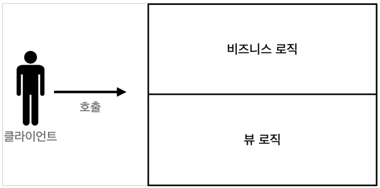
  - MVC 패턴1
    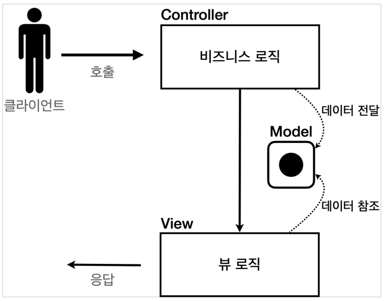
  - MVC 패턴2
    

### MVC 패턴 - 적용

서블릿을 컨트롤러로 사용하고, JSP를 뷰로 사용해서 MVC 패턴을 적용해보자.
Model은 HttpServletRequest 객체를 사용한다. request는 내부에 데이터 저장소를 가지고 있는데, `request.setAttribute()`, `request.getAttribute()` 를 사용하면 데이터를 보관하고, 조회할 수 있다.

- (참고) 조금 전 MVC 패턴 그림으로 보면, setAttribute로 값을 담고(3), 뷰에서는 getAttribute로 값을 꺼낸다.(5)
  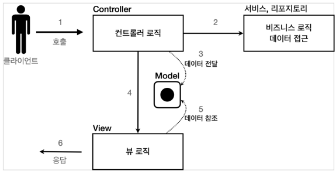

#### 회원 등록

`회원 등록 폼 - 컨트롤러`: src > main > java > hello > servlet > web > servletmvc 패키지를 생성하고, MvcMemberFormServlet 클래스를 생성하자.

```java
package hello.servlet.web.servletmvc;

@WebServlet(name = "mvcMemberFormServlet", urlPatterns = "/servlet-mvc/members/new-form")
public class MvcMemberFormServlet extends HttpServlet {

    @Override
    protected void service(HttpServletRequest request,
                           HttpServletResponse response) throws ServletException, IOException {

        String viewPath = "/WEB-INF/views/new-form.jsp";
        RequestDispatcher dispatcher = request.getRequestDispatcher(viewPath);
        dispatcher.forward(request, response);
    }
}
```

- `dispatcher.forward()` : 다른 서블릿이나 JSP로 이동할 수 있는 기능이다. 서버 내부에서 다시 호출이 발생한다.
- `redirect vs forward`: 리다이렉트는 실제 클라이언트(웹 브라우저)에 응답이 나갔다가, 클라이언트가 redirect 경로로 다시 요청한다. 따라서 클라이언트가 인지할 수 있고, URL 경로도 실제로 변경된다. (ex. 웹 브라우저에 서버로 호출이 2번 일어나는 것. 최초 웹 브라우저에서 서버를 호출하고, 서버에서 302 응답과 Location 헤더 정보를 내보내면 웹 브라우저에서 해당 경로로 서버에 재요청한다.)
- 반면에 포워드는 서버 내부에서 일어나는 호출이기 때문에 클라이언트가 전혀 인지하지 못한다. (forward는 웹 브라우저 입장에서, 한 번 호출하고 응답을 그냥 바로 받은 것이다. 웹 브라우저에서 서버를 호출하고, 서버에서 서블릿 호출하고, 뷰 호출하고 HTTP 응답 데이터 만들어서 보낸다.)

`회원 등록 폼 - 뷰`: src > main > webapp > WEB-INF 디렉토리를 생성하고, 내부에 views 디렉토리를 생성한다. 그리고 views 디렉토리 내부에 new-form.jsp 파일을 생성하자.

```jsp
<%@ page contentType="text/html;charset=UTF-8" language="java" %>
<html>
<head>
    <title>Title</title>
</head>
<body>
<!-- 상대경로 사용, [현재 URL이 속한 계층 경로 + /save]-->
<form action="save" method="post">
    username: <input type="text" name="username" />
    age:      <input type="text" name="age" />
    <button type="submit">전송</button>
</form>
</body>
</html>
```

- `/WEB-INF`: 이 경로안에 JSP가 있으면 외부에서 직접 JSP를 호출할 수 없다. 우리가 기대하는 것은 항상 컨트롤러를 통해서 JSP를 호출하는 것이다. (이전에 webapp 디렉토리 밑에 파일은 클라이언트에서 경로를 직접 접근 가능했다. 그러나 지금 만드는 파일은 외부에서 직접 접근하는 것이 아닌, 항상 컨트롤러를 거쳐서 불려지기를 원한다. 그럴때는 WEB-INF 경로에 넣으면 된다. 그러면 항상 컨트롤러를 거쳐서 내부에서 forward 등을 해야 호출된다. ( WAS 서버 룰ㆍ규칙 ))
- 여기서 form의 action을 보면 절대 경로(/ 로 시작)가 아니라 상대경로(/ 로 시작X)인 것을 확인할 수 있다. 이렇게 상대경로를 사용하면 폼 전송시 현재 URL이 속한 계층 경로 + save가 호출된다.
  - 현재 계층 경로: `/servlet-mvc/members/`
  - 결과: `/servlet-mvc/members/save`
  - ex) `/servlet-mvc/members/new-form` -> `/servlet-mvc/members/save`

#### 회원 저장

`회원 저장` - 컨트롤러: src > main > java > hello > servlet > web > servletmvc 패키지 내부에 MvcMemberSaveServlet 클래스를 생성하자.

```java
package hello.servlet.web.servletmvc;

@WebServlet(name = "mvcMemberSaveServlet", urlPatterns = "/servlet-mvc/members/save")
public class MvcMemberSaveServlet extends HelloServlet {

    private MemberRepository memberRepository = MemberRepository.getInstance();

    @Override
    protected void service(HttpServletRequest request,
                           HttpServletResponse response) throws ServletException, IOException {

        String username = request.getParameter("username");
        int age = Integer.parseInt(request.getParameter("age"));

        Member member = new Member(username, age);
        memberRepository.save(member);

        // Model에 데이터를 보관한다
        request.setAttribute("member", member);
        String viewPath = "/WEB-INF/views/save-result.jsp";
        RequestDispatcher dispatcher = request.getRequestDispatcher(viewPath);
        dispatcher.forward(request, response);
    }
}
```

- HttpServletRequest를 Model로 사용한다.
- request가 제공하는 `setAttribute()` 를 사용하면 request 객체에 데이터를 보관해서 뷰에 전달할 수 있다.
- 뷰는 `request.getAttribute()` 를 사용해서 데이터를 꺼내면 된다.

`회원 저장 - 뷰`: src > main > webapp > WEB-INF > views 디렉토리 내부에 save-result.jsp 파일을 생성하자.

```jsp
<%@ page contentType="text/html;charset=UTF-8" language="java" %>
<html>
<head>
    <title>Title</title>
</head>
<body>
성공
<ul>
    <li>id=${member.id}</li>
    <li>username=${member.username}</li>
    <li>age=${member.age}</li>
</ul>
<a href="/index.html">메인</a>
</body>
</html>
```

- `<%= request.getAttribute("member")%>` 로 모델에 저장한 member 객체를 꺼낼 수 있지만, 너무 복잡해진다.
- JSP는 ${} 문법을 제공하는데, 이 문법을 사용하면 request의 attribute에 담긴 데이터를 편리하게 조회할 수 있다.

### 회원 목록 조회

`회원 목록 조회 - 컨트롤러`: src > main > java > hello > servlet > web > servletmvc 패키지 내부에 MvcMemberListServlet 클래스를 생성하자.

```java
package hello.servlet.web.servletmvc;

@WebServlet(name = "mvcMemberListServlet", urlPatterns = "/servlet-mvc/members")
public class MvcMemberListServlet extends HttpServlet {

    private MemberRepository memberRepository = MemberRepository.getInstance();

    @Override
    protected void service(HttpServletRequest request,
                           HttpServletResponse response) throws ServletException, IOException {

        System.out.println("MvcMemberListServlet.service");
        List<Member> members = memberRepository.findAll();

        request.setAttribute("members", members);

        String viewPath = "/WEB-INF/views/members.jsp";
        RequestDispatcher dispatcher = request.getRequestDispatcher(viewPath);
        dispatcher.forward(request, response);
    }
}
```

`회원 목록 조회 - 뷰`: src > main > webapp > WEB-INF > views 디렉토리 내부에 members.jsp 파일을 생성

```jsp
<%@ page contentType="text/html;charset=UTF-8" language="java" %>
<%@ taglib prefix="c" uri="http://java.sun.com/jsp/jstl/core" %>
<html>
<head>
    <title>Title</title>
</head>
<body>
<a href="/index.html">메인</a>
<table>
    <thead>
    <th>id</th>
    <th>username</th>
    <th>age</th>
    </thead>
    <tbody>
    <c:forEach var="item" items="${members}">
        <tr>
            <td>${item.id}</td>
            <td>${item.username}</td>
            <td>${item.age}</td>
        </tr>
    </c:forEach>
    </tbody>
</table>
</body>
</html>
```

- 모델에 담아둔 members를 JSP가 제공하는 taglib기능을 사용해서 반복하면서 출력했다. `members` 리스트에서 `member` 를 순서대로 꺼내서 `item` 변수에 담고, 출력하는 과정을 반복한다.

서블릿과 JSP만으로 만든 MVC 패턴은 한계가 있다

### MVC패턴 - 한계

지금가지 만들었던 MVC 패턴에는 어떤 한계가 있는지 알아보자

- MVC 패턴을 적용한 덕분에 컨트롤러의 역할과 뷰를 렌더링 하는 역할을 명확하게 구분할 수 있다
- 특히 뷰는 화면을 그리는 역할에 충실한 덕분에, 코드가 깔끔하고 직관적이다. 단순하게 모델에서 필요한 데이터를 꺼내고, 화면을 만들면 된다.
- 그런데 컨트롤러는 딱 봐도 중복이 많고, 필요하지 않는 코드들도 많이 보인다.

**MVC컨트롤러의 단점**

- `포워드 중복`: View로 이동하는 코드가 항상 중복 호출되어야 한다. 물론 이 부분을 메서드로 공통화해도 되지만, 해당 메서드도 항상 직접 호출해야 한다.
  ```java
  RequestDispatcher dispatcher = request.getRequestDispatcher(viewPath);
  dispatcher.forwatd(request, response);
  ```
- `ViewPath에 중복`
  - prefix: `/WEB-INF/views/`
  - suffix: `.jsp`
  - (만약 디렉토리 구조가 바뀌거나 jsp가 아닌 thymeleaf같은 다른 뷰로 변경한다면 전체 코드를 다 변경해야 한다.)
- `사용하지 않는 코드`: 다음 코드를 사용할 때도 있고, 사용하지 않을 때도 있다. 특히 response는 현재 코드에서 사용되지 않는다
  - `HttpServletRequest request, HttpServletResponse response`
    - 그리고 이런 HttpServletRequest, HttpServletResponse를 사용하는 코드는 테스트 케이스를 작성하기도 어렵다
- `공통 처리가 어렵다`: 기능이 복잡해질수록 컨트롤러에서 공통으로 처리해야 하는 부분이 점점 더 많이 증가할 것이다. 단순히 공통 기능을 메서드로 뽑으면 될 것 같지만, 결과적으로 해당 메서드를 항상 호출해야 하고, 실수로 호출하지 않으면 문제가 될 것이다. 그리고 호출하는 것 자체도 중복이다.

**정리하면 공톤 처리가 어렵다는 문제가 있다.**

- 이 문제를 해결하려면 컨트롤러 호출 전에(서블릿이 호출되기 전에) 먼저 공통 기능을 처리해야 한다.<br>
  소위 수문장 역할을 하는 기능이 필요하다. (항상 문을 지키는 어떤 객체가 있고, 그 객체를 통해서 컨트롤러들이 호출되도록 한다. 그래서 그문을 지키는 객체에서 공통 처리를 해버리면 된다. -> 이러한 아이디어가 과거에도 나왔었고 이게 패턴화가 돼서, 프론트 컨트롤러 패턴이라고 한다.)
- 프론트 컨트롤러(Front Controller)패턴을 도입하면 이런 문제를 깔끔하게 해결할 수 있다. (why ? 입구를 하나로 만들기 때문에)<br>스프링 MVC의 핵심도 바로 이 프론트 컨트롤러에 있다.

## MVC 프레임워크 만들기

이전 섹션에서는 서블릿을 컨트롤러로 하고, JSP를 뷰로 해서 MVC 패턴을 도입해보았다.
그랬더니 중복 로직, 공통 처리 등의 여러가지 불편한 점이 확인되었다. 그래서 이번 섹션부터는 이런 것들을 개선하는 MVC 프레임워크를 직접 하나씩 만들어 볼 것이다.

### 프론트 컨트롤러 패턴 소개

- 프론트 컨트롤러 도입 전
  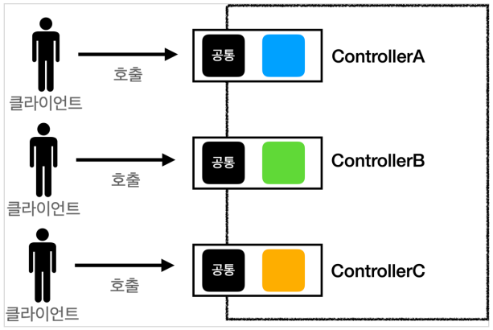
- 프론트 컨트롤러 도입 후
  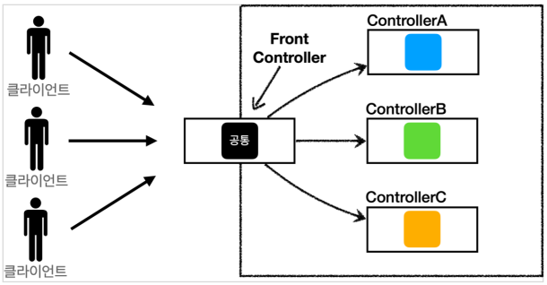
  - (공통의 관심사를 모으기 위한) 프론트 컨트롤러(서블릿)를 도입한다

**FrontController 패턴 특징**

- 프론트 컨트롤러 서블릿 하나로 클라이언트의 요청을 받음
  - 프론트 컨트롤러는 서블릿이다.(서브릿을 그냥 앞에 하나 두는 개념)
- 프론트 컨트롤러가 요청에 맞는 컨트롤러를 찾아서 호출
  - 이전에는 클라이언트의 요청이 오면 매핑되는 서블릿이 직접 호출이 되었다면, 이제는 프론트 컨트롤러가 서블릿 요청을 다 받도록 만들고, 내부에서 공통 처리 등의 작업 후, 프론트 컨트롤러에 의해서 클라이언트 요청에 해당하는 세부 컨트롤러가 호출된다.
- 입구를 하나로 만들수 있다
- 공통 처리가 가능하다
- 프론트 컨트롤러를 제외한 나머지 컨트롤러는 서블릿을 사용하지 않아도 된다.

**스프링 웹 MVC와 프론트 컨트롤러**

- 스프링 웹 MVC의 핵심도 바로 **FrontController**
- 스프링 웹 MVC의 DispatcherServlet이 FrontController 패턴으로 구현되어 있음

### 프론트 컨틀롤러 도입 - v1

프론트 컨트롤러를 단계적으로 도입해보자<br>
이번 목표는 기존 코드를 최대한 유지하면서, 프론트 컨트롤러를 도입하는 것이다.<br>
먼저 구조를 맞추어두고 점진적으로 리펙터링 해보자

**V1구조**

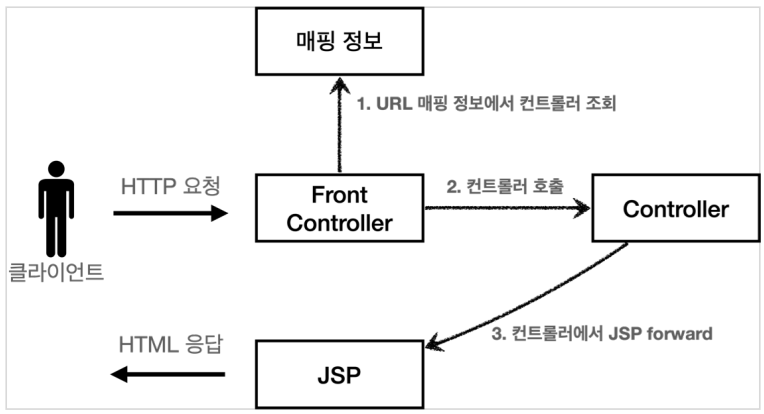

- 클라이언트가 HTTP 요청을 하면, FrontController라는 서블릿이 요청을 받는다.
- 이후, 요청 URL 정보를 가지고, 매핑 정보에서 어떤 컨트롤러를 호출해야 하는지 대상 컨트롤러를 조회하여 호출한다
- 컨트롤러는 내부 로직을 수행하고, JSP forward한다.

코드로 확인해보자

- `ControllerV1`: src > main > java > hello > servlet > web > frontcontroller 패키지를 생성하고 내부에 v1패키지를 생성한다. 그리고 내부에 ControllerV1 인터페이스를 생성해보자.

  ```java
  package hello.servlet.web.frontcontroller.v1;

  public interface ControllerV1 {

      void process(HttpServletRequest request,
                  HttpServletResponse response) throws ServletException, IOException;
  }

  ```

  - 서블릿과 비슷한 모양의 컨트롤러 인터페이스를 도입한다. 각 컨트롤러들은 이 인터페이스를 구현하면 된다. 프론트 컨트롤러는 이 인터페이스를 호출해서 구현과 관계없이 로직의 일관성을 가져갈 수 있다. (프론트 컨트롤러가 컨트롤러를 찾아서 호출할 때, 다형성을 사용해서 일관성있게 호출하기 위함.)

이제 위 인터페이스를 구현한 컨트롤러를 만들어보자. 지금 단계에서는 기존 로직을 최대한 유지하는게 핵심이다.

- `회원 등록 폼 컨트롤러`: src > main > java > hello > servlet > web > frontcontroller > v1 패키지 내부에 controller 패키지를 생성하고, controller 패키지 내부에 MemberFormControllerV1 클래스를 생성하자.

  ```java
  package hello.servlet.web.frontcontroller.v1.controller;

  public class MemberFormControllerV1 implements ControllerV1 {
      @Override
      public void process(HttpServletRequest request,
                          HttpServletResponse response) throws ServletException, IOException {
          String viewPath = "/WEB-INF/views/new-form.jsp";
          RequestDispatcher dispatcher = request.getRequestDispatcher(viewPath);
          dispatcher.forward(request, response);
      }
  }
  ```

  - 내부 로직은 기존 서블릿 코드와 같다.

- `회원 저장 컨트롤러`: src > main > java > hello > servlet > web > frontcontroller > v1 > controller 패키지 내부에 MemberSaveControllerV1 클래스를 생성하자.

  ```java
  package hello.servlet.web.frontcontroller.v1.controller;

  public class MemberSaveControllerV1 implements ControllerV1 {

      private MemberRepository memberRepository = MemberRepository.getInstance();

      @Override
      public void process(HttpServletRequest request, HttpServletResponse response) throws ServletException, IOException {
          String username = request.getParameter("username");
          int age = Integer.parseInt(request.getParameter("age"));

          Member member = new Member(username, age);
          memberRepository.save(member);

          // Model에 데이터를 보관한다
          request.setAttribute("member", member);
          String viewPath = "/WEB-INF/views/save-result.jsp";
          RequestDispatcher dispatcher = request.getRequestDispatcher(viewPath);
          dispatcher.forward(request, response);
      }
  }
  ```

  - 내부 로직은 기존 서블릿 코드와 같다.

`회원 목록 컨트롤러`: src > main > java > hello > servlet > web > frontcontroller > v1 > controller 패키지 내부에 MemberListControllerV1 클래스를 생성하자.

```java
package hello.servlet.web.frontcontroller.v1.controller;

public class MemberListControllerV1 implements ControllerV1 {

    private MemberRepository memberRepository = MemberRepository.getInstance();

    @Override
    public void process(HttpServletRequest request,
                        HttpServletResponse response) throws ServletException, IOException {

        List<Member> members = memberRepository.findAll();

        request.setAttribute("members", members);

        String viewPath = "/WEB-INF/views/members.jsp";
        RequestDispatcher dispatcher = request.getRequestDispatcher(viewPath);
        dispatcher.forward(request, response);
    }
}

```

이제 프론트 컨트롤러를 만들어보자

`프론트 컨트롤러`: src > main > java > hello > servlet > web > frontcontroller > v1 패키지 내부에 FrontControllerServletV1 클래스를 생성하자.

```java
package hello.servlet.web.frontcontroller.v1;

import java.io.IOException;
import java.util.HashMap;
import java.util.Map;

@WebServlet(name = "frontControllerServletV1", urlPatterns = "/front-controller/v1/*")
public class FrontControllerServletV1 extends HttpServlet {

    private Map<String, ControllerV1> controllerV1Map = new HashMap<>();

    public FrontControllerServletV1() {
        controllerV1Map.put("/front-controller/v1/members/new-form", new MemberFormControllerV1());
        controllerV1Map.put("/front-controller/v1/members/save", new MemberSaveControllerV1());
        controllerV1Map.put("/front-controller/v1/members", new MemberListControllerV1());
    }

    @Override
    protected void service(HttpServletRequest request,
                          HttpServletResponse response) throws ServletException, IOException {

        System.out.println("FrontControllerServletV1.service");

        String requestURI = request.getRequestURI();

        ControllerV1 controller = controllerV1Map.get(requestURI);

        if (controller == null) {
            response.setStatus(HttpServletResponse.SC_NOT_FOUND);
            return;
        }

        controller.process(request, response);
    }
}
```

- 정상적으로 동작함을 확인할 수 있다. (기존 서블릿, JSP로 만든 MVC와 동일하게 실행되는 것을 확인할 수 있다.)

### 프론트 컨트롤러 분석

- urlPatterns
  - `urlPatterns = "/front-controller/v1/\*"`
  - `/front-controller/v1`를 포함한 하위 모든 요청은 이 서블릿에서 받아들인다
  - 예) `/front-controller/v1`, `/front-controller/v1/a`, `/front-controller/v1/a/b`
- controllerMap
  - key: 매핑 URL
  - value: 호출될 컨트롤러
- service()
  - 먼저 `requestURI`를 조회해서 실제 호출할 컨트롤러 `controllerMap`에서 찾는다. 만약 없다면 404(SC_NOT_FOUND) 상태 코드를 반환한다
  - 컨트롤러를 찾고 `controller.process(request, response);`을 호출해서 해당 컨트롤러를 실행한다
- JSP
  - JSP는 이전 MVC에서 사용했던 것을 그래로 사용한다.

### View분리 - v2

모든 컨트롤러에서 뷰로 이동하는 부분에 중복이 있고, 깔끔하지 않다.

v2 구조
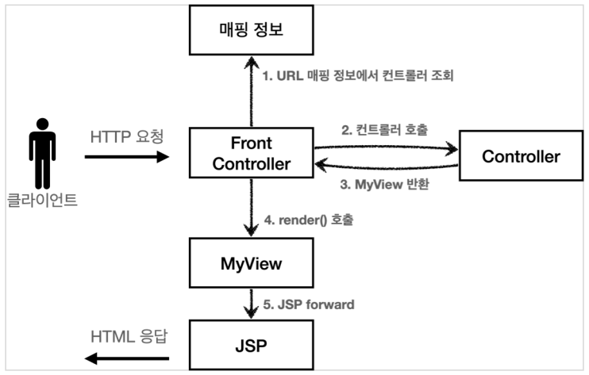

- 클라이언트가 HTTP요청을 한다
- FrontController는 매핑 정보에는 요청 URL에 따른 컨트롤러를 조회하여 호출한다.
- 과거에는 컨트롤러에서 JSP로 직접 forword 해줬지만, 이제 컨트롤러에서 FrontController에 MyView라는 객체를 만들어서 반환한다.
- FrontController가 MyView의 render()를 호출하면, MyView가 JSP로 forward한다.

설명으로 봐서는 뭔가 더 복잡해보인다. 직접 코드로 확인해보자.

`MyView`: src > main > java > hello > servlet > web > frontcontroller 패키지 내부에 MyView 클래스를 생성하자.

```java
package hello.servlet.web.frontcontroller;

public class MyView {

    private String viewPath;

    public MyView(String viewPath) {
        this.viewPath = viewPath;
    }

    public void render(HttpServletRequest request,
                       HttpServletResponse response) throws ServletException, IOException {
        RequestDispatcher dispatcher = request.getRequestDispatcher(viewPath);
        dispatcher.forward(request, response);
    }
}
```

이 코드만 봐서는 어떻게 활용하는지 아직 감이 안올 것이다. 다음 버전의 컨트롤러 인터페이스를 만들어보자. 컨트롤러가 뷰를 반환하는 특징이 있다.

`ControllerV2`: src > main > java > hello > servlet > web > frontcontroller 내부에 v2 패키지를 생성하고, v2 패키지 내부에 ControllerV2 인터페이스를 생성

```java
package hello.servlet.web.frontcontroller.v2;

public interface ControllerV2 {

    MyView process(HttpServletRequest request,
                   HttpServletResponse response) throws ServletException, IOException;
}
```

`회원 등록 폼 컨트롤러`: src > main > java > hello > servlet > web > frontcontroller > v2 > controller 패키지를 생성하고, controller 패키지 내부에 MemberFormControllerV2 클래스를 생성하자.

```java
package hello.servlet.web.frontcontroller.v2.controller;

public class MemberFormControllerV2 implements ControllerV2 {

    @Override
    public MyView process(HttpServletRequest request, HttpServletResponse response) throws ServletException, IOException {
        return new MyView("/WEB-INF/views/new-form/jsp");
    }
}
```

`회원 저장 컨트롤러`: src > main > java > hello > servlet > web > frontcontroller > v2 > controller 패키지 내부에 MemberSaveControllerV2 클래스를 생성하자.

```java
package hello.servlet.web.frontcontroller.v2.controller;

public class MemberSaveControllerV2 implements ControllerV2 {

    private MemberRepository memberRepository = MemberRepository.getInstance();

    @Override
    public MyView process(HttpServletRequest request, HttpServletResponse response) throws ServletException, IOException {
        String username = request.getParameter("username");
        int age = Integer.parseInt(request.getParameter("age"));

        Member member = new Member(username, age);
        memberRepository.save(member);

        request.setAttribute("member", member);

        return new MyView("/WEB-INF/views/save-result.jsp");
    }
}
```

`회원 목록 컨트롤러`: src > main > java > hello > servlet > web > frontcontroller > v2 > controller 패키지 내부에 MemberListControllerV2 클래스를 생성하자.

```java
package hello.servlet.web.frontcontroller.v2.controller;

public class MemberListControllerV2 implements ControllerV2 {

    private MemberRepository memberRepository = MemberRepository.getInstance();

    @Override
    public MyView process(HttpServletRequest request, HttpServletResponse response) throws ServletException, IOException {
        List<Member> members = memberRepository.findAll();

        request.setAttribute("members", members);

        return new MyView("/WEB-INF/views/members.jsp");
    }
}
```

`프론트 컨트롤러 V2`: src > main > java > hello > servlet > web > frontcontroller > v2 패키지 내부에 FrontControllerServletV2 클래스를 생성하자.

```java
package hello.servlet.web.frontcontroller.v2;

@WebServlet(name = "frontControllerServletV2", urlPatterns = "/front-controller/v2/*")
public class FrontControllerServletV2 extends HttpServlet {

    private Map<String, ControllerV2> controllerMap = new HashMap<>(); // key: url

    public FrontControllerServletV2() {
        controllerMap.put("/front-controller/v2/members/new-form", new MemberFormControllerV2());
        controllerMap.put("/front-controller/v2/members/save", new MemberSaveControllerV2());
        controllerMap.put("/front-controller/v2/members", new MemberListControllerV2());
    }

    protected void service(HttpServletRequest request,
                           HttpServletResponse response) throws ServletException, IOException {

        System.out.println("FrontControllerServletV2.service");

        String requestURI = request.getRequestURI();

        ControllerV2 controller = controllerMap.get(requestURI);

        if (controller == null) {
            response.setStatus(HttpServletResponse.SC_NOT_FOUND);
            return;
        }

        MyView view = controller.process(request, response);
        view.render(request, response);
    }
}
```

- ControllerV2의 반환 타입이 `MyView`이므로 프론트 컨트롤러는 컨트롤러의 호출 결과로 `MyView`를 반환받는다
- 그리고 `view.render()`를 호출하면 `forward`로직을 수행해서 JSP가 실행된다.

이렇게 실행하면 정상적으로 수행된 것을 볼 수 있다.

#### MyView.render()

> [!TIP]
> 참고
>
> ```java
> public void render(HttpServletRequest request, HttpServletResponse response) throws ServletException, IOException{
> RequestDispatcher dispatcher = request.getRequestDispatcher(viewPath);
> dispatcher.forward(request, response);
> }
> ```
>
> - 프론트 컨트롤러의 도입으로 `MyView`객체의 `render()`를 호출하는 부분을 모두 일관되게 처리할 수 있다. 각각의 컨트롤러는. `MyView`객체를 생성만 해서 반환하면 된다.

### Model 추가 - v3

**서블릿 종속성 제거**

- 컨트롤러 입장에서 HttpServletRequest, HttpServletResponse가 꼭 필요할까? 프론트 컨트롤러에서 **요청 파라미터 정보는 자바의 Map으로** 대신 넘기도록 하면 지금 구조에서는 컨트롤러가 서블릿 기술을 몰라도 종작할 수 있다.
- 그리고 request객체를 Model로 사용하는 대신에 **별도의 Model객체를 만들어서** 반환하면 된다.<br>우리가 구현하는 컨트롤러가 서블릿 기술을 전혀 사용하지 않도록 변경해보자. 이렇게 하면 구현 코드도 매우 단순해지고, 테스트 코드 작성이 쉽다.

**이름 중복 제거**

- 컨트롤러에서 지정하는 뷰 이름에 중복이 있는 것을 확인할 수 있다.
- 컨트롤러는 **뷰의 논리 이름**을 반환하고, 실제 물리 위치의 이름은 프론트 컨트롤러에서 처리하도록 단순화 하자. 이렇게 해다면 향후 뷰의 폴더 위치가 함께 이동해도 프론트 컨트롤러만 고치면 된다
  - `/WEB-INF/views/new-form.jsp` => **new-form**
  - `/WEB-INF/views/save-result.jsp` => **save-result**
  - `/WEB-INF/views/members.jsp` => **members**

**v3구조**

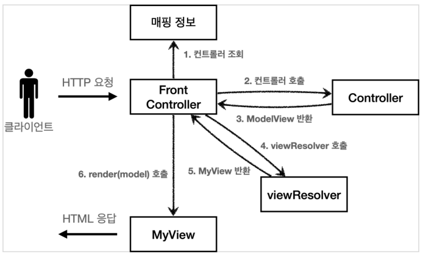

- 클라이언트에서 HTTP 요청을 보낸다
- 프론트 컨트롤러는 매핑 정보에서 요청 URL에 매핑되는 컨트롤러를 조회하여 호출한다
- 컨트롤러는 내부 로직 처리 후, Model과 View가 같이 섞여있는 ModelView라는 객체를 반환한다. (기존 v2버전에서는 View를 반환했었음)
- 프론트 컨트롤러는 (논리 이름을 물리 이름으로 변환하기 위해) viewResolver를 호출하고, MyView를 반환한다
- render()를 호출한다

**ModelView**

- 지금까지 컨트롤러에서 서블릿에 종속적인 HttpServletRequest를 사용했다. 그리고 Model도 `request.setAttribute()`를 통해 데이터를 저장하고 뷰에 전달했다
- 서블릿의 종속성을 제거하기 위해 Model을 직접 만들고, 추가로 View이름까지 전달하는 객체를 만들어보자. (이전 버전에서는 컨트롤러에서 HttpServletRequest를 사용할수 없다. 따라서 직접 `request.setAttribute()`를 호출할 수도 없다. 따라서 Model이 별도로 필요하다.)
- (참고) ModelView객체는 다른 버전에서도 사용하므로 패키지를 frontcontroller에 두자.

코드로 확인해보자

`ModelView`: src > main > java > hello > servlet > web > frontcontroller 패키지 내부에 ModelView 클래스를 생성하자.

```java
package hello.servlet.web.frontcontroller;

public class ModelView {
    private String viewName;
    private Map<String, Object> model = new HashMap<>();

    public ModelView(String viewName) {
        this.viewName = viewName;
    }

    public String getViewName() {
        return viewName;
    }

    public void setViewName(String viewName) {
        this.viewName = viewName;
    }

    public Map<String, Object> getModel() {
        return model;
    }

    public void setModel(Map<String, Object> model) {
        this.model = model;
    }
}

```

- 뷰의 이름과 뷰를 렌더링할 때 필요한 model객체를 가지고 있다. model은 단순히 map으로 되어 있으므로 컨트롤러에서 뷰에 필요한 데이터를 key, value로 넣어주면 된다

`ControllerV3`: src > main > java > hello > servlet > web > frontcontroller > v3 패키지를 생성하고, 내부에 ControllerV3 인터페이스를 생성

```java
package hello.servlet.web.frontcontroller.v3;

import hello.servlet.web.frontcontroller.ModelView;

import java.util.Map;

public interface ControllerV3 {

    ModelView process(Map<String, String> paramMap);
}
```

- 이 컨트롤러는 서블릿 기술을 전혀 사용하지 않는다. 따라서 구현이 매우 단순해지고, 테스트 코드 작성시 테스트하기가 쉽다
- HttpServletRequest가 제공하는 요청 파라미터는 프론트 컨트롤러가 paramMap에 담아서 호출해주면 된다. 응답 결과로 뷰 이름과 뷰에 전달할 Model 데이터를 포함하는 ModelView객체를 반환하면 된다

`회원 등록 폼 컨트롤러`: src > main > java > hello > servlet > web > frontcontroller > v3 > controller 패키지 생성 후, 패키지 내부에 MemberFormControllerV3 클래스를 생성하자.

```java
package hello.servlet.web.frontcontroller.v3.controller;

import hello.servlet.web.frontcontroller.ModelView;
import hello.servlet.web.frontcontroller.v3.ControllerV3;

import java.util.Map;

public class MemberFormControllerV3 implements ControllerV3 {

    @Override
    public ModelView process(Map<String, String> paramMap) {
        return new ModelView("new-form");
    }
}
```

- ModelView를 생성할 때 new-form이라는 view의 논리적인 이름을 지정한다. 실제 물리적인 이름은 프론트 컨트롤러에서 처리한다

`회원 저장 컨트롤러`: src > main > java > hello > servlet > web > frontcontroller > v3 > controller 패키지 내부에 MemberSaveControllerV3 클래스를 생성

```java
package hello.servlet.web.frontcontroller.v3.controller;

public class MemberSaveControllerV3 implements ControllerV3 {

    private MemberRepository memberRepository = MemberRepository.getInstance();

    @Override
    public ModelView process(Map<String, String> paramMap) {
        String username = paramMap.get("username");
        int age = Integer.parseInt(paramMap.get("age"));

        Member member = new Member(username, age);
        memberRepository.save(member);

        ModelView mv = new ModelView("save-result");
        mv.getModel().put("member", member);
        return mv;
    }
}
```

- `paramMap.get("username");`: 파라미터 정보는 map에 담겨있다. map에서 필요한 요청 파라미터를 조회하면 된다.
- `mv.getModel().put("member", member);`: 모델은 단순한 map이므로 모델에 뷰에서 필요한 member객체를 담고 반환한다

`회원 목록 컨트롤러`: src > main > java > hello > servlet > web > frontcontroller > v3 > controller 패키지 내부에 MemberListControllerV3 클래스를 생성하자.

```java
package hello.servlet.web.frontcontroller.v3.controller;

public class MemberListControllerV3 implements ControllerV3 {

    private MemberRepository memberRepository = MemberRepository.getInstance();

    @Override
    public ModelView process(Map<String, String> paramMap) {
        List<Member> members = memberRepository.findAll();

        ModelView mv = new ModelView("members");
        mv.getModel().put("members", members);

        return mv;
    }
}
```

`MyView 수정`: Model에 있는 정보를 request에 넣어주기 위한 메서드를 추가한다. (jsp는 request.getAttribute를 사용해서 데이터를 조회한다.(JSP외 다른 뷰 템플릿들은 다를 수 있다.))

```java
package hello.servlet.web.frontcontroller;

import jakarta.servlet.RequestDispatcher;
import jakarta.servlet.ServletException;
import jakarta.servlet.http.HttpServletRequest;
import jakarta.servlet.http.HttpServletResponse;

import java.io.IOException;
import java.util.Map;

public class MyView {

    private String viewPath;

    public MyView(String viewPath) {
        this.viewPath = viewPath;
    }

    public void render(HttpServletRequest request,
                       HttpServletResponse response) throws ServletException, IOException {
        RequestDispatcher dispatcher = request.getRequestDispatcher(viewPath);
        dispatcher.forward(request, response);
    }

    public void render(Map<String, Object> model,
                       HttpServletRequest request, HttpServletResponse response) throws ServletException, IOException {
        modelToRequestAttribute(model, request);
        RequestDispatcher dispatcher = request.getRequestDispatcher(viewPath);
        dispatcher.forward(request, response);
    }

    private static void modelToRequestAttribute(Map<String, Object> model, HttpServletRequest request) {
        model.forEach((key, value) -> request.setAttribute(key, value));
    }
}
```

`프론트 컨트롤러 V3`: src > main > java > hello > servlet > web > frontcontroller 패키지 내부에 FrontControllerServletV3 클래스를 생성

```java
package hello.servlet.web.frontcontroller.v3;

import hello.servlet.web.frontcontroller.ModelView;
import hello.servlet.web.frontcontroller.MyView;
import hello.servlet.web.frontcontroller.v3.controller.MemberFormControllerV3;
import hello.servlet.web.frontcontroller.v3.controller.MemberListControllerV3;
import hello.servlet.web.frontcontroller.v3.controller.MemberSaveControllerV3;
import jakarta.servlet.ServletException;
import jakarta.servlet.annotation.WebServlet;
import jakarta.servlet.http.HttpServlet;
import jakarta.servlet.http.HttpServletRequest;
import jakarta.servlet.http.HttpServletResponse;

import java.io.IOException;
import java.util.HashMap;
import java.util.Map;

@WebServlet(name = "frontControllerServletV3", urlPatterns = "/front-controller/v3/*")
public class FrontControllerServletV3 extends HttpServlet {

    private Map<String, ControllerV3> controllerMap = new HashMap<>();

    public FrontControllerServletV3() {
        controllerMap.put("/front-controller/v3/members/new-form", new MemberFormControllerV3());
        controllerMap.put("/front-controller/v3/members/save", new MemberSaveControllerV3());
        controllerMap.put("/front-controller/v3/members", new MemberListControllerV3());
    }

    @Override
    protected void service(HttpServletRequest request,
                           HttpServletResponse response) throws ServletException, IOException {

        String requestURI = request.getRequestURI();

        ControllerV3 controller = controllerMap.get(requestURI);
        if (controller == null) {
            response.setStatus(HttpServletResponse.SC_NOT_FOUND);
            return;
        }

        Map<String, String> paramMap = createParamMap(request);
        ModelView mv = controller.process(paramMap);

        String viewName = mv.getViewName();
        MyView view = viewResolver(viewName);

        view.render(mv.getModel(), request, response);
    }

    private Map<String, String> createParamMap(HttpServletRequest request) {
        Map<String, String> paramMap = new HashMap<>();
        request.getParameterNames().asIterator()
                .forEachRemaining(paramName -> paramMap.put(paramName, request.getParameter(paramName)));
        return paramMap;
    }

    private MyView viewResolver(String viewName) {
        return new MyView("/WEB-INF/views/" + viewName + ".jsp");
    }
}
```

- `createParamMap()`: HttpServletRequest에서 파라미터 정보를 꺼내서 Map으로 변환한다. 그리고 해당 Map(`paramMap`)을 컨트롤러에 전달하면서 호출한다.
- (참고) 프론트 컨트롤러가 하는 일은 더 많아졌지만, 실제 구현한 컨트롤러는 더 편리해졌다.

**뷰 리졸버**

- `MyView view = viewResolver(viewName)`
  - 컨트롤러가 반환한 논리 뷰 이름을 실제 물리. 뷰 경로로 변경한다. 그리고 실제 물리 경로가 있는 MyView객체를 반환한다.
  - 논리 뷰 이름: `members`
  - 물리 뷰 경로: `/WEB-INF/views/members.jsp`
- `view.render(mv.getModel(), request, response)`
  - 뷰 객체를 통해서 HTML 화면을 렌더링 한다
  - 뷰 객체의 render()는 모델 정보도 함께 받는다
  - JSP는 `request.getAttribute()`로 데이터를 조회하기 때문에, 모델의 데이터를 꺼내서 `request.setAttribute()`로 담아둔다.
  - JSP로 포워드해서 JSP를 렌더링 한다.

실행하면 정상적으로 실행이 된다

### 단순하고 실용적인 컨트롤러 - v4

- 앞서 만든 v3 컨트롤러는 서블릿 종속성을 제거하고 뷰 경로의 중복을 제거하는 등, 잘 설계된 컨트롤러이다. 그런데 실제 컨트롤러 인터페이스를 구현하는 개발자 입장에서 보면, 항상 ModelView객체를 생성하고 반환해야 하는 부분이 조금은 번거롭다
- 좋은 프레임워크는 아키텍처도 중요하지만, 그와 더불어 실제 개발하는 개발자가 단순하고 편리하게 사용할 수 있어야 한다. 소위 실용성이 있어야 한다.

이번에는 v3를 조금 변경해서 실제 구현하는 개발자들이 매우 편리하게 개발할 수 있는 v4버전을 개발해보자

#### v4구조

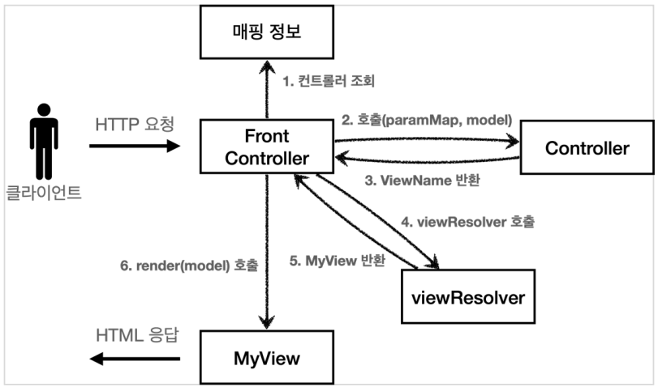

- 기본적인 구조는 v3와 같다. 대신에 컨트롤러가 `ModelView`를 반환하지 않고, `ViewName`만 반환한다.

`ControllerV4`: src > main > java > hello > servlet > web > frontcontroller > v4 패키지를 생성하고, 내부에 ControllerV4 인터페이스를 생성하자.

```java
package hello.servlet.web.frontcontroller.v4;

import java.util.Map;

public interface ControllerV4 {

    String process(Map<String, String> paramMap, Map<String, Object> model);
}
```

- 이번 버전은 인터페이스에 ModelView가 없다. model객체는 파라미터로 전달되기 때문에 그냥 사용하면 되고, 결과로 뷰의 이름만 반환해주면 된다.

`회원 등록 폼 컨트롤러`: src > main > java > hello > servlet > web > frontcontroller > v4 > controller 패키지를 생성하고, 내부에 MemberFormControllerV4 클래스를 생성하자.

```java
package hello.servlet.web.frontcontroller.v4.controller;

import hello.servlet.web.frontcontroller.v4.ControllerV4;

import java.util.Map;

public class MemberFormControllerV4 implements ControllerV4 {
    @Override
    public String process(Map<String, String> paramMap, Map<String, Object> model) {
        return "new-form";
    }
}
```

- 정말 단순하게 `new-form`이라는 뷰의 논리 이름만 반환하면 된다

`회원 저장 컨트롤러`: src > main > java > hello > servlet > web > frontcontroller > v4 > controller 패키지 내부에 MemberSaveControllerV4 클래스를 생성하자

```java
package hello.servlet.web.frontcontroller.v4.controller;

import hello.servlet.domain.member.Member;
import hello.servlet.domain.member.MemberRepository;
import hello.servlet.web.frontcontroller.v4.ControllerV4;

import java.util.Map;

public class MemberSaveControllerV4 implements ControllerV4 {

    private MemberRepository memberRepository = MemberRepository.getInstance();

    @Override
    public String process(Map<String, String> paramMap, Map<String, Object> model) {

        String username = paramMap.get("username");
        int age = Integer.parseInt(paramMap.get("age"));

        Member member = new Member(username, age);
        Member result = memberRepository.save(member);

        model.put("member", result);

        return "save-result";
    }
}
```

- `model.put("member", member)`: 모델이 파라미터로 전달되기 때문에, 모델을 직접 생성하지 않아도 된다.

`회원 조회 컨트롤러`: src > main > java > hello > servlet > web > frontcontroller > v4 > controller 패키지 내부에 MemberListControllerV4 클래스를 생성하자.

```java
package hello.servlet.web.frontcontroller.v4.controller;

import hello.servlet.domain.member.Member;
import hello.servlet.domain.member.MemberRepository;
import hello.servlet.web.frontcontroller.v4.ControllerV4;

import java.util.List;
import java.util.Map;

public class MemberListControllerV4 implements ControllerV4 {

    private MemberRepository memberRepository = MemberRepository.getInstance();

    @Override
    public String process(Map<String, String> paramMap, Map<String, Object> model) {
        List<Member> members = memberRepository.findAll();
        model.put("members", members);

        return "members";
    }
}
```

`프론트 컨트롤러 v4`: src > main > java > hello > servlet > web > frontcontroller > v4 패키지 내부에 FrontControllerServletV4 클래스를 생성하자.

```java
package hello.servlet.web.frontcontroller.v4;

@WebServlet(name = "frontControllerServletV4", urlPatterns = "/front-controller/v4/*")
public class FrontControllerServletV4 extends HttpServlet {

    private Map<String, ControllerV4> controllerMap = new HashMap<>(); // key: url

    public FrontControllerServletV4() {
        controllerMap.put("/front-controller/v4/members/new-form", new MemberFormControllerV4());
        controllerMap.put("/front-controller/v4/members/save", new MemberSaveControllerV4());
        controllerMap.put("/front-controller/v4/members", new MemberListControllerV4());
    }

    @Override
    protected void service(HttpServletRequest request,
                           HttpServletResponse response) throws ServletException, IOException {

        String requestURI = request.getRequestURI();

        ControllerV4 controller = controllerMap.get(requestURI);
        if (controller == null) {
            response.setStatus(HttpServletResponse.SC_NOT_FOUND);
            return;
        }

        Map<String, String> paramMap = createParamMap(request);
        Map<String, Object> model = new HashMap<>();

        String viewName = controller.process(paramMap, model);

        MyView myView = viewResolver(viewName);
        myView.render(model, request, response);
    }

    private Map<String, String> createParamMap(HttpServletRequest request) {
        Map<String, String> paramMap = new HashMap<>();
        request.getParameterNames().asIterator()
                .forEachRemaining(paramName -> paramMap.put(paramName, request.getParameter(paramName)));
        return paramMap;
    }

    private MyView viewResolver(String viewPath) {
        return new MyView("/WEB-INF/views/" + viewPath + ".jsp");
    }
}
```

- FrontControllerServletV4는 사실 이전 버전과 거의 동일하다

**모델 객체 전달**

- `Map model = new HashMap<>();`
  - 모델 객체를 프론트 컨트롤러에서 생성해서 넘겨준다. 컨트롤러에서 모델 객체에 값을 담으면 여기에 그대로 담겨있게 된다.

**뷰의 논리 이름을 직접 반환**

- 참고
  ```java
  String viewName = controller.process(paramMap, model);
  MyView myView = viewResolver(viewName);
  ```
  - 컨트롤러가 직접 뷰의 논리 이름을 반환하므로 이 값을 사용해서 실제 물리 뷰를 찾을 수 있다.

> [!NOTE]
>
> - 이번 버전의 컨트롤러는 매우 단순하고 실용적이다. 기존 구조에서 모델을 파라미터로 넘기고, 뷰의 논리 이름을 반환한다는 작은 아이디어를 적용했을 뿐인데, 컨트롤러를 구현하는 개발자 입장에서 보면 이제 군더디기 없는 코드를 작성할 수 있다
> - 또한 중요한 사실은 여기까지 한번에 온 것이 아니라는 점이다. 프레임워크가 점진적으로 발전하는 과정 속에서 이런 방법도 찾을 수 있었다.
> - 프레임워크나 공통 기능이 수고로워야 사용하는 개발자가 편리해진다.

### 유연한 컨트롤러1 - v5

- 만약 어떤 개발자는 `ControllerV3` 방식으로 개발하고 싶고, 어떤 개발자는 `ControllerV4`방식으로 개발하고 싶다면 어떻게 해야할까?

```java
public interface ControllerV3 {
  ModelView process(Map<String, String> paramMap);
}

public interface ControllerV4 {

    String process(Map<String, String> paramMap, Map<String, Object> model);
}

```

- 지금까지 우리가 개발한 내용을 보면, controllerMap에 ControllerV1 ~ V4가 직접 명시되어있다.<br>따라서 구조상 controllerMap에 다른 버전의 컨트롤러는 넣을 수 없다.
  - ControllerV3는 타입이 맞이 않아 넣을 수 없다.

그러면 이러한 문제르 ㄹ어떻게 해결할 수 있을까?

**어댑터 패턴**

- 지금까지 우리가 개발한 프톤트 컨트롤러는 한가지 방식의 컨트롤러 인터페이스만 사용할 수 있다.<br> `ControllerV3`, `ControllerV4`는 완전히 다른 인터페이스이다. 따라서 호환이 불가능하다.<br>이럴 때 사용하는 것이 바로 어댑터이다.
- 어댑터 패턴을 사용해서 프론트 컨트롤러가 다양한 방식의 컨트롤러를 처리할 수 있도록 변경해보자

**V5 구조**


- 클라이언트에서 HTTP요청을 보낸다
- 프론트 컨트롤러는 핸들러 매핑 정보에서 핸들러를 조회한다. (핸들러 매핑 정보가 V4라 가정하자)
- 핸들러를 처리할 수 있는 핸들러 어댑터 조회.(V4를 처리할 수 있는 어댑터를 찾아온다)
- (기존에는 FrontController에서 핸들러를 바로 호출했지만) 이제는 중간에 핸들러 어댑터를 톨해서 호출한다.(핸들러 어댑터한테 handler(컨트롤러)를 넘겨준다. 그러면 어댑터가 대신 호출해서 결과를 받는다 그리고 FrontController에게 ModelView를 반환해준다)
- 나머지 프로세스는 동일하다

- **핸들러 어댑터**(= 핸들러를 처리해 주는 어댑터): 중간에 어댑터 역할을 하는 어댑터가 추가되었는데 이름이 핸들러 어댑터이다. 여기서 **어댑터 역할을 해주는 덕분에 다양한 종류의 컨트롤러를 호출할 수 있다.**
- **핸들러**: 컨트롤러의 이름을 더 넓은 범위인 핸들러로 변경했다. 그 이유는 이제 어댑터가 있기 때문에 꼭 컨트롤러 개념 뿐만 아니라, 어떠한 것이든 해당하는 종류의 어댑터만 있으면 다 처리할 수 있기 때문이다.

**MyHandlerAdapter**

src > main > java > hello > servlet > web > frontcontroller 패키지 내부에 v5 패키지를 생성하고, v5 패키지 내부에 MyHandlerAdapter 인터페이스를 생성하자. (어댑터는 이렇게 구현해야 한다는 어댑터용 인터페이스이다.)

```java
package hello.servlet.web.frontcontroller.v5;

public interface MyHandlerAdapter {

    boolean supports(Object handler);

    ModelView handle(HttpServletRequest request,
                     HttpServletResponse response, Object handler) throws ServletException, IOException;
}
```

- `boolean supports(Object handler);`
  - handler는 컨트롤러를 말한다
  - 어댑터가 해당 컨트롤러를 처리할 수 있는지 판단하는 메서드다.
- `ModelView handle(HttpServletRequest request, HttpServletResponse response, Object handler)`
  - 어댑터는 실제 컨트롤러를 호출하고, 그 결과로 ModelView를 반환해야 한다
  - 실제 컨트롤러가 ModelView를 반환하지 못하면, 어댑터가 ModelView를 직접 생성해서라도 반환해야 한다.
  - 이전에는 프론트 컨트롤러가 실제 컨트롤러를 호출했지만 이제는 이 ㄴ어댑터를 통해서 실제 컨트롤러가 호출된다.

실제 어댑터를 구현해보자<br>
먼저 ControllerV3를 지원하는 어댑터를 구현하자

`ControllerV3HandlerAdapter`: src > main > java > hello > servlet > web > frontcontroller > v5 > adapter 패키지를 생성하고, 내부에 ControllerV3HandlerAdapter 클래스를 생성하자.

```java
package hello.servlet.web.frontcontroller.v5.adapter;

import hello.servlet.web.frontcontroller.ModelView;
import hello.servlet.web.frontcontroller.v3.ControllerV3;
import hello.servlet.web.frontcontroller.v5.MyHandlerAdapter;
import jakarta.servlet.ServletException;
import jakarta.servlet.http.HttpServletRequest;
import jakarta.servlet.http.HttpServletResponse;

import java.io.IOException;
import java.util.HashMap;
import java.util.Map;

public class ControllerV3HandlerAdapter implements MyHandlerAdapter {
    @Override
    public boolean supports(Object handler) {
        return (handler instanceof ControllerV3);
    }

    @Override
    public ModelView handle(HttpServletRequest request,
                            HttpServletResponse response, Object handler) throws ServletException, IOException {

        ControllerV3 controller = (ControllerV3) handler;

        Map<String, String> paramMap = createParamMap(request);
        ModelView mv = controller.process(paramMap);

        return mv;
    }

    private Map<String, String> createParamMap(HttpServletRequest request) {
        Map<String, String> paramMap = new HashMap<>();
        request.getParameterNames().asIterator()
                .forEachRemaining(paramName -> paramMap.put(paramName, request.getParameter(paramName)));
        return paramMap;
    }
}
```

- handler를 컨트롤러 V3로 변환한 다음에 V3 형식에 맞도록 호출한다.
- `supports()`를 통해 `ControllerV3`만 지원하기 때문에 타입 변환은 걱정없이 실행해도 된다.
- ControllerV3는 ModelView를 반환하므로 그대로 ModelView를 반환하면 딘다.

`FrontControllerServletV5`: src > main > java > hello > servlet > web > frontcontroller > v5 패키지 내부에 FrontControllerServletV5 클래스를 생성하자.

```java
package hello.servlet.web.frontcontroller.v5;

import hello.servlet.web.frontcontroller.ModelView;
import hello.servlet.web.frontcontroller.MyView;
import hello.servlet.web.frontcontroller.v3.controller.MemberFormControllerV3;
import hello.servlet.web.frontcontroller.v3.controller.MemberListControllerV3;
import hello.servlet.web.frontcontroller.v3.controller.MemberSaveControllerV3;
import hello.servlet.web.frontcontroller.v5.adapter.ControllerV3HandlerAdapter;
import jakarta.servlet.ServletException;
import jakarta.servlet.annotation.WebServlet;
import jakarta.servlet.http.HttpServlet;
import jakarta.servlet.http.HttpServletRequest;
import jakarta.servlet.http.HttpServletResponse;

import java.io.IOException;
import java.util.ArrayList;
import java.util.HashMap;
import java.util.List;
import java.util.Map;

@WebServlet(name = "frontControllerV5", urlPatterns = "/front-controller/v5/*")
public class FrontControllerServletV5 extends HttpServlet {

    private final Map<String, Object> handlerMappingMap = new HashMap<>();
    private final List<MyHandlerAdapter> handlerAdapters = new ArrayList<>();

    public FrontControllerServletV5() {
        initHandlerMappingMap();
        initHandlerAdapters();
    }

    private void initHandlerMappingMap() {
        handlerMappingMap.put("/front-controller/v5/v3/members/new-form", new MemberFormControllerV3());
        handlerMappingMap.put("/front-controller/v5/v3/members/save", new MemberSaveControllerV3());
        handlerMappingMap.put("/front-controller/v5/v3/members", new MemberListControllerV3());
    }

    private void initHandlerAdapters() {
        handlerAdapters.add(new ControllerV3HandlerAdapter());
    }

    @Override
    protected void service(HttpServletRequest request,
                           HttpServletResponse response) throws ServletException, IOException {
        Object handler = getHandler(request);
        if (handler == null) {
            response.setStatus(HttpServletResponse.SC_NOT_FOUND);
            return;
        }

        MyHandlerAdapter adapter = getHandlerAdapter(handler);

        ModelView mv = adapter.handle(request, response, handler);

        String viewName = mv.getViewName();
        MyView view = viewResolver(viewName);

        view.render(mv.getModel(), request, response);
    }

    private MyHandlerAdapter getHandlerAdapter(Object handler) {
        MyHandlerAdapter a;
        for (MyHandlerAdapter adapter : handlerAdapters) {
            if (adapter.supports(handler)) {
                return adapter;
            }
        }

        throw new IllegalArgumentException("handler adapter를 찾을 수 없습니다. handler = " + handler);
    }

    private Object getHandler(HttpServletRequest request) {
        String requestURI = request.getRequestURI();
        return handlerMappingMap.get(requestURI);
    }

    private MyView viewResolver(String viewName) {
        return new MyView("/WEB-INF/views/" + viewName + ".jsp");
    }
}
```

- **컨트롤러(Controller) -> 핸들러(Handler)**
  - 이전에는 컨트로러를 직접 매핑해서 사용했다. 그런데 이제는 어댑터를 사용하기 때문에, 컨트롤러 뿐만 아니라 어댑터가 지원하기만 하면, 어떤 것이라도 URL에 매핑해서 사용할 수 있다. 그래서 이름을 컨트롤러에서 더 넓은 범위의 핸들러로 변경했다.

#### FrontControllerServlerV5 분석

- **생성자**
  ```java
  public FrontControllerServletV5() {
    initHandlerMappingMap(); // 핸들러 매핑 최고하
    initHandlerAdapters(); // 어댑터 초기화
  }
  ```
  - 생성자는 핸들러 매핑과 어댑터를 초기화(등록)한다
- **매핑 정보**
  ```java
  private final Map<String, Object> handlerMappingMap = new HashMap<>();
  ```
  - 매핑 정보의 값이 `ControllerV3`, `ControllerV4`같은 인터페이스에서 아무 값이나 받을 수 있는 `Object`로 변경되었다
- **핸들러 매핑**

  ```java
  Object handler = getHandler(request);

  private Object getHandler(HttpServletRequest request) {
    String requestURI = request.getRequestURI();
    return handlerMappingMap.get(requestURI);
  }
  ```

  - 핸들러 매핑 정보인 `handlerMappingMap`에서 URL에 매핑된 핸들러(컨트롤러)객체를 찾아서 반환한다

- **핸들러를 처리할 수 있는 어댑터 조회**

  ```java
  MyHandlerAdapter adapter = getHandlerAdapter(handler);

  private MyHandlerAdapter getHandlerAdapter(Object handler) {
    MyHandlerAdapter a;
    for (MyHandlerAdapter adapter : handlerAdapters) {
            if (adapter.supports(handler)) {
                return adapter;
            }
        }
    throw new IllegalArgumentException("handler adapter를 찾을 수 없습니다. handler = " + handler);
  }
  ```

  - `handler`를 처리할 수 있는 어댑터를 `adapter.supports(handler)`를 통해서 찾는다
  - handler가 `ControllerV3` 인터페이스를 구현했다면, `ControllerV3HandlerAdapter`객체가 반환된다.

- **어댑터 호출**
  ```java
  ModelView mv = adapter.handle(request, response, handler);
  ```
  - 어댑터의 `handle(request, response, handler)`메서드를 통해 실제 어댑터가 호출된다.
  - 어댑터는 handler(컨트롤러)를 호출하고 그 결과를 어댑터에 맞추어 반환한다
  - `ControllerV3HandlerAdapter`의 경우 어댑터의 모양과 컨트롤러의 모양이 유사해서 변환 로직이 단순하다

> [!NOTE]
> 지금은 V3 컨트롤러를 사용할 수 있는 어댑터와 `ControllerV3`만 들어 있어서 크게 감흥이 없을 것이다. `ControllerV4`를 사용할 수 있도록 기능을 추가해보자

### 유연한 컨트롤러2 - v5

FrontControllerServletV5에 ControllerV4 기능도 추가해보자

- **FrontControllerServletV5**클래스에 `ControllerV4`기능도 추가해보자

  ```java
      private void initHandlerMappingMap() {
          handlerMappingMap.put("/front-controller/v5/v3/members/new-form", new MemberFormControllerV3());
          handlerMappingMap.put("/front-controller/v5/v3/members/save", new MemberSaveControllerV3());
          handlerMappingMap.put("/front-controller/v5/v3/members", new MemberListControllerV3());

          // V4 추가
          handlerMappingMap.put("/front-controller/v5/v4/members/new-form", new MemberFormControllerV4());
          handlerMappingMap.put("/front-controller/v5/v4/members/save", new MemberSaveControllerV4());
          handlerMappingMap.put("/front-controller/v5/v4/members", new MemberListControllerV4());
      }

      private void initHandlerAdapters() {
          handlerAdapters.add(new ControllerV3HandlerAdapter());
          handlerAdapters.add(new ControllerV4HandlerAdapter());
      }
  ```

  핸들러 매핑( handlerMappingMap )에 ControllerV4 를 사용하는 컨트롤러를 추가하고, 해당 컨트롤러를 처리할 수 있는 어댑터인 ControllerV4HandlerAdapter 도 추가하자.

`ControllerV4HandlerAdapter`: src > main > java > hello > servlet > web > frontcontroller > v5 > adapter 패키지 내부에 ControllerV4HandlerAdapter 클래스를 생성하자.

```java
package hello.servlet.web.frontcontroller.v5.adapter;

import hello.servlet.web.frontcontroller.ModelView;
import hello.servlet.web.frontcontroller.v4.ControllerV4;
import hello.servlet.web.frontcontroller.v5.MyHandlerAdapter;
import jakarta.servlet.ServletException;
import jakarta.servlet.http.HttpServletRequest;
import jakarta.servlet.http.HttpServletResponse;

import java.io.IOException;
import java.util.HashMap;
import java.util.Map;

public class ControllerV4HandlerAdapter implements MyHandlerAdapter {
    @Override
    public boolean supports(Object handler) {
        return (handler instanceof ControllerV4);
    }

    @Override
    public ModelView handle(HttpServletRequest request,
                            HttpServletResponse response, Object handler) throws ServletException, IOException {

        ControllerV4 controller = (ControllerV4) handler;

        Map<String, String> paramMap = createParamMap(request);
        Map<String, Object> model = new HashMap<>();

        String viewName = controller.process(paramMap, model);

        ModelView mv = new ModelView(viewName);
        mv.setModel(model);

        return mv;
    }

    private Map<String, String> createParamMap(HttpServletRequest request) {
        Map<String, String> paramMap = new HashMap<>();
        request.getParameterNames().asIterator()
                .forEachRemaining(paramName -> paramMap.put(paramName, request.getParameter(paramName)));
        return paramMap;
    }
}

```

하나씩 분석해보자

- **support(Object handler)**
  ```java
  @Override
  public boolean supports(Object handler) {
      return (handler instanceof ControllerV4);
  }
  ```
  - `handler`가 `ControllerV4`인 경우에만 처리하는 어뎁터이다.
- **실행 로직**

  ```java
  ControllerV4 controller = (ControllerV4) handler;

  Map<String, String> paramMap = createParamMap(request);
  Map<String, Object> model = new HashMap<>();

  String viewName = controller.process(paramMap, model);
  ```

  - handler를 ControllerV4로 캐스팅 하고, paramMap, model을 만들어서 해당 컨트롤러를 호출한다. 그리고 viewName을 반환한다.

- **어댑터 변환**

  ```java
  ModelView mv = new ModelView(viewName);
  mv.setModel(model);

  return mv;
  ```

  - 어댑터에서 이 부분이 단순하지만 중요한 부분이다.
  - 어댑터가 호출하는 `ControllerV4`는 뷰의 이름을 반환한다. 그런데 어댑터는 뷰의 이름이 아니라 `ModelView`를 만들어서 반환해야 한다. 여기서 어댑터가 꼭 필요한 이유가 나온다.
  - `ControllerV4`는 뷰의 이름을 반환했지만, 어댑터는 이것을 ModelView로 만들어서 형식을 맞추어 반환한다.

- **어댑터와 ControllerV4**

  ```java
  public interface ControllerV4 {
    String process(Map<String, String> paramMap, Map<String, Object> model);
  }

  public interface MyHandlerAdapter {

  }
  ```

> [!TIP]
>
> - 여기에는 써있지는 않지만, FrontControllerServletV5 클래스에서 초기화 설정한는 부분(initHandlerMappingMap(), initHandlerAdapters())만 밖으로 빼서 외부에서 주입하는 방식으로 변경하면, FrontControllerServletV5는 완벽하게 OCP를 지킬 수 있다. (Controller 버전이 늘어나서 기능이 확장되더라도, FrontControllerServletV5 코드의 변경은 없는 것이다.)
> - FrontControllerServletV5는 핸들러 어댑터 인터페이스에만 의존하고있다. 따라서 구현 클래스로 뭐가 되던지 상관이 없다.

### 정리

지금까지 v1 ~ v5로 점진적으로 MVC 프레임워크를 발전시켜 왔다. 정리해보면 다음과 같다.

> [!NOTE]
>
> - **V1: 프론트 컨트롤러를 도입**
>   - 기존 구조를 최대한 유지하면서 프론트 컨트롤러를 도입
> - **V2: View 분류**
>   - 단순 반복되는 뷰 로직 분리
> - **V3: Model**
>   - 서블릿 종속성 제거
>   - 뷰 이름 중복 제거
> - **V4: 단순하고 실용적인 컨트롤러**
>   - v3와 거의 비슷
>   - 구현 입장에서 ModelView를 직접 생성해서 반환하지 않도록 편리한 인터페이스 제공
> - **V5: 유연한 컨트롤러**
>   - 어댑터 도입
>   - 어댑터를 추가해서 프레임워크를 유연하고 확장성 있게 설계

여기에 애노테이션을 사용해서 컨트롤러를 더 편리하게 발전시킬 수도 있다. 만약 애노테이션을 사용해서 컨트롤러를 편리하게 사용할 수 있게 하려면 어떻게 해야할까? 바로 애노테이션을 지원하는 어댑터를 추가하면 된다!

다형성과 어댑터 덕분에 기존 구조를 유지하면서, 프레임워크의 기능을 확장할 수 있다.

**스프링 MVC**

- 여기서 더 발전시키면 좋겠지만, 스프링 MVC의 핵심 구조를 파악하는데 필요한 부분은 모두 만들어보았다. 사실은 지금까지 작성한 코드는 MVC 프레임워크의 핵심 코드의 축약 버전이고, 구조도 거의 같다.

## 스프링 MVC - 구조 이해

이번 섹터부터는 스프링 MVC의 구조에 대해서 알아보자<br>
(이전 섹터에서 직접 만들었던 MVC 프레임워크와 비교해보면서 학습해보자)

### 스프링 MVC 전체 구조

직접 만든 MVC 프레임워크와 스프링 MVC를 비교해보자

**직접 만든 MVC 프레임워크 구조**<br>
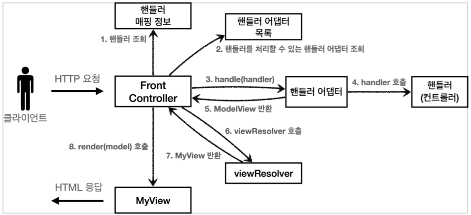

**SpringMVC 구조**<br>
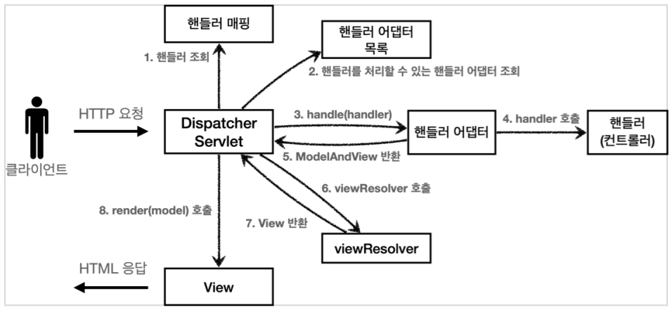

- FrontController -> DispatcherServlet
- handlerMappngMap -> HandlerMapping
- MyHandlerAdapter -> HandlerAdapter
- ModelView -> ModelAndView
- viewResolver -> ViewResolver
- MyView -> View
- 참고
  - 우리는 viewResolver를 메서드로 만들었지만, 스프링에서 ViewResolver는 인터페이스로 만들어져있다. (확장성이 높음)
  - 스프링의 View는 인터페이스로 만들어져있다. (확장성이 높음)

**먼저 DispatcherServlet의 구조를 살펴보자**<br>
(`org.springframework.web.servlet.DispatcherServlet`)

- 스프링 MVC도 프론트 컨트롤러 패턴으로 구현되어 있다.
- 스프링 MVC의 프론트 컨트롤러가 다시 디스패처 서블릿(DispatcherServlet)이다.
- 그리고 이 디스패처 서블릿이 바로 스프링 MVC의 핵심이다.
- DispacherServlet 서블릿 등록
  - DispacherServlet도 부모 클래스에서 HttpServlet을 상속 받아서 사용하고, 서블릿으로 동작한다
    - 상속 관계: DispatcherServlet -> FrameworkServlet -> HttpServletBean -> HttpServlet
  - 스프링 부트는 DispacherServlet을 서블릿으로 자동으로 등록하면서 모든 경로를 (urlPattern="/")에 대해서 매핑한다.
    - (참고) 더 자세한 경로가 우선순위가 높다. 그래서 기존에 등록한 서블릿도 함께 등록된다.
- 요청 흐름
  - 서블릿이 호출되면 `HttpServlet`이 제공하는 `service()`가 호출된다.
  - 스프링 MVC는 `DispatcherServlet`이 부모인 `FrameworkServlet`에서 `service()`를 오버라이드 해두었다.
  - `FrameworkServlet.service()`를 시작으로 여러 메서드가 호출되면서 `DispacherServlet.doDispatch()`가 호출된다.
  - 지금부터 DispacherServlet의 핵심인 doDispatch() 코드를 분석해보자. 최대한 간단히 설명하기 위해 예외처리, 인터셉터 기능은 제외했다.

**DispacherServlet.doDispatch()**

```java
protected void doDispatch(HttpServletRequest request, HttpServletResponse
response) throws Exception {
  HttpServletRequest processedRequest = request;
	HandlerExecutionChain mappedHandler = null;
	ModelAndView mv = null;

	// 1. 핸들러 조회
	mappedHandler = getHandler(processedRequest);
	if (mappedHandler == null) {
		noHandlerFound(processedRequest, response);
		return;
	}

	// 2. 핸들러 어댑터 조회 - 핸들러를 처리할 수 있는 어댑터
	HandlerAdapter ha = getHandlerAdapter(mappedHandler.getHandler());

	// 3. 핸들러 어댑터 실행 -> 4. 핸들러 어댑터를 통해 핸들러 실행 -> 5. ModelAndView 반환
	mv = ha.handle(processedRequest, response, mappedHandler.getHandler());
	processDispatchResult(processedRequest, response, mappedHandler, mv, dispatchException);
}

private void processDispatchResult(HttpServletRequest request,
HttpServletResponse response, HandlerExecutionChain mappedHandler, ModelAndView
mv, Exception exception) throws Exception {

	// 뷰 렌더링 호출
	render(mv, request, response);
}

protected void render(ModelAndView mv, HttpServletRequest request,
HttpServletResponse response) throws Exception {
	View view;
	String viewName = mv.getViewName();
	// 6. 뷰 리졸버를 통해서 뷰 찾기, 7. View 반환
	view = resolveViewName(viewName, mv.getModelInternal(), locale, request);
	// 8. 뷰 렌더링
	view.render(mv.getModelInternal(), request, response);
}
```

### SpringMVC 구조

<br>

**동작 순서**

1. **핸들러 조회**: 핸들러 매핑을 통해 요청 URL에 매핑된 핸들러(컨트롤러)를 조회한다.<br>(스프링은 URL뿐만 아니라, 다른 여러가지 추가 정보(HTTP헤더 정보 등)도 활용한다.)
2. **핸들러 어댑터 조회**: 핸들러를 실행할 수 있는 핸들러 어댑터를 조회한다.
3. **핸들러 어댑터 실행**: 핸들러 어댑터를 실행한다
4. **핸들러 실행**: 핸들러 어댑터가 실제 핸들러를 실행한다.
5. **ModelAndView 반환**: 핸들러 어댑터는 핸들러가 반환하는 정보를 ModelAndView로 반환해서 반환한다.
6. **ViewResolver 호출**: 뷰 리졸러를 찾고 실행한다
   - JSP의 경우: `InternalResourceViewResolver`가 자동등록되고, 사용된다.
7. **View 반환**: 뷰 리졸버는 뷰의 논리 이름을 물리 이름으로 바꾸고, 랜더링 역할을 담당하는 뷰 객체를 반환한다.
   - JSP의 경우 `InternalResourceView(JstlView)`를 반환하는데, 내부에 forward()로직이 있다.
8. **뷰 랜더링**: 뷰를 통해서 뷰를 렌더링 한다.

**인터페이스 살펴보기**

- 스프링 MVC의 큰 장점은 `DispatcherServlet`코드의 변경 없이, 원하는 기능을 변경하거나 확장할 수 있다는 점이다. 지금까지 설명한 대부분을 확장 가능할 수 있게 인터페이스로 제공한다.
- 이 인터페이스들만 구현해서 `DispatcherServlet`에 등록하면 여러분만의 컨트롤러를 만들 수도 있다.

**주요 인터페이스 목록**

- 핸들러 매핑: `org.springframework.web.servlet.HandlerMapping`
- 핸들러 어댑터: `org.springframework.web.servlet.HandlerAdapter`
- 뷰 리졸버: `org.springframework.web.servlet.ViewResolver`
- 뷰: `org.springframework.web.servlet.View`

> [!NOTE]
>
> - 스프링 MVC는 코드 분량도 매우 많고, 복잡해서 내부 구조를 다 파악하는 것은 쉽지 않다. 사실 해당 기능을 직접 확장하거나 나만의 컨트롤러를 만드는 일은 없으므로 걱정하지 않아도 된다. 왜냐하면 스프링 MVC는 전 세계 수 많은 개발자들의 요구사항에 맞추어 기능을 계속 확장해왔고, 그래서 우리가 웹 애플리케이션을 만들 때 필요로 하는 대부분의 기능이 이미 다 구현되어 있다.
> - 그래도 이렇게 핵심 동작방식을 알아두어야 향후 문제가 발생했을 때 어떤 부분에서 문제가 발생했는지 쉽게 파악하고, 문제를 해결할 수 있다. 그리고 확장 포인트가 필요할때, 어떤 부분을 확장해야 할지 감을 잡을 수 있다. 실제 다른 컴포넌트를 제공하거나 기능을 확장하는 부분들을 이후에 소개할 것이다. 지금은 전체적인 구조가 이렇게 되어 있구나 하고 이해하면 된다.

### 핸들러 매핑과 핸들러 어댑터

핸들러 매핑과 핸들러 어댑터가 어떤 것들이 어떻게 사용되는지 알아보자.<br>
지금은 전혀 사용하지 않지만, 과거에 주로 사용했던 스프링이 제공하는 간단한 컨트롤러로 핸들러 매핑과 어댑터를 이해해보자.

**Controller 인터페이스**<br>(과거 버전 스프링 컨트롤러)

`org.springframework.web.servlet.mvc.Controller`

```java
public interface Controller {
  ModelAndView handleRequest(HttpServletRequest request, HttpServletResonse response) throws Exception;
}
```

- 스프링도 처음에는 이런 딱딱한 형식의 컨트롤러를 제공했다.
- (참고) Controller인터페이스 @Controller 애노테이션과는 전혀 다르단.

간단하게 구현해보자

`OldController`: src > main > java > hello > servlet > web > springmvc > old 패키지 생성 후, 내부에 OldController 클래스를 생성하자.

```java
package hello.servlet.web.springmvc.old;

import jakarta.servlet.http.HttpServletRequest;
import jakarta.servlet.http.HttpServletResponse;
import org.springframework.stereotype.Component;
import org.springframework.web.servlet.ModelAndView;
import org.springframework.web.servlet.mvc.Controller;

@Component("/springmvc/old-controller")
public class OldController implements Controller {
    @Override
    public ModelAndView handleRequest(HttpServletRequest request, HttpServletResponse response) throws Exception {
        System.out.println("OldController.handleRequest");
        return null;
    }
}
```

- `@Component`: 이 컨트롤러는 `springmvc/old-controller`이라는 이름의 스프링 빈으로 등록되었다. (빈의 이름으로 URL을 매핑할 것이다)

/springmvc/old-controller로 접속하면 정상적으로 출력이 된다.

**이 컨트롤러는 어떻게 호출될 수 있을까?**

스프링 MVC구조


- 이 컨트롤러가 호출되려면 다음 2가지가 필요하다
  - HandlerMapping(핸들러 매핑)
    - 핸들러 매핑에서 이 컨트롤러를 찾을 수 있어야 한다.
    - 예) 스프링 빈의 이름으로 핸들러를 찾을 수 있는 핸들러 매핑이 필요한다.
  - HandlerAdapter(핸들러 어댑터)
    - 핸들러 매핑을 통해서 찾은 핸들러를 실행할 수 있는 핸들러 어댑터가 필요하다
    - 에) `Controller`인터페이스를 실행할 수 있는 핸들러 어댑터를 찾고 실행해야 한다.

스프링은 이미 필요한 핸들러 매핑과 핸들러 어댑터를 대부분 구현해두었다. 개발자가 직접 핸들러 매핑과 핸들러 어댑터를 만드는 일은 거의 없다.

**스프링 부트가 자동 등록하는 핸ㄷ르러 매핑과 핸들러 어댑터**<br>
(실제로는 더 많지만, 중요한 부분 위주로 설명하기 위해 일부 생략)

- **HandlerMapping**
  - `0순위` = **RequestMappingHandlerMapping**
    - 애노테이션 기반의 컨트롤러인 @RequestMapping에서 사용
    - @Controller, @RequestMapping이 있는 것을 인식해서 찾아준다.
  - `1순위` = **BeanNameUrlHandlerMapping**
    - (위에서 못찾으면)스프링 빈의 이름으로 핸들러를 찾는다.(요청URL 경로와 똑같은 이름 (/springmvc/old-controller)의 스프링 빈을 찾는다.)
- **HandlerAdapter** (핸들러 매핑을 통해서 핸들러를 찾게되면 핸들러 어댑터가 동작한다.)
  - `0순위` = RequestMappingHandlerAdapter
    - 애노테이션 기반의 컨트롤러인 @RequestMapping에서 사용
  - `1순위` = HttpRequestHandlerAdapter
    - HttpRequestHandler 처리
  - `2순위` = SimpleControllerHandlerAdapter
    - Controller 인터페이스(애노테이션x, 과거에 사용) 처리.

핸들러 매핑도, 핸들러 어댑터도 모두 순서대로 찾고 만약 없으면 다음 순서(순위)로 넘어간다.

1. 핸들러 매핑으로 핸들러 조회
   - `HandlerMapping`을 순서대로 실행해서, 핸들러를 찾는다.
   - 이 경우 빈 이름으로 핸들러를 찾아야 하기 때문에 이름 그대로 빈 이름으로 핸들러를 찾아주는 `BeanNameUrlHandlerMapping`가 실행에 성공하고 핸들러인 `OldController`를 반환한다.
2. 핸들러 어댑터 조회
   - `HandlerAdapter`의 `supports()`를 순서대로 호출한다
   - `SimpleControllerHandlerAdapter`가 `Controller`인터페이스를 지원하므로 대상이 된다.
3. 핸들러 어댑터 실행
   - 디스패처 서블릿이 조회한 `SimpleControllerHandlerAdapter`를 실행하면서 핸들러 정보도 함께 넘겨준다.
   - `SimpleControllerHandlerAdapter`는 핸들러인 `OldController`를 내부에서 실행하고, 그 결과를 반환한다.

- 정리 - OldController 핸들러 매핑, 어댑터
  - `OldController`를 실행하면서 사용된 객체는 다음과 같다.
    - HandlerMapping = `BeanNameUrlHandlerMapping`
    - HandlerAdapter = `SimpleControllerHandlerAdapter`

**HttpRequestHandler**

- 핸들러 매핑과, 어댑터를 더 잘 이해하기 위해 Controller 인터페이스가 아닌 다른 핸들러를 알아보자. <br>
  `HttpRequestHandler`핸들러(컨트롤러)는 서블릿과 가장 유사한 형태의 핸들러이다.(리턴타입이 void이다. 해당 메서드 안에서 다 처리해야 한다.)

간단하게 구현해보자
`MyHttpRequestHandler`: src > main > java > hello > servlet > web > springmvc > old 패키지 내부에 MyHttpRequestHandler 클래스를 생성하자.

```java
package hello.servlet.web.springmvc.old;

@Component("/springmvc/request-handler")
public class MyHttpRequestHandler implements HttpRequestHandler {
    @Override
    public void handleRequest(HttpServletRequest request,
                              HttpServletResponse response) throws ServletException, IOException {
        System.out.println("MyHttpRequestHandler.handleRequest");
    }
}
```

1. 핸들러 매핑으로 핸들러 조회
   - `HandlerMapping`을 순서대로 실행해서, 핸들러를 찾는다
   - 이 경우 빈 이름으로 핸들러를 찾아야 하기 때문에 이름 그대로 빈 이름으로 핸들러를 찾아주는 `BeanNameUrlHandlerMapping`가 실행에 성공하고 핸들러인 `MyHttpRequestHandler`를 반환한다.
2. 핸들러 어댑터 조회
   - `HandlerAdapter`의 `supports()`를 순서대로 호출한다
   - `HttpRequestHandlerAdapter`가 `HttpRequestHandler`인터페이스를 지원하므로 대상이 된다.
3. 핸들러 어댑터 실행
   - 디스패처 서블릿이 조회한 `HttpRequestHandlerAdapter`를 실행하면서 핸들러 정보도 함께 넘겨준다.
   - `HttpRequestHandlerAdapter`는 핸들러인 `MyHttpRequestHandler`를 내부에서 실행하고, 그 결과를 반환한다.

- **정리 - MyHttpRequestHandler 핸들러 매칭, 어댑터**
  - `MyHttpRequestHandler`를 실행하면서 사용된(적용된) 객체는 다음과 같다.
    - **HandlerMapping** = `BeanNameUrHandlerMapping`
    - **HandlerAdapter** = `HttpRequestHandlerAdapter`

### 뷰 리졸버

이번에는 전체 구조의 마지막인 뷰 리졸버에 대해서 알아보자

`OldController`

```java
package hello.servlet.web.springmvc.old;

@Component("/springmvc/old-controller")
public class OldController implements Controller {
    @Override
    public ModelAndView handleRequest(HttpServletRequest request, HttpServletResponse response) throws Exception {
        System.out.println("OldController.handleRequest");
        return new ModelAndView("new-form");
    }
}
```

- 아직 뷰를 찾지 못하기 때문에 웹 브라워젱 Error Page가 나온다

application.properties에 다음 코드를 추가하자

```txt
spring.mvc.view.prefix=/WEB-INF/views/
spring.mvc.view.suffix=.jsp
```

- 이러면 등록 폼이 정상적으로 출력되는 것을 확인할 수 있다.

#### 뷰 리졸버 - InternalResourceViewResolver

- 스프링 부트는 애플리케이션이 띄어질 때 여러가지를 자동으로 등록하는데, 그 중에서 `InternalResourceViewResolver`라는 뷰 리졸버도 자동을 등록해준다. 이때 `application.properties`에 등록한 `spring.mvc.view.prefix`, `spring.mvc.view.suffix`설정 정보를 사용해서 등록한다.
  - (참고) 직접할수도 있다.
    ```java
    @Bean
    ViewResolver internalResourceViewResolver() {
      return new internalResourceViewResolver("/WEB-INF/views/", ".jsp");
    }
    ```
- 참고로 권장하지는 않지만 설정 없이 다음과 같이 전체 경로를 주어도 동작하기는 한다.
  - `return new ModelAndView("/WEB-INF/views/new-form.jsp");`

#### 뷰 리졸버 동작 방식

<br>

- **스프링 부트가 등록하는 뷰 리졸버**(실제로는 더 많지만, 중요한 부분 위졸 설명하기 위해 일부 생략)
  - `1순위` = **BeanNameViewResolver**: 빈 이름으로 뷰를 찾아서 반환한다. (예: 엑셀 파일 생성 기능에 사용 (ex. excelDownloadView등))
  - `2순위` = **InternalResourceViewResolver**: JSP를 처리할 수 있는 뷰를 반환한다.

1. 핸들러 어댑터 호출
   - 핸들러 어댑터를 통해 `new-form`이라는 논리 뷰 이름을 획득한다.
2. ViewResolver 호출
   - `new-form`이라는 뷰 이름으로`viewResolver`리스트를 순서대로 호출한다.
   - `BeanNameViewResolver`는 `new-form`이라는 이름의 스프링 빈으로 등록된 뷰를 찾아야 하는데 없다.
   - `InternalResourceViewResolver`가 호출된다.
3. InternalResourceViewResolver
   - 이 뷰 리졸버는 `InternalResourceView`를 반환한다.
4. 뷰 - internalResourceView
   - `InternalResourceView`는 JSP처럼 포워드 `forward()`를 호출해서 처리할 수 있는 경우에 사용한다.
5. view.render()
   - `view.render()`가 호출되고 `InternalResourceView`는 `forward()`를 사용해서 JSP를 실행한다.

> [!TIP]
>
> - `InternalResourceViewResolver` 는 만약 JSTL 라이브러리가 있으면 `InternalResourceView` 를 상속받은 `JstlView` 를 반환한다. `JstlView` 는 JSTL 태그 사용시 약간의 부가 기능이 추가된다.
> - 다른 뷰는 실제 뷰를 렌더링하지만, JSP의 경우 `forward()` 통해서 해당 JSP로 이동(실행)해야 렌더링이 된다. JSP를 제외한 나머지 뷰 템플릿들은 `forward()` 과정 없이 바로 렌더링 된다.
> - Thymeleaf 뷰 템플릿을 사용하면 `ThymeleafViewResolver` 를 등록해야 한다. 최근에는 라이브러리만 추가하면 스프링 부트가 이런 작업도 모두 자동화해준다.

이제 본격적으로 스프링 MVC를 시작해보자

### 스프링 MVC - 시작하기

이제 본격적으로 스프링 MVC를 사용해서 코드를 만들어보자.

스프링이 제공하는 컨트롤러는 애노테이션 기반으로 동작해서, 매우 유연하고 실용적이다. 과거에는 자바언어에 애노테이션이 없기도 했고, 스프링도 처음부터 이런 유연한 컨트롤러를 제공한 것은 아니다.<br>
(위에서 보았던 것 처럼 인터페이스 기반으로 제공했었다.)

**@RequestMapping**

- 스프링은 애노테이션을 활용한 매우 유연하고, 실용적인 컨트롤러를 만들었는데 이것이 바로 `@RequestMapping`애노테이션을 사용하는 컨트롤러이다. 다들 한번쯤 사용해보았을 것이다. 여담이지만 과거에는 스프링 프레임워크가 MVC부분이 약해서 스프링을 사용하더라도 MVC웹 기술은 스트럿츠 같은 다른 프레임워크를 사용했었다. 그런데 `@RequestMapping`기반의 애노테이션 컨트롤러가 등장하면서, MVC부분도 스프링의 완승으로 끝이 났다.
  - **handlerMapping** = `RequestMappingHandlerMapping`<br>
    **handlerAdapter** = `RequestMappingHandlerAdapter`<br>
    - 앞서 보았듯이 가장 우선순위가 높은 핸들러 매핑과 핸들러 어댑터는 `RequestMappingHandlerMapping`, `RequestMappingHandlerAdapter`이다.
    - @RequestMapping의 앞글자를 따서 만든 이름인데, **이것이 바로 지금 스프링에서 주로 사용하는 애노테이션 기반의 컨트롤러를 지원하는 핸들러 매핑과 어댑터이다.** 실무에서는 99.9% 이 방식의 컨트롤러를 사용한다. (`@RequestMapping`애노테이션이 있으면, RequestMappingHandlerMapping과 RequestMappingHandlerAdapter가 사용되는 것이다.)

그러면 이제 본격적으로 애노테이션 기반의 컨트롤러를 사용해보자<br>
지금까지 만들었던 프레임워크에서 사용했던 컨트롤러를 @RequestMapping 기반의 스프링 MVC컨트롤러로 변경해보자.

`회원 등록 폼 컨트롤러`: src > main > java > hello > servlet > web > springmvc > v1 패키지를 생성하고 내부에 SpringMemberFormControllerV1 클래스를 생성하자.

```java
package hello.servlet.web.springmvc.v1;

import org.springframework.stereotype.Controller;
import org.springframework.web.bind.annotation.RequestMapping;
import org.springframework.web.servlet.ModelAndView;

@Controller
public class SpringMemberFormControllerV1 {

    @RequestMapping("/springmvc/v1/members/new-form")
    public ModelAndView process() {
        return new ModelAndView("new-form");
    }
}
```

- 정상적으로 수행됨을 확인할 수 있다.
- `@Controller`
  - 스프링이 자동으로 스프링 빈으로 등록된다. (내부에 `@Component`애노테이션이 있어서 컴포넌트 스캔의 대상이 됨)
  - 스프링 MVC에서 애노테이션 기반 컨트롤러로 인식한다.
    - 즉, RequestMappingHandlerMapping에서 매핑시켜줄수 있는(사용할 수 있는) 핸들러로 인식된다는 의미이다.
- `RequestMapping`
  - 요청 정보를 매핑한다. 해당 URL이 호출되면 이 메서드가 호출된다. 애노테이션을 기반으로 동작하기 때문에, 메서드의 이름은 임의로 지으면 된다.
- `ModelAndView`
  - 모델과 뷰 정보를 담아서 반환하면 된다.

`RequestMappingHandlerMapping`은 (이게 내가 인식할 수 있는 핸들러인지 아닌지를 어떤식으로 찾냐면) 스프링 빈 중에서 `@RequestMapping`또는 `@Controller`가 클래스 레벨에 붙어있는 경우에 매핑 정보로 인식한다.

따라서 다음 코드도 동일하게 동작한다.

1. 컴포넌트 스캔으로 자동 스프링 빈으로 등록하고, 클래스 레벨에 @RequestMapping을 적용

   ```java
   @Controller // 컴포넌트 스캔을 통해서 스프링 빈으로 등록
   @RequestMapping
   public class SpringMemberFormControllerV1 {

    @RequestMapping("/springmvc/v1/members/new-form")
    public ModelAndView process() {
        return new ModelAndView("new-form");
    }
   }
   ```

   - 클래스 레벨에 @RequestMapping이 있으면, RequestMappingHandlerMapping이 해당 클래스를 찾아낸다.

2. 자바코드로 직접 스프링 빈으로 등록하고, 클래스 레벨에 @RequestMapping를 적용

   ```java
   @ServletComponentScan
   @SpringBootApplication

   public class ServletApplication {
     public static void main(String[] args) {
       SpringApplication.run(Servlet.run(ServletApplication.class, args);)
     }
   }
   ```

   ```java
   package hello.servlet.web.springmvc.v1;

   @RequestMapping
   public class SpringMemberFormControllerV1 {

      @RequestMapping("/springmvc/v1/members/new-form")
      public ModelAndView process() {
        retrun new ModelAndView("new-form");
      }
   }
   ```

> [!WARNING]
> 스프링 부트 3.0(스프링 프레임워크 6.0)부터는 클래스 레벨에 @RequestMapping 이 있어도 스프링 컨트롤러로 인식하지 않는다. 오직 @Controller가 있어야 스프링 컨트롤러로 인식한다. 참고로 @RestController 는 해당 애노테이션 내부에 @Controller 를 포함하고 있으므로 인식 된다. 따라서 @Controller 가 없는 위의 두 코드는 스프링 컨트롤러로 인식되지 않는다. ( RequestMappingHandlerMapping 에서 @RequestMapping 는 이제 인식하지 않고, Controller 만 인식한다. )

나머지도 적용해보자

`회원 저장 컨트롤러`: src > main > java > hello > servlet > web > springmvc > v1 패키지 내부에 SpringMemberSaveControllerV1 클래스를 생성하자.

    ```java
    package hello.servlet.web.springmvc.v1;

    @Controller
    public class SpringMemberSaveControllerV1 {

        private MemberRepository memberRepository = MemberRepository.getInstance();

        @RequestMapping("/springmvc/v1/members/save")
        public ModelAndView process(HttpServletRequest request) {
            String username = request.getParameter("username");
            int age = Integer.parseInt(request.getParameter("age"));

            Member member = new Member(username, age);
            memberRepository.save(member);

            ModelAndView mv = new ModelAndView("save-result");
            mv.addObject("member", member);
            return mv;
        }
    }
    ```

- `mv.addObject("member", member)`: 스프링이 제공하는 `ModelAndView`를 통해 Model데이터를 추가할 때는 `addObject()`를 사용하면 된다. 이 데이터는 이후 뷰를 렌더링 할 때 사용한다.

`회원 목록 컨트롤러`: src > main > java > hello > servlet > web > springmvc > v1 패키지 내부에 SpringMemberListControllerV1 클래스를 생성하자.

```java
package hello.servlet.web.springmvc.v1;

import hello.servlet.domain.member.Member;
import hello.servlet.domain.member.MemberRepository;
import org.springframework.stereotype.Controller;
import org.springframework.web.bind.annotation.RequestMapping;
import org.springframework.web.servlet.ModelAndView;

import java.util.List;

@Controller
public class SpringMemberListControllerV1 {

    private MemberRepository memberRepository = MemberRepository.getInstance();

    @RequestMapping("/springmvc/v1/members")
    private ModelAndView process() {
        List<Member> members = memberRepository.findAll();

        ModelAndView mv = new ModelAndView("members");
        mv.addObject("members", members);

        return mv;
    }
}
```

### 스프링 MVC - 컨트롤러 통합

`@RequestMapping`을 잘 보면 클래스 단위가 아니라 메서드 단위에 적용된 것을 확인할 수 있다. 따라서 컨트롤러 클래스를 유연하게 하나로 통합할 수 있다.

`통합 컨트롤러`: src > main > java > hello > servlet > web > springmvc > v2 패키지를 생성하고, 내부에 SpringMemberControllerV2 클래스를 생성하자.

```java
package hello.servlet.web.springmvc.v2;

import hello.servlet.domain.member.Member;
import hello.servlet.domain.member.MemberRepository;
import jakarta.servlet.http.HttpServletRequest;
import org.springframework.stereotype.Controller;
import org.springframework.web.bind.annotation.RequestMapping;
import org.springframework.web.servlet.ModelAndView;

import java.util.List;

@Controller
@RequestMapping("/springmvc/v2/members")
public class SpringMemberControllerV2 {

    private MemberRepository memberRepository = MemberRepository.getInstance();

    @RequestMapping("new-form")
    public ModelAndView newForm() {
        return new ModelAndView("new-form");
    }

    @RequestMapping("/save")
    public ModelAndView save(HttpServletRequest request) {
        String username = request.getParameter("username");
        int age = Integer.parseInt(request.getParameter("age"));

        Member member = new Member(username, age);
        memberRepository.save(member);

        ModelAndView mv = new ModelAndView("save-result");
        mv.addObject("member", member);
        return mv;
    }

    @RequestMapping
    public ModelAndView members() {
        List<Member> members = memberRepository.findAll();

        ModelAndView mv = new ModelAndView("members");
        mv.addObject("members", members);

        return mv;
    }
}
```

> [!TIP]
>
> - 조합
>   - 컨트롤러 클래스를 통합하는 것을 넘어서 조합도 가능하다.
>     - @RequestMapping("/springmvc/v2/members/new-form")
>     - @RequestMapping("/springmvc/v2/members/save")
>     - @RequestMapping("/springmvc/v2/members")
>     - 물론 이렇게 사용해도 되지만, 컨트롤러를 통합한 위의 코드를 보면 중복을 어떻게 제거했는지 확인할 수 있다.
>       - 클래스 레벨에 다음과 같이 @RequestMapping 을 두면 메서드 레벨과 조합이 된다.
> - 조합 결과
>   - 클래스 레벨 @RequestMapping("/springmvc/v2/members")
>   - 메서드 레벨
>     - @RequestMapping("/new-form") => /springmvc/v2/members/new-form
>     - @RequestMapping("/save") => /springmvc/v2/members/save
>     - @RequestMapping => /springmvc/v2/members

이렇게 컨트롤러를 통합하고 중복 코들르 제거해보았다.<br>
그런데 아직 뭔가 불편하다. 메소드마다 ModelAndView를 만들어서 반환해야 한다.

다음에는, 이전에 v4 버전에서 뷰의 이름만 반환했던 것처럼 개선해보자

### 스프링 MVC - 실용적인 방식

MVC 프레임워크 만들기에서 v3은 ModelView를 개발자가 직접 생성해서 반환했기 때문에, 불편했던 기억이 날 것이다.물론 v4를 만들면서 실용적으로 개선한 기억도 날 것이다.

스프링 MVC는 개발자가 편리하게 개발할 수 있도록 수 많은 편의 기능을 제공한다. 실무에서는 지금부터 설명하는 방식을 주로 사용한다.

`실용적인 컨트롤러`: src > main > java > hello > servlet > web > springmvc > v3 패키지를 생성하고, 내부에 SpringMemberControllerV3 클래스를 생성하자.

```java
package hello.servlet.web.springmvc.v3;

import hello.servlet.domain.member.Member;
import hello.servlet.domain.member.MemberRepository;
import org.springframework.stereotype.Controller;
import org.springframework.ui.Model;
import org.springframework.web.bind.annotation.GetMapping;
import org.springframework.web.bind.annotation.PostMapping;
import org.springframework.web.bind.annotation.RequestMapping;
import org.springframework.web.bind.annotation.RequestParam;

import java.util.List;

@Controller
@RequestMapping("/springmvc/v3/members")
public class SpringMemberControllerV3 {

    private MemberRepository memberRepository = MemberRepository.getInstance();

    @GetMapping("/new-form")
    public String newForm() {
        return "new-form";
    }

    @PostMapping("/save")
    public String save(@RequestParam("username") String username,
                       @RequestParam("age") int age,
                       Model model) {
        Member member = new Member(username, age);
        memberRepository.save(member);
        model.addAttribute("member", member);

        return "save-result";
    }

    @GetMapping
    public String members(Model model) {
        List<Member> members = memberRepository.findAll();
        model.addAttribute("members", members);

        return "members";
    }
}
```

**ViewName 직접 반환**

- 뷰의 논리 이름을 반환할 수 있다.
- **애노테이션 기반의 컨트롤러는** 인터페이스로 고정되어 있지 않고, 유연하게 설계되어 있기 때문에, **modelAndView로 반환해도 되고, 문자를 반환해도 무관하다.** (그러면 그것을 viewNmae으로 인지하고 처리한다.)

**@RequestParam 사용**

- 요청파라미터를 처리하는 애노테이션
- 애노테이션 기반의 컨트롤러는, 파라미터로 HttpServletRequest, HttpServletResponse뿐만 아니라, @RequestParam(요청 파라미터를 직접 받는다. 타입캐스팅이나 타입변환까지 자동으로 처리한다.) Model 등을 받을 수 있다.
- `@RequestParam("username")`은 `request.getParameter("username")`와 거의 같은 코드라 생각하면 된다.
  - 물론 GET 쿼리 파라미터, POST Form 방식을 모두 지원한다.

**Model 파리미터**

- `save()`, `members()`를 보면 Model을 파라미터로 받는것을 확인할 수 있다. 스프링 MVC도 이런 편의 기능을 제공한다. (스프링이 제공하는 Model을 그래도 쓸 수 있다.)

**@RequestMapping -> @GetMapping, @PostMapping**

- `@RequestMapping`은 URL만 매칭하는 것이 아니라, Http Method도 함께 구분할 수 있다. 예를 들어서 URL이 `/new-form`이고, Http Method가 GET인 경우를 모두 만족하는 매핑을 하려면 다음과 같이 처리하면 된다.
  ```java
  @RequestMapping(value = "/new-form", method = RequestMethod.GET)
  public String newForm() {
    return "new-form"
  }
  ```
- 이것을 @GetMapping , @PostMapping 으로 더 편리하게 사용할 수 있다. (참고로 Get, Post, Put, Delete, Patch 모두 애노테이션이 준비되어 있다.)
  ```java
  @GetMapping("/new-form")
  public String newForm() {
    return "new-form"
  }
  ```
  - (참고) @GetMapping 코드를 열어서 보면 @RequestMapping 애노테이션을 내부에 가지고 있는 모습을 볼 수 있다.

#### 정리

**직접 만든 MVC 프레임워크 구조**
<br>

**SpringMVC 구조**
<br>

- 클라이언트의 HTTP요청이 오면, DispatcherServlet(=프론트 컨트롤러 역할)은 핸들러 매핑에서 핸들러를 조회한다. (스프링 부트는 미리 여러개의 핸들러를 등록해둔다. 그중에서 순차적으로 찾아서 핸들러 매핑이 처리할 수 있는 핸들러를 찾아준다.)
- 해당하는 핸들러를 처리할 수 있는 어댑터가 있는지 핸들러 어댑터 목록에서 조회한다.
- 핸들러 어댑터가 실행되고(호출), 핸들러 어댑터를 통해서 실제 핸들러를 호출한다..
- 핸들러 어댑터는 ModelAndView를 반환한다.
- 그리고 viewResolver를 호출해서 뷰가 반환된다.
- render 메서드가 호출되면서, 실제 뷰가 렌더링 된다.(JSP의 경우 JSP forward를 통해 렌더링 된다.)

## 스프링 MVC - 기본기능 1

- 스프링 부트 스타터 사이트로 이동해서 스프링 프로젝트를 생성하고(start.spring.io), 아래와 같이 정보를 입력하고 프로젝트를 생성하자.
  - Project: Gradle - Groovy
  - Language: Java
  - Spring Boot: 2.4.3
  - Project Metadata
    - Group: hello
    - Artifact: springmvc
    - Packaging: Jar
    - Java: 11
  - Dependendies
    - Spring Web
    - Thymeleaf
    - Lombok

`/resources/static`위치에 `index.html` 파일을 두면 Welcome페이지로 처리해준다. (스프링 부트가 지원하는 정적 컨텐츠 위치에 /index.html 이 있으면 된다.)

```html
<!DOCTYPE html>
<html>
  <head>
    <meta charset="UTF-8" />
    <title>Title</title>
  </head>
  <body>
    <ul>
      <li>
        로그 출력
        <ul>
          <li><a href="/log-test">로그 테스트</a></li>
        </ul>
      </li>
      <li>
        요청 매핑
        <ul>
          <li><a href="/hello-basic">hello-basic</a></li>
          <li><a href="/mapping-get-v1">HTTP 메서드 매핑</a></li>
          <li><a href="/mapping-get-v2">HTTP 메서드 매핑 축약</a></li>
          <li><a href="/mapping/userA">경로 변수</a></li>
          <li><a href="/mapping/users/userA/orders/100">경로 변수 다중</a></li>
          <li><a href="/mapping-param?mode=debug">특정 파라미터 조건 매핑</a></li>
          <li>특정 헤더 조건 매핑(POST MAN 필요)</li>
          <li>미디어 타입 조건 매핑 Content-Type(POST MAN 필요)</li>
          <li>미디어 타입 조건 매핑 Accept(POST MAN 필요)</li>
        </ul>
      </li>
      <li>
        요청 매핑 - API 예시
        <ul>
          <li>POST MAN 필요</li>
        </ul>
      </li>
      <li>
        HTTP 요청 기본
        <ul>
          <li><a href="/headers">기본, 헤더 조회</a></li>
        </ul>
      </li>
      <li>
        HTTP 요청 파라미터
        <ul>
          <li><a href="/request-param-v1?username=hello&age=20">요청 파라미터 v1</a></li>
          <li><a href="/request-param-v2?username=hello&age=20">요청 파라미터 v2</a></li>
          <li><a href="/request-param-v3?username=hello&age=20">요청 파라미터 v3</a></li>
          <li><a href="/request-param-v4?username=hello&age=20">요청 파라미터 v4</a></li>
          <li><a href="/request-param-required?username=hello&age=20">요청 파라미터 필수</a></li>
          <li><a href="/request-param-default?username=hello&age=20">요청 파라미터 기본 값</a></li>
          <li><a href="/request-param-map?username=hello&age=20">요청 파라미터 Map</a></li>
          <li><a href="/model-attribute-v1?username=hello&age=20">요청 파라미터 @ModelAttribute v1</a></li>
          <li><a href="/model-attribute-v2?username=hello&age=20">요청 파라미터 @ModelAttribute v2</a></li>
        </ul>
      </li>
      <li>
        HTTP 요청 메시지
        <ul>
          <li>POST MAN</li>
        </ul>
      </li>
      <li>
        HTTP 응답 - 정적 리소스, 뷰 템플릿
        <ul>
          <li><a href="/basic/hello-form.html">정적 리소스</a></li>
          <li><a href="response-view-v1">뷰 템플릿 v1</a></li>
          <li><a href="response-view-v2">뷰 템플릿 v2</a></li>
        </ul>
      </li>
      <li>
        HTTP 응답 - HTTP API, 메시지 바디에 직접 입력
        <ul>
          <li><a href="/response-body-string-v1">HTTP API String v1</a></li>
          <li><a href="/response-body-string-v2">HTTP API String v2</a></li>
          <li><a href="/response-body-string-v3">HTTP API String v3</a></li>
          <li><a href="/response-body-json-v1">HTTP API JSON v1</a></li>
          <li><a href="/response-body-json-v2">HTTP API JSON v2</a></li>
        </ul>
      </li>
    </ul>
  </body>
</html>
```

> [!TIP]
> Packaging는 War가 아니라 **Jar**를 선택하자. (War는 몇 가지 기능이 더 들어간다. War는 1) 보통 톰캣을 별도로 설치하고 거기에 빌드된 파일을 넣을때 사용한다. 2) 그리고 JSP를 쓰는 경우 War를 선택해야 한다.) JSP를 사용하지 않고, 내장 톰캣 기능에 최적화해서 사용하는 경우 Jar를 사용하는 것이 좋다. 앞으로 스프링 부트를 사용하면 이 방식을 주로 사용하게 된다.

### 로깅 간단히 알아보기

앞으로 로그를 사용할 것이기 때문에, 이번에는 로그에 대해서 간단히 알아보자

운영 시스템에서는 `System.out.println()`같은 시스템 콘솔을 사용해서 필요한 정보를 출력하지 않고, 별도의 로깅 라이브러리를 사용해서 로그를 출력한다. 참고로 로그 관련 라이브러리도 많고, 깊게 들어가면 끝이 없기 때문에 여기서는 최소한의 사용 방법만 알아본다.

**로그깅 라이브러리**

- 스프링 부트 라이브러리를 사용하면 스프링 부트 로깅 라이브러리(`spring-boot-starter-loggin`) 가 함께 포함된다. 스프링 부트 로깅 라이브러리는 기본으로 다음 로깅 라이브러리를 사용한다
  - SLF4J
  - Logback
    > [!TIP]
    > 로그 라이브러리는 Logback, Log4J, Log4J2등등 수 많은 라이브러리가 있는데, 그것을 통합해서 인터페이스로 제공하는 것이 바로 SLF4J 라이브러리다. 쉽게 이야기해서 SLF4J는 인터페이스이고, 그 구현체로 Logback같은 로그 라이브러리를 선택하면 된다. 실무에서는 스프링부트가 기본으로 제공하는 Logback을 대부분 사용한다. (로그를 출력할 때는 SLF4J라는 인터페이스를 사용하고, 그 구현체로 Logback을 사용한다.)

**로그 선언**

- `private Logger log = LoggerFactory.getLogger(getClass());`
- `private static final Logger log = LoggerFactory.getLogger(Xxx.class)`
- `@Slf4j`: 롬복 사용 가능 (롬복이 제공하는 애노테이션이다. 이렇게 적용하면 롬복이 위 코드를 자동으로 반영한다.)

**로그 호출**

- `log.info("hello")`
- System.out.println("hello")
- 시스템 콘솔로 직접 출력하는 것 보다 로그를 사용하면 다음과 같은 장점이 있다. 실무에서는 항상 로그를 사용해야 한다.

로그 선언과 호출을 코드로 확인해보자.

`LogTestController`: src > main > java > hello > springmvc > basic 패키지를 생성하고, 내부에 LogTestController 클래스를 생성하자.

```java
package hello.springmvc.basic;

import org.slf4j.Logger;
import org.slf4j.LoggerFactory;
import org.springframework.web.bind.annotation.RequestMapping;
import org.springframework.web.bind.annotation.RestController;

@RestController
public class LogTestController {

    private final Logger log = LoggerFactory.getLogger(getClass());

    @RequestMapping("/log-test")
    public String logTest() {
        String name = "Spring";

        System.out.println("name = " + name);

        log.trace("trace log = {}", name);
        log.debug("debug log = {}", name);
        log.info("info log = {}", name);
        log.warn("warn log = {}", name);
        log.error("error log = {}", name);

        // 로그를 사용하지 않아도 a+b 계산 로직이 먼저 실행됨, 이런 방식으로 사용하면 x
        log.debug("String concat log = " + name);

        return "ok";
    }
}
```

- 로그가 출력되는 포멧 확인
  - 시간, 로그 레벨, 프로세스 ID, 쓰레드 명, 클래스명, 로그 메시지
- 로그 레벨 설정을 변경해서 출력 결과를 보자.
  - LEVEL: TRACE > DEBUG > INFO > WARN > ERROR
  - (일반적으로) 개발 서버는 debug 출력
  - (일반적으로) 운영 서버는 info 출력
- `@Slf4j` 로 변경

**로그 레벨 설정**
`application.properties`

```txt
# 전체 로그 레벨 설정(기본 info)
logging.level.root=info

# hello.springmvc 패키지와 그 하위 로그 레벨 설정
logging.level.hello.springmvc=trace

```

**올바른 로그 사용법**

- `log.debug("data=" + data)
  - 로그 출력 레벨을 info로 설정해도 위 코드에 있는 "data="+data가 실제 실행이 되어버린다. 결과적으로 문자 더하기 연산이 발생한다. (자바 언어는 debug 메서드를 호출하기 전에, 더하기 연산이 있다면 더하는 연산을 먼저 수행해버린다. (연산이 일어나면서 메모리도 사용하고, cpu도 사용한다.) 따라서 해당 로그는 남겨지지도 않는데 불필요한 연산이 일어나면서 쓸모없이 리소스를 사용하게 된다.)
- `log.debug("data={}", data)`
  - 로그 출력 레벨을 info로 설정하면 아무일도 발생하지 않는다. 따라서 앞과 같은 의미없는 연산이 발생하지 않는다.(debug 메서드를 호출하면서 파라미터만 넘기기 때문에 아무 연산이 일어나지 않는다.)

**로그 사용시 장점**

- 쓰레드 정보, 클래스 이름같은 부가 정보를 함께 볼 수 있고, 출력 모양을 조정할 수 있다.
- **로그 레벨에 따라 개발 서버에서는 모든 로그를 출력하고, 운영서버에서는 출력하지 않는 등 로그를 출력하지 않는 등 로그를 상황에 맞게 조절할 수 있다. (애플리케이션 코드를 수정하지 않고, 설정만으로 로그 레벨을 환경별로 다르게 지정할 수 있다.)**
- 시스템 아웃 콘솔에만 출력하는 것이 아니라, 파일이나 네트워크 등, 로그를 별도의 위치에 남길 수 있도록 설정할 수도 있다. (콘솔에 남기면서 파일로 남길수도 있다. 더 나아가 네트워크로 로그를 전송할 수도 있다.) 특히 파일로 남길때는 일별, 특정 용량에 따라 로그를 분할하는 것도 가능하다.
- 성능도 일반 System.out보다 좋다. (내부 버퍼링, 멀티 쓰레드 등등) 그래서 실무에서는 꼭 로그를 사용해야 한다.

### 요청 매핑

요청 매핑이란, 요청이 왔을때 어떤 컨트롤러가 호출되어야하는지 매핑하는 것을 의미한다.<br>
단순히 URL을 가지고 매핑하는 것 뿐만 아니라, 여러가지 요소들을 가지고 조합해서 매핑할 수 있다.

먼저 간단한게 컨트롤러를 하나 만들어 보자.

`MappingController`: src > main > java > hello > springmvc > basic 패키지 내 requestmapping 패키지를 생성하자. 그리고 내부에 MappingController 클래스를 생성하자.

```java
package hello.springmvc.basic;

import org.slf4j.Logger;
import org.slf4j.LoggerFactory;
import org.springframework.web.bind.annotation.RequestMapping;
import org.springframework.web.bind.annotation.RestController;

@RestController
public class requestmapping {

    private Logger log = LoggerFactory.getLogger(getClass());

    /**
     * 기본 요청
     * 둘다 허용 /hello-basic, /hello-basic/
     * HTTP 메서드 모두 허용 GET, HEAD, POST, PUT, PATCH, DELETE
     */
    @RequestMapping(value = {"/hello-basic", "/hello-go"})
    public String helloBasic() {
        log.info("helloBasic");
        return "ok";
    }
}
```

- **매핑정보**
  - `@RestController`
    - `@Controller`는 반환 값이 **String**이면 뷰 이름으로 인식된다. 그래서 뷰를 찾고 뷰가 랜더링 된다.
    - `@RestController`는 반환 값으로 뷰를 찾는 것이 아니라, **HTTP메시지 바디에 바로 입력**한다. 따라서 실행 결과로 "ok" 메시지를 받을 수 있다.(이는 `@ResponseBody`와 관련이 있는데 뒹에서 더 자세히 설명한다.)
  - `@RequestMapping("/hello-basic")`
    - `/hello-basiic` URL호출이 오면 이 메서드가 실행되도록 매핑한다.
    - 대부분의 속성을 `배열[]`로 제공하므로 다중 설정이 가능하다. `{"hello-basic", "/hello-go"}`

**HTTP 메서드 매핑**

- `@RequestMapping`에 `method` 속성으로 HTTP 메서드를 지정하지 않으면 HTTP 메서드와 무관하게 호출된다. (모두 허용 GET, HEAD, POST, PUT, PATCH, DELETE)
  - 위 예제에서도 HTTP 메서드를 지정하지 않았기에 GET으로 요청해도, POST로 요청해도, DELETE로 요청해도 다 정상적으로 처리된다. Postman으로 테스트 해보자.

GET method만게 다음과 같이 작성할 수 있다.

```java
@RequestMapping(value = "/mapping-get-v1", method = RequestMethod.GET)
    public String mappingGetV1() {
        log.info("mappingGetV1");
        return "ok";
    }
```

- POST로 요청하면 스프링 MVC는 HTTP 405상태코드를 반환된다.
- (참고) 스프링은 `@RestController` 오류 모양을 JSON 스타일로 보내준다.

HTTP 메서드 매핑을 다음과 같이 축약할 수도 있다.

```java
@GetMapping("/hello-basic")
public String helloBasic() [
  log.info("helloBasic")
  return "ok";
]
```

- `@GetMapping`, `@PostMapping`, `@PutMapping`, `@DeleteMapping`, `@PatchMapping`

**PathVariable(경로 변수)사용**
요청 URL 자체에 값이 들어가있는것 (경로 변수)

```java
@GetMapping("/mapping/{userId}")
public String mappingPath(@PathVariable("userId") String data) {
  log.info("mappingPath userId = {}", data);
  return "ok";
}
```

- 정상적으로 실행됨을 확인할 수 있다.
- 최근 HTTP API는 다음과 같이 리소스 경로에 식별자를 넣는 스타일을 선호한다.
  - ex) /mapping/userA, /users/1
- @RequestMapping 은 URL 경로를 템플릿화 할 수 있는데, @PathVariable 을 사용하면 매칭되는 부분을 편리하게 조회할 수 있다.
- @PathVariable 의 이름과 파라미터 이름이 같으면 생략할 수 있다.
  - `@PathVariable("userId") String data` -> `@PathVariable String userId`

**PathVariable 사용 - 다중 매핑**

- 참고

  ```java
    @GetMapping("/mapping/users/{userId}/orders/{orderId}")
    public String mappingPath(@PathVariable String userId, @PathVariable Long orderId) {
        log.info("mapping-path userId={}, orderId={}", userId, orderId);
        return "ok";
    }
  ```

**특정 파라미터 조건 매핑**
쿼리 파라미터를 조건에 매핑할 수 있다.(URL 정보 뿐만 아니라, 파라미터 정보까지 매핑되어야 함)

```java
@GetMapping(value = "/mapping-param", params = "mode=debug")
public String mappingParam() {
  log.info("mappingParam");
  return "ok";
}
```

- 잘 사용하지는 않음

**특정 헤더 조건 매핑**
파라미터 매핑과 비슷하지만, HTTP 헤더를 사용한다.

```java
@GetMapping(value = "/mapping-header", headers = "mode=debug")
public String mappingHeader() {
    log.info("mappingHeader");
    return "ok";
}
```

- 지정된 키와 값이 헤더 정보에 있으면 정상적으로 실행됨을 확인할 수 있다. (없다면 404 Not Found가 반환된다.)

**미디어 타입 조건 매핑 - HTTP 요청 Content-Type, consume**
HTTP요청의 Content-Type 헤더를 기반으로 미디어 타입으로 매핑한다.<br>
(만약 Content-Type에 따른 조건(application/json인지 text/html인지 등)을 넣고싶은 경우, 이 경우는 위 특정 헤더 조건 매핑의 예시처럼 headers를 사용하면 안되고, consume을 사용해야 한다. 왜냐하면 스프링 MVC에서 내부적으로 이것을 가지고 처리하는 것들이 있기 때문이다.)

```java
@PostMapping(value = "/mapping-consume", consumes = "application/json")
public String mappingConsumes() {
    log.info("mappingConsumes");
    return "ok";
}
```

- **consume**: 컨트롤러가 소비하는 타입이 무엇이어야 하는지 지정(HTTP 요청의 Content-Type 헤더를 기반으로 미디어 타입으로 매핑한다.)
- 유효하지 않은 경우를 확인해보자

  - content-Type이 application/json이 아닌 경우, HTTP 415상태코드를 반환한다.

- (참고) consumes예시
  - consumes = "text/plain"
  - consumes = {"text/plain", "application/\*"}
  - consumes = MediaType.TEXT_PLAIN_VALUE

**미디어 타입 조건 매핑 - HTTP요청 Accept, produce**

```java
@PostMapping(value = "/mapping-produce", produces = "text/html")
public String mappingProduces() {
    log.info("mappingProduces");
    return "ok";
}
```

- **produces**: 컨트롤러가 생산해내는 타입이 무엇이어야 하는지 지정(HTTP 요청의 Accept헤더를 기반으로 미디어 타입으로 매핑한다)
- 유효하지 않은 경우를 확인해보자
  - HTTP 406상태코드를 반환한다.
- (참고) produces 예시

  - produces = "text/plain"
  - produces = {"text/plain", "application/\*"}
  - produces = MediaType.TEXT_PLAIN_VALUE
  - produces = "text/plain;charset=UTF-8"

- **지금까지 요청 매핑에 대해서 알아보았다**
  - 기본적인 URL 매핑
  - HTTP method 매핑
  - @PathVariable 경로 변수 사용
  - 특정 파라미터 조건 매핑
  - 특정 헤더 정보 매핑
  - 미디어 타입 조건 매핑 - HTTP 요청 Content-Type, consumes
  - 미디어 타입 조건 매핑 - HTTP 요청 Accept, produces

### 요청 매핑 - API 예시

회원을 관리하는 HTTP API를 만든다고 생각하고 매핑을 어떻게 하는지 알아보자<br>
(실제 데이터가 넘어가는 부분은 생략하고, URL 매핑하는 것만 예제를 통해 확인해보자)

**회원 관리 API** (회원 관리 API 스펙을 다음과 같이 정했다고 가정하자.)

- 회원 목록 조회: GET ( `/users` )
- 회원 등록: POST ( `/users` )
- 회원 조회: GET ( `/users/{userId}` )
- 회원 수정: PATCH ( `/users/{userId}` )
- 회원 삭제: DELETE ( `/users/{userId}` )
- (참고)
  - 회원 (목록 조회 / 등록)
  - 회원 (조회 / 수정 / 삭제)
    - URL은 똑같이 제공하고, HTTP Method로 행위를 구분하였다.

코드로 확인해보자
`MappingClassController`: src > main > java > hello > springmvc > basic > requestmapping 패키지 내부에 MappingClassController 클래스를 생성하자. (생성 후 postman으로 실행해보자.)
