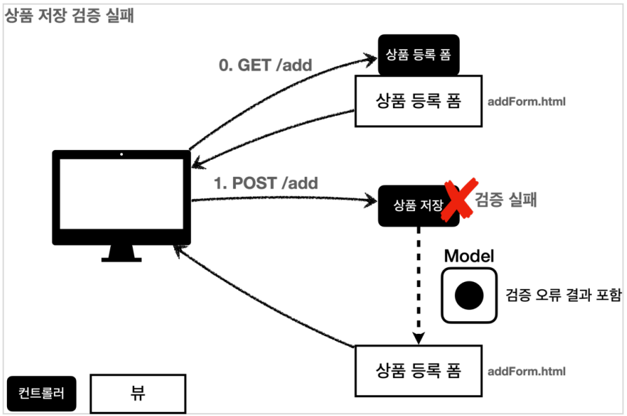

# 스프링MVC-2편

## 기본 기능

### 프로젝트 생성

- 프로젝트 선택
  - Project: Gradle - Groovy Project
  - Language: Java
  - Spring Boot: 2.5.0
  - Project Metadata
    - Group: hello
    - Artifact: thymeleaf-basic
    - Name: thymeleaf-basic
    - Package name: hello.thymeleaf
    - Packaging: Jar
    - Java: 11
  - Dependencies
    - Spring Web
    - Lombok
    - Thymeleaf

**홈 화면 추가**
홈 화면을 추가하자<br>
( 참고: `/resources/static/index.html` : 스프링 부트가 해당 디렉토리 위치에 index.html이 있으면 자동으로 Welcome Page로 인식한다.)

```html
<html lang="kr">
<head>
    <meta charset="UTF-8">
    <title>Title</title>
</head>
<body>
<ul>
    <li>텍스트 <ul>
        <li><a href="/basic/text-basic">텍스트 출력 기본</a></li>
        <li><a href="/basic/text-unescaped">텍스트 text, utext</a></li> </ul>
    </li>
    <li>표준 표현식 구문
        <ul>
            <li><a href="/basic/variable">변수 - SpringEL</a></li>
            <li><a href="/basic/basic-objects?paramData=HelloParam">기본 객체들</a></li>
            <li><a href="/basic/date">유틸리티 객체와 날짜</a></li> <li><a href="/basic/link">링크 URL</a></li>
            <li><a href="/basic/literal">리터럴</a></li>
            <li><a href="/basic/operation">연산</a></li>
        </ul> </li>
    <li>속성 값 설정 <ul>
        <li><a href="/basic/attribute">속성 값 설정</a></li> </ul>
    </li> <li>반복
    <ul>
        <li><a href="/basic/each">반복</a></li>
    </ul> </li>
    <li>조건부 평가 <ul>
        <li><a href="/basic/condition">조건부 평가</a></li> </ul>
    </li>
    <li>주석 및 블록
        <ul>
            <li><a href="/basic/comments">주석</a></li> <li><a href="/basic/block">블록</a></li>
        </ul>
    </li> <li>자바스크립트 인라인
    <ul>
        <li><a href="/basic/javascript">자바스크립트 인라인</a></li>
    </ul> </li>
    <li>템플릿 레이아웃 <ul>
        <li><a href="/template/fragment">템플릿 조각</a></li> <li><a href="/template/layout">유연한 레이아웃</a></li> <li><a href="/template/layoutExtend">레이아웃 상속</a></li>
    </ul> </li>
</ul>
</body>
</html>
```

### 타임리프 소개

**타임리프 특징**

- 서버 사이드 HTML 렌더링(SSR)
- 네츄럴 템플릿
- 스프링 통합 지원

**서버 사이드 HTML 렌더링 (SSR)**

- 타임리프는 백엔드 서버에서 HTML을 동적으로 렌더링하는 용도로 사용된다.

**내츄럴 템플릿**

- 타임리프는 순수 HTML을 최대한 유지하는 특징이 있다. 타임리프로 작성한 파일은 HTML을 유지하기 때문에 웹 브라우저에서 파일을 열어서 내용을 확인할 수 있고, 서버를 통해 뷰 템플릿을 거치면 동적으로 변경된 결과를 확인할 수 있다.
- JSP를 포함한 다른 뷰 템플릿들은 해당 파일을 열면, 예를 들어서 JPS파일 자체를 그대로 웹 브라우저에서 열어보면 JSP소스코드와 HTML이 뒤죽박죽 섞여서 웹 브라우저에서 정상적인 HTML결과를 확인할 수 없다. 오직 서버를 통해서 JSP가 렌더링 되고 HTML응답 결과를 받아야 화면을 확인할 수 있다.
- 반면에 티임리프로 작성된 파일은 해당 파일을 그대로 웹 브라우저에서 열어도 정상적인 HTML결과를 확인할 수 있다. 물론 이 경우 동적으로 결과가 렌더링 되지는 않는다. 하지만 HTLM마크업 결과가 어떻게 되는지 파일만 열어도 바로 확인할 수 있다. 이렇게 **순수 HTML을 그대로 유지하면서 뷰 템플릿도 사용할 수 있는 타임리프의 특징을 네츄럴 템플릿** (nutural templates)이라 한다.

**스프링 통합 지원**

- 타임리프는 스프링과 자연스럽게 통합되고, 스프링의 다양한 기능을 편리하게 사용할 수 있게 지원한다. 이 부분은 다음 섹션인 [스프링 통합과 폼]에서 자세히 알아보겠다.

**타임리프 기본 기능**

- **타입리프 사용 선언**: 타임리프를 사용하려면 다음 선언을 하면 된다.
  - `<html xmlns:th="http://www.thymeleaf.org">`
- **기본 표현식**: 타임리프는 다음과 같은 기본 표현식들을 제공한다. 앞으로 하나씩 알아보자
  - 간단한 표현
    - 변수 표현식" `${...}`
    - 선택 변수 표현식: `*{...}`
    - 메시지 표현식: `#{...}`
    - 링크 URL 표현식: `@{...}`
    - 조각 표현식: `~{...}`
    - (참고) 선택 변수 표현식과 메시지 표현식은 이번 섹션에서는 다루지 않는다. 뒤에서 알아볼 것.
  - 리터럴
    - 텍스트: `'one text' 'Another one!', ...`
    - 숫자: `0, 34, 3.0, 12.3, ...`
    - 불린: `true, false`
    - 널: `null`
    - 리터럴 토큰: `one, sonetext, main, ...`
  - 문자 연산
    - 문자 합치기: `+`
    - 리터럴 대체: `|The name is ${name}|`
  - 산술 연산
    - Binary operators: `+, -, *, /, %`
    - Minus sign(unary operator): `!, NOT`
  - 비교와 동등
    - 비교: `>, <, >=, <= (gt, lt, ge, le)`
    - 동등 연산: `==, != (eq, ne)`
  - 조건 연산
    - If-then: `(if) ? (then)`
    - if-then-else: `(if) ? (then) : (else)`
    - Default: `(value) ?: (defaultvalue)`
  - 특별한 토큰:
    - No-Operation: `_`

### 텍스트 - text, utext

타임리프의 가장 기본 기능인 텍스트를 출력하는 기능 먼저 알아보자.

타임리프의 가장 기본 기능인 텍스트를 출력하는 기능 먼저 알아보자

- 타임리프는 기본적으로 HTML 태그의 속성에 기능을 정의해서 동작한다. HTML의 콘텐츠(content)에 데이터를 출력할 때는 다음과 같이 `th:text`를 사용하면 된다.
  - ex. `<span th:text="${data}">`
- HTML 태그의 속성이 아니라 HTML 콘텐츠 영역안에서 직접 데이터를 출력하고 싶으면 다음과 같이 `[[...]]`를 사요하면 된다.
  - 컨텐츠 안에서 직접 호출하기 = `[[${data}]]`

예제로 확인해보자

- `BasicController`: src > main > java > hello > thymeleaf > basic 패키지를 생성하고, 내부에 BasicController 클래스를 생성하자.

  ```java
  @Controller
  @RequestMapping("/basic")
  public class BasicController {

    @GetMapping("text-basic")
    public String textBasic(Model model) {
        model.addAttribute("data", "Hello Spring!");
        return "basic/text-basic";
    }
  }
  ```

- /resources/templates/basic/text-basic.html`
  ```html
  <!DOCTYPE html>
  <html xmlns:th="http://www.thymeleaf.org">
    <head>
      <meta charset="UTF-8" />
      <title>Title</title>
    </head>
    <body>
      <h1>컨텐츠에 데이터 출력하기</h1>
      <ul>
        <li>th:text 사용 <span th:text="${data}"></span></li>
        <li>컨텐츠 안에서 직접 출력하기 = [[${data}]]</li>
      </ul>
    </body>
  </html>
  ```

**Escape**

HTML문서는 `<, >`같은 특수 문자를 기반으로 정의된다. 따라서 뷰 템플릿으로 HTML화면을 생성할 때는 출력하는 데이터에 이러한 특수 문자가 있는 것을 주의해서 사용해야 한다.<br>
앞에서 만든 예제의 데이터를 다음과 같이 변경해서 실행해보자

변경점<br>
`"Hello Spring!"`

변경후<br>
`"Hello <b>Spring!</b>"`

`<b>`태그를 사용해서 **Spring!**이라는 단어가 진하게 나오도록 해보자

웹 브라우저에서 실행결과를 보자

- 웹 브라우저: `Hello <b>Spring!</b>`
- 소스보기: `Hello &lt;b&gt;Spring!&lt;/b&gt;`

개발자가 의도한 것은 `<b>`가 있으면 해당 부분을 강조하는 것이 목적이었다. 그런데 `<b>`태그가 그대로 나온다.<br>
소스보기를 하면 `<`부분이 `&lt;`로 변경된 것을 확인할 수 있다.

**HTML 엔티티**
웹 브라우저는 `<` HTML 태그의 시작으로 인식한다. 따라서 `<` 를 테그의 시작이 아니라 문자로 표현할 수 있는 방법 이 필요한데, 이것을 HTML 엔티티라 한다. 그리고 이렇게 HTML에서 사용하는 특수 문자를 HTML 엔티티로 변경하는 것을 이스케이프(escape)라 한다. 그리고 타임리프가 제공하는 `th:text`, `[[...]]` 는 **기본적으로 이스케이프 (escape)를 제공**한다.

- `<` `&lt;`
- `>` `&gt;`
- 기타 수 많은 HTML 엔티티가 있다.

**Unescape**
이스케이프 기능을 사용하지 않으러면 어떻게 해야할까?

타임리프는 다음 두 기능을 제공한다

- `th:text` -> `th:utext`
- `[[...]]` -> `[(...)]`

**BasicController에 추가**

```java
 @GetMapping("/text-unescaped")
 public String textUnescaped(Model model) {
     model.addAttribute("data", "Hello <b>Spring!</b>");
     return "basic/text-unescaped";
 }
```

`/resources/templates/basic/text-unescape.html`

```html
<!DOCTYPE html>
<html xmlns:th="http://www.thymeleaf.org">
  <head>
    <meta charset="UTF-8" />
    <title>Title</title>
  </head>
  <body>
    <h1>text vs utext</h1>
    <ul>
      <li>th:text = <span th:text="${data}"></span></li>
      <li>th:utext = <span th:utext="${data}"></span></li>
    </ul>
    <h1><span th:inline="none">[[...]] vs [(...)]</span></h1>
    <ul>
      <li><span th:inline="none">[[...]] = </span>[[${data}]]</li>
      <li><span th:inline="none">[(...)] = </span>[(${data})]</li>
    </ul>
  </body>
</html>
```

- `th:inline="none"`: 타임리프는 `[[...]]`를 해석하기 때문에, 화면에 `[[...]]`글자를 보여줄 수 없다.<br>
  이 태그 안에서는 타임리프가 해석하지 말라는 옵션이다.

**실행**

- `http://localhost:8080/basic/text-unescaped`

실행해보면 다음과 같이 정상 수행되는 것을 확인할 수 있다.

- 웹 브라우저: Hello **Spring!**
- 소스보기: `Hello <b>Spring!<b>`

> [!WARNING]
> 실제 서비스를 개발하다 보면 escape를 사용하지 않아서 HTML이 정상 렌더링 되지 않는 수 많은 문제가 발생한다. escape를 기본으로 하고, 꼭 필요할 때만 unescape르 사용하자.

### 변수 - SpringEL

타임리프에서 변수를 사용할 때는 변수 표현식을 사용한다.

**변수 표현식**: `${...}`

그리고 이 변수 표현식에는 스프링 EL이라는 스프링이 제공하는 표현식을 사용할 수 있다.

`BasicController 추가`

```java
@GetMapping("/variable")
 public String variable(Model model) {
     User userA = new User("userA", 10);
     User userB = new User("userB", 20);
     List<User> list = new ArrayList<>();
     list.add(userA);
     list.add(userB);
     Map<String, User> map = new HashMap<>();
     map.put("userA", userA);
     map.put("userB", userB);
     model.addAttribute("user", userA);
     model.addAttribute("users", list);
     model.addAttribute("userMap", map);
     return "basic/variable";
 }
 @Data
 static class User {
    private String username;
    private int age;

    public User(String username, int age) {
        this.username = username;
        this.age = age;
  }
}
```

`/resources/templates/basic/variable.html`

```html
<!DOCTYPE html>
<html xmlns:th="http://www.thymeleaf.org">
  <head>
    <meta charset="UTF-8" />
    <title>Title</title>
  </head>
  <body>
    <h1>SpringEL 표현식</h1>
    <ul>
      Object
      <li>${user.username} = <span th:text="${user,username}"></span></li>
      <li>${user['username']} = <span th:text="${user['username']}"></span></li>
      <li>${user.getUsername()} = <span th:text="${user.getUsername()}"></span></li>
    </ul>
    <ul>
      List
      <li>${users[0].username} = <span th:text="${users[0].username}"></span></li>
      <li>${users[0]['username']} = <span th:text="${users[0]['username']}"></span></li>
      <li>${users[0].getUsername()} = <span th:text="${users[0].getUsername()}"></span></li>
    </ul>
    <ul>
      Map
      <li>${userMap['userA'].username} = <span th:text="${userMap['userA'].username}"></span></li>
      <li>${userMap['userA']['username']} = <span th:text="${userMap['userA']['username']}"></span></li>
      <li>${userMap['userA'].getUsername()} = <span th:text="${userMap['userA'].getUsername()}"></span></li>
    </ul>
  </body>
</html>
```

#### SpringEl 다양한 표현식 사용

**Object**

- `user.username`: user의 username을 프로퍼티 접근 -> `user.getUsername()`
- `user['username']`: 위와 같음 -> `user.getUsername()`
- `user.getUsername()`: user의 `getUsername()`을 직접 호출

**List**

- `users[0].username`: List에서 첫 번째 회원을 찾고 usernaeme 프로퍼티 접근 -> `list.get(0).getUsername()`
- `users[0]['username']`: 위와 같음
- `users[0].getusername()`: List에서 첫 번째 회원을 찾고 메서드 직접 호출

**Map**

- `userMap['userA'].username` : Map에서 userA를 찾고, username 프로퍼티 접근 -> `map.get("userA").getUsername()`
- `userMap['userA']['username']` : 위와 같음
- `userMap['userA'].getUsername()` : Map에서 userA를 찾고 메서드 직접 호출

**지역 변수 선언**

`th:with`를 사용하면 지역 변수를 선언해서 사용할 수 있다. 지역 변수는 선언한 태그 안에서만 사용할 수 있다.

- `/resources/templates/basic/variable.html` 추가
  ```html
  <h1>지역 변수 - (th:with)</h1>
  <div th:with="first=${users[0]}">
    <p>처음 사람의 이름은 <span th:text="${first.username}"></span></p>
  </div>
  ```

### 기본 객체들

타임리프는 기본 객체들을 제공한다

- `${#request}` - 스프링 부트 3.0부터 제공하지 않는다.
- `${#response}` - 스프링 부트 3.0부터 제공하지 않는다.
- `${#session}` - 스프링 부트 3.0부터 제공하지 않는다.
- `${#servletContext}` - 스프링 부트 3.0부터 제공하지 않는다.
- `${#locale}`

> [!WARNING]
> 스프링 부트 3.0부터는 `${#request}` , `${#response}`,`${#session}` , `${#servletContext}` 를 지원하지 않는다
> 스프링 부트 3.0이라면 직접 `model`에 해당 객체를 추가해서 사용해야 한다.

그런데 `#request`는 `HttpServletRequest`객체가 그대로 제공되기 때문에 데이터를 조회하려면 `request.getParameter("data")`처럼 불편하게 접근해야 한다.

이런 점을 해결하기 위해 편의 객체도 제공한다

- HTTP 요청 파라미터 접근: `param`
  - 예) `${param.paramData}`
- HTTP 세션 접근: `session`
  - 예) `${session.sessionData}`
- 스프링 빈 접근: `@`
  - 예) `${@helloBean.hello('Spring!')}`

스프링 3.0 이상

BasicController 추가

```java
@GetMapping("/basic-objects")
public String basicObject(Model model, HttpServletRequest request,
                          HttpServletResponse response, HttpSession session) {

    session.setAttribute("sessionData", "Hello Session");
    model.addAttribute("request", request);
    model.addAttribute("response", response);
    model.addAttribute("servletContext", request.getServletContext());

    return "basic/basic-objects";
}

@Component("helloBean")
static class HelloBean {
    public String hello(String data) {
        return "Hello " + data;
    }
}
```

`/resources/templates/basic/basic-objects.html`

```html
<!DOCTYPE html>
<html xmlns:th="http://www.thymeleaf.org">
  <head>
    <meta charset="UTF-8" />
    <title>Title</title>
  </head>
  <body>
    <h1>식 기본 객체 (Expression Basic Objects)</h1>
    <ul>
      <li>request = <span th:text="${request}"></span></li>
      <li>session = <span th:text="${session.sessionData}"></span></li>
      <li>servletContext = <span th:text="${servletContext}"></span></li>
      <li>locale = <span th:text="${#locale}"></span></li>
    </ul>

    <h1>편의 객체</h1>
    <ul>
      <li>Request Parameter = <span th:text="${param.paramData}"></span></li>
      <li>session = <span th:text="${session.sessionData}"></span></li>
      <li>spring bean = <span th:text="${@helloBean.hello('Spring!')}"></span></li>
    </ul>
  </body>
</html>
```

### 유틸리티 객체와 날짜

타임리프는 문자, 숫자, 날짜, URL등을 편리하게 다루는 다양한 유틸리티 객체들을 제공한다.

#### 타임리프 유틸리티 객체들

- `#message` : 메시지, 국제화 처리
- `#uris` : URI 이스케이프 지원
- `#dates` : `java.util.Date` 서식 지원
- `#calendars` : `java.util.Calendar` 서식 지원
- `#temporals` : 자바8 날짜 서식 지원
- `#numbers` : 숫자 서식 지원
- `#strings` : 문자 관련 편의 기능
- `#objects` : 객체 관련 기능 제공
- `#bools` : boolean 관련 기능 제공
- `#arrays` : 배열 관련 기능 제공
- `#lists` , `#sets` , `#maps` : 컬렉션 관련 기능 제공
- `#ids` : 아이디 처리 관련 기능 제공, 뒤에서 설명

#### 자바8 날짜

타임리프에서 자바8 날짜인 `LocalData`, `LocalDataTime`, `Instant`를 사용하려면 추가 라이브러리가 필요하다. 스프링 부트 타임리프를 사용하면 해당 라이브러리가 자동으로 추가되고 통합된다.

**타임리프 자바8 날짜 지원 라이브러리**
`thymeleaf-extras-java8time`

자바8 날짜용 유틸리티 객체
`#temporals`

**사용 예시**

```html
<span th:text="${#temporals.format(localDataTime, 'yyyy-MM-dd HH:mm:ss')}"></span>
```

BasicController 추가

```java
@GetMapping("/date")
public String data(Model model) {
    model.addAttribute("localDateTime", LocalDateTime.now());
    return "basic/date";
}
```

`/resources/templates/basic/date.html`

```html
<!DOCTYPE html>
<html xmlns:th="http://www.thymeleaf.org">
<head>
    <meta charset="UTF-8">
    <title>Title</title>
</head>
<body>

<h1>LocalDateTime</h1>
<ul>
    <li>default = <span th:text="${localDateTime}"></span> </li>
    <li>yyyy-MM-dd HH:mm:ss = <span th:text="${#temporals.format(localDateTime, 'yyyy-MM-dd HH:mm:ss')}"></span> </li>
</ul>

<h1>LocalDateTime - Utils</h1>
<ul>
    <li>${#temporals.day(localDateTime)} = <span th:text="${#temporals.day(localDateTime)}"></span> </li>
    <li>${#temporals.month(localDateTime)} = <span th:text="${#temporals.month(localDateTime)}"></span></li>
    <li>${#temporals.monthName(localDateTime)} = <span th:text="${#temporals.monthName(localDateTime)}"></span></li>
    <li>${#temporals.monthNameShort(localDateTime)} = <span th:text="${#temporals.monthNameShort(localDateTime)}"></span></li>
    <li>${#temporals.year(localDateTime)} = <span th:text="${#temporals.year(localDateTime)}"></span></li>
    <li>${#temporals.dayOfWeek(localDateTime)} = <span th:text="${#temporals.dayOfWeek(localDateTime)}"></span></li>
    <li>${#temporals.dayOfWeekName(localDateTime)} = <span th:text="${#temporals.dayOfWeekName(localDateTime)}"></span></li>
    <li>${#temporals.dayOfWeekNameShort(localDateTime)} = <span th:text="${#temporals.dayOfWeekNameShort(localDateTime)}"></span></li>
    <li>${#temporals.hour(localDateTime)} = <span th:text="${#temporals.hour(localDateTime)}"></span></li>
    <li>${#temporals.minute(localDateTime)} = <span th:text="${#temporals.minute(localDateTime)}"></span></li>
    <li>${#temporals.second(localDateTime)} = <span th:text="${#temporals.second(localDateTime)}"></span></li>
    <li>${#temporals.nanosecond(localDateTime)} = <span th:text="${#temporals.nanosecond(localDateTime)}"></span></li>
</ul>
</ul>
</body>
</html>
```

### URL 링크

타임리프에서 URL을 생성할 때는 `@{...}` 문법을 사용하면 된다.

BasicController 추가

```java
@GetMapping("/link")
public String link(Model model) {
    model.addAttribute("param1", "data1");
    model.addAttribute("param2", "data2");
    return "basic/link";
}
```

`/resources/templates/basic/link.html`

```html
<!DOCTYPE html>
<html xmlns:th="http://www.thymeleaf.org">
  <head>
    <meta charset="UTF-8" />
    <title>Title</title>
  </head>
  <body>
    <h1>URL 링크</h1>
    <ul>
      <li><a th:href="@{/hello}">basic url</a></li>
      <li><a th:href="@{/hello(param1=${param1}, param2=${param2})}">hello query param</a></li>
      <li><a th:href="@{/hello/{param1}/{param2}(param1=${param1}, param2=${param2})}">path variable</a></li>
      <li><a th:href="@{/hello/{param1}(param1=${param1}, param2=${param2})}">path variable + query parameter</a></li>
    </ul>
  </body>
</html>
```

**단순한 URL**

- `@{/hello}` -> `/hell`

**쿼리 파라미터**

- `@{/hello(param1=${param1}, param2=${param2})}`
  - `/hello?param1=data1&param2=data2`
  - `()`에 있는 부분은 쿼리 파라미터로 처리된다

**경로 변수**

- `@{/hello/{param1}/{param2}(param1=${param1}, param2=${param2})}`
  - `/hello/data1/data2`
  - URL 경로상에 변수가 있다면 `()`부분은 경로 변수로 처리된다.

**경로 변수 + 쿼리 파라미터**

- `@{/hello/{param1}(param1=${param1}, param2=${param2})}`
  - `/hello/data1?param2=data2`
  - 경로 변수와 쿼리 파라미터를 함께 사용할 수 있다.

상대경로, 절대경로, 프로토콜 기준을 표현할 수도 있다.

- `/hello`: 절대 경로
- `hello`: 상대 경로

### 리터럴

**Literals**

리터럴은 소스 코드상에 고정된 값을 말하는 용어이다.<br>
예를 들어서 다음 코드에서 `"Hello"`는 문자 리터럴, `10`, `20`는 숫자 리터럴이다.

```java
String a = "Hello"
int a = 10 * 20
```

> [!TIP]
> 이 내용은 쉬워 보이지만 처음 타임리프를 사용하면 많이 실수하니 잘 보아두자

타임리프는 다음과 같은 리터럴이 있다.

- 문자: `hello`
- 숫자: `10`
- 불린: `true`, `false`
- null: `null`

타임리프에서 문자 리터럴은 항상 `'`(작은 따옴표)로 감싸야한다.
`<span th:text="'hello'">`

그런데 문자를 항상 `'`로 감싸는 것은 너무 귀찮은 일이다. 공백 없이 쭉 이어진다면 하나의 의미있는 토큰으로 인지해서 다음과 같이 작은 따옴표를 생략할 수 있다.<br>
룰: `A-Z` , `a-z` , `0-9` , `[]` , `.` , `-` , `_`

`<span th:text="hello">`

**오류**

`<span th:text="hello world!">`<br>
문자 리터럴은 원칙상 `'`로 감싸야 한다. 중간에 공백이 있어서 하나의 의미있는 토큰으로도 인식되지 않는다.

**수정**

`<span th:text="'hello world!'">` <br>
이렇게 `'`로 감싸면 정상 동작한다.

BasicController 추가

```java
 @GetMapping("/literal")
 public String literal(Model model) {
     model.addAttribute("data", "Spring!");
     return "basic/literal";
 }
```

`/resources/templates/basic/literal.html`

```html
<!DOCTYPE html>
<html xmlns:th="http://www.thymeleaf.org">
  <head>
    <meta charset="UTF-8" />
    <title>Title</title>
  </head>
  <body>
    <h1>리터럴</h1>
    <ul>
      <!--틀린 코드 -->
      <!-- <li>"hello world!"= <span th:text="hello world!"></span> </li> -->
      <!--        -->

      <li>'hello' + ' world! = <span th:text="'hello' + ' world!'"></span></li>
      <li>'hello world!' = <span th:text="'hello world!'"></span></li>
      <li>'hello ' + ${data} = <span th:text="'hello ' + ${data}"></span></li>
      <li>리터럴 대체 |hello ${data}| = <span th:text="|hello ${data}|"></span></li>
    </ul>
  </body>
</html>
```

**리터럴 대체(Literal substitutions)**

`<span th:text="|hello ${data}|">`<br>
마지막의 리터럴 대체 문법을 사용하면 마치 템플릿을 사용하는 것 처럼 편리하다.

### 연산

타임리프 연산을 자바와 크게 다르지 않다. HTML안에서 사용하기 때문에 HTML엔티티를 사용하는 부분만 주의하자.

BasicController 추가

```java
@GetMapping("/operation")
 public String operation(Model model) {
     model.addAttribute("nullData", null);
     model.addAttribute("data", "Spring!");
     return "basic/operation";
}
```

`/resources/templates/basic/operation.html`

```html
<!DOCTYPE html>
<html xmlns:th="http://www.thymeleaf.org">
  <head>
    <meta charset="UTF-8" />
    <title>Title</title>
  </head>
  <body>
    <ul>
      <li>
        산술 연산
        <ul>
          <li>10 + 2 = <span th:text="10 + 2"></span></li>
          <li>10 % 2 == 0 = <span th:text="10 % 2 == 0"></span></li>
        </ul>
      </li>

      <li>
        비교 연산
        <ul>
          <li>1 > 10 = <span th:text="1 &gt; 10"></span></li>
          <li>1 gt 10 = <span th:text="1 gt 10"></span></li>
          <li>1 >= 10 = <span th:text="1 >= 10"></span></li>
          <li>1 ge 10 = <span th:text="1 ge 10"></span></li>
          <li>1 == 10 = <span th:text="1 == 10"></span></li>
          <li>1 != 10 = <span th:text="1 != 10"></span></li>
        </ul>
      </li>

      <li>
        조건식
        <ul>
          <li>(10 % 2 == 0)? '짝수':'홀수' = <span th:text="(10 % 2 == 0)? '짝수':'홀수'"></span></li>
        </ul>
      </li>

      <li>
        Elvis 연산자
        <ul>
          <li>${data}? '데이터가 없습니다.' = <span th:text="${data}?: '데이터가 없습니다.'"></span></li>
          <li>${nullData}? '데이터가 없습니다.' = <span th:text="${nullData}?: '데이터가 없습니다.'"></span></li>
        </ul>
      </li>

      <li>
        No-Operation
        <ul>
          <li>${data}?: _ = <span th:text="${data}?: _">데이터가 없습니다.</span></li>
          <li>${nullData}?: _ = <span th:text="${nullData}?: _">데이터가 없습니다.</span></li>
        </ul>
      </li>
    </ul>
  </body>
</html>
```

- **비교연산**: HTML 엔티티를 사용해야 하는 부분을 주의하자
  - `>`(gt), `<`(lt), `>=`(ge), `<=`(le), `!`(not), `==`(eq), `!=` (neq, ne)
- **조건식**: 자바의 조건식과 유사하다
- **Elvis 연산자**: 조건식의 편의 버전
- **No-Operation:**: `_`인 경우 마치 타임리프가 실행되지 않는 것 처럼 동작한다. 이것을 잘 사용하면 HTML의 내용 그대로 활용할 수 있다. 마지막 예를 보면 데이터가 없습니다. 부분이 그대로 출력된다.

### 속성 값 설정

**타임리프 태그 속성(Attribute)**

타임리프는 주로 HTML태그에 `th:*` 속성을 지정하는 방식으로 동작한다. `th:*`로 속성을 적용하면 기존 속성을 대체한다. 기존 속성이 없으면 새로 만든다.

BasicController 추가

```java
@GetMapping("/attribute")
public String attribute() {
    return "basic/attribute";
}
```

`/resources/templates/basic/attribute.html`

```html
<!DOCTYPE html>
<html lang="en">
  <head>
    <meta charset="UTF-8" />
    <title>Title</title>
  </head>
  <body>
    <h1>속성 설정</h1>
    <input type="text" name="mock" th:name="userA" />

    <h1>속성 추가</h1>
    - th:attrappend = <input type="text" class="text" th:attrappend="class='large'" /><br />
    - th:attrprepend = <input type="text" class="text" th:attrprepend="class='large'" /><br />
    - th:classappend = <input type="text" class="text" th:classappend="large" /><br />

    <h1>checked 처리</h1>
    - checked o <input type="checkbox" name="active" th:checked="true" /><br />
    - checked x <input type="checkbox" name="active" th:checked="false" /><br />
    - checked=false <input type="checkbox" name="active" checked="false" /><br />
  </body>
</html>
```

**속성 설정**

`th:*`속성을 지정하면 타임리프는 기존 속성을 `th:*`로 지정한 속성으로 대체한다. 기존 속성이 없다면 새로 만든다.<br>`input type="text" name="mock" th:name="userA" />`<br>-> 타임리프 랜더링 후 `<input type="text" name="userA" />`

**속성 추가**
`th:attrappend`: 속성 값의 뒤에 값을 추가한다
`th:attrprepend`: 속성 값의 앞에 값을 추가한다
`th:classappend`: class속성에 자연스럽게 추가한다.

**checked 처리**
HTML에서는 `<input type="checkbox" name="active" checked="false" />`<br>
-> 이 경우에도 checked속성이 있기 때문에 checked처리가 되어버린다.

HTML에서 `checked`속성은 `checked`속성의 값과 상관없이 `checked`라는 속성만 있어도 체크가 된다. 이런 부분이 `true`, `false`값을 주로 사용하는 개발자 입장에서는 불편하다.

타임리프의 `th:checked`는 값이 `false`인 경우 `checked`속성 자체를 제거한다.<br>
`<input type="checkbox" name="active" th:checked="false" />`<br>
-> 타임리프 렌더링 후: `<input type="checkbox" name="active" />`

### 반복

타임리프에서 반복은 `th:each`를 사용한다. 추가로 반복에서 사용할 수 있는 여러 상태 값을 지원한다.

BasicController 추가

```java
@GetMapping("/each")
 public String each(Model model) {
     addUsers(model);
     return "basic/each";
 }
 private void addUsers(Model model) {
     List<User> list = new ArrayList<>();
     list.add(new User("userA", 10));
     list.add(new User("userB", 20));
     list.add(new User("userC", 30));
     model.addAttribute("users", list);
 }
```

`/resources/templates/basic/each.html`

```html
<!DOCTYPE html>
<html xmlns:th="http://www.thymeleaf.org">
  <head>
    <meta charset="UTF-8" />
    <title>Title</title>
  </head>
  <body>
    <h1>기본 테이블</h1>
    <table border="1">
      <tr>
        <th>username</th>
        <th>age</th>
      </tr>
      <tr th:each="user : ${users}">
        <td th:text="${user.username}">username</td>
        <td th:text="${user.age}">0</td>
      </tr>
    </table>

    <h1>반복 상태 유지</h1>

    <table border="1">
      <tr>
        <th>count</th>
        <th>username</th>
        <th>age</th>
        <th>etc</th>
      </tr>
      <tr th:each="user, userStat : ${users}">
        <td th:text="${userStat.count}">username</td>
        <td th:text="${user.username}">username</td>
        <td th:text="${user.age}">0</td>
        <td>
          index = <span th:text="${userStat.index}"></span> count = <span th:text="${userStat.count}"></span> size =
          <span th:text="${userStat.size}"></span> even? = <span th:text="${userStat.even}"></span> odd? =
          <span th:text="${userStat.odd}"></span> first? = <span th:text="${userStat.first}"></span> last? =
          <span th:text="${userStat.last}"></span> current = <span th:text="${userStat.current}"></span>
        </td>
      </tr>
    </table>
  </body>
</html>
```

**반복 기능**

`<tr th:each="user : ${users}>`

- 밙복시 오른쪽 컬렉션(`${users}`)의 값을 하나씩 꺼내서 왼쪽 변수(`user`)에 담아서 태그를 반복 실행합니다.
- `th:each`는 `list`뿐만 아니라 배열, `java.util.Iterable`, `java.util.Enumeration`을 구현한 모든 객체를 반복에 사용할 수 있습니다. `Map`도 사용할 수 있는데 이 경우 변수에 담기는 값은 `Map.Entry`입니다.

**반복 상태 유지**

`<tr th:each="user, userStat : ${users}">`<br>
반복의 두번째 파라미터를 설정해서 반복의 상태를 확인 할 수 있다.<br>
두번째 파라미터는 생략 가능한데, 생락하면 지정한 변수(`user`) + `Stat`가 된다.<br>
여기서는 `user` + `Stat` = `userStat`이므로 생략 가능하다.

**반복 상태 유지 기능**

- `index`: 0부터 시작하는 값
- `count`: 1부터 시작하는 값
- `size`: 전체 사이즈
- `even`, `odd`: 홀수, 짝수 여부(`boolean`)
- `first`, `last`: 처음, 마지막 여부(`boolean`)
- `current`: 현재 객체

### 조건부 평가

타임리프 조건식

`if`, `unless`(`if`의 반대)

BasicController 추가

```java
@GetMapping("/condition")
public String condition(Model model) {
    addUsers(model);
    return "basic/condition";
}
```

`/resources/templates/basic/condition.html`

```html
<!DOCTYPE html>
<html xmlns:th="http://www.thymeleaf.org">
  <head>
    <meta charset="UTF-8" />
    <title>Title</title>
  </head>
  <body>
    <h1>if, unless</h1>
    <table border="1">
      <tr>
        <th>count</th>
        <th>username</th>
        <th>age</th>
      </tr>

      <tr th:each="user, userStat : ${users}">
        <td th:text="${userStat.count}">1</td>
        <td th:text="${user.username}">username</td>
        <td>
          <span th:text="${user.age}">0</span>
          <span th:text="'미성년자'" th:if="${user.age lt 20}"></span>
          <span th:text="'미성년자'" th:unless="${user.age ge 20}"></span>
        </td>
      </tr>
    </table>

    <h1>switch</h1>
    <table border="1">
      <tr>
        <th>count</th>
        <th>username</th>
        <th>age</th>
      </tr>
      <tr th:each="user, userStat : ${users}">
        <td th:text="${userStat.count}">1</td>
        <td th:text="${user.username}">username</td>
        <td th:switch="${user.age}">
          <span th:case="10">10살</span>
          <span th:case="20">20살</span>
          <span th:case="*">기타</span>
        </td>
      </tr>
    </table>
  </body>
</html>
```

**if, unless**

타임리프는 해당 조건이 맞지 않으면 태그 자체를 렌더링하지 않는다.<br>
만약 다음 조건이 `false`인 경우 `<span>...<span>`부분 자체가 렌더링 되지 않고 사라진다.<br>
`<span th:text="'미성년자'" th:if="${user.age lt 20}">`

**switch**

`*`은 만족하는 조건이 없을 때 사용하는 디폴트이다.

### 주석

BasicController 추가

```java
@GetMapping("/comments")
public String comments(Model model) {
    model.addAttribute("data", "Spring!");
    return "basic/comments";
}
```

`/resources/templates/basic/comments.html`

```html
<!DOCTYPE html>
<html xmlns:th="http://www.thymeleaf.org">
  <head>
    <meta charset="UTF-8" />
    <title>Title</title>
  </head>
  <body>
    <h1>예시</h1>

    <span th:text="${data}">html data</span>

    <h1>1. 표준 HTML 주석</h1>
    <!--
<span th:text="${data}">html data</span>
-->

    <h1>2. 타임리프 파서 주석</h1>
    <!--/* [[${data}]] */-->

    <!--/*-->
    <span th:text="${data}">html data</span>
    <!--*/-->

    <h1>3. 타임리프 프로토타입 주석</h1>
    <!--/*/
    <span th:text="${data}">html data</span>
    /*/-->
  </body>
</html>
```

**결과**

```html
<h1>예시</h1>
<span>Spring!</span>
<h1>1. 표준 HTML 주석</h1>
<!--
<span th:text="${data}">html data</span> -->
<h1>2. 타임리프 파서 주석</h1>
<h1>3. 타임리프 프로토타입 주석</h1>
<span>Spring!</span>
```

**표준 HTML 주석**<br>
자바스크립트의 표준 HTML주석은 타임리프가 렌더링 하지 않고, 그래도 남겨둔다.

**타임리프 파서 주석**<br>
타임리프 파서 주석은 타임리프의 진짜 주석이다. 렌더링에서 주석 부분을 제거한다.

**타임리프 프로토타입 주석**<br>
타임리프 프로토타입은 약간 특이한데, HTML주석에 약간의 구문을 더했다.<br>
**HTML 파일**을 웹 브라우저에서 그대로 열어보면 HTML주석이기 때문에 이 부분이 웹 브라우저가 렌더링하지 않는다.<br>
**타임리프 렌더링**을 거치면 이 부분이 정상 렌더링 된다.<br>
쉽게 이야기해서 HTML 파일을 그대로 열어보면 주석처리가 되지만, 타임리프를 렌더링 한 경우에만 보이는 기능이다.

### 블록

`<th:block>`은 HTML태그가 아닌 타임리프의 유일한 자체 태그다.

BasicController 추가

```java
@GetMapping("/block")
public String block(Model model) {
    addUsers(model);
    return "basic/block";
}
```

`/resources/templates/basic/block.html`

```html
<!DOCTYPE html>
<html xmlns:th="http://www.thymeleaf.org">
  <head>
    <meta charset="UTF-8" />
    <title>Title</title>
  </head>
  <body>
    <th:block th:each="user : ${users}">
      <div>
        사용자 이름1 <span th:text="${user.username}"></span>
        사용자 나이1 <span th:text="${user.age}"></span>
      </div>
      <div>
        요약 <span th:text="${user.username} + ' / ' + ${user.age}"></span>
      </div>
    </th:block>
  </body>
</html>
```

**실행 결과**<br>

```html
<div>사용자 이름1 <span>userA</span> 사용자 나이1 <span>10</span></div>
<div>요약 <span>userA / 10</span></div>
<div>사용자 이름1 <span>userB</span> 사용자 나이1 <span>20</span></div>
<div>요약 <span>userB / 20</span></div>
<div>사용자 이름1 <span>userC</span> 사용자 나이1 <span>30</span></div>
<div>요약 <span>userC / 30</span></div>
```

타임리프의 특성상 HTML태그안에 속성으로 기능을 정의해서 사용하는데, 위 예처럼 이렇게 사용하기 애매한 경우에 사용하면 된다. `<th:block>`은 렌더링시 제거된다.

### 자바스크립트 인라인

타임리프는 자바스크립트에서 타임리프를 편리하게 사용할 수 있는 자바스크립트 인라인 기능을 제공한다.<br>
자바스크립트 인라인 기능은 다음과 같이 적용하면 된다.<br>
`<script th:inline="javascript">`

BasicController추가

```java
 @GetMapping("/javascript")
 public String javascript(Model model) {
     model.addAttribute("user", new User("userA", 10));
     addUsers(model);
     return "basic/javascript";
 }
```

`/resources/templates/basic/javascript.html`

```html
<!DOCTYPE html>
<html xmlns:th="http://www.thymeleaf.org">
  <head>
    <meta charset="UTF-8" />
    <title>Title</title>
  </head>
  <body>
    <!-- 자바스크립트 인라인 사용 전 -->
    <script>
      var username = [[${user.username}]];
      var age = [[${user.age}]];

      // 자바스크립트 내추럴 템플릿
      var username2 = /*[[${username}]]*/ "test username";

      // 객체
      var user = [[${user}]];
    </script>

    <!-- 자바스크립트 인라인 사용 후 -->
    <script th:inline="javascript">
      var username = [[${user.username}]];
      var age = [[${user.age}]];

      // 자바스크립트 내추럴 템플릿
      var username2 = /*[[${username}]]*/ "test username";

      // 객체
      var user = [[${user}]];
    </script>
  </body>
</html>
```

**자바스크립트 인라인 사용 전 - 결과**

```html
<script>
  var username = userA;
  var age = 10;
  //자바스크립트 내추럴 템플릿
  var username2 = /*userA*/ "test username";
  //객체
  var user = BasicController.User((username = userA), (age = 10));
</script>
```

**자바스크립트 인라인 사용 후 - 결과**

```html
<script>
  var username = "userA";
  var age = 10;
  //자바스크립트 내추럴 템플릿 var username2 = "userA";
  //객체
  var user = { username: "userA", age: 10 };
</script>
```

자바스크립트 인라인을 사용하지 않는 경우 어떤 문제들이 있는지 알아보고, 인라인을 사용하면 해당 문제들이 어떻게 해결되는지 확인해보자.

**텍스트 렌더링**

- `var username = [[${user.username}]]`

  - 인라인 사용 전 -> `var username = userA;`
  - 인라인 사용 후 -> `var username = "userA;`

- 인라인 사용 전 렌더링 결과를 보면 `userA`라는 변수 이름이 그대로 남아있따. 타임리프 입장에서는 정확하게 렌더링 한 것이지만 아마 개발자가 기대한 것은 다음과 같은 "userA"라는 문자일 것이다. 결과적으로 userA가 변수명으로 사용되어서 자바스크립트 오류가 발생한다. 다음으로 나오는 숫자 age의 경우 `"`가 필요 없기 때문에 정상 렌더링 된다.
- 인라인 사용 후 렌더링 결과를 보면 문자 티입인 경우 `"`를 포함해준다. 추가로 자바스크립트에서 문제가 될 수 있는 문자가 포함되어 있으면 이스케이스 처리도 해준다. 예) `"` -> `/"`

**자바스크립트 내추럴 템플릿**

타임리프 HTML파일을 직접 열어도 동작하는 내추럴 템플릿 기능을 제공한다. 자바스크립트 인라인 기능을 사용하면 주석을 활용해서 이 기능을 사용할 수 있다.

- `var username2 = /*[[${user.username}]]*/ "test username";`
  - 인라인 사용 전 -> `var username2 = /*userA*/ "test username";`
  - 인라인 사용 후 -> `var username2= "userA";`
- 인라인 사용 전 결과를 보면 순수하게 그대로 해석을 해버렸다. 따라서 내추럴 템프릿 기능이 동작하지 않고, 심지어 렌더링 내용이 주석처리 되어 버린다.
- 인라인 사용 후 결과를 보면 주석 부분이 제거되고, 기다한 "userA"가 정확하게 적용된다.

**객체**

타임리프의 자바스크립트 인라인 기능을 사용하면 객체를 JSON으로 자동으로 변환해준다.

- `var user = [[${user}]];`

  - 인라인 사용 전 -> `var user = BasicController.User(username=userA, age=10);`
  - 인라인 사용 후 -> `var user = {"username": "userA", "age":10};`

- 인라인 사용 전은 객체의 toString()이 호출된 값이다.
- 인라인 사용 후는 객체를 JSON으로 변환해준다.

#### 자바스크립트 인라인 each

`/resources/templates/basic/javascript.html` 에 추가

```html
<!-- 자바스크립트 인라인 each -->
<script th:inline="javascript">
  [# th:each="user, stat : ${users}"]
  var user[[${stat.count}]] = [[${user}]];
  [/]
</script>
```

**자바스크립트 인라인 each 결과**

```html
<script>
  var user1 = { username: "userA", age: 10 };
  var user2 = { username: "userB", age: 20 };
  var user3 = { username: "userC", age: 30 };
</script>
```

### 템플릿 조각

```java
 package hello.thymeleaf.basic;

 import org.springframework.stereotype.Controller;
 import org.springframework.web.bind.annotation.GetMapping;
 import org.springframework.web.bind.annotation.RequestMapping;

 @Controller
 @RequestMapping("/template")
 public class TemplateController {
     @GetMapping("/fragment")
     public String template() {
         return "template/fragment/fragmentMain";
     }
}
```

`/resources/templates/template/fragment/footer.html`

```html
<!DOCTYPE html>
<html xmlns:th="http://www.thymeleaf.org">
  <head>
    <meta charset="UTF-8" />
    <title>Title</title>
  </head>
  <body>
    <footer th:fragment="copy">푸터 자리 입니다.</footer>

    <footer th:fragment="copyParam (param1, param2)">
      <p>파라미터 자리 입니다.</p>
      <p th:text="${param1}"></p>
      <p th:text="${param2}"></p>
    </footer>
  </body>
</html>
```

`th:fragment`가 있는 태그는 다른곳에 포함되는 코드 조각으로 이해하면 된다.

`/resources/templates/template/fragment/fragmentMain.html`

```html
<!DOCTYPE html>
<html xmlns:th="http://www.thymeleaf.org">
  <head>
    <meta charset="UTF-8" />
    <title>Title</title>
  </head>
  <body>
    <h1>부분 포함</h1>
    <h2>부분 포함 insert</h2>
    <div th:insert="~{template/fragment/footer :: copy}"></div>

    <h2>부분 포함 replace</h2>
    <div th:replace="~{template/fragment/footer :: copy}"></div>

    <h2>부분 포함 단순 표현식</h2>
    <div th:replace="template/fragment/footer :: copy"></div>

    <h1>파라미터 사용</h1>
    <div th:replace="~{template/fragment/footer :: copyParam ('데이터1', '데이터2')}"></div>
  </body>
</html>
```

- `template/fragment/footer :: copy`: `template/fragment/footer.html`템플릿에 있는 `th:fragment="copy"`라는 부분을 템플릿 조각으로 가져와서 사용한다는 의미이다.

`footer.html`의 `copy`부분

```html
<footer th:fragment="copy">푸터 자리 입니다.</footer>
```

**부분 포함 insert**

```html
<div th:insert="~{template/fragment/footer :: copy}"></div>
```

```html
<h2>부분 포함 insert</h2>
<div>
  <footer>푸터 자리 입니다.</footer>
</div>
```

`th:insert`를 사용하면 현태 태그(`div`)내부에 추가한다.

**부분 포함 replace**

`<div th:replace="~{template/fragment/footer :: copy}"></div>`

```html
<h2>부분 포함 replace</h2>
<footer>푸터 자리 입니다.</footer>
```

**부분 포함 단순 표현식**

`<div th:replace="template/fragment/footer :: copy"></div>`

```html
<h2>부분 포함 단순 표현식</h2>
<footer>푸터 자리 입니다.</footer>
```

`~{...}`을 사용하는 것이 원칙이지만 템플릿 조각을 사용하는 코드가 단순하면 이 부분을 생략할 수 있다.

**파라미터 사용**

다음과 같이 파라미터를 전달해서 동적으로 조각을 렌더링 할 수도 있다.

`<div th:replace="~{template/fragment/footer :: copyParam ('데이터1', '데이터2')}"></div>`

```html
<h1>파라미터 사용</h1>
<footer>
  <p>파라미터 자리 입니다.</p>
  <p>데이터1</p>
  <p>데이터2</p>
</footer>
```

`footer.html` 의 `copyParam` 부분

```html
<footer th:fragment="copyParam (param1, param2)">
  <p>파라미터 자리 입니다.</p>
  <p th:text="${param1}"></p>
  <p th:text="${param2}"></p>
</footer>
```

### 템플릿 레이아웃 1

**템플릿 레이아웃**

이전에는 일부 코들 조각을 가지고와서 사용했다면, 이번에는 개념을 더 확장해서 코드 조각을 레이아웃에 넘겨서 사용하는 방법에 대해서 알아보자

예를 들어서 `<head>`에 공통으로 사용하는 `css`, `javascript`같은 정보들이 있는데, 이러한 공통 정보들을 한 곳에 모아두고, 공통으로 사용하지만, 각 페이지마다 필요한 정보를 더 추가해서 사용하고 싶으면 다음과 같이 사용하면 된다.

```java
@GetMapping("/layout")
public String layout() {
    return "template/layout/layoutMain";
}
```

`/resources/templates/template/layout/base.html`

```html
<html xmlns:th="http://www.thymeleaf.org">
<head th:fragment="common_header(title, links)">
    <title th:replace="${title}">레이아웃 타이틀</title>

    <!-- 공통 -->
    <link rel="stylesheet" type="text/css" media="all" th:href="@{/css/awesomeapp.css}"/>
    <link rel="shortcut icon" th:href="@{/images/favicon.ico}">
    <script type="text/javascript" th:src="@{/sh/scripts/codebase.js}"></script>

    <!-- 추가 -->
    <th:block th:replace="${links}"/>
</head>
```

`/resources/templates/template/layout/layoutMain.html`

```html
<!DOCTYPE html>
<html xmlns:th="http://www.thymeleaf.org">

<head th:replace="template/layout/base :: common_header(~{::title},~{::link})">
    <title>메인 타이틀</title>
    <link rel="stylesheet" th:href="@{/css/bootstrap.min.css}">
    <link rel="stylesheet" th:href="@{/themes/smoothness/jquery-ui.css}">
</head>

<body>
메인 컨텐츠
</body>
</html>
```

**결과**
```html
<!DOCTYPE html>
<html>
<head>
<title>메인 타이틀</title> 
<!-- 공통 -->
 <link rel="stylesheet" type="text/css" media="all" href="/css/awesomeapp.css">
 <link rel="shortcut icon" href="/images/favicon.ico">
 <script type="text/javascript" src="/sh/scripts/codebase.js"></script>
<!-- 추가 -->
<link rel="stylesheet" href="/css/bootstrap.min.css">
<link rel="stylesheet" href="/themes/smoothness/jquery-ui.css">

</head> 
<body> 
메인 컨텐츠 
</body> 
</html>
```

- `common_header(~{::title}, ~{::link})`이 부분이 핵심이다.
  - `::title`은 현재 페이지의 title태그들을 전달한다.
  - `::link`는 현재 페이지의 link태그들을 전달한다.

**결과물 보자**

- 메인 타이틀이 전달한 부분으로 교체되었다.
- 공통 부분은 그대로 유지되고, 추가 부분에 전달한 `<link>`들이 포함된 것을 확인할 수 있다.

이 방식은 사실 앞서 배운 코드 조각을 조금 더 적극적으로 사용하는 방식이다. 쉽게 이야기 해서 레이아웃 개념을 두고, 그 레이아웃에 필요한 코드 조각을 전달해서 완성하는 것으로 이해하면 된다.

### 템플릿 레이아웃2

#### 템플릿 레이아웃 확장

앞서 이야기한 개념을 `<head>`정도에만 적용하는게 아니라 `<html>` 전체에 적용할 수도 있다.

```java
@GetMapping("/layoutExtend")
public String layoutExtends() {
    return "template/layoutExtend/layoutExtendMain";
}
```

`/resources/templates/template/layoutExtend/layoutFile.html`

```html
<!DOCTYPE html>
<html th:fragment="layout (title, content)" xmlns:th="http://www.thymeleaf.org">
<head>
    <title th:replace="${title}">레이아웃 타이틀</title>
</head>
<body>
<h1>레이아웃</h1>
<div th:replace="${content}">
    <p>레이아웃 컨텐츠</p>
</div>
<footer>
    레이아웃 푸터
</footer>
</body>
</html>
```

`/resources/templates/template/layoutExtend/layoutExtendMain.html`

```html
<!DOCTYPE html>
<html th:replace="~{template/layoutExtend/layoutFile :: layout (~{::title}, ~{::section})}"
        xmlns:th="http://www.thymeleaf.org">
<head>
    <title>메인 페이지 타이틀</title>
</head>
<body>
<section>
    <p>메인 페이지 컨텐츠</p>
    <div>메인 페이지 포함 내용</div>
</section>

</body>
</html>
```

**생성 결과**

```html
<!DOCTYPE html>
<html>

<head>
<title>메인 페이지 타이틀</title>
</head>

<body>
<h1>레이아웃 H1</h1>

<section>
  <p>메인 페이지 컨텐츠</p> 
  <div>메인 페이지 포함 내용</div> 
</section>

<footer>
레이아웃 푸터

</footer>
</body>
</html>
```

`layoutFile.html`을 보면 기본 레이아웃을 가지고 있는데, `<html>`에 `th:fragment`속성이 정의되어 있다. 이 레이아웃 파일을 기본으로 하고 여기에 필요한 내용을 전달해서 부분부분 변경하는 것으로 이해하면 된다.

`layoutExtendMain.html`는 현재 페이지인데, `<html>`자체를 `th:replace`를 사용해서 변경하는 것을 확인할 수 있다. 결국 `layoutFile.html`에 필요한 내용을 전달하면서 `<html>`자체를 `layoutFile.html`로 변경한다.

## 스프링 통합과 폼

### 프로젝트 설정

이전 스프링 MVC 1편에서 마지막에 완성했던 상품 관리 프로젝트를 떠올려보자<br>
지금부터 이 프로젝트에 스프링이 지원하는 다양한 기능을 붙여가면서 스프링 MVC를 깊이있게 학습해보자.<br>

### 타임리프 스프링 통합

타임리프는 크게 2가지 메뉴얼을 제공한다.

- 기본 메뉴얼: https://www.thymeleaf.org/doc/tutorials/3.0/usingthymeleaf.html
- 스프링 통합 메뉴얼:  https://www.thymeleaf.org/doc/tutorials/3.0/thymeleafspring.html

타임리프는 스프링 없이도 동작하지만, 스프링과 통합을 위한 다양한 기능을 편리하게 제공한다. 그리고 이런 부분은 스프링으로 백엔드를 개발하는 개발자 입장에서 타임리프를 선택하는 하나의 이유가 된다.

#### 스프링 통합으로 추가되는 기능들

- 스프링의 SpringEL 문법 통합
- `${@myBean.doSomething()}`처럼 스프링 빈 호출 지원
- 편리한 폼 관리를 위한 추가 속성
  - `th:object`(기능 강화, 폼 커맨드 객체 선택)
  - `th:field`, `th:errors`, `th:errorclass`
- 폼 컴포넌트 기능
  - `checkbox`, `radio buttion`, `List`등을 편리하게 사용할 수 있는 기능 지원
- 스프링의 메시지, 국제화 기능의 편리한 통합
- 스프링의 검증, 오류 처리 통합
- 스프링의 변환 서비스 통합(ConversionService)

#### 설정 방법

타임리프 템플릿 엔진을 스프링 빈에 등록하고, 타임리프용 뷰 리졸버를 스프링 빈으로 등록하는 방법<br>
- https://www.thymeleaf.org/doc/tutorials/3.0/thymeleafspring.html#the-springstandard-dialect 
- https://www.thymeleaf.org/doc/tutorials/3.0/thymeleafspring.html#views-and-view-resolvers

스프링 부트는 이런 부분을 모두 자동화 해준다. `build.gradle`에 다음 한줄을 넣어주면 Gradle은 타임리프와 관련된 라이브러리를 다운로드 받고, 스프링 부트는 앞서 설명한 티임리프와 관련된 설정용 스프링 빈을 자동으로 등록해준다.

**build.gradle**

`implementation 'org.springframework.boot:spring-boot-starter-thymeleaf'`

타임리프 관련 설정을 변경하고 싶으면 다음을 참고해서 `application.properties`에 추가하면 된다.


**스프링 부트가 제공하는 타임리프 설정, thymeleaf검색 필요**<br>
`https://docs.spring.io/spring-boot/docs/current/reference/html/appendix-application-properties.html#common-application-properties-templating`


### 입력 폼 처리
지금부터 타임리프가 제공하는 입력 폼 기능을 적용해서 기존 프로젝트이 폼 코드를 타임리프가 지원하는 기능을 사용해서 효율적으로 개선해보자.

- `th:object`: 커맨드 객체를 지정한다.
- `${...}`: 선택 변수 식이라고 한다. `th:object`에서 선택한 객체에 접근한다.
- `th:field`
  - HTML태그의 `id`, `name`, `value`속성을 자동으로 처리해준다.

**렌더링 전**<br>
`<input type="text" th:field="*{itemName}" />`

**렌더링 후**<br>
`<input type="text" id="itemName" name="itemName" th:value="*{itemName}">`

#### 등록 폼

`th:object`를 적용하려면 먼저 해당 오브젝트 정보를 넘겨주어야 한다. 등록 폼이기 때문에 데이터가 비어있는 빈 오브젝트를 만들어서 뷰에 전달하자.

**FormItemController 변경**

```java
@GetMapping("/add")
public String addForm(Model model) {
    model.addAttribute("item", new Item());
    return "form/addForm";
}
```

이제 본격적으로 타임리프 등록 폼을 변경하자

`form/addForm.html` 변경 코드 부분

```html
<form action="item.html" th:action th:object="${item}" method="post">
    <div>
        <label for="itemName">상품명</label>
        <input type="text" id="itemName" th:field="*{itemName}"
               class="form-control" placeholder="이름을 입력하세요">
    </div>
    <div>
        <label for="price">가격</label>
        <input type="text" id="price" th:field="*{price}"
               class="form-control" placeholder="가격을 입력하세요">
    </div>
    <div>
        <label for="quantity">수량</label>
        <input type="text" id="quantity" th:field="*{quantity}"
               class="form-control" placeholder="수량을 입력하세요">
    </div>
```

- `th:object="${item}"`: `<form>`에서 사용할 객체를 지정한다. 선택 변수 식(`*{...}`)을 적용할 수 있다.
- `th:field="*{itemName}`
  - `*{itemName}`는 선택 변수 식을 사용했는데, `${item.itemName}`과 같다. 앞서 `th:object`로 `item`을 선택했기 때문에 선택 변수 식을 적용할 수 있다.
  - `th:field`는 `id`, `name`, `value`속성을 모두 자동으로 만들어준다.
    - `id`: `th:field`에서 지정한 변수 이름과 같다. `id="itemName`
    - `name`: `th:field`에서 지정한 변수 이름과 같다. `name="itemName`
    - `value`: `th:field`에서 지정한 변수의 값을 사용한다. `value=""`

참고로 해당 예제에서 `id`속성을 제거해도 `th:field`가 자동으로 만들어준다.

렌더링 전

```html
 <input type="text" id="itemName" th:field="*{itemName}" class="form-control"
placeholder="이름을 입력하세요">
```

렌더링 후

```html
<input type="text" id="itemName" class="form-control" placeholder="이름을 입력하세요" name="itemName" value="">
```


#### 수정 폼

**FormItemController 유지**

```java
@GetMapping("/{itemId}/edit")
public String editForm(@PathVariable Long itemId, Model model) {
    Item item = itemRepository.findById(itemId);
    model.addAttribute("item", item);
    return "form/editForm";
}
```

`form/editForm.html` 변경 코드 부분

```html
<form action="item.html" th:action th:object="${item}" method="post">
    <div>
        <label for="id">상품 ID</label>
        <input type="text" id="id" th:field="*{id}" class="form-control" readonly>
    </div>
    <div>
        <label for="itemName">상품명</label>
        <input type="text" id="itemName" th:field="*{itemName}" class="form-control">
    </div>
    <div>
        <label for="price">가격</label>
        <input type="text" id="price" th:field="*{price}" class="form-control">
    </div>
    <div>
        <label for="quantity">수량</label>
        <input type="text" id="quantity" th:field="*{quantity}" class="form-control">
    </div>
```

수정 폼은 앞서 설명한 내용과 같다. 수정 폼의 경우 `id`, `name`, `value`를 모두 신경써야 했는데, 많이 부분이 `th:field` 덕분에 자동으로 처리되는 것을 확인할 수 있다.

렌더링 전

``` html
<input type="text" id="itemName" th:field="*{itemName}" class="form-control">
```
렌더링 후

```html
 <input type="text" id="itemName" class="form-control" name="itemName" value="itemA">
```

#### 정리

`th:object`, `th:field`덕분에 폼을 개발할 때 약간의 편리함을 얻었다.<br>
쉽고 단순해서 크게 어려움이 없었을 것이다.<br>
사실 이것이 진짜 위력은 뒤에 설명할 검증(Validation)에서 나타난다. 이후 검증 부분에서 폼 처리와 관련된 부분을 더 깊이있게 알아보자.

### 요구사항 추가

타임리프를 사용해서 폼에서 체크박스, 라디오 버튼, 셀렉트 박스를 편리하게 사용하는 방법을 학습해보자.<br>
기존 상품 서비스에 다음 요구사항이 추가되었다.

- 판매 여부
  - 판매 오픈 여부
  - 체크 박스로 선택할 수 있다.
- 등록 지역
  - 서울, 부산, 제주
  - 체크 박스로 다중 선택할 수 있다.
- 상품 종류
  - 도서, 식품, 기타
  - 라디오 버튼으로 하나만 선택할 수 있다.
- 배송 방식
  - 빠른 방식
  - 일반 배송
  - 느린 배송
  - 셀렉트 박스로 하나만 선택할 수 있다.

**ItemType - 상품 종류**

```java
package hello.itemservice.domain.item;

public enum ItemType {
    BOOK("도서"), FOOD("식품"), ETC("기타");

    private final String description;

    ItemType(String description) {
        this.description = description;
    }

    public String getDescription() {
        return description;
    }
}
```

상품 종류는 `ENUM`을 사용한다. 설명을 위해 `description`필드를 추가했다.

**배송 방식 - DeliveryCode**

```java
package hello.itemservice.domain.item;

import lombok.AllArgsConstructor;
import lombok.Data;

/**
 * FAST: 빠른 배송
 * NORMAL: 일반 배송
 * SLOW: 느린 배송
 */
@Data
@AllArgsConstructor
public class DeliveryCode {
    private String code;
    private String displayName;
}
```

배송 방식은 `DeliverCode`라는 클래스를 사용한다. `code`는 `FAST`같은 시스템에서 전달하는 값이고, `displayName`은 `빠른 배송`같은 고객에게 보여주는 값이다.

**Item - 상품**

```java
package hello.itemservice.domain.item;

import lombok.Data;

import java.util.List;

@Data
public class Item {

    private Long id;
    private String itemName;
    private Integer price;
    private Integer quantity;

    private Boolean open; // 판매 여부
    private List<String> regions; // 등록 지역
    private ItemType itemType; // 상품 종류
    private String deliveryCode; // 배송 방식

    public Item() {
    }

    public Item(String itemName, Integer price, Integer quantity) {
        this.itemName = itemName;
        this.price = price;
        this.quantity = quantity;
    }
}
```
`ENUM`, 클래스, `String`같은 다양한 상황을 준비했다. 각각의 상황에 어떻게 폼의 데이터를 받을 수 있는지 하나씩 알아보자.

### 체크박스 - 단일 1

**단순 HTML 체크 박스**

`resources/templates/form/addForm.html` 추가

```html
<hr class="my-4">

<!-- single checkbox -->
<div>판매 여부</div>
<div>
    <div class="form-check">
        <input type="checkbox" id="open" name="open" class="form-check-input">
        <label for="open" class="form-check-input">판매 오픈</label>
    </div>
</div>
```

상품이 등록되는 곳에 다음과 같이 로그를 남겨서 값이 잘 넘어오는지 확인해보자

****FormItemController** 추가

```java

 @PostMapping("/add")
 public String addItem(Item item, RedirectAttributes redirectAttributes) {
      log.info("item.open={}", item.getOpen());
      ... 
}
```

**실행 로그**

```
FormItemController : item.open=true //체크 박스를 선택하는 경우 
FormItemController : item.open=null //체크 박스를 선택하지 않는 경우
```

체크 박스를 체크하면 HTML Form에서 `open-on`이라는 값이 넘어간다. 스프링은 `on`이라는 문자를 `true`타임으로 변환해준다.(스프링 타입 컨버터가 이 기능을 수행하는데, 뒤에서 설명한다.)

**주의 - 체크박스를 선택하지 않을 때**

HTML에서 체크 박스를 선택하지 않고 폼을 전송하면 `open`이라는 필드 자체가 서버로 전송되지 않는다.

**HTTP 요청 메시지 로깅**

HTTP 요청 메시지를 서버에서 보고 싶으면 다음 설정을 `application.properties`에 추가하면 된다.<br>
`logging.level.org.apache.coyote.http11=debug`

HTTP 메시지 바디를 보면 `open`의 이름도 전송이 되지 않는 것을 확인할 수 있다.<br>
` itemName=itemA&price=10000&quantity=10`

서버에서 Boolean타입을 찍어보면 결과가 `null`인 것을 확인할 수 있다.<br>
`log.info("item.open={}", item.getOpen());`

HTML checkbox는 선택이 안되면 클라이언트에서 서버로 값 자체를 보내지 않는다. 수정의 경우에는 상황에 따라서 이 방식이 문제가 될 수 있다. 사용자가 의도적으로 체크되어 있던 값을 체크를 해제해도 저장시 아무 값도 넘어가지 않기 때문에, 서버 구현에 따라서 값이 오지 않은 것으로 판단해서 값을 변경하지 않을 수도 있다. 

이런 문제를 해결하기 위해서 스프링 MVC는 약간의 트릭을 사용하는데, 히든 필드를 하나 만들어서, `_open`처럼 기존 체크 박스 이름 앞에 언더스코어(`_`)를 붙여서 전송하면 체크를 해제했다고 인식할 수 있다. 히든 필드는 항상 전송된다. 따라서 체크를 해제한 경우 여기에서 `open`은 전송되지 않고, `_open`만 전송되는데, 이 경우 스프링 MVC는 체크를 해제했다고 판단한다.

**체크 해제를 인식하기 위한 히든 필드**<br>
`<input type="hidden" name="_open" value="on />`

**기존 코드에 히든 필드 추가**

```html
<div class="form-check">
  <input type="checkbox" id="open" name="open" class="form-check-input">
  <input type="hidden" name="_open" value="on"/> <!-- 히든 필드 추가 --> 
  <label for="open" class="form-check-label">판매 오픈</label>
</div>
```

**실행 로그**

```
FormItemController : item.open=true // 체그 박스를 선택하는 경우
FormItemController : item.open=false // 체크 박스를 선택하지 않는 경우
```
**체크 박스 체크**

`open=on&_open=on`<br>
체크 박스를 체크하지 않으면 스프링 MVC가 `_open`만 있는것을 확인하고, `open`의 값이 체크되지 않았다고 인식한다.<br>
이 경우 서버에서 `Boolean`타입을 찍어보면 결과가 `null`이 아니라 `false`인 것을 확인할 수 있다.<br>
`log.info("item.open={}", item.getOpen());`

### 체크 박스 - 단일 2

**타임리프**

개발할 때 마다 이렇게 히든 필드를 추가하는 것은 상당히 번거롭다. 타임리프가 제공하는 폼 기능을 사용하면 이런 부분을 자동으로 처리할 수 있다.

**타임리프 - 체크 박스 코드 추가**

```html
<!-- single checkbox -->
<div>판매 여부</div> 
<div>
  <div class="form-check">
    <input type="checkbox" id="open" th:field="*{open}" class="form-check-input">
    <label for="open" class="form-check-label">판매 오픈</label>
  </div>
 </div>
```

체크 박스이 기존 코드를 제거하고 타임리프가 제공하는 체크 박스 코드로 변경하자.

**타임리프 체크 박스 HTML생성 결과**

```html
 <!-- single checkbox -->
<div>판매 여부</div> <div>
     <div class="form-check">
         <input type="checkbox" id="open" class="form-check-input" name="open"value="true">
          <input type="hidden" name="_open" value="on"/>
          <label for="open" class="form-check-label">판매 오픈</label>
     </div>
 </div>
```

- `<input type="hidden" name="_open" value="on"/>`

타임리프를 사용하면 체그박스의 히든 필드와 관련된 부분도 함께 해결해준다. HTML생성 결과를 보면 히든 필드 부분이 자동으로 생성되어 있다.

**실행 로그**

```
FormItemController : item.open=true  //체크 박스를 선택하는 경우
FormItemController : item.open-false //체크 박스를 선택하지 않은 경우
```

**상품 상세에 적용하자**

item.html<br>

```html
<hr class="my-4">
<!-- single checkbox -->
<div>판매 여부</div>
<div>
    <div class="form-check">
        <input type="checkbox" id="open" th:field="${item.open}" class="form-check-input" disabled>
        <label for="open" class="form-check-label">판매 오픈</label>
    </div>
</div>
```

**타임리프의 체크 확인**

`checked="checked"`<br>
체크 박스에서 판매 여부를 선택해서 저장하면, 조회시에 `checked`속성이 추가된 것을 확인할 수 있다. 이런 부분을 개발자가 직접 처리하려면 상당히 번거롭다. 타임리프의 `th:field`를 사용하면, 값이 `true`인 경우 체크를 자동으로 처리해준다.

**상품 수정에도 적용하자**

editForm.html

```html
 <!-- single checkbox -->
 <div>판매 여부</div>
 <div>
     <div class="form-check">
         <input type="checkbox" id="open" th:field="*{open}" class="form-check-input">
         <label for="open" class="form-check-label">판매 오픈</label>
     </div>
 </div>
```

상품 수정도 `th:object`, `th:field`를 모두 적용해야 한다.

실행해보면 체크 박스를 수정해도 반영되지 않는다. 실제 반영되도록 다음 코드를 수정하자.

**itemRepository - update()코드를 다음과 같이 수정하자**

```java
public void update(Long itemId, Item updateParam) {
    Item findItem = findById(itemId);
    findItem.setItemName(updateParam.getItemName());
    findItem.setPrice(updateParam.getPrice());
    findItem.setQuantity(updateParam.getQuantity());
    findItem.setOpen(updateParam.getOpen());
    findItem.setRegions(updateParam.getRegions());
    findItem.setItemType(updateParam.getItemType());
    findItem.setDeliveryCode(updateParam.getDeliveryCode());
}
```

`open`이와에 나머지 필드도 업데이트 되도록 미리 넣어두자.

### 체크 박스 - 멀티

체크 박스를 멀티로 사용해서, 하나 이상을 체크할 수 있도록 해보자

- 등록 지역
  - 서울, 부산, 제주
  - 체크박스로 다중 선택할 수 있다.

**FormItemController - 추가**

```java
@ModelAttribute("regions")
public Map<String, String> regions() {
    Map<String, String> regions = new LinkedHashMap<>();
    regions.put("SEOUL", "서울");
    regions.put("BUSAN", "부산");
    regions.put("JEJU", "제주");
    return regions;
}
```

**@ModelAttribute의 특벌한 사용법**

등록 폼, 상세화면, 수정 폼에서 모두 서울, 부산, 제주라는 체크 박스를 반복해서 보여주어야 한다. 이렇게 하려면 각각의 컨트롤러에서 `model.addAttribute(...)`을 사용하서 체크 박스를 구성하는 데이터를 반복해서 넣어주어야 한다.<br>
`@ModelAttribute`는 이렇게 컨트롤러에 있는 별도의 메서드에 적용할 수 있다.<br>
이렇게하면 해당 컨트롤러를 요청할 때 `regions`에서 반환한 값이 자동으로 모델(`model`)에 담기게 한다.<br>
물론 이렇게 사용하지 않고, 각각의 컨트롤러 메서드에서 모델에 직접 데이터를 담아서 처리해도 된다.

**addForm.html- 추가**

```html
<!-- multi checkbox-->
<div>
    <div>등록 지역</div>
    <div th:each="region : ${regions}" class="form-check form-check-inline">
        <input type="checkbox" th:field="${item.regions}" th:value="${region.key}" class="form-check-input">
        <label th:for="${#ids.prev('regions')}" th:text="${region.value}" class="form-check-label">서울</label>
    </div>
</div>
```

- `th:for="${#ids.prev('regions')}"`

멀티 체크박스는 같은 이름의 여러 체크박스를 만들 수 있다. 그런데 문제는 이렇게 반복해서 HTML태그를 생성할 때, 생성된 HTML태그 속성에서 `name`은 같아도 되지만, `id`모두 달라야 한다. 따라서 타임리프는 체크박스를 `each`루프 안에서 반복해서 만들 때 임의로 `1`, `2`, `3`숫자를 뒤에 붙여준다.

**each로 체크박스가 반복 생성된 겨로가 - id뒤에 숫자가 추가**

```html
<input type="checkbox" value="SEOUL" class="form-check-input" id="regions1" name="regions">
 <input type="checkbox" value="BUSAN" class="form-check-input" id="regions2" name="regions">
 <input type="checkbox" value="JEJU" class="form-check-input" id="regions3" name="regions">
```

HTML의 `id`가 타임리프에 의해 동적으로 만들어지기 때문에 `<label for="id 값">`으로 `label`의 대상이 되는 `id`값을 임의로 지정하는 것은 곤란하다. 타임리프는 `ids.prev(...)`, `ids.next(...)`을 제공해서 동적으로 생성되는 `id`값을 사용할 수 있도록 관리한다.

**타임리프 HTML 생성 결과**

```html
<!-- multi checkbox -->
<div>
    <div>등록 지역</div>
    <div class="form-check form-check-inline">
         <input type="checkbox" value="SEOUL" class="form-check-input" id="regions1" name="regions">
         <input type="hidden" name="_regions" value="on"/>
         <label for="regions1" class="form-check-label">서울</label>
     </div>
     <div class="form-check form-check-inline">
         <input type="checkbox" value="BUSAN" class="form-check-input" id="regions2" name="regions">
         <input type="hidden" name="_regions" value="on"/>
         <label for="regions2" class="form-check-label">부산</label>
     </div>
     <div class="form-check form-check-inline">
         <input type="checkbox" value="JEJU" class="form-check-input" id="regions3" name="regions">
         <input type="hidden" name="_regions" value="on"/>
         <label for="regions3" class="form-check-label">제주</label>
    </div>
</div>
<!-- -->
```

`<label for="id 값">`에 저장된 `id`가 `checkbox`에서 동적으로 생성된 `regions1`, `regions2`, `regions3`에 맞추어 순서대로 입력된 것을 확인할 수 있다.

**로그 출력**

`FormItemController.addItem()` 에 코드 추가<br>
`log.info("item.regions={}", item.getRegions());`

**서울 부산 선택**

`regions=SEOUL&_regions=on&regions=BUSAN&_regions=on&_regions=on`

로그: `item.regions=[SEOUL, BUSAN]`

**지역 선택X**

`_regions=on&_regions=on&_regions=on`

로그: `item.regions=[]`

`_regions`는 앞서 설명한 기능이다. 웹 브라우저에서 체크를 하나도 하지 않았을 때, 클라이언트가 서버에 아무런 데이터를 보내지 않는 것을 방지한다. 참고로 `_regions`조차 보내지 않으면 결과는 `null`이 된다.<br>
`_regions`가 체크박스 숫자만큼  생성될 필요는 없지만, 타임리프가 생성되는 옵션 수 만큼 생성해서 그런 것이니 무시하자.

**item.html 추가**

```html
<!-- multi checkbox -->
<div>
    <div>등록 지역</div>
    <div th:each="region : ${regions}" class="form-check form-check-inline">
        <input type="checkbox" th:field="${item.regions}" 
               th:value="${region.key}" class="form-check-input" disabled>
        <label th:for="${#ids.prev('regions')}" th:text="${region.value}" class="form-check-label">서울</label>
    </div>
</div>
```

> [!WARNING]
> `item.html`에는 `th:object`를 사용하지 않았기 때문에 `th:field`부분에 `${item.regions}`으로 적어 주어야 한다.<br>
> `disabled`를 사용해서 상품 상세에서는 체크 박스가 선택되지 않도록 했다.

**타임리프의 체크 확인**

`checked="checked"`<br>
멀티 체크 박스에서 등록 지역을 선택해서 저장하면, 조횟에 `checked`속성이 추가된 것을 확인할 수 있다.<br>
타임리프는 `th:field`에 지정한 값과 `th:value`의 값을 비교해서 체크를 자동으로 처리해준다.

**editForm.html 추가**

```html
<!-- multi checkbox -->
<div>
    <div>등록 지역</div>
    <div th:each="region : ${regions}" class="form-check form-check-inline">
        <input type="checkbox" th:field="*{regions}" th:value="${region.key}" class="form-check-input">
        <label th:for="${#ids.prev('regions')}" th:text="${region.value}" class="form-check-label">서울</label>
    </div>
</div>
```
### 라디오 버튼

라디오 버튼은 여러 선택지 중에 하나를 선택할 때 사용할 수 있다. 이번시간에는 라디오 버튼을 자바 ENUM을 활용해서 개발해보자

- 상품 종류
  - 도서, 식품, 기타
  - 라디오 버튼으로 하나만 선택할 수 있다.

**FormItemController - 추가**

```java
@ModelAttribute("itemTypes")
public ItemType[] itemTypes() {
    return ItemType.values();
}
```

`itemTypes`를 등록 폼, 조회, 수정 폼에서 모두 사용하므로 `@ModelAttribute`의 특별한 사용법을 적용하자. `ItemType.values()`를 사용하면 해당 ENUM의 모든 정보를 배열로 변환한다. 예) `[BOOK, FOOD, ETC]`

상품 등록 폼에 기능을 추가해보자.

**addForm.html - 추가**

```html
<!-- radio button -->
<div>
    <div>상품 종류</div>
    <div th:each="type : ${itemTypes}" class="form-check form-check-inline">
        <input type="radio" th:field="*{itemType}" th:value="${type.name()}" class="form-check-input">
        <label th:for="${#ids.prev('itemType')}" th:text="${type.description}" class="form-check-label">BOOK</label>
    </div>
</div> 
```

**실행 결과, 폼 전송**

`itemType=FOOD // 음식선택, 선택하지 않으면 아무 값도 넘어가지 않는다.`

**로그 추가**

`log.info("item.itemType={}", item.getItemType());`

**실행 로그**

```
item.itemType=FOOD: 값이 있을 때
item.itemType=null: 값이 없을 때
```

체크 박스는 수정시 체크를 해제하면 아무 값도 넘어가지 않기 때문에, 별도의 히든 필드로 이런 문제를 해결했다. 라디오 버튼은 이미 선ㄴ택이 되어 있다면, 수정시에도 항상 하나를 선택하도록 되어 있으므로 체크 박스와 달리 별도로 히든 필드를 사용할 필요가 없다.

상품 상세와 수정에도 라디오 버튼을 넣어주자

`item.html`

```html
<!-- radio button -->
<div>
    <div>상품 종류</div>
    <div th:each="type : ${itemTypes}" class="form-check form-check-inline">
        <input type="radio" th:field="${item.itemType}" th:value="${type.name()}" class="form-check-input" disabled>
        <label th:for="${#ids.prev('itemType')}" th:text="${type.description}" class="form-check-label">BOOK</label>
    </div>
</div>
```

> [!WARNING]
> `item.html`에는 `th:object`를 사용하지 않았기 때문에 `th:field`부분에 `${item.itemType}`으로 적어주어야 한다.<br>`disabled`를 사용해서 상품 상세에서는 라디오 버튼이 선택되지 않도록 했다.

**editForm.html**

```html
<!-- radio button -->
<div>
    <div>상품 종류</div>
    <div th:each="type : ${itemTypes}" class="form-check form-check-inline">
        <input type="radio" th:field="*{itemType}" th:value="${type.name()}" class="form-check-input">
        <label th:for="${#ids.prev('itemType')}" th:text="${type.description}" class="form-check-label">BOOK</label>
    </div>
</div>
```

**타임리프로 생성된 HTML**

```html
 <!-- radio button -->
<div>
    <div>상품 종류</div>
    <div class="form-check form-check-inline">
        <input type="radio" value="BOOK" class="form-check-input" id="itemType1" name="itemType">
        <label for="itemType1" class="form-check-label">도서</label> 
        </div>
      <div class="form-check form-check-inline">
          <input type="radio" value="FOOD" class="form-check-input" id="itemType2" name="itemType" checked="checked">
          <label for="itemType2" class="form-check-label">식품</label>
      </div>
      <div class="form-check form-check-inline">
          <input type="radio" value="ETC" class="form-check-input" id="itemType3" name="itemType">
          <label for="itemType3" class="form-check-label">기타</label> 
      </div>
</div>
```

선택한 식품(`FOOD`)에 `checked="checked"`가 적용된 것을 확인할 수 있다.

#### 타임리프에서 EUNM 직접 사용하기

이렇게 모델에 ENUM을 담아서 전달하는 대신에 타임리프는 자바 객체에 직접 접근할 수 있다.

```java
@ModelAttribute("itemTypes")
public ItemType[] itemTypes() {
  return ItemType.values();
}
```

**타임리프에서 ENUM 직접 접근**

```html
<div th:each="type : ${T(hello.itemservice.domain.item.ItemType).values()}">
```

`${T(hello.itemservice.domain.item.ItemType).values()}` 스프링EL 문법으로 ENUM을 직접 사용할 수 있다. ENUM에 `values()`를 호출하면 해당 ENUM의 모든 정보가 배열로 반환된다.

그런데 이렇게 사용하면 ENUM의 패키지 위치가 변경되거나 할때 자바 컴파일ㅇ러가 타임리프까지 컴파일 오류를 잡을 수 없으므로 추천하지는 않는다.

### 셀렉트 박스

셀렉트 박스는 여러 선택지 중에 하나를 선택할 때 사용할 수 있다. 이번에는 셀렉트 박스를 자바 객체를 활용해서 개발해보자

- 배송 방식
  - 빠른 배송
  - 일반 배송
  - 느린 배송
  - 셀렉트 박스로 하나만 선택할 수 있다.

**FormItemController - 추가**

```java
  @ModelAttribute("deliveryCodes")
  public List<DeliveryCode> deliveryCodes() {
      List<DeliveryCode> deliveryCodes = new ArrayList<>();
      deliveryCodes.add(new DeliveryCode("FAST", "빠른배송"));
      deliveryCodes.add(new DeliveryCode("NORMAL", "일반 배송"));
      deliveryCodes.add(new DeliveryCode("SLOW", "느린 배송"));
      return deliveryCodes;
  }
```

`DeliveryCode`라는 자바 객체를 사용하는 방법으로 진행하겠다.<br>
`DeliveryCode`를 등록 폼, 조회, 수정 폼에서 모두 사용하므로 `@ModelAttribute`의 특별한 사용법을 적용하자.

> [!TIP]
> `@ModelAttribute`가 있는 `deliveryCodes()` 메서드는 컨트롤러가 호출 될 때 마다 사용되므로 `deliveryCodes`객체도 계속 생성된다. 이런 부분은 미리 생성해두고 재사용하는 것이 더 효율적이다.

**addForm.html - 추가**

```html
<!-- SELECT -->
<div>
    <div>배송 방식</div>
    <select th:field="*{deliveryCode}" class="form-select">
        <option value="">==배송 방식 선택==</option>
        <option th:each="deliveryCode : ${deliveryCodes}"
                th:value="${deliveryCode.code}" th:text="${deliveryCode.displayName}">FAST</option>
    </select>
</div>

<hr class="my-4">
```

**타임리프로 생성된 HTML**

```html
 <!-- SELECT -->
<div>
  <DIV>배송 방식</DIV>
  <select class="form-select" id="deliveryCode" name="deliveryCode">
    <option value="">==배송 방식 선택==</option> 
    <option value="FAST">빠른 배송</option> 
    <option value="NORMAL">일반 배송</option> 
    <option value="SLOW">느린 배송</option>
  </select>
 </div>
```

상품 상세와 수정에도 셀렉트 박스를 넣어주자.<br>

**item.html**

```html
<!-- SELECT -->
<div>
    <div>배송 방식</div>
    <select th:field="${item.deliveryCode}" class="form-select" disabled>
        <option value="">==배송 방식 선택==</option>
        <option th:each="deliveryCode : ${deliveryCodes}"
                th:value="${deliveryCode.code}" th:text="${deliveryCode.displayName}">FAST</option>
    </select>
</div>
<hr class="my-4">
```

> [!WARNING]
> `item.html`에는 `th:object`를 사용하지 않았기 때문에 `th:field`부분에 `${item.deliveryCode}`으로 적어주어야 한다. <br>`disable`를 사용해서 상품 상세에서는 셀렉트 박스가 선택되지 않도록 했다.

**editForm.html**

```html
<!-- SELECT -->
<div>
    <div>배송 방식</div>
    <select th:field="*{deliveryCode}" class="form-select">
        <option value="">==배송 방식 선택==</option>
        <option th:each="deliveryCode : ${deliveryCodes}" th:value="${deliveryCode.code}"
                th:text="${deliveryCode.displayName}">FAST</option>
    </select>
</div>
<hr class="my-4">
```

**타임리프로 생성된 HTML**

```html
 <!-- SELECT -->
<div>
    <DIV>배송 방식</DIV>
    <select class="form-select" id="deliveryCode" name="deliveryCode">
        <option value="">==배송 방식 선택==</option>
        <option value="FAST" selected="selected">빠른 배송</option> 
        <option value="NORMAL">일반 배송</option>
        <option value="SLOW">느린 배송</option>
    </select>
</div>
```

`selected="selected"`<br>
빠른 배송을 선택한 예시인데, 선택된 셀렉트 박스가 유지되는 것을 확인할 수 있다.

## 메시지, 국제화

### 프로젝트 설정

스프링 통합과 폼에서 개발한 상품 관리 프로젝트에서 체크, 셀렉트 박스 관리 기능을 제거했다.

### 메시지, 국제화 소개

#### 메시지

기획자가 화면에 보이는 문구가 마음에 들지 않는다고, **상품명**이라는 단어를 모두 **상품이름**으로 고쳐달라고 하면 어떻게 해야할까?<br>
여러 화면에 보이는 상품명, 가격, 수량 등, `label`에 있는 단어를 변경하려면 다음 화면들을 다 찾아가면서 모두 변경해야 한다.<br>
지금처럼 화면 수가 적으면 문제가 되지 않지만 화면이 수십개 이상이라면 수십개의 파일을 모두 고쳐야 한다.

- `addForm.html`, `editForm.html`, `item.html`, `items.html`

왜냐하면 해당 HTML 파일에 메시지가 하드코딩 되어 있기 때문이다.

이런 다양한 메시지를 한 곳에서 관리하도록 하는 기능을 메시지 기능이라 한다.

예를 들어서 `messages.properties`라는 메시지 관리용 파일을 만들고

```
item=상품
item.id=상품 ID
item.itemName=상품명
item.price=가격
item.quantity=수량
```

각 HTML들은 다음과 같이 해당 데이터를 key값으로 불러서 사용하는 것이다.

**addForm.html**<br>
``` html
<label for="itemName" th:text="#{item.itemName"></label>
```

**editForm.html**<br>
```html
<label for="itemName" th:text"#{item.itemName}"></label>
```

#### 국제화

메시지에서 한 발 더 나가보자<br>
메시지에서 설명한 메시지 파일(`messages.preoperties`)을 각 나라별로 별도로 관리하면 서비스를 구제화 할 수 있다.<br>
예를 들어서 다음과 같이 2개의 파일을 만들어서 분류한다.

**messages_en.preperties**<br>
```
item=Item
item.id=Item ID
item.itemName=Item Name
item.price=price
item.quantity=quantity
```

**messaes_ko.properties**<br>
```
item=상품
item.id=상품 ID
item.itemName=상품명
item.price=가격
item.quantity=수량
```

영어를 사용하는 사람이면 `messages_en.properties`를 사용하고,<br>
한국어를 사용하는 사람이면 `messages_ko.properties`를 사용하게 개발하면 된다.

이렇게 하면 사이트를 국제화 할 수 있다.

한국에서 접근한 것인지 영어에서 접근한 것인지는 인식하는 방법은 HTTP `accept-language`해더 값을 사용하거나 사용자가 직접 언어를 선택하도록 하고, 쿠키 등을 사용해서 처리하면 된다.

메시지와 국제화 기느을 직접 구현할 수도 있겠지만, 스프링은 기본적인 메시지와 국제화 기능을 모두 제공한다. 그리고 타임리프도 스프링이 제공하는 메시지와 국제화 기능을 편리하게 통합해서 제공한다.<br>지금부터 스프링이 제공하는 메시지와 국제화 기능을 알아보자.


### 스프링 메시지 소스 설정

스프링은 기본적인 메시지 관리 기능을 제공한다.

메시지 관리 기능을 사용하려면 스프링이 제공하는 `MessageSource`를 스프링 빈으로 등록하면 되는데, `MessageSource`는 인터페이스이다. 따라서 구현체인 `ResourceBundleMessageSource`를 스프링 빈으로 등록하면 된다.

**직접 등록**

```java
@Bean
public MessageSource messageSource() {
  ResourceBundleMessageSource messageSource = new ResourceBundleMessageSource();
  messageSource.setBasenames("messages", "errors");
  messageSource.setDefaultEncoding("utf-8");
  return messageSource;
}
```

- `basenames`: 설정 파일의 이름을 지정한다
  - `messages`로 지정하면 `messages.properties`파일을 읽어서 사용한다.
  - 추가로 국제화 기능을 적용하러면 `messages_en.properties`, `messages_ko.properties`와 같이 파일명 마지막에 언어 정보를 주면 된다. 만약 찾을 수 있는 국제화 파일이 없으면 `messages.properties`(언어정보가 없는 파일명)를 기본으로 사용한다.
  - 파일의 위치는 `/resources/messages.properties`에 두면 된다.
  - 여러 파일을 한번에 지정할 수 있다. 여기서는 `messages`, `errors`둘을 지정했다.
- `defaultEncoding`: 인코딩 정보를 지정한다. `utf-8`을 사용하면 된다.

**스프링 부트**<br>
스프링 부트를 사용하면 스프링 부트가 `MessageSource`를 자동으로 스프링 빈으로 등록한다.

**스프링 부트 메시지 소스 설정**<br>
스프링 부트를 사용하면 다음과 같이 메시지 소스를 설정할 수 있다.<br>
`application.properties`<br>
`spring.messages.basename=messages, config.i18n.messages`

**스프링 부트 메시지 소스 기본 값**<br>
`spring.messages.basename=messages`

`MessageSource`를 스프링 빈으로 등록하지 않고, 스프링 부트와 관련된 별도의 설정을 하지 않으면 `messages`라는 이름으로 기본 동작한다. 따라서 `messages_en.properties`, `messages_ko.properties`, `messages.properties` 파일만 등록하면 자동으로 인식된다.

#### 메시지 파일 만들기

메시지 파일을 만들어보자. 국제화 테스트를 위해서 `messages_en`파일도 추가하자.

- `messages.properties`: 기본 값으로 사용(한글)
- `messages_en.properties`: 영어 국제화 사용  

**주의: 파일명은 message가 아니라 messages다!**<br>
`/resources/imessages.properties`

```properties
hello=안녕
hello.name=안녕 {0}
```

`/resources/messages_en.properties`

```
 hello=hello
 hello.name=hello {0}
```

### 스프링 메시지 소스 사용

**MessageSource 인터페이스**<br>

```java
public interface MessageSource {
  String getMessage(String code, @Nullable Object[] args, @Nullable String defaultMessage, Locale locale);

  String getMessage(String code, @Nullable Object[] args, Locale locale) throws NoSuchMessageException;
}
```

`MessageSource`인터페이스를 보면 코드를 포함한 일부 파라미터로 메시지를 읽어오는 기능을 제공한다.

스프링이 제공하는 메시지 소스를 어떻게 사용하는지 테스크 코드를 통해서 학습해보자

`test/java/hello/itemservice/message.MessageSourceTest.java`<br>
```java
package hello.itemservice.message;

import org.junit.jupiter.api.Test;
import org.springframework.beans.factory.annotation.Autowired;
import org.springframework.boot.test.context.SpringBootTest;
import org.springframework.context.MessageSource;

import java.util.Locale;

import static org.assertj.core.api.Assertions.assertThat;

@SpringBootTest
public class MessageSourceTest {

    @Autowired
    MessageSource ms;

    @Test
    void helloMessage() {
        String result = ms.getMessage("hello", null, null);
        assertThat(result).isEqualTo("안녕");
    }
}
```
- `ms.getMessage("hello", null, null)`
  - code: `hello`
  - args: `null`
  - local: `null`

> [!TIP]
> 만약 OS가 영어 버전일 경우 코드에 `Locale.setDefault(Locale.KOREA);`을 추가하면 된다.


가장 단순한 테스트는 메시지 코드로 `hello`를 입력하고 나머지 값은 `null`을 입력했다.<br>
`locale`정보가 없으면 `basename`에서 설정한 기본 이름 메시지 파일을 조회한다. `basename`으로 `messages`를 지정 했으므로 `messages.properties`파일에서 데이터 조회한다.

**MessageSourceTest추가 - 메시지가 없는 경우, 기본 메시지**<br>
```java
@Test
void notFoundMessageCode() {
    assertThatThrownBy(() -> ms.getMessage("no_code", null, null))
            .isInstanceOf(NoSuchMessageException.class);
}

@Test
void notFoundMessageCodeDefaultMessage() {
    String result = ms.getMessage("no_code", null, "기본 메세지", null);
    assertThat(result).isEqualTo("기본 메세지");
}
```

- 메시지가 없는 경우에는 `NoSuchMessageException`이 발생한다.
- 메시지가 없어도 기본 메시지(`defaultMessage`)를 사용하면 기본 메시지가 반환된다.

**MessageSourceTest추가 - 매개변수 사용**<br>
```java
@Test
void argumentMessage() {
    String result = ms.getMessage("hello.name", new Object[]{"Spring"}, null);
    assertThat(result).isEqualTo("안녕 Spring");
}
```

다음 메시지의 {0} 부분은 매개변수를 전달해서 치환할 수 있다.<br>
`hello.name=안녕 {0}` -> Spring 단어를 매개변수로 전달 -> `안녕 Spring`

**국제화 파일 선택**<br>
locale정보를 기반으로 국제화 파일을 선택한다.

- Locale이 `en_US`의 경우 `messages_en_US` -> `messages_en` -> `messages`순서로 찾는다.
- `Locale`에 맞추어 구체적인 것이 있으면 구체적인 것을 찾고, 없으면 디폴트를 찾는다고 이해하면 된다.

**MessageSourceTest 추가 - 국제화 파일 선택1**
```java
@Test
void defaultLang() {
    assertThat(ms.getMessage("hello", null, null)).isEqualTo("안녕");
    assertThat(ms.getMessage("hello", null, Locale.KOREA)).isEqualTo("안녕");
}
```

- `ms.getMessage("hello", null, null)`: locale정보가 없으므로 `messages`를 사용
- `ms.getMessage("hello", null, Locale.KOREA)`: locale정보가 있지만, `message_ko`가 없으므로 `message`를 사용

**MessageSourceTest추가 - 국제화 파일 선택2**<br>
```java
@Test
void enLang() {
      assertThat(ms.getMessage("hello", null, Locale.ENGLISH)).isEqualTo("hello");
}
```

- `ms.getMessage("hello", null, Locale.ENGLISH)`: locale정보가 `Locale.ENGLISH`이므로 `messages_en`을 찾아서 사용

> [!TIP]
> `Locale`정보가 없는 경우 `Locale.getDefault()`을 호출해서 시스템의 기본 로케일을 사용합니다.<br>
> 예) `locale = null`인 경우 -> 시스템 기본 `locale`이 `ko_KR`이므로 `messages_ko.properties`조회 시도 -> 조회 실패 -> `messages.properties`조회


### 웹 애플리케이션에 메시지 적용하기

실제 웹 애플리케이션에 메시지를 적용해보자

먼저 메시지를 추가 등록하자

`messages.properties`<br>
```
label.item=상품
label.item.id=상품 ID
label.item.itemName=상품명
label.item.price=가격
label.item.quantity=수량

page.items=상품목록
page.item=상품 상세
page.addItem=상품 등록
page.updateItem=상품 수정

button.save=저장
button.cancel=취소
```

#### 타임리프 메시지 적용
타임리프의 메시지 표현식 `#{...}`를 사용하면 스프링의 메시지를 편리하게 조회할 수 있다.<br>
예를 들어서 방금 등록한 상품이라는 이름을 조회하려면 `#{label.item}`이라고 하면 된다.

**렌더링 전**<br>
`<div th:text="#{label.item}"></h2>`

**렌더링 후**<br>
`<div>상품</h2>`

타임리프 템플릿 파일에 메시지를 적용해보자

**적용 대상**<br>
`addForm.html`<br>
`editForm.html`<br>
`item.html`<br>
`items.html`<br>

**addForm.html**<br>
```html
<!DOCTYPE HTML>
<html xmlns:th="http://www.thymeleaf.org">
<head>
    <meta charset="utf-8">
    <link th:href="@{/css/bootstrap.min.css}"
          href="../css/bootstrap.min.css" rel="stylesheet">
    <style>
        .container {
            max-width: 560px;
        }
    </style>
</head>
<body>

<div class="container">

    <div class="py-5 text-center">
        <h2 th:text="#{page.addItem}">상품 등록</h2>
    </div>

    <h4 class="mb-3">상품 입력</h4>

    <form action="item.html" th:action th:object="${item}" method="post">
        <div>
            <label for="itemName" th:text="#{label.item.itemName}">상품명</label>
            <input type="text" id="itemName" th:field="*{itemName}" class="form-control" placeholder="이름을 입력하세요">
        </div>
        <div>
            <label for="price" th:text="#{label.item.price}">가격</label>
            <input type="text" id="price" th:field="*{price}" class="form-control" placeholder="가격을 입력하세요">
        </div>
        <div>
            <label for="quantity" th:text="#{label.item.quantity}">수량</label>
            <input type="text" id="quantity" th:field="*{quantity}" class="form-control" placeholder="수량을 입력하세요">
        </div>

        <hr class="my-4">

        <div class="row">
            <div class="col">
                <button class="w-100 btn btn-primary btn-lg" type="submit" th:text="#{button.save}">저장</button>
            </div>
            <div class="col">
                <button class="w-100 btn btn-secondary btn-lg"
                        onclick="location.href='items.html'"
                        th:onclick="|location.href='@{/message/items}'|"
                        type="button" th:text="#{button.cancel}">취소</button>
            </div>
        </div>

    </form>

</div> <!-- /container -->
</body>
</html>
```

**페이지 이름에 적용**<br>
- `<h2>상품 등록 폼</h2>`
  - `<h2 th:text="#{page.addItem}">상품 등록</h2>`

**레이블에 적용**<br>
- `<label for="itemName">상품명</label>`
  - `<label for="itemName" th:text="#{label.item.itemName}">상품명</label>`
  - `<label for="price" th:text="#{label.item.price}">가격</label>`
  - `<label for="quantity" th:text="#{label.item.quantity}">수량</label>`

**버튼에 적용**<br>
- `<button type="submit">상품 등록</button>`
  - `<button type="submit" th:text="#{button.save}">저장</button>`
  - `<button type="button" th:text="#{button.cancel}">취소</button>`

**editForm.html**<br>
```html
<!DOCTYPE HTML>
<html xmlns:th="http://www.thymeleaf.org">
<head>
    <meta charset="utf-8">
    <link th:href="@{/css/bootstrap.min.css}"
          href="../css/bootstrap.min.css" rel="stylesheet">
    <style>
        .container {
            max-width: 560px;
        }
    </style>
</head>
<body>

<div class="container">

    <div class="py-5 text-center">
        <h2 th:text="#{page.updateItem}">상품 수정</h2>
    </div>

    <form action="item.html" th:action th:object="${item}" method="post">
        <div>
            <label for="id" th:text="#{label.item.id}">상품 ID</label>
            <input type="text" id="id" th:field="*{id}" class="form-control" readonly>
        </div>
        <div>
            <label for="itemName" th:text="#{label.item.itemName}">상품명</label>
            <input type="text" id="itemName" th:field="*{itemName}" class="form-control">
        </div>
        <div>
            <label for="price" th:text="#{label.item.price}">가격</label>
            <input type="text" id="price" th:field="*{price}" class="form-control">
        </div>
        <div>
            <label for="quantity" th:text="#{label.item.quantity}">수량</label>
            <input type="text" id="quantity" th:field="*{quantity}" class="form-control">
        </div>

        <hr class="my-4">

        <div class="row">
            <div class="col">
                <button class="w-100 btn btn-primary btn-lg" type="submit"
                th:text="#{button.save}">저장</button>
            </div>
            <div class="col">
                <button class="w-100 btn btn-secondary btn-lg"
                        onclick="location.href='item.html'"
                        th:onclick="|location.href='@{/message/items/{itemId}(itemId=${item.id})}'|"
                        type="button" th:text="#{button.cancel}">취소</button>
            </div>
        </div>

    </form>

</div> <!-- /container -->
</body>
</html>
```

**item.html**<br>
```html
<!DOCTYPE HTML>
<html xmlns:th="http://www.thymeleaf.org">
<head>
    <meta charset="utf-8">
    <link th:href="@{/css/bootstrap.min.css}"
            href="../css/bootstrap.min.css" rel="stylesheet">
    <style>
        .container {
            max-width: 560px;
        }
    </style>
</head>
<body>

<div class="container">

    <div class="py-5 text-center">
        <h2 th:text="#{page.item}">상품 상세</h2>
    </div>

    <!-- 추가 -->
    <h2 th:if="${param.status}" th:text="'저장 완료'"></h2>

    <div>
        <label for="itemId" th:text="#{label.item.id}">상품 ID</label>
        <input type="text" id="itemId" name="itemId" class="form-control" value="1" th:value="${item.id}" readonly>
    </div>
    <div>
        <label for="itemName" th:text="#{label.item.itemName}">상품명</label>
        <input type="text" id="itemName" name="itemName" class="form-control" value="상품A" th:value="${item.itemName}" readonly>
    </div>
    <div>
        <label for="price" th:text="#{label.item.price}">가격</label>
        <input type="text" id="price" name="price" class="form-control" value="10000" th:value="${item.price}" readonly>
    </div>
    <div>
        <label for="quantity" th:text="#{label.item.quantity}">수량</label>
        <input type="text" id="quantity" name="quantity" class="form-control" value="10" th:value="${item.quantity}" readonly>
    </div>

    <hr class="my-4">

    <div class="row">
        <div class="col">
            <button class="w-100 btn btn-primary btn-lg"
                    onclick="location.href='editForm.html'"
                    th:onclick="|location.href='@{/message/items/{itemId}/edit(itemId=${item.id})}'|"
                    type="button" th:text="#{page.updateItem}">상품 수정</button>
        </div>
        <div class="col">
            <button class="w-100 btn btn-secondary btn-lg"
                    onclick="location.href='items.html'"
                    th:onclick="|location.href='@{/message/items}'|"
                    type="button" th:text="#{page.items}">목록으로</button>
        </div>
    </div>

</div> <!-- /container -->
</body>
</html>
```

**items.html**<br>
```html
<!DOCTYPE HTML>
<html xmlns:th="http://www.thymeleaf.org">
<head>
    <meta charset="utf-8">
    <link th:href="@{/css/bootstrap.min.css}"
            href="../css/bootstrap.min.css" rel="stylesheet">
</head>
<body>

<div class="container" style="max-width: 600px">
    <div class="py-5 text-center">
        <h2 th:text="#{page.items}">상품 목록</h2>
    </div>

    <div class="row">
        <div class="col">
            <button class="btn btn-primary float-end"
                    onclick="location.href='addForm.html'"
                    th:onclick="|location.href='@{/message/items/add}'|"
                    type="button" th:text="#{page.addItem}">상품 등록</button>
        </div>
    </div>

    <hr class="my-4">
    <div>
        <table class="table">
            <thead>
            <tr>
                <th th:text="#{label.item.id}">ID</th>
                <th th:text="#{label.item.itemName}">상품명</th>
                <th th:text="#{label.item.price}">가격</th>
                <th th:text="#{label.item.quantity}">수량</th>
            </tr>
            </thead>
            <tbody>
            <tr th:each="item : ${items}">
                <td><a href="item.html" th:href="@{/message/items/{itemId}(itemId=${item.id})}" th:text="${item.id}">회원id</a></td>
                <td><a href="item.html" th:href="@{|/message/items/${item.id}|}" th:text="${item.itemName}">상품명</a></td>
                <td th:text="${item.price}">10000</td>
                <td th:text="${item.quantity}">10</td>
            </tr>
            </tbody>
        </table>
    </div>

</div> <!-- /container -->

</body>
</html>
```

**실행**<br>
잘 동작하는지 확인하기 위해 `messages.properties`파일의 내용을 가격 -> 금액과 같이 변경해서 확인해보자. 정상 동작하면 다시 돌려두자.

**참고로 파라미터는 다음과 같이 사용할 수 있다.**<br>
`hello.name=안녕 {0}`<br>
`<p th:text="#{hello.name(${item.itemName})}"></p>`

### 웹 애플리케이션에 국제화 적용하기 

이번에는 웹 애플리케이션에 국제화를 적용해보자. 먼저 영어 메시지를 추가하자.

`messages_en.properties`<br>
```
label.item=Item
label.item.id=Item ID
label.item.itemName=Item Name
label.item.price=price
label.item.quantity=quantity

page.items=Item List
page.item=Item Detail
page.addItem=Item Add
page.updateItem=Item Update

button.save=Save
button.cancel=Cancel
```

사실 이것으로 국제화 작업은 거의 끝났다. 앞에서 템플릿 파일에는 모두 `#{...}`를 통해서 메시지를 사용하도록 적용해두었기 때문이다.

<br>

**웹으로 확인하기**<br>
웹 브라우저의 언어 설정 값을 변경하면서 국제화 적용을 확인해보자.<br>
크롬 브라우저 -> 설정 -> 언어를 검색하고, 우선 순위를 변경하면 된다.<br>
우선순위를 영어로 변경하고 테스트 해보자<br>
웹 브라우저의 언어 설정 값을 변겅하면 요청시 `Accept-Language`의 값이 변경된다.

`Accept-Language`는 클라이언트가 서버에 기대하는 언어 정보를 담아서 요청하는 HTTP요청 헤더이다.

#### 스프링의 국제화 메시지 선택

앞서 `MessageSource`테스트에서 보았듯이 메시지 기능은 `Locale`정보를 알아야 언어를 선택할 수 있다.

결국 스프링도 `Locale`정보를 알아야 언어를 선택할 수 있는데, 스프링은 언어 선택시 기본으로 `Accept-Language`헤더의 값을 사용한다.

`LocaleResolver`<br>
스프링은 `Locale`선택 방식을 변경할 수 있도록 `LocaleResolver`라는인터페이스를 제공하는데, 스프링 부트는 기본으로 `Accept-Language`를 활용하는 `AcceptHeaderLocaleResolver`를 사용한다.

**LocaleResolver 인터페이스**<br>
```java
public interface LocaleResolver{
  Locale resolverLocale(HttpSerlvetRequest request);

  void setLocale(HttpServletRequest request, @Nullable HttpServletResponse response, @Nullable Locale locale);
}
```

**LocaleResolver 변경**<br>
만약 `Locale`선택 방식을 변경하려면 `LocaleResolver`의 구현체를 변경해서 쿠키나 세션 기반의 `Locale`선택 기능을 사용할 수 있다. 예를 들어서 고객이 직접 `Locale`을 선택하도록 하는 것이다. 관련해서 `LocaleResolver`를 검색하면 수 많은 예제가 나오니 필요한 부분만 참고하자

## 검증1 - Validation

### 검증 요구사항

상품 관리 시스템에 새로운 요구사항이 추가되었다.

**요구사항: 검증 로직 추가**<br>
- 타입 검증
  - 가격, 수량에 문자가 들어가면 검증 오류 처리
- 필드 검증
  - 상품명: 필수, 공백 x
  - 가격: 1000원 이상, 1백만원 이하
  - 수량: 최대 9999
- 특정 필드의 범위를 넘어서는 검증
  - 가격 * 수량 합은 10000원 이상

지금까지 만든 웹 애플리케이션은 폼 입력시 숫자를 문자로 작성하거나해서 검증 오류가 발생하면 오류 화면으로 바로 이동한다. 이렇게 되면 사용자는 처음부터 해당 폼으로 다시 이동해서 입력을 해야 하낟. 아마도 이런 서버스라면 사용자는 금방 떠나버릴 것이다. 웹 서비스는 폼 입력시 오류가 발생하면, 고객이 입력한 데이터를 유지한 상태로 어떤 오류가 발생했는지 친절하게 알려주어야 한다.

**컨트롤러의 중요한 역활중 하나는 HTTP요청이 정상인지 검증하는 것이다.**그리고 정상 로직보다 이런 검증 로직을 잘 개발하는 것이 어쩌면 더 어려울 수 있다.

**참고: 클라이언트 검증, 서버 검증**<br>
- 클라이언트 검증은 조작할 수 있으므로 보안에 취약하다
- 서버만으로 검증하면, 즉각적인 고객 사용성이 부족해진다.
- 둘을 적절히 섞엉서 사용하되, 최종적으로 서버 검증은 필수
- API방식을 사용하면 API스펙을 잘 정의해서 검증오류를 API응답 결과에 잘 남겨주어야 함

먼저 검증을 직접 구현해보고, 뒤에서 스프링과 타임리프가 제공하는 검증 기능을 활용해보자

### 프로젝트 설정 V1

`Validation`

### 검증 직접 처리 - 소개

**상품 저장 성공**<br>


사용자가 상품 등록 폼에서 정상 범위의 데이터를 입력하면, 서버에서는 검증 로직이 통과하고, 상품을 저장하고, 상품 상세 화면으로 redirect한다.

**상품 저장 검증 실패**<br>


고객이 상품 등록 폼에서 상품명을 입력하지 않거나, 가격, 수량 등이 너무 작거나 커서 검증 범위를 넘어서면, 서버 검증 로직이 실패한다. 이렇게 검증에 실패한 경우 고객에게 다시 상품 등록 폼을 보여주고, 어떤 값을 잘못 입력했는지 친절하게 알려주어야 한다.

이제 요구사항에 맞추어 검증 로직을 직접 개발해보자

### 검증 직접 처리 - 개발

**상품 등록 검증**<br>
먼저 상품 등록 검증 코드를 작성해보자

**ValidationItemControllerV1 - addItem() 수정**<br>
```java
@PostMapping("/add")
public String addItem(@ModelAttribute Item item, RedirectAttributes redirectAttributes, Model model) {

    // 검증 오류 결과를 보관
    Map<String, String> errors = new HashMap<>();

    // 검증 로직
    if (!StringUtils.hasText(item.getItemName())) {
        errors.put("itemName", "상품 이름은 필수입니다.");
    }

    if (item.getPrice() == null || item.getPrice() < 1000 || item.getPrice() > 1000000) {
        errors.put("price", "가격은 1,000 ~ 1,000,000 까지 허용합니다.");
    }

    if (item.getQuantity() == null || item.getQuantity() > 9999) {
        errors.put("quantity", " 수량은 최대 9,999까지 허용합니다.");
    }

    // 특정 필드가 아닌 복합 룰 검증
    if (item.getPrice() != null && item.getQuantity() != null) {
        int resultPrice = item.getPrice() * item.getQuantity();
        if (resultPrice < 10000) {
            errors.put("globalError", "가격 * 수량의 합은 10,000원 이상이어야 합니다. 현재 값 = " + resultPrice);
        }
    }

    // 검증에 실패하면 다시 입력 폼으로
    if (!errors.isEmpty()) {
        model.addAttribute("errors", errors);
        return "validation/v1/addForm";
    }

    // 성공 로직
    Item savedItem = itemRepository.save(item);
    redirectAttributes.addAttribute("itemId", savedItem.getId());
    redirectAttributes.addAttribute("status", true);
    return "redirect:/validation/v1/items/{itemId}";
}
```

**검증 오류 보관**<br>
`Map<String, String> errors = new HashMap();`
만약 검증시 오류가 발생하면 어떤 검증에서 오류가 발생했는지 정보를 담아둔다.

**검증 로직**<br>
``` java
if (!StringUtils.hasText(item.getItemName())) { 
  errors.put("itemName", "상품 이름은 필수입니다.");
}
```

`import org.springframework.util.StringUtils;` 추가 필요

검증시 오류가 발생하면 `errors`에 담아둔다. 이때 어떤 필드에서 오류가 발생했는지 구분하기 위해 오류가 발생한 필드명을 `key`로 사용한다. 이후 뷰에서 이 데이터를 사용해서 고개게게 친절한 오류 메시지를 출력할 수 있다.

**특정 필드의 범위를 넘어서는 검증 로직**<br>
```java
//특정 필드의 범위를 넘어서는 검증 로직
if (item.getPrice() != null && item.getQuantity() != null) {
     int resultPrice = item.getPrice() * item.getQuantity();
     if (resultPrice < 10000) {
        errors.put("globalError", "가격 * 수량의 합은 10,000원 이상이어야 합니다. 현재 값 = " + resultPrice);
  } 
}
```

특정 필드를 넘어서는 오류를 처리해야 할 수도 있다. 이때는 필드 이름을 넣을 수 없으므로 `globalError`라는 `key`를 사용한다.

**검증에 실패하면 다시 입력 폼으로**<br>
```java
if (!errors.isEmpty()) {
  mdoel.addAttribute("errors", errors);
  return "validation/v1/addForm";
}
```

만약 검증에서 오류 메시지가 하나라도 있으면 오류 메시지를 출력하기 위해 `model`에 `errors`를 담고, 입력 폼이 있는 뷰 템플릿으로 보낸다.

**addForm.html**<br>
```html
<!DOCTYPE HTML>
<html xmlns:th="http://www.thymeleaf.org">
<head>
    <meta charset="utf-8">
    <link th:href="@{/css/bootstrap.min.css}"
          href="../css/bootstrap.min.css" rel="stylesheet">
    <style>
        .container {
            max-width: 560px;
        }
        .field-error {
            border-color: #dc3545;
            color: #dc3545;
        }
    </style>
</head>
<body>

<div class="container">

    <div class="py-5 text-center">
        <h2 th:text="#{page.addItem}">상품 등록</h2>
    </div>

    <form action="item.html" th:action th:object="${item}" method="post">
        <div th:if="${errors?.containsKey('globalError')}">
            <p class="field-error" th:text="${errors['globalError']}">전체 오류 메시지</p>
        </div>

        <div>
            <label for="itemName" th:text="#{label.item.itemName}">상품명</label>
            <input type="text" id="itemName" th:field="*{itemName}"
                   th:class="${errors?.containsKey('itemName')}? 'form-control field-error' : 'form-control'"
                   class="form-control" placeholder="이름을 입력하세요">
            <div class="field-error" th:if="${errors?.containsKey('itemName')}" th:text="${errors['itemName']}">
                상품명 오류
            </div>
        </div>
        <div>
            <label for="price" th:text="#{label.item.price}">가격</label>
            <input type="text" id="price" th:field="*{price}"
                   th:class="${errors?.containsKey('price')} ? 'form-control field-error' : 'form-control'"
                   class="form-control" placeholder="가격을 입력하세요">
            <div class="field-error" th:if="${errors?.containsKey('price')}" th:text="${errors['price']}">가격 오류</div>
        </div>
        <div>
            <label for="quantity" th:text="#{label.item.quantity}">수량</label>
            <input type="text" id="quantity" th:field="*{quantity}"
                   th:class="${errors?.containsKey('quantity')} ? 'form-control field-error' : 'form-control'"
                   class="form-control" placeholder="수량을 입력하세요">
            <div class="field-error" th:if="${errors?.containsKey('quantity')}"
                 th:text="${errors['quantity']}">
                수량 오류
            </div>
        </div>

        <hr class="my-4">

        <div class="row">
            <div class="col">
                <button class="w-100 btn btn-primary btn-lg" type="submit" th:text="#{button.save}">상품 등록</button>
            </div>
            <div class="col">
                <button class="w-100 btn btn-secondary btn-lg"
                        onclick="location.href='items.html'"
                        th:onclick="|location.href='@{/validation/v1/items}'|"
                        type="button" th:text="#{button.cancel}">취소</button>
            </div>
        </div>

    </form>

</div> <!-- /container -->
</body>
</html>
```

**css추가**<br>
```css
.field-error {
  border-color: #dc3545;
  color: #dc3545;
}
```

이 부분은 오류 메시지를 빨간색으로 강조하기 위해 추가했다.

**글로벌 오류 메시지**<br>
```html
<div th:if="${errors?.containsKey('globalError')}">
  <p class="field-error" th:text="${errors['globalError']}">전체 오류 메시지</p>
</div>
```

오류 메시지는 `errors`에 내용이 있을때만 출력하면 된다. 타임리프의 `th:if`를 사용하면 조건에 만족할 때만 해당 HTML태그를 출력할 수 있다.

> [!CAUTION]
> **참고 Safe Navigation Operator**<br>
> 만약 여기에서 `errors`가 `null`이라면 어떻게 될까?<br>
> 생각해보면 등록폼에 진입한 시점에는 `errors`가 없다.
> 따라서 `errors.containsKey()`를 호출하는 순간 `NullPointerException`이 발생한다.
>
> `errors?.`은 `errors`가 `null`일때 `NullPointerException`이 발생하는 대신, `null`을 반환하는 문법이다.<br>
> `th:if`에서 `null`은 실패로 처리되므로 오류 메시지가 출력되지 않는다.<br>
> 이것은 스프링의 SpringEL이 제공하는 문법이다. 자세한 내용은 다음을 참고하자.<br>
> https://docs.spring.io/spring-framework/docs/current/reference/html/core.html#expressions-operator-safe-navigation

가격이 1000원, 수량 1개를 선택하면 다음과 같은 HTML결과 값을 볼 수 있다.<br>
```html
<div>
  <p class="field-error">가격 * 수량의 합은 10,000원 이상이어야 합니다. 현재 값 = 1000</p>
</div>
```

**필드 오류 처리**
```html
<input type="text" th:classappend="${errors?.containsKey('itemName')} ? 
'field-error': _" class="form-control">
```
`classappend`를 사용해서 해당 필드에 오류가 있으면 `field-error`라는 클래스 정보를 더해서 폼의 색깔을 빨간색으로 강조한다. 만약 값이 없으면 `-`(No-Operation)을 사용해서 아무것도 하지 않는다.

**필드 오류 처리 - 입력 폼 색상 적용**<br>
```html
<input type="text" class="form-control field-error">
```

**필드 오류 처리 - 메시지**<br>
```html
<div class="field-error" th:if="${errors?.containsKey('itemName')}"
     th:text="${errors['itemName']}">
    상품명 오류
</div>
```
글로벌 오류 메시지에서 설명한 내용과 동일하고, 필드 오류를 대상을 한다.

**실행**<br>
상품 등록을 실행하고 검증이 잘 동작 하는지 확인해보자.
- http://localhost:8080/validation/v1/items/add

상품 수정의 검증은 더 효율적인 검증 처리 방법을 학습한 다음에 진행한다.

**정리**
- 만약 검증 오류가 발생하면 입력 폼을 다시 보여준다.
- 검증 오류들을 고객에게 친절하게 안내해서 다시 입력할 수 있게 한다.
- 검증 오류가 발생해도 고객이 입력한 데이터가 유지된다.

**남은 문제점**
- 뷰 템플릿에서 중복 처리가 많다. 뭔가 비슷하다.
- 타입 오류 처리가 안된다. `Item`의 `price`, `quantity`같은 숫자 필드는 타입이 `Interger`이므로 문자 타입으로 설정하는 것이 불가능하다. 숫자 타입에 문자가 들어오면 오류가 발생한다. 그런데 이러한 오류는 스프링MVC에서 컨트롤러에 진입하기도 전에 예외가 발생하기 때문에, 컨트롤러가 호출되지도 않고, 400 예외가 발생하면서 오류 페이지를 띄워준다.
- `Item`의 `price`에 문자를 입력하는 것 처럼 타입 오류가 발생해도 고객이 입력한 문자를 화면에 남겨야 한다. 만약 컨트롤러가 호출된다고 가정해도 `Item`의 `price`는 `Interger`이므로 문자를 보관할 수가 없다. 결국 문자는 바인딩이 불가능하므로 고객이 입력한 문자가 사라지게 되고, 고객은 본인이 어떤 내용을 입력해도 오류가 발생했는지 이해하기 어렵다.
- 결국 고객이 입력한 값도 어딘가 별도로 관리가 되어야 한다.

지금부터 스프링이 제공하는 검증 방법을 하나씩 알아보자.

### 프로젝트 준비 V2

앞서 만든 기능을 유지하기 위해, 컨트롤러와 템플릿 파일을 복사하자.

- `hello.itemservice.web.validation.ValidationItemControllerV1`복사
- `hello.itemservice.web.validation.ValidationItemControllerV2`붙여넣기
- URL 경로 변경: `validation/v1/` -> `validatiion/v2/`

**템플릿 파일 복사**<br>
`validation/v1`디렉토리의 모든 템플릿 파일을 `validation/v2`디렉토리로 복사<br>
- `/resources/templates/validation/v1/` -> `/resources/templates/validation/v2` 
  - `addForm.html`
  - `editForm.html`
  - `item.html`
  - `items.html`

### BindingResult1

지금부터 스프링이 제공하는 검증 오류 처리 방법을 알아보자. 여기서 핵심은 BindingResult이다. 우선 코드로 확인 해보자.

**ValidationItemControllerV2 - addItemV1**<br>
```java

@PostMapping("/add")
public String addItemV1(@ModelAttribute Item item, BindingResult bindingResult, RedirectAttributes redirectAttributes) {

    if (!StringUtils.hasText(item.getItemName())) {
        bindingResult.addError(new FieldError("item", "itemName", "상품 이름은 필수입니다."));
    }

    if (item.getPrice() == null || item.getPrice() < 1000 || item.getPrice() > 1000000) {
        bindingResult.addError(new FieldError("item", "price", "각격은 1,000 ~ 1,000,000까지 허용합니다."));
    }

    if (item.getQuantity() == null || item.getQuantity() >= 10000) {
        bindingResult.addError(new FieldError("item", "quantity", "수량은 최대 9,999까지 가능합니다."));
    }

    // 특정 필드 예외가 아닌 전체 예외
    if (item.getPrice() != null & item.getQuantity() != null) {
        int resultPrice = item.getPrice() * item.getQuantity();
        if (resultPrice < 10000) {
            bindingResult.addError(new ObjectError("item", "가격 * 수량의 합은 10,000원 이상이어야 합니다. 현재 값 = " + resultPrice));
        }
    }

    // 실패 로직
    if (bindingResult.hasErrors()) {
        log.info("errors={}", bindingResult);
        return "validation/v2/addForm";
    }
    // 성공 로직
    Item savedItem = itemRepository.save(item);
    redirectAttributes.addAttribute("itemId", savedItem.getId());
    redirectAttributes.addAttribute("status", true);
    return "redirect:/validation/v2/items/{itemId}";
}
```

**코드 변경**<br>
- 메서드 이름 변경: `addItem()` -> `addItemV1()`
- `@Slf4j`: 로그 출력을 위해 추가

> [!CAUTION]
> `BindingResult bindingResult`파라미터의 위치는 `@ModelAttribute Item item`다음에 와야 한다.


**필드 오류 - FieldError**<br>
```java
if (!StringUtils.hasText(item.getItemName())) {
  bindingResult.addError(new FieldError("item", "itemName", "상품 이름은 필수입니다."));
}
```

**FieldError 생성자 요약**<br>
```java
public FieldError(String objectName, String field, String defaultMessage){}
```

필드에 오류가 있으면 `FieldError`객체를 생성해서 `bindingResult`에 담아두면 된다.
- `objectName`: `@ModelAttribute`이름
- `field`: 오류가 발생한 필드 이름
- `defaultMessage`: 오류 기본 메시지

**글로벌 오류 - ObjectError**<br>
```java
bindingResult.addError(new ObjectError("item", "가격 * 수량의 합은 10,000원 이상이어야 합니다. 현재 값 = " + resultPrice));
```

**objecError 생성자 요약**<br>
`public ObjectError(String objectName, String defaultMessage) {}`

특정 필드를 넘어서는 오류가 있으면 `Object Error`객체를 생성해서 `bindingResult`에 담아두면 된다.
- `objectName`: `@ModelAttribute`의 이름
- `defaultMessage`: 오류 기본 메시지

`validation/v2/addForm.html`수정<br>
```html
<!DOCTYPE HTML>
<html xmlns:th="http://www.thymeleaf.org">
<head>
    <meta charset="utf-8">
    <link th:href="@{/css/bootstrap.min.css}"
          href="../css/bootstrap.min.css" rel="stylesheet">
    <style>
        .container {
            max-width: 560px;
        }
        .field-error {
            border-color: #dc3545;
            color: #dc3545;
        }
    </style>
</head>
<body>

<div class="container">

    <div class="py-5 text-center">
        <h2 th:text="#{page.addItem}">상품 등록</h2>
    </div>

    <form action="item.html" th:action th:object="${item}" method="post">
        <div th:if="${#fields.hasGlobalErrors()}">
            <p class="field-error" th:each="err: ${#fields.globalErrors()}"
               th:text="${err}">글로벌 오류 메시지</p>
        </div>

        <div>
            <label for="itemName" th:text="#{label.item.itemName}">상품명</label>
            <input type="text" id="itemName" th:field="*{itemName}"
                   th:errorclass="field-error" class="form-control" placeholder="이름을 입력하세요">
            <div class="field-error" th:errors="*{itemName}">
                상품명 오류
            </div>
        </div>
        <div>
            <label for="price" th:text="#{label.item.price}">가격</label>
            <input type="text" id="price" th:field="*{price}"
                   th:errorclass="field-error" class="form-control" placeholder="가격을 입력하세요">
            <div class="field-error" th:errors="*{price}">가격 오류</div>
        </div>
        <div>
            <label for="quantity" th:text="#{label.item.quantity}">수량</label>
            <input type="text" id="quantity" th:field="*{quantity}"
                   th:errorclass="field-error" class="form-control" placeholder="수량을 입력하세요">
            <div class="field-error" th:errors="*{quantity}">
                수량 오류
            </div>
        </div>

        <hr class="my-4">

        <div class="row">
            <div class="col">
                <button class="w-100 btn btn-primary btn-lg" type="submit" th:text="#{button.save}">상품 등록</button>
            </div>
            <div class="col">
                <button class="w-100 btn btn-secondary btn-lg"
                        onclick="location.href='items.html'"
                        th:onclick="|location.href='@{/validation/v1/items}'|"
                        type="button" th:text="#{button.cancel}">취소</button>
            </div>
        </div>

    </form>

</div> <!-- /container -->
</body>
</html>
```

**타임리프 스프링 검증 오류 통합 기능**<br>
타임리프는 스프링의 `BindingResult`를 활용해서 편리하게 검증 오류를 표현하는 기능을 제공한다.
- `#fields`: `#fields`로 `BindingResult`가 제공하는 검증 오류에 접근할 수 있다.
- `th:errors`: 해당 필드에 오류가 있는 경우에 태그를 출력한다. `th:if`의 편의 버전이다.
- `th:errorclass`: `th:field`에서 지정한 필드에 오류가 있으면 `class`정보를 추가한다.

- 검증과 오류 메시지 공식 메뉴얼
  - https://www.thymeleaf.org/doc/tutorials/3.0/thymeleafspring.html#validation-and-error-messages

**글로벌 오류 처리**<br>
```html
<div th:if="${#fields.hasGlobalErrors()}">
  <p class="field-error" th:each="err : ${#fields.globalErrors()}" th:text="$ {err}">전체 오류 메시지</p>
</div>
```

**필드 오류 처리**<br>
```html
<input type="text" id="itemName" th:field="*{itemName}" th:errorclass="field-error" class="form-control" placeholder="이름을 입력하세요">
<div class="field-error" th:errors="*{itemName}">
  상품명 오류
</div>
```

### BindingResult2
- 스프링이 제공하는 검증 오류를 보관하는 객체이다. 검증 오류가 발생하면 여기에 보관하면 된다.
- `BindingResult`가 있으면 `@ModelAttribute`에 데이터 바인딩 시 오류가 발생해도 컨트롤러가 호출된다.!

**예) @ModelAttribute에 바인딩 시 타입 오류가 발생하면?**<br>
- `BindingResult`가 없으면 -> 400 오류가 발생하면서 컨트롤러가 호출되지 않고, 오류 페이지로 이동한다.
- `BindingReulst`가 있으면 -> 오류 정보(`FieldError`)를 `BindingResult`에 담아서 컨트롤러를 정상 호출한다.

#### BindingResult에 검증 오류를 적용하는 3가지 방법
- `@ModelAttribute`의 객체에 타입 오류 등으로 바인딩이 실패하는 경우 스프링이 `FieldError` 생성해서 `BindingResult`에 넣어준다.
- 개발자가 직접 넣어준다.
- `Validator`사용 -> 이것은 뒤에서 설명

**타입 오류 확인**<br>
숫자가 입력되어야 할 곳에 문자를 입력해서 타입을 다르게 해서 `BindingResult`를 호출하고 `bindingResult`의 값을 확인해보자.

> [!IMPORTANT]
> - `BindingResult`는 검증 대상 바로 다음에 와야한다. 순서가 중요하다. 예를 들어서 `@ModelAttribute Item item`, 바로 다음에 `BindingResult`가 와야한다.
> - `BindingResult`는 Model에 자동으로 포함된다.

#### BindingResult와 Errors

- `org.springframework.validation.Errors`
- `org.springframework.validation.BindingResult`

`BindingResult`는 인터페이스이고, `Errors`인터페이스를 상속받고 있다.<br>
실제 넘어오는 구현체는 `BeanPropertyBindingResult`라는 것인데, 둘다 구현하고 있으므로 `BindingResult`대신에 `Errors`를 사옹해도 된다. `Errors`인터페이스는 단순한 오류 저장과 조회 기능을 제공한다. `BindingResult`는 여기에 대해서 추가적인 기능들을 제공한다. `addError()`도 `BindingResult`가 제공하므로 여기서는 `BindingResult`를 사용하자. 주로 관례상 `BindingResult`를 많이 사용한다.

**정리**<br>
`BindingResult`, `FieldError`, `ObjectError`를 사용해서 오류 메시지를 처리하는 방법을 알아보았다. 그런데 오류가 발생하는 경우 고객이 입력한 내용이 모두 사라진다. 이 문제를 해결해보자.

### FieldError, ObjectError

**목표**<br>
- 사용자가 입력 오류 메시지가 화면에 남도록 하자
  - 예) 가격을 1000원 미만으로 설정시 입력한 값이 남아있어야 한다.
- `FieldError`, `ObjectError`에 대해서 더 자세히 알아보자.

#### ValidationItemControllerV2 - addItemV2

```java
@PostMapping("/add")
public String addItemV2(@ModelAttribute Item item, BindingResult bindingResult,
                        RedirectAttributes redirectAttributes) {
    if (!StringUtils.hasText(item.getItemName())) {
        bindingResult.addError(new FieldError("item", "itemName",
                    item.getItemName(), false, null, null, "상품 이름은 필수입니다"));
    }

    if (item.getPrice() == null || item.getPrice() < 1000 || item.getPrice() > 1000000) {
        bindingResult.addError(new FieldError("item", "price",
            item.getPrice(), false, null, null, "가격은 1,000 ~ 1,000,000 까지 혀용합니다."));
    }

    if (item.getQuantity() == null || item.getQuantity() >= 10000) {
        bindingResult.addError(new FieldError("item", "quantity",
                item.getQuantity(), false, null, null, "수량은 최대 9,999까지 허용합니다."));
    }

    // 특정 필드 예외가 아닌 전체 예외
    if (item.getPrice() != null && item.getQuantity() != null) {
        int resultPrice = item.getPrice() * item.getQuantity();
        if (resultPrice < 10000) {
            bindingResult.addError(new ObjectError("item", null, null, "가격 * 수량의 합은 10,000원 이상이어야 합니다. 현재 값 = " + resultPrice));
        }
    }

    if (bindingResult.hasErrors()) {
        log.info("errors={}", bindingResult);
        return "validation/v2/addForm";
    }

    // 성공 로직
    Item savedItem = itemRepository.save(item);
    redirectAttributes.addAttribute("itemId", savedItem.getId());
    redirectAttributes.addAttribute("status", true);
    return "redirect:/validation/v2/items/{itemId}";
}
```

**코드 변경**<br>
- `addItemV1()`의 `@PostMapping("/add")`을 주석 처리하자.

#### FieldError 생성자

`FieldError`는 두 가지 생성자를 제공한다.
```java
public FieldError(String objectName, String field, String dafaultMessage);
public FieldError(String objectName, String field, @Nullalbe Object rejectedValue, boolean bindingFailure, @Nullable String[] codes, @Nullable Object[] argument, @Nullable String dafaultMessage)
```

**파라미터 목록**<br>
- `objectName`: 오류가 발생한 객체 이름
- `field`: 오류 필드
- `rejectedValue`: 사용자가 입력한 값(거절된 값)
- `bindingFailure`: 타입 오류 같은 바인딩 실패인지, 검증 실패인지 구분 값
- `codes`: 메시지 코드
- `arguments`: 메시지에서 사용하는 인자
- `defaultMessage`: 기본 오류 메시지

`ObjectError`도 유사하게 두 가지 생성자를 제공한다. 코드를 참고하자.

**오류 발생시 사용자 입력 값 유지**<br>
`new FieldError("item", "price", item.getPrice(), false, null, null, "가격은 1,000 ~1,000,000 까지 허용합니다.")`

사용자의 입력 데이터가 컨트롤러의 `@ModelAttribute`에 바인딩되는 시점에 오류가 발생하면 모델 객체에 사용자 입력 값을 유지하기 어렵다. 예를 들어서 가격에 숫자가 아닌 문자가 입력된다면 가격은 `Integer`타입 이므로 문자를 보관할 수 있는 방법이 없다. 그래서 오류가 발생한 경우 사용자 입력 값을 보관하는 별도의 방법이 필요한다. 그리고 이렇게 보관한 사용자 입력 값을 검증 오류 발생시 화면에 다시 출력하면 된다.<br>
`FieldError`는 오류 발생시 사용자 입력 값을 저장하는 기능을 제공한다.

여기서 `rejectedValue`가 바로 오류 발생시 사용자 입력 값을 저장하는 필드다.<br>
`bindingFailure`는 타입 오류 같은 바인딩이 실패했는지 여부를 적어주면 된다. 여기서는 바인딩이 실패한 것은 아니기 때문에 `false`를 사용한다.

#### 타임리프의 사용자 입력 값 유지

`th:field="*{price}`<br>
타임리프의 `th:field`는 매우 똑똑하게 동작하는데, 정상 상황에는 모델 객체의 값을 사용하지만, 오류가 발생하면 `FieldError`에서 보관한 값을 사용해서 값을 출력한다.

#### 스프링의 바인딩 오류 처리

타입 오류로 바인딩에 실패하면 스프링은 `FieldError`를 생성하면서 사용자가 입력한 값을 넣어둔다. 그리고 해당 오류를 `BindingResult`에 담아서 컨트롤러를 호출한다. 따라서 타입 오류 같은 바인딩 실패시에도 사용자의 오류 메시지를 정상 출력할 수 있다.

### 오류 코드와 메시지 처리1

#### 목표

오류 메시지를 체계적으로 다루어보자

#### FieldError 생성자

`FieldError`는 두 가지 생성자를 제공한다.
```java
public FieldError(String objectName, String field, String defaultMessage);
public FieldError(String objectName, String field, @Nullable Objcet rejectedValue, boolean bindingFailure, @Nullabel String[] codes, @Nullable Object[] arguments, @Nullable String defaultMessage)
```

파라미터 목록
- `objectName`: 오류가 발생한 객체이름
- `field`: 오류 필드
- `rejectedValue`: 사용자가 입력한 값(거절된 값)
- `bindingFailure`: 타입 오류 같은 바인딩 실패인지, 검증 실패인지 구분 값
- `coeds`: 메시지 코드
- `arguments`: 메시지에서 사용하는 인자
- `defaultMessage`: 기본 오류 메시지

`FieldError`, `ObjectError`의 생성자는 `codes`, `arguments`를 제공한다. 이것은 오류 발생시 오류 코드로 메시지를 찾기 위해 사용된다.

#### errors 메시지 파일 생성
`messages.properties`를 사용해도 되지만, 오류 메시지를 구분하기 쉽게 `errors.properties`라는 별도의 파일로 관리해보자.

먼저 스프링 부트가 해당 메시지 파일을 인식할 수 있게 다음 설정을 추가한다. 이렇게 하면 `messages.propertiy`, `errors.proerties`두 파일을 모두 인식한다. (생략하면 `messages.properties`를 기본으로 인식한다.)

#### 스프링 부트 메시지 설정 추가
`application.properties`<br>
`spring.messages.basename=messages,errors`

`src/main/resources/errors.properties`<br>
```properties
required.item.itemName=상품 이름은 필수입니다.
range.item.price=가격은 {0} ~ {1} 까지 허용합니다.
max.item.quantity=수량은 최대 {0} 까지 허용합니다.
totalPriceMin=가격 * 수량의 합은 {0}원 이상이어야 합니다. 현재 값 = {1}
```

> [!TIP]
> `errors_en.properties`파일을 생성하면 오류 메시지도 국제화 처리를 할 수 있다.

이제 `errors`에 등록한 메시지를 사용하도록 코드를 변경해보자.

**ValidationItemControllerV2 - addItemV3()추가**<br>
```java
@PostMapping("/add")
public String addItemV3(@ModelAttribute Item item, BindingResult bindingResult,
                        RedirectAttributes redirectAttributes) {

    if (!StringUtils.hasText(item.getItemName())) {
        bindingResult.addError(new FieldError("item", "itemName",
                item.getItemName(), false, new String[]{"required.item.itemName"}, null, null));
    }

    if (item.getPrice() == null || item.getPrice() < 1000 || item.getPrice() > 1000000) {
        bindingResult.addError(new FieldError("item", "price",
                item.getPrice(), false, new String[]{"range.item.price"}, new Object[]{1000, 1000000}, null));
    }

    if (item.getQuantity() == null || item.getQuantity() > 10000) {
        bindingResult.addError(new FieldError("item", "quantity",
                item.getQuantity(), false, new String[]{"max.item.quantity"}, new Object[]{9999}, null));
    }

    // 특정 필드 예외가 아닌 전체 예외
    if (item.getPrice() != null && item.getQuantity() != null) {
        int resultPrice = item.getPrice() * item.getQuantity();
        if (resultPrice < 10000) {
            bindingResult.addError(new ObjectError("item", new String[]{"totalPriceMin"},
                    new Object[]{10000, resultPrice}, null));
        }
    }

    if (bindingResult.hasErrors()) {
        log.info("errors={}", bindingResult);
        return "validation/v2/addForm";
    }

    // 성공 로직
    Item savedItem = itemRepository.save(item);
    redirectAttributes.addAttribute("itemId", savedItem.getId());
    redirectAttributes.addAttribute("status", true);
    return "redirect:/validation/v2/items/{itemId}";
}
```

**코드 변경**<br>
- `addItemV2()`의 `@PostMapping`부분 주석 처리

``` java
// range.item.price=가격은 {0} ~ {1} 까지 허용합니다.
new FieldError("item", "price", item.getPrice(), false, new String[]{"range.item.price"}, new Object[]{1000, 1000000})
```
- `codes`: `required.item.itemName`을 사용해서 메시지 코드를 지정한다. 메시지 코드는 하나가 아니라 배열로 여러 값을 전달할 수 있는데, 순서대로 매칭해서 처음 매칭되는 메시지가 사용된다.
- `arguments`: `Object[]{1000, 1000000}`를 사용해서 코드의 `{0}`, `{1}`로 치환한 값을 전달한다.

#### 실행
실행해보면 메시지, 국제화에서 학습한 `MessageSource`를 찾아서 메시지를 조회하는 것을 확인할 수 있다.

### 오류 코드와 메시지 처리2

#### 목표
- `FieldError`, `ObjectError`는 다루기 너무 번거롭다.
- 오류 코드도 좀 더 자동화 할 수 있지 않을까> 예) `item.itemNmae`처럼?

컨트롤러에서 `BindingResult`는 검증해야 할 객체인 `target`바로 다음에 온다. 따라서 `BindingResult`는 이미 본인이 검증해야 할 객체인 `target`을 알고 있다.

다음을 컨트롤러에서 실행해보자<br>
```java
log.info("objectName={}", bindingResult.getObjectName());
log.info("target={}", bindingResult.getTarget());
```

**출력결과**<br>
```
objectName=item //@ModelAttribute name
target=Item(id=null, itemName=상품, price=100, quantity=1234)
```

#### rejectValue(), reject()
`BindingResult`가 제공하는 `rejectValue()`, `reject()`를 사용하면 `FieldError`, `ObjectError`를 직접 생성하지 않고, 깔끔하게 검증 오류를 다룰 수 있다.

`rejectValue()`, `reject()`를 사용해서 기존 코드를 단순화해보자.

**ValidationItemControllerV2 - addItemV4()추가**<br>
``` java
@PostMapping("/add")
public String addItemV4(@ModelAttribute Item item, BindingResult bindingResult,
                        RedirectAttributes redirectAttributes) {

    // `BindingResult`는 이미 본인이 검증해야 할 객체인 `target`을 알고 있다.
    log.info("objectName={}", bindingResult.getObjectName());
    log.info("target={}", bindingResult.getTarget());

    if (!StringUtils.hasText(item.getItemName())) {
        bindingResult.rejectValue("itemName", "required");
    }

    if (item.getPrice() == null || item.getPrice() < 1000 || item.getPrice() > 1000000) {
        bindingResult.rejectValue("price", "range", new Object[]{1000, 1000000}, null);
    }

    if (item.getQuantity() == null || item.getQuantity() > 10000) {
        bindingResult.rejectValue("quantity", "max", new Object[]{9999}, null);
    }

    // 특정 필드 예외가 아닌 전체 예외
    if (item.getPrice() != null && item.getQuantity() != null) {
        int resultPrice = item.getPrice() * item.getQuantity();
        if (resultPrice < 10000) {
            bindingResult.reject("totalPriceMin", new Object[]{10000, resultPrice}, null);
        }
    }

    if (bindingResult.hasErrors()) {
        log.info("errors={}", bindingResult);
        return "validation/v2/addForm";
    }

    // 성공 로직
    Item savedItem = itemRepository.save(item);
    redirectAttributes.addAttribute("itemId", savedItem.getId());
    redirectAttributes.addAttribute("status", true);
    return "redirect:/validation/v2/items/{itemId}";
}
```

**코드 변경**<br>
- `addItemV3()`의 `@PostMapping`부분 주석 처리

**실행**<br>
오류 메시지가 정상 출력된다. 그런데 `errors.properties`에 있는 코드를 직접 입력하지 않았는데 어떻게 된 것일까?

**rejectValue()**<br>
```java
void rejectValue(@Nullable String field, String errorCode, @Nullable Object[] errorArgs, @Nullable String defaultMessage);
```

- `field`: 오류 필드명
- `errorCode`: 오류 코드(이 오류 코드는 메세지에 등록된 코드가 아니다. 뒤에서 설명할 messageResolver를 위한 오류 코드이다.)
- `errorArgs`: 오류 메시지에서 `{0}`을 치환하기 위한 값
- `defaultMessage`: 오류 메시지를 찾을 수 없을 때 사용하는 기본 메시지

```java
bindingResult.rejectValue("price", "range", new Object[]{1000, 1000000}, null)
```

앞에서 `BindingResult`는 어떤 객체를 대상으로 검증하는지 target을 이미 알고 있다고 했다. 따라서 target(item)에 대한 정보는 없어도 된다. 오류 필드명은 동일하게 `price`를 사용했다.

#### 축약된 오류 코드

`FieldError()`를 직접 다룰 때는 오류 코드를 `range.item.price`와 같이 모두 입력했다. 그런데 `rejectValue()`를 사용하고 부터는 오류 코드를 `range`로 간단하게 입력했다. 그래도 오류 메시지를 잘 찾아서 출력한다. 무언가 규칙이 있는 것 처럼 보인다. 이 부분을 이해하려면 `MessageCodesResolver`를 이해해야 한다. 왜 이런식으로 오류 코드를 구성하는지 바로 다음에 자세히 알아보자.

`errors.properties`<br>
`range.item.price=가격은 {0} ~ {1}까지 허용합니다`

**reject()**<br>
```java
void reject(String errorCode, @Nullable Object[] errorArgs, @Nullable String defaultMessage);
```
앞의 내용과 같다.

### 오류 코드와 메시지 처리3

오류 코드를 만들 때 다음과 같이 자헤히 만들 수도 있고,<br>
`required.item.itemName`: 상품 이름은 필수 입니다.<br>
`range.item.price`:상품의 가격 범위 오류입니다.

또는 다음과 같이 단순하게 만들 수도 있다.<br>
`required`: 필수 값 입니다.<br>
`range`: 범위 오류 입니다.

단순하게 만들면 범용성이 좋아서 여러곳에서 사용할 수 있지만, 메시지를 세밀하게 작성하기 어렵다. 반대로 너무 자세하게 만들면 범용성이 떨어진다. 가장 좋은 방법은 범용성으로 사용하다가, 세밀하게 작성해야 하는 경우에는 세밀한 내용이 적용되도록 메시지에 단계를 두는 방법이다.

예를 들어서 `required`라고 오류 코드를 사용한다고 가정해보자.<br>
다음과 같이 `required`라는 메시지만 있으면 이 메시지를 선택해서 사용하는 것이다.<br>
`required: 필수 값 입니다.`

그런데 오류 메시지에 `required.item.itemName`와 같이 객체명과 필드명을 조합한 세밀한 메시지 코드가 있으면 이 메시지를 높은 우선순위로 사용하는 것이다.<br>
```properties
#Level1
required.item.itemName: 상품 이름은 필수 입니다.

#Level2
required: 필수 값 입니다.
```

물론 이렇게 객체명과 필드명을 조합한 메시지가 있는지 우선 확인하고, 없으면 좀 더 범용적인 메시지를 선택하도록 추가 개발을 해야겠지만, 범용성 있게 잘 개발해두면, 메시지의 추가 만으로 매우 편리하게 오류 메시지를 관리할 수 있을 것이다.

스프링은 `MessageCodesResolver`라는 것으로 이러한 기능을 지원한다. 

### 오류 코드와 메시지 처리4

우선 테스트 코드로 **MessageCodesResolver**를 알아보자

**MessageCodesReolverTest**<br>
```java
package hello.itemservice.validation;

import org.assertj.core.api.Assertions;
import org.junit.jupiter.api.Test;
import org.springframework.validation.DefaultMessageCodesResolver;
import org.springframework.validation.MessageCodesResolver;

import static org.assertj.core.api.Assertions.assertThat;

public class MessageCodesResolverTest {

    MessageCodesResolver codesResolver = new DefaultMessageCodesResolver();

    @Test
    void messageCodesResolverObject() {
        String[] messageCodes = codesResolver.resolveMessageCodes("required", "item");
        for (String messageCode : messageCodes) {
            System.out.println("messageCode = " + messageCode);
        }
        assertThat(messageCodes).containsExactly("required.item", "required");
    }

    @Test
    void messageCodesResolverField() {
        String[] messageCodes = codesResolver.resolveMessageCodes("required", "item", "itemName", String.class);
        for (String messageCode : messageCodes) {
            System.out.println("messageCode = " + messageCode);
        }
        assertThat(messageCodes).containsExactly(
                "required.item.itemName",
                "required.itemName",
                "required.java.lang.String",
                "required"
        );
    }
}
```

**MessageCodesResolver**<br>
- 검증 오류 코드로 메시지 코드들을 생성한다.
- `MessageCodesResolver`인터페이스이고 `DefaultMessageCodesResolver`는 기본 구현체이다.
- 주로 다음과 함께 사용 `ObjectError`, `FieldError`

#### DefaultMessageCodesResolver의 기본 메시지 생성 규칙

**객체 오류**<br>
```
객체 오류의 경우 다음 순서로 2가지 생성
1: code + "." + object name
2: code

예) 오류 코드: required, object name: item
1: required.item
2: required
```

**필드 오류**<br>
```
필드 오류의 경우 다음 순서로 4가지 메시지 코드 생성
1: code + "." + object name + "." + field
2: code + "." + field
3: code + "." + field type
4: code

예) 오류 코드: typeMismatch, object name "user", field "age", field type: int
1: "typeMismatch.user.age"
2: "typeMismatch.age"
3: "typeMismatch.int"
4: "typeMismatch"
```

**동작 방식**<br>
- `rejectValue()`, `reject()`는 내부에서 `MessageCodesResolver`를 사용한다. 여기에서 메시지 코드들을 생성한다.
- `FieldError`, `ObjectError`의 생성자를 보면, 오류 코드를 하나가 아니라 여러 오류 코드를 가질 수 있따. `MessageCodesResolver`를 통해서 생성된 순서대로 오류 코드를 보관한다.
- 이 부분을 `BindingResult`의 로그를 통해서 확인해보자
  - `codes [range.item.price, range.price, range.java.lang.Integer, range]`

**FieldError** `rejectValue("itemName", "required")`<br>
다음 4가지 오류 코드를 자동으로 생성
- `required.item.itemName`
- `required.itemName`
- `required.java.lang.String`
- `required`

**ObjectError**`reject("totalPriceMin")`<br>
다음 2가지 오류 코드를 자동으로 생성
- `totalPriceMin.item`
- `totalPriceMin`

**오류 메시지 출력**<br>
타임리프 화면을 렌더링 할 때 `th:errors`가 실행된다. 만약 이때 오류가 있다면 생성된 오류 메시지 코드를 순서대로 돌앙가면서 메시지를 찾는다. 그리고 없으면 디폴트 메시지를 출력한다.
  
### 오류 코드와 메시지 처리5

#### 오류 코드 관리 전략

**핵심은 구체적인 것에서! 덜 구체적인 것으로!**<br>
`MessageCodesResolver`는 `required.item.itemName`처럼 구체적인 것을 먼저 만들어주고, `required`처럼 덜 구체적인 것을 가장 나중에 만든다.<br>
이렇게 하면 앞서 말한 것 처럼 메시지와 관련된 공통 전략을 편리하게 도입할 수 있다.

**왜 이렇게 복잡하게 사용하는가**<br>
모든 오류 코드에 대해서 메시지를 각각 다 정의하면 개발자 입장에서 관리하기 너무 힘들다.<br>
크게 중요하지 않은 메시지는 범용성이 있는 `required`같은 메시지로 끝내고, 정말 중요한 메시지는 꼭 필요할 때 구체적으로 적어서 사용하는 방식이 더 효과적이다.

**이제 우리 애플리케이션에 이런 오류 코드 전략을 도입해보자**<br>

우선 다음처럼 만들어보자<br>
`errors.properties`<br>
```properties
#required.item.itemName=상품 이름은 필수입니다.
#range.item.price=가격은 {0} ~ {1} 까지 허용합니다.
#max.item.quantity=수량은 최대 {0} 까지 허용합니다.
#totalPriceMin=가격 * 수량의 합은 {0}원 이상이어야 합니다. 현재 값 = {1}

#==ObjectError==
#Level1
totalPriceMin.item= 상품의 가격 * 수량의 합은 {0}원 이상이어야 합니다. 현재 값 = {1}

#Level2 - 생략
totalPriceMin=전체 가격은 {0}원 이상이어야 합니다. 현재 값 = {1}

#==FieldError==
#Level1
required.item.itemName=상품 이름은 필수입니다.
range.item.price=가격은 {0} ~ {1} 까지 허용합니다.
max.item.quantity=수량은 최대 {0} 까지 허용합니다.

#Level2 - 생략

#Level3
required.java.lang.String = 필수 문자입니다.
required.java.lang.Integer = 필수 숫자입니다.
min.java.lang.String = {0} 이상의 문자를 입력해주세요.
min.java.lang.Integer = {0} 이상의 숫자를 입력해주세요.
range.java.lang.String = {0} ~ {1} 까지의 문자를 입력해주세요.
range.java.lang.Integer = {0} ~ {1} 까지의 숫자를 입력해주세요.
max.java.lang.String = {0} 까지의 문자를 허용합니다.
max.java.lang.Integer = {0} 까지의 숫자를 허용합니다.

#Level4
required= 필수 값 입니다.
min= {0} 이상이어야 합니다.
range= {0} ~ {1} 범위를 허용합니다.
max= {0}까지 허용합니다.
```

크게 객체 오류와 필드 오류를 나누었다. 그리고 범용성에 따라 레벨을 나누어두었다.

`itemName`의 경우 `required`검증 오류 메시지가 발생하면 다음 코드 순서대로 메시지가 생성된다.
1. `required.item.itemName`
2. `required.itemName`
3. `required.java.lang.String`
4. `required`

그리고 이렇게 생성된 메시지 코드를 기반으로 순서대로 `MessageSource`에서 메시지에서 찾는다.

구체적인 것에서 덜 구체적인 순서대로 찾는다. 메시지에 1번이 없으면 2번이 없으면 3번을 찾는다.<br>
이렇게 되면 만약에 크게 중요하지 않은 오류 메시지는 기존에 정의된 것을 그냥 **재활용** 하면 된다!

**실행**
- Level1 전부 주석해보자
- Level2, 3 전부 주석해보자
- Level4 전부 주석해보자 -> 못찾으면 코드에 작성한 디폴트 메시지를 사용한다.
- Object 오류도 Level1, Level2로 재활용 가능하다.

#### ValidationUtils

**ValidationUtils 사용전**<br>
```java
if (!StringUtils.hasText(item.getItemName())){
  bindingResult.rejectValue("itemName", "required", "기본: 상품 이름은 필수 입니다.");
}
```

**ValidationUtils 사용 후**<br>
다음과 같이 한줄로 가능, 제공하는 기능은 `Empty`, 공백 같은 단순한 기능만 제공<br>
```java
ValidationUtils.rejectIfEmptyOrWhitespace(bindingResult, "itemName", "required");
```

**정리**<br>
1. `rejectValue()` 호출
2. `MessageCodesResolver`를 사용해서 검증 오류 코드로 메시지 코드들을 생성
3. `new FieldError()`를 생성하면서 메시지 코드들을 보관
4. `th:erros`에서 메시지 코드들로 메시지를 순서대로 메시지에서 찾고, 노출


### 오류 코드와 메시지 처리6

#### 스프링이 직접 만든 오류 메시지 처리

검증 오류 코드는 다음과 같이 2가지로 나눌 수 있다.
- 개발자가 직접 설정한 오류 코드 -> `rejectValue()`를 직접 호출
- 스프링이 직접 검증 오류에 추가한 경우(주로 타입 정보가 맞지 않음)

지금까지 학습한 메시지 코드 전략의 강점을 지금부터 확인해보자

`price`필드에 문자 "A"를 입력해보자<br>
로그를 확인해보면 `BindingResult`에 `FieldError`가 담겨있고, 다음과 같은 메시지 코드들이 생성된 것을 확인할 수 있다.<br>
`codes[typeMismatch.item.price, typeMismatch.price, typeMismatch.java.lang.Integer, typeMismatch]`

다음과 같이 4가지 메시지 코드가 입력되어 있다.<br>
- `typeMismatch.item.price`
- `typeMismatch.price`
- `typeMismatch.java.lang.Integer`
- `typeMismatch`

그렇다. 스프링은 타입 오류가 발생하면 `typeMismatch`라는 오류 코드를 사용한다. 이 오류 코드가 `MessageCodesResolver`를 통해서 4가지 메시지 코드가 생성된 것이다.

**실행해보자**<br>
아직 `errors.properties`에 메시지 코드가 없기 때문에 스프링이 생성한 기본 메시지가 출력된다.<br>
`Failed to convert property value of type java.lang.String to required type java.lang.Integer for property price; nested exception is java.lang.NumberFormatException: For input string: "A"`<br>

`error.properties`에 다음 내용을 추가하자<br>
```properties
#추가
typeMismatch.java.lang.Integer=숫자를 입력해주세요.
typeMismatch=타입 오류입니다.
```

**다시 실행해보자**<br>
결과적으로 소스코드를 하나도 건들지 않고, 원하는 메시지를 단계별로 설정할 수 있다.

**정리**<br>
메시지 코드 생성 전략은 그냥 만들어진 것이 아니다. 조금 뒤에서 Bean Validation을 학습하면 그 진가를 더 확인할 수 있다.

### Validator 분리 1

**목표**
- 복잡한 검증 로직을 별도로 분리하자

컨트롤러에서 검증 로직이 차지하는 부분은 매우 크다. 이런 경우 별도의 클래스로 역할을 분리하는 것이 좋다. 그리고 이렇게 분리한 검증 로직을 재사용 할 수도 있다.

`ItemValidator`를 만들자<br>
```java
package hello.itemservice.web.validation;

import hello.itemservice.domain.item.Item;
import org.springframework.stereotype.Component;
import org.springframework.validation.Errors;
import org.springframework.validation.ValidationUtils;
import org.springframework.validation.Validator;

@Component
public class ItemValidator implements Validator {

    @Override
    public boolean supports(Class<?> clazz) {
        return Item.class.isAssignableFrom(clazz);
    }

    @Override
    public void validate(Object target, Errors errors) {
        Item item = (Item) target;

        ValidationUtils.rejectIfEmptyOrWhitespace(errors, "itemName", "required");

        if (item.getPrice() == null || item.getPrice() < 1000 || item.getPrice() > 1000000) {
            errors.rejectValue("price", "range", new Object[]{1000, 1000000}, null);
        }

        if (item.getQuantity() == null || item.getQuantity() > 10000) {
            errors.rejectValue("quantity", "max", new Object[]{9999}, null);
        }

        // 특정 필드 예외가 아닌 전체 예외
        if (item.getPrice() != null && item.getQuantity() != null) {
            int resultPrice = item.getPrice() * item.getQuantity();
            if (resultPrice < 10000) {
                errors.reject("totalPriceMin", new Object[]{10000, resultPrice}, null);
            }
        }
    }
}
```

스프링은 검증을 체계적으로 제공하기 위해 다음 인터페이스를 제공한다.<br>
```java
public interface Validator {
  boolean supports(Class<?> clazz);
  void validate(Object target, Errors errors);
}
```

- `supports() {}`: 해당 검증기를 지원하는 여부 확인 (뒤에서 설명)
- `validate(Object target, Errors errors)`: 검증 대상 객체와 `BindingResult` 

**itemValidator 직접 호출하기**<br>
**ValidationItemControllerV2 - addItemV5()**<br>
```java

private final ItemValidator itemValidator;

@PostMapping("/add")
public String addItemV5(@ModelAttribute Item item, BindingResult bindingResult, RedirectAttributes redirectAttributes) {

    itemValidator.validate(item, bindingResult);

    if (bindingResult.hasErrors()) {
        log.info("errors={}", bindingResult);
        return "validation/v2/addForm";
    }

    //성공로직
    Item savedItem = itemRepository.save(item);
    redirectAttributes.addAttribute("itemId", savedItem.getId());
    redirectAttributes.addAttribute("status", true);
    return "redirect:/validation/v2/items/{itemId}";
}
```

**코드 변경**<br>
- `addItemV4()`의 `@PostMapping`부분 주석 처리

`ItemValidator`를 스프링 빈으로 주입 받아서 직접 호출했다.

**실행**<br>
실행해보면 기존과 완전히 동일하게 동작하는 것을 확인할 수 있다. 검증 관련된 부분이 깔끔하게 분리되었다.

### Validator 분리 2

스프링이 `Validator`인터페이스를 별도로 제공하는 이유는 체계적으로 검증 기능을 도입하기 위해서다. 그런데 앞에서는 검증기를 직접 불러서 사용했고, 이렇게 사용해도 된다. 그런데 `Validator`인터페이스를 사용해서 검증기를 만들면 스프링의 추가적인 도움을 받을 수 있다.

**WebDataBinder**를 통해서 사용하기<br>
`WebDataBinder`는 스프링의 파라미터 바인딩의 역할을 해주고 검증 기능도 내부에 포함한다.

**ValidationItemControllerV2**에 다음 코드를 추가하자<br>
```java
@InitBinder
public void init(WebDataBinder dataBinder) {
  log.info("init binder {}", dataBinder);
  dataBinder.addValidators(itemValidator);
}
```
이렇게 `WebDataBinder`에 검증기를 추가하면 해당 컨트롤러에서는 검증기를 자동으로 적용할 수 있다.<br>
`@InitBinder` -> 해당 컨트롤러에만 영항을 준다. 글로벌 설정은 별도로 해야한다. (마지막에 설명)

**@Validated 적용**<br>
**ValidationItemControllerV2 - addItemV6()**<br>
```java
@PostMapping("/add")
public String addItemV6(@Validated @ModelAttribute Item item, BindingResult bindingResult, RedirectAttributes redirectAttributes) {

    if (bindingResult.hasErrors()) {
        log.info("errors={}", bindingResult);
        return "validation/v2/addForm";
    }

    //성공로직
    Item savedItem = itemRepository.save(item);
    redirectAttributes.addAttribute("itemId", savedItem.getId());
    redirectAttributes.addAttribute("status", true);
    return "redirect:/validation/v2/items/{itemId}";
}
```

**코드 변경**
- `addItemV5()`의 `@PostMapping`부분 주석 처리

validator를 직접 호출하는 부분이 사라지고, 대신에 검증 대상 앞에 `@Validated`가 붙었다.

**실행**<br>
기존과 동일하게 작동하는 것을 확인할 수 있다.

**동작 방식**<br>
`@Validated`는 검증기를 실행하는 애노테이션이다.<br>
이 애노테이션이 붙으면 앞서 `WebDataBinder`에 등록한 검증기를 찾아서 실행한다. 그러넫 여러 검증기를 등록한다면 그 중에 어떤 검증기가 실행되어야 할지 구분이 필요하다. 이때 `supports()`가 사용된다. 여기서는 `supports(Item.class)`호출되고, 결과가 `true`이므로 `validate()`가 호출된다.

```java
@Component
public class ItemValidator implements Validator {

  @Override
  public boolean supports(Class<?> clazz) {
    return Item.class.isAssignableFrom(clazz);
  }

  @Override
  public void validate(Object target, Errors erroes) {...}
}
```

#### 글로벌 설정 - 모든 컨트롤러에서 다 적용

```java
@SpringBootApplication
public class ItemServiceApplication implements WebMvcConfigurer {

  public static void main(String[] args) {
    SpringApplication.run(ItemServiceApplication.class, args);
  }

  @Override
  public Validator getValidator() {
    return new ItemValidator();
  }
}
```

이렇게 글로벌 설정을 추가할 수 있다. 기존 컨트롤러의 `@InitBinder`를 제거해도 글로벌 설정으로 정상 동작하는 것을 확인할 수 있다. **하지만 다음 학습을 위해서는 글로벌 설정은 제거하자**

>[!CAUTION]
> 글로벌 설정을 하면 다음에 설명할 BeanValidator가 자동 등록되지 않는다. 글로벌 설정 부분은 주석처리 해두자. 참고로 글로벌 설정을 직접 사용하는 경우는 드물다.

> [!NOTE]
> 검증시 `@Validated` `@Valid`둘 다 사용가능하다.<br>
> `javax.validation.@Valid`를 사용하려면 `build.gradle`의존관계 추가가 필요하다.<br>
> `implementation 'org.springframework.boot:spring-boot-starter-validation'`<br>
> `@Validated`는 스프링 전용 검증 애노테이션이고, `@Valid`는 자바 표준 검증 애노테이션이다.<br>
> 자세한 내용은 다음 Bean Validation에서 설명하겠다.

## 검증 2 - Bean Validation

### Bean Validation - 소개

검증 기능을 지금처럼 매번 코드로 작성하는 것은 상당히 번거롭다. 특히 특정 필드에 대한 검증 로직은 대부분 빈 값인지 아닌지, 특정 크기를 넘는지 아닌지 같이 매우 일반적인 로직이다. 다음 코드를 보자.

```java
public class Item {

  private Long id;

  @NotBlank
  private String itemName;

  @NotNull
  @Range(min = 1000, max = 1000000)
  private Interger price;

  @NotNull
  @Max(9999)
  private Integer quantity;

  // ...
}
```

이런 검증 로직을 모든 프로젝트에 적용할 수 있게 공통화하고, 표준화 한 것이 바로 Bean Validation 이다. Bean Validation을 잘 활용하면, 애노테이션 하나로 검증 로직을 매우 편리하게 적용할 수 있다.

#### Bean Validation 이란?

먼저 Bean Validation은 특정 구현체가 아니라 Bean Validation2.0(JSR-380)이라는 기술 표준이다. 쉽게 이야기해서 검증 애노테이션과 여러 인터페이스의 모음이다. 마치 JPA가 표준 기술이고 그 구현체로 하이버네이트가 있는 것과 같다.

Bean Validation을 구현한 기술중에 일반적으로 사용하는 구현체는 하이버네이트 Validator이다. 이름이 하이버네이트가 붙어서 그런지 ORM과는 관련이 없다.

**하이버네이트 Validator 관련 링크**
- 공식 사이트: http://hibernate.org/validator
- 공식 메뉴얼: https://docs.jboss.org/hibernate/validator/6.2/reference/en-US/html_single/
- 검증 애노테이션 모음: https://docs.jboss.org/hibernate/validator/6.2/reference/en-US/html_single/#validator-defineconstraints-spec

### Bean Validation - 시작

Bean Validation 기능을 어떻게 사용하는지 코드로 알아보자. 먼저 스프링과 통합하지 않고, 순수한 Bean Validation 사용법 부터 테스트 코드로 알아보자.

#### Bean Validation 의존관계 추가

**의존 관계 추가**<br>
Bean Validation을 사용하려면 다음 의존관계를 추가해야 한다.

`build.gradle`<br>
`implementation 'org.springframework.boot:spring-boot-starter-validation'`<br>
`spring-boot-start-validation`의존관계를 추가하면 라이브러리가 추가 된다.

**Jakarta Bean Validation**<br>
`jakarta.validation-api`: Bean Validation 인터페이스<br>
`hibernate-validator` 구현체

#### 테스트 코드 작성

**Item - Bena Validation 애노테이션 적용**<br>
```java
package hello.itemservice.domain.item;

import lombok.Data;
import org.hibernate.validator.constraints.Range;

import javax.validation.constraints.Max;
import javax.validation.constraints.NotBlank;
import javax.validation.constraints.NotNull;

@Data
public class Item {

    private Long id;

    @NotBlank
    private String itemName;

    @NotNull
    @Range(min = 1000, max = 1000000)
    private Integer price;

    @NotNull
    @Max(9999)
    private Integer quantity;

    public Item() {
    }

    public Item(String itemName, Integer price, Integer quantity) {
        this.itemName = itemName;
        this.price = price;
        this.quantity = quantity;
    }
}
```

**검증 애노테이션**<br>
- `@NotBlank`: 빈값 + 공백만 있는 경우를 허용하지 않는다.
- `@NotNull`: `null`을 허용하지 않는다.
- `@Range(min = 1000, max = 1000000)`: 범위 안의 값이어야 한다.
- `@Max(9999)`: 최대가 9999까지만 허용한다.

> [!TIP]
> `javax.validation.constraints.Notnull`<br>
> `org.hibernate.validator.constraints.Range`
>
> `javax.validation`으로 시작하면 특정 구현에 관계없이 제공되는 표준 인터페이스이고, <br>
> `org.hibernate.validator`로 시작하면 하이버네이트 validator구현체를 사용할 때만 제공되는 검증 기능이다. 실무에서 대부분 하이버네이트 validator를 사용하므로 자유롭게 사용해도 된다.


**BeanValidationTest - Bean Validation 테스트 코드 작성**<br>
```java
package hello.itemservice.validation;

import hello.itemservice.domain.item.Item;
import org.junit.jupiter.api.Test;

import javax.validation.ConstraintViolation;
import javax.validation.Validation;
import javax.validation.Validator;
import javax.validation.ValidatorFactory;
import java.util.Set;

public class BeanValidationTest {

    @Test
    void beanValidation() {
        ValidatorFactory factory = Validation.buildDefaultValidatorFactory();
        Validator validator = factory.getValidator();

        Item item = new Item();

        item.setItemName(" "); // 공백
        item.setPrice(0);
        item.setQuantity(10000);

        Set<ConstraintViolation<Item>> violations = validator.validate(item);
        for (ConstraintViolation<Item> violation : violations) {
            System.out.println("violation = " + violation);
            System.out.println("violation.message=" + violation.getMessage());
        }
    }
}
```

**검증기 생성**<br>
다음 코드와 같이 검증기를 생성한다. 이후 스프링과 통합하면 우리가 직접 이런 코드를 작성하지는 않으므로, 이렇게 사용하는구나 정도만 참고하자.<br>
```java
ValidatorFactory factory = Validation.buildDefaultValidatorFactory();
Validator validator = factory.getValidator();
```

**검증 실행**<br>
검증 대상(`item`)을 직접 검증기에 넣고 그 결과를 받는다. `Set`에는 `ConstraintViolation`이라는 검증 오류가 담긴다. 따라서 결과가 비어있으면 검증 오류가 없는 것이다.<br>
`Set<ConstraintViolation<Item>> violations = validator.validate(item);`

실행 결과를 보자.

**실행 결과(일부 생략)**<br>
```
violation={interpolatedMessage='공백일 수 없습니다', propertyPath=itemName, rootBeanClass=class hello.itemservice.domain.item.Item, messageTemplate='{javax.validation.constraints.NotBlank.message}'} violation.message=공백일 수 없습니다
violation={interpolatedMessage='9999 이하여야 합니다', propertyPath=quantity, rootBeanClass=class hello.itemservice.domain.item.Item, messageTemplate='{javax.validation.constraints.Max.message}'} violation.message=9999 이하여야 합니다
violation={interpolatedMessage='1000에서 1000000 사이여야 합니다', propertyPath=price, rootBeanClass=class hello.itemservice.domain.item.Item, messageTemplate='{org.hibernate.validator.constraints.Range.message}'}
violation.message=1000에서 1000000 사이여야 합니다
```

`ConstraintViolation`출력 결과를 보면, 검증 오류가 발생한 객체, 필드, 메시지 정보등 다양한 정보를 확인할 수 있다.

#### 정리
이렇게 빈 검증기(Bean Validation)를 직접 사용하는 방법을 알아보았다. 아마 지금까지 배웠던 스프링 MVC 검증 방법에 빈 검증기를 어떻게 적용하면 좋을지 여러가지 생각이 들 것이다. 스프링은 이미 개발자를 위해 빈 검증기를 스프링에 완전히 통햅해두었다.

### Bean Validation - 프로젝트 준비 V3

앞서 만든 기능을 유지하기 위해, 컨트롤러와 템플릿 파일을 복사하자.

**ValidationItemControllerV3 컨트롤러 생성**<br>
- `hello.itemserviec.web.validation.ValidationItemControllerV2`복사
- `hello.itemserviec.web.validation.ValidationItemControllerV3`붙여넣기
- URL 경로 변경: `validation/v2/` -> `validation/v3/`

**템플릿 파일 복사**<br>
`validation/v2` 디렉토리의 모든 템플릿 파일을 `validation/v3` 디렉토리로 복사
- `/resources/templates/validation/v2/` `/resources/templates/validation/v3/`
  - addForm.html`
  - `editForm.html`
  - `item.html`
  - `items.html`

### Bean Validation - 스프링 적용

**ValidationItemControllerV3** 코드 수정<br>
```java
package hello.itemservice.web.validation;

import hello.itemservice.domain.item.Item;
import hello.itemservice.domain.item.ItemRepository;
import lombok.RequiredArgsConstructor;
import lombok.extern.slf4j.Slf4j;
import org.springframework.stereotype.Controller;
import org.springframework.ui.Model;
import org.springframework.validation.BindingResult;
import org.springframework.validation.annotation.Validated;
import org.springframework.web.bind.annotation.*;
import org.springframework.web.servlet.mvc.support.RedirectAttributes;

import java.util.List;

@Slf4j
@Controller
@RequestMapping("/validation/v3/items")
@RequiredArgsConstructor
public class ValidationItemControllerV3 {
    private final ItemRepository itemRepository;

    @GetMapping
    public String items(Model model) {
        List<Item> items = itemRepository.findAll();
        model.addAttribute("items", items);
        return "validation/v3/items";
    }

    @GetMapping("/{itemId}")
    public String item(@PathVariable long itemId, Model model) {
        Item item = itemRepository.findById(itemId);
        model.addAttribute("item", item);
        return "validation/v3/item";
    }

    @GetMapping("add")
    public String addForm(Model model) {
        model.addAttribute("item", new Item());
        return "validation/v3/addForm";
    }

    @PostMapping("/add")
    public String addItem(@Validated @ModelAttribute Item item, BindingResult bindingResult, RedirectAttributes redirectAttributes) {

        if (bindingResult.hasErrors()) {
            log.info("errors={}", bindingResult);
            return "validation/v3/addForm";
        }

        // 성공로직
        Item savedItem = itemRepository.save(item);
        redirectAttributes.addAttribute("itemId", savedItem.getId());
        redirectAttributes.addAttribute("status", true);
        return "redirect:/validation/v3/items/{itemId}";
    }

    @GetMapping("/{itemId}/edit")
    public String editForm(@PathVariable Long itemId, Model model) {
        Item item = itemRepository.findById(itemId);
        model.addAttribute("item", item);
        return "validation/v3/editForm";
    }

    @PostMapping("/{itemId}/edit")
    public String edit(@PathVariable Long itemId, @ModelAttribute Item item) {
        itemRepository.update(itemId, item);
        return "redirect:/validation/v3/items/{itemId}";
    }
}
```
제거: `addItemV1()` ~ `addItemV5()`
변경: `addItemV6` ~ `addItem()`

**코드 제거**
**기존에 등록한 ItemValidator를 제거해두자! 오류 검증기가 중복된다.**<br>
```java
private final ItemValidator itemValidator;
 
@InitBinder
public void init(WebDataBinder dataBinder) {
    log.info("init binder {}", dataBinder);
    dataBinder.addValidators(itemValidator);
}
```
**실행**<br>
실행해보면 애노테이션 기반의 Bean Validation이 정상동작한다.

> [!TIP]
> 특정필드의 범위를 넘어서는 검증(가격 * 수량의 합은 10,000원 이상) 기능이 빠졌는데, 이 부분은 조금 뒤에 설명한다.

**스프링 MVC는 어떻게 Bean Validator를 사용?**<br>
스프링 부트가 `spring-boot-starter-validation`라이브러리를 넣으면 자동으로 Bean Validator를 인지하고 스프링에 통합한다.

**스프링 부트는 자동으로 글로벌 Validator로 등록한다.**<br>
`LocalValidatorFactoryBean`을 글로벌 Validator로 등록한다. 이 Validator는 `@NotNull`같은 애노테이션을 보고 검증을 수행한다. 이렇게 글로벌 Validator가 적용되어 있기 때문에, `@Valid`, `@Validated`만 적용하면 된다.<br>
검증 오류가 발생하면, `FieldError`, `ObjectError`를 생성해서 `BindingResult`에 담아준다.

#### 검증 순서

1. `@ModelAttribute`각각의 필드에 타입 변환 시도
   1. 성공하면 다음으로
   2. 실패하면 `typeMismatch`로 `FieldError`추가
2. Validator 적용

**바인딩에 성공한 필드만 Bean Validation 적용**<br>
BeanValidator는 바인딩에 실패한 필드는 BeanValidation을 적용하지 않는다.<br>
생각해보면 타입 변환에 성공해서 바인딩에 성공한 필드여야 BeanValidation 적용이 의미 있다.<br>
(일단 모델 객체에 바인딩 받는 값이 정상으로 들어와야 검증도 의미가 있다.)

`@ModelAttribute` -> 각각의 필드 타입 변환시도 -> 변환에 성공한 필드만 BeanValidation 적용

예)
- `itemName`에 문자 "A"입력 -> 타입 변환 성공 -> `itemName`필드에 BeanValidation적용
- `price`에 문자 "A"입력 -> "A"를 숫자 타입 변환 시도 실패 -> typeMismatch FieldError추가 -> `price`필드는 BeanValidation 적용X

### Bean Validation - 에러 코드
Bean Validation이 기본으로 제공하는 오류 메시지를 좀 더 자세히 변경하고 싶으면 어떻게 하면 될까?

Bean Validation을 적용하고 `bindingResult`에 등록된 검증 오류 코드를 보자.<br>
오류 코드가 애노테이션 이름으로 등록된다. 마치 `typeMismatch`와 유사하다.

`NotBlank`라는 오류 코드를 기반으로 `MessageCodesResolver`를 통해 다양한 메시지 코드가 순서대로 생성된다.

#### @NotBlank
- NotBlank.item.itemName 
- NotBlank.itemName 
- NotBlank.java.lang.String 
- NotBlank

#### @Range
- Range.item.price
- Range.price 
- Range.java.lang.Integer 
- Range

#### 메시지 등록
이제 메시지를 등록해보자

`errors.properties`<br>
```properties
#Bean Validation 추가
NotBlank={0} 공백X
Range={0}, {2} ~ {1} 허용
Max={0}, 최대 {1}
```

`{0}`은 필드명이고, `{1}`, `{2}` ...은 각 애노테이션 마다 다르다.

**실행**<br>
실행해보면 방금 등록한 메시지가 정상 적용되는 것을 확인할 수 있다.

#### BeanValidation 메시지 찾는 순서
1. 생성된 메시지 코드 순서대로 `messageSource`에서 메시지 찾가
2. 애노테이션의 `message`속성 사용 -> `@NotBlank(message = "공백! {0}")`
3. 라이브러리가 제공하는 기본 값 사용 -> 공백일 수 없습니다.

**애노테이션의 message 사용 예**<br>
```java
@NotNull(message = "공백은 입력할 수 없습니다.")
private String itemName;
```

### Bean Validation - 오브젝트 오류

Bean Validation에서 특정 필드(`FieldError`)가 아닌 해당 오브젝트 관련 오류(`ObjectError`)는 어떻게 처리할 수 있을까?<br>
다음과 같이 `@ScriptAssert()`를 사용하면 된다.

```java
@Data
@ScriptAssert(lang = "javascript", script = "_this.price * _this.quanatity >= 10000)
public class Item{
  // ...
}
```

실행해보면 정상 수행되는 것을 확인할 수 있다. 메시지 코드도 다음과 같이 생성된다.

**메시지 코드**
- `ScriptAssert.item`
- `ScriptAssert`

그런데 실제 사용해보면 제약이 많고 복잡하다. 그리고 실무에서는 검증 기능이 해당 객체의 범위를 넘어서는 경우들도 종종 등장하는데, 그런 경우 대응이 어렵다.

따라서 오브젝트 오류(글로벌 오류)의 경우 `@ScriptAssert`을 억지로 사용하는 것 보다는 다음과 같이 오브젝트 오류 관련 부분만 직접 자바코드로 작성하는 것을 권장한다.

**ValidationItemControllerV3 - 글로벌 오류 추가**<br>
```java
@PostMapping("/add")
public String addItem(@Validated @ModelAttribute Item item, BindingResult bindingResult, RedirectAttributes redirectAttributes) {

    // 특정 필드 예외가 아닌 전체 예외
    if (item.getQuantity() != null && item.getQuantity() != null) {
        int resultPrice = item.getPrice() * item.getQuantity();
        if (resultPrice < 10000) {
            bindingResult.reject("totalPriceMin", new Object[]{10000, resultPrice}, null);
        }
    }

    if (bindingResult.hasErrors()) {
        log.info("errors={}", bindingResult);
        return "validation/v3/addForm";
    }

    // 성공로직
    Item savedItem = itemRepository.save(item);
    redirectAttributes.addAttribute("itemId", savedItem.getId());
    redirectAttributes.addAttribute("status", true);
    return "redirect:/validation/v3/items/{itemId}";
}
```

`@ScriptAssert`부분 제거

### Bean Validation - 수정에 적용

상품 수정에도 빈 검증(Bean Validation)을 적용해보자

**수정에도 검증 기능을 추가하자**<br>
**ValidationItemControlerV3 - edit()변경**<br>
```java
@PostMapping("/{itemId}/edit")
public String edit(@PathVariable Long itemId, @Validated @ModelAttribute Item item, BindingResult bindingResult) {

    // 특정 필드 예외가 아닌 전체 예외
    if (item.getPrice() != null && item.getQuantity() != null) {
        int resultPrice = item.getPrice() * item.getQuantity();
        if (resultPrice < 10000) {
            bindingResult.reject("totalPriceMin", new Object[]{10000, resultPrice}, null);
        }
    }

    if (bindingResult.hasErrors()) {
        log.info("errors={}", bindingResult);
        return "validation/v3/editForm";
    }

    //성공로직
    itemRepository.update(itemId, item);
    return "redirect:/validation/v3/items/{itemId}";
}
```

- `edit()`: item모델 객체에 `@Validated`를 추가하자.
- 검증 오류가 발생하면 `editForm`으로 이동하는 코드 추가

`validation/v3/editForm.html` 변경<br>
```html
<!DOCTYPE HTML>
<html xmlns:th="http://www.thymeleaf.org">
<head>
    <meta charset="utf-8">
    <link th:href="@{/css/bootstrap.min.css}"
          href="../css/bootstrap.min.css" rel="stylesheet">
    <style>
        .container {
            max-width: 560px;
        }
        .field-error {
            border-color: #dc3545;
            color: #Dc3545;
        }
    </style>
</head>
<body>

<div class="container">

    <div class="py-5 text-center">
        <h2 th:text="#{page.updateItem}">상품 수정</h2>
    </div>

    <form action="item.html" th:action th:object="${item}" method="post">

        <div th:if="${#fields.hasGlobalErrors()}">
            <p class="field-error" th:each="err: ${#fields.globalDetailedErrors()}"
               th:text="${err}">글로벌 오류 메시지</p>
        </div>

        <div>
            <label for="id" th:text="#{label.item.id}">상품 ID</label>
            <input type="text" id="id" th:field="*{id}" class="form-control" readonly>
        </div>

        <div>
            <label for="itemName" th:text="#{label.item.itemName}">상품명</label>
            <input type="text" id="itemName" th:field="*{itemName}"
                   th:errorclass="field-error" class="form-control"
                   placeholder="이름을 입력하세요">
            <div class="field-error" th:errors="*{itemName}">상품명 오류</div>
        </div>
        <div>
            <label for="price" th:text="#{label.item.price}">가격</label>
            <input type="text" id="price" th:field="*{price}"
                   th:errorclass="field-error" class="form-control"
                   placeholder="가격을 입력하세요">
            <div class="field-error" th:errors="*{price}">가격 오류</div>
        </div>
        <div>
            <label for="quantity" th:text="#{label.item.quantity}">수량</label>
            <input type="text" id="quantity" th:field="*{quantity}"
                   th:errorclass="field-error" class="form-control"
                   placeholder="수량을 입력하세요">
            <div class="field-error"  th:errors="*{quantity}">수량 오류</div>
        </div>

        <hr class="my-4">

        <div class="row">
            <div class="col">
                <button class="w-100 btn btn-primary btn-lg" type="submit" th:text="#{button.save}">저장</button>
            </div>
            <div class="col">
                <button class="w-100 btn btn-secondary btn-lg"
                        onclick="location.href='item.html'"
                        th:onclick="|location.href='@{/validation/v3/items/{itemId}(itemId=${item.id})}'|"
                        type="button" th:text="#{button.cancel}">취소</button>
            </div>
        </div>

    </form>

</div> <!-- /container -->
</body>
</html>
```

- `.field-error` css추가
- 글로벌 오류 메시지
- 상품명, 가격, 수량 필드에 검증 기능 추가

### Bean Validation - 한계

#### 수정시 검증 요구사항

데이터를 등록할 때와 수정할 때는 요구사항이 다를 수 있따.

**등록시 기존 요구 사항**<br>
- 타입 검증
  - 가격, 수량에 문자가 들어가면 검증 오류 처리
- 필드 검증
  - 상품명: 필드, 공백x
  - 가격: 1000원 이상, 1백만원 이하
  - 수량: 최대 9999
- 특정 필드의 범위를 넘어서는 검증
  - 가격 * 수량의 합은 10,000원 이상

**수정시 요구사항**<br>
- 등록시에는 `quantity`수량을 최대 9999까지 등록할 수 있지만 **수정시에는 수량을 무제한으로 변경**할 수 있다.
- 등록시에는 `id`에 값이 없어도 되지만, **수정시에는 id 값이 필수**이다.

**수정 요구사항 적용**<br>
수정시에는 `Item`에서 `id`값이 필수이고, `quantity`도 무제한으로 적용할 수 있다.<br>
```java
package hello.itemservice.domain.item;

import lombok.Data;
import org.hibernate.validator.constraints.Range;

import javax.validation.constraints.Max;
import javax.validation.constraints.NotBlank;
import javax.validation.constraints.NotNull;

@Data
public class Item {

    @NotNull
    private Long id;

    @NotBlank
    private String itemName;

    @NotNull
    @Range(min = 1000, max = 1000000)
    private Integer price;

    @NotNull
    // @Max(9999)
    private Integer quantity;

    public Item() {
    }

    public Item(String itemName, Integer price, Integer quantity) {
        this.itemName = itemName;
        this.price = price;
        this.quantity = quantity;
    }
}
```

수정 요구사항을 적용하기 위해 다음을 적용했다.<br>
`id`: `@NotNull`추가
`quantity`: `@Max(9999)`제거

> [!NOTE]
> 현재 구조에서는 수정시 `item`의 `id`값은 항상 들어있도록 로직이 구성되어 있다. 그래서 검증하지 않아도 도니다고 생각할 수 있다. 그런데 HTTP 요청은 언제든지 악의적으로 변경해서 요청할 수 있으므로 서버에서 항상 검증해야 한다. 예를 들어서 HTTP요청을 변경해서 `item`의 `id`값을 삭제하고 요청할 수도 있다. 따라서 최정 검증은 서버에서 진행하는 것이 안전한다.

**수정을 실행해보자**<br>
정상 동작을 확인할 수 있다.

**그런데 수정은 잘 동작하지만 등록에서 문제가 발생한다.**<br>
등록시에는 `id`에 값도 없도, `quantity`수량 제한 최대 값은 9999도 적용되지 않는 문제가 발생한다.

**등록시 화면이 넘어가지 않으면서 다음과 같은 오류를 볼 수 있다.**<br>
`'id': rejected value [null];`<br>
왜냐하면 등록시에 `id`에 값이 없다. 따라서 `@NotNull` `id`를 적용한 것 때문에 검증에 실패하고 다시 폼 화면으로 넘어온다. 결국 등록 자체도 불가능하고, 수량 제한도 걸지 못한다.

결과적으로 `item`은 등록과 수정에서 검증 조건의 충돌이 발생하고, 등록과 수정은 같은 BeanValidation을 적용할 수 없다. 이 문제를 어떻게 해결할 수 있을까?

### Bean Validation - groups
동일한 모델 객체를 등록할 때와 수정할 때 각각 다르게 검증하는 방법을 알아보자

**방법 2가지**
- BeanValidation의 groups기능을 사용한다
- Item을 직접 사용하지 않고, ItemSaveForm, ItemUpdateForm같은 폼 전송을 위한 별도의 모델 객체를 만들어서 사용한다.

#### BeanValidation groups 기능 사용
이런 문제를 해결하기 위해 Bean Validation은 groups라는 기능을 제공한다.<br>
예를 들어서 등록시에 검증할 기능과 수정시에 검증할 기능을 각각 그룹으로 나누어 적용할 수 있다.<br>
코드로 확인해보자

**groups 적용**

**저장용 groups 생성**<br>
```java
package hello.itemservice.domain.item;

public class SaveCheck {
}
```

**수정용 groups 생성**<br>
```java
package hello.itemservice.domain.item;

public class UpdateCheck {
}
```

**Item - groups 적용**<br>
```java
package hello.itemservice.domain.item;

import lombok.Data;
import org.hibernate.validator.constraints.Range;

import javax.validation.constraints.Max;
import javax.validation.constraints.NotBlank;
import javax.validation.constraints.NotNull;

@Data
public class Item {

    @NotNull(groups = UpdateCheck.class) // 수정시에만 적용
    private Long id;

    @NotBlank(groups = {SaveCheck.class, UpdateCheck.class})
    private String itemName;

    @NotNull
    @Range(min = 1000, max = 1000000, groups = {SaveCheck.class, UpdateCheck.class})
    private Integer price;

    @NotNull(groups = {SaveCheck.class, UpdateCheck.class})
    @Max(value = 9999, groups = SaveCheck.class) //등록시에만 적용
    private Integer quantity;

    public Item() {
    }

    public Item(String itemName, Integer price, Integer quantity) {
        this.itemName = itemName;
        this.price = price;
        this.quantity = quantity;
    }
}
```

**ValidationItemControllerV3 - 저장로직에 SaveCheck Groups 적용**<br>
```java
@PostMapping("/add")
public String addItem(@Validated(SaveCheck.class) @ModelAttribute Item item, BindingResult bindingResult, RedirectAttributes redirectAttributes) {
  //...
}
```

- `addItem()`를 복사해서 `addItemV2()`생성, `SaveCheck.class`적용
- `기존 addItem() @PostMapping("/add")` 주석처리

**ValidationItemControllerV3 - 수정 로직에 UpdateCheck Groups 적용**<br>
```java
@PostMapping("/{itemId}/edit")
public String editV2(@PathVariable Long itemId, @Validated(UpdateCheck.class) @ModelAttribute Item item, BindingResult bindingResult) {
  // ...
}
```

- `edit()`를 복사해서 `editV2()`생성,, `UpdateCheck.class`적용
- `기존 edit() @PostMapping("/{itemId}/edit")`주석처리

> [!TIP]
> `@Valid`에는 groups를 적용할 수 있는 기능이 없다. 따라서 groups를 사용하려면 `@Validated`를 사용해야 한다.

**정리**<br>
groups기능을 사용해서 등록과 수정시에 각각 다르게 검증을 할 수 있었다. 그런데 groups 기능을 사용하니 `Item`은 물론이고, 전반적으로 복잡도가 올라갔다.<br>
사실 groups 기능은 실제 잘 사용되지는 않는데, 그 이유는 실무에서 주로 다음데 등장하는 등록용 폼 객체와 수정용 폼 객체를 분리해서 사용하기 때문이다.

### Form 전송 객체 분리 - 프로젝트 준비 V4
앞서 만든 기능을 유지하기 위해, 컨트롤러와 템플릿 파일을 복사하자.

**ValidationItemControllerV4 컨트롤러 생성**
- `hello.itemservice.web.validation.ValidationItemControllerV3 ` 복사
- `hello.itemservice.web.validation.ValidationItemControllerV4 ` 붙여넣기
- URL 경로 변경: `validation/v3/` -> `validation/v4/`

**템플릿 파일 복사**<br>
`validation/v3` 디렉토리의 모든 템플릿 파일을 `validation/v4` 디렉토리로 복사<br>
URL 경로 변경

### Form 전송 객체 분리 - 소개
`ValidationItemV4Controller`

실무에서는 `groups`를 잘 사용하지 않는데, 그 이유가 다른 곳에 있다. 바로 등록시 폼에 전달하는 데이터가 `Item`도메인 객체와 딱 맞지 않기 때문이다.<br>
소위 "Hello World" 예제에서는 폼에서 전달하는 데이터와 `Item`도메인 객체가 딱 맞는다. 하지만 실무에서는 회원 등록시 회우너과 관련되 데이터만 전달받는 것이 아니라, 약관 정보도 추가로 받는 등 `Item`과 관계없는 수 많은 부가 데이터가 넘어온다.<br>
그래서 보통 `Item`을 직접 전달받는 것이 아니라, 복잡한 폼의 데이터를 컨트롤러까지 전달할 별도의 객체를 만들어서 전달한다. 예를 들어 `ItemSaveForm`이라는 폼을 전달받는 전용 객체를 만들어서 `@ModelAttribute`로 사용한다. 이것을 통해 컨트롤러에서 폼 데이터를 전달 받고, 이후 컨트롤러에서 필요한 데이터를 사용해서 `Item`을 생성한다.

#### 폼 데이터 전달에 Item 도메인 객체 사용
- `HTML Form -> Item -> Controller -> Item -> Repository`
  - **장점**: Item 도메인 객체를 컨트롤러, 리포지토리까지 직접 전달해서 중간에 Item을 만드는 과정이 없어서 간단하다.
  - **단점**: 간단한 경우에만 적용할 수 있다. 수정시 검증이 중복될 수 있고, groups를 사용해야 한다.

#### 폼 데이터 전달을 위한 별도의 객체 사용
- `HTML Form -> ItemSaveForm -> Controller -> Item todtjd -> Repository`
  - **장점**: 전송하는 폼 데이터가 복잡해도 거기에 맞춘 별도의 폼 객체를 사용해서 데이터를 전달 받을 수 있다.<br>보통 등록과, 수정용으로 별도의 폼 객체를 만들기 때문에 검증이 중복되지 않는다.
  - **단점**: 폼 데이터를 기반으로 컨트롤러에서 Item객체를 생성하는 변환과정이 추가된다.

수정의 경우 등록과 수정은 완전히 다른 데이터가 넘어온다. 생각해보면 회원 가입시 다루는 데이터와 수정시 다루는 데이터는 범위에 차이가 있다. 예를 들면 등록시에는 로그인id, 주민번호 등등을 받을 수 있지만, 수정시에는 이런 부분이 빠진다. 그리고 검증 로직도 많이 달라진다. 그래서 `ItemUpdateForm`이라는 별도의 객체로 데이터를 전달받는 것이 좋다.

`Item` 도메인 객체를 폼 전달 데이터로 사용하고, 그래로 쭉 넘기면 편리하겠지만, 앞에서 설명한 것과 같이 실무에서는 `Item`의 데이터만 넘어오는 것이 아니라 무수한 추가 데이터가 넘어온다. 그리고 더 나아가서 `Item`을 생성하는데 필요한 추가 데이터를 데이터베이스나 다른 곳에서 찾아와야 할 수 있다.

따라서 이렇게 폼 데이터 전달을 위한 별도의 객체를 사용하고, 등록, 수정용 폼 객체를 나누면 등록, 수정이 완전히 분리되기 때문에 `groups`를 적용할 일은 드물다.

### Form 전송 객체 분리 - 개발

**ITEM 원복**<br>
이제 `Item`의 검증은 사용하지 않으므로 검증 코드를 제거해도 된다.<br>
```java
@Data
public class Item {
  private Long id;
  private String itemName;
  private Integer price;
  private Integer quantity;
}
```

**ItemSaveForm - ITEM 저장용 폼**<br>
```java
package hello.itemservice.web.validation.form;

import lombok.Data;
import org.hibernate.validator.constraints.Range;

import javax.validation.constraints.Max;
import javax.validation.constraints.NotBlank;
import javax.validation.constraints.NotNull;

@Data
public class ItemSaveForm {

    @NotBlank
    private String itemName;

    @NotNull
    @Range(min = 1000, max = 1000000)
    private Integer price;

    @NotNull
    @Max(value = 9999)
    private Integer quantity;
}
```

**ItemUpdateForm - ITEM 수정용 폼**<br>
```java
package hello.itemservice.web.validation.form;

import lombok.Data;
import org.hibernate.validator.constraints.Range;

import javax.validation.constraints.NotBlank;
import javax.validation.constraints.NotNull;

@Data
public class ItemUpdateForm {

    @NotNull
    private Long id;

    @NotBlank
    private String itemName;

    @NotNull
    @Range(min = 1000, max = 1000000)
    private Integer price;

    //수정시에는 수량은 자유롭게 변경할 수 있다.
    private Integer quantity;
}
```

이제 등록, 수정용 폼 객체를 사용하도록 컨트롤러를 수정하자.<br>
**ValidationItemControllerV4**<br>
```java
package hello.itemservice.web.validation;

import hello.itemservice.domain.item.Item;
import hello.itemservice.domain.item.ItemRepository;
import hello.itemservice.web.validation.form.ItemSaveForm;
import hello.itemservice.web.validation.form.ItemUpdateForm;
import lombok.RequiredArgsConstructor;
import lombok.extern.slf4j.Slf4j;
import org.springframework.stereotype.Controller;
import org.springframework.ui.Model;
import org.springframework.validation.BindingResult;
import org.springframework.validation.annotation.Validated;
import org.springframework.web.bind.annotation.*;
import org.springframework.web.servlet.mvc.support.RedirectAttributes;

import java.util.List;

@Slf4j
@Controller
@RequestMapping("/validation/v4/items")
@RequiredArgsConstructor
public class ValidationItemControllerV4 {

    private final ItemRepository itemRepository;

    @GetMapping
    public String items(Model model) {
        List<Item> items = itemRepository.findAll();
        model.addAttribute("items", items);
        return "validation/v4/items";
    }

    @GetMapping("/{itemId}")
    public String item(@PathVariable long itemId, Model model) {
        Item item = itemRepository.findById(itemId);
        model.addAttribute("item", item);
        return "validation/v4/item";
    }

    @GetMapping("add")
    public String addForm(Model model) {
        model.addAttribute("item", new Item());
        return "validation/v4/addForm";
    }

    @PostMapping("/add")
    public String addItem(@Validated @ModelAttribute("item")ItemSaveForm form, BindingResult bindingResult, RedirectAttributes redirectAttributes) {

        // 특정 필드 예외가 아닌 전체 예외
        if (form.getQuantity() != null && form.getQuantity() != null) {
            int resultPrice = form.getPrice() * form.getQuantity();
            if (resultPrice < 10000) {
                bindingResult.reject("totalPriceMin", new Object[]{10000, resultPrice}, null);
            }
        }

        if (bindingResult.hasErrors()) {
            log.info("errors={}", bindingResult);
            return "validation/v4/addForm";
        }

        // 성공로직
        Item item = new Item();
        item.setItemName(form.getItemName());
        item.setPrice(form.getPrice());
        item.setQuantity(form.getQuantity());

        Item savedItem = itemRepository.save(item);
        redirectAttributes.addAttribute("itemId", savedItem.getId());
        redirectAttributes.addAttribute("status", true);
        return "redirect:/validation/v4/items/{itemId}";
    }

    @GetMapping("/{itemId}/edit")
    public String editForm(@PathVariable Long itemId, Model model) {
        Item item = itemRepository.findById(itemId);
        model.addAttribute("item", item);
        return "validation/v4/editForm";
    }


    @PostMapping("/{itemId}/edit")
    public String edit(@PathVariable Long itemId, @Validated @ModelAttribute("item")ItemUpdateForm form, BindingResult bindingResult) {

        // 특정 필드 예외가 아닌 전체 예외
        if (form.getPrice() != null && form.getQuantity() != null) {
            int resultPrice = form.getPrice() * form.getQuantity();
            if (resultPrice < 10000) {
                bindingResult.reject("totalPriceMin", new Object[]{10000, resultPrice}, null);
            }
        }

        if (bindingResult.hasErrors()) {
            log.info("errors={}", bindingResult);
            return "validation/v4/editForm";
        }

        Item itemParam = new Item();
        itemParam.setItemName(form.getItemName());
        itemParam.setPrice(form.getPrice());
        itemParam.setQuantity(form.getQuantity());

        //성공로직
        itemRepository.update(itemId, itemParam);
        return "redirect:/validation/v4/items/{itemId}";
    }
}
```

- 기존 코드 제거: `addItem(), addItemV2()`
- 기존 코드 제거: `edit(), editV2()`
- 추가: `addItem(), edit()`

**폼 객체 바인딩**<br>
```java
@PostMapping("/add")
public String addItem(@Validated @ModelAttribute("item") ItemSaveForm form, BindingResult bindingResult, RedirectAttributes redirectAttributes) {
    //...
}
```
`Item`대신에 `ItemSaveform`을 전달받는다. 그리고 `@Validated`로 검증을 수행하고, `BindingResult`로 검증 결과를 받는다.

> [!CAUTION]
> `@ModelAttribute("item")`에 `item`이름을 넣어준 부분을 주의하자. 이것을 넣지 않으면 `ItemSaveForm`의 경우 규칙에 의해 `itemSaveForm`이라는 이름으로 MVC Model에 담기게 된다. 이렇게 되면 뷰 템플릿에서 접근하는 `th:object`이름도 함께 변경해주어야 한다.

**폼 객체를 Item으로 변환**<br>
```java
//성공 로직
Item item = new Item(); 
item.setItemName(form.getItemName()); 
item.setPrice(form.getPrice()); 
item.setQuantity(form.getQuantity());

Item savedItem = itemRepository.save(item);
```
폼 객체의 데이터를 기반으로 Item객체를 생성한다. 이렇게 폼 객체처럼 중간에 다른 객체가 추가되면 변환하는 과정이 추가된다.

**수정**<br>
```java
@PostMapping("/{itemId}/edit")
public String edit(@PathVariable Long itemId, @Validated @ModelAttribute("item") ItemUpdateForm form, BindingResult bindingResult) {
    //...
}
```
**정리**<br>
Form 전송 객체 분리해서 등록과 수정에 딱 맞는 기능을 구성하고, 검증도 명확히 분리했다.

### Bean Validation - HTTP 메시지 컨버터

