# 예제 

## 프로젝트 생성

- `Project Metadata`
  - Group: hello
  - Artifact: advanced
  - Name: advanced
  - Package name: hello.advanced
  - Packaging: jar
- `Dependencies`
  - Spring Web
  - Lombok


## 예제 프로젝트 만들기 - V0

학습을 위한 간단한 예제 프로젝트를 만들어보자.<br>상품을 주문하는 프로세스로 가정하고, 일반적인 웹 애플리케이션에서 사용하는 `Controller` -> `Service` -> `Repository`로 이어지는 흐름을 최대한 단순하게 만들어보자.

**OrderRepositoryV0 생성**

```java
package hello.advanced.app.v0;

import lombok.RequiredArgsConstructor;
import org.springframework.stereotype.Repository;

@Repository
@RequiredArgsConstructor
public class OrderRepositoryV0 {

    public void save(String itemId) {
        //저장로직
        if (itemId.equals("ex")) {
            throw new IllegalStateException("예외 발생!");
        }

        sleep(1000);
    }

    private void sleep(int millis) {
        try {
            Thread.sleep(millis);
        } catch (InterruptedException e) {
            e.printStackTrace();
        }
    }
}
```

- `@Repository`: 컴포넌트 스캔의 대상이 된다. 따라서 스프링 빈으로 자동 등록된다.
- `sleep(1000)`: 리포지토리는 상품을 저장하는데 약 1초 정도 걸리는 것으로 가정하기 위해 1초 지연을 주었다.(1000ms)
- 예외가 발생하는 상황도 확인하기 위해 파라미터 `itemId`의 값이 `"ex"`로 넘어온면 `IllegalStateException`예외가 발생하도록 했다.

**OrderServiceV0 생성**

```java
package hello.advanced.app.v0;

import lombok.RequiredArgsConstructor;
import org.springframework.stereotype.Service;

@Service
@RequiredArgsConstructor
public class OrderServiceV0 {

    private final OrderRepositoryV0 orderRepositoryV0;

    public void orderItem(String itemId) {
        orderRepositoryV0.save(itemId);
    }
}
```

- `@Service`: 컴포넌트 스캔의 대상이 된다

> [!NOTE]
> 실무에서는 복잡한 비즈니스 로직이 서비스 계층에 포함되지만, 예제에서는 단순함을 위해서 리포지토리에 저장을 호출하는 코드만 있다.

**OrderControllerV0 생성**

```java
package hello.advanced.app.v0;

import lombok.RequiredArgsConstructor;
import org.springframework.web.bind.annotation.GetMapping;
import org.springframework.web.bind.annotation.RestController;

@RestController
@RequiredArgsConstructor
public class OrderControllerV0 {

    private final OrderServiceV0 orderService;

    @GetMapping("/v0/request")
    public String request(String itemId) {
        orderService.orderItem(itemId);
        return "ok";
    }
}
```

- `@RestController`: 컴포넌트 스캔과 스프링 Rest 컨트롤러로 인식된다
- `/v0/request`메서드는 HTTP파라미터로 `itemId`를 받을 수 있다.

- `http://localhost:8080/v0/request?itemId=hello`실행시 정상작동
- `http://localhost:8080/v0/request?itemId=ex` 정상적으로 예외가 발생

이렇게 실무적으로 사용하는 `Controller` -> `Service` -> `Repository`의 기본 흐름을 만들었다.<br>지금부터 이 흐름을 기반으로 예제를 점진적으로 발전시켜 나가면서 학습을 진행해보자.

## 로그 추적기 - 요구사항 분석

**요구사항**

- 모든 PUBLIC 메서드의 호출과 응답 정보를 로그로 출력
- 애플리케이션의 흐름을 변경하면 안됨
  - 로그를 남긴다고 해서 비즈니스 로직의 동작에 영향을 주면 안됨
- 메서드 호출에 흐름 구분
  - 예외 발생시 예외 정보가 남아야 함
- 메서드 호출의 깊이 표현
- HTTP요청을 구분
  - HTTP요청 단위로 특정 ID를 남겨서 어떤 HTTP요청에서 시작된 것인지 명확하게 구분이 가능해야 함
  - 트랜잭션 ID(DB 트랜잭션X), 여기서는 하나의 HTTP요청이 시작해서 끝날 때 까지를 하나의 트랜잭션이라 함

예시<br>

<br>

> [!NOTE]
> 물론 모니터링 툴을 도입하면 많은 부분이 해결된다. 하지만 지금은 학습이 목적이기에 참고하자.

## 로그 추적기 V1 - 프로토타입 개발

애플리케이션의 모든 로직에 직접 로그를 남겨도 되지만, 그것보다는 더 효율적인 개발 방법이 필요하다.<br>특히 트랜잭션 ID와 깊이를 표현하는 방법은 기존 정보를 이어 받아야 하기 때문에 단순히 로그만 남긴다고 해결할 수 있는 것은 아니다.

따라서 요구사항에 맞추어 애플리케이션에 효과적으로 로그를 남기기 위한 로그 추적기를 개발해보자.<br>(먼저 프로토타입 버전을 개발해보자. 아마 코드를 모두 작성하고 테스트 코드까지 실행해보아야 어떤것을 하는지 감이 올 것이다.)

먼저 로그 추적기를 위한 기반 데이터를 가지고 있는 `TraceId`, `TraceStatus`클래스를 만들어보자.

### TraceId 생성

```java
package hello.advanced.trace;

import java.util.UUID;

public class TraceId {
    private String id;
    private int level;

    public TraceId() {
        this.id = createId();
        this.level = 0;
    }

    private TraceId(String id, int level) {
        this.id = id;
        this.level = level;
    }

    private String createId() {
        return UUID.randomUUID().toString().substring(0, 8);
    }

    public TraceId createNextId() {
        return new TraceId(id, level + 1);
    }

    public TraceId createPreviousId() {
        return new TraceId(id, level - 1);
    }

    public boolean isFirstLevel() {
        return level == 0;
    }

    public String getId() {
        return id;
    }

    public int getLevel() {
        return level;
    }
}
```

**TraceId 클래스 분석**

- 로그 추적기는 트랜잭션ID와 깊이를 표현하는 방법이 필요하다. 여기서는 트랜잭션ID와 깊이를 표현하는 level을 묶어서 `TraceId`라는 개념을 만들었다.

<br>

`TraceId`는 `id(트랜잭션ID)`와 `level`정보를 가지고 있다.

**UUID**

`TraceId`를 처음 생성하면 `createId()`를 사용해서 UUID를 만들어낸다. UUID가 너무 길어서 여기서는 앞 8자리만 사용한다. 이 정도면 로그를 충분히 구분할 수 있다. 여기서는 이렇게 만들어진 값을 트랜잭션ID로 사용한다. (참고로 물론 이렇게하면 트랜잭션 ID가 중복될 수도 있다. 그래도 로그를 남기는 용도이기 때문에, 어쩌다 중복이 되더라도 크게 문제가 되거나 하진 않는다.)

**createNextId()**

- 다음 `TraceId`를 만든다. 예제 로그를 잘 보면 깊이가 증가해도 트랜잭션ID는 같다. 대신에 깊이가 하나 증가한다.
- (참고) 실행코드: `new TraceId(id, level + 1)`

<br>

`createNextId()`를 사용해서 현재 `TraceId`를 기반으로 다음 `TraceId`를 만들면, `id`는 기존과 같고, `level`은 하나 증가한다.

**createPreviousId()**

- `createNextId()`의 반대 역할을 한다. (`id`는 기존과 같고, `level`은 하나 감소한다.)

**isFirstLevel()**

- 첫 번째 레벨 여부를 편리하게 확인할 수 있는 메서드

**로그의 상태 정보를 나타내는 `TraceStatus`도 생성해보자**

### TraceStatus 생성

```java
package hello.advanced.trace;

public class TraceStatus {

    private TraceId traceId;
    private Long startTimeMs;
    private String message;

    public TraceStatus(TraceId traceId, Long startTimeMs, String message) {
        this.traceId = traceId;
        this.startTimeMs = startTimeMs;
        this.message = message;
    }

    public TraceId getTraceId() {
        return traceId;
    }

    public Long getStartTimeMs() {
        return startTimeMs;
    }

    public String getMessage() {
        return message;
    }
}
```

**TraceStatus 클래스 분석**

- 로그의 상태 정보를 나타낸다
- 로그를 시작하면 끝이 있어야 한다.

<br>

- `TraceStatus`는 로그를 시작할 때의 상태 정보를 가지고 있다. 이 상태 정보는 로그를 종료할때 사용된다.

<br>

- `traceId`: 내부에 트랜잭션ID와 level을 가지고 있다.
- `startTimeMs`: 로그 시작시간이다. 로그 종료시 이 시작 시간을 기준으로 시작~종료까지 전체 수행 시간을 구한다.
- `message`: 시작시 사용한 메시지이다. 이후 로그 종료시에도 이 메시지를 사용해서 출력한다.

`TraceId`, `TraceStatus`를 사용해서 실제 로그를 생성하고, 처리하는 기능을 개발해보자

### HelloTraceV1 생성

```java
package hello.advanced.trace.hellotrace;

import hello.advanced.trace.TraceId;
import hello.advanced.trace.TraceStatus;
import lombok.extern.slf4j.Slf4j;
import org.springframework.stereotype.Component;

@Slf4j
@Component
public class HelloTraceV1 {

    private static final String START_PREFIX = "-->";
    private static final String COMPLETE_PREFIX = " <--";
    private static final String EX_PREFIX = "<X-";

    public TraceStatus begin(String message) {
        TraceId traceId = new TraceId();
        Long startTimeMs = System.currentTimeMillis();
        log.info("[{}] {}{}", traceId.getId(), addSpace(START_PREFIX, traceId.getLevel()), message);
        return new TraceStatus(traceId, startTimeMs, message);
    }

    public void end(TraceStatus status) {
        complete(status, null);
    }

    public void exception(TraceStatus status, Exception e) {
        complete(status, e);
    }

    private void complete(TraceStatus status, Exception e) {
        Long stopTimeMs = System.currentTimeMillis();
        Long resultTimeMs = stopTimeMs - status.getStartTimeMs();
        TraceId traceId = status.getTraceId();
        if (e == null) {
            log.info("[{}] {}{} time={}ms", traceId.getId(),
                    addSpace(COMPLETE_PREFIX, traceId.getLevel()), status.getMessage(), resultTimeMs);
        } else {
            log.info("[{}] {}{} time={}ms ex={}", traceId.getId(),
                    addSpace(EX_PREFIX, traceId.getLevel()), status.getMessage(), resultTimeMs, e.toString());
        }
    }

    private static String addSpace(String prefix, int level) {
        StringBuilder sb = new StringBuilder();
        for (int i = 0; i < level; i++) {
            sb.append((i == level - 1) ? "|" + prefix : "| ");
        }
        return sb.toString();
    }
}
```

- `HelloTraceV1`을 사용해서 실제 로그를 시작하고 종료할 수 있다. 그리고 로그를 출력하고 실행시간도 측정할 수 있디.
- `@Component`: 싱글톤으로 사용하기 위해 스프링 빈으로 등록한다. 컴포넌트 스캔의 대상이 된다.

**HelloTraceV1클래스 분석**

- **공개 메서드**: 로그 추적기에서 사용되는 공개 메서드는 다음 3가지이다.(`begin(..)`, `end(..)`, `exception(..)`)
  - `TraceStatus begin(String message)`
    - 로그를 시작한다.
    - 로그 메시지를 파라미터로 받아서 시작 로그를 출력한다.
    - 응답 결과로 현재 로그의 상태인 `TraceStatus`를 반환한다.
  - `void end(TraceStatus status)`
    - 로그를 정상 종료한다.
    - 파라미터로 시작 로그의 상태(`TraceStatus`)를 전달 받는다. 이 값을 활용해서 실행 시간을 계산하고, 종료시에도 시작할 때와 동일한 로그 메시지를 출력할 수 있다.
    - 정상 흐름에서 호출한다.
  - `void exception(TraceStatus status, Exception e)`
    - 로그를 예외 상황으로 종료한다.
    - `TraceStatus`, `Exception`정보를 함께 전달 받아서 실행시간, 예외 정보를 포함한 결과 로그를 출력한다.
    - 예외가 발생했을 때 호출한다.
- **비공개 메서드**
  - `complete(TraceStatus status, Exception e)`
    - `end()`, `exception()`의 흐름을 한곳에서 편리하게 처리한다. 실행 시간을 측정하고 로그를 남긴다.
  - `String addSpace(String prefix, int level)`: 다음과 같은 결과를 출력한다.
    - prefix: `-->`
      - level 0: 
      - level 1: `|-->`
      - level 2: `| |-->`
    - prefix: `<--`
      - level 0:
      - level 1: `|<--`
      - level 2: `| |<--`
    - prefix: `<X-`
      - level 0:
      - level 1: `|<X-`
      - level 2: `| |<X-`

참고로 `HelloTraceV1`는 아직 모든 요구사항을 만족하지는 못한다. 이후에 기능 하나씩 추가할 예정이다.

정상적으로 동작하는지 테스트를 작성해보자

### HelloTraceV1Test 생성

```java
package hello.advanced.trace.hellotrace;

import hello.advanced.trace.TraceStatus;
import org.junit.jupiter.api.Test;

class HelloTraceV1Test {

    @Test
    void begin_end() {
        HelloTraceV1 trace = new HelloTraceV1();
        TraceStatus status = trace.begin("hello");
        trace.end(status);
    }

    @Test
    void begin_exception() {
        HelloTraceV1 trace = new HelloTraceV1();
        TraceStatus status = trace.begin("hello");
        trace.exception(status, new IllegalStateException());
    }

}
```

- 테스트 코드를 보면 로그 추적기를 어떻게 실행해야 하는지, 그리고 어떻게 동작하는지 이해가 될 것이다.

<br>

- **begin_end() - 실행 로그**

<br>

- **begin_exception() - 실행 로그**

<br>


> [!NOTE]
> 참고로 이것은 온전한 테스트 코드가 아니다. 일반적으로 테스트라고 하면 자동으로 검증하는 과정이 필요하다. 이 테스트는 검증하는 과정이 없고 결과를 콘솔로 직접 확인해야 한다. 이렇게 응답값이 없는 경우를 자동으로 검증하려면 여러가지 테스트 기법이 필요하다. 이번에는 예제를 최재한 단순화 하기 위해 검증 테스트를 생략했다.

## 로그 추적기 V1 - 적용

이번에는 지금까지 만든 로그 추적기를 실제 애플리케이션에 적용해보자.<br>먼저 기존 코드를 유지하기 위해서 `hello.advanced.app.v1`패키지를 새로 만들고, 기존 `hello.advanced.app.v0`코드를 복사하자.

- 추가로 각 코드 내부 의존관계를 V1으로 변경하자
- `OrderControllerV1`의 매핑 정보도 다음과 같이 변경하자.(`@GetMappring("/v1/request")`)

v1(`OrderControllerV1`, `OrderServiceV1`, `OrderRepositoryV1`)에 로그 추적기를 적용해보자. 먼저 컨트롤러에 `HelloTraceV1`을 적용해보자.

### OrderControllerV1 수정

```java
@RestController
@RequiredArgsConstructor
public class OrderControllerV1 {

    private final OrderServiceV1 orderService;
    private final HelloTraceV1 trace;

    @GetMapping("/v1/request")
    public String request(String itemId) {
        TraceStatus status = null;
        try {
            status = trace.begin("OrderController.request()");
            orderService.orderItem(itemId);
            trace.end(status);
            return "ok";
        } catch (Exception e) {
            trace.exception(status, e);
            throw e;
        }
    }
}
```

- `HelloTraceV1 trace`: `HelloTraceV1`을 주입 받는다. 참고로 `HelloTraceV1`은 `@Component`애노테이션을 가지고 있기 때문에 컴포넌트 스캔의 대상이 된다. 따라서 자동으로 스프링 빈으로 등록된다.
- `trace.begin("OrderController.request()")`: 로그를 시작할 때 메시지 이름으로 (컨트롤러 이름 + 메서드 이름)을 주었다. 이렇게 하면 어떤 컨트롤러와 메서드가 호출되었는지 로그로 편리하게 확인할 수 있다.(물론 수작업이다.)
- 단순하게 `trace.begin()`, `trace.end()`코드 두 줄만 적용하면 될 줄 알았지만, 실상은 그렇지 않다. `trace.exception()`으로 예외까지 처리해야 하므로 지저분한 `try`, `catch`코드가 추가된다.
- `begin()`의 결과 값으로 받은 `TraceStatus status`값을 `end()`, `exception()`에 넘겨야 한다. 결국 `try`, `catch`블록 모두에 이 값을 넘겨야한다. 따라서 `try`상위에 `TraceStatus status`코드를 선언해야 한다. 만약 `try`안에서 `TraceStatus status`를 선언하면 `try`블록안에서만 해당 변수가 유효하기 때문에 `catch`블록에 넘길 수 없다. 따라서 컴파일 오류가 발생한다.
- `throw e`: 예외를 꼭 다시 던져주어야 한다. 그렇지 않으면 여기서 예외를 먹어버리고, 이후에 정상 흐름으로 동작한다. 로그는 애플리케이션에 흐름에 영향을 주면 안된다. 로그 때문에 예외가 사라지면 안된다.

`http://localhost:8080/v1/request?itemId=hello`

`http://localhost:8080/v1/request?itemId=ex`

### OrderServiceV1 수정

```java
package hello.advanced.app.v1.v0;

@Service
@RequiredArgsConstructor
public class OrderServiceV1 {

    private final OrderRepositoryV1 orderRepository;
    private final HelloTraceV1 trace;

    public void orderItem(String itemId) {
        TraceStatus status = null;
        try {
            status = trace.begin("OrderService.orderItem()");
            orderRepository.save(itemId);
            trace.end(status);
        } catch (Exception e) {
            trace.exception(status, e);
            throw e;
        }
    }
}
```

### OrderRepositoryV1 수정

```java
package hello.advanced.app.v1.v0;

@Repository
@RequiredArgsConstructor
public class OrderRepositoryV1 {

    private final HelloTraceV1 trace;

    public void save(String itemId) {

        TraceStatus status = null;

        try {
            status = trace.begin("OrderRepository.save()");

            //저장 로직
            if (itemId.equals("ex")) {
                throw new IllegalStateException("예외 발생!");
            }
            sleep(1000);

            trace.end(status);
        } catch (Exception e) {
            trace.exception(status, e);
            throw e;
        }
    }

    private void sleep(int millis) {
        try {
            Thread.sleep(millis);
        } catch (InterruptedException e) {
            e.printStackTrace();
        }
    }
}
```

`http://localhost:8080/v1/request?itemId=hello`

<br>

> [!NOTE]
> 아직 level 관련 기능을 개발하지 않았다. 따라서 level값은 항상 0이다. 그리고 트랜잭션ID 값도 다르다. 이 부분은 아직 개발하지 않았다.

`http://localhost:8080/v1/request?itemId=ex`

<br>

`HelloTraceV1`덕분에 직접 로그를 하나하나 남기는 것보다는 편하게 여러가지 로그를 남길 수 있었다.<br>하지만 로그를 남기기 위한 코드가 생각보다 너무 복잡하다. 지금은 우선 요구사항과 동작하는 것에만 집중하자.

### 남은 문제

**요구사항**

- 모든 PUBLIC메서드의 호출과 응답 정보를 로그로 출력 => (O)
- 애플리케이션의 흐름을 변경하면 안됨 => (O)
  - 로그를 남긴다고 해서 브즈니스 로직의 동작에 영향을 주면 안됨 => (O)
- 메서드 호출에 걸린 시간 => (O)
- 정상 흐름과 예외 흐름 구분 => (O)
  - 예외 발생시 예외 정보가 남아야 함 => (O)
- 메서드 호출의 깊이 표현 => (X)
- HTTP요청을 구분 => (X)
  - HTTP요청 단위로 특정 ID를 남겨서 어떤 HTTP 요청에서 시작된 것인지 명확하게 구분이 가능해야 함.
  - 트랜잭션 ID(DB트랜잭션X), 여기서는 하나의 HTTP요청이 시작해서 끝날 때 까지를 하나의 트랜잭션이라 함.

아직 구현하지 못한 요구사항은 메서드 호출의 깊이를 표현하고, 같은 HTTP 요청이면 같은 트랜잭션ID를 남기는 것이다.<br>그런데 이 기능은 직전 로그의 깊이와 트랜잭션ID가 무엇인지 알아야 할 수 있는 일이다. 예를 들어서 `OrderController.request()`에서 로그를 남길 때 어떤 깊이와 어떤 트랜잭션ID를 사용했는지 그 다음에 로그를 남기는 `OrderService.orderItem()`에서 로그를 남길 때 알아야한다. 결국 현재 로그의 상태 정보인 `트랜잭션ID`와 `level`이 다음으로 전달되어야 한다. 정리하면 로그에 대한 문맥(`Context`)정보가 필요하다.

이전 로그에 남긴 트랜잭션ID와 level을 다음 로그에서 어떻게 알 수 있을까?<br>이를 동기화하기 위한 가장 간단한 방법으로는 파라미터로 넘기면 된다.

## 로그 추적기 V2 - 파라미터로 동기화 개발

트랜잭션ID와 메서드 호출의 깊이를 표현하는 가장 단순한 방법은 첫 로그에서 사용한 `트랜잭션ID`와 `level`을 다음 로그에 넘겨주면 된다.

현재 로그의 상태 정보인 `트랜잭션ID`와 `level`은 `TraceId`에 포함되어 있다.<br>따라서 `TraceId`를 다음 로그에 넘겨주면 된다.

이 기능을 추가한 `HelloTraceV2`를 개발해보자.

### HelloTraceV2 생성

`trace`의 `hellotrace`패키지 내부에 `HelloTraceV2`클래스를 생성하자. (기존 HelloTraceV1클래스를 복사하자)

```java
public TraceStatus beginSync(TraceId beforeTraceId, String message) {
    TraceId nextId = beforeTraceId.createNextId();
    Long startTimeMs = System.currentTimeMillis();
    log.info("[{}] {}{}", nextId.getId(), addSpace(START_PREFIX, nextId.getLevel()), message);
    return new TraceStatus(nextId, startTimeMs, message);
}
```

- (참고) 기존 `HelloTraceV1`코드에서 `beginSynv(..)`메서드만 추가되었다.
- 기존 `TraceId`에서 `createNextId()`를 통해 다음 ID를 구한다.
- `createNextId()`의 `TraceId`생성 로직은, 트랜잭션 ID는 기존과 같이 유지하면서, 깊이를 표현하는 Lebel은 하나 증가한다.(`0` -> `1`)

<br>

테스트 코드를 통해 잘 동작하는지 확인해보자

```java
class HelloTraceV2Test {

    @Test
    void begin_end_level2() {
        HelloTraceV2 trace = new HelloTraceV2();
        TraceStatus status1 = trace.begin("hello1");
        TraceStatus status2 = trace.beginSync(status1.getTraceId(), "hello2");
        trace.end(status2);
        trace.end(status1);
    }

    @Test
    void begin_exception_level2() {
        HelloTraceV2 trace = new HelloTraceV2();
        TraceStatus status1 = trace.begin("hello1");
        TraceStatus status2 = trace.beginSync(status1.getTraceId(), "hello2");
        trace.exception(status2, new IllegalStateException());
        trace.exception(status1, new IllegalStateException());
    }
}
```

- 처음에는 `begin(..)`을 사용하고, 이후에는 `beginSync(..)`를 사용하면 된다.
- (주의) `beginSync(..)`를 호출할 때 직전 로그의 `traceId`정보를 넘겨주어야 한다.

begin_end_level2() 실행 결과<br>
<br>

begin_exception_level2() 실행 결과<br>
<br>

실행 로그를 보면, 드디어 같은 `트랜잭션ID`를 유지하고 `level`을 통해 메서드 호출의 깊이를 표현하는 것을 확인할 수 있다.

## 로그 추적기 V2 - 적용

이제 로그 추적기를 애플리케이션에 적용해보자.<br>먼지 기존 코드를 유지하기 위해서 `hello.advanced.app.v2`패키지를 새로 만들고, 기존 `hello.advanced.app.v1`코드를 복사하자

- 추가로 각 코드 내부 의존관계를 V2로 변경하자.

`http://localhost:8080/v2/request?itemId=hello` 정상 실행이되는지 확인하자

**V2적용하기**

메서드 호출의 깊이를 표현하고, HTTP요청도 구분해보자.<br>이렇게 하려면 처음 로그를 남기는 `OrderController.request()`에서 로그를 남길 때 어떤 깊이와 어떤 트랜잭션 ID를 사용했는지 다음 차례인 `OrderService.orderITem()`에서 로그를 남기는 시점에 알아야한다.

결국 현재 로그의 상태 정보인 `트랜잭션ID`와 `level`이 다음으로 전달되어야 한다.<br>이 정보는 `TraceStatus.traceId`에 담겨있다. 따라서 `traceId`를 컨트롤러에서 서비스를 호출할 때 넘겨주면 된다.

<br>

`traceId`를 넘기도록 v2전체 코드를 수정하자

### OrderControllerV2수정

```java
@GetMapping("/v2/request")
public String request(String itemId) {
    TraceStatus status = null;
    try {
        status = trace.begin("OrderController.request()");
        orderService.orderItem(status.getTraceId(), itemId);
        trace.end(status);
        return "ok";
    } catch (Exception e) {
        trace.exception(status, e);
        throw e;
    }
}
```

- `TraceStatus status` = `trace.begin()`에서 받은 `TraceStatus`에는 `트랜잭션ID`와 `level`정보가 있는 `TraceId`가 있다.
- `orderService.orderItem()`을 호출할 때 `TraceId`를 파라미터로 전달한다
- `TraceId`를 파라미터로 전달하기 위해 `OrderServiceV2.orderItem()`의 파라미터에 `TraceId`를 추가해야 한다.

### OrderServiceV2 수정

```java
public void orderItem(TraceId traceId, String itemId) {
    TraceStatus status = null;
    try {
        status = trace.beginSync(traceId, "OrderService.orderItem()");
        orderRepository.save(status.getTraceId(), itemId);
        trace.end(status);
    } catch (Exception e) {
        trace.exception(status, e);
        throw e;
    }
}
```

- `orderItem()`은 파라미터로 전달 받은 `traceId`를 사용해서 `trace.beginSync()`를 실행한다.
- `beginSync()`는 내부에서 다음 `traceId`를 생성하면서 트랜잭션ID는 유지하고 `level`은 하나 증가시킨다.
- `beginSync()`가 반환한 새로운 `TraceStatus`를 `orderRepository.save()`를 호출하면서 파라미터로 전달한다.
- `TraceId`를 파라미터로 전달하기 위해 `orderRepository.save()`의 파라미터에 `TraceId`를 추가해야 한다.

### OrderRepositoryV2 수정

```java
public void save(TraceId traceId, String itemId) {

    TraceStatus status = null;
    try {
        status = trace.beginSync(traceId, "OrderRepository.save()");

        //저장 로직
        if (itemId.equals("ex")) {
            throw new IllegalStateException("예외 발생!");
        }
        sleep(1000);

        trace.end(status);
    } catch (Exception e) {
        trace.exception(status, e);
        throw e;
    }
}
```

- `save()`는 파라미터로 전달 받은 `traceId`를 사용해서 `trace.beginSync()`를 실행한다
- `beginSync()`는 내부에서 다음 `traceId`를 생성하면서 트랜잭션ID는 유지하고 `level`은 하나 증가시킨다.
- `beginSync()`는 이렇게 갱신된 `traceId`로 새로운 `TraceStatus`를 반환한다.
- `trace.end(status)`를 호출하면서 반환된 `TraceStatus`를 전달한다.

정상 실행시 `http://localhost:8080/v2/request?itemId=hello`<br>

<br>

예외 실행시 `http://localhost:8080/v2/request?itemId=ex`<br>

<br>

실행 로그를 보면 같은 HTTP요청에 대해서 `트랜잭션ID`가 유지되고, `level`도 잘 표혐되는 것을 확인할 수 있다.

# 쓰레드 로컬 - ThreadLocal

## 필드 동기화 - 개발

앞서 로그 추적기를 만들면서 다음 로그를 출력할 때 `트랜잭션ID`와 `level`을 동기화하는 문제가 있었다.<br>이 문제를 해결하기 위해 `TraceId`를 파라미터로 넘기도록 구현했다.

이렇게 해서 동기화는 성공했지만, 로그를 출력하는 모든 메서드에 `TraceId`파라미터를 추가해야 하는 문제가 발생했다. `TraceId`를 파라미터로 넘기지 않고 이 문제를 해결할 수 있는 방법은 없을까?

이런 문제를 해결할 목적으로 새로운 로그 추적기를 만들어보자.<br>이제 프로토타입 버전이 아닌 정식 버전으로 제대로 개발해보자.<br>향후 다양한 구현체로 변경할 수 있도록, `LogTrace`인터페이스를 먼저 만들고, 구현해보자

### LogTrace 인터페이스 생성

```java
package hello.advanced.trace.logtrace;

import hello.advanced.trace.TraceStatus;

public interface LogTrace {

    TraceStatus begin(String message);

    void end(TraceStatus status);

    void exception(TraceStatus status, Exception e);
}
```

- `LogTrace`인터페이스에는 로그 추적기를 위한 최소한의 기능인 `begin()`, `end()`, `exception()`를 정의했다
- 이제 파라미터를 넘기지 않고 `TraceId`를 동기화 할 수 있는 `FieldLogTrace`구현체를 만들어보자.

### FieldLogTrace

```java
package hello.advanced.trace.logtrace;

import hello.advanced.trace.TraceId;
import hello.advanced.trace.TraceStatus;
import lombok.extern.slf4j.Slf4j;

@Slf4j
public class FieldLogTrace implements LogTrace{

    private static final String START_PREFIX = "-->";
    private static final String COMPLETE_PREFIX = "<--";
    private static final String EX_PREFIX = "<X-";

    private TraceId traceIdHolder; //traceId 동기와, 동시성 이슈 발생

    @Override
    public TraceStatus begin(String message) {
        syncTraceId();
        TraceId traceId = traceIdHolder;
        Long startTimeMs = System.currentTimeMillis();
        log.info("[{}] {}{}", traceId.getId(),
                addSpace(START_PREFIX, traceId.getLevel()), message);

        return new TraceStatus(traceId, startTimeMs, message);
    }

    @Override
    public void end(TraceStatus status) {
        complete(status, null);
    }

    @Override
    public void exception(TraceStatus status, Exception e) {
        complete(status, e);
    }

    private void complete(TraceStatus status, Exception e) {
        Long stopTimeMs = System.currentTimeMillis();
        long resultTimeMs = stopTimeMs - status.getStartTimeMs();
        TraceId traceId = status.getTraceId();
        if (e == null) {
            log.info("[{}] {}{} time={}ms", traceId.getId(),
                    addSpace(COMPLETE_PREFIX, traceId.getLevel()), status.getMessage(), resultTimeMs);
        } else {
            log.info("[{}] {}{} time={}ms ex={}", traceId.getId(),
                    addSpace(EX_PREFIX, traceId.getLevel()), status.getMessage(),
                    resultTimeMs, e.toString());
        }
        releaseTraceId();
    }

    private void syncTraceId() {
        if (traceIdHolder == null) {
            traceIdHolder = new TraceId();
        } else {
            traceIdHolder = traceIdHolder.createNextId();
        }
    }

    private void releaseTraceId() {
        if (traceIdHolder.isFirstLevel()) {
            traceIdHolder = null; //destroy
        } else {
            traceIdHolder = traceIdHolder.createPreviousId();
        }
    }

    private static String addSpace(String prefix, int level) {
        StringBuilder sb = new StringBuilder();
        for (int i = 0; i < level; i++) {
            sb.append((i == level - 1) ? "|" + prefix : "| ");
        }
        return sb.toString();
    }
}
```

`FieldLogTrace`는 기존에 만들었던 `HelloTraceV2`와 거의 같은 기능을 한다.<br>
`TraceId`를 동기화하는 부분만 파라미터를 사용하는 것에서 `TraceId traceHolder`필드를 사용하도록 변경되었다.<br>
이제 직전 로그의 `TraceId`는 파라미터로 전달되는 것이 아니라 `FieldLogTrace`의 필드인 `traceIdHolder`에 저장된다.

여기서 중요한 부분은 로그를 시작할 때 호출하는 `syncTraceId()`와 로그를 종료할 때 호출하는 `releaseTraceId()`이다.

- `syncTraceId()`
  - `TraceId`를 새로 만들거나 앞선 로그의 `TraceId`를 참고해서 동기화하고, `level`도 증가한다.
  - 최초 호출이면 `TracdId`를 새로 만든다.
  - 직전 로그가 있으면 해당 로그의 `TraceId`를 참고해서 동기화하고, `level`도 증가한다
  - 결과를 `traceIdHolder`에 보관한다.
- `releaseTraceId()`
  - 메서드를 추가로 호출할 때는 `level`이 하나 증가해야 하지만, 메서드 호출이 끝나면 `level`이 하나 감소해야 한다.
  - `releaseTraceId()`는 `level`을 하나 감소한다.
  - 만약 최초 호출(`level==0`)이면 내부에서 관리하는 `traceId`를 제거한다.

테스트 코드를 통해서 실행해보자

```java
package hello.advanced.trace.logtrace;

import hello.advanced.trace.TraceStatus;
import org.junit.jupiter.api.Test;

import static org.junit.jupiter.api.Assertions.*;

class FieldLogTraceTest {

    FieldLogTrace trace = new FieldLogTrace();

    @Test
    void begin_end_level2() {
        TraceStatus status1 = trace.begin("hello1");
        TraceStatus status2 = trace.begin("hello2");
        trace.end(status2);
        trace.end(status1);
    }

    @Test
    void begin_exception_level2() {
        TraceStatus status1 = trace.begin("hello1");
        TraceStatus status2 = trace.begin("hello2");
        trace.exception(status2, new IllegalStateException());
        trace.exception(status1, new IllegalStateException());
    }
}
```

**begin_end_level2() - 실행 결과** 

<br>

**begin_exception_level2() - 실행 결과**

<br>

실행 결과를 보면 `트랜잭션ID`도 동일하게 나오고, `level`을 통한 깊이도 잘 표현된다.<br>`FieldLogTrace.traceIdHolder`필드를 사용해서 `TraceId`가 잘 동기화 되는 것을 확인할 수 있다.<br>이제 불필요하게 `TraceId`를 파라미터로 전달하지 않아도 되고, 애플리케이션의 메서드 파라미터도 변경하지 않아도 된다.

## 필드 동기화 - 적용

지금까지 만든 `FieldLogTrace`를 애플리케이션에 적용해보자

**LogTrace**스프링 빈 등록

`FieldLogTrace`를 수동으로 스프링 빈으로 등록하자. 수동으로 등록하면 향후 구현체를 편리하게 변경할 수 있다는 장점이 있다.

### LogTraceConfig

```java
package hello.advanced;

import hello.advanced.trace.logtrace.FieldLogTrace;
import hello.advanced.trace.logtrace.LogTrace;
import org.springframework.context.annotation.Bean;
import org.springframework.context.annotation.Configuration;

@Configuration
public class LogTraceConfig {

    @Bean
    public LogTrace logTrace() {
        return new FieldLogTrace();
    }
}
```

**V2 -> V3 복사**

로그 추적기 V3를 적용하기 전에 먼저 기존 코드를 복사하자. 또한 매핑 정보도 수정하자


`HelloTraceV2` -> `LogTrace`인터페이스 사용<br>
`TraceId traceId` 파라미터를 모두 제거<br>
`beginSync()` -> `begin`으로 사용하도록 변경

전체 코드는 다음과 같다

### OrderControllerV3

```java
package hello.advanced.app.v3;

@RestController
@RequiredArgsConstructor
public class OrderControllerV3 {

    private final OrderServiceV3 orderService;
    private final LogTrace trace;

    @GetMapping("/v3/request")
    public String request(String itemId) {
        TraceStatus status = null;
        try {
            status = trace.begin("OrderController.request()");
            orderService.orderItem(itemId);
            trace.end(status);
            return "ok";
        } catch (Exception e) {
            trace.exception(status, e);
            throw e;
        }
    }
}
```

### OrderServiceV3

```java
package hello.advanced.app.v3;

@Service
@RequiredArgsConstructor
public class OrderServiceV3 {

    private final OrderRepositoryV3 orderRepository;
    private final LogTrace trace;

    public void orderItem(String itemId) {
        TraceStatus status = null;
        try {
            status = trace.begin("OrderService.orderItem()");
            orderRepository.save(itemId);
            trace.end(status);
        } catch (Exception e) {
            trace.exception(status, e);
            throw e;
        }
    }
}
```

### OrderRepositoryV3

```java
package hello.advanced.app.v3;

@Repository
@RequiredArgsConstructor
public class OrderRepositoryV3 {

    private final LogTrace trace;

    public void save(String itemId) {

        TraceStatus status = null;
        try {
            status = trace.begin("OrderRepository.save()");

            //저장 로직
            if (itemId.equals("ex")) {
                throw new IllegalStateException("예외 발생!");
            }
            sleep(1000);

            trace.end(status);
        } catch (Exception e) {
            trace.exception(status, e);
            throw e;
        }
    }

    private void sleep(int millis) {
        try {
            Thread.sleep(millis);
        } catch (InterruptedException e) {
            e.printStackTrace();
        }
    }
}
```

**정상 실행**

- `http://localhost:8080/v3/request?itemId=hello`

<br>

**예외 실행**

- `http://localhost:8080/v3/request?itemId=ex`

<br>

`traceIdHolder`필드를 사용한 덕분에 파라미터 추가 없는 깔끔한 로그 추적기를 완성했다. 이제 실제 서비스에 배포한다고 가정해보자.

## 필드 동기화 - 동시성 문제

잘 만든 로그 추적기를 실제 서비스에 배포했다 가정해보자.<br>
테스트 할 때는 문제가 없는 것 처럼 보인다. 사실 직전에 만든 `FieldLongTrace`는 심각한 동시성 문제를 가지고 있다.<br>
동시성 문제를 확인하려면 다음과 같이 동시에 여러번 호출해보면 된다.

**동시성 문제 확인**

다음 로직을 1초 안에 2번 실행해보자

결과를 수행하면 기다한 것과 전혀 다른 문제가 발생한다. `트랜잭션ID`도 동일하고, `level`도 뭔가 많이 꼬인것 같다. 무엇이 문제일까?

**동시성 문제**

사실 이 문제는 동시성 문제이다.<br>`FieldLogTrace`는 싱글톤으로 등록된 스프링 빈이다. 이 객체의 인스턴스가 애플리케이션에 딱 1개 존재한다는 뜻이다. 이렇게 하나만 있는 인스턴스의 `FieldLogTrace.traceIdHolder`필드를 여러 쓰레드가 동시에 접근하기 때문에 문제가 발생한다.<br>실무에서 한번 나타나면 개발자를 가장 괴롭히는 문제도 바로 이러한 동시성 문제이다.

## 동시성 문제 - 예제 코드

동시성 문제가 어떻게 발생하는지 단순화해서 알아보자

테스트에서도 lombok을 사용하기 위해 다음 코드를 추가하자

```gradle
dependencies {
    ...
    //테스트에서 lombok 사용
    testCompileOnly 'org.projectlombok:lombok' 
    testAnnotationProcessor 'org.projectlombok:lombok'
}
```

이렇게 해야 테스트 코드에서 `@Slf4j`같은 애노에티션이 작동한다.


### FieldService
> [!CAUTION]
> 테스트코드(src/test)에 위치한다.

```java
package hello.advanced.trace.threadlocal.code;

import lombok.extern.slf4j.Slf4j;

@Slf4j
public class FieldService {

    private String nameStore;

    public String logic(String name) {
        log.info("저장 name={} -> nameStore={}", name, nameStore);
        nameStore = name;
        sleep(1000);
        log.info("조회 nameStore={}", nameStore);
        return nameStore;
    }

    private void sleep(int millis) {
        try {
            Thread.sleep(millis);
        } catch (InterruptedException e) {
            e.printStackTrace();
        }
    }
}
```

매우 단순한 로직이다. 파라미터로 넘어온 `name`을 필드인 `nameStore`에 저장한다. 그리고 1초간 쉰 다음 필드에 저장된 `nameStore`를 반환한다.

### FieldServiceTest

```java
package hello.advanced.trace.threadlocal;

import hello.advanced.trace.threadlocal.code.FieldService;
import lombok.extern.slf4j.Slf4j;
import org.junit.jupiter.api.Test;

@Slf4j
public class FieldServiceTest {

    private FieldService fieldService = new FieldService();

    @Test
    void field() {
        log.info("main start");

        Runnable userA = () -> {
            fieldService.logic("userA");
        };

        Runnable userB = () -> {
            fieldService.logic("userB");
        };

        Thread threadA = new Thread(userA);
        threadA.setName("thread-A");
        Thread threadB = new Thread(userB);
        threadA.setName("thread-B");

        threadA.start();
        sleep(2000); //동시성 문제 발생X
        //sleep(100); //동시성 문제 발생O
        threadB.start();


        sleep(3000); //메인 쓰레드 종료 대기
        log.info("main exit");
    }

    private void sleep(int millis) {
        try {
            Thread.sleep(millis);
        } catch (InterruptedException e) {
            e.printStackTrace();
        }
    }
}
```

**순서대로 실행**

`sleep(2000)`을 설정해서 `thread-A`의 실행이 끝나고 나서 `thread-B`가 실행되도록 해보자.<br>참고로 `FieldService.logic()`매서드는 내부에 `sleep(1000)`으로 1초의 지연이 있다. 따라서 1초 이후헤 호출하면 순서대로 실행할 수 있다. 여기서는 넉넉하게 2초(2000ms)를 설정했다.

```java
sleep(2000); //동시성 문제 발생X
//sleep(100); //동시성 문제 발생O
```

**실행 결과**

```
[Test worker] main start
[Thread-A] 저장 name=userA -> nameStore=null
[Thread-A] 조회 nameStore=userA
[Thread-B] 저장 name=userB -> nameStore=userA
[Thread-B] 조회 nameStore=userB
[Test worker] main exit
```

<br>
<br>

<br>

실행 결과를 보면 문제가 없다

- `Thread-A`는 `userA`를 `nameStore`에 저장했다.
- `Thread-A`는 `userA`를 `nameStore`에서 조회했다.
- `Thread-B`는 `userB`를 `nameStore`에 저장했다.
- `Thread-B`는 `userB`를 `nameStore`에서 조회했다.

### 동시성 문제 발생 코드

이번에는 `sleep(100)`을 설정해서 `thread-A`의 작업이 끝나기 전에 `thread-B`가 실행되도록 해보자.<br>참고로 `FieldService.logic()`메서드는 내부에 `sleep(1000)`으로 1초의 지연이 있다. 따라서 1초 이후에 호출하면 순서대로 실행할 수 있다. 다음에 설정할 100(ms)는 0.1초이기 때문에 `thread-A`의 작업이 끝나기 전에 `thread-B`가 실행된다

```java
//sleep(2000); //동시성 문제 발생X
sleep(100); //동시성 문제 발생O        
```

**실행 결과**

```
[Test worker] main start
[Thread-A] 저장 name=userA -> nameStore=null
[Thread-B] 저장 name=userB -> nameStore=userA
[Thread-A] 조회 nameStore=userB
[Thread-B] 조회 nameStore=userB
[Test worker] main exit
```

실행 결과를 보자. 저장하는 부분은 문제가 없다. 문제는 조회하는 부분에서 발생한다.

<br>

- 먼저 `thread-A`가 `userA`값을 `nameStore`에 보관한다.

<br>

- 0.1초 이후에 `thread-B`가 `userB`의 값을 `nameStore`에 보관한다. 기존에 `nameStore`에 보관되어있던 `userA`값은 제거되고 `userB`값이 저장된다.

<br>

- `thread-A`의 호출이 끝나면서 `nameStore`의 결과를 반환받는데, 이때 `nameStore`는 앞의 2번에서 `userB`의 값으로 대체되었다. 따라서 기대했던 `userA`의 값이 아니라 `userB`의 값이 반환된다.
- `thread-B`의 호출이 끝나면서 `nameStore`의 결과인 `userB`를 반환받는다.

정리하면 다음과 같다

1. `Thread-A`는 `userA`를 `nameStore`에 저장했다.
2. `Thread-B`는 `userB`를 `nameStore`에 저장했다.
3. `Thread-A`는 `userB`를 `nameStore`에서 조회했다.
4. `Thread-B`는 `userB`를 `nameStore`에서 조회했다.

### 동시성 문제

결과적으로 `Thread-A`입장에서 저장한 데이터와 조회한 데이터가 다른 문제가 발생한다. 이처럼 여러 쓰레드가 동시에 같은 인스턴스의 필드 값을 변경하면서 발생하는 문제를 동시성 문제라 한다. 이런 동시성 문제는 여러 쓰레드가 같은 인스턴스의 필드에 접근해야 하기 때문에 트래픽이 적은 상황에서는 확률상 잘 나타나지 않고, 트래픽이 점점 많아질 수 록 자주 발생한다.<br>특히 스프링 빈 처럼 싱글톤 객체의 필드를 변경하며 사용할 때 이러한 동시성 문제를 조심해야 한다.

> [!NOTE]
> 이런 동시성 문제는 지역 변수에서는 발생하지 않는다. 지역 변수는 쓰레드마다 각각 다른 메모리 영역이 할당된다.<br>동시성 문제가 발생하는 곳은 같은 인스턴스의 필드(주로 싱글톤에서 자주 발생), 또는 static 같은 공용 필드에 접근할 때 발생한다.<br>동시성 문제는 값을 읽기만 하면 발생하지 않는다. 어디선가 값을 변경하기 때문에 발생한다.

그렇다면 지금처럼 싱글톤 객체의 필드를 사용하면서 동시성 문제를 해결하려면 어떻게 해야할까? 다시 파라미터를 전달하는 방식으로 돌아가야 할까? 이럴 때 사용하는 것이 바로 쓰레드 로컬이다.

## ThreadLocal - 소개

쓰레드 로컬은 해당 쓰레드만 접근할 수 있는 특별한 저장소를 말한다. 쉽게 이야기해서 물건 보관 창구를 떠올리면 된다. 여러 사람이 같은 물건 보관 창구를 사용하더라도 창구 직원은 사용자를 인식해서 사용자별로 확실하게 불건을 구분해준다.<br>사용자A, 사용자B 모두 창구 직원을 통해서 물건을 보관하고, 꺼내지만 창구 지원이 사용자에 따라 보관한 물건을 구분해주는 것이다.

### 일반적인 변수 필드

여러 쓰레드가 같은 인스턴스의 필드에 접근하면 처음 쓰레드가 보관한 데이터가 사라질 수 있다.

<br>

`thread-A`가 `userA`라는 값을 저장하고

<br>

`thread-B`가 `userB`라는 값을 저장하면 직접에 `thread-A`가 저장한 `userA`값은 사라진다.

### 쓰레드 로컬

쓰레드 로컬을 사용해서 각 쓰레드마다 별도의 내부 저장소를 제공한다. 따라서 같은 인스턴스 쓰레드 로컬 필드에 접근해도 문제가 없다.

<br>

`thread-A`가 `userA`라는 값을 저장하면 쓰레드 로컬은 `thread-A`전용 보관소에 데이터를 안전하게 보관한다.

<br>

`thread-B`가 `userB`라는 값을 저장하면 쓰레드 로컬은 `thread-B`전용 보관소에 데이터를 안전하게 보관한다.

<br>

쓰레드 로컬을 통해서 데이터를 조회할 때도 `thread-A`가 조회하면 쓰레드 로컬은 `thread-A`전용 보관소에서 `userA`데이터를 반환해준다. 물론 `thread-B`가 조회하면 `thread-B`전용 보관소에서 `userB`데이터를 반환해준다.

자바는 언어차원에서 쓰레드 로컬을 지원하기 위한 `java.lang.ThreadLocal`클래스를 제공한다.

## ThreadLocal - 예제 코드

예제 코드를 통해서 `ThreadLocal`을 학습해보자.

### ThreadLocalService

> [!CAUTION]
> 테스트 코드(src/test)에 위치한다.

```java
package hello.advanced.trace.threadlocal.code;

import lombok.extern.slf4j.Slf4j;

@Slf4j
public class ThreadLocalService {

    private ThreadLocal<String> nameStore = new ThreadLocal<>();

    public String logic(String name) {
        log.info("저장 name={} -> nameStore={}", name, nameStore.get());
        nameStore.set(name);
        sleep(1000);
        log.info("조회 nameStore={}", nameStore.get());
        return nameStore.get();
    }

    private void sleep(int millis) {
        try {
            Thread.sleep(millis);
        } catch (InterruptedException e) {
            e.printStackTrace();
        }
    }
}
```

기존에 있던 `FieldService`와 거의 같은 코드인데, `nameStore`필드가 일반 `String`타입에서 `ThreadLocal`을 사용하도록 변경되었다.

**ThreadLocal 사용법**

- 값 저장: `ThreadLocal.set(xxx)`
- 값 조회: `ThreadLocal.get()`
- 값 제거: `ThreadLocal.remove()`

> [!CAUTION]
> 해당 쓰레드가 쓰레드 로컬을 모두 사용하고 나면 `ThreadLocal.remove()`를 호출해서 쓰레드 로컬에 저장된 값을 제거해주어야 한다. 제거하는 구체적인 예제는 조금 뒤에 설명하겠다.

### ThreadLocalServiceTest

```java
package hello.advanced.trace.threadlocal;

import hello.advanced.trace.threadlocal.code.ThreadLocalService;
import lombok.extern.slf4j.Slf4j;
import org.junit.jupiter.api.Test;

@Slf4j
public class ThreadLocalServiceTest {

    private ThreadLocalService service = new ThreadLocalService();

    @Test
    void threadLocal() {
        log.info("main start");

        Runnable userA = () -> {
            service.logic("userA");
        };

        Runnable userB = () -> {
            service.logic("userB");
        };

        Thread threadA = new Thread(userA);
        threadA.setName("thread-A");
        Thread threadB = new Thread(userB);
        threadB.setName("thread-B");

        threadA.start();
        sleep(100);
        threadB.start();

        sleep(2000);
        log.info("main exit");
    }

    private void sleep(int millis) {
        try {
            Thread.sleep(millis);
        } catch (InterruptedException e) {
            e.printStackTrace();
        }
    }
}
```

**실행 결과**

```
[Test worker] main start
[Thread-A] 저장 name=userA -> nameStore=null
[Thread-B] 저장 name=userB -> nameStore=null
[Thread-A] 조회 nameStore=userA
[Thread-B] 조회 nameStore=userB
[Test worker] main exit
```

쓰레드 로컬 덕분에 쓰레드 마다 각각 별도의 데이터 저장소를 가지게 되었다. 결과적으로 동시성 문제도 해결되었다.

## 쓰레드 로컬 동기화 - 개발

`FieldLogTrace`에서 발생했던 동시성 문제를 `ThreadLocal`로 해결해보자.<br>`TraceId traceIdHolder`필드를 쓰레드 로컬을 사용하도록 `ThreadLocal<TraceId> traceIdHolder`로 변경하면 된다.

필드 대신에 쓰레드 로컬을 사용해서 데이터를 동기화하는 `ThreadLocalLogTrace`를 새로 만들자

### ThreadLocalLogTrace

```java
package hello.advanced.trace.logtrace;

import hello.advanced.trace.TraceId;
import hello.advanced.trace.TraceStatus;
import lombok.extern.slf4j.Slf4j;

@Slf4j
public class ThreadLocalLogTrace implements LogTrace {

    private static final String START_PREFIX = "-->";
    private static final String COMPLETE_PREFIX = "<--";
    private static final String EX_PREFIX = "<X-";

    private ThreadLocal<TraceId> traceIdHolder = new ThreadLocal<>();

    @Override
    public TraceStatus begin(String message) {
        syncTraceId();
        TraceId traceId = traceIdHolder.get();
        Long startTimeMs = System.currentTimeMillis();
        log.info("[{}] {}{}", traceId.getId(), addSpace(START_PREFIX, traceId.getLevel()), message);

        return new TraceStatus(traceId, startTimeMs, message);
    }

    @Override
    public void end(TraceStatus status) {
        complete(status, null);
    }

    @Override
    public void exception(TraceStatus status, Exception e) {
        complete(status, e);
    }

    private void complete(TraceStatus status, Exception e) {
        Long stopTimeMs = System.currentTimeMillis();
        long resultTimeMs = stopTimeMs - status.getStartTimeMs();
        TraceId traceId = status.getTraceId();
        if (e == null) {
            log.info("[{}] {}{} time={}ms", traceId.getId(),
                    addSpace(COMPLETE_PREFIX, traceId.getLevel()), status.getMessage(), resultTimeMs);
        } else {
            log.info("[{}] {}{} time={}ms ex={}", traceId.getId(),
                    addSpace(EX_PREFIX, traceId.getLevel()), status.getMessage(), resultTimeMs, e.toString());
        }

        releaseTraceId();
    }

    private void syncTraceId() {
        TraceId traceId = traceIdHolder.get();
        if (traceId == null) {
            traceIdHolder.set(new TraceId());
        } else {
            traceIdHolder.set(traceId.createNextId());
        }
    }

    private void releaseTraceId() {
        TraceId traceId = traceIdHolder.get();
        if (traceId.isFirstLevel()) {
            traceIdHolder.remove(); //destroy
        } else {
            traceIdHolder.set(traceId.createPreviousId());
        }

    }

    private static String addSpace(String prefix, int level) {
        StringBuilder sb = new StringBuilder();
        for (int i = 0; i < level; i++) {
            sb.append((i == level - 1) ? "|" + prefix : "| ");
        }
        return sb.toString();
    }
}
```

`traceIdHolder`가 필드에서 `ThreadLocal`로 변경되었다. 따라서 값을 저장할 때는 `set(..)`을 사용하고, 값을 조회할 때는 `get()`을 사용한다.

**ThreadLocal.remove()**

추가로 쓰레드 로컬을 모두 사용하고 나면 꼭 `ThreadLocal.remove()`를 호출해서 쓰레드 로컬에 저장된 값을 제거해주어야 한다.<br>쉽게 이야기해서 다음의 마지막 로그를 출력하고 나면 쓰레드 로컬의 값을 제거해야 한다.

```
[3f902f0b] hello1
[3f902f0b] |-->hello2
[3f902f0b] |<--hello2 time=2ms
[3f902f0b] hello1 time=6ms //end() -> releaseTraceId() -> level==0, ThreadLocal.remove() 호출
```

여기서는 `releaseTraceId()`를 통해 `level`이 점점 낮아져서 2 -> 1 -> 0이 되면 로그를 처음 호출한 부분으로 돌아온 것이다. 따라서 이 경우 연관된 로그 출력이 끝난 것이다. 이제 더 이상 `TraceId`값을 추적하지 않아도 된다. 그래서 `traceId.isFirstLevel()`(`level==0`)인 경우 `ThreadLocal.remove()`를 호출해서 쓰레드 로컬에 저장된 값을 제거해준다.

코드에 문제가 없는지 간단한 테스트를 만들어서 확인해보자

**ThreadLocalLogTraceTest**

```java
package hello.advanced.trace.logtrace;

import hello.advanced.trace.TraceStatus;
import lombok.extern.slf4j.Slf4j;
import org.junit.jupiter.api.Test;

@Slf4j
class ThreadLocalLogTraceTest {

    ThreadLocalLogTrace trace = new ThreadLocalLogTrace();

    @Test
    void begin_end_level2() {
        TraceStatus status1 = trace.begin("hello1");
        TraceStatus status2 = trace.begin("hello2");
        trace.end(status2);
        trace.end(status1);
    }

    @Test
    void begin_exception_level2() {
        TraceStatus status1 = trace.begin("hello");
        TraceStatus status2 = trace.begin("hello2");
        trace.exception(status2, new IllegalStateException());
        trace.exception(status1, new IllegalStateException());
    }

}
```

**begin_end_level2() - 실행결과**

```
[e13c377a] hello1
[e13c377a] |-->hello2
[e13c377a] |<--hello2 time=0ms
[e13c377a] hello1 time=8ms
```

**begin_exception_level2() - 실행결과**

```
[85cffff9] hello
[85cffff9] |-->hello2
[85cffff9] |<X-hello2 time=0ms ex=java.lang.IllegalStateException
[85cffff9] hello time=3ms ex=java.lang.IllegalStateException
```

멀티쓰레드 상황에서 문제가 없는지는 애플리케이션에 `ThreadLocalLongTrace`를 적용해서 확인해보자.

## 쓰레드 로컬 동기화 - 적용

### LogTraceConfig - 수정

```java
package hello.advanced;

import hello.advanced.trace.logtrace.LogTrace;
import hello.advanced.trace.logtrace.ThreadLocalLogTrace;
import org.springframework.context.annotation.Bean;
import org.springframework.context.annotation.Configuration;

@Configuration
public class LogTraceConfig {

    @Bean
    public LogTrace logTrace() {
        //return new FieldLogTrace();
        return new ThreadLocalLogTrace();
    }
}
```

동시성 문제가 있는 `FieldLogTrace`대신에 문제를 해결한 `ThreadLocalLogTrace`를 스프링 빈으로 등록하자

**정상 실행**

- http://localhost:8080/v3/request?itemId=hello

```
[979b5216] OrderController.request()
[979b5216] |-->OrderService.orderItem()
[979b5216] | |-->OrderRepository.save()
[979b5216] | |<--OrderRepository.save() time=1002ms
[979b5216] |<--OrderService.orderItem() time=1006ms
[979b5216] OrderController.request() time=1022ms
```

**예외 실행**

- http://localhost:8080/v3/request?itemId=ex

```
[3b1df182] OrderController.request()
[3b1df182] |-->OrderService.orderItem()
[3b1df182] | |-->OrderRepository.save()
[3b1df182] | |<X-OrderRepository.save() time=0ms ex=java.lang.IllegalStateException: 예외 발생!
[3b1df182] |<X-OrderService.orderItem() time=0ms ex=java.lang.IllegalStateException: 예외 발생!
[3b1df182] OrderController.request() time=0ms ex=java.lang.IllegalStateException: 예외 발생!
```

**동시 요청**

다음 로직을 1초 안에 2번 실행해보자

- http://localhost:8080/v3/request?itemId=hello
- http://localhost:8080/v3/request?itemId=hello


```
[1d8c4c2d] OrderController.request()
[1d8c4c2d] |-->OrderService.orderItem()
[1d8c4c2d] | |-->OrderRepository.save()
[351c4ce1] OrderController.request()
[351c4ce1] |-->OrderService.orderItem()
[351c4ce1] | |-->OrderRepository.save()
[1d8c4c2d] | |<--OrderRepository.save() time=1001ms
[1d8c4c2d] |<--OrderService.orderItem() time=1003ms
[1d8c4c2d] OrderController.request() time=1003ms
[351c4ce1] | |<--OrderRepository.save() time=1001ms
[351c4ce1] |<--OrderService.orderItem() time=1006ms
[351c4ce1] OrderController.request() time=1009ms
```

로그 분리해서 확인하기

```
[nio-8080-exec-9] [1d8c4c2d] OrderController.request()
[nio-8080-exec-9] [1d8c4c2d] |-->OrderService.orderItem()
[nio-8080-exec-9] [1d8c4c2d] | |-->OrderRepository.save()
[nio-8080-exec-9] [1d8c4c2d] | |<--OrderRepository.save() time=1001ms
[nio-8080-exec-9] [1d8c4c2d] |<--OrderService.orderItem() time=1003ms
[nio-8080-exec-9] [1d8c4c2d] OrderController.request() time=1003ms

[nio-8080-exec-10] [351c4ce1] OrderController.request()
[nio-8080-exec-10] [351c4ce1] |-->OrderService.orderItem()
[nio-8080-exec-10] [351c4ce1] | |-->OrderRepository.save()
[nio-8080-exec-10] [351c4ce1] | |<--OrderRepository.save() time=1001ms
[nio-8080-exec-10] [351c4ce1] |<--OrderService.orderItem() time=1006ms
[nio-8080-exec-10] [351c4ce1] OrderController.request() time=1009ms
```

로그를 직접 분리해서 확인해보면 각각의 쓰레드 `nio-8080-exec-9`, `nio-8080-exec-10`별도 로그가 정확하게 나누어 진 것을 확인할 수 있다.

## 쓰레드 로컬 - 주의사항

쓰레드 로컬의 값을 사용 후 제거하지 않고 그냥 두면 WAS(톰캣)처럼 쓰레드 풀을 사용하는 경우 심각한 문제가 발생할 수 있다.<br>다음 예시를 통해서 알아보자

**사용자A 저장 요청**

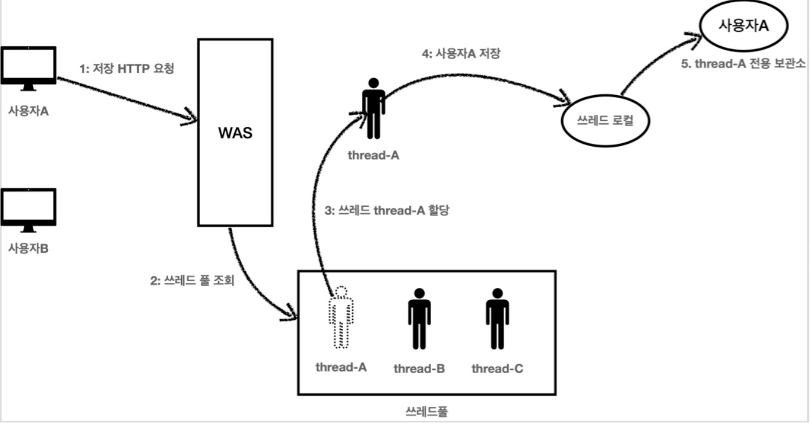<br>

1. 사용자A가 저장 HTTP를 요청했다.
2. WAS는 쓰레드 풀에서 쓰레드를 하나 조회한다
3. 쓰레드 `thread-A`가 할당되었다.
4. `thread-A`는 `사용자A`의 데이터를 쓰레드 로컬에 저장한다.
5. 쓰레드 로컬의 `thread-A`전용 보관소에 `사용자A`데이터를 보관한다.

**사용자A 저장 요청 종료**

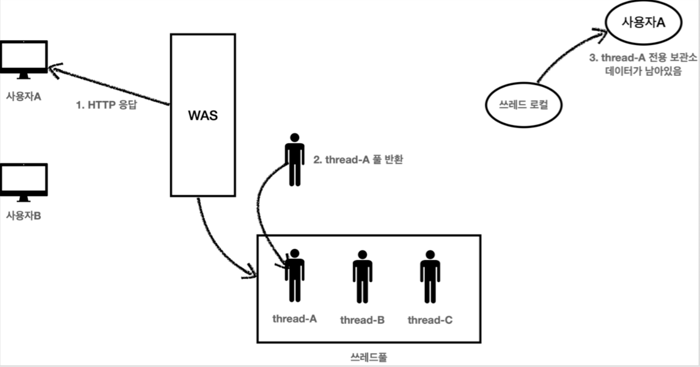<br>

1. 사용자A의 HTTP응답이 끝난다.
2. WAS는 사용이 끝난 `thread-A`를 쓰레드 풀에 반환한다. 쓰레드를 생성하는 비용은 비싸기 때문에 쓰레드를 제거하지 않고, 보통 쓰레드 풀을 통해서 쓰레드를 재사용한다.
3. `thread-A`는 쓰레드풀에 아직 살아있다. 따라서 쓰레드 로컬의 `thread-A`전용 보관소에 `사용자A`데이터도 함께 살아있게 된다.

**사용자B 조회 요청**

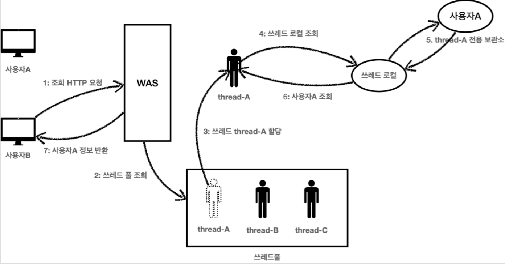<br>

1. 사용자B가 조회를 위한 새로운 HTTP요청을 한다.
2. WAS는 쓰레드 풀에서 쓰레드 하나 조회한다.
3. 쓰레드 `thread-A`가 할당되었다. (물론 다른 쓰레드가 할당될 수 도 있다)
4. 이번에는 조회하는 요청이다. `thread-A`전용 보관소에 있는 `사용자A`값을 반환한다.
5. 쓰레드 로컬은 `thread-A`전용 보관소에 있는 `사용자A`값을 반환한다.
6. 결과적으로 `사용자A`값이 반환된다.
7. 사용자B는 사용자A의 정보를 조회하게 된다.

결과적으로 사용자B는 사용자A의 데이터를 확인하게 되는 심각한 문제가 발생하게 된다.<br>
이런 문제를 예방하려면 사용자A의 요청이 끝날 때 쓰레드 로컬의 값을 `ThreadLocal.remove()`를 통해서 꼭 제거해야 한다.<br>쓰레드 로컬을 사용할 때는 이 부분을 꼭! 기억하자.

# 템플릿 메서드 패턴과 콜백 패턴

## 템플릿 메서드 패턴 - 시작

지금까지 로그 추적기를 열심히 잘 만들었다. 요구사항도 만족하고, 파라미터를 넘기는 불편함을 제거하기 위해 쓰레드 로컬도 도입했다. 그런데 로그 추적기를 막상 프로젝트에 도입하려고 하나 개발자들의 반대의 목소리가 높다.<br>로그 추적기 도입 전과 도입 후의 코드를 비교해보자

**로그 추적기 도입 전 - V0코드**

```java
//OrderControllerV0 코드
@GetMapping("/v0/request")
public String request(String itemId) {
    orderService.orderItem(itemId);
    return "ok";
}

//OrderServiceV0 코드
public void orderItem(String itemId) {
    orderRepository.save(itemId);
}
```

**로그 추적기 도입 후 - V3 코드**

```java
//OrderControllerV3 코드
@GetMapping("/v3/request")
public String request(String itemId) {
    TraceStatus status = null;
    try {
        status = trace.begin("OrderController.request()");
        orderService.orderItem(itemId);
        trace.end(status);
        return "ok";
    } catch (Exception e) {
        trace.exception(status, e);
        throw e;
    }
}

//OrderServiceV3 코드
public void orderItem(String itemId) {
    TraceStatus status = null;
    try {
        status = trace.begin("OrderService.orderItem()");
        orderRepository.save(itemId);
        trace.end(status);
    } catch (Exception e) {
        trace.exception(status, e);
        throw e;
    }
}
```

V0시절 코드와 비교해서 V3 코드를 보자.<br>
V0는 해당 메서드가 실제 처리해야 하는 핵심 기능만 깔끔하게 남아있다. 반면에 V3에는 핵심 기능보다 로그를 출력해야 하는 부가 기능 코드가 훨씬 더 많고 복잡하다.<br>
앞으로 코드를 설명할 때 핵심 기능과 부가 기능으로 구분해서 설명하겠다.

**핵심 기능 VS 부가 기능**

- **핵심 기능**은 해당 객체가 제공하는 고유의 기능이다. 예를 들어서 `orderService`의 핵심 기능은 주문 로직이다. 메서드 단위로 보면 `orderService.orderItem()`의 핵심 기능은 주문 데이터를 저장하기 위해 리포지토리를 호출하는 `orderRepository.save(itemId)`코드가 핵심 기능이다.
- **부가 기능**은 핵심 기능을 보조하기 위해 제공되는 기능이다. 예를 드어서 로그 추적 로직, 트랜잭션 기능이 있다. 이러한 부가 기능은 단독으로 사용되지는 않고, 핵심 기능과 함께 사용된다. 예를 들어서 로그 추적 기능은 어떤 핵심 기능이 호출되었는지 로그를 남기기 위해 사용한다. 그러니까 핵심 기능을 보조하기 위해 존재한다.

V0는 핵심 기능만 있지만, 로그 추적기를 추가한 V3코드는 핵심 기능과 부가 기능이 함께 섞여있다.<br>V3를 보면 로그 추적기의 도입으로 핵심 기능 코드보다 부가 기능을 처리하기 위한 코드가 더 많아졌다.<br>소위 배보다 배꼽이 큰 상황이다. 만약 클래스가 수백 개라면 어떻게 하겠는가?

이 문제를 좀 더 효율적으로 처리할 수 있는 방법이 있을까?<Br>
V3 코드를 유심히 잘 살펴보면 다음과 같은 동일한 패턴이 있다.

```java
TraceStatus status = null;
try {
    status = trace.begin("message");
    //핵심 기능 호출
    trace.end(status);
} catch (Exception e) {
    trace.exception(status, e);
    throw e;
}
```

`Controller`, `Service`, `Repository`의 코드를 잘 보면, 로그 추적기를 사용하는 구조는 모두 동일하다. 중간에 핵심 기능을 사용하는 코드만 다를 뿐이다.<br>부가 기능과 관련된 코드가 중복이니 중복을 별도의 메서드로 뽑아내면 될 것 같다. 그런데, `try~catch`는 물론이고, 핵심 기능 부분이 중간에 있어서 단순하게 메서드로 추출하는 것은 어렵다.

**변하는 것과 변하지 않는 것을 분리**

좋은 설계는 변하는 것과 변하지 않는 것을 분리하는 것이다.<br>
여기서 핵심 기능 부분은 변하고, 로그 추적기를 사용하는 부분은 변하지 않는 부분이다.<br>
이 둘을 분리해서 모듈화해야 한다

템플릿 메서드 패턴(Template Method Pattern)은 이런 문제를 해결하는 디자인 패턴이다.

## 템플릿 메서드 패턴 - 예제1

템플릿 메서드 패턴을 쉽게 이해하기 위해 단순한 예제 코드를 만들어보자.

### TemplateMethodTest

```java
package hello.advanced.trace.template;

import lombok.extern.slf4j.Slf4j;
import org.junit.jupiter.api.Test;

@Slf4j
public class TemplateMethodTest {

    @Test
    void templateMethodV0() {
        logic1();
        logic2();
    }

    private void logic1() {
        long startTime = System.currentTimeMillis();
        //비즈니스 로직 실행
        log.info("비즈니스 로직1 실행");
        //비즈니스 로직 종료
        long endTime = System.currentTimeMillis();
        long resultTime = endTime - startTime;
        log.info("resultTime={}", resultTime);
    }

    private void logic2() {
        long startTime = System.currentTimeMillis();
        //비즈니스 로직 실행
        log.info("비즈니스 로직2 실행");
        //비즈니스 로직 종료
        long endTime = System.currentTimeMillis();
        long resultTime = endTime - startTime;
        log.info("resultTime={}", resultTime);
    }
}
```

`logic1()`, `logic2()`를 호출하는 단순한 테스트 코드이다.

**실행 결과**

```
비즈니스 로직1 실행
resultTime=9
비즈니스 로직2 실행
resultTime=0
```

`logic1()`과 `logic2()`는 시간을 측정하는 부분과 비즈니스 로직을 실행하는 부분이 함께 존재한다.

- 변하는 부분: 비즈니스 로직
- 변하지 않는 부분: 시간 측정

이제 템플릿 메서드 패턴을 사용해서 변하는 부분과 변하지 않는 부분을 분리해보자.

## 템플릿 메서드 패턴 - 예제2

**템플릿 메서드 패턴 구조 그림**

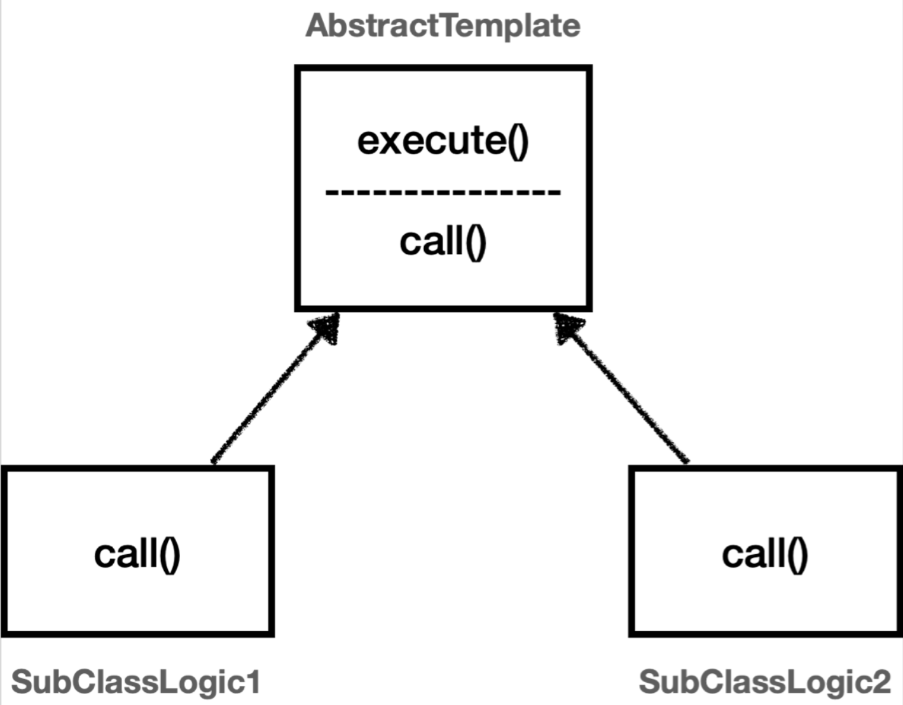<br>

**AbstractTemplate**

> [!NOTE]
> 테스트 코드(src/test)에 위치한다.

```java
package hello.advanced.trace.template;

import lombok.extern.slf4j.Slf4j;

@Slf4j
public abstract class AbstractTemplate {

    public void execute() {
        long startTime = System.currentTimeMillis();
        //비즈니스 로직 실행
        call(); //상속
        //비즈니스 로직 종료
        long endTime = System.currentTimeMillis();
        long resultTime = endTime - startTime;
        log.info("resultTime={}", resultTime);
    }

    protected abstract void call();
}
```

템플릿 메서드 패턴은 이름 그대로 템플릿을 사용하는 방식이다. 템플릿은 기준이 되는 거대한 틀이다.<br>템플릿이라는 틀에 변하지 않는 부분을 몰아둔다. 그리고 일부 변하는 부분은 별도로 호출해서 해결한다.

`AbstractTemplate`코드를 보자. 변하지 않는 부분인 시간 측정 로직을 몰아둔 것을 확인할 수 있다. 이제 이것이 하나의 템플릿이 된다. 그리고 템플릿 안에서 변하는 부분은 `call()`메서드를 호출해서 처리한다. 템플릿 메서드 패턴은 부모 클래스에 변하지 않는 템플릿 코드를 둔다. 그리고 변하는 부분은 자식 클래스에 두고 상속과 오버라이딩을 사용해서 처리한다.

**SubClassLogic1**

> [!NOTE]
> 테스트 코드 (src/test)에 위치한다.

```java
package hello.advanced.trace.template.code;

import hello.advanced.trace.template.AbstractTemplate;
import lombok.extern.slf4j.Slf4j;

@Slf4j
public class SubClassLogic1 extends AbstractTemplate {

    @Override
    protected void call() {
        log.info("비즈니스 로직1 실행");
    }
}
```

변하는 부분인 비즈니스 로직1을 처리하는 자식 클래스이다. 템플릿이 호출하는 대상인 `call()`메서드를 오버라이딩 한다.

**SubClassLogic2**

> [!NOTE]
> 테스트 코드(src/test)에 위치한다.

```java
package hello.advanced.trace.template.code;

import hello.advanced.trace.template.AbstractTemplate;
import lombok.extern.slf4j.Slf4j;

@Slf4j
public class SubClassLogic2 extends AbstractTemplate {
    @Override
    protected void call() {
        log.info("비즈니스 로직2 실행");
    }
}
```

변하는 부분인 비즈니스 로직2를 처리하는 자식 클래스이다. 템플릿이 호출하는 대상인 `call()`메서드를 오버라이딩 한다.

**TemplateMethodTest - templateMethodV1() 추가**

```java
/**
 * 템플릿 메서드 패턴 적용
 */
@Test
void templateMethodV1() {
    AbstractTemplate template1 = new SubClassLogic1();
    template1.execute();

    AbstractTemplate template2 = new SubClassLogic2();
    template2.execute();
}
```

템플릿 메서드 패턴으로 구현한 코드를 실행해보자.

**실행 결과**

```
비즈니스 로직1 실행
resultTime=8
비즈니스 로직2 실행
resultTime=0
```

**템플릿 메서드 패턴 인스턴스 호출 그림**

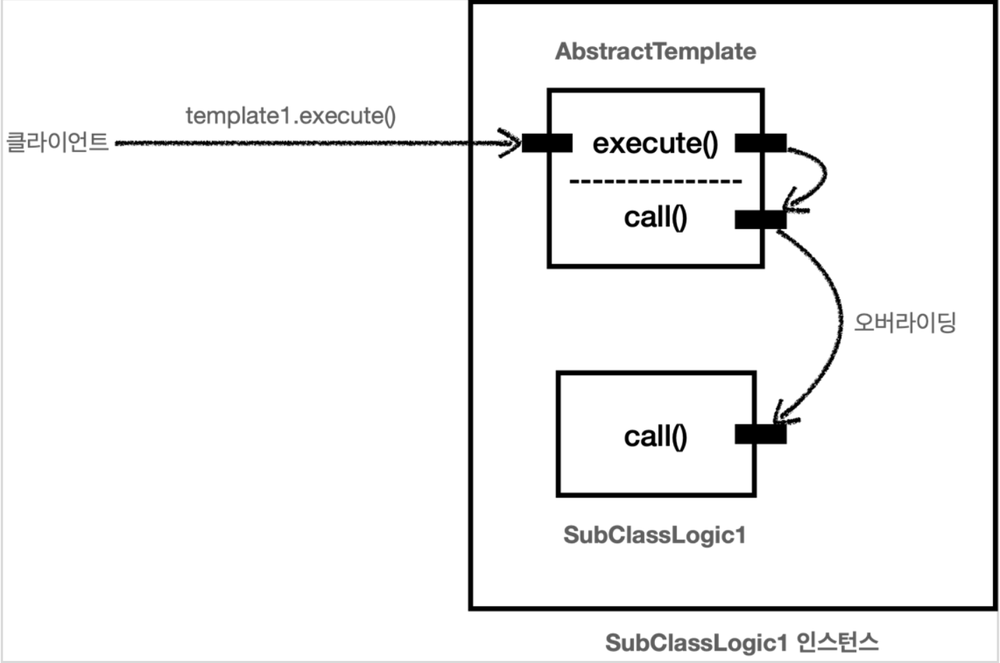<br>

`template1.execute()`를 호출하면 템플릿 로직인 `AbstractTemplate.execute()`를 실행한다. 여기서 중간에 `call()`메서드를 호출하는데, 이 부분이 오버라이딩 되어있다. 따라서 현재 인스턴스인 `SubClassLogic1`인스턴스의 `SubClassLogic1.call()`메서드가 호출된다.

템플릿 메서드 패턴은 이렇게 다형성을 사용해서 변하는 부분과 변하지 않은 부분을 분리하는 방법이다.

## 템플릿 메서드 패턴 - 예제3

**익명 내부 클래스 사용하기**

템플릿 메서드 패턴은 `SubClassLogic1`, `SubClassLogic2`처럼 클래스를 계속 만들어야 하는 단점이 있다. 익명 내부 클래스를 사용하면 이런 단점을 보완할 수 있다.<br>익명 내부 클래스를 사용하면 객체 인스턴스를 생성하면서 동시에 생성할 클래스를 상속 받은 자식 클래스를 정의할 수 있다. 이 클래스는 `SubClassLogic1`처럼 직접 지정하는 이름이 없고 클래스 내부에 선언되는 클래스여서 익명 내부 클래스라 한다.

**TemplateMethodTest - templateMethodV2() 추가**

```java
/**
 * 템플릿 메서드 패턴, 익명 내부 클래스 사용
 */
@Test
void templateMethodV2() {
    AbstractTemplate template1 = new AbstractTemplate() {
        @Override
        protected void call() {
            log.info("비즈니스 로직1 실행");
        }
    };
    log.info("클래스 이름1={}", template1.getClass());
    template1.execute();

    AbstractTemplate template2 = new AbstractTemplate() {
        @Override
        protected void call() {
            log.info("비즈니스 로직2 실행");
        }
    };
    log.info("클래스 이름2={}", template2.getClass());
    template2.execute();
}
```

**실행 결과**

```
클래스 이름1=class hello.advanced.trace.template.TemplateMethodTest$1
비즈니스 로직1 실행
resultTime=0
클래스 이름2=class hello.advanced.trace.template.TemplateMethodTest$2
비즈니스 로직2 실행
resultTime=0
```

실행 결과를 보면 자바가 임의로 만들어주는 익명 내부 클래스 이름은 `TemplateMethodTest$1`, `TemplateMethodTest$2`인 것을 확인할 수 있다.

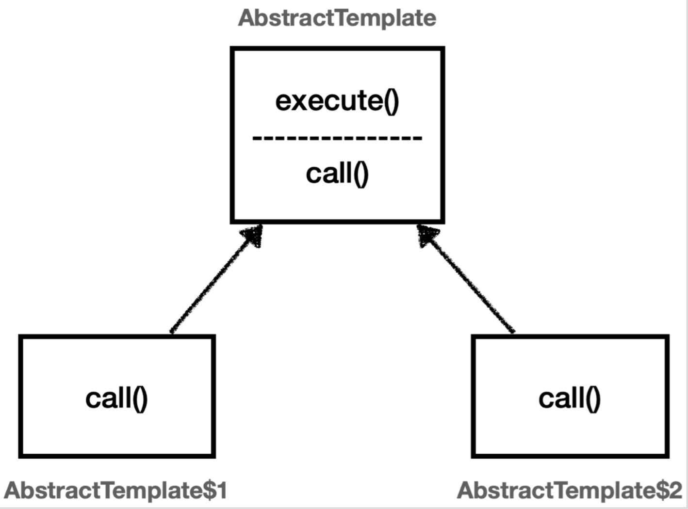<br>

## 템플릿 메서드 패턴 - 적용1

이제 우리가 만든 애플리케이션의 로그 추적기 로직에 템플릿 메서드 패턴을 적용해보자.

### AbstractTemplate

```java
package hello.advanced.trace.template;

import hello.advanced.trace.TraceStatus;
import hello.advanced.trace.logtrace.LogTrace;

public abstract class AbstractTemplate<T> {

    private final LogTrace trace;

    public AbstractTemplate(LogTrace trace) {
        this.trace = trace;
    }

    public T execute(String message) {
        TraceStatus status = null;
        try {
            status = trace.begin(message);

            //로직 호출
            T result = call();

            trace.end(status);
            return result;
        } catch (Exception e) {
            trace.exception(status, e);
            throw e;
        }
    }

    protected abstract T call();
}
```

- `AbstractTemplate`은 템플릿 메서드 패턴에서 부모 클래스이고, 템플릿 역할을 한다.
- `<T>`제네릭을 사용했다. 반환 타입을 정의했다.
- 객체를 생성할 때 내부에서 사용할 `LogTrace trace`를 전달 받는다.
- 로그에 출력할 `message`를 외부에서 파라미터로 전달받는다.
- 템플릿 코드 중간에 `call()`메서드를 통해서 변하는 부분을 처리한다.
- `abstract T call()`은 변하는 부분을 처리하는 메서드이다. 이 부분은 상속으로 구현해야 한다.
  

V3 -> V4 복사

먼저 기존 프로젝트 코드를 유지하기 위해 v4 애플리케이션을 복사해서 만들자.

### OrderControllerV4

```java
package hello.advanced.app.v4;

@RestController
@RequiredArgsConstructor
public class OrderControllerV4 {

    private final OrderServiceV4 orderService;
    private final LogTrace trace;

    @GetMapping("/v4/request")
    public String request(String itemId) {

        AbstractTemplate<String> template = new AbstractTemplate<>(trace) {
            @Override
            protected String call() {
                orderService.orderItem(itemId);
                return "ok";
            }
        };
        return template.execute("OrderController.request()");
    }
}
```

- `AbstractTemplate<String>`
  - 제네릭을 `String`으로 설정했다. 따라서 `AbstractTemplate`의 반환타입은 `String`이 된다.
- 익명 내부 클래스
  - 익명 내부 클래스를 사용한다. 객체를 생성하면서 `AbstractTemplate`를 상속받은 자식 클래스를 정의했다.
  - 따라서 별도의 자식 클래스를 직접 만들지 않아도 된다.
- `template.execute("OrdderController.request()")`
  - 템플릿을 실행하면서 로그로 남길 `message`를 전달한다.

### OrderServiceV4

```java
package hello.advanced.app.v4;

@Service
@RequiredArgsConstructor
public class OrderServiceV4 {

    private final OrderRepositoryV4 orderRepository;
    private final LogTrace trace;

    public void orderItem(String itemId) {
        AbstractTemplate<Void> template = new AbstractTemplate<>(trace) {
            @Override
            protected Void call() {
                orderRepository.save(itemId);
                return null;
            }
        };
        template.execute("OrderService.orderItem()");
    }
}
```

- `AbstractTemplate<Void>`
  - 제네릭에서 반환 타입이 필요한데, 반활할 내용이 없으면 `Void`타입을 사용하고 `null`을 반환하면 된다. 참고로 제네릭의 기본 타입인 `void`, `int`등을 선언할 수 없다.

### OrderRepositoryV4

```java
package hello.advanced.app.v4;

@Repository
@RequiredArgsConstructor
public class OrderRepositoryV4 {

    private final LogTrace trace;

    public void save(String itemId) {

        AbstractTemplate<Void> template = new AbstractTemplate<>(trace) {
            @Override
            protected Void call() {
                //저장로직
                if (itemId.equals("ex")) {
                    throw new IllegalStateException("예외 발생!");
                }
                sleep(1000);
                return null;
            }
        };
        template.execute("OrderRepository.save()");
    }

    private void sleep(int millis) {
        try {
            Thread.sleep(millis);
        } catch (InterruptedException e) {
            e.printStackTrace();
        }
    }
}
```

**정상 실행**

- `http://localhost:8080/v4/request?itemId=hello`

## 템플릿 메서드 패턴 - 적용2

템플릿 메서드 패턴 덕분에 변하는 코드와 변하지 않는 코드를 명확하게 분리했다.<br>로그를 출력하는 템플릿 역할을 하는 변하지 않는 코드는 모두 `AbstractTemplate`에 담아두고, 변하는 코드는 자식 클래스를 만들어서 분리했다.

지금까지 작성한 코드를 비교해보자.

```java
//OrderServiceV0
public void orderItem(String itemId) {
    orderRepository.save(itemId);
}

//OrderServiceV3
public void orderItem(String itemId) {
    TraceStatus status = null;
    try {
        status = trace.begin("OrderService.orderItem()");
        orderRepository.save(itemId);
        trace.end(status);
    } catch (Exception e) {
        trace.exception(status, e);
        throw e;
    }
}

//OrderServiceV4
AbstractTemplate<Void> template = new AbstractTemplate<>(trace) {
    @Override
    protected Void call() {
        orderRepository.save(itemId);
        return null;
    }
};
template.execute("OrderService.orderItem()");
```

- `OrderServiceV0`: 핵심 기능만 있다.
- `OrderServiceV3`: 핵심 기능과 부가 기능이 함께 섞여 있다.
- `OrderServiceV4`: 핵심 기능과 템플릿을 호출하는 코드가 섞여 있다.

V4는 템플릿 메서드 패턴을 사용한 덕분에 핵심 기능에 좀 더 집중할 수 있게 되었다.

### 좋은 설계란?

좋은 설계라는 것은 무엇일까? 수 많은 멋진 정의가 있겠지만, 진정한 좋은 설계는 바로 **변경**이 일어날 때 자연스럽게 드러난다.<br>지금까지 로그를 남기는 부분을 모아서 하나로 모듈화하고, 비즈니스 로직 부분을 분리했다. 여기서 만약 로그를 남기는 로직을 변경해야 한다고 생각해보자. 그래서 `AbstractTemplate`코드를 변경해야 한다 가정해보자. 단순히 `AbstractTemplate`코드만 변경하면 된다.<br>템플릿이 없는 `v3`상태에서 로그를 남기는 로직을 변경해야 한다고 생각해보자. 이 경우 모든 클래스를 다 찾아서 고쳐야 한다. 클래스가 수백 개라면 생각만해도 끔찍하다.

### 단일 책임 원칙(SRP)

`V4`는 단순히 템플릿 메서드 패턴을 적용해서 소스코드 몇줄을 줄인 것이 전부가 아니다.<br>로그를 남기는 부분에 단일 책임 원칙(SRP)을 지킨 것이다. 변경 지점을 하나로 모아서 변경에 쉽게 대처할 수 있는 구조를 만든 것이다.

## 템플릿 메서드 패턴 - 정의

GOF 디자인 패턴에서는 템플릿 메서드 패턴을 다음과 같이 정의했다.

> [!NOTE]
> 템플릿 메서드 디자인 패턴의 목적은 다음과 같습니다.<br>"작업에서 알고리즘의 골격을 정의하고 일부 단계를 하위 클래스로 연기합니다. 템플릿 메서드를 사용하면 하위 클래스가 알고리즘의 구조를 변경하지 않고도 알고리즘의 특정 단계를 재정의할 수 있습니다." 

GOF템플릿 메서드 패턴 정의

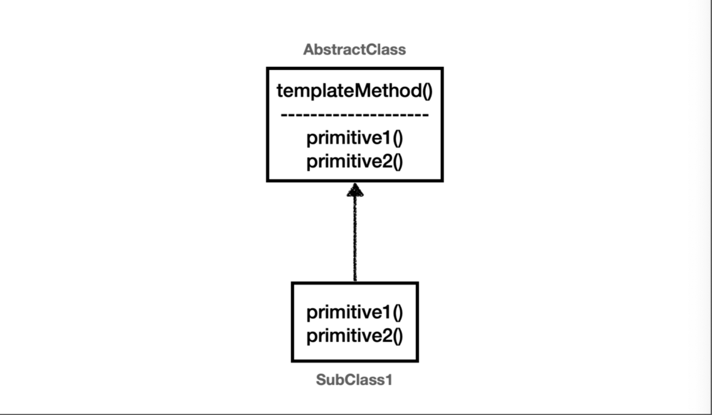<br>

풀어서 설명하면 다음과 같다.<br>부모 클래스에 알고리즘의 골격인 템플릿을 정의하고, 일부 변경되는 로직은 자식 클래스에 정의하는 것이다. 이렇게 하면 자식 클래스가 알고리즘의 전체 구조를 변경하지 않고, 특정 부분만 재정의 할 수 있다.<br>결국 상속과 오버라이딩을 통한 다형성으로 문제를 해결하는 것이다.

**하지만**

템플릿 메서드 패턴은 상속을 사용한다. 따라서 상속에서 오는 단점들을 그대로 안고간다. 특히 자식 클래스가 부모 클래스와 컴파일 시점에 강하게 결합되는 문제가 있다. 이것은 의존관계에 대한 문제이다. 자식 클래스 입장에서는 부모 클래스의 기능을 전혀 사용하지 않는다.<br>이번 장에서 지금까지 작성했던 코드를 떠올려보자. 자식 클래스를 작성할 때 부모 클래스의 기능을 사용한것이 있었던가?

그럼에도 불구하고 템플릿 메서드 패턴을 위해서 자식 클래스는 부모 클래스를 상속 받고 있다.

상속을 받는 다는 것은 특정 부모 클래스를 의존하고 있다는 것이다. 자식 클래스의 `extends`다음에 바로 부모 클래스가 코드상에 지정되어 있다. 따라서 부모 클래스의 기능을 사용하든 사용하지 않든 간에 부모 클래스를 강하게 의존하게 된다. 여기서 강하게 의존한다는 뜻은 자식 클래스의 코드에 부모 클래스의 코드가 명확하게 적혀 있다는 뜻이다. UML에서 상속을 받으면 삼각형 화살표가 `자식 -> 부모`를 향하고 있는 것은 이런 의존관계를 반영하는 것이다.

자식 클래스 입장에서는 부모 클래스의 기능을 전혀 사용하지 않는데, 부모 클래스를 알아야한다. 이것은 좋은 설계가 아니다. 그리고 이런 잘못된 의존관계 때문에 부모 클래스를 수정하면, 자식 클래스에도 영향을 줄 수 있다.

추가로 템플릿 메서드 패턴은 상속 구조를 사용하기 때문에, 별도의 클래스나 익명 내부 클래스를 만들어야하는 부분도 복잡하다.<br>지금까지 이런 부분들을 더 깔끔하게 개선하려면 어떻게 해야할까?

템플릿 메서드 패턴과 비슷한 역할을 하면서 상속의 단점을 제거할 수 있는 디자인 패턴이 바로 전략 패턴(Strategy Pattern)이다.

## 전략 패턴 - 시작

전략 패턴의 이해를 돕기 위해 템플릿 메서드 패턴에서 만들었던 동일한 예제를 사용해보자.

### ContextV1Test

```java
package hello.advanced.trace.strategy;

import lombok.extern.slf4j.Slf4j;
import org.junit.jupiter.api.Test;

@Slf4j
public class ContextV1Test {

    @Test
    void strategyV0() {
    }

    private void logic1() {
        long startTime = System.currentTimeMillis();
        //비즈니스 로직 실행
        log.info("비즈니스 로직1 실행");
        //비즈니스 로직 종료
        long endTime = System.currentTimeMillis();
        long resultTime = endTime - startTime;
        log.info("resultTime={}", resultTime);
    }

    private void logic2() {
        long startTime = System.currentTimeMillis();
        //비즈니스 로직 실행
        log.info("비즈니스 로직2 실행");
        //비즈니스 로직 종료
        long endTime = System.currentTimeMillis();
        long resultTime = endTime - startTime;
        log.info("resultTime={}", resultTime);
    }
}
```

잘 동작하면 동일한 문제를 전략 패턴으로 풀어보자.

**실행 결과**

```
비즈니스 로직1 실행
resultTime=7
비즈니스 로직2 실행
resultTime=1
```

## 전략 패턴 - 예제1

이번에는 동일한 문제를 전략 패턴으로 사용해서 해결해보자

템플릿 메서드 패턴은 부모 클래스에 변하지 않는 템프릿을 두고, 변하는 부분을 자식 클래스에 두어서 상속을 사용해서 문제를 해결했다.<br>전략 패턴은 변하지 않는 부분을 `Context`라는 곳에 두고, 변하는 부분을 `Strategy`라는 인터페이스를 만들어 해당 인터페이스를 구현하도록 해서 문제를 해결한다. 상속이 아니라 위임으로 문제를 해결하는것이다.<br>전략 패턴에서 `Context`는 변하지 않는 템플릿 역할을 하고, `Strategy`는 변하는 알고리즘 역할을 한다.

GOF디자인 패턴에서 정의한 전략 패턴의 의도는 다음과 같다.

> [!NOTE]
> 알고리즘 제품군을 정의하고 각각을 캡슐화하여 상호 교환 가능하게 만들자. 전략을 사용하면 알고리즘을 사용하는 클라이언트와 독립적으로 알고리즘을 변경할 수 있다.

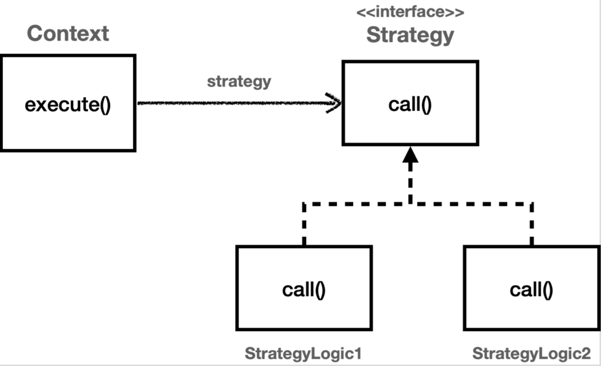<br>

### Strategy 인터페이스

> [!NOTE]
> 테스트 코드(src/test)에 위치한다.

```java
package hello.advanced.trace.strategy;

public interface Strategy {
    void call();
}
```

이 인터페이스는 변하는 알고리즘 역할을 한다.

### StrategyLogic1

> [!NOTE]
> 테스트 코드(src/test)에 위치한다.

```java
package hello.advanced.trace.strategy;

import lombok.extern.slf4j.Slf4j;

@Slf4j
public class StrategyLogic1 implements Strategy{
    @Override
    public void call() {
        log.info("비즈니스 로직1 실행");
    }
}
```

### StrategyLogic2

> [!NOTE]
> 테스트 코드(src/test)에 위치한다.

```java
package hello.advanced.trace.strategy;

import lombok.extern.slf4j.Slf4j;

@Slf4j
public class StrategyLogic2 implements Strategy{
    @Override
    public void call() {
        log.info("비즈니스 로직2 실행");
    }
}
```

### ContextV1

> [!NOTE]
> 테스트 코드(src/test)에 위치한다.

```java
package hello.advanced.trace.strategy;

import lombok.extern.slf4j.Slf4j;

/**
 * 필드에 전략을 보관하는 동작
 */
@Slf4j
public class ContextV1 {

    private Strategy strategy;

    public ContextV1(Strategy strategy) {
        this.strategy = strategy;
    }

    public void execute() {
        long startTime = System.currentTimeMillis();
        //비즈니스 로직 실행
        strategy.call();
        //비즈니스 로직 종료
        long endTime = System.currentTimeMillis();
        long resultTime = endTime - startTime;
        log.info("resultTime={}", resultTime);
    }
}
```

`ContextV1`은 변하지 않는 로직을 가지고 있는 템플릿 역할을 하는 코드이다. 전략 패턴에서는 이것을 컨텍스트(문맥)이라 한다.<br>쉽게 이야기해서 컨텍스트(문맥)는 크게 변하지 않지만, 그 문맥 속에서 `strategy`를 통해 일부 전략이 변경된다 생각하면 된다.

`Context`는 내부에 `Strategy strategy`필드를 가지고 있다. 이 필드에 변하는 부분인 `Strategy`의 구현체를 주입하면 된다.<br>전략 패턴의 핵심은 `Context`는 `Strategy`인터페이스에만 의존한다는 점이다. 이 덕분에 `Strategy`의 구현체를 변경하거나 새로 만들어도 `Context`코드에는 영향을 주지 않는다.

어디서 많이 본 코드 같지 않는가? 바로 스프링에서 의존관계 주입에서 사용하는 방식이 바로 젼략 패턴이다.

### ContextV1Test 추가

```java
/**
 * 전략 패턴 적용
 */
@Test
void strategyV1() {
    Strategy strategyLogic1 = new StrategyLogic1();
    ContextV1 context1 = new ContextV1(strategyLogic1);
    context1.execute();

    Strategy strategyLogic2 = new StrategyLogic2();
    ContextV1 context2 = new ContextV1(strategyLogic2);
    context2.execute();
}
```

전략 패턴을 사용해보자.<br>
코드를 보면 의존관계 주입을 통해 `ContextV1`에 `Strategy`의 구현체인 `strategyLogic1`를 주입하는것을 확인할 수 있다. 이렇게해서 `Context`안에 원하는 전략을 주입한다. 이렇게 원하는 모양으로 조립을 완료하고 난 다음에 `context1.execute()`를 호출해서 `context`를 실행한다.

**전략 패턴 실행 그림**

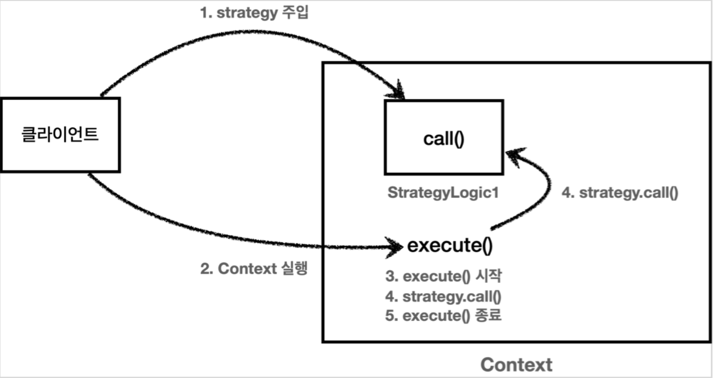<br>

1. `Context`에 원하는 `Strategy`구현체를 주입한다.
2. 클라이언트는 `context`를 실행한다.
3. `context`는 `context`로직을 시작한다.
4. `context`로직 중간에 `strategy.call()`을 호출해서 주입 받은 `strategy`로직을 실행한다.
5. `context`는 나머지 로직을 실행한다.

**실행 결과**

```
StrategyLogic1 -- 비즈니스 로직1 실행
ContextV1 -- resultTime=2
StrategyLogic2 -- 비즈니스 로직2 실행
ContextV1 -- resultTime=1
```

## 전략 패턴 - 예제2

전략 패턴도 익명 내부 클래스를 사용할 수 있다.

**ContextV1Test - 추가**

```java
/**
 * 전략 패턴 익명 내부 클래스1
 */
@Test
void strategyV2() {
    Strategy strategyLogic1 = new Strategy() {
        @Override
        public void call() {
            log.info("비즈니스 로직1 실행");
        }
    };
    log.info("strategyLogic1={}", strategyLogic1.getClass());
    ContextV1 context1 = new ContextV1(strategyLogic1);
    context1.execute();

    Strategy strategyLogic2 = new Strategy() {
        @Override
        public void call() {
            log.info("비즈니스 로직2 실행");
        }
    };
    log.info("strategyLogic2={}", strategyLogic2.getClass());
    ContextV1 context2 = new ContextV1(strategyLogic2);
    context2.execute();
}
```

**실행 결과**

```
ContextV1Test -- strategyLogic1=class hello.advanced.trace.strategy.ContextV1Test$1
ContextV1Test -- 비즈니스 로직1 실행
ContextV1 -- resultTime=0
ContextV1Test -- strategyLogic2=class hello.advanced.trace.strategy.ContextV1Test$2
ContextV1Test -- 비즈니스 로직2 실행
ContextV1 -- resultTime=1
```

실행 결과를 보면 `ContextV1Test$1`, `ContextV1Test$2`와 같이 익명 내부 클래스가 생성된 것을 확인할 수 있다.

**ContextV1Test - 추가**

```java
/**
 * 전략 패턴 익명 내부 클래스2
 */
@Test
void strategyV3() {
    ContextV1 context1 = new ContextV1(new Strategy() {
        @Override
        public void call() {
            log.info("비즈니스 로직1 실행");
        }
    });
    context1.execute();

    ContextV1 context2 = new ContextV1(new Strategy() {
        @Override
        public void call() {
            log.info("비즈니스 로직2 실행");
        }
    });
    context2.execute();
}
```

익명 내부 클래스를 변수에 담아두지 말고, 생성하면서 바로 `ContextV1`에 전달해도 된다.

**ContextV1Test - 추가**

```java

/**
 * 전략 패턴, 람다
 */
@Test
void strategyV4() {
    ContextV1 context1 = new ContextV1(() -> log.info("비즈니스 로직1 실행"));
    context1.execute();

    ContextV1 context2 = new ContextV1(() -> log.info("비즈니스 로직2 실행"));
    context2.execute();
}
```

익명 내부 클래스를 자바8부터 제공하는 람다로 변경할 수 있다. 람다로 변경하려면 인터페이스에 메서드가 1개만 있으면 되는데, 여기에서 제공하는 `Strategy`인터페이스는 메서드가 1개만 있으므로 람다로 사용할 수 있다.

### 정리

지금까지 일반적으로 이야기하는 전략 패턴에 대해서 알아보았다. 변하지 않는 부분은 `Context`에 두고 변하는 부분을 `Strategy`를 구현해서 만든다. 그리고 `Context`의 내부 필드에 `Strategy`를 주입해서 사용했다.

### 선 조립, 후 실행

여기서 이야기하고 싶은 부분은 `Context`의 내부 필드에 `Strategy`를 두고 사용하는 부분이다.<br>
이 방식은 `Context`와 `Strategy`를 실행 전에 원하는 모양으로 조립해두고, 그 다음에 `Context`를 실행하는 선 조립, 후 실행 방식에서 매우 유용하다.<br>
`Context`와 `Strategy`를 한번 조립하고 나면 이후로는 `Context`를 실행하기만 하면 된다. 우리가 스프링으로 애플리케이션을 개발할 때 애플리케이션 로깅 시점에 의존관계 주입을 통해 필요한 의존관계를 모두 맺어두고 난 다음에 실제 요청을 처리하는 것과 같은 원리이다.<br>
이 방식의 단점은 `Context`와 `Strategy`를 조립한 이후에는 전략을 변경하기가 번거롭다는 점이다. 물론 `Context`에 `setter`를 적용해서 `Strategy`를 넘겨 받아 변경하면 되지만, `Context`를 싱글톤으로 사용할 때는 동시성 이슈 등 고려할 점이 많다. 그래서 전략을 실시간으로 변경해야 하면 차라리 이전에 개발한 테스트 코드 처럼 `Context`를 하나 더 생성하고 그곳에 다른 `Strategy`를 주입하는 것이 더 나은 선택일 수 있다.

이렇게 먼저 조립하고 사용하는 방식보다 더 유연하게 전략 패턴을 사용하는 방법은 없을까?

## 전략 패턴 - 예제3

이번에는 전략 패턴을 조금 다르게 사용해보자. 이전에는 `Context`의 필드에 `Strategy`를 주입해서 사용했다.<br>이번에는 전략을 실행할 때 직접 파라미터로 전달해서 사용해보자.

**ContextV2**

> [!NOTE]
> 테스트 코드(src/test)에 위치한다.

```java
package hello.advanced.trace.strategy;

import lombok.extern.slf4j.Slf4j;

/**
 * 전략을 파라미터로 전달 받는 방식
 */
@Slf4j
public class ContextV2 {

    public void execute(Strategy strategy) {
        long startTime = System.currentTimeMillis();
        //비즈니스 로직 실행
        strategy.call(); //위임
        //비즈니스 로직 종료
        long endTime = System.currentTimeMillis();
        long resultTime = endTime - startTime;
        log.info("resultTime={}", resultTime);
    }
}
```

`ContextV2`는 전략 필드로 가지지 않는다. 대신에 전략을 `execute(...)`가 호출될 때 마다 항상 파라미터로 전달 받는다.

**ContextV2Test**

```java
package hello.advanced.trace.strategy;

import lombok.extern.slf4j.Slf4j;
import org.junit.jupiter.api.Test;

@Slf4j
public class ContextV2Test {

    /**
     * 전략 패터 적용
     */
    @Test
    void strategyV1() {
        ContextV2 context = new ContextV2();
        context.execute(new StrategyLogic1());
        context.execute(new StrategyLogic2());
    }
}
```

`Context`와 `Strategy`를 "선 조립 후 실행"하는 방식이 아니라 `Context`를 실행할 때마다 전략을 인수로 전달한다.<br>
클라이언트는 `Context`를 실행하는 시점에 원하는 `Strategy`를 전달할 수 있다. 따라서 이전 방식과 비교해서 원하는 전략을 더욱 유연하게 변경할 수 있다.<br>
테스트 코드를 보면 하나의 `Context`만 생성한다. 그리고 하나의 `Context`에 실행 시점에 여러 전략을 인수로 전달해서 유연하게 실행하는 것을 확인할 수 있다.

**전략 패턴 파라미터 실행 그림**

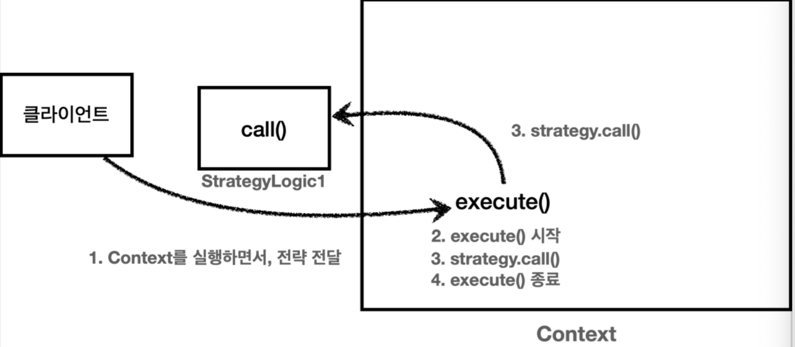<br>

1. 클라이언트는 `Context`를 실행하면서 인수로 `Strategy`를 전달한다.
2. `Context`는 `execute()`로직을 실행한다.
3. `Context`는 파라미터로 넘어온 `strategy.call()`로직을 실행한다.
4. `Context`의 `execute()`로직이 종료된다.

**ContextV2Test - 추가**

```java
/**
 * 전략 패턴 익명 내부 클래스
 */
@Test
void strategyV2() {
    ContextV2 context = new ContextV2();
    context.execute(new Strategy() {
        @Override
        public void call() {
            log.info("비즈니스 로직1 실행");
        }
    });
    context.execute(new Strategy() {
        @Override
        public void call() {
            log.info("비즈니스 로직2 실행");
        }
    });
}
```

여기도 물론 익명 내부 클래스를 사용할 수 있다. 코드 조각을 파라미터로 넘긴다고 생각하면 더 자연스럽다.

**ContextV2Test - 추가**

```java
/**
 * 전략 패턴 익명 내부 클래스2, 람다
 */
@Test
void strategyV3() {
    ContextV2 context = new ContextV2();
    context.execute(() -> log.info("비즈니스 로직1 실행"));
    context.execute(() -> log.info("비즈니스 로직2 실행"));
}
```

람다를 사용해서 코드를 더 단순하게 만들 수 있다.

### 정리

- `ContextV1`은 필드에 `Strategy`를 저장하는 방식으로 전략 패턴을 구사했다.
  - 선 조립, 후 실행 방법에 적합하다.
  - `Context`를 실행하는 시점에는 이미 조립이 끝났기 때문에 전략을 신경쓰지 않고 단순히 실행만 하면 된다.
- `ContextV2`는 파라미터에 `Strategy`를 전달받는 방식으로 전략 패턴을 구사했다.
  - 실행할 때 마다 전략을 유연하게 변경할 수 있다.
  - 단점 역시 실행할 때 마다 전략을 계속 지정해주어야 한다는 점이다.

### 템플릿

지금 우리가 해결하고 싶은 문제는 변하는 부분과 변하지 않는 부분을 분리하는 것이다.<br>
변하지 않는 부분은 템플릿이라고 하고, 그 템플릿 안에서 변하는 부분에 약간 다른 코드 조각을 넘겨서 실행하는 것이 목적이다.<br>
`ContextV1`, `ContextV2` 두 가지 방식 다 문제를 해결할 수 있지만, 어떤 방식이 조금 더 나아 보이는가? 지금 우리가 원하는 것은 애플리케이션 의존 관계를 설정하는 것 처럼 선 조립, 후 실행이 아니다. 단순히 코드를 실행할 때 변하지 않는 템플릿 있고, 그 템플릿 안에서 원하는 부분만 살짝 다른 코드를 실행하고 싶을 뿐이다.<br>
따라서 우리가 고민하는 문제는 실행 시점에 유연하게 실행 코드 조각을 전달하는 `ContextV2`가 더 적합하다.

## 템플릿 콜백 패턴 - 시작

`ContextV2`는 변한지 않는 템플릿 역할을 한다. 그리고 변하는 부분은 파라미터로 넘어온 `Strategy`의 코드를 실행해서 처리한다. 이렇게 다른 코드의 인수로서 넘겨주는 실행가능한 코드를 콜백(callback)이라 한다.

> [!NOTE]
> **콜백 정의**<br>
> 프로그래밍에서 콜백(callback)또는 콜애프터 함수(call-after-function)는 다른 코드의 인수로서 넘겨주는 실행 가능한 코드를 말한다. 콜백을 넘겨받는 코드는 이 콜백을 필요에 따라 즉시 실행할 수도 있고, 아니면 나중에 실행할 수도 있다.

쉽게 이야기해서 `callback`은 코드가 호출(`call`)은 되는데 코드를 넘겨준 곳의 뒤(`back`)에서 실행된다는 뜻이다.

- `ContextV2`예제에서 콜백은 `Strategy`이다.
- 여기에서는 클라이언트에서 직접 `Strategy`를 실행하는것이 아니라, 클라이언트가 `ContextV2.execute(...)`를 실행할 때 `Strategy`를 넘겨두고, `ContextV2`뒤에서 `Strategy`가 실행된다.

**자바 언어에서 콜백**

- 자바 언어에서 실행 가능한 코드를 인수로 넘기려면 객체가 필요하다. 자바8부터는 람다를 사용할 수 있다.
- 자바8이전에는 보통 하나의 메소드를 가진 인터페이스를 구현하고, 주로 익명 내부 클래스를 사용했다.
- 최근에는 주로 람다를 사용한다.

**템플릿 콜백 패턴**

- 스프링에서는 `ContextV2`와 같은 방식의 전략 패턴을 템플릿 콜백 패턴이라 한다. 전략 패턴에서 `Context`가 템플릿 역할을 하고, `Strategy`부분이 콜백으로 넘어온다 생각하면 된다.
- 참고로 템플릿 콜백 패턴은 GOF패턴은 아니고, 스프링 내부에서 이런 방식을 자주 사용하기 때문에, 스프링 안에서만 이렇게 부른다. 전략 피턴에서 템플릿과 콜백 부분이 강조된 패턴이라 생각하면 된다.
- 스프링에서는 `JdbcTemplate`, `RestTemplate`, `TransactionTemplate`, `RedisTemplate`처럼 다양한 템플릿 콜백 패턴이 사용된다. 스프링에서 이름에 `XxxTemplate`가 있으면 템플릿 콜백 패턴으로 만들어져 있다 생각하면 된다.

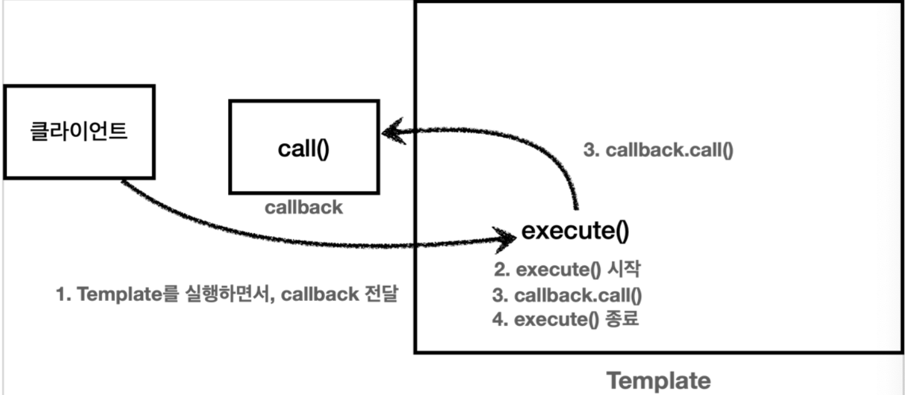<br>

## 템플릿 콜백 패턴 - 예제

템플릿 콜백 패턴을 구현해보자. `ContextV2`와 내용이 같고 이름만 다르므로 크게 어려움은 없을 것이다.

- `Context` -> `Templage`
- `Strategy` -> `Callback`

**Callback - 인터페이스**

> [!NOTE]
> 테스트 코드(src/test)에 위치한다.

```java
package hello.advanced.trace.strategy.code.template;

public interface Callback {
    void call();
}
```

콜백 로직을 전달할 인터페이스이다.

**TimeLogTemplate**

> [!NOTE]
> 테스트 코드(src/test)에 위치한다.

```java
package hello.advanced.trace.strategy.code.template;

import lombok.extern.slf4j.Slf4j;

@Slf4j
public class TimeLogTemplate {

    public void execute(Callback callback) {
        long startTime = System.currentTimeMillis();
        //비즈니스 로직 실행
        callback.call(); //위임
        //비즈니스 로직 종룡
        long endTime = System.currentTimeMillis();
        long resultTime = endTime - startTime;
        log.info("result={}", resultTime);
    }
}
```

**TemplateCallbackTest**

```java
package hello.advanced.trace.strategy;

import hello.advanced.trace.strategy.code.template.Callback;
import hello.advanced.trace.strategy.code.template.TimeLogTemplate;
import lombok.extern.slf4j.Slf4j;
import org.junit.jupiter.api.Test;

@Slf4j
public class TemplateCallbackTest {

    /**
     * 템플릿 콜백 패턴 - 익명 내부 클래스
     */
    @Test
    void callbackV1() {
        TimeLogTemplate template = new TimeLogTemplate();

        template.execute(new Callback() {
            @Override
            public void call() {
                log.info("비즈니스 로직1 실행");
            }
        });
        template.execute(new Callback() {
            @Override
            public void call() {
                log.info("비즈니스 로직2 실행");
            }
        });
    }

    /**
     * 템플릿 콜백 패턴 - 람다
     */
    @Test
    void callbackV2() {
        TimeLogTemplate template = new TimeLogTemplate();
        template.execute(() -> log.info("비즈니스 로직1 실행"));
        template.execute(() -> log.info("비즈니스 로직2 실행"));
    }
}
```

별도의 클래스를 만들어서 전달해도 되지만, 콜백을 사용할 경우 익명 내부 클래스나 람다를 사용하는 것이 편리하다.<br>물론 여러곳에서 함께 사용되는 경우 재사용을 위해 콜백을 별도의 클래스로 만들어도 된다.

## 템플릿 콜백 패턴 - 적용

이제 템플릿 콜백 패턴을 애플리케이션에 적용해보자.

**TraceCallback 인터페이스**

```java
package hello.advanced.trace.callback;

public interface TraceCallback<T> {
    T call();
}
```

- 콜백을 전닳나느 인터페이스이다.
- `<T>`제네릭을 사용했다. 콜백의 반환 타입을 정의한다.

**TraceTemplate**

```java
package hello.advanced.trace.callback;

import hello.advanced.trace.TraceStatus;
import hello.advanced.trace.logtrace.LogTrace;

public class TraceTemplate {

    private final LogTrace trace;

    public TraceTemplate(LogTrace trace) {
        this.trace = trace;
    }

    public <T> T execute(String message, TraceCallback<T> callback) {
        TraceStatus status = null;
        try {
            status = trace.begin(message);

            //로직 호출
            T result = callback.call();

            trace.end(status);
            return result;
        } catch (Exception e) {
            trace.exception(status, e);
            throw e;
        }
    }
}
```

- `TraceTemplate`는 템플릿 역할을 한다.
- `execute(...)`를 보면 `message`데이터와 콜백인 `TraceCallback callback`을 전달 받는다.
- `<T>` 제네릭을 사용했다. 반환 타입을 정의한다.

**V4 -> V5 복사**

**OrderControllerV5**

```java
package hello.advanced.app.v5;

@RestController
public class OrderControllerV5 {

    private final OrderServiceV5 orderService;
    private final TraceTemplate template;

    public OrderControllerV5(OrderServiceV5 orderService, LogTrace trace) {
        this.orderService = orderService;
        this.template = new TraceTemplate(trace);
    }

    @GetMapping("/v5/request")
    public String request(String itemId) {
        return template.execute("OrderController.request()", new TraceCallback<String>() {
            @Override
            public String call() {
                orderService.orderItem(itemId);
                return "ok";
            }
        });
    }
}
```

- `this.template = new TraceTemplate(trace)`: `trace`의존관계 주입을 받으면서 필요한 `TraceTemplate`템플릿을 생성한다. 참고로 `TraceTemplate`를 처음부터 스프링 빈으로 등록하고 주입받아도 된다. 이 부분은 선택이다.
- `template.execute(.., new TraceCallback(){..})`: 템플릿을 실행하면서 콜백을 전달한다. 여기서 콜백으로 익명 내부 클래스를 사용한다.


**OrderServiceV5**

```java
package hello.advanced.app.v5;

@Service
public class OrderServiceV5 {

    private final OrderRepositoryV5 orderRepository;
    private final TraceTemplate template;

    public OrderServiceV5(OrderRepositoryV5 orderRepository, LogTrace trace) {
        this.orderRepository = orderRepository;
        this.template = new TraceTemplate(trace);
    }

    public void orderItem(String itemId) {
        template.execute("OrderService.orderItem()", () -> {
            orderRepository.save(itemId);
            return null;
        });
    }
}
```

- `template.execute(.., new TraceCallback(){..})`: 템플릿을 실행하면서, 콜백을 전달한다. 여기서는 콜백으로 람다를 전달했다.

**OrderRepositoryV5**

```java
package hello.advanced.app.v5;

@Repository
public class OrderRepositoryV5 {

    private final TraceTemplate template;

    public OrderRepositoryV5(LogTrace trace) {
        this.template = new TraceTemplate(trace);
    }

    public void save(String itemId) {
        template.execute("OrderRepository.save()", () -> {
            //저장 로직
            if (itemId.equals("ex")) {
                throw new IllegalStateException("예외 발생!");
            }
            sleep(1000);
            return null;
        });
    }
    
    private void sleep(int millis) {
        try {
            Thread.sleep(millis);
        } catch (InterruptedException e) {
            e.printStackTrace();
        }
    }
}
```

정상 실행

- http://localhost:8080/v5/request?itemId=hello

정상 실행 로그

```
[3801cd98] OrderController.request()
[3801cd98] |-->OrderService.orderItem()
[3801cd98] | |-->OrderRepository.save()
[3801cd98] | |<--OrderRepository.save() time=1001ms
[3801cd98] |<--OrderService.orderItem() time=1002ms
[3801cd98] OrderController.request() time=1010ms
```

### 정리

지금까지 우리는 변하는 코드와 변하지 않는 코드를 분리하고, 더 적은 코드로 로그 추적기를 적용하기 위해 고군부투 했다.<br>
템플릿 메서드 패턴, 전략 패턴, 그리고 템플릿 콜백 패턴까지 진행하면서 변하는 코드와 변하지 않는 코드를 분리했다. 그리고 최종적으로 템플릿 콜백 패턴을 적용하고 콜백으로 람다를 사용해서 코드 사용도 최소화 할 수 있었다.

**한계**

그런데 지금까지 설명한 방식의 한계는 아무리 최적화를 해도 결국 로그 추적기를 적용하기 위해서 원본 코드를 수정해야 한다는 점이다. 클래스가 수백개이면 수백개를 더 힘들게 수정하는가 조금 덜 힘들게 수정하는가의 차이가 있을 뿐, 본질적으로 코드를 다 수정해야 하는 것은 마찬가지이다.

개발자의 게으름에 대한 욕심은 끝이 없다. 수 많은 개발자가 이 문제에 대해서 집요하게 고민해왔고, 여러가지 방향으로 해결책을 만들어왔다. 지금부터 원본 코드를 손대지 않고 로그 추적기를 적용할 수 있는 방법을 알아보자. 그러기 위해서 프록시 개념을 머저 이해해야 한다.

> [!TIP]
> 지금까지 설명한 방식은 실제 스프링 안에서 많이 사용되는 방식이다. `XxxTemplate`를 만나면 이번에 학습한 내용을 떠올려보면 어떻게 돌아가는지 쉽게 이해할 수 있을 것이다.

# 프록시 패턴과 데코레이터 패턴

## 프로젝트 생성

프로젝트 이름 `proxy`

## 예제 프로젝트 만들기 v1

다양한 상황에서 프록시 사용법을 이해하기 위해 다음과 같은 기준으로 기본 예제 프로젝트를 만들어보자.

**예제는 크게 3가지 상황으로 만든다.**

- v1 - 인터페이스와 구현 클래스 - 스프링 빈으로 수동 등록
- v2 - 인터페이스 없는 구체 클래스 - 스프링 빈으로 수동 등록
- v3 - 컴포넌트 스캔으로 스프링 빈 자동 등록

실무에서는 스프링 빈으로 등록할 클래스는 인터페이스가 있는 경우도 있고 없는 경우도 있다. 그리고 스프링 빈을 수동으로 직접 등록하는 경우도 있고, 컴포넌트 스캔으로 자동으로 등록하는 경우도 있다. 이런 다양한 케이스에 프록시를 어떻게 적용하는지 알아보기 위해 다양한 예제를 준비해보자.

**V1- 인터페이스와 구현 클래스 - 스프링 빈으로 수동 등록**

지금까지 보아왔던 `Controller`, `Service`, `Repository`에 인터페이스를 도입하고, 스프링 빈으로 수동 등록해보자.

**OrderRepositoryV1**

```java
package hello.proxy.app.v1;

public interface OrderRepositoryV1 {
    void save(String itemId);
}
```

**OrderRepositoryV1Impl**

```java
package hello.proxy.app.v1;

public class OrderRepositoryV1Impl implements OrderRepositoryV1{

    @Override
    public void save(String itemId) {
        //저장 로직
        if (itemId.equals("ex")) {
            throw new IllegalStateException("예외 발생!");
        }
        sleep(1000);
    }

    private void sleep(int millis) {
        try {
            Thread.sleep(millis);
        } catch (InterruptedException e) {
            e.printStackTrace();
        }
    }
}
```

**OrderServiceV1**

```java
package hello.proxy.app.v1;

public interface OrderServiceV1 {
    void orderItem(String itemId);
}
```

**OrderServiceV1Impl**

```java
package hello.proxy.app.v1;

public class OrderServiceV1Impl implements OrderServiceV1{

    private final OrderRepositoryV1 orderRepository;

    public OrderServiceV1Impl(OrderRepositoryV1 orderRepository) {
        this.orderRepository = orderRepository;
    }

    @Override
    public void orderItem(String itemId) {
        orderRepository.save(itemId);
    }
}
```

**OrderControllerV1**

```java
package hello.proxy.app.v1;

import org.springframework.web.bind.annotation.GetMapping;
import org.springframework.web.bind.annotation.RequestMapping;
import org.springframework.web.bind.annotation.RequestParam;
import org.springframework.web.bind.annotation.ResponseBody;

@RequestMapping
@ResponseBody
public interface OrderControllerV1 {

    @GetMapping("/v1/request")
    String request(@RequestParam("itemId") String itemId);

    @GetMapping("/v1/no-log")
    String noLog();
}
```

- `@RequestMapping`: 스프링 MVC는 타입에 `@Controller`또는 `@RequestMapping`애노테이션이 있어야 스프링 컨트롤러로 인식한다. 그리고 스프링 컨트롤러로 인식해야, HTTP URL이 매핑되고 동작한다. 이 애노테이션 인터페이스에 사용해도 된다.
- `@ResponseBody`: HTTP메시지 컨버터를 사용해서 응답한다. 이 애노테이션은 인터페이스에 사용해도 된다.
- `@RequestParam("itmeId") String itemId`: 인터페이스에는 `@RequestParam("itemId")`의 값을 생략하면 `itemId`단어를 컴파일 이후 자바 버전에 따라 인식하지 못할 수 있다. 언터페이스에서는 꼭 넣어주자. 클래스에는 생략해도 대부분 잘 지원한다.
- 코드를 보면 `request()`, `noLog()`두 가지 메서드가 있다. `request()`는 `LogTrace`를 적용할 대상이고, `noLog()`는 단순히 `LogTrace`를 적용하지 않을 대상이다.

**OrderControllerV1Impl**

```java
package hello.proxy.app.v1;

import lombok.extern.slf4j.Slf4j;

@Slf4j
public class OrderControllerV1Impl implements OrderControllerV1 {

    private final OrderServiceV1 orderService;

    public OrderControllerV1Impl(OrderServiceV1 orderService) {
        this.orderService = orderService;
    }

    @Override
    public String request(String itemId) {
        orderService.orderItem(itemId);
        return "ok";
    }

    @Override
    public String noLog() {
        return "ok";
    }
}
```

- 컨트롤러 구현체이다. `OrderControllerV1`인터페이스에 스프링MVC관련 애노테이션이 정의되어 있다.

**AppV1Config**

이제 스프링 빈으로 수동 등록해보자.

```java
package hello.proxy.config;

import hello.proxy.app.v1.*;
import org.springframework.context.annotation.Bean;
import org.springframework.context.annotation.Configuration;

@Configuration
public class AppV1Config {

    @Bean
    public OrderControllerV1 orderControllerV1() {
        return new OrderControllerV1Impl(orderServiceV1());
    }

    @Bean
    public OrderServiceV1 orderServiceV1() {
        return new OrderServiceV1Impl(orderRepositoryV1());
    }

    @Bean
    public OrderRepositoryV1 orderRepositoryV1() {
        return new OrderRepositoryV1Impl();
    }
}
```

- 스프링 빈으로 수동 등록하는 코드는 특별히 어려운 내용이 없다.

**ProxyApplication - 코드 추가**

```java
package hello.proxy;

import hello.proxy.config.AppV1Config;
import org.springframework.boot.SpringApplication;
import org.springframework.boot.autoconfigure.SpringBootApplication;
import org.springframework.context.annotation.Import;

@Import(AppV1Config.class)
@SpringBootApplication(scanBasePackages = "hello.proxy.app")
public class ProxyApplication {

	public static void main(String[] args) {
		SpringApplication.run(ProxyApplication.class, args);
	}
}
```

- `@Import(AppV1Config.class)`: 클래스를 스프링 빈으로 등록한다. 여기서는 `AppV1Config.class`를 스프링 빈으로 등록한다. 일반적으로 `@Configuration`같은 설정 파일을 등록할 때 사용하지만, 스프링 빈을 등록할 때는 사용할 수 있다.
- `@SpringBootApplication(scanBasePackages = "hello.proxy.app")`: `@ComponentScan`의 기능과 같다. 컴포넌트 스캔을 시작할 위치를 지정한다. 이 값을 설정하면 해당 패키지와 그 하위 패키지를 컴포넌트 스캔한다. 이 값을 사용하지 않으면 `ProxyApplication`이 있는 패키지와 그 하위 패키지를 스캔한다. 참고로 `v3`에서 지금 설정한 컴포넌트 스캔을 사용한다.

> [!CAUTION]
> 앞으로 `@Configuration`을 사용한 수동 빈 설정을 `hello.proxy.config`위치에 두고 점진적으로 변경할 예정이다. 지금은 `AppV1Config.class`를 `@Import`를 사용해서 설정하지만 이후에 다른 것을 설정한다는 이야기이다.
>
> `@Configuration`은 내부에 `@Component`애노테이션을 포함하고 있어서 컴포넌트 스캔의 대상이 된다. 따라서 컴포넌트 스캔에 의해 `hello.proxy.config`위치의 설정 파일들이 스프링 빈으로 자동 등록 되지 않도록 컴포넌트 스캔의 시작 위치를 `scanBasePackages=hello.proxy.app`로 설정해야 한다.

**실행**<br>
http://localhost:8080/v1/request?itemId=hello

**결과**<br>
웹 브라우저 화면: `ok`

## 예제 프로젝트 만들기 v2

**v2 - 인터페이스 없는 구체 클래스 - 스프링 빈으로 수동 등록**<br>
이번에는 인터페이스가 없는 `Controller`, `Service`, `Repository`를 스프링 빈으로 수동 등록해보자.

**OrderRepositoryV2**

```java
package hello.proxy.app.v2;

public class OrderRepositoryV2 {

    public void save(String itemId) {
        //저장로직
        if (itemId.equals("ex")) {
            throw new IllegalStateException("예외 발생!");
        }
        sleep(1000);
    }

    private void sleep(int millis) {
        try {
            Thread.sleep(millis);
        } catch (InterruptedException e) {
            e.printStackTrace();
        }
    }
}
```

**OrderServiceV2**

```java
package hello.proxy.app.v2;

public class OrderServiceV2 {

    private final OrderRepositoryV2 orderRepository;

    public OrderServiceV2(OrderRepositoryV2 orderRepository) {
        this.orderRepository = orderRepository;
    }

    public void orderItem(String itemId) {
        orderRepository.save(itemId);
    }
}
```

**OrderControllerV2**

```java
package hello.proxy.app.v2;

import lombok.extern.slf4j.Slf4j;
import org.springframework.web.bind.annotation.GetMapping;
import org.springframework.web.bind.annotation.RequestMapping;
import org.springframework.web.bind.annotation.ResponseBody;

@Slf4j
@RequestMapping
@ResponseBody
public class OrderControllerV2 {

    private final OrderServiceV2 orderService;

    public OrderControllerV2(OrderServiceV2 orderService) {
        this.orderService = orderService;
    }

    @GetMapping("/v2/request")
    public String request(String itemId) {
        orderService.orderItem(itemId);
        return "ok";
    }

    @GetMapping("/v2/no-log")
    public String noLog() {
        return "ok";
    }
}
```

`@RequestMapping`: 스프링MVC는 타입에 `@Controller`또는 `@RequestMapping`애노테이션이 있어야 스프링 컨트롤러로 인식한다. 그리고 스프링 컨트롤러로 인식해야, HTTP URL이 매핑되고 동작한다. 그런데 여기서는 `@Controller`를 사용하지 않고, `@RequestMapping`애노테이션을 사용했다. 그 이유는 `@Controller`를 사용하면 자동 컴포넌트 스캔의 대상이 되기 때문이다. 여기서는 컴포넌트 스캔을 통한 자동 빈 등록이 아니라 수동 빈 등록을 하는 것이 목표다. 따라서 컴포넌트 스캔과 관계없는 `@RequestMapping`를 타입에 사용했다.

**AppV2Config**

```java
package hello.proxy.config;

import hello.proxy.app.v2.OrderControllerV2;
import hello.proxy.app.v2.OrderRepositoryV2;
import hello.proxy.app.v2.OrderServiceV2;
import org.springframework.context.annotation.Bean;
import org.springframework.context.annotation.Configuration;

@Configuration
public class AppV2Config {

    @Bean
    public OrderControllerV2 orderControllerV2() {
        return new OrderControllerV2(orderServiceV2());
    }

    @Bean
    public OrderServiceV2 orderServiceV2() {
        return new OrderServiceV2(orderRepositoryV2());
    }

    @Bean
    public OrderRepositoryV2 orderRepositoryV2() {
        return new OrderRepositoryV2();
    }
}
```

수동 빈 등록을 위한 설정

**ProxyApplication**

```java
package hello.proxy;

import hello.proxy.config.AppV1Config;
import hello.proxy.config.AppV2Config;
import org.springframework.boot.SpringApplication;
import org.springframework.boot.autoconfigure.SpringBootApplication;
import org.springframework.context.annotation.Import;

@Import({AppV1Config.class, AppV2Config.class})
@SpringBootApplication(scanBasePackages = "hello.proxy.app") //주의
public class ProxyApplication {

	public static void main(String[] args) {
		SpringApplication.run(ProxyApplication.class, args);
	}
}
```

**변경 사항**<br>
- 기존: `@Import(AppV1Config.class)`
- 변경: `@Import({AppV1Config.class, AppV2Config.class})`
- `@Import`안에 배열로 등록하고 싶은 설정파일을 다양하게 추가할 수 있다.

**실행**<br>
http://localhost:8080/v2/request?itemId=hello

**결과**<br>
웹 브라우저 화면: `ok`

## 예제 프로젝트 만들기 v3

v3 - 컴포넌트 스캔으로 스프링 빈 자동 등록

이번에는 컴포넌트 스캔으로 스프링 빈을 자동 등록해보자.

**OrderRepositoryV3**

```java
package hello.proxy.app.v3;

import org.springframework.stereotype.Repository;

@Repository
public class OrderRepositoryV3 {

    public void save(String itemId) {
        //저장 로직
        if (itemId.equals("ex")) {
            throw new IllegalStateException("예외 발생!");
        }
        sleep(1000);
    }

    private void sleep(int millis) {
        try {
            Thread.sleep(millis);
        } catch (InterruptedException e) {
            e.printStackTrace();
        }
    }
}
```

**OrderServiceV3**

```java
package hello.proxy.app.v3;

import lombok.extern.slf4j.Slf4j;
import org.springframework.web.bind.annotation.GetMapping;
import org.springframework.web.bind.annotation.RestController;

@Slf4j
@RestController
public class OrderControllerV3 {

    private final OrderServiceV3 orderService;

    public OrderControllerV3(OrderServiceV3 orderService) {
        this.orderService = orderService;
    }

    @GetMapping("/v3/request")
    public String request(String itemId) {
        orderService.orderItem(itemId);
        return "ok";
    }

    @GetMapping("/v3/no-log")
    public String noLog() {
        return "ok";
    }
}
```

`ProxyApplication`에서 `@SpringBootApplication(scanBasePackages = "hello.proxy.app")`를 사용했고, 각각 `@RestController`, `@Service`, `@Repository`애노테이션을 가지고 있기 때문에 컴포넌트 스캔의 대상이 된다.

**실행**<br>
http://localhost:8080/v3/request?itemId=hello

**결과**<br>
웹 브라우저 화면: `ok`

## 요구사항 추가

지금까지 로그 추적기를 만들어서 기존 요구사항을 모두 만족했다.

**기존 요구사항**<br>
- 모든 PUBLIC메서드의 호출과 응답 정보를 로그로 출력
- 애플리케이션의 흐름을 변경하면 안됨
  - 로그를 남긴다고 해서 비즈니스 로직의 동작에 영향을 주면 안됨
- 메서드 호출에 걸린 시간
- 정상 흐름과 예외 흐름 구분
  - 예외 발생시 예외 정보가 남아야 함
- 메서드 호출의 깊이 표현
- HTTP요청을 구분
  - HTTP요청 단위로 특정 ID를 남겨서 어떤 HTTP요청에서 시작된 것인지 명확하게 구분이 가능해야 함
  - 트랜잭션 ID(DB트랜잭션X)

**예시**

```
정상 요청
[796bccd9] OrderController.request()
[796bccd9] |-->OrderService.orderItem()
[796bccd9] |   |-->OrderRepository.save()
[796bccd9] |   |<--OrderRepository.save() time=1004ms
[796bccd9] |<--OrderService.orderItem() time=1014ms
[796bccd9] OrderController.request() time=1016ms

예외 발생
[b7119f27] OrderController.request()
[b7119f27] |-->OrderService.orderItem()
[b7119f27] | |-->OrderRepository.save() 
[b7119f27] | |<X-OrderRepository.save() time=0ms ex=java.lang.IllegalStateException: 예외 발생! 
[b7119f27] |<X-OrderService.orderItem() time=10ms ex=java.lang.IllegalStateException: 예외 발생!
[b7119f27] OrderController.request() time=11ms ex=java.lang.IllegalStateException: 예외 발생!
```

**하지만**<br>
하지만 이 요구사항을 만족하기 위해서 기존 코드를 많이 수정해야 한다. 코드 수정을 최소화 하기 위해 템플릿 메서드 패턴과 콜백 패턴도 사용했지만, 결과적으로 로그를 남기고 싶은 클래스가 수백개라면 수백개의 클래스를 모두 고쳐야한다. 로그를 남길 때 기존 원본 코드를 변경해야 한다는 사실 그 자체가 개발자에게는 가장 큰 문제로 남긴다.

기존 요구사항에 다음 요구사항이 추가되었다.

**요구사항 추가**<br>
- 원본 코드를 전혀 수정하지 않고, 로그 추적기를 적용해라
- 특정 메서드는 로그를 출력하지 않는 기능
  - 보안상 일부는 로그를 출력하면 안된다.
- 다음과 같은 다양한 케이스에 적용할 수 있어야 한다.
  - v1 - 인터페이스가 있는 구현 클래스에 적용
  - v2 - 인터페이스가 없는 구체 클래스에 적용
  - v3 - 컴포넌트 스캔 대상에 기능 적용

가장 어려운 문제는 **원본 코드를 전혀 수정하지 않고, 로그 추적기를 도입**하는 것이다. 이 문제를 해결하려면 프록시(Proxy)의 개념을 먼저 이해해야 한다.

## 프록시, 프록시 패턴, 데코레이터 패턴 - 소개

프록시에 대해서 알아보자

**클라이언트와 서버**

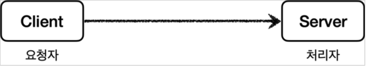<br>

클라이언트(`Client`)와 서버(`Server`)라고 하면 개발자들은 보통 서버 컴퓨터를 생각한다.

사실 클라이언트와 서버의 개녕은 상당히 넓게 사용된다. 클라이언트는 의뢰인이라는 뜻이고, 서버는 '서비스나 상품을 제공하는 사람이나 물건'을 뜻한다. 따라서 클라이언트와 서버의 기본 개념을 정의하면 **클라이언트는 서버에 필요한 것을 요청하고, 서버는 클라이언트의 요청을 처리**하는 것이다.

이 개념을 우리가 익숙한 컴퓨터 네트워크에 도입하면 클라이언트는 웹 브라우저가 되고, 요청을 처리하는 서버는 웹 서버가 된다.<br>이 개념은 객체에 도입하면, 요청하는 객체는 클라이언트가 되고, 요청을 처리하는 객체는 서버가 된다.

**직접 호출과 간접 호출**

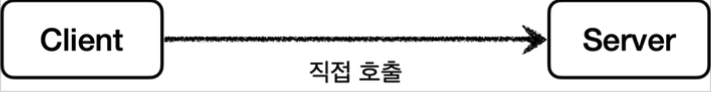<br>

클라이언트와 서버 개념에서 일반적으로 클라이언트가 서버를 직접 호출하고, 처리 결과를 직접 받는다.<br>이것을 직접 호출이라 한다.

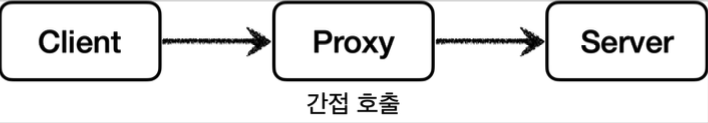<br>

그런데 클라이언트가 요청한 결과를 서버에 직접 요청하는 것이 아니라 어떤 대리자를 통해서 대신 간접적으로 서버에 요청할 수 있다. 예를 들어서 내가 직접 마트에서 장을 볼 수도 있지만, 누군가에게 대신 장을 봐달라고 부탁할 수도 있다.<br>여기서 대신 장을 보는 **대리자를 영어로 프록시(Proxy)** 라 한다.

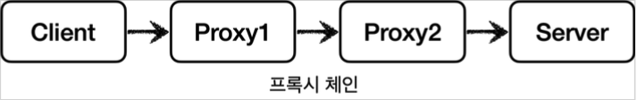<br>

객체에서 프록시의 역할을 알아보자.

**대체 가능**

그런데 여기까지 듣고 보면 아무 객체나 프록시가 될 수 있는 것 같다.<br>
객체에서 프록시가 되러면, 클라이언트는 서버에서 요청을 한 것인지, 프록시에게 요청을 한 것인지 조차 몰라야 한다.<br>
쉽게 이야기해서 서버와 프록시는 같은 인터페이스를 사용해야 한다. 그리고 클라이언트가 사용하는 서버 객체를 프록시 객체로 변경해도 클라이언트 코드를 변경하지 않고 동작할 수 있어야 한다.

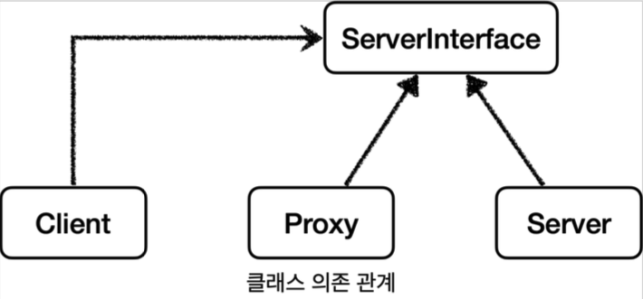<br>

**서버와 프록시가 같은 인터페이스 사용**

클래스 의존관계를 보면 클라이언트는 서버 인터페이스(`ServerInterface`)에만 의존한다. 그리고 서버와 프록시가 같은 인터페이스를 사용한다. 따라서 DI를 사용해서 대체 가능하다.

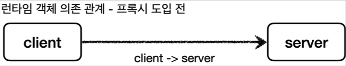<br>

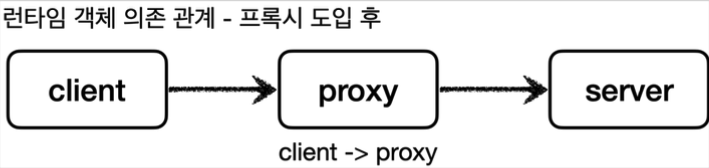<br>

이번에는 런타임 객체 의존 관계를 살펴보자. 런타임(애플리케이션 실행 시점)에 클라이언트 객체 DI를 사용해서 `Client -> Server`에서 `Client -> Proxy`로 객체 의존관계를 변경해도 클라이언트 코드를 전혀 변경하지 않아도 된다. 클라이언트 입장에서는 변경 사실 조차 모른다.<br>
DI를 사용하면 클라이언트 코드의 변경 없이 유연하게 프록시를 주입할 수 있다.

**프록시의 주요 기능**<br>
프록시를 통해서 할 수 있는 일은 크게 2가지로 구분할 수 있다.
- 접근 제어
  - 권한에 따른 접근 차단
  - 캐싱
  - 지연 로딩
- 부가 기능 추가
  - 원래 서버가 제공하는 기능에 더해서 부가 기능을 수행한다.
    - 예) 요청 값이나, 응답 값을 중간에 변형한다.
    - 예) 실행 시간을 측정해서 추가 로그를 남긴다.

프록시 객체가 중간에 있으면 크게 **접근 제어**와 **부가 기능 추가**를 수행할 수 있다.

**GOF 디자인 패턴**

둘다 프록시를 사용하는 방법이지만 GOF 디자인 패턴에서는 이 둘을 의도(intent)에 따라서 프록시 패턴과 데코레이터 패턴으로 구분한다.
- 프록시 패턴: 접근 제어가 목적
- 데코레이터 패턴: 새로운 기능 추가가 목적

둘다 프록시를 사용하지만, 의도가 다르다는 점이 핵심이다. 용어가 프록시 패턴이라고 해서 이 패턴만 프록시를 사용하는 것은 아니다. 데코레이터 패턴도 프록시를 사용한다.

이왕 프록시를 학습하기로 했으니 GOF 디자인 패턴에서 설명하는 프록시 패턴과 데코레이터 패턴을 나누어 학습해보자.

> [!NOTE]
> 프록시라는 개념은 클라이언트 서버라는 큰 개념안에 자연스럽게 발생할 수 있다. 프록시는 객체안에서의 개념도 있고, 웹 서버에서의 프록시도 있다.객체안에서 객체로 구현되어있는가, 웹 서버로 구현되어 있는가 처럼 규모의 차이가 있을 뿐 근본적인 역할은 같다.

## 프록시 패턴 - 예제 코드1

**테스트 코드에 Lombok 적용하기**<br>
테스트 코드에 Lombok을 사용하려면 `build.gradle`에 테스트에서 lombok을 사용할 수 있도록 의존관계를 추가해야 한다.

**build.gradle**에 추가

```gradle

dependencies {
    //...
	//테스트에서 lombok 사용
	testCompileOnly 'org.projectlombok:lombok'
	testAnnotationProcessor 'org.projectlombok:lombok'
}
```

이렇게 해야 테스트 코드에서 `@Slf4j`같은 애노테이션이 작동한다.

**프록시 패턴 - 예제 코드 작성**<br>
프록시 패턴을 이해하기 위한 예제 코드를 작성해보자. 먼저 프록시 패턴을 도입하기 전 코드를 아주 단순하게 만들어보자.

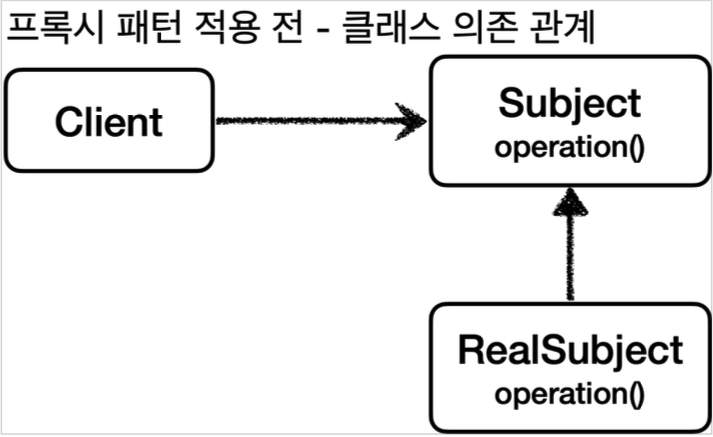<br>

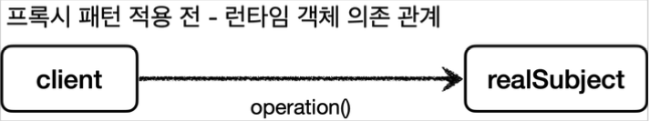<br>

**subject 인터페이스**

> [!CAUTION]
> 테스트코드 (src/test)에 위치한다.

```java
package hello.proxy.code;

public interface Subject {
    String operation();
}
```

예제에서 `Subject`인터페이스는 단순히 `operation()`메서드 하나만 가지고 있다.

**RealSubject**

> [!CAUTION]
> 테스트코드 (src/test)에 위치한다.

```java
package hello.proxy.code;

import lombok.extern.slf4j.Slf4j;

@Slf4j
public class RealSubject implements Subject{
    @Override
    public String operation() {
        log.info("실제 객체 호출");
        sleep(1000);
        return "data";
    }

    private void sleep(int millis) {
        try {
            Thread.sleep(millis);
        } catch (InterruptedException e) {
            e.printStackTrace();
        }
    }
}
```

`RealSubject`는 `Subject`인터페이스를 구현했다. `operation()`은 데이터 조회를 시뮬레이션 하기 위해 1초 쉬도록 했다. 예를 들어서 데이터를 DB나 외부에서 조회하는데 1초가 걸린다고 생각하면 된다. 호출할 때 마다 시스템에 큰 부하를 주는 데이터 조회라고 가정하자.

**ProxyPatternClient**

> [!CAUTION]
> 테스트코드 (src/test)에 위치한다.

```java
package hello.proxy.code;

public class ProxyPatternClient {

    private Subject subject;

    public ProxyPatternClient(Subject subject) {
        this.subject = subject;
    }

    public void execute() {
        subject.operation();
    }
}
```

`Subject`인터페이스에 의존하고, `Subject`를 호출하는 클라이언트 코드이다.<br>`execute()`를 실행하면 `subject.operation()`를 호출한다.

**ProxyPatternTest**

```java
package hello.proxy.pureproxy.proxy;

import hello.proxy.code.ProxyPatternClient;
import hello.proxy.code.RealSubject;
import org.junit.jupiter.api.Test;

public class ProxyPatternTest {

    @Test
    void noProxyTest() {
        RealSubject realSubject = new RealSubject();
        ProxyPatternClient client = new ProxyPatternClient(realSubject);
        client.execute();
        client.execute();
        client.execute();
    }
}
```

테스트 코드에서는 `client.execute()`를 3번 호출한다. 데이터를 조회하는데 1초가 소모되므로 총 3초의 시간이 걸린다.

**실행 결과**

```
RealSubject - 실제 객체 호출
RealSubject - 실제 객체 호출
RealSubject - 실제 객체 호출
```

**client.execute()을 3번 호출하면 다음과 같이 처리된다.**<br>
1. `client -> resultSubject`를 호출해서 값을 조회한다. (1초)
2. `client -> resultSubject`를 호출해서 값을 조회한다. (1초)
3. `client -> resultSubject`를 호출해서 값을 조회한다. (1초)

그런데 이 데이터가 한번 조회하면 변하지 않는 데이터라면 어딘가에 보관해두고 이미 조회한 데이터를 사용하는 것이 성능상 좋다. 이런 것을 캐시라고 한다.<br>프록시 패턴의 주요 기능은 접근 제어이다. 캐시도 접근 자체를 제어하는 기능 중 하나이다.

이미 개발된 로직을 전혀 수정하지 않고, 프록시 객체를 통해서 캐시를 적용해보자.

## 프록시 패턴 - 예제 코드2

프록시 패턴을 적용하자

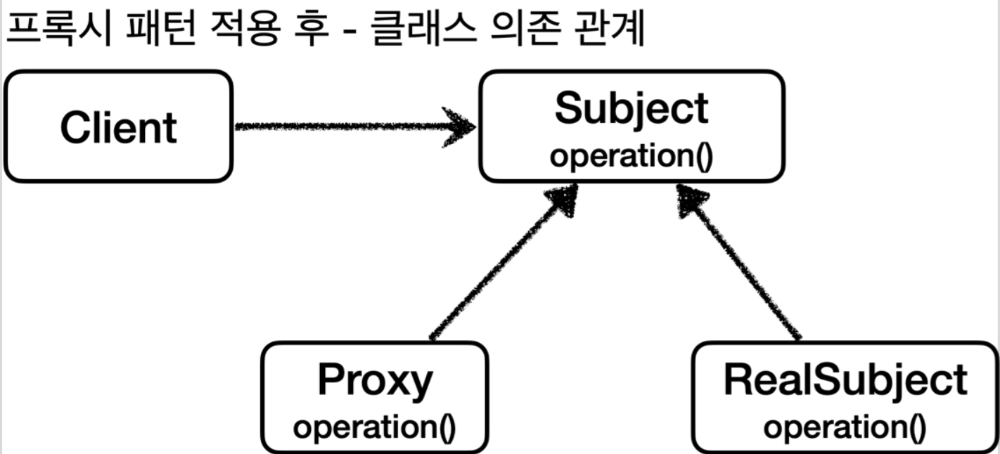<br>

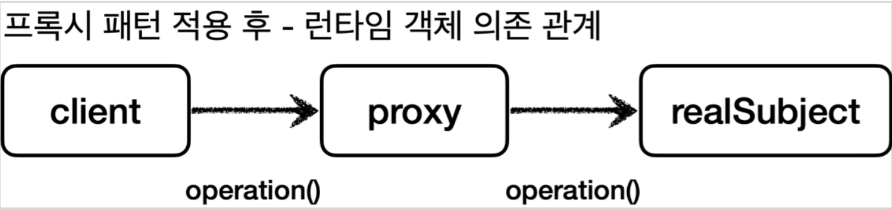<br>

**CacheProxy**

> [!CAUTION]
> 테스트코드 (src/test)에 위치한다.

```java
package hello.proxy.code;

import lombok.extern.slf4j.Slf4j;

@Slf4j
public class CacheProxy implements Subject {

    private Subject target;
    private String cacheValue;

    public CacheProxy(Subject target) {
        this.target = target;
    }

    @Override
    public String operation() {
        log.info("프록시 호출");
        if (cacheValue == null) {
            cacheValue = target.operation();
        }
        return cacheValue;
    }
}
```

앞서 설명한 것 처럼 프록시도 실제 객체와 그 모양이 같아야 하기 때문에 `Subject`인터페이스를 구현해야 한다.

- `private Subject target`: 클라이언트가 프록시를 호출하면 프록시가 최종적으로 실제 객체를 호출해야 한다. 따라서 내부에 실제 객체의 참조를 가지고 있어야 한다. 이렇게 프록시가 호출하는 대상을 `target`이라 한다.
- `operation()`: 구현한 코드를 보면 `cacheValue`에 값이 없으면 실제 객체(`target`)를 호출해서 값을 구한다. 그리고 구한 값을 `cacheValue`에 저장하고 반환한다. 만약 `cacheValue`에 값이 있으면 실제 객체를 전혀 호출하지 않고, 캐시 값을 그대로 반환한다. 따라서 처음 조회 이후에 캐시(`cacheValue`)에서 매우 빠르게 데이터를 조회할 수 있다.

**ProxyPatternTest - cacheProxyTest() 추가**

```java
package hello.proxy.pureproxy.proxy;

import hello.proxy.code.CacheProxy;
import hello.proxy.code.ProxyPatternClient;
import hello.proxy.code.RealSubject;
import hello.proxy.code.Subject;
import org.junit.jupiter.api.Test;

public class ProxyPatternTest {

    @Test
    void noProxyTest() {
        RealSubject realSubject = new RealSubject();
        ProxyPatternClient client = new ProxyPatternClient(realSubject);
        client.execute();
        client.execute();
        client.execute();
    }

    @Test
    void cacheProxyTest() {
        Subject realSubject = new RealSubject();
        Subject cacheProxy = new CacheProxy(realSubject);
        ProxyPatternClient client = new ProxyPatternClient(cacheProxy);
        client.execute();
        client.execute();
        client.execute();
    }
}
```

**cacheProxyTest()**<br>
`realSubject`와 `cacheProxy`를 생성하고 둘을 연결한다. 결과적으로 `cacheProxy`가 `realSubject`를 참조하는 런타임 객체 의존관계가 완성된다. 그리고 마지막으로 `client`에 `realSubject`가 아닌 `cacheProxy`를 주입한다. 이 과정을 통해서 `client -> cacheProxy -> realSubject`런타임 객체 `cacheProxyTest()`는 `client.execute()`을 총 2번 호출한다. 이번에는 클라이언트가 실제 `realSubject`를 호출하는 것이 아니라 `cacheProxy`를 호출하게 된다.

**실행 결과**

```
CacheProxy - 프록시 호출
RealSubject - 실제 객체 호출
CacheProxy - 프록시 호출
CacheProxy - 프록시 호출
```

**client.execute()을 3번 호출하면 다음과 같이 처리된다.**<br>
1. client의 cacheProxy호출 -> cacheProxy에 캐시 값이 없다. -> realSubject를 호출, 결과를 캐시에 저장(1초)
2. client의 cacheProxy호출 -> cacheProxy에 값이 있다. -> cacheProxy에서 즉시 반환(0초)
3. client의 cacheProxy호출 -> cacheProxy에 값이 있다. -> cacheProxy에서 즉시 반환(0초)

결과적으로 캐시 프록시를 도입하기 전에는 3초가 걸렸지만, 캐시 프록시 도입 이후에는 최초에 한번만 1초가 걸기고, 이후에는 거의 즉시 반환한다.

> [!NOTE]
> 프록시 패턴의 핵심은 `RealSubject`코드와 클라이언트 코드를 전혀 변경하지 않고, 프록시를 도입해서 접근 제어를 했다는 점이다.<br>그리고 클라이언트 코드의 변경 없이 자유롭게 프록시를 넣고 뺄 수 있다. 실제 클라이언트 입장에서는 프록시 객체가 주입되었는지, 실제 객체가 주입되었는지 알지 못한다.

## 데코레이터 패턴 - 예제 코드 1

데코레이터 패턴을 이해하기 위한 예제 코드를 작성해보자. 먼저 데코레이터 패턴을 도입하기 전 코드를 아주 단순하게 만들어보자.

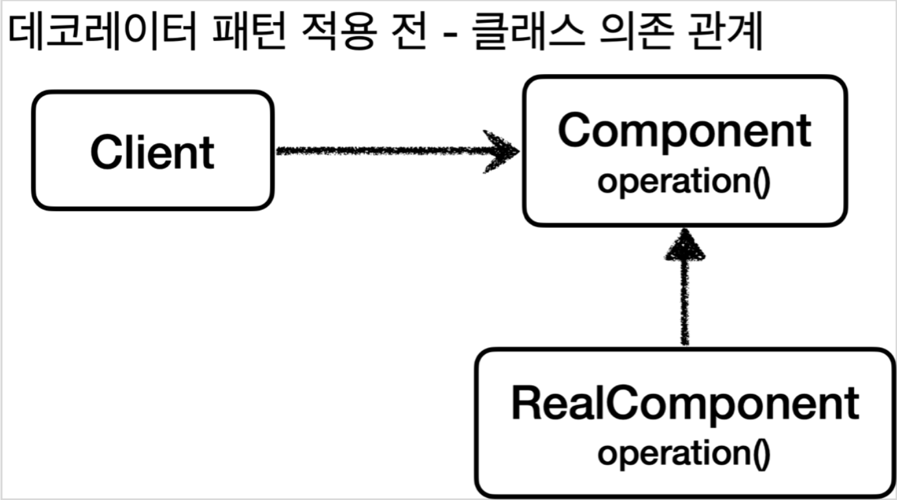<br>

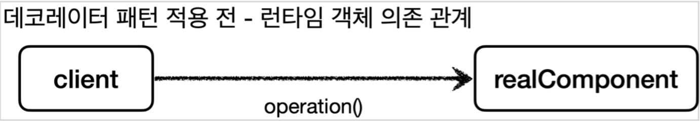<br>

**Component 인터페이스**<br>
> [!CAUTION]
> 테스트코드 (src/test)에 위치한다.

```java
package hello.proxy.pureproxy.decorator.code;

public interface Component {
    String operation();
}
```

`Component`인터페이스는 단순히 `String operation()`메서드를 가진다.

**RealComponent**

> [!CAUTION]
> 테스트코드 (src/test)에 위치한다.

```java
package hello.proxy.pureproxy.decorator.code;

import lombok.extern.slf4j.Slf4j;

@Slf4j
public class RealComponent implements Component{

    @Override
    public String operation() {
        log.info("RealComponent 실행");
        return "data";
    }
}
```

- `RealComponent`는 `Component`인터페이스를 구현한다.
- `operation()`: 단순히 로그를 남기고 `"data"`문자를 반환한다.

**DecoratorPatternClient**

> [!CAUTION]
> 테스트코드 (src/test)에 위치한다.

```java
package hello.proxy.pureproxy.decorator.code;

import lombok.extern.slf4j.Slf4j;

@Slf4j
public class DecoratorPatternClient {

    private Component component;

    public DecoratorPatternClient(Component component) {
        this.component = component;
    }

    public void execute() {
        String result = component.operation();
        log.info("result={}", result);
    }
}
```

- 클라이언트 코드는 단순히 `Component`인터페이스를 의존한다.
- `execute()`를 실행하면 `component.operation()`를 호출하고, 그 결과를 출력한다.

**DecoratorPatternTest**

```java
package hello.proxy.pureproxy.decorator;

import hello.proxy.pureproxy.decorator.code.Component;
import hello.proxy.pureproxy.decorator.code.DecoratorPatternClient;
import hello.proxy.pureproxy.decorator.code.RealComponent;
import lombok.extern.slf4j.Slf4j;
import org.junit.jupiter.api.Test;

@Slf4j
public class DecoratorPatternTest {

    @Test
    void noDecorator() {
        Component realComponent = new RealComponent();
        DecoratorPatternClient client = new DecoratorPatternClient(realComponent);
        client.execute();
    }
}
```

테스트 코드는 `client -> realComponent`의 의존관계를 설정하고, `client.execute()`를 호출한다.

**실행 결과**

```
RealComponent - RealComponent 실행
DecoratorPatternClient - result=data
```

여기까지는 앞서 프록시 패턴에서 설명한 내용과 유사하고 단순해서 이해하는데 어려움은 없을 것이다.

## 데코레이터 패턴 - 예제 코드 2

**부가 기능 추가**<br>
앞서 설명한 것 처럼 프록시를 통해 할 수 있는 기능은 크게 접근 제어와 부가 기능 추가라는 2가지로 구분한다.
앞서 프록시 패턴에서 캐시를 통한 접근 제어를 알아보았다. 이번에는 프록시를 활용해서 부가 기능을 추가해보자. 이렇게 프록시로 부가 기능을 추가하는 것을 데코레이터 패턴이라 한다.


데코레이터 패턴: 원래 서버가 제공하는 기능에 더해서 부가 기능을 수행한다.
- 예) 요청 값이나, 응답 값을 중간에 변형한다.
- 예) 실행 시간을 측정해서 추가 로그를 남긴다.

**응답 값을 꾸며 주는 데코레이터**<br>
응답 값을 꾸며주는 데코레이터 프록시를 만들어보자.

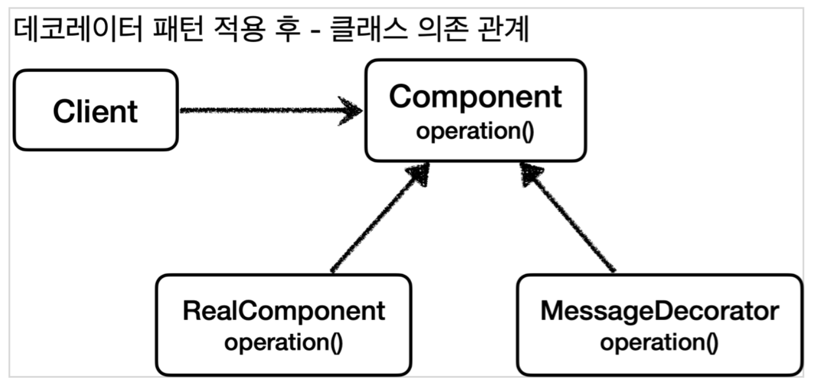<br>

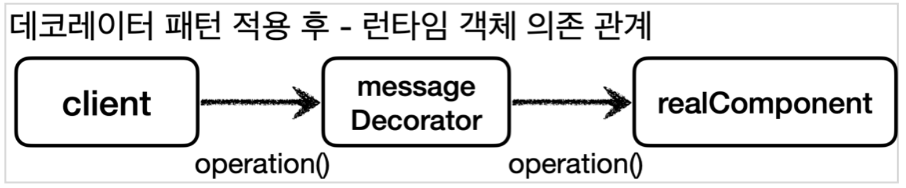<br>

**MessageDecorator**

> [!CAUTION]
> 테스트코드 (src/test)에 위치한다.

```java
package hello.proxy.pureproxy.decorator.code;

import lombok.extern.slf4j.Slf4j;

@Slf4j
public class MessageDecorator implements Component {

    private Component component;

    public MessageDecorator(Component component) {
        this.component = component;
    }

    @Override
    public String operation() {
        log.info("MessageDecorator 실행");

        String result = component.operation();
        String decoResult = "*****" + result + "*****";
        log.info("MessageDecorator 꾸미기 적용 전={}, 적용 후={}", result, decoResult);

        return decoResult;
    }
}
```

`MessageDecorator`는 `Component`인터페이스를 구현한다.<br>
프록시가 호출해야 하는 대상을 `component`에 저장한다.<br>
`operation()`을 호출하면 프록시와 연결된 대상을 호출(`component.operation()`)하고, 그 응답 값에 `*****`을 더해서 꾸며준 다음 반환한다.<br>
예를 들어서 응답 값이 `data`라면 다음과 같다.

- 꾸미기 전: `data`
- 꾸민 후: `*****data*****`

**DecoratorPatternTest - 추가**

```java
@Test
void decorator1() {
    Component realComponent = new RealComponent();
    Component messageDecorator = new MessageDecorator(realComponent);
    DecoratorPatternClient client = new DecoratorPatternClient(messageDecorator);
    client.execute();
}
```

`client -> messageDecorator -> realComponent`의 객체 의존 관계를 만들고 `client.execute()`를 호출한다.

**실행 결과**

```
MessageDecorator - MessageDecorator 실행
RealComponent - RealComponent 실행
MessageDecorator - MessageDecorator 꾸미기 적용 전=data, 적용 후=*****data*****
DecoratorPatternClient - result=*****data*****
```

실행 결과를 보면 `MessageDecorator`가 `RealComponent`를 호출하고 반환한 응답 메시지를 꾸며서 반환한 것을 확인할 수 있다.

## 데코레이터 패턴 - 예제 코드 3

실행 시간을 측정하는 데코레이터<br>
이번에는 기존 데코레이터에 대해서 실행 시간을 측정하는 기능까지 추가해보자

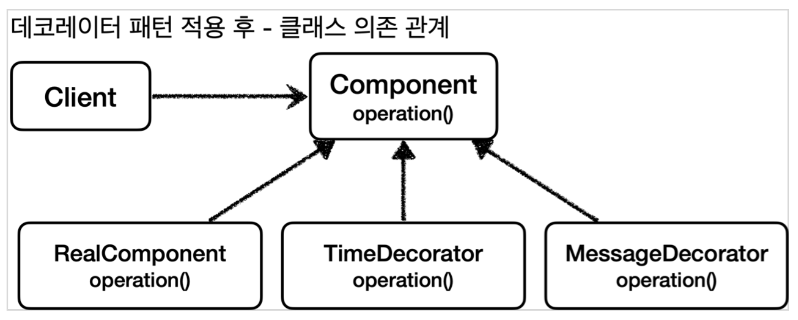<br>

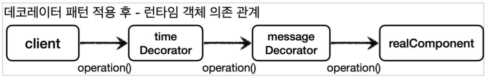<br>

**TimeDecorator**

> [!CAUTION]
> 테스트코드 (src/test)에 위치한다.

```java
package hello.proxy.pureproxy.decorator.code;

import lombok.extern.slf4j.Slf4j;

@Slf4j
public class TimeDecorator implements Component {

    private Component component;

    public TimeDecorator(Component component) {
        this.component = component;
    }

    @Override
    public String operation() {
        log.info("TimeDecorator 실행");
        long startTime = System.currentTimeMillis();

        String result = component.operation();

        long endTime = System.currentTimeMillis();
        long resultTime = endTime - startTime;
        log.info("TimeDecorator 종료 resultTime={}ms", resultTime);
        return result;
    }
}
```

`TimeDecorator`는 실행 시간을 측정하는 부가 기능을 제공한다. 대상을 호출하기 전에 시간을 가지고 있다가, 대상의 호출이 끝나면 호출 시간을 로그로 남겨준다.

**DecoratorPatternTest - 추가**

```java
@Test
void decorator2() {
    Component realComponent = new RealComponent();
    Component messageDecorator = new MessageDecorator(realComponent);
    Component timeDecorator = new TimeDecorator(messageDecorator);
    DecoratorPatternClient client = new DecoratorPatternClient(timeDecorator);
    client.execute();
}
```

`client -> timeDecorator -> messageDecorator -> realComponent`의 객체 의존관계를 설정하고, 실행한다.

**실행 결과**

```
TimeDecorator 실행
MessageDecorator 실행
RealComponent 실행
MessageDecorator 꾸미기 적용 전=data, 적용 후=*****data*****
TimeDecorator 종료 resultTime=15ms
result=*****data*****
```

실행 결과를 보면 `TimeDecorator`가 `MessageDecorator`를 실행하고 실행 시간을 측정해서 출력한 것을 확인할 수 있다.

## 프록시 패턴과 데코레이터 패턴 정리

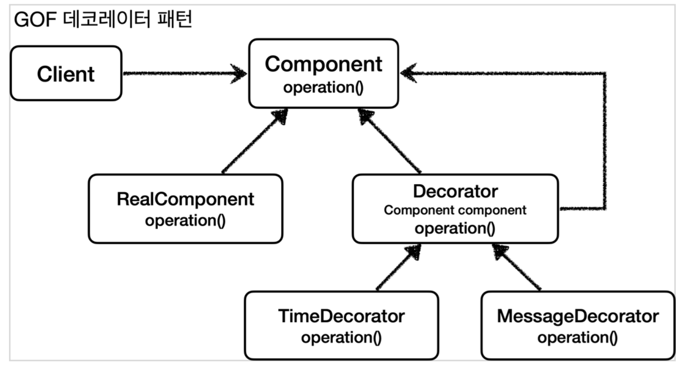<br>

여기서 생각해보면 `Decorator`기능에 일부 중복이 있다. 꾸며주는 역할을 하는 `Decorator`들은 스스로 존재할 수 없다. 항상 꾸며줄 대상이 있어야 한다. 따라서 내부에 호출 대상인 `component`를 가지고 있어야 한다. 그리고 `component`를 항상 호출해야 한다. 이 부분이 중복이다. 이런 중복을 제거하기 위해 `component`를 속성으로 가지고 있는 `Decorator`라는 추상 클래스를 만드는 방법도 고민할 수 있다. 이렇게 하면 추가로 클래스 다이어그램에서 어떤 것이 실제 컴포넌트인지, 데코레이터인지 명확하게 구분할 수 있다. 여기까지 고민한 것이 바로 GOF에서 설명하는 데코레이터 패턴의 기본 예제이다.

**프록시 패턴 vs 데코레이터 패턴**<br>
여기까지 진행하면 몇가지 의문이 들 것이다.
- `Decorator`라는 추상 클래스를 만들어야 데코레이터 패턴일까?
- 프록시 패턴과 데코레이터 패턴은 그 모양이 거의 비슷한 것 같은데?

**의도(intent)**<br>
사실 프록시 패턴과 데코레이터 패턴은 그 모양이 거의 같고, 상황에 따라 정말 똑같을 때도 있다. 그러면 둘을 어떻게 구분하는 것일까?<br>
디자인 패턴에서 중요한 것은 해당 패턴의 겉모양이 아니라 그 패턴을 만든 의도가 더 중요하다. 따라서 의도에 따라 패턴을 구분한다.

- 프록시 패턴의 의도: 다른 개체에 대한 **접근을 제어**하기 위해 대리자를 제공
- 데코레이터 패터의 의도: **객체에 추가 책임(기능)을 동적으로 추가**하고, 기능 확장을 위한 유연한 대안 제공

**정리**<br>
프록시를 사용하고 해당 프록시가 접근 제어가 목적이라면 프록시 패턴이고, 새로운 기능을 추가하는 것이 목적이라면 데코레이터 패턴이 된다.

## 인터페이스 기반 프록시 - 적용

인터페이스와 구현체가 있는 V1 App에 지금까지 학습한 프록시를 도입해서 `LogTrace`를 사용해보자.<br>
**프록시를 사용하면 기존 코드를 전혀 수정하지 않고 로그 추적 기능을 도입할 수 있다.**

V1 App의 기본 클래스 의존 관계와 런타임시 객체 인스턴스의 의존관계는 다음과 같다

**V1 기본 클래스 의존 관계**

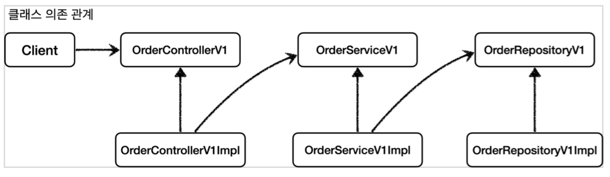<br>

**V1 런타임 객체 의존 관계**

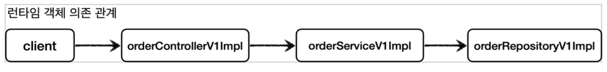<br>

**여기에 로그 추적용 프록시를 추가하면 다음과 같다.**

**V1 프록시 의존 관계 추가**

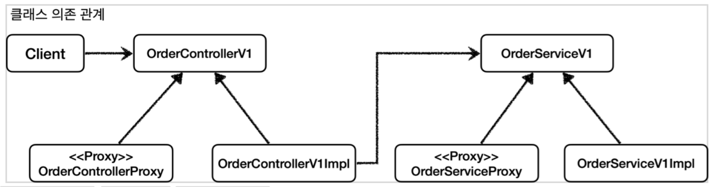<br>

`Controller`, `Service`, `Repository` 각각 인터페이스에 맞는 프록시 구현체를 추가한다. (그림에서 리포지토리는 생략했다.)

**V1 프록시 런타임 객체 의존 관계**

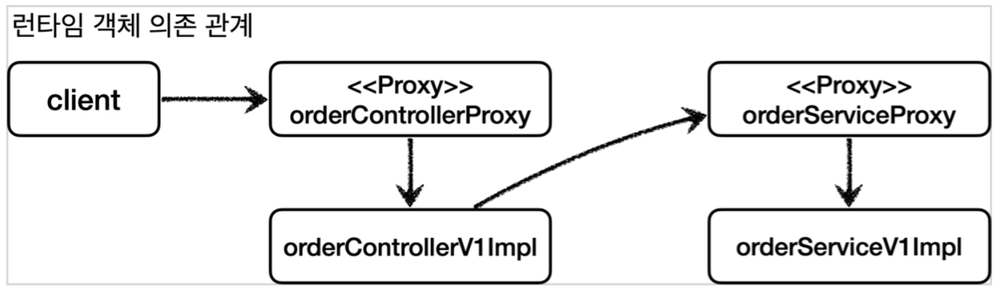<br>

그리고 애플리케이션 실행 시점에 프록시를 사용하도록 의존관계를 설정해주어야 한다. 이 부분은 빈을 등록하는 설정 파일을 활용하면 된다.(그림에서 리포지토리는 생략했다.)

그럼 실제 프록시를 코드에 적용해보자.

**OrderRepositoryInterfaceProxy**

```java
package hello.proxy.config.v1_proxy.interface_proxy;

import hello.proxy.app.v1.OrderRepositoryV1;
import hello.proxy.trace.TraceStatus;
import hello.proxy.trace.logtrace.LogTrace;
import lombok.RequiredArgsConstructor;

@RequiredArgsConstructor
public class OrderRepositoryInterfaceProxy implements OrderRepositoryV1 {

    private final OrderRepositoryV1 target;
    private final LogTrace logTrace;

    @Override
    public void save(String itemId) {

        TraceStatus status = null;
        try {
            status = logTrace.begin("OrderRepository.save()");
            //target 호출
            target.save(itemId);
            logTrace.end(status);
        } catch (Exception e) {
            logTrace.exception(status, e);
            throw e;
        }

    }
}
```

- 프록시를 만들기 위해 인터페이스를 구현하고 구현한 메서드에 `LogTrace`를 사용하는 로직을 추가한다.<br>지금까지는 `OrderReposirotyImpl`에 이런 로직을 추가해야 했다. 프록시를 사용한 덕분에 이 부분을 프록시가 대신 처리해준다. 따라서 `OrderRepositoryImpl`코드를 변경하지 않아도 된다.
- `OrderRepositoryV1 target`: 프록시가 실제 호출할 원본 리포지토리의 참조를 가지고 있어야 한다.

**OrderServiceInterfaceProxy**

```java
package hello.proxy.config.v1_proxy.interface_proxy;

import hello.proxy.app.v1.OrderServiceV1;
import hello.proxy.trace.TraceStatus;
import hello.proxy.trace.logtrace.LogTrace;
import lombok.RequiredArgsConstructor;

@RequiredArgsConstructor
public class OrderServiceInterfaceProxy implements OrderServiceV1 {

    private final OrderServiceV1 target;
    private final LogTrace logTrace;

    @Override
    public void orderItem(String itemId) {
        TraceStatus status = null;
        try {
            status = logTrace.begin("OrderService.orderItem()");
            //target 호출
            target.orderItem(itemId);
            logTrace.end(status);
        } catch (Exception e) {
            logTrace.exception(status, e);
            throw e;
        }
    }
}
```

앞과 같다.

**OrderControllerInterfaceProxy**

```java
package hello.proxy.config.v1_proxy.interface_proxy;

import hello.proxy.app.v1.OrderControllerV1;
import hello.proxy.trace.TraceStatus;
import hello.proxy.trace.logtrace.LogTrace;
import lombok.RequiredArgsConstructor;

@RequiredArgsConstructor
public class OrderControllerInterfaceProxy implements OrderControllerV1 {

    private final OrderControllerV1 target;
    private final LogTrace logTrace;

    @Override
    public String request(String itemId) {

        TraceStatus status = null;
        try {
            status = logTrace.begin("OrderController.request()");
            //target 호출
            String result = target.request(itemId);
            logTrace.end(status);
            return result;
        } catch (Exception e) {
            logTrace.exception(status, e);
            throw e;
        }
    }

    @Override
    public String noLog() {
        return target.noLog();
    }
}
```

`noLog()`메서드는 로그를 남가지 않아야 한다. 따라서 별도의 로직 없이 단순히 `target`을 호출하면 된다.

**InterfaceProxyConfig**

```java
package hello.proxy.config.v1_proxy;

import hello.proxy.app.v1.*;
import hello.proxy.config.v1_proxy.interface_proxy.OrderControllerInterfaceProxy;
import hello.proxy.config.v1_proxy.interface_proxy.OrderRepositoryInterfaceProxy;
import hello.proxy.config.v1_proxy.interface_proxy.OrderServiceInterfaceProxy;
import hello.proxy.trace.logtrace.LogTrace;
import org.springframework.context.annotation.Bean;
import org.springframework.context.annotation.Configuration;

@Configuration
public class InterfaceProxyConfig {

    @Bean
    public OrderControllerV1 orderController(LogTrace logTrace) {
        OrderControllerV1Impl controllerImpl = new OrderControllerV1Impl(orderService(logTrace));
        return new OrderControllerInterfaceProxy(controllerImpl, logTrace);
    }

    @Bean
    public OrderServiceV1 orderService(LogTrace logTrace) {
        OrderServiceV1Impl serviceImpl = new OrderServiceV1Impl(orderRepository(logTrace));
        return new OrderServiceInterfaceProxy(serviceImpl, logTrace);
    }

    @Bean
    public OrderRepositoryV1 orderRepository(LogTrace logTrace) {
        OrderRepositoryV1Impl repositoryImpl = new OrderRepositoryV1Impl();
        return new OrderRepositoryInterfaceProxy(repositoryImpl, logTrace);
    }
}
```

`LogTrace`가 아직 스프링 빈으로 등록되어 있지 않은데, 이 부분은 바로 다음에 등록할 것이다.

**V1 프록시 런타임 객체 의존 관계 설정**<br>
- 이제 프록시의 런타임 객체 의존 관계를 설정하면 된다. 기존에는 스프링 빈이 `orderControllerV1Impl`, `orderServiceV1Impl`같은 실제 객체를 반환했다. 하지만 이제는 프록시를 사용해야한다. 따라서 프록시를 생성하고 **프록시를 실제 스필이 빈 대신 등록한다. 실제 객체는 스프링 빈으로 등록하지 않는다.**
- 프록시는 내부에 실제 객체를 참조하고 있다. 예를 들어서 `OrderServiceInterfaceProxy`는 내부에 실제 대상 객체인 `OrderServiceV1Impl`을 가지고 있다.
- 정리하면 다음과 같은 의존 관계를 가지고 있다.
  - `proxy -> target`
  - `orderServiceInterfaceProxy -> orderServiceV1Impl`
- 스프링 빈으로 실제 객체 대신에 프록시 객체를 등록했기 때문에 앞으로 스프링 빈을 주입 받으면 **실제 객체 대신에 프록시 객체가 주입된다.**
- 실제 객체가 스프링 빈으로 등록되지 않는다고 해서 사라지는 것은 아니다. 프록시 객체가 실제 객체를 참조하기 때문에 프록시를 통해서 실제 객체를 호출할 수 있다. 쉽게 이야기해서 프록시 객체 안에 실제 객체가 있는 것이다.

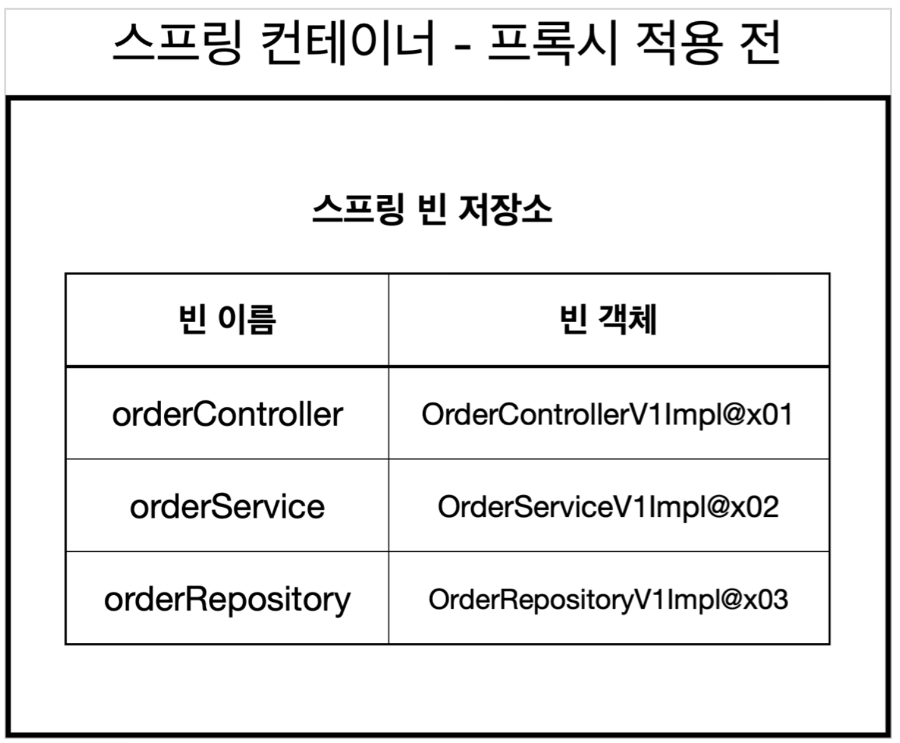<br>

`AppV1Config`를 통해 프록시를 적용하기 전<br>
- 실제 객체가 스프링 빈으로 등록된다. 빈 객체의 마지막에 `@x0..`라고 해둔 것은 인스턴스라는 뜻이다.

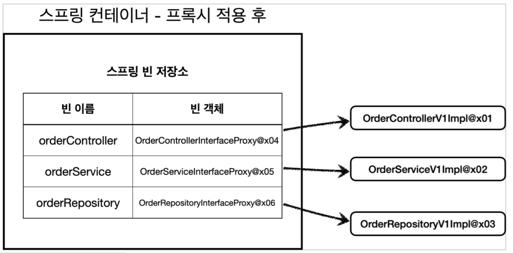<br>

`interfaceProxyConfig`를 통해 프록시를 적용한 후<br>
- 스프링 컨테이너에 프로깃 객체가 등록된다. 스프링 컨테이너는 이제 실제 객체가 아니라 프록시 객체를 스프링 빈으로 관리한다.
- 이제 실제 객체는 스프링 컨테이너와는 상관이 없다. 실제 객체는 프록시 객체를 통해서 참조될 뿐이다.
- 프록시 객체는 스프링 컨테이너가 관리하고 자바 힙 메모리에도 올라간다. 반면에 실제 객체는 자바 힙 메모리에는 올라가지만 스프링 컨테이너가 관리하지는 않는다.

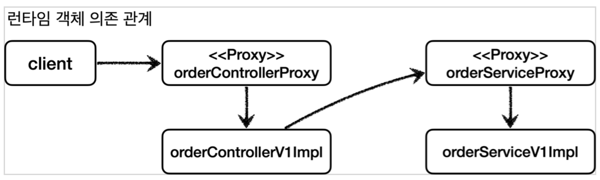<br>

최종적으로 이런 런타임 객체 의존관계가 발생하나. (리포지토리는 생략했다.)

**ProxyApplication**

```java
package hello.proxy;

//@Import({AppV1Config.class, AppV2Config.class})
@Import(InterfaceProxyConfig.class)
@SpringBootApplication(scanBasePackages = "hello.proxy.app") //주의
public class ProxyApplication {

	public static void main(String[] args) {
		SpringApplication.run(ProxyApplication.class, args);
	}

	@Bean
	public LogTrace logTrace() {
		return new ThreadLocalLogTrace();
	}

}
```

- `@Bean`: 먼저 `LogTrace`스프링 빈 추가를 먼저 해주어야 한다. 이것을 여기에 등록한 이유는 앞으로 사용할 모든 예제에서 함께 사용하기 위해서다.
- `@Import(InterfaceProxyConfig.class)`: 프록시를 적용한 설정 파일을 사용하자.

**실행**

http://localhost:8080/v1/request?itemId=hello

**실행결과 - 로그**

```
[a080aab0] OrderController.request()
[a080aab0] |-->OrderService.orderItem()
[a080aab0] |   |-->OrderRepository.save()
[a080aab0] |   |<--OrderRepository.save() time=1001ms
[a080aab0] |<--OrderService.orderItem() time=1006ms
[a080aab0] OrderController.request() time=1010ms
```

실행 결과를 확인해보면 로그 추적 기능이 프록시를 통해 잘 동작하는 것을 확인할 수 있다.

**정리**<br>
추가된 요구사항을 다시 확인해보자.

**추가된 요구사항**<br>
- ~~원본 코드를 전혀 수정하지 않고, 로그 추적기를 적용해라.~~
- ~~특정 메서드는 로그를 출력하지 않는 기능~~
  - ~~보안상 일부는 로그를 출력하면 안된다.~~
- 다음과 같은 다양한 케이스에 적용할 수 있어야 한다.
  - ~~v1 - 인터페이스가 있는 구현 클래스에 적용~~
  - v2 - 인터페이스가 없는 구체 클래스에 적용
  - v3 - 컴포넌트 스캔 대상에 기능 적용

프록시와 DI덕분에 원본 코드를 전혀 수장하지 않고, 로그 추적기를 도입할 수 있었다. 물론 너무 많은 프록시 클래스를 만들어야 하는 단점이 있기는 하다. 이 부분은 나중에 해결하기로 하고, 우선은 v2 - 인터페이스가 없는 구체 클래스에 프록시를 어떻게 적용할 수 있는지 알아보자.

## 구체 클래스 기반 프록시 - 예제1

이번에는 구체 클래스에 프록시를 적용하는 방법을 학습해보자.

다음에 보이는 `ConcreateLogic`은 인터페이스가 없고 구체 클래스만 있다. 이렇게 인터페이스가 없어도 프록시를 적용할 수 있을까?<br>먼저 프록시를 도입하기 전에 기본 코드를 작성해보자.

**ConcreateLogic**

> [!CAUTION]
> 테스트코드 (src/test)에 위치한다.

```java
package hello.proxy.pureproxy.concreteproxy.code;

import lombok.extern.slf4j.Slf4j;

@Slf4j
public class ConcreteLogic {

    public String operation() {
        log.info("ConcreteLogic 실행");
        return "data";
    }
}
```

`ConcreteLogic`은 인터페이스가 없고, 구체 클래스만 있다. 여기에 프록시를 도입해야 한다.

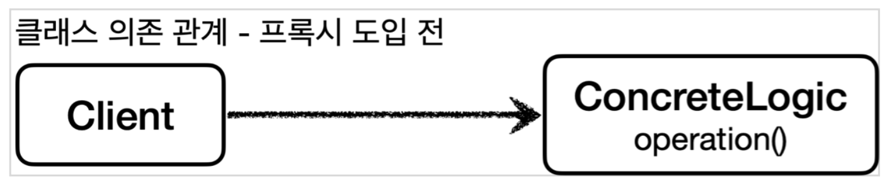<br>

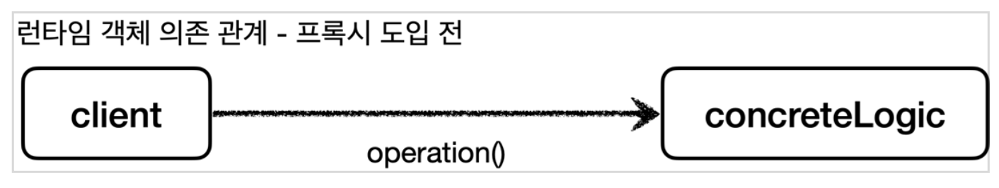<br>

**ConcreteClient**

> [!CAUTION]
> 테스트코드 (src/test)에 위치한다.

```java
package hello.proxy.pureproxy.concreteproxy.code;

public class ConcreteClient {

    private ConcreteLogic concreteLogic;

    public ConcreteClient(ConcreteLogic concreteLogic) {
        this.concreteLogic = concreteLogic;
    }

    public void execute() {
        concreteLogic.operation();
    }
}
```

**ConcreteProxyTest**

```java
package hello.proxy.pureproxy.concreteproxy;

import hello.proxy.pureproxy.concreteproxy.code.ConcreteClient;
import hello.proxy.pureproxy.concreteproxy.code.ConcreteLogic;
import org.junit.jupiter.api.Test;

public class ConcreteProxyTest {

    @Test
    void noProxy() {
        ConcreteLogic concreteLogic = new ConcreteLogic();
        ConcreteClient client = new ConcreteClient(concreteLogic);
        client.execute();
    }
}
```

## 구체 클래스 기반 프록시 - 예제2

**클래스 기반 프록시 도입**<br>
지금까지 인터페이스를 기반으로 프록시를 도입했다. 그런데 자바의 다형성은 인터페이스를 구현하든, 아니면 클래스를 상속하든 상위 타입만 맞으면 다형성이 적용된다. 쉽게 이야기해서 인터페이스가 없어도 프록시를 만들 수 있다는 뜻이다. 그래서 이번에는 인터페이스가 아니라 클래스를 기반으로 상속을 받아서 프록시를 만들어보겠다.

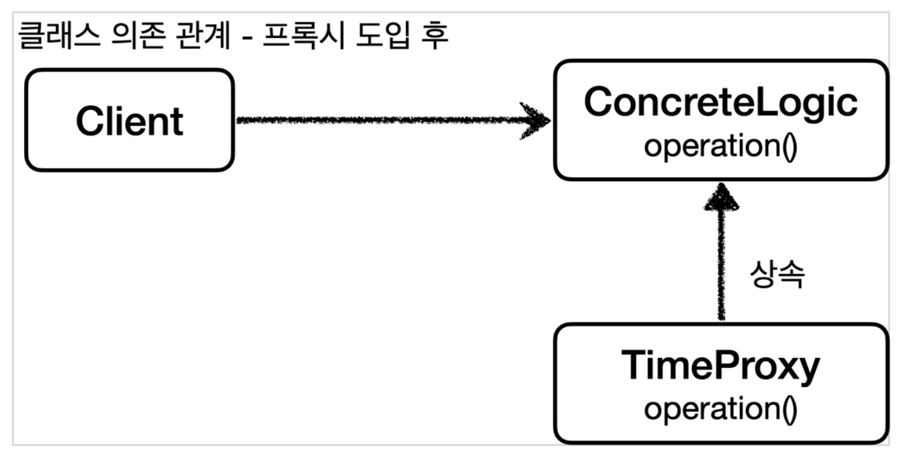<br>

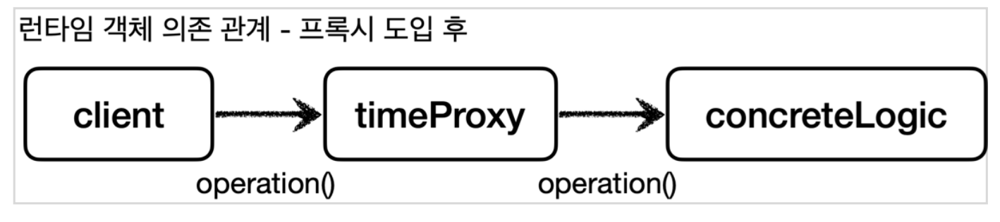<br>

**TimeProxy**

> [!CAUTION]
> 테스트코드 (src/test)에 위치한다.

```java
package hello.proxy.pureproxy.concreteproxy.code;

import lombok.extern.slf4j.Slf4j;

@Slf4j
public class TimeProxy extends ConcreteLogic {

    private ConcreteLogic realLogic;

    public TimeProxy(ConcreteLogic realLogic) {
        this.realLogic = realLogic;
    }

    @Override
    public String operation() {
        log.info("TimeDecorator 실행");

        long startTime = System.currentTimeMillis();

        String result = realLogic.operation();

        long endTime = System.currentTimeMillis();
        long resultTime = endTime - startTime;
        log.info("TimeDecorator 종료 resultTime={}", resultTime);
        return result;
    }
}
```

`TimeProxy`프록시는 시간을 측정하는 부가 기능을 제공한다. 그리고 인터페이스가 아니라 클래스인 `ConcreteLogic`를 상속 받아서 만든다.

**ConcreteProxyTest - addProxy() 추가**

```java
@Test
void addProxy() {
    ConcreteLogic concreteLogic = new ConcreteLogic();
    TimeProxy timeProxy = new TimeProxy(concreteLogic);
    ConcreteClient client = new ConcreteClient(timeProxy);
    client.execute();
}
```

여기서 핵심은 `ConcreteClient`의 생성자에 `concreteLogic`이 아니라 `timeProxy`를 주입하는 부분이다.<br>`ConcreteClinet`는 `ConcreteLogic`을 의존하는데, 다형성에 의해 `ConcreteLogic`에 `concreteLogic`도 들어갈 수 있고, `timeProxy`도 들어갈 수 있다.

**ConcreteLogic에 할당할 수 있는 객체**<br>
- `ConcreteLogic = concreteLogic`(본인과 같은 타입을 할당) 
- `ConcreteLogic = timeProxy`(자식타입을 할당)

**ConcreteClient 참고**

```java
public class ConcreteClient {

    private ConcreteLogic concreteLogic; // ConcreteLogic, TimeProxy 모두 주입 가능

    public ConcreteClient(ConcreteLogic concreteLogic) {
        this.concreteLogic = concreteLogic;
    }

    public void execute() {
        concreteLogic.operation();
    }
}
```

**실행 결과**

```
TimeProxy - TimeDecorator 실행
ConcreteLogic - ConcreteLogic 실행
TimeProxy - TimeDecorator 종료 resultTime=0
```

실행 결과를 보면 인터페이스가 없어도 클래스 기반의 프록시가 잘 적용된 것을 확인할 수 있다.

> [!NOTE]
> 자바 언어에서 다형성은 인터페이스나 클래스를 구분하지 않고 모두 적용된다. 해당 타입과 그 타입의 하위 타입은 모두 다형성의 대상이 된다. 자바 언어의 너무 기본적인 내용을 이야기했지만, 인터페이스가 없어도 프록시가 가능하다는 것을 확실하게 집고 넘어갈 필요가 있어서 자세히 설명했다.

## 구체 클래스 기반 프록시 - 적용

이번에는 앞서 학습한 내용을 기반으로 구체 클래스만 있는 V2 애플리케이션에 프록시 기능을 적용해보자.

**OrderRepositoryConcreteProxy**

```java
package hello.proxy.config.v1_proxy.concrete_proxy;

import hello.proxy.app.v2.OrderRepositoryV2;
import hello.proxy.trace.TraceStatus;
import hello.proxy.trace.logtrace.LogTrace;

public class OrderRepositoryConcreteProxy extends OrderRepositoryV2 {

    private final OrderRepositoryV2 target;
    private final LogTrace logTrace;

    public OrderRepositoryConcreteProxy(OrderRepositoryV2 target, LogTrace logTrace) {
        this.target = target;
        this.logTrace = logTrace;
    }

    @Override
    public void save(String itemId) {
        TraceStatus status = null;

        try {
            status = logTrace.begin("OrderRepository.save()");
            //target 호출
            target.save(itemId);
            logTrace.end(status);
        } catch (Exception e) {
            logTrace.exception(status, e);
            throw e;
        }
    }
}
```

인터페이스가 아닌 `OrderRepositoryV2`클래스를 상속 받아서 프록시를 만든다.

**OrderServiceConcreteProxy**

```java
package hello.proxy.config.v1_proxy.concrete_proxy;

import hello.proxy.app.v2.OrderRepositoryV2;
import hello.proxy.app.v2.OrderServiceV2;
import hello.proxy.trace.TraceStatus;
import hello.proxy.trace.logtrace.LogTrace;

public class OrderServiceConcreteProxy extends OrderServiceV2 {

    private final OrderServiceV2 target;
    private final LogTrace logTrace;

    public OrderServiceConcreteProxy(OrderServiceV2 target, LogTrace logTrace) {
        super(null);
        this.target = target;
        this.logTrace = logTrace;
    }

    @Override
    public void orderItem(String itemId) {
        TraceStatus status = null;
        try {
            status = logTrace.begin("OrderService.orderItem()");
            //target 호출
            target.orderItem(itemId);
            logTrace.end(status);
        } catch (Exception e) {
            logTrace.exception(status, e);
            throw e;
        }
    }
}
```

인터페이스가 아닌 `OrderServiceV2`클래스를 상속 받아서 프록시를 만든다.

**클래스 기반 프록시의 단점**<br>
- `super(null)`: `OrderServiceV2`: 자바 기본 문법에 의해 자식 클래스를 생성할 때는 항상 `super()`로 부모 클래스의 생성자를 호출해야 한다. 이 부분을 생략하면 기본 생성자가 호출된다. 그런데 부모 클래스인 `OrderServiceV2`는 기본 생성자가 없고, 생성자에서 파라미터 1개를 필수로 받는다. 따라서 파라미터를 넣어서 `super(...)`를 호출해야 한다.
- 프록시는 부모 객체의 기능을 사용하지 않기 때문에 `super(null)`을 입력해도 된다.
- 인터페이스 기반 프록시는 이런 고민을 하지 않아도 된다.

**OrderServiceV2의 생성자 - 참고**

```java
public OrderServiceV2(OrderRepositoryV2 orderRepository) {
    this.orderRepository = orderRepository;
}
```

**OrderControllerConcreteProxy**

```java
package hello.proxy.config.v1_proxy.concrete_proxy;

import hello.proxy.app.v2.OrderControllerV2;
import hello.proxy.app.v2.OrderServiceV2;
import hello.proxy.trace.TraceStatus;
import hello.proxy.trace.logtrace.LogTrace;

public class OrderControllerConcreteProxy extends OrderControllerV2 {

    private final OrderControllerV2 target;
    private final LogTrace logTrace;

    public OrderControllerConcreteProxy(OrderControllerV2 target, LogTrace logTrace) {
        super(null);
        this.target = target;
        this.logTrace = logTrace;
    }

    @Override
    public String request(String itemId) {

        TraceStatus status = null;
        try {
            status = logTrace.begin("OrderController.request()");
            //target 호출
            String result = target.request(itemId);
            logTrace.end(status);
            return result;
        } catch (Exception e) {
            logTrace.exception(status, e);
            throw e;
        }
    }
}
```

**ConcreteProxyConfig**

```java
package hello.proxy.config.v1_proxy;

import hello.proxy.app.v2.OrderControllerV2;
import hello.proxy.app.v2.OrderRepositoryV2;
import hello.proxy.app.v2.OrderServiceV2;
import hello.proxy.config.v1_proxy.concrete_proxy.OrderControllerConcreteProxy;
import hello.proxy.config.v1_proxy.concrete_proxy.OrderRepositoryConcreteProxy;
import hello.proxy.config.v1_proxy.concrete_proxy.OrderServiceConcreteProxy;
import hello.proxy.trace.logtrace.LogTrace;
import org.springframework.context.annotation.Bean;
import org.springframework.context.annotation.Configuration;

@Configuration
public class ConcreteProxyConfig {

    @Bean
    public OrderControllerV2 orderControllerV2(LogTrace logTrace) {
        OrderControllerV2 controllerImpl = new OrderControllerV2(orderServiceV2(logTrace));
        return new OrderControllerConcreteProxy(controllerImpl, logTrace);
    }

    @Bean
    public OrderServiceV2 orderServiceV2(LogTrace logTrace) {
        OrderServiceV2 serviceImpl = new OrderServiceV2(orderRepositoryV2(logTrace));
        return new OrderServiceConcreteProxy(serviceImpl, logTrace);
    }

    @Bean
    public OrderRepositoryV2 orderRepositoryV2(LogTrace logTrace) {
        OrderRepositoryV2 repositoryImpl = new OrderRepositoryV2();
        return new OrderRepositoryConcreteProxy(repositoryImpl, logTrace);
    }
}
```

인터페이스 대신에 구체 클래스를 기반으로 프록시를 만든다는 것을 제외하고는 기존과 같다.

**ProxyApplication**

```java
package hello.proxy;

import hello.proxy.config.AppV1Config;
import hello.proxy.config.AppV2Config;
import hello.proxy.config.v1_proxy.ConcreteProxyConfig;
import hello.proxy.config.v1_proxy.InterfaceProxyConfig;
import hello.proxy.trace.logtrace.LogTrace;
import hello.proxy.trace.logtrace.ThreadLocalLogTrace;
import org.springframework.boot.SpringApplication;
import org.springframework.boot.autoconfigure.SpringBootApplication;
import org.springframework.context.annotation.Bean;
import org.springframework.context.annotation.Import;

//@Import({AppV1Config.class, AppV2Config.class})
//@Import(InterfaceProxyConfig.class)
@Import(ConcreteProxyConfig.class)
@SpringBootApplication(scanBasePackages = "hello.proxy.app") //주의
public class ProxyApplication {

	public static void main(String[] args) {
		SpringApplication.run(ProxyApplication.class, args);
	}

	@Bean
	public LogTrace logTrace() {
		return new ThreadLocalLogTrace();
	}

}
```

`@Import(ConcreteProxyConfig.class)`: 설정을 추가하자

**실행**<br>
http://localhost:8080/v2/request?itemId=hello

실행해보면 클래스 기반 프록시도 잘 동작하는 것을 확인할 수 있다.

## 인터페이스 기반 프록시와 클래스 기반 프록시

**프록시**<br>
프록시를 사용한 덕분에 원본 코드를 전혀 변경하지 않고, V1, V2 애플리케이션에 `LogTrace`기능을 적용할 수 있었다.

**인터페이스 기반 프록시 vs 클래스 기반 프록시**<br>
- 인터페이스가 없어도 클래스 기반으로 프록시를 생성할 수 있다.
- 클래스 기반 프록시는 해당 클래스에만 적용할 수 있다. 인터페이스 기반 프록시는 인터페이스만 같으면 모든 곳에 적용할 수 있다.
- 클래스 기반 프록시는 상속을 사용하기 때문에 몇가지 제약이 있다.
  - 부모 클래스의 생성자를 호출해야 한다.(앞서 본 예제)
  - 클래스에 final 키워드가 붙으면 상속이 불가능하다.
  - 메서드에 final 키워드가 붙으면 해당 메서드를 오버라이딩 할 수 없다.

이렇게 보면 인터페이스 기반의 프록시가 더 좋아보인다. 맞다. 인터페이스 기반의 프록시는 상속이라는 제약에서 자유롭다. 프로그래밍 관점에서도 인터페이스를 사용하는 것이 역할과 구현을 명확하게 나누기 때문에 더 좋다.<br>
인터페이스 기반 프록시의 단점은 인터페이스가 필요하다는 그 자체이다. 인터페이스가 없으면 인터페이스 기반 프록시를 만들 수 없다.

> [!NOTE]
> 인터페이스 기반 프록시는 캐스팅 관련해서 단점이 있는데, 이 내용은 뒷 부분에서 설명한다.

이론적으로는 모든 객체에 인터페이스를 도입해서 역할과 구현을 나누는 것이 좋다. 이렇게 하면 역할과 구현을 나누어서 구현체를 매우 편리하게 변경할 수 있다. 하지만 실제로는 구현을 거의 변경할 일이 없는 클래스도 많다.<br>
인터페이스를 도입하는 것은 구현을 변경할 가능성이 있을 때 효과적인데, 구현을 변경할 가능성이 거의 없는 코드에 무작정 인터페이스를 사용하는 것은 번거롭고 그렇게 실용적이지 않다. 이런곳에는 실용적인 관점에서 인터페이스를 사용하지 않고 구체 클래스를 바로 사용하는 것이 좋다 생각한다. (물론 인터페이스를 도입하는 다양한 이유가 있다. 여기서 핵심은 인터페이스가 항상 필요하지는 않다는 점이다.)

**결론**<br>
실무에서는 프록시를 적용할 때 V1처럼 인터페이스도 있고, V2처럼 구체 클래스도 있다. 따러서 2가지 상황을 모두 대응할 수 있어야 한다.

**너무 많은 프록시 클래스**<br>
지금까지 프록시를 사용해서 기존 코드를 변경하지 않고, 로그 추적기라는 부가 기능을 적용할 수 있었다. 그런데 문제는 프록시 클래스를 너무 많이 만들어야 한다는 점이다. 잘 보면 프록시 클래스가 하는 일은 `LogTrace`를 사용하는 것인데, 그 로직이 모두 똑같다. 대상 클래스만 다를 뿐이다. 만약 적용해야 하는 대상 클래스가 100개라면 프록시 클래스도 100개를 만들어야한다.<br>
프록시 클래스를 하나만 만들어서 모든 곳에 적용하는 방법은 없을까?<br>
바로 다음에 설명할 동적 프록시 기술이 이 문제를 해결해준다.

# 동적 프록시 기술

## 리플렉션

지금까지 프록시를 사용해서 기존 코드를 변경하지 않고, 로그 추적기라는 부가 기능을 적용할 수 있었다.<br>
그런데 문제는 대상 클래스 수 만큼 로그 추적을 위한 프록시 클래스를 만들어야 한다는 점이다.<br>
로그 추적을 위한 프록시 클래스들의 소스코드는 거의 같은 모양을 하고 있다.

자바가 기본으로 제공하는 JDK 동적 프록시 기술이나 CGLIB 같은 프록시 생성 오픈소스 기술을 활용하면 프록시 객체를 동적으로 만들어낼 수 있다. 쉽게 이야기해서 프록시 클래스를 지금처럼 계속 만들지 않아도 된다는 것이다. 프록시를 적용할 코드를 하나만 만들어두고 동적 프록시 기술을 사용해서 프록시 객체를 찍어내면 된다. 자세한 내용은 조금 뒤에 코드로 확인해보자

JDK동적 프록시를 이해하기 위해서는 먼저 자바의 리플렉션 기술을 이해해야 한다.<br>
리플렉션 기술을 사용하면 클래스나 메서드의 메타정보를 동적으로 획득하고, 코드도 동적으로 호출할 수 있다.<br>
여기서는 JDK 동적 프록시를 이해하기 위한 최소한의 리플렉션 기술을 알아보자.

**ReflectionTest**

```java
package hello.proxy.jdkdynamic;

import lombok.extern.slf4j.Slf4j;
import org.junit.jupiter.api.Test;

@Slf4j
public class ReflectionTest {

    @Test
    void reflection0() {
        Hello target = new Hello();

        //공통 로직1 시작
        log.info("start");
        String result1 = target.callA(); //호출하는 메서드가 다름
        log.info("result={}", result1);
        //공통 로직1 종료

        //공통 로직 2 시작
        log.info("start");
        String result2 = target.callB(); //호출하는 메서드가 다름
        log.info("result={}", result2);
        //공통 로직2 종료
    }

    @Slf4j
    static class Hello {
        public String callA() {
            log.info("callA");
            return "A";
        }

        public String callB() {
            log.info("callB");
            return "B";
        }
    }
}
```

- 공통 로직1과 공통 로직2는 호출하는 메서드만 다르고 전체 코드 흐름이 완전히 같다
  - 먼저 start로그를 출력한다
  - 어떤 메서드를 호출한다.
  - 메서드의 호출 결과를 로그로 출력한다.
- 여기서 공통 로직1과 공통 로직2를 하나의 메서드로 뽑아서 합칠 수 있을까?
- 쉬워 보이지만 메서드로 뽑아서 공통화하는 것이 생각보다 어렵다. 왜냐하면 중간에 호출하는 메서드가 다르기 때문이다.
- 호출하는 메서드인 `target.callA()`, `target.callB()`이 부분만 동적으로 처리할 수 있다면 문데를 해결할 수 있을 듯 하다.

```java
log.info("start");
String result = xxx(); //호출 대상이 다름, 동적 처리 필요
log.info("result={}, result);
```

이럴 때 사용하는 기술이 바로 리플렉션이다. 리플렉션은 클래스나 메서드의 메타정보를 사용해서 동적으로 호출하는 메서드를 변경할 수 있다. 바로 리플렉션 사용해보자.

> [!NOTE]
> 람다를 사용해서 공통화 하는 것도 가능하다. 여기서는 람다를 사용하기 어려운 상황이라 가정하자. 그리고 리플렉션 학습이 목적이니 리플렉션에 집중하자.

**ReflectionTest - reflection1 추가**

```java
@Test
void reflection1() throws Exception {
    //클래스 정보
    Class classHello = Class.forName("hello.proxy.jdkdynamic.ReflectionTest$Hello");

    Hello target = new Hello();

    //callA 메서드 정보
    Method methodCallA = classHello.getMethod("callA");
    Object result1 = methodCallA.invoke(target);
    log.info("result1={}", result1);

    //callB 메서드 정보
    Method methodCallB = classHello.getMethod("callB");
    Object result2 = methodCallB.invoke(target);
    log.info("result2={}", result2);
}
```

- `Class.forName("hello.proxy.jdkdynamic.ReflectionTest$Hello")`: 클래스 메타정보를 획득한다. 참고로 내부 클래스는 구분을 위해 `$`를 사용한다.
- `classHello.getMethod("call")`: 해당 클래스의 `call`메서드 메타정보를 획득한다.
- `methodCallA.invoke(target)`: 획득한 메서드 메타정보로 실제 인스턴스의 메서드를 호출한다. 여기서 `methodCallA`는 `Hello`클래스의 `callA()`이라는 메서드 메타정보이다.<br>`methodCallA.invoke(인스턴스)`를 호출하면서 인스턴스를 넘겨주면 해당 인스턴스의 `callA()`메서드를 찾아서 실행한다. 여기서는 `target`의 `callA()`메서드를 호출한다.

그런데 `target.callA()`나 `target.callB()`메서드를 직접 호출하면 되지 이렇게 메서드 정보를 획득해서 메서드를 호출하면 어떤 효과가 있을까? 여기서 중요한 핵심은 클래스나 메서드 정보를 동적으로 변경할 수 있다는 점이다.

기존의 `callA()`, `callB()`메서드를 직접 호출하는 부분이 `Method`로 대체되었다. 덕북에 이제 공통로직을 만들 수 있게 되었다.

**ReflectionTest - reflection2 추가**

```java
@Test
void reflection2() throws Exception {
    Class classHello = Class.forName("hello.proxy.jdkdynamic.ReflectionTest$Hello");

    Hello target = new Hello();
    Method methodCallA = classHello.getMethod("callA");
    dynamicCall(methodCallA, target);

    Method methodCallB = classHello.getMethod("callB");
    dynamicCall(methodCallB, target);
}

private void dynamicCall(Method method, Object target) throws Exception {
    log.info("start");
    Object result = method.invoke(target);
    log.info("result={}", result);
}
```

- `dynamicCall(Method method, Object target)`
  - 공통 로직1, 공통 로직2를 한번에 처리할 수 있는 통합된 공통 처리 로직이다.
  - `Method method`: 첫 번째 파라미터는 호출할 메서드 정보가 넘어온다. 이것이 핵심이다. 기존에는 메서드 이름을 직접 호출했지만, 이제는 `Method`라는 메타 정보를 통해서 호출할 메서드 정보가 동적으로 제공된다.
  - `Object target`: 실제 실행할 인스턴스 정보가 넘어온다. 타입이 `Object`라는 것은 어떤한 인스턴스도 받을 수 있다는 뜻이다. 물론 `method.invoke(target)`를 사용할 때 호출할 클래스와 메서드 정보가 서로 다르면 예외가 발생한다.

**정리**<br>
정적인 `target.callA()`, `target.callB()`코드를 리플렉션을 사용해서 `Method`라는 메타정보로 추상화했다. 덕분에 공통 로직을 만들 수 있게 되었다.

**주의**<br>
리플렉션을 사용하면 클래스와 메서드의 메타정보를 사용해서 애플리케이션을 동적으로 유연하게 만들 수 있다. 하지만 리플렉션 기술은 런타임에 동작하기 때문에, 컴파일 시점에 오류를 잡을 수 없다. 예를 들어서 지금까지 살펴본 코드에서 `getMethod("callA")`안에 들어가는 문자를 실수로 `getMethod("callZ")`로 작성해도 컴파일 오류가 발생하지 않는다. 그러나 해당 코드를 직접 실행하는 시점에 발생하는 오류인 런타임 오류가 발생한다.<br>가장 좋은 오류는 개발자가 즉시 확인할 수 있는 컴파일 오류이고, 가장 무서운 오류는 사용자가 직접 실행할때 발생하는 런타임 오류다.

따라서 리플렉션은 일반적으로 사용하면 안된다. 지금까지 프로그래밍 언어가 발달하면서 타입 정보를 기반으로 컴파일 시점에 오류를 잡아준 덕분에 개발자가 편하게 살았는데, 리플렉션은 그것에 역행하는 방식이다.

리플렉션은 프레임워크 개발이나 또는 매우 일반적인 공통 처리가 필요할 때 부분적으로 주의해서 사용해야 한다.

## JDK 동적 프록시 - 소개 

지금까지 프록시를 적용하기 위해 적용 대상의 숫자 만큼 프록시 클래스를 만들었다. 적용 대상이 100개면 프록시 클래스도 100개 만들었다. 그런데 앞서 살펴본 것과 같이 프록시 클래스의 기본 코드와 흐름은 거의 같고, 프록시를 어떤 대상에 적용하는가 정도만 차이가 있었다. 쉽게 이야기해서 프록시의 로직은 같은데, 적용 대상만 차이가 있는 것이다.

이 문제를 해결하는 것이 바로 동적 프록시 기술이다.<br>
동적 프록시 기술을 사용하면 개발자가 직접 프록시 클래스를 만들지 않아도 된다. 이름 그대로 프록시 객체를 동적으로 런타임에 개발자 대신 만들어준다. 그리고 동적 프록시에 원하는 실행 로직을 지정할 수 있다.

사실 동적 프록시는 말로는 이해하기 쉽지 않다. 바로 예제 코드를 보자

> [!CAUTION]
> JDK 동적 프록시는 인터페이스를 기반으로 프록시를 동적으로 만들어 준다. 따라서 인터페이스가 필수이다.

먼저 자바 언어가 기본으로 제공하는 JDK 동적 프록시를 알아보자.

**기본 예제 코드**<br>
JDK동적 프록시를 이해하기 위해 아주 단순한 예제 코드를 만들어보자.<br>
간단히 `A`, `B` 클래스를 만드는데, JDK 동적 프록시는 인터페이스가 필수이다. 따라서 인터페이스와 구현체로 구분했다.

**AInterface**

> [!CAUTION]
> 테스트코드 (src/test)에 위치한다.

```java
package hello.proxy.jdkdynamic.code;

public interface AInterface {
    String call();
}
```

**AImpl**

> [!CAUTION]
> 테스트코드 (src/test)에 위치한다.

```java
package hello.proxy.jdkdynamic.code;

import lombok.extern.slf4j.Slf4j;

@Slf4j
public class AImpl implements AInterface {
    @Override
    public String call() {
        log.info("A 호출");
        return "a";
    }
}
```

**BInterface**

> [!CAUTION]
> 테스트코드 (src/test)에 위치한다.

```java
package hello.proxy.jdkdynamic.code;

public interface BInterface {
    String call();
}
```

**BImpl**

> [!CAUTION]
> 테스트코드 (src/test)에 위치한다.

```java
package hello.proxy.jdkdynamic.code;

import lombok.extern.slf4j.Slf4j;

@Slf4j
public class BImpl implements BInterface {
    @Override
    public String call() {
        log.info("B 호출");
        return "b";
    }
}
```

## JDK 동적 프록시 - 예제 코드 

### JDK동적 프록시 InvocationHandler

JDK동적 프록시에 적용할 로직은 `InvocationHandler`인터페이스를 구현해서 작성하면 된다.

**JDK 동적 프록시가 제공하는 InvocationHandler**

```java
package java.lang.reflect;

public interface InvocationHandler {
    
    public Object invoke(Object proxy, Method method, Object[] args)
        throws Throwable;
}
```

**제공되는 파라미터는 다음과 같다.**<br>
- `Object proxy`: 프록시 자신
- `Method method`: 호출한 메서드
- `Object[] args`: 메서드를 호출할 때 전달한 인수

이제 구현 코드를 보자

**TimeInvocationHandler**

> [!CAUTION]
> 테스트코드 (src/test)에 위치한다.

```java
package hello.proxy.jdkdynamic.code;

import lombok.extern.slf4j.Slf4j;

import java.lang.reflect.InvocationHandler;
import java.lang.reflect.Method;

@Slf4j
public class TimeInvocationHandler implements InvocationHandler {

    private final Object target;

    public TimeInvocationHandler(Object target) {
        this.target = target;
    }

    @Override
    public Object invoke(Object proxy, Method method, Object[] args) throws Throwable {
        log.info("TimeProxy 실행");
        long startTime = System.currentTimeMillis();

        Object result = method.invoke(target, args);

        long endTime = System.currentTimeMillis();
        long resultTime = endTime - startTime;
        log.info("TimeProxy 종료 resultTime={}", resultTime);
        return result;
    }
}
```

- `TimeInvocationHandler`은 `InvocationHandler`인터페이스를 구현한다. 이렇게 해서 JDK 동적 프록시에 적용할 공통 로직을 개발할 수 있다.
- `Object target`: 동적 프록시가 호출할 대상
- `method.invoke(target, args)`: 리플렉션을 사용해서 `target`인스턴스의 메서드를 실행한다. `args`는 메서드 호출시 넘겨줄 인수이다.

이제 테스트 코드로 JDK 동적 프록시를 사용해보자

**JdkDynamicProxyTest**

```java
package hello.proxy.jdkdynamic;

import hello.proxy.jdkdynamic.code.*;
import lombok.extern.slf4j.Slf4j;
import org.junit.jupiter.api.Test;

import java.lang.reflect.Proxy;

@Slf4j
public class JdkDynamicProxyTest {

    @Test
    void dynamicA() {
        AInterface target = new AImpl();
        TimeInvocationHandler handler = new TimeInvocationHandler(target);
        AInterface proxy = (AInterface) Proxy.newProxyInstance(AInterface.class.getClassLoader(), new Class[]{AInterface.class}, handler);
        proxy.call();
        log.info("targetClass={}", target.getClass());
        log.info("proxyClass={}", proxy.getClass());
    }

    @Test
    void dynamicB() {
        BInterface target = new BImpl();
        TimeInvocationHandler handler = new TimeInvocationHandler(target);
        BInterface proxy = (BInterface) Proxy.newProxyInstance(BInterface.class.getClassLoader(), new Class[]{BInterface.class}, handler);
        proxy.call();

        log.info("targetClass={}", target.getClass());
        log.info("proxyClass={}", proxy.getClass());
     }
}
```

- `new TimeInvocationHandler(target)`: 동적 프로시에 적용할 핸들러 로직이다.
- `Proxy.newProxyInstance(AInterface.class.getClassLoader(), new Class[]{AInterface.class}, handler)`
  - 동적 프록시는 `java.lang.reflect.Proxy`를 통해서 생성할 수 있다.
  - 클래스 로더 정보, 인터페이스, 그리고 핸들러 로직을 넣어주면 된다. 그러면 해당 인터페이스를 기반으로 동적 프록시를 생성하고, 그 결과를 반환한다.

**dynamicA() 출력 결과**

```
TimeInvocationHandler - TimeProxy 실행
AImpl - A 호출
TimeInvocationHandler - TimeProxy 종료 resultTime=0
JdkDynamicProxyTest - targetClass=class hello.proxy.jdkdynamic.code.AImpl
JdkDynamicProxyTest - proxyClass=class jdk.proxy3.$Proxy1
```

출력 결과를 보면 프록시가 정상 수행된 것을 확인할 수 있다.

**생성된 JDK 동적 프록시**

`proxyClass=class jdk.proxy3.$Proxy1`이 부분이 동적으로 생성된 프록시 클래스 정보이다.<br>
이것은 우리가 ㅁ나든 클래스가 아니라 JDK동적 프록시가 이름 그대로 동적으로 만들어준 프록시이다. 이 프록시는 `TimeInvocationHandler`로직을 실행한다.

**실행 순서**<br>
1. 클라이언트 JDK 동적 프록시의 `call()`을 실행한다.
2. JDK 동적 프록시는 `InvocationHandler.invoke()`를 호출한다. `TimeInvocationHandler`가 구현체로 있으므로 `TimeInvocationHandler.invoke()`가 호출된다.
3. `TimeInvocationHandler`가 내부 로직을 수행하고, `method.invoke(target, args)`를 호출해서 `target`인 실제 객체(`AImpl`)를 호출한다.
4. `AImpl`인스턴스의 `call()`이 실행된다.
5. `AImpl`인스턴스의 `call()`의 실행이 끝나면 `TimeInvocationHandler`로 응답이 돌아온다. 시간 로그를 출력하고 결과를 반환한다.

**실행 순서 그림**

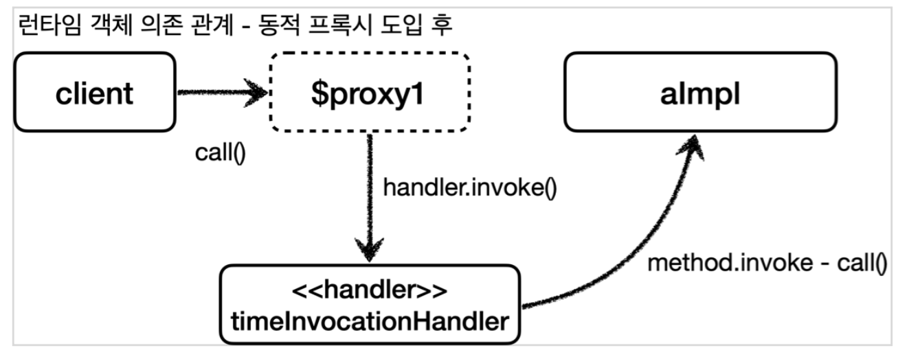<br>

**동적 프록시 클래스 정보**

`dynamicA()`와 `dynamicB()`둘을 동시에 함께 실행하면 JDK 동적 프록시가 각각 다른 동적 프록시 클래스를 만들어주는 것을 확인할 수 있다.

```
proxyClass=class com.sun.proxy.$Proxy1 //dynamicA
proxyClass=class com.sun.proxy.$Proxy2 //dynamicB
```

**정리**<br>
예제를 보면 `AImpl`, `BImpl`각각 프록시를 만들지 않았다. 프록시는 JDK 동적 프록시를 사용해서 동적으로 만들고, `TimeInvocationHandler`는 공통으로 사용했다.

JDK동적 프록시 기술 덕분에 적용 대상 만큼 프록시 객체를 만들지 않아도 된다. 그리고 같은 부가 기능 로직을 한번만 개발해서 공통으로 적용할 수 있다. 만약 적용 대상이 100개여도 동적 프록시를 통해서 생성하고, 각각 필요한 `InvocationHandler`만 만들어서 넣어주면 된다.<br>
결과적으로 프록시 클래스를 수 없이 만들어야 하는 문제도 해결하고, 부가 기능 로직도 하나의 클래스에 모아서 단일 책임 원칙(SRP)도 지킬 수 있게 되었다.

JDK 동적 프록시 없이 직접 프록시를 만들어서 사용할 때와 JDK 동적 프록시를 사용할 때의 차이를 그림으로 비교해보자.

**JDK 동적 프록시 도입 전 - 직접 프록시 생성**

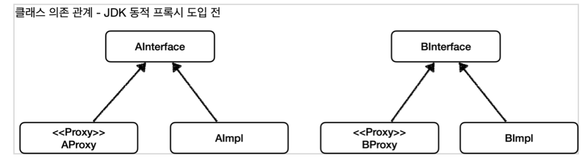<br>

**JDK 동적 프록시 도입 후**

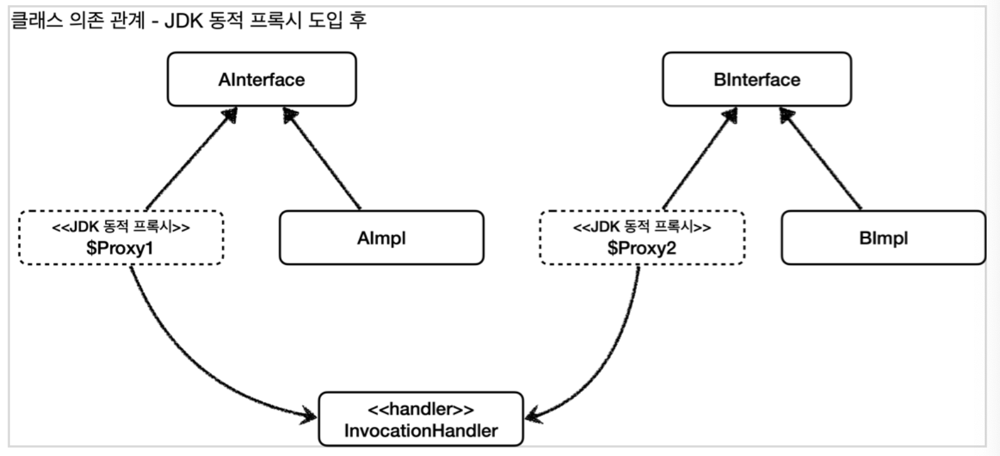<br>

점선은 개발자가 직접 만드는 클래스가 아니다.

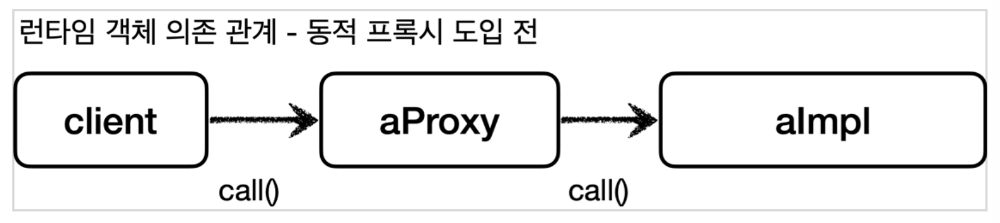<br>

<br>

지금까지 학습한 JDK 동적 프록시를 애플리케이션에 적용해보자.

## JDK 동적 프록시 - 적용1 

JDK 동적 프록시는 인터페이스가 필수이기 때문에 V1 애플리케이션에만 적용할 수 있다.

먼저 `LogTrace`를 적용할 수 있는 `InvocationHandler`를 만들자.

**LogTraceBasicHandler**

```java
package hello.proxy.config.v2_dynamicproxy.handler;

import hello.proxy.trace.TraceStatus;
import hello.proxy.trace.logtrace.LogTrace;

import java.lang.reflect.InvocationHandler;
import java.lang.reflect.Method;

public class LogTraceBasicHandler implements InvocationHandler {

    private final Object target;
    private final LogTrace logTrace;

    public LogTraceBasicHandler(Object target, LogTrace logTrace) {
        this.target = target;
        this.logTrace = logTrace;
    }

    @Override
    public Object invoke(Object proxy, Method method, Object[] args) throws Throwable {

        TraceStatus status = null;
        try {
            String message = method.getDeclaringClass().getSimpleName()
                    + "." + method.getName() + "()";
            status = logTrace.begin(message);

            //로직 호출
            Object result = method.invoke(target, args);

            logTrace.end(status);
            return result;
        } catch (Exception e) {
            logTrace.exception(status, e);
            throw e;
        }
    }
}
```

- `LogTraceBasicHandler`는 `InvocationHandler`인터페이스를 구현해서 JDK 동적 프록시에서 사용된다.
- `private final Object target`: 프록시가 호출할 대상이다.
- `String message = method.getDeclaringClass().getSimpleName() + "." ...`
  - `LogTrace`에 사용할 메시지이다. 프록시를 직접 개발할 때는 `"OrderController.request()`"와 같이 프록시마다 호출되는 클래스와 메서드 이름을 직접 남겼다. 이제는 `Method`를 통해서 호출되는 메서드 정보와 클래스 정보를 동적으로 확인할 수 있기 때문에 이 정보를 사용하면 된다.

동적 프록시를 사용하도록 수동 빈 등록을 설정하자.

**DynamicProxyBasicConfig**

```java
package hello.proxy.config.v2_dynamicproxy;

import hello.proxy.app.v1.*;
import hello.proxy.config.v2_dynamicproxy.handler.LogTraceBasicHandler;
import hello.proxy.trace.logtrace.LogTrace;
import org.springframework.context.annotation.Bean;
import org.springframework.context.annotation.Configuration;

import java.lang.reflect.Proxy;

@Configuration
public class DynamicProxyBasicConfig {

    @Bean
    public OrderControllerV1 orderControllerV1(LogTrace logTrace) {
        OrderControllerV1 orderController = new OrderControllerV1Impl(orderServiceV1(logTrace));

        OrderControllerV1 proxy = (OrderControllerV1)
                Proxy.newProxyInstance(OrderControllerV1.class.getClassLoader(),
                        new Class[]{OrderControllerV1.class},
                        new LogTraceBasicHandler(orderController, logTrace)
                );
        return proxy;
    }

    @Bean
    public OrderServiceV1 orderServiceV1(LogTrace logTrace) {
        OrderServiceV1 orderService = new OrderServiceV1Impl(orderRepositoryV1(logTrace));

        OrderServiceV1 proxy = (OrderServiceV1)
                Proxy.newProxyInstance(OrderServiceV1.class.getClassLoader(),
                        new Class[]{OrderServiceV1.class},
                        new LogTraceBasicHandler(orderService, logTrace)
                );
        return proxy;
    }

    @Bean
    public OrderRepositoryV1 orderRepositoryV1(LogTrace logTrace) {
        OrderRepositoryV1 orderRepository = new OrderRepositoryV1Impl();

        OrderRepositoryV1 proxy = (OrderRepositoryV1)
                Proxy.newProxyInstance(OrderRepositoryV1.class.getClassLoader(),
                        new Class[]{OrderRepositoryV1.class},
                        new LogTraceBasicHandler(orderRepository, logTrace)
                );
        return proxy;
    }
}
```

- 이전에는 프록시 클래스를 직접 개발했지만, 이제는 JDK 동적 프록시 기술을 사용해서 각각의 `Controller`, `Service`, `Repository`에 맞는 동적 프록시를 생성해주면 된다.
- `LogTraceBasicHandler`: 동적 프록시를 만들더라도 `LogTrace`를 출력하는 로직은 모두 같기 때문에 프록시는 모두 `LogTraceBasicHandler`를 사용한다.

**ProxyApplication - 수정**

```java
package hello.proxy;

import hello.proxy.config.AppV1Config;
import hello.proxy.config.AppV2Config;
import hello.proxy.config.v1_proxy.ConcreteProxyConfig;
import hello.proxy.config.v1_proxy.InterfaceProxyConfig;
import hello.proxy.config.v2_dynamicproxy.DynamicProxyBasicConfig;
import hello.proxy.trace.logtrace.LogTrace;
import hello.proxy.trace.logtrace.ThreadLocalLogTrace;
import org.springframework.boot.SpringApplication;
import org.springframework.boot.autoconfigure.SpringBootApplication;
import org.springframework.context.annotation.Bean;
import org.springframework.context.annotation.Import;

//@Import({AppV1Config.class, AppV2Config.class})
//@Import(InterfaceProxyConfig.class)
//@Import(ConcreteProxyConfig.class)
@Import(DynamicProxyBasicConfig.class)
@SpringBootApplication(scanBasePackages = "hello.proxy.app") //주의
public class ProxyApplication {

	public static void main(String[] args) {
		SpringApplication.run(ProxyApplication.class, args);
	}

	@Bean
	public LogTrace logTrace() {
		return new ThreadLocalLogTrace();
	}

}
```

`@Import(DynamicProxyBasicConfig.class)`: 이제 동적 프록시 설정을 `@Import`하고 실행해보자.

**실행**<br>
http://localhost:8080/v1/request?itemId=hello

**그림으로 정리**

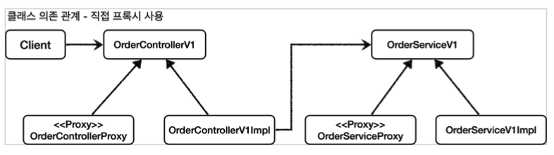<br>

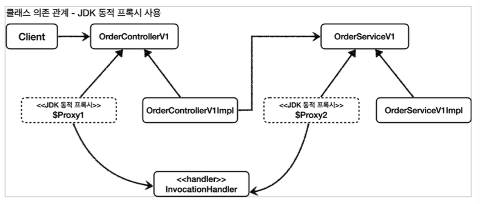<br>

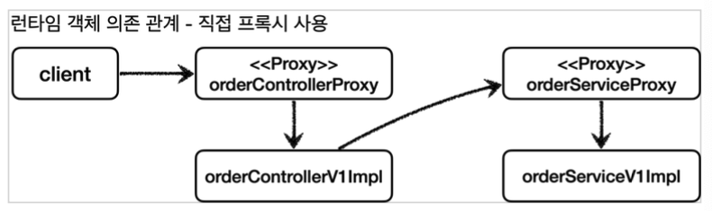<br>

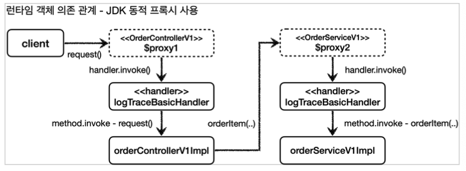<br>

**남은 문제**<br>
- http://localhost:8080/v1/no-log
- no-log를 실행해도 동적 프록시가 적용되고, `LogTraceBasicHandler`가 실행되기 때문에 로그가 남는다. 이 부분을 로그가 남지 않도록 처리해야 한다.

## JDK 동적 프록시 - 적용2

**메서드 이름 필터 기능 추가**

http://localhost:8080/v1/no-log

요구사항에 의해 이것을 호출 했을 때는 로그가 남으면 안된다.<br>
이런 문제를 해결하기 위해 메서드 이름을 기준을 특정 조건을 만족할 때만 로그를 남기는 기능을 개발해보자.

**LogTraceFilterHandler**

```java
package hello.proxy.config.v2_dynamicproxy.handler;

import hello.proxy.trace.TraceStatus;
import hello.proxy.trace.logtrace.LogTrace;
import org.springframework.util.PatternMatchUtils;

import java.lang.reflect.InvocationHandler;
import java.lang.reflect.Method;

public class LogTraceFilterHandler implements InvocationHandler {

    private final Object target;
    private final LogTrace logTrace;
    private final String[] patterns;

    public LogTraceFilterHandler(Object target, LogTrace logTrace, String... patterns) {
        this.target = target;
        this.logTrace = logTrace;
        this.patterns = patterns;
    }

    @Override
    public Object invoke(Object proxy, Method method, Object[] args) throws Throwable {

        //메서드 이름 필터
        String methodName = method.getName();
        if (!PatternMatchUtils.simpleMatch(patterns, methodName)) {
            return method.invoke(target, args);
        }

        TraceStatus status = null;
        try {
            String message = method.getDeclaringClass().getSimpleName() + "."
                    + method.getName() + "()";
            status = logTrace.begin(message);

            //로직 호출
            Object result = method.invoke(target, args);
            logTrace.end(status);
            return result;
        } catch (Exception e) {
            logTrace.exception(status, e);
            throw e;
        }
    }
}
```

- `LogTraceFilterHandler`는 기존 기능에 다음 기능이 추가되었다.
  - 특정 메서드 이름이 매칭 되는 경우에만 `LogTrace`로직을 실행한다. 이름이 매칭되지 않으면 실제 로직이 바로 호출한다.
- 스프링이 제공하는 `PatternMatchUtils.simpleMatch(..)`를 사용하면 단순한 매칭 로직을 쉽게 적용할 수 있다.
  - `xxx`: xxx가 정확히 매칭되는 참
  - `xxx*`: xxx로 시작하면 참
  - `*xxx`: xxx로 끝나는 참
  - `*xxx*`: xxx가 있으면 참
- `String[] patterns`: 적용할 패턴은 생성자를 통해서 외부로 받는다.

**DynamicProxyFilterConfig**

```java
package hello.proxy.config.v2_dynamicproxy;

import hello.proxy.app.v1.*;
import hello.proxy.config.v2_dynamicproxy.handler.LogTraceFilterHandler;
import hello.proxy.trace.logtrace.LogTrace;
import org.springframework.context.annotation.Bean;
import org.springframework.context.annotation.Configuration;

import java.lang.reflect.Proxy;

@Configuration
public class DynamicProxyFilterConfig {

    public static final String[] PATTERNS = {"request*", "order*", "save*"};

    @Bean
    public OrderControllerV1 orderControllerV1(LogTrace logTrace) {
        OrderControllerV1 orderController = new
                OrderControllerV1Impl(orderServiceV1(logTrace));

        OrderControllerV1 proxy = (OrderControllerV1)
                Proxy.newProxyInstance(DynamicProxyFilterConfig.class.getClassLoader(),
                        new Class[]{OrderControllerV1.class},
                        new LogTraceFilterHandler(orderController, logTrace, PATTERNS)
                );
        return proxy;
    }

    @Bean
    public OrderServiceV1 orderServiceV1(LogTrace logTrace) {
        OrderServiceV1 orderService = new OrderServiceV1Impl(orderRepositoryV1(logTrace));

        OrderServiceV1 proxy = (OrderServiceV1)
                Proxy.newProxyInstance(DynamicProxyFilterConfig.class.getClassLoader(),
                        new Class[]{OrderServiceV1.class},
                        new LogTraceFilterHandler(orderService, logTrace, PATTERNS)
                );
        return proxy;
    }

    @Bean
    public OrderRepositoryV1 orderRepositoryV1(LogTrace logTrace) {
        OrderRepositoryV1 orderRepository = new OrderRepositoryV1Impl();

        OrderRepositoryV1 proxy = (OrderRepositoryV1)
                Proxy.newProxyInstance(DynamicProxyFilterConfig.class.getClassLoader(),
                        new Class[]{OrderRepositoryV1.class},
                        new LogTraceFilterHandler(orderRepository, logTrace, PATTERNS)
                );
        return proxy;
    }
}
```

- `public static final String[] PATTERNS = {"request*", "order*", "save*"};`
  - 적용할 패턴이다. `request`, `order`, `save`로 시작하는 메서드에 로그가 남는다.
- `LogTraceFilterHandler`:앞서 만든 필터 기능이 있는 핸들러를 사용한다. 그리고 핸들러에 적용 패턴도 넣어준다.

**ProxyApplication - 추가**

```java
package hello.proxy;

import hello.proxy.config.AppV1Config;
import hello.proxy.config.AppV2Config;
import hello.proxy.config.v1_proxy.ConcreteProxyConfig;
import hello.proxy.config.v1_proxy.InterfaceProxyConfig;
import hello.proxy.config.v2_dynamicproxy.DynamicProxyBasicConfig;
import hello.proxy.config.v2_dynamicproxy.DynamicProxyFilterConfig;
import hello.proxy.trace.logtrace.LogTrace;
import hello.proxy.trace.logtrace.ThreadLocalLogTrace;
import org.springframework.boot.SpringApplication;
import org.springframework.boot.autoconfigure.SpringBootApplication;
import org.springframework.context.annotation.Bean;
import org.springframework.context.annotation.Import;

//@Import({AppV1Config.class, AppV2Config.class})
//@Import(InterfaceProxyConfig.class)
//@Import(ConcreteProxyConfig.class)
//@Import(DynamicProxyBasicConfig.class)
@Import(DynamicProxyFilterConfig.class)
@SpringBootApplication(scanBasePackages = "hello.proxy.app") //주의
public class ProxyApplication {

	public static void main(String[] args) {
		SpringApplication.run(ProxyApplication.class, args);
	}

	@Bean
	public LogTrace logTrace() {
		return new ThreadLocalLogTrace();
	}

}
```

`@Import(DynamicProxyFilterConfig.class)`으로 방금 만든 설정을 추가하자.

**실행**

- http://localhost:8080/v1/request?itemId=hello
- http://localhost:8080/v1/no-log

실행해보면 `no-log`가 사용되는 `noLog()`메서드에는 로그가 남지 않는 것을 확인할 수 있다.

### JDK 동적 프록시 - 한계

JDK 동적 프록시는 인터페이스가 필수이다.<br>
그렇다면 V2 애픞리케이션 처럼 인터페이스 없이 클래스만 있는 경우에는 어떻게 동적 프록시를 적용할 수 있을까?<br>
이것은 일반적인 방법으로는 어렵고 `CGLIB`라는 바이트코드를 조작하는 특별한 라이브러리를 사용해야한다.

## CGLIB - 소개 

**CGLIB: Code Genertaor Library**

- CGLIB는 바이트코드를 조작해서 동적으로 클래스를 생성하는 기술을 제공하는 라이브러리이다.
- CGLIB를 사용하면 인터페이스가 없어도 구체 클래스만 가지고 동적 프록시를 만들어낼 수 있다.
- CGLIB는 원래는 외부 라이브러리인데, 스프링 프레임워크가 스프링 내부 소스 코드에 포함했다. 따라서 스프링을 사용한다면 별도의 외부 라이브러리를 추가하지 않아도 사용할 수 있다.

참고로 우리가 CGLIB를 직접 사용하는 경우는 거의 없다. 이후에 설명할 스프링의 `ProxyFactory`라는 것이 이 기술을 편리하게 사용하게 도와주기 때문에, 너무 깊이있게 파기보다는 CGLIB가 무엇인지 대략 개념만 잡으면 된다.<br>예제 코드로 CGLIB를 간단히 이해해보자.

**공통 예제 코드**<br>
앞으로 다양한 상황을 설명하기 위해서 먼저 공통으로 사용할 예제 코드를 만들어보자.

- 인터페이스와 구현이 있는 서비스 클래스 - `ServiceInterface`, `ServiceImpl`
- 구체 클래스만 있는 서비스 클래스 - `ConcreteService`

**ServiceInterface**

> [!CAUTION]
> 테스트 코드(src/test)에 위차힌다.

```java
package hello.proxy.common.service;

public interface ServiceInterface {
    void save();

    void find();
}
```

**ServiceImpl**

> [!CAUTION]
> 테스트 코드(src/test)에 위차힌다.

```java
package hello.proxy.common.service;

import lombok.extern.slf4j.Slf4j;

@Slf4j
public class ServiceImpl implements ServiceInterface {
    @Override
    public void save() {
        log.info("save 호출");
    }

    @Override
    public void find() {
        log.info("find 호출");
    }
}
```

**ConcreteService**

> [!CAUTION]
> 테스트 코드(src/test)에 위차힌다.

```java
package hello.proxy.common.service;

import lombok.extern.slf4j.Slf4j;

@Slf4j
public class ConcreteService {
    public void call() {
        log.info("ConcreteService 호출");
    }
}
```

## CGLIB - 예제 코드 

### CGLIB 코드

JDK 동적 프록시에서 실행 로직을 위해 `InvocationHandler`를 제공했듯이, CGLIB는 `MethodInterceptor`를 제공한다.

**MethodInterceptor - CGLIB 제공**

```java
package org.springframework.cglib.proxy;

public interface MethodInterceptor extends Callback {
    Object intercept(Object obj, Method method, Object[] args, MethodProxy proxy) throws Throwable;
}
```

- `obj`: CGLIB가 적용된 객체
- `method`: 호출된 메서드
- `args`: 메서드를 호출하면서 전달된 인수
- `proxy`: 메서드 호출에 사용

**TimeMethodInterceptor**

> [!CAUTION]
> 테스트 코드(src/test)에 위차힌다.

```java
package hello.proxy.cglib.code;

import lombok.extern.slf4j.Slf4j;
import org.springframework.cglib.proxy.MethodInterceptor;
import org.springframework.cglib.proxy.MethodProxy;

import java.lang.reflect.Method;

@Slf4j
public class TimeMethodInterceptor implements MethodInterceptor {

    private final Object target;

    public TimeMethodInterceptor(Object target) {
        this.target = target;
    }

    @Override
    public Object intercept(Object obj, Method method, Object[] args,
                            MethodProxy proxy) throws Throwable {
        log.info("TimeProxy 실행");
        long startTime = System.currentTimeMillis();

        Object result = proxy.invoke(target, args);

        long endTime = System.currentTimeMillis();
        long resultTime = endTime - startTime;
        log.info("TimeProxy 종료 resultTime={}", resultTime);
        return result;
    }
}
```

- `TimeMethodInterceptor`는 `MethodInterceptor`인터페이스를 구현해서 CGLIB 프록시의 실행 로직을 정의한다.
- JDK 동적 프록시를 설명할 때 예제와 거의 같은 코드이다.
- `Object target`: 프록시가 호출할 실제 대상
- `proxy.invoke(target, args)`: 실제 대상을 동적으로 호출한다.
  - 참고로 `method`를 사용해도 되지만, CGLIB는 성능상 `MethodProxy proxy`를 사용하는 것을 권장한다.

이제 테스트 코드로 CGLIB를 사용해보자.

**CglibTest**

```java
package hello.proxy.cglib;

import hello.proxy.cglib.code.TimeMethodInterceptor;
import hello.proxy.common.service.ConcreteService;
import lombok.extern.slf4j.Slf4j;
import org.junit.jupiter.api.Test;
import org.springframework.cglib.proxy.Enhancer;

@Slf4j
public class CglibTest {

    @Test
    void cglib() {
        ConcreteService target = new ConcreteService();

        Enhancer enhancer = new Enhancer();
        enhancer.setSuperclass(ConcreteService.class);
        enhancer.setCallback(new TimeMethodInterceptor(target));
        ConcreteService proxy = (ConcreteService) enhancer.create();
        log.info("targetClass={}", target.getClass());
        log.info("proxyClass={}", proxy.getClass());

        proxy.call();
    }
}
```

`ConcreteService`는 인터페이스가 없는 구체 클래스이다. 여기에 CGLIB를 사용해서 프록시를 생성해보자.

- `Enhancer`: CGLIB는 `Enhancer`를 사용해서 프록시를 생성한다.
- `enhanver.setSuperclass(ConcreteService.class)`: CGLIB는 구체 클래스를 상속 받아서 프록시를 생성할 수 있다. 어떤 구체 클래스를 상속 받을지 지정한다.
- `enhancer.setCallback(new TimeMethodInterceptor(target))`
  - 프록시에 적용할 실행 로직을 할당한다.
- `enhancer.create()`: 프록시를 생성한다. 앞서 설정한 `enhancer.setSuperclass(ConcreteService.class)`에서 지정한 클래스를 상속 받아서 프록시가 만들어진다.

JDK 동적 프록시는 인터페이스를 구현(implement)해서 프록시를 만든다. CGLIB는 구체 클래스를 상속(extends)해서 프록시를 만든다.

**실행 결과**

```
CglibTest - targetClass=class hello.proxy.common.service.ConcreteService
CglibTest - proxyClass=class hello.proxy.common.service.ConcreteService$$EnhancerByCGLIB$$25d6b0e3
TimeMethodInterceptor - TimeProxy 실행
ConcreteService - ConcreteService 호출
TimeMethodInterceptor - TimeProxy 종료 resultTime=24
```

실행 결과를 보면 프록시가 정상 적용된 것을 확인할 수 있다.

**CGLIB가 생성한 프록시 클래스 이름**<br>
CGLIB를 통해서 생성된 클래스의 이름을 확인해보자.<br>
`ConcreteService$$EnhancerByCGLIB$$25d6b0e3`

CGLIB가 동적으로 생성하는 크랠스 으름은 다음과 같은 규칙으로 생성된다.<br>
`대상클래스$$EnhancerByCGLIB$$임의코드`

참고로 다음은 JDK Proxy가 생성한 클래스 이름이다.<br>
`proxyClass=class com.sun.proxy.$Proxy1`

### 그림으로 정리

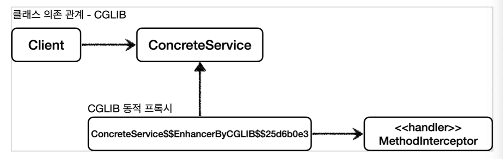<br>

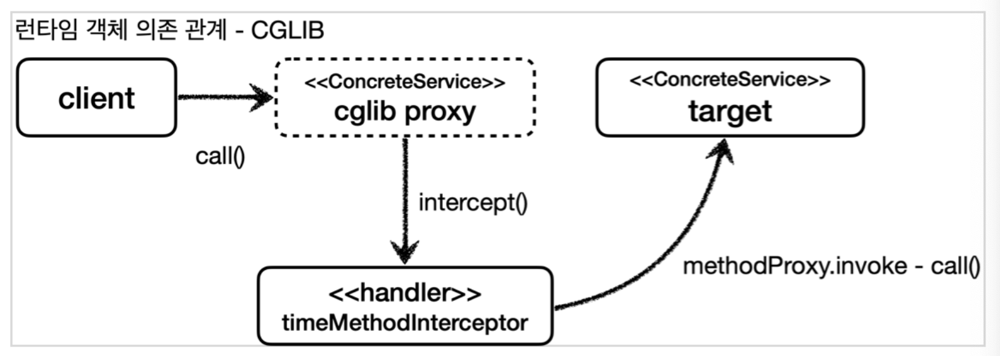<br>

### CGLIB 제약

- 클래스 기반 프록시는 상속을 사용하기 때문에 몇가지 제약이 있다.
  - 부모 클래스의 생성자를 체크해야 한다. -> CGLIB는 자식 클래스를 동적으로 생성하기 때문에 기본 생성자가 필요하다.
  - 클래스에 `final`키워드가 붙으면 상속이 불가능하다. -> CGLIB에서는 예외가 발생한다.
  - 메서드에 `final`키워드가 붙으면 해당 메서드를 오버라이딩 할 수 없다. -> CGLIB에서는 프록시 로직이 동작하지 않는다.

> [!NOTE]
> CGLIB를 사용하면 인터페이스가 없는 V2 애플리케이션에 동적 프록시를 적용할 수 있다. 그런데 지금 당장 적용하기에는 몇가지 제약이 있다. V2 애플리케이션에 기본 생성자를 추가하고, 의존관계를 `setter`를 사용해서 주입하면 CGLIB를 적용할 수 있다. 하지만 다음에 학습하는 `ProxyFactory`를 통해서 CGLIB를 적용하면 이런 단점을 해결하고 또 더 편리하기 때문에, 애플리케이션에 CGLIB로 프록시를 적용하는 것은 조금 뒤에 알아보겠다.

## 정리

### 남은 문제

- 인터페이스가 있는 경우에는 JDK 동적 프록시를 적용하고, 그렇지 않은 경우에는 CGLIB를 적용하려면 어떻게 해야할까?
- 두 기술을 함께 사용할 때 부가 기능을 제공하기 위해서 JDK 동적 프록시가 제공하는 `InvocationHandler`와 CGLIB가 제공하는 `MethodInterceptor`를 각각 중복으로 만들어서 관리해야 할까?
- 특정 조건에 맞을 때 프록시 로직을 적용하는 기능도 공통으로 제공되었으면?

# 스프링이 지원하는 프록시

## 프록시 팩토리 - 소개

앞서 마지막에 설명했던 동적 프록시를 사용할 때 문제점을 다시 확인해보자.

**문제점**<br>
- 인터페이스가 있는 경우에는 JDK 동적 프록시를 적용하고, 그렇지 않은 경우에는 CGLIB를 적용하려면 어떻게 해야할까?
- 두 기술을 함께 사용할 때 부가 기능을 제공하기 위해 JDK 동적 프록시가 제공하는 `InvocationHandler`와 CGLIB가 제공하는 `MethodInterceptor`를 각각 중복으로 만들어서 관리해야 할까?
- 특정 조건에 맞을 때 프록시 로직을 적용하는 기능도 공통으로 제공되었다면?

**Q: 인터페이스가 있는 경우에는 JDK 동적 프록시를 적용하고, 그렇지 않은 경우에는 CGLIB를 적용하려면 어떻게 해야할까?**<br>
스프링은 유사한 구체적인 기술이 있을 때, 그것들을 통합해서 일관성 있게 접근할 수 있고, 더욱 편리하게 사용할 수 있는 추상화된 기술을 제공한다.<br>
스프링은 동적 프록시를 통합해서 편리하게 만들어주는 프록시 팩토리(`ProxyFactory`)라는 기능을 제공한다.<br>
이전에는 상황에 따라서 JDK 동적 프록시를 사용하거나 CGLIB를 사용해야 했다면, 이제는 이 프록시 팩토리 하나로 편리하게 동적 프록시를 생성할 수 있다.<br>
프록시 팩토리는 인터페이스가 있다면 JDK 동적 프록시를 사용하고, 구체 클래스만 있다면 CGLIB를 사용한다. 그리고 이 설정을 변경할 수도 있다.

프록시 팩토리

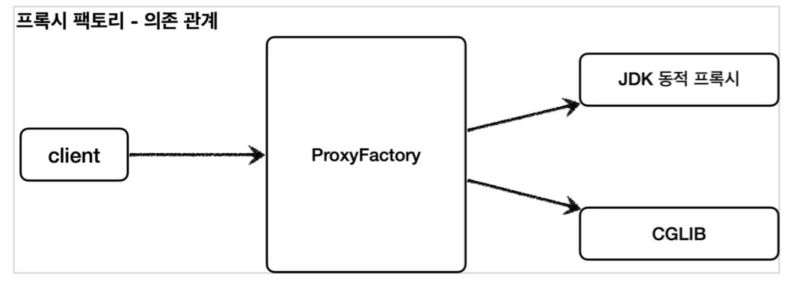<br>

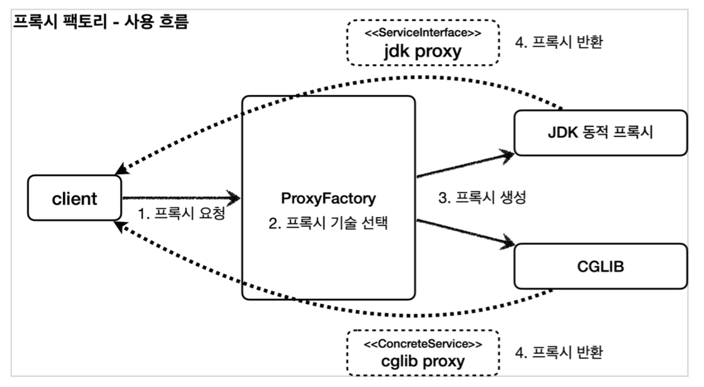<br>

**Q: 두 기술을 함께 사용할 때 부가 기능을 적용하기 위해 JDK 동적 프록시가 제공하는 InvocationHandler와 CGLIB가 제공하는 MethodInterceptor를 각각 중복으로 따로 만들어야 할까?**<br>
스프링은 이 문제를 해결하기 위해 부가 기능을 적용할 때 `Advice`라는 새로운 개념을 도입했다. 개발자는 `InvocationHander`나 `MethodInterceptor`를 신경쓰지 않고, `Advice`만 만들면 된다.<br>결과적으로 `InvocationHandler`나 `MethodInterceptor`는 `Advice`를 호출하게 된다.<br>
프록시 팩토리를 사용하면 `Advice`를 호출하는 전용 `InvocationHandler`, `MethodInterceptor`를 내부에서 사용한다.

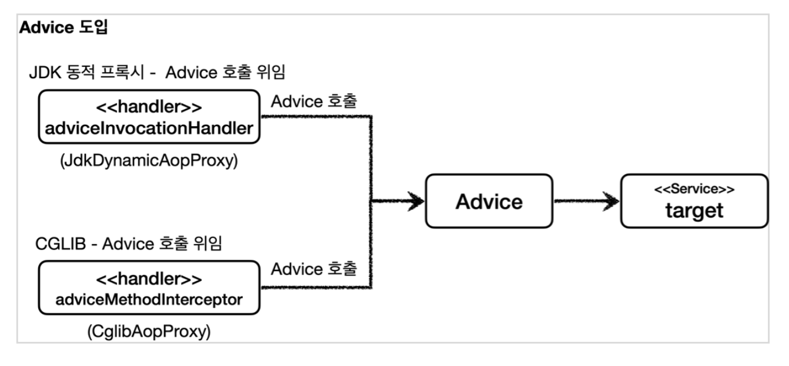<br>

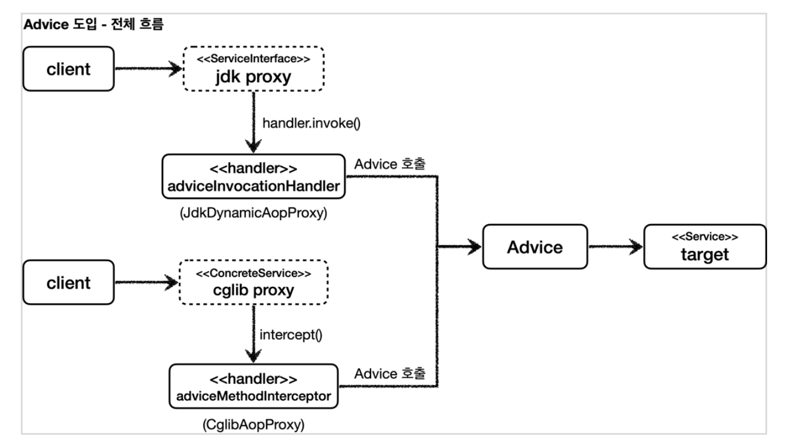<br>

**Q: 특정 조건에 맞을 때 프록시 로직을 적용하는 기능도 공통으로 제공되었으면?**<br>
앞서 특정 메서드 이름의 조건에 맞을 때만 프록시 부가 기능이 적용되는 코드를 직접 만들었다. 스프링은 `Pointcut`이라는 개념을 도입해서 이 문제를 일관성 있게 해결한다.

## 프록시 팩토리 - 예제 코드1

**Advice 만들기**<br>
`Advice`는 프록시에 적용하는 부가 기능 로직이다. 이것은 JDK 동적 프록시가 제공하는 `InvocationHandler`의 CGLIB가 제공하는 `MethodInterceptor`의 개념과 유사하다. 둘을 개념적으로 추상화 한 것이다. 프록시 팩토리를 사용하면 둘 대신에 `Advice`를 사용하면 된다.

`Advice`를 만드는 방법은 여러가지가 있지만, 기본적인 방법은 다음 인터페이스를 구현하면 된다.

**MethodInterceptor - 스프링이 제공하는 코드**

```java
package org.aopalliance.intercept;

public interface MethodInterceptor extends Interceptor {
    Object invoke(MethodInvocation invocation) throws Throwable;
}
```

- `MethodInvocation invocation`
  - 내부에는 다음 메서드를 호출하는 방법, 현재 프록시 객체 인스턴, `args`, 메서드 정보 등이 포함되어 있다. 기존에 파라미터로 제공되는 부분들이 이 안으로 모두 들어갔다고 생각하면 된다.
- CGLIB의 `MethodInterceptor`와 이름이 같으므로 패키지 이름에 주의하자
  - 참고로 여기서 사용하는 `org.aopalliance.intercept`패키지는 스프링 AOP 모듈(`spring-top`) 안에 들어있다.
- `MethodInterceptor`는 `Interceptor`를 상속하고 `Interceptor`는 `Advice`인터페이스를 상속한다.

이제 실제 `Advice`를 만들어보자.

**TimeAdvice**

> [!CAUTION]
> 테스트 코드(src/test)에 위차힌다.

```java
package hello.proxy.common.advice;

import lombok.extern.slf4j.Slf4j;
import org.aopalliance.intercept.MethodInterceptor;
import org.aopalliance.intercept.MethodInvocation;

@Slf4j
public class TimeAdvice implements MethodInterceptor {

    @Override
    public Object invoke(MethodInvocation invocation) throws Throwable {
        log.info("TimeProxy 실행");
        long startTime = System.currentTimeMillis();

        Object result = invocation.proceed();

        long endTime = System.currentTimeMillis();
        long resultTime = endTime - startTime;
        log.info("TimeProxy 종료 resultTime={}ms", resultTime);
        return result;
    }
}
```

- `TimeAdvice`는 앞서 설명한 `MethodInterceptor`인터페이스를 구현한다. 패키지 이름에 주의하자.
- `Object result = invocation.proceed()`
  - `invocation.proceed()`를 호출하면 `target`클래스를 호출하고 그 결과를 받는다.
  - 그런데 기존에 보았던 코드들과 다르게 `target`클래스의 정보가 보이지 않는다. `target`클래스의 정보는 `MethodInvocation invocation`안에 모두 포함되어 있다.
  - 그 이유는 바로 다음에 확인할 수 있는데, 프록시 팩토리로 프록시를 생성하는 단계에서 이미 `target`정보를 파라미터로 전달받기 때문이다.

**ProxyFactoryTest**

```java
package hello.proxy.proxyfactory;

import hello.proxy.common.advice.TimeAdvice;
import hello.proxy.common.service.ServiceImpl;
import hello.proxy.common.service.ServiceInterface;
import lombok.extern.slf4j.Slf4j;
import org.junit.jupiter.api.DisplayName;
import org.junit.jupiter.api.Test;
import org.springframework.aop.framework.ProxyFactory;
import org.springframework.aop.support.AopUtils;

import static org.assertj.core.api.Assertions.assertThat;

@Slf4j
public class ProxyFactoryTest {

    @Test
    @DisplayName("인터페이스가 있으면 JDK 동적 프록시 사용")
    void interfaceProxy() {
        ServiceInterface target = new ServiceImpl();
        ProxyFactory proxyFactory = new ProxyFactory(target);
        proxyFactory.addAdvice(new TimeAdvice());
        ServiceInterface proxy = (ServiceInterface) proxyFactory.getProxy();
        log.info("targetClass={}", target.getClass());
        log.info("proxyClass={}", proxy.getClass());

        proxy.save();

        assertThat(AopUtils.isAopProxy(proxy)).isTrue();
        assertThat(AopUtils.isJdkDynamicProxy(proxy)).isTrue();
        assertThat(AopUtils.isCglibProxy(proxy)).isFalse();
    }
}
```

- `new ProxyFactory(target)`: 프록시 팩토리를 생성할 때, 생성자에 프록시의 호출 대상을 함께 넘겨준다. 프록시 팩토리는 이 인스턴스 정보를 기반으로 프록시를 만들어낸다. 만약 이 인스턴스에 인터페이스가 있다면 JDK 동적 프록시를 기본으로 사용하고 인터페이스가 없고 구체 클래스만 있다면 CGLIB를 통해서 동적 프록시를 생성한다. 여기서는 `target`이 `new ServiceImpl()`의 인스턴스이기 때문에 `ServiceInterface`인터페이스가 있다. 따라서 이 인터페이스를 기반으로 JDK 동적 프록시를 생성한다.
- `proxyFactory.addAdvice(new TimeAdvice())`: 프록시 팩토리를 통해서 만든 프록시가 사용할 부가 기능 로직을 설정한다. JDK 동적 프록시가 제공하는 `InvocationHandler`와 CGLIB가 제공하는 `MethodInterceptor`의 개념과 유사하다. 이러헥 프록시가 제공하는 부가 기능 로직을 어드바이스 (`Advice`)라 한다. 번역하면 조언을 해준다고 생각하면 된다.
- `proxyFactory.getProxy()`: 프록시 객체를 생성하고 그 결과를 받는다.

**실행 결과**

```
ProxyFactoryTest - targetClass=class hello.proxy.common.service.ServiceImpl
ProxyFactoryTest - proxyClass=class jdk.proxy2.$Proxy9
TimeAdvice - TimeProxy 실행
ServiceImpl - save 호출
TimeAdvice - TimeProxy 종료 resultTime=0ms
```

실행결과를 보면 프록시가 정상 적용된 것을 확인할 수 있다. `proxyClass=class jdk.proxy2.$Proxy9`코드를 통해 JDK동적 프록시가 적용된 것도 확인할 수 있다.

**프록시 팩토리를 통한 프록시 적용 확인**<br>
프록시 팩토리로 프록시가 잘 적용되었는지 확인하려면 다음 기능을 사용하면 된다.<br>
- `AopUtils.isAopProxy(proxy)`: 프록시 팩토리를 통해서 프록시가 생성되면 JDK 동적 프록시나, CGLIB 모두 참이다.
- `AopUtils.isJdkDynamicProxy(proxy)`: 프록시 팩토리를 통해서 프록시가 생성되고, JDK 동적 프록시인 경우 참
- `AopUtils.isCglibProxy(proxy)`: 프록시 팩토리를 통해서 프록시가 생성되고, CGLIB동적 프록시인 경우 참

물론 `proxy.getClass()`처럼 인스턴스의 클래스 정보를 직접 출력해서 확인할 수 있다.

## 프록시 팩토리 - 예제 코드2

**ProxyFactoryTest - concreteProxy 추가**

```java
@Test
@DisplayName("구체 클래스만 있으먄 CGLIB 사용")
void concreteProxy() {
    ConcreteService target = new ConcreteService();
    ProxyFactory proxyFactory = new ProxyFactory(target);
    proxyFactory.addAdvice(new TimeAdvice());
    ConcreteService proxy = (ConcreteService) proxyFactory.getProxy();
    log.info("targetClass={}", target.getClass());
    log.info("proxyClass={}", proxy.getClass());

    proxy.call();

    assertThat(AopUtils.isAopProxy(proxy)).isTrue();
    assertThat(AopUtils.isJdkDynamicProxy(proxy)).isFalse();
    assertThat(AopUtils.isCglibProxy(proxy)).isTrue();
} 
```

이번에는 구체 클래스만 있는 `ConcreteService`에 프록시를 적용해보자.<br>
프록시 팩토리는 인터페이스 없이 구체 클래스만 있으면 CGLIB를 사용해서 프록시를 적용한다.<br>
나머지 코드는 기존과 같다.

**실행 결과**

```
ProxyFactoryTest - targetClass=class hello.proxy.common.service.ConcreteService
ProxyFactoryTest - proxyClass=class hello.proxy.common.service.ConcreteService$$EnhancerBySpringCGLIB$$adb39dcb
TimeAdvice - TimeProxy 실행
ConcreteService - ConcreteService 호출
TimeAdvice - TimeProxy 종료 resultTime=24ms
```

실행 결과를 보면 프록시가 정상 적용된 것을 확인할 수 있다. `proxyClass=class..ConcreteService$$EnhancerBySpringCGLIB$$adb39dcb` 코드를 통해 CGLIB 프록시가 적용된 것도 확인할 수 있다.

**proxyTargetClass 옵션**

**ProxyFactoryTest - proxyTargetClass 추가**

```java
@Test
@DisplayName("ProxyTargetClass 옵션을 사용하면 인터페이스가 있어도 CGLIB를 사용하고, 클래스 기반 프록시 사용")
void proxyTargetClass() {
    ServiceInterface target = new ServiceImpl();
    ProxyFactory proxyFactory = new ProxyFactory(target);
    proxyFactory.setProxyTargetClass(true); //중요
    proxyFactory.addAdvice(new TimeAdvice());

    ServiceInterface proxy = (ServiceInterface) proxyFactory.getProxy();
    log.info("targetClass={}", target.getClass());
    log.info("proxyClass={}", proxy.getClass());
    proxy.save();

    assertThat(AopUtils.isAopProxy(proxy)).isTrue();
    assertThat(AopUtils.isJdkDynamicProxy(proxy)).isFalse();
    assertThat(AopUtils.isCglibProxy(proxy)).isTrue();
}
```

마지막으로 인터페이스가 있지만, CGLIB를 사용해서 인터페이스가 아닌 클래스 기반으로 동적 프록시를 만드는 방법을 알아보자.<br>
프록시 팩토리는 `proxyTargetClass`라는 옵션을 제공하는데, 이 옵션에 `true`값을 넣으면 인터페이스가 있어도 강제로 CGLIB를 사용한다. 그리고 인터페이스가 아닌 클래스 기반의 프록시를 만들어준다.

**실행 결과**

```
proxyfactory.ProxyFactoryTest - targetClass=class hello.proxy.common.service.ServiceImpl
proxyfactory.ProxyFactoryTest - proxyClass=class hello.proxy.common.service.ServiceImpl$$EnhancerBySpringCGLIB$$d33e4087
TimeAdvice - TimeProxy 실행
ServiceImpl - save 호출
TimeAdvice - TimeProxy 종료 resultTime=24ms
```

`ServiceImpl$$EnhancerBySpringCGLIB...`를 보면 CGLIB 기반의 프록시가 생성된 것을 확인할 수 있다. 인터페이스가 있지만 `proxyTargetClass`옵션에 의해 CGLIB가 사용된다.

**프록시 팩토리의 기술 선택 방법**<br>
- 대상에 인터페이스가 있으면: JDK 동적 프록시, 인터페이스 기반 프록시
- 대상에 인터페이스가 없으면: CGLIB, 구체 클래스 기반 프록시
- `proxyTargetClass=true`: CGLIB, 구체 클래스 기반 프록시, 인터페이스 여부와 상관없음

**정리**<br>
- 프록시 팩토리의 서비스 추상화 덕분에 구체적인 CGLIB, JDK동적 프록시 기술에 의존하지 않고, 매우 편리하게 동적 프록시를 생성할 수 있다.
- 프록시의 부가 기능 로직도 특정 기술에 종속적이지 않게 `Advice`하나로 편리하게 사용할 수 있었다.<br>이것은 프록시 팩토리가 내부에서 JDK 동적 프록시인 경우 `InvocationHandler`가 `Advice`를 호출하도록 개발해두고, CGLIB인 경우 `MethodInterceptor`가 `Advice`를 호출하도록 기능을 개발해두었기 때문이다.

> [!TIP]
> 스프링 부트는 AOP를 적용할 때 기본적으로 `proxyTargetClass=true`로 설정해서 사용한다.<br>따라서 인터페이스가 있어도 항상 CGLIB를 사용해서 구체 클래스를 기반으로 프록시를 생성한다.

## 포인트컷, 어드바이스, 어드바이저 - 소개

스프링 AOP를 공부했다면 다음과 같은 단어를 들어보았을 것이다. 항상 잘 정리가 안되는 단어들인데, 단순하지만 중요하니 이번에 확실히 정리해보자.

- **포인트 컷**(`Pointcut`): 어디에 부가 기증을 적용할지, 어디에 부가 기능을 적용하지 않을지 판단하는 필터링 로직이다. 주로 클래스와 메서드 이름으로 필터링한다. 이름 그대로 어떤 포인트(Point)에 기능을 적용할지 하지 않을지 잘라서(cut)구분하는 것이다.
- **어드바이스**(`Advice`): 이전에 본 것 처럼 프록시가 호출하는 부가 기능이다. 단순하게 프록시 로직이라 생각하면 된다.
- **어드바이저**(`Advisor`): 단순하게 하나의 포인트컷과 하나의 어드바이스를 가지고 있는 것이다. 쉽게 이야기 해서 **포인트컷1 + 어드바이스1**이다.

정리하면 부가 기능 로직을 적용해야 하는데, 포인트컷으로 어디에? 적용할지 선택하고, 어드바이스로 어떤 로직을 적용할지 선택하는 것이다. 그리고 어디에? 어떤 로직?을 모두 알고 있는 것이 **어드바이저**이다.

**쉽게 기억하기**<br>
- 조언(`Advice`)을 어디(`Pointcut`)에 할 것인가?
- 조언자(`Advisor`)는 어디(`Pointcut`)에 조언(`Advice`)을 해야할지 알고 있다.

**역할과 책임**<br>
이렇게 구분하는 것은 역할과 책임을 명확하게 분리한 것이다.<br>
- 포인트컷은 대상 여부를 확인하는 필터 역할만 담당한다.
- 어드바이스는 깔끔하게 부가 기능 로직만 담당한다.
- 둘을 합치면 어드바이저가 된다. 스프링의 어드바이저는 하나의 포인트컷 + 하나의 어드바이스로 구성된다.

> [!TIP]
> 해당 단어들에 대한 정의는 지금은 문맥상 이해를 돕기 위해 프록시에 맞추어서 설명하지만, 이후에 AOP부분에서 다시 한번 AOP에 맞추어 정리하겠다. 그림은 이해를 돕기 위한 것이고, 실제 구현은 약간 다를 수 있다.

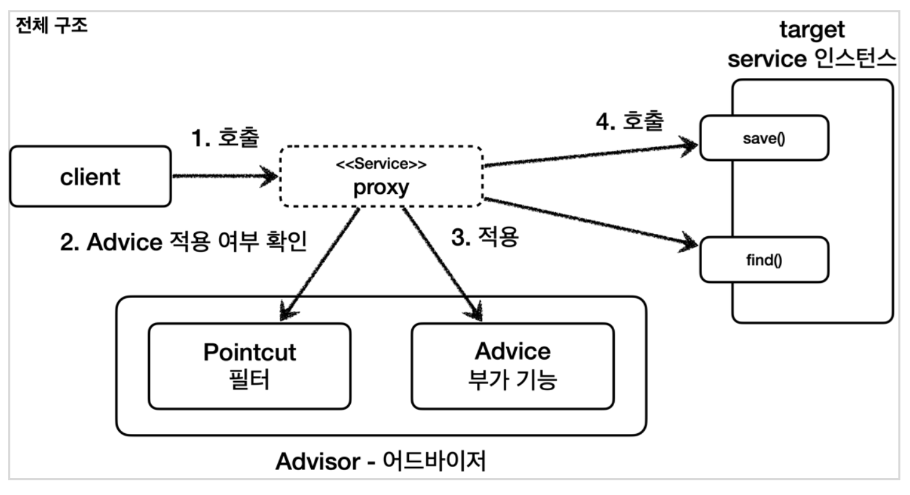<br>

## 예제 코드 1 - 어드바이저

어드바이저는 하나의 포인트컷과 하나의 어드바이스를 가지고 있다.<br>
프록시 팩토리를 통해 프록시를 생성할 때 어드바이저를 제공하면 어디에 어떤 기능을 제공할 지 알 수 있다.

**AdvisorTest**

```java
package hello.proxy.advisor;

import hello.proxy.common.advice.TimeAdvice;
import hello.proxy.common.service.ServiceImpl;
import hello.proxy.common.service.ServiceInterface;
import lombok.extern.slf4j.Slf4j;
import org.junit.jupiter.api.Test;
import org.springframework.aop.Pointcut;
import org.springframework.aop.framework.ProxyFactory;
import org.springframework.aop.support.DefaultPointcutAdvisor;

@Slf4j
public class AdvisorTest {

    @Test
    void advisorTest1() {
        ServiceInterface target = new ServiceImpl();
        ProxyFactory proxyFactory = new ProxyFactory(target);
        DefaultPointcutAdvisor advisor = new DefaultPointcutAdvisor(Pointcut.TRUE, new TimeAdvice());
        proxyFactory.addAdvisor(advisor);
        ServiceInterface proxy = (ServiceInterface) proxyFactory.getProxy();

        proxy.save();
        proxy.find();
    }
}
```

- `new DefaultPointcutAdvisor`: `Advisor`인터페이스의 가장 일반적인 구현체이다. 생성자를 통해 하나의 포인트컷과 하나의 어드바이스를 넣어주면 된다. 어드바이저는 하나의 포인트컷과 하나의 어드바이스로 구성된다.
- `Pointcut.TRUE`: 항상 `true`를 반환하는 포인트컷이다. 이후에 직접 포인트컷을 구현해볼 것이다.
- `new TimeAdvice()`: 앞서 개발한 `TimeAdvice`어드바이스를 제공한다.
- `proxyFactory.addAdvisor(advisor)`: 프록시 팩토리에 적용할 어드바이저를 지정한다. 어드바이저는 내부에 포인트컷과 어드바이스를 모두 가지고 있다. 따라서 어디에 어떤 부가 기능을 적용해야 할지 어드바이스 하나로 알 수 있다. 프록시 팩토리를 사용할 때 어드바이저는 필수이다.
- 그런데 생각해보면 이전에 분명히 `proxyFactory.addAdvice(new TimeAdvice())`이렇게 어드바이저가 아니라 어드바이스를 바로 적용했다. 이것은 단순히 편의 메서드이고 결과적으로 해당 메서드 내부에서 지금 코드와 똑같은 다음 어드바어저가 생성된다.<br>`DefaultPointcutAdvisor(Pointcut.TRUE, new TimeAdvice())`

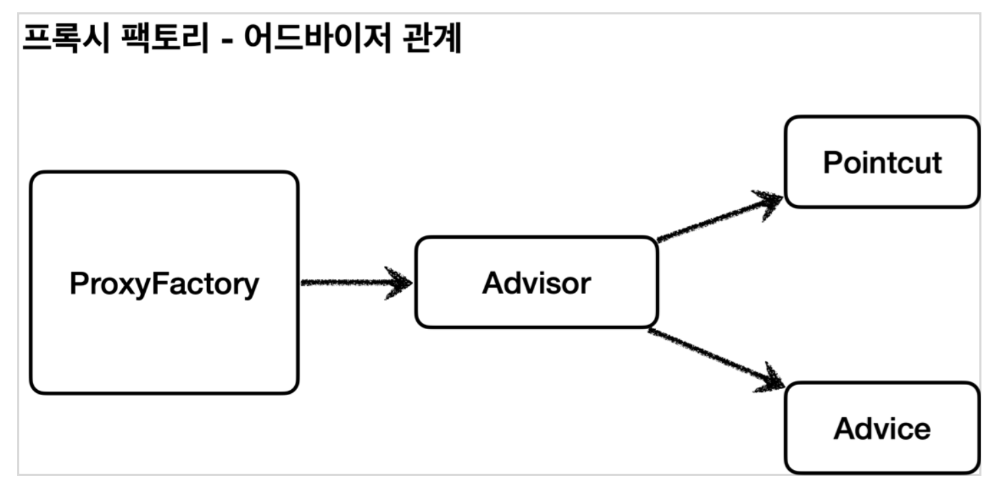<br>

**실행 결과**

```
#save() 호출
TimeAdvice - TimeProxy 실행
ServiceImpl - save 호출
TimeAdvice - TimeProxy 종료 resultTime=0ms

#find() 호출
TimeAdvice - TimeProxy 실행
ServiceImpl - find 호출
TimeAdvice - TimeProxy 종료 resultTime=1ms
```

실행 결과를 보면 `save()`, `find()`각각 모두 어드바이스가 적용된 것을 확인할 수 있다.

## 예제 코드 2 - 직접 만든 포인트컷

이번에는 `save()`메서드에는 어드바이스 로직을 적용하지만, `find()`메서드에는 어드바이스 로직을 적용하지 않도록 해보자.<br>물론 과거에 했던 코드와 유사하게 어드바이스에 로직을 추가해서 메서드 이름을 보고 코드를 실행할지 말지 분기를 타도 된다. 하지만 이런 기능에 특화되어서 제공되는 것이 바로 포인트컷이다.

이번에는 해당 요구사항을 만족하도록 포인트컷을 직접 구현해보자.

**Pointcut 관련 인터페이스 - 스프링 제공**

```java
public interface Pointcut {
    ClassFilter getClassFilter();
    MethodMatcher getMethodMatcher();
}

public interface ClassFilter {
    boolean matches(Class<?> clazz);
}

public interface MethodMatcher {
    boolean matches(Method method, Class<?> targetClass);
    //..
}
```

포인트컷은 크게 `ClassFilter`와 `MethodMatcher`둘로 이루어진다. 이름 그대로 하나는 클래스가 맞는지, 하나는 메서드가 맞는지 확인할 때 사용한다. 둘다 `true`로 반환해야 어드바이스를 적용할 수 있다.

일반적으로 스프링이 이미 만들어둔 구현체를 사용하지만 개념 학습 차원에서 간단히 직접 구현해보자.

**AdvisorTest - advisorTest2() 추가**

```java
@Test
@DisplayName("직접 만든 포인트컷")
void advisorTest2() {
    ServiceImpl target = new ServiceImpl();
    ProxyFactory proxyFactory = new ProxyFactory(target);
    DefaultPointcutAdvisor advisor = new DefaultPointcutAdvisor(new MyPointcut(), new TimeAdvice());
    proxyFactory.addAdvisor(advisor);
    ServiceInterface proxy = (ServiceInterface) proxyFactory.getProxy();

    proxy.save();
    proxy.find();
}

static class MyPointcut implements Pointcut {
    @Override
    public ClassFilter getClassFilter() {
        return ClassFilter.TRUE;
    }

    @Override
    public MethodMatcher getMethodMatcher() {
        return new MyMethodMatcher();
    }
}

static class MyMethodMatcher implements MethodMatcher {

    private String matchName = "save";

    @Override
    public boolean matches(Method method, Class<?> targetClass) {
        boolean result = method.getName().equals(matchName);
        log.info("포인트컷 호출 method={} targetClass={}", method.getName(), targetClass);
        log.info("포인트컷 결과 result={}", result);
        return result;
    }

    @Override
    public boolean isRuntime() {
        return false;
    }

    @Override
    public boolean matches(Method method, Class<?> targetClass, Object... args) {
        throw new UnsupportedOperationException();
    }
}
```

**MyPointcut**<br>
- 직접 구현한 포인트컷이다. `Pointcut`인터페이스를 구현한다.
- 현재 메서드 기준으로 로직을 적용하면 된다. 클래스 필터는 항상 `true`를 반환하도록 했고, 메서드 비교 기능은 `MyMethodMatcher`를 사용한다.

**MyMethodMatcher**<br>
- 직접 구현한 `MethodMatcher`이다. `MethodMatcher` 인터페이스를 구현한다.
- `matchers()`: 이 메서드에 `method`, `targetClass`정보가 넘어온다. 이 정보로 어드바이스를 적용할지 적용하지 않을지 판단할 수 있다.
- 여기서는 메서드 이름이 `"save"`인 경우에 `true`를 반환하도록 판단 로직을 적용했다.
- `isRuntime()`, `matches(... args)`: `isRuntime()`이 값이 참이면 `matches(... args)`메서드가 대신 호출된다. 동적으로 넘어오는 매개변수를 판단 로직으로 사용할 수 있다.
  - `isRuntime()`이 `false`인 경우 클래스의 정적 정보만 사용하기 때문에 스프링이 내부에서 캐싱을 통해 성능 향상이 가능하지만, `isRuntime()`이 `true`인 경우 매개변수가 동적으로 변경된다고 가정하기 때문에 캐싱을 하지 않는다.
  - 크게 중요한 부분은 아니니 참고만 하고 넘어가자.

**new DefaultPointcutAdvisor(new MyPointcut(), new TimeAdvice())**<br>
- 어드바이저에 직접 구현한 포인트컷을 사용한다.

**실행결과**

```
#save() 호출
AdvisorTest - 포인트컷 호출 method=save targetClass=class
hello.proxy.common.service.ServiceImpl
AdvisorTest - 포인트컷 결과 result=true
TimeAdvice - TimeProxy 실행
ServiceImpl - save 호출
TimeAdvice - TimeProxy 종료 resultTime=1ms

#find() 호출
AdvisorTest - 포인트컷 호출 method=find targetClass=class
hello.proxy.common.service.ServiceImpl
AdvisorTest - 포인트컷 결과 result=false
ServiceImpl - find 호출
```

실행 결과를 보면 기대한 것과 같이 `save()`를 호출할때는 어드바이스가 적용되지만, `find()`를 호출할 때는 어드바이스가 적용되지 않는다.

**그림으로 정리**

**save() 호출**

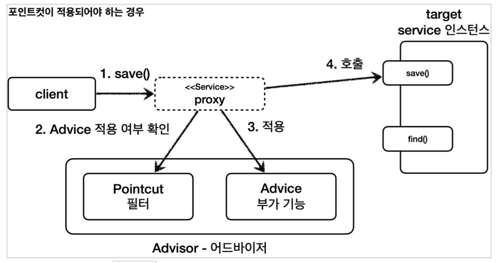<br>

1. 클라이언트가 프록시의 `save()`를 호출한다.
2. 포인트컷에 `Service`클래스의 `save()`메서드에 어드바이스를 적용해도 될지 물어본다.
3. 포인트컷이 `true`를 반환한다. 따라서 어드바이스를 호출해서 부가 기능을 적용한다.
4. 이후 실제 인스턴스의 `save()`를 호출한다.

**find() 호출**

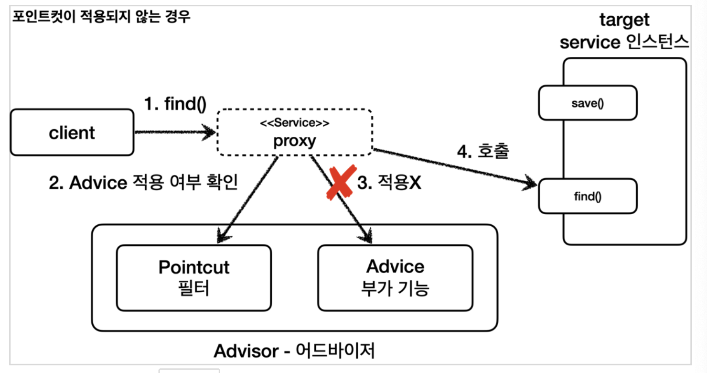<br>

1. 클라이언트가 프록시의 `find()`를 호출한다.
2. 포인트컷에 `Service`클래스의 `find()`메서드에 어드바이스를 적용해도 될지 물어본다.
3. 포인트컷이 `false`를 반환한다. 따라서 어드바이스를 호출하지 않고, 부가 기능도 적용되지 않는다.
4. 실제 인스턴스를 호출한다.

## 예제 코드 3 - 스프링이 제공하는 포인트 컷

스프링은 우리가 필요한 포인트컷을 이미 대부분 제공한다.<br>
이번에는 스프링이 제공하는 `NameMatchMethodPointcut`를 사용해서 구현해보자.

**AdvisorTest - advisorTest3() 추가**

```java
@Test
@DisplayName("스프링이 제공하는 포인트컷")
void advisorTest3() {
    ServiceImpl target = new ServiceImpl();
    ProxyFactory proxyFactory = new ProxyFactory(target);
    NameMatchMethodPointcut pointcut = new NameMatchMethodPointcut();
    pointcut.setMappedNames("save");
    DefaultPointcutAdvisor advisor = new DefaultPointcutAdvisor(pointcut, new TimeAdvice());
    proxyFactory.addAdvisor(advisor);
    ServiceInterface proxy = (ServiceInterface) proxyFactory.getProxy();

    proxy.save();
    proxy.find();
}
```

**NameMatchMethodPointcut 사용코드**

```java
NameMatchMethodPointcut pointcut = new NameMatchMethodPointcut();
pointcut.setMappedNames("save");
```

`NameMatchMethodPointcut`을 생성하고 `setMapperNames(...)`으로 메서드 이름을 지정하면 포인트컷이 완성된다.

**실행 결과**

```
#save() 호출
TimeAdvice - TimeProxy 실행
ServiceImpl - save 호출
TimeAdvice - TimeProxy 종료 resultTime=0ms

#find() 호출
ServiceImpl - find 호출
```

실행 결과를 보면 `save()`를 호출할 때는 어드바이스가 적용되지만, `find()`를 호출할 때는 어드바이스가 적용되지 않는다.

### 스프링이 제공하는 포인트컷

스프링은 무수히 많은 포인트컷을 제공한다.<br>
대표적인 몇가지만 알아보자.

- `NamedMathodPointcut`: 메서드 이름을 기반으로 매칭하낟. 내부에서는 `PatternMatchUtils`를 사용한다.
  - 예) `*xxx*` 허용
- `JdkRegexpMethodPointcut`: JDK 정규 표현식을 기반으로 포인트컷을 매칭한다.
- `TruePointcut`: 항상 참을 반환한다.
- `AnnotationMatchingPointcut`: 애노테이션으로 매칭한다.
- `AspectJExpressionPointcut`: aspectJ표현식으로 매칭한다.

**가장 중요한 것은 aspectJ 표현식**<br>
여기에서 사실 다른 것은 중요하지 않다. 실무에서는 사용하기도 편히라혹 기능도 많은 aspectJ표현식을 기반으로 사용하는 `AspectJExpressionPointcut`을 사용하게 된다.<br>
aspectJ표현식과 사용방법은 중요해서 이후 AOP를 설명할 때 자세히 설명하겠다.<br>
지금은 `Pointcut`의 동작 방식과 전체 구조에 집중하자.

## 예제 코드 4 - 여러 어드바이저 함께 적용

어드바이저는 하나의 포인트컷과 하나의 어드바이스를 가지고 있다.<br>
만약 여러 어드바이저를 하나의 `target`에 적용하려면 어떻게 해야할까?<br>
쉽게 이야기해서 하나의 `target`에 여러 어드바이스를 적용하려면 어떻게 해야할까?

지금 떠오르는 방법은 프록시를 여러개 만들면 될 것 같다. 

**여러 프록시**

**MultiAdvisorTest**

```java
package hello.proxy.advisor;

import hello.proxy.common.service.ServiceImpl;
import hello.proxy.common.service.ServiceInterface;
import lombok.extern.slf4j.Slf4j;
import org.aopalliance.intercept.MethodInterceptor;
import org.aopalliance.intercept.MethodInvocation;
import org.junit.jupiter.api.DisplayName;
import org.junit.jupiter.api.Test;
import org.springframework.aop.Pointcut;
import org.springframework.aop.framework.ProxyFactory;
import org.springframework.aop.support.DefaultPointcutAdvisor;

public class MultiAdvisorTest {

    @Test
    @DisplayName("여러 프록시")
    void multiAdvisorTest1() {
        //client -> proxy2(advisor2) -> proxy1(advisor1) -> target

        //프록시1 생성
        ServiceInterface target = new ServiceImpl();
        ProxyFactory proxyFactory1 = new ProxyFactory(target);
        DefaultPointcutAdvisor advisor1 = new
                DefaultPointcutAdvisor(Pointcut.TRUE, new Advice1());
        proxyFactory1.addAdvisor(advisor1);
        ServiceInterface proxy1 = (ServiceInterface) proxyFactory1.getProxy();

        //프록시2 생성, target -> proxy1 입력
        ProxyFactory proxyFactory2 = new ProxyFactory(proxy1);
        DefaultPointcutAdvisor advisor2 = new
                DefaultPointcutAdvisor(Pointcut.TRUE, new Advice2());
        proxyFactory2.addAdvisor(advisor2);
        ServiceInterface proxy2 = (ServiceInterface) proxyFactory2.getProxy();

        //실행
        proxy2.save();
    }

    @Slf4j
    static class Advice1 implements MethodInterceptor {
        @Override
        public Object invoke(MethodInvocation invocation) throws Throwable {
            log.info("advice1 호출");
            return invocation.proceed();
        }
    }

    @Slf4j
    static class Advice2 implements MethodInterceptor {
        @Override
        public Object invoke(MethodInvocation invocation) throws Throwable {
            log.info("advice2 호출");
            return invocation.proceed();
        }
    }
}
```

이 코드는 런타임에 다음과 같이 동작한다.

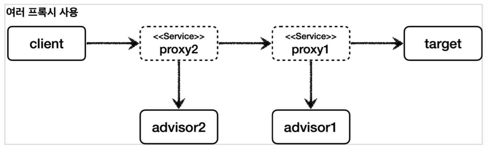<br>

**실행 결과**

```
MultiAdvisorTest$Advice2 - advice2 호출
MultiAdvisorTest$Advice1 - advice1 호출
ServiceImpl - save 호출
```

포인트컷은 `advicor1`, `advisor2`모두 항상 `true`를 반환하도록 설정했다. 따라서 둘다 어드바이스가 적용된다.

**여러 프록시의 문제**<br>
이 방법이 잘못된 것은 아니지만, 프록시를 2번 생성해야 한다는 문제가 있다. 만약 적용해야 하는 어드바이저가 10개라면 10개의 프록시를 생성해야 한다.

**하나의 프록시, 여러 어드바이저**<br>
스프링은 이 문제를 해결하기 위해 하나의 프록시에 여러 어드바이저를 적용할 수 있게 만들어두었다.

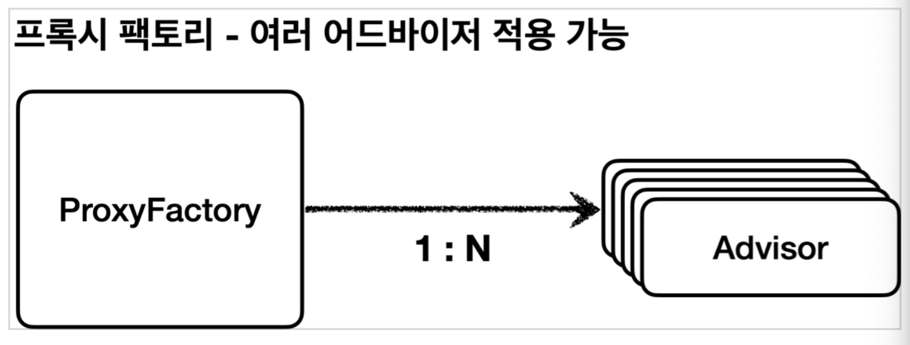<br>

**MultiAdvisorTest - multiAdvisorTest2() 추가**

```java
@Test
@DisplayName("하나의 프록시, 여러 어드바이저")
void multiAdvisorTest2() {
    //proxy -> advisor2 -> advisor1 -> target

    DefaultPointcutAdvisor advisor2 = new
            DefaultPointcutAdvisor(Pointcut.TRUE, new Advice2());
    DefaultPointcutAdvisor advisor1 = new
            DefaultPointcutAdvisor(Pointcut.TRUE, new Advice1());

    ServiceInterface target = new ServiceImpl();
    ProxyFactory proxyFactory1 = new ProxyFactory(target);
    proxyFactory1.addAdvisor(advisor2);
    proxyFactory1.addAdvisor(advisor1);

    ServiceInterface proxy = (ServiceInterface) proxyFactory1.getProxy();

    //실행
    proxy.save();
}
```

- 프록시 팩토리에 원하는 만큼 `addAdvisor()`를 통해서 어드바이저를 등록하면 된다.
- 등록하는 순서대로 `advisor`가 호출된다. 여기서는 `advisor2`, `advisor1`순서로 등록했다.

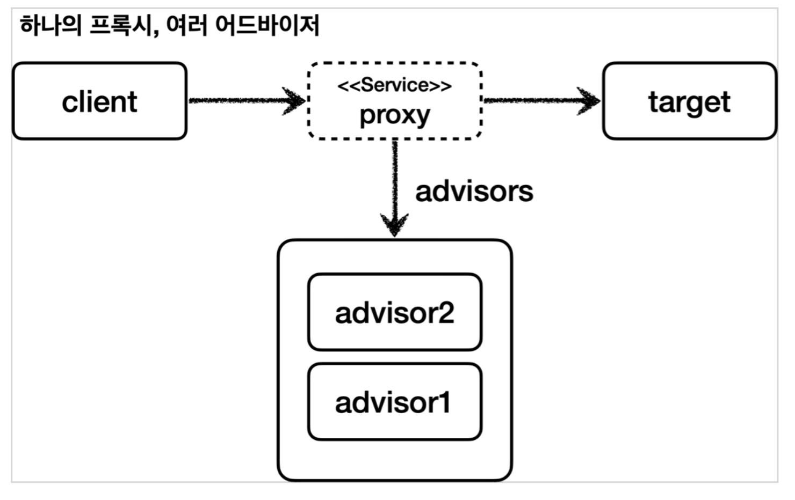<br>

**실행 결과**

```
MultiAdvisorTest$Advice2 - advice2 호출
MultiAdvisorTest$Advice1 - advice1 호출
ServiceImpl - save 호출
```

실행 결과를 보면 `advice2`, `advice1`순서대로 호출된 것을 알 수 있다.

**정리**<br>
결과적으로 여러 프록시를 사용할 때와 비교해서 결과는 같고, 성능은 더 좋다.

> [!IMPORTANT]
> 사실 이번 장을 이렇게 풀어서 설명한 이유가 있다. 스프링의 AOP를 처음 공부하거나 사용하면, AOP 적용 수 만큼 프록시가 생성된다고 착각하게 된다.<br>스프링은 AOP를 적용할 때, 최적화를 진행해서 지금처럼 프록시는 하나만 만들고, 하나의 프록시에 여러 어드바이저를 적용한다.<br>정리하면 하나의 `target`에 여러 AOP가 동시에 적용되어도, 스프링 AOP는 `target`마다 하나의 프록시만 생성한다. 이부분을 꼭 기억해두자.

## 프록시 팩토리 - 적용1

지금까지 학습한 프록시 팩토리를 사용해서 애플리케이션에 프록시를 만들어보자.<br>
먼저 인터페이스가 있는 v1 애플리케이션에 `LogTrace`기능을 프록시 팩토리를 통해서 프록시를 만들어 적용해보자.

먼저 어드바이스를 만들자.

**LogTraceAdvice**

```java
package hello.proxy.config.v3_proxyfactory.advice;

import hello.proxy.trace.TraceStatus;
import hello.proxy.trace.logtrace.LogTrace;
import lombok.extern.slf4j.Slf4j;
import org.aopalliance.intercept.MethodInterceptor;
import org.aopalliance.intercept.MethodInvocation;

import java.lang.reflect.Method;

@Slf4j
public class LogTraceAdvice implements MethodInterceptor {

    private final LogTrace logTrace;

    public LogTraceAdvice(LogTrace logTrace) {
        this.logTrace = logTrace;
    }

    @Override
    public Object invoke(MethodInvocation invocation) throws Throwable {
        TraceStatus status = null;

        try {
            Method method = invocation.getMethod();
            String message = method.getDeclaringClass().getSimpleName() + "."
                    + method.getName() + "()";

            status = logTrace.begin(message);

            //로직 호출
            Object result = invocation.proceed();

            logTrace.end(status);
            return result;
        } catch (Exception e) {
            logTrace.exception(status, e);
            throw e;
        }

    }
}
```

**ProxyFactoryConfigV1**

```java
package hello.proxy.config.v3_proxyfactory;

import hello.proxy.app.v1.*;
import hello.proxy.config.v3_proxyfactory.advice.LogTraceAdvice;
import hello.proxy.trace.logtrace.LogTrace;
import lombok.extern.slf4j.Slf4j;
import org.springframework.aop.Advisor;
import org.springframework.aop.framework.ProxyFactory;
import org.springframework.aop.support.DefaultPointcutAdvisor;
import org.springframework.aop.support.NameMatchMethodPointcut;
import org.springframework.context.annotation.Bean;
import org.springframework.context.annotation.Configuration;

@Slf4j
@Configuration
public class ProxyFactoryConfigV1 {

    @Bean
    public OrderControllerV1 orderControllerV1(LogTrace logTrace) {
        OrderControllerV1 orderController = new
                OrderControllerV1Impl(orderServiceV1(logTrace));

        ProxyFactory factory = new ProxyFactory(orderController);
        factory.addAdvisor(getAdvisor(logTrace));
        OrderControllerV1 proxy = (OrderControllerV1) factory.getProxy();
        log.info("ProxyFactory proxy={}, target={}",
                proxy.getClass(), orderController.getClass());
        return proxy;
    }

    @Bean
    public OrderServiceV1 orderServiceV1(LogTrace logTrace) {
        OrderServiceV1 orderService = new OrderServiceV1Impl(orderRepositoryV1(logTrace));

        ProxyFactory factory = new ProxyFactory(orderService);
        factory.addAdvisor(getAdvisor(logTrace));
        OrderServiceV1 proxy = (OrderServiceV1) factory.getProxy();
        log.info("ProxyFactory proxy={}, target={}",
                proxy.getClass(), orderService.getClass());
        return proxy;
    }

    @Bean
    public OrderRepositoryV1 orderRepositoryV1(LogTrace logTrace) {
        OrderRepositoryV1 orderRepository = new OrderRepositoryV1Impl();

        ProxyFactory factory = new ProxyFactory(orderRepository);
        factory.addAdvisor(getAdvisor(logTrace));
        OrderRepositoryV1 proxy = (OrderRepositoryV1) factory.getProxy();
        log.info("ProxyFactory proxy={}, target={}",
                proxy.getClass(), orderRepository.getClass());
        return proxy;
    }

    private Advisor getAdvisor(LogTrace logTrace) {
        //pointcut
        NameMatchMethodPointcut pointcut = new NameMatchMethodPointcut();
        pointcut.setMappedNames("request*", "order*", "save*");

        //advice
        LogTraceAdvice advice = new LogTraceAdvice(logTrace);

        //advisor = pointcut + advice
        return new DefaultPointcutAdvisor(pointcut, advice);
    }
}
```

- 포인트컷은 `NamedMatchMethodPointcut`을 사용한다. 여기에는 심플 매칭 기능이 있어서 `*`을 매칭할 수 있다.
  - `request*`, `order*`, `save*`: `request`로 시작하는 메서드에 포인트컷은 `true`를 반환한다.
  - 이렇게 설정한 이유는 `noLog()`메서드에는 어드바이스를 적용하지 않기 위해서다.
- 어드바이저는 포인트컷(`NameMatchMethodPointcut`), 어드바이스(`LogTraceAdvice`)를 가지고 있다.
- 프록시 팩토리에 각각의 `target`과 `advisor`를 등록해서 프록시를 생성한다. 그리고 생성된 프록시를 스프링 빈으로 등록한다.

**ProxyApplication**

```java
package hello.proxy;

@Import(ProxyFactoryConfigV1.class)
@SpringBootApplication(scanBasePackages = "hello.proxy.app") //주의
public class ProxyApplication {

	public static void main(String[] args) {
		SpringApplication.run(ProxyApplication.class, args);
	}

	@Bean
	public LogTrace logTrace() {
		return new ThreadLocalLogTrace();
	}

}
```

프록시 팩토리를 통한 `ProxyFactoryConfigV1`설정을 등로갛고 실행하자.

**애프리케이션 로딩 로그**

```
ProxyFactory proxy=class jdk.proxy2.$Proxy51, target=class hello.proxy.app.v1.OrderRepositoryV1Impl
ProxyFactory proxy=class jdk.proxy2.$Proxy53, target=class hello.proxy.app.v1.OrderServiceV1Impl
ProxyFactory proxy=class jdk.proxy2.$Proxy54, target=class hello.proxy.app.v1.OrderControllerV1Impl
```

v1 애플리케이션은 인터페이스가 있기 때문에 프록시 팩토리가 JDK 동적 프록시를 적용한다.<br>
애플리케이션 로딩 로그를 통해서 JDK 동적 프록시가 적용된 것을 확인할 수 있다.

**실행 로그**

http://localhost:8080/v1/request?itemId=hello

```
[6d1f77e6] OrderControllerV1.request()
[6d1f77e6] |-->OrderServiceV1.orderItem()
[6d1f77e6] |   |-->OrderRepositoryV1.save()
[6d1f77e6] |   |<--OrderRepositoryV1.save() time=1002ms
[6d1f77e6] |<--OrderServiceV1.orderItem() time=1006ms
[6d1f77e6] OrderControllerV1.request() time=1016ms
```

## 프록시 팩토리 - 적용2

이번에는 인터페이스가 없고, 구체 클래스만 있는 v2 애플리케이션에 `LogTrace`기능을 프록시 팩토리를 통해서 프록시를 만들어 적용해보자.

```java
package hello.proxy.config.v3_proxyfactory;

import hello.proxy.app.v2.OrderControllerV2;
import hello.proxy.app.v2.OrderRepositoryV2;
import hello.proxy.app.v2.OrderServiceV2;
import hello.proxy.config.v3_proxyfactory.advice.LogTraceAdvice;
import hello.proxy.trace.logtrace.LogTrace;
import lombok.extern.slf4j.Slf4j;
import org.springframework.aop.Advisor;
import org.springframework.aop.framework.ProxyFactory;
import org.springframework.aop.support.DefaultPointcutAdvisor;
import org.springframework.aop.support.NameMatchMethodPointcut;
import org.springframework.context.annotation.Bean;
import org.springframework.context.annotation.Configuration;

@Slf4j
@Configuration
public class ProxyFactoryConfigV2 {

    @Bean
    public OrderControllerV2 orderControllerV2(LogTrace logTrace) {
        OrderControllerV2 orderController = new OrderControllerV2(orderServiceV2(logTrace));

        ProxyFactory factory = new ProxyFactory(orderController);
        factory.addAdvisor(getAdvisor(logTrace));
        OrderControllerV2 proxy = (OrderControllerV2) factory.getProxy();
        log.info("ProxyFactory proxy={}, target={}",
                proxy.getClass(), orderController.getClass());
        return proxy;
    }

    @Bean
    public OrderServiceV2 orderServiceV2(LogTrace logTrace) {
        OrderServiceV2 orderService = new OrderServiceV2(orderRepositoryV2(logTrace));

        ProxyFactory factory = new ProxyFactory(orderService);
        factory.addAdvisor(getAdvisor(logTrace));
        OrderServiceV2 proxy = (OrderServiceV2) factory.getProxy();
        log.info("ProxyFactory proxy={}, target={}",
                proxy.getClass(), orderService.getClass());
        return proxy;
    }

    @Bean
    public OrderRepositoryV2 orderRepositoryV2(LogTrace logTrace) {
        OrderRepositoryV2 orderRepository = new OrderRepositoryV2();

        ProxyFactory factory = new ProxyFactory(orderRepository);
        factory.addAdvisor(getAdvisor(logTrace));
        OrderRepositoryV2 proxy = (OrderRepositoryV2) factory.getProxy();
        log.info("ProxyFactory proxy={}, target={}",
                proxy.getClass(), orderRepository.getClass());
        return proxy;
    }

    private Advisor getAdvisor(LogTrace logTrace) {
        //pointcut
        NameMatchMethodPointcut pointcut = new NameMatchMethodPointcut();
        pointcut.setMappedNames("request*", "order*", "save*");
        //advice
        LogTraceAdvice advice = new LogTraceAdvice(logTrace);
        //advisor = pointcut + advice
        return new DefaultPointcutAdvisor(pointcut, advice);
    }
}
```

```java
@Import(ProxyFactoryConfigV2.class)
```

프록시 팩토리를 통한 `ProxyFactoryConfigV2`설정을 등록하고 실행하자.

**애플리케이션 로딩 로그**

```

ProxyFactory proxy=class hello.proxy.app.v2.OrderRepositoryV2$$EnhancerBySpringCGLIB$$31c1b63a, target=class hello.proxy.app.v2.OrderRepositoryV2
ProxyFactory proxy=class hello.proxy.app.v2.OrderServiceV2$$EnhancerBySpringCGLIB$$8611e45d, target=class hello.proxy.app.v2.OrderServiceV2
ProxyFactory proxy=class hello.proxy.app.v2.OrderControllerV2$$EnhancerBySpringCGLIB$$33c8dcf0, target=class hello.proxy.app.v2.OrderControllerV2
```

V2애플리케이션은 인터페이스가 없고 구체 클래스만 있기 때문에 프록시 팩토리가 CGLIB을 적용한다.<br>애프리케이션 로딩 로그를 통해서 CGLIB 프록시가 적용된 것을 확인할 수 있다.

**실행 로그**

http://localhost:8080/v2/request?itemId=hello

```
[6b3e8843] OrderControllerV2.request()
[6b3e8843] |-->OrderServiceV2.orderItem()
[6b3e8843] |   |-->OrderRepositoryV2.save()
[6b3e8843] |   |<--OrderRepositoryV2.save() time=1009ms
[6b3e8843] |<--OrderServiceV2.orderItem() time=1021ms
[6b3e8843] OrderControllerV2.request() time=1036ms
```

## 정리

프록시 팩토리 덕분에 개발자는 매우 편리하게 프록시를 생성할 수 있게 되었다.<br>
추가로 어드바이저, 어드바이스, 포인트컷 이라는 개념 덕분어 **어떤 부가 기능**을 **어디에 적용**할 지 명확하게 이해할 수 있었다.

**남은 문제**<br>
프록시 팩토리와 어드바이저 같은 개념 덕분에 지금까지 고민했던 문제들은 해결되었다. 프록시도 깔끔하게 적용하고 포인트컷으로 어디에 부가 기능을 적용할지도 명확하게 정의할 수 있다. 원본 코드를 전혀 손대지 않고 프록시를 통해 부가 기능도 적용할 수 있었다.<br>
그런데 아직 해결되지 않는 문제가 있다.

**문제1- 너무 많은 설정**<br>
바로 `ProxyFactoryConfigV1`, `ProxyFactoryConfigV2`와 같은 설정 파일이 지나치게 많다는 점이다.예를 들어서 애플리케이션에 스프링 빈이 100개가 있다면 여기에 프록시를 통해 부가 기능을 적용하려면 100개의 동적 프록시 생성 코드를 만들어야 한다! 무수히 많은 설정 파일 때문에 설정 지옥을 경험하게 될 것 이다.<br>최근에는 스프링 빈을 등로가히 귀찬항서 컴포넌트 스캔까지 사용하는데, 이렇게 직접 등록하는 것도 모자라서, 프록시를 적용하는 코드까지 빈 생성 코드에 넣어야 한다.

**문제2 - 컴포넌트 스캔**<br>
애플리케이션 V3처럼 컴포넌트 스캔을 사용하는 경우 지금까지 학습한 방법으로는 프록시 적용이 불가능하다.<br>
왜냐하면 실제 객체를 컴포넌트 스캔으로 스프링 컨테이너에 스프링 빈으로 등록을 다 해버린 상태이기 때문이다.<br>
지금까지 학습한 프록시를 적용하려면, 실제 객체를 스프링 컨테이너에 빈으로 등록하는 것이 아니라 `ProxyFactoryConfigV1`에서 한 것 처럼, 부가 기능이 있는 프록시를 실제 객체 대신 스프링 컨테이너에 빈으로 등록해야 한다.

**두 가지 문제를 한번에 해결하는 방법이 바로 다음에 설명할 빈 후처리기이다.**

# 빈 후처리기

## 빈 후처리기 - 소개

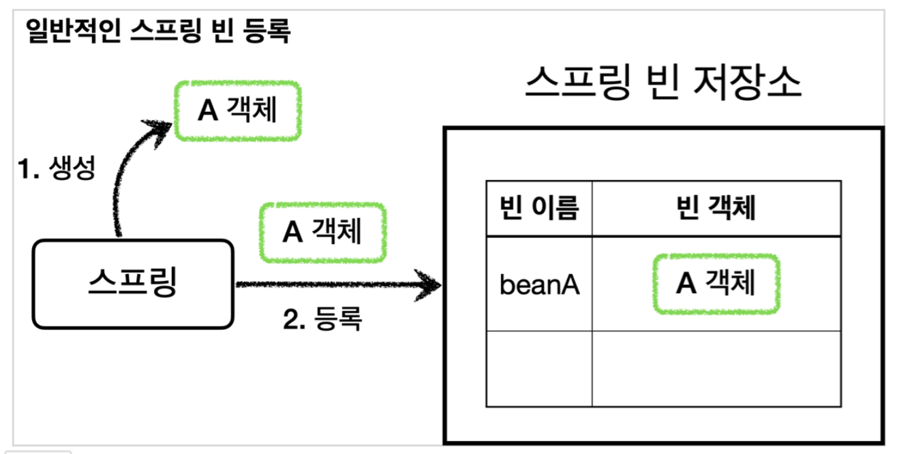<br>

`@Bean`이나 컴포넌트 스캔으로 스프링 빈을 등록하면, 스프링은 대상 객체를 생성하고 스프링 컨테이너 내부의 빈 저장소에 등록한다. 그리고 이후에는 스프링 컨테이너를 통해 등록한 스프링 빈을 조회해서 사용하면 된다.

**빈 후처리기 - BeanPostProcessor**<br>
스프링이 빈 저장소에 등록할 목적으로 생성한 객체를 빈 저장소에 등록하기 직전에 조작하고 싶다면 빈 후처리기를 사용하면 된다.<br>빈 포스트 프로세서(`BeanPostProcessor`)는 번역하면 빈 후처리기인데, 이름 그대로 빈을 생성한 후에 무언가를 처리하는 용도로 사용한다.

**빈 후처리기 기능**<br>
빈 후처리기의 기능은 막강하다.<br>
객체를 조작할 수도 있고, 완전히 다른 객체로 바꿔치기 하는 것도 가능하다.

**빈 후처리기 과정**<br>

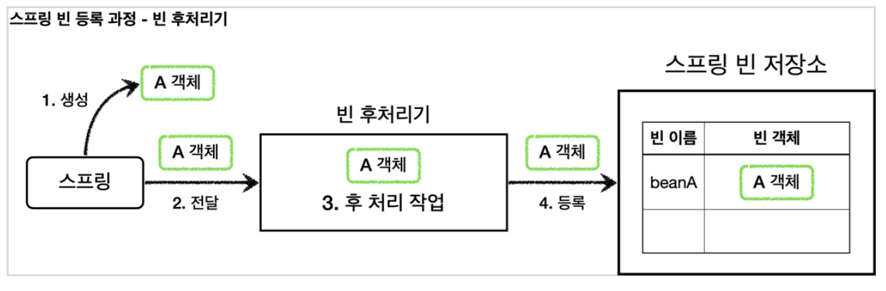<br>

**빈 등록 과정을 빈 후처리기와 함께 살펴보자**<br>
1. **생성**: 스프링 빈 대상이 되는 객체를 생성한다.
2. **전달**: 생성된 객체를 빈 저장소에 등록하기 직전에 빈 후처리기에 전달한다.
3. **후 처리 작업**: 빈 후처리기는 전달된 스프링 빈 객체를 조작하거나 다른 객체로 바꿔치기 할 수 있다.
4. **등록**: 빈 후처리기는 빈을 반환한다. 전달 된 빈을 그대로 반환하면 해당 빈이 등록되고, 바꿔치기 하면 다른 객체가 빈 저장소에 등록된다.

**다른 객체로 바꿔치는 빈 후처리기**

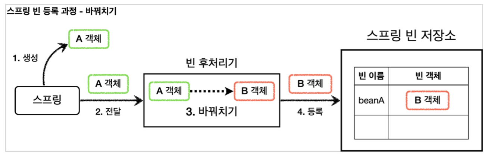<br>

## 빈 후처리기 - 예제 코드 1

일반적인 스프링 빈 등록 과정

빈 후처리기를 학습하기 전에 먼저 일반적인 스프링 빈 등록 과정을 코드로 작성해보자.

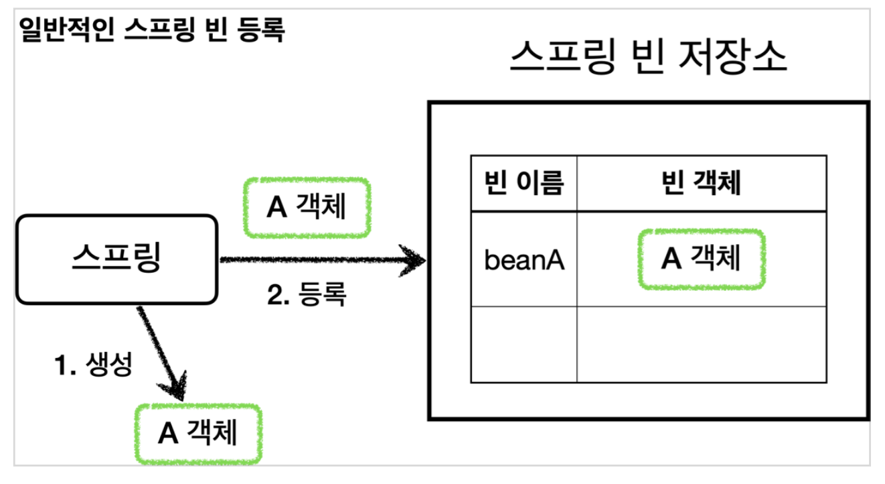<br>

**BasicTest**

```java
package hello.proxy.postprocessor;

import lombok.extern.slf4j.Slf4j;
import org.junit.jupiter.api.Assertions;
import org.junit.jupiter.api.Test;
import org.springframework.beans.factory.NoSuchBeanDefinitionException;
import org.springframework.context.ApplicationContext;
import org.springframework.context.annotation.AnnotationConfigApplicationContext;
import org.springframework.context.annotation.Bean;
import org.springframework.context.annotation.Configuration;

public class BasicTest {

    @Test
    void basicConfig() {
        ApplicationContext applicationContext = new
                AnnotationConfigApplicationContext(BasicConfig.class);

        //A는 빈으로 등록된다.
        A a = applicationContext.getBean("beanA", A.class);
        a.helloA();

        //B는 빈으로 등록되지 않는다.
        Assertions.assertThrows(NoSuchBeanDefinitionException.class,
                () -> applicationContext.getBean(B.class));
    }

    @Slf4j
    @Configuration
    static class BasicConfig {
        @Bean(name = "beanA")
        public A a() {
            return new A();
        }
    }

    @Slf4j
    static class A {
        public void helloA() {
            log.info("hello A");
        }
    }

    @Slf4j
    static class B {
        public void helloB() {
            log.info("hello B");
        }
    }
}
```

`new AnnotationConfigApplicationContext(BasicConfig.class)`<br>
스프링 컨테이너를 생성하면서 `BasicConfig.class`를 넘겨주었다. `BasicConfig.class`설정 파일은 스프링 빈으로 등록된다.

**등록**

`BasicConfig.class`<br>
```java
@Bean(name = "beanA")
public A a() {
    return new A();
}
```

`beanA`라는 이름으로 `A`객체를 스프링 빈으로 등록했다.

**조회**<br>
`A a = applicationContext.getBean("beanA", A.class)`<br>
`beanA`라는 이름으로 `A`타입의 스프링 빈을 찾을 수 있다.

`applicationContext.getBean(B.class)`<br>
`B`타입의 객체는 스프링 빈으로 등록한 적이 없기 때문에 스프링 컨테이너에서 찾을 수 없다.

## 빈 후처리기 - 예제 코드 2

**빈 후처리기 적용**

이번에는 빈 후처리기를 통해서 A 객체를 B 객체로 바꿔치기 해보자.

<br>

**BeanPostProcessor 인터페이스 - 스프링 제공**

```java
public interface BeanPostProcessor {
    
    @Nullable
    default Object postProcessBeforeInitialization(Object bean, String beanName) throws BeansException {
        return bean;
    }

    @Nullable
    default Object postProcessAfterInitialization(Object bean, String beanName) throws BeansException {
        return bean;
    }
}
```

- 빈 후처리기를 사용하려면 `BeanPostProcessor`인터페이스를 구현하고, 스프링 빈으로 등록하면 된다.
- `postProcessBeforInitizlization`: 객체 생성 이후에 `@Postconstruct`같은 초기화가 발생하기 전에 호출되는 포스트 프로세서이다.
- `postProcessAfterInitialization`: 객체 생성 이후에 `@PostConstruct`같은 초기화가 발생한 다음에 호출되는 포스트 프로세서이다.

**BeanPostProcessorTest**

```java
package hello.proxy.postprocessor;

import lombok.extern.slf4j.Slf4j;
import org.junit.jupiter.api.Assertions;
import org.junit.jupiter.api.Test;
import org.springframework.beans.BeansException;
import org.springframework.beans.factory.NoSuchBeanDefinitionException;
import org.springframework.beans.factory.config.BeanPostProcessor;
import org.springframework.context.ApplicationContext;
import org.springframework.context.annotation.AnnotationConfigApplicationContext;
import org.springframework.context.annotation.Bean;
import org.springframework.context.annotation.Configuration;

public class BeanPostProcessorTest {

    @Test
    void postProcessor() {
        ApplicationContext applicationContext = new
                AnnotationConfigApplicationContext(BeanPostProcessorConfig.class);

        //beanA 이름으로 B 객체가 빈으로 등록된다.
        B b = applicationContext.getBean("beanA", B.class);
        b.helloB();

        //A는 빈으로 등록되지 않는다.
        Assertions.assertThrows(NoSuchBeanDefinitionException.class,
                () -> applicationContext.getBean(A.class));
    }

    @Slf4j
    @Configuration
    static class BeanPostProcessorConfig {
        @Bean(name = "beanA")
        public A a() {
            return new A();
        }

        @Bean
        public AToBPostProcessor helloPostProcessor() {
            return new AToBPostProcessor();
        }
    }

    @Slf4j
    static class A {
        public void helloA() {
            log.info("hello A");
        }
    }

    @Slf4j
    static class B {
        public void helloB() {
            log.info("hello B");
        }
    }

    @Slf4j
    static class AToBPostProcessor implements BeanPostProcessor {

        @Override
        public Object postProcessAfterInitialization(Object bean, String beanName) throws BeansException {
            log.info("beanName={}, bean={}", beanName, bean);
            if (bean instanceof A) {
                return new B();
            }
            return bean;
        }
    }
}
```

**AToBPostProcessor**<br>
- 빈 후처리기이다. 인터페이스인 `BeanPostProcessor`를 구현하고, 스프링 빈으로 등록하면 스프링 컨테이너가 빈 후처리기로 인식하고 동작한다.
- 이 빈 후처리기는 A 객체를 새로운 B 객체로 바꿔치기 한다. 파라미터로 넘어오는 빈(`bean`)객체가 `A`의 인스턴스이면 새로운 `B`객체를 생성해서 반환한다. 여기서 `A`대신에 반환된 값인 `B`가 스프링 컨테이너에 등록된다. 다음 실행결과를 보면 `beanName=beanA`, `bean=A`객체의 인스턴스가 빈 후처리기에 넘어온것을 확인할 수 있다.

**실행 결과**

```
..AToBPostProcessor - beanName=beanA
bean=hello.proxy.postprocessor...A@21362712
..B - hello B
```

`B b = applicationContext.getBean("beanA", B.class)`<br>
실행 결과를 보면 최종적으로 `"beanA"`라는 스프링 빈 이름에 `A`객체 대신에 `B` 객체가 등록된 것을 확인할 수 있다. `A`는 스프링 빈으로 등록조차 되지 않는다.

**정리**<br>
빈 후처리기는 빈을 조작하고 변경할 수 있는 후킹 포인트이다.<br>
이것은 빈 객체를 조작하거나 심지어 다른 객체로 바꾸어 버릴 수 있을 정도로 막강하다.<br>
여기서 조작이라는 것은 해당 객체의 특정 메서드를 호출하는 것을 뜻한다.<br>
일반적으로 스프링 컨테이너가 등록하는, 특히 컴포넌트 스캔의 대상이 되는 빈들은 중간에 조작할 방법이 없는데, 빈 후처리기를 사용하면 개발자가 등록하는 모든 빈을 중간에 조작할 수 있다. 이 말은 **빈 객체를 프록시로 교체**하는 것도 가능하다는 뜻이다.

> [!NOTE]
> **@PostConstruct의 비밀**<br>
> `@PostConstruct`는 스프링 빈 생성 이후에 빈을 초기화 하는 역할을 한다. 그런데 생각해보면 빈의 초기화라는 것이 단순히 `@PostConstruct`애노테이션이 붙은 초기화 메서드를 한번 호출만 하면 된다. 쉽게 이야기해서 생성된 빈을 한번 조작하는 것이다.<br>따라서 빈을 조작하는 행위를 하는 적절한 빈 후처리기가 있으면 될 것 같다.<br>스프링은 `CommonAnnotationBeanPostProcessor`라는 빈 후처리기를 자동으로 등록하는데, 여기에서 `@PostConstruct`애노테이션이 붙은 메서드를 호출한다. 따라서 스프링 스스로도 스프링 내부의 기능을 확장하기 위해 빈 후처리기를 사용한다.

## 빈 후처리기 - 적용

빈 후처리기를 사용해서 실제 객체 대신 프록시를 스프링 빈으로 등록해보자.<br>
이렇게 하면 수동으로 등록하는 빈은 물론이고, 컴포넌트 스캔을 사용하는 빈까지 모두 프록시를 적용할 수 있다.<br>
더 나아가서 설정 파일에 있는 수 많은 프록시 생성 코드도 한번에 제거할 수 있다.

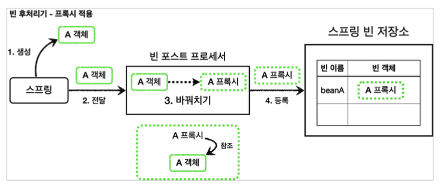<br>

**PackageLogTraceProxyPostProcessor**

```java
package hello.proxy.config.v4_postprocessor.postprocessor;

import lombok.extern.slf4j.Slf4j;
import org.springframework.aop.Advisor;
import org.springframework.aop.framework.ProxyFactory;
import org.springframework.beans.BeansException;
import org.springframework.beans.factory.config.BeanPostProcessor;

@Slf4j
public class PackageLogTraceProxyPostProcessor implements BeanPostProcessor {

    private final String basePackage;
    private final Advisor advisor;

    public PackageLogTraceProxyPostProcessor(String basePackage, Advisor advisor) {
        this.basePackage = basePackage;
        this.advisor = advisor;
    }

    @Override
    public Object postProcessAfterInitialization(Object bean, String beanName) throws BeansException {
        log.info("param beanName={} bean={}", beanName, bean.getClass());

        //프록시 적용 대상 여부 체크
        //프록시 적용 대상이 아니면 원본을 그대로 반환
        String packageName = bean.getClass().getPackageName();
        if (!packageName.startsWith(basePackage)) {
            return bean;
        }

        //프록시 대상이면 프록시를 만들어서 반환
        ProxyFactory proxyFactory = new ProxyFactory(bean);
        proxyFactory.addAdvisor(advisor);

        Object proxy = proxyFactory.getProxy();
        log.info("create proxy: target={} proxy={}",
                bean.getClass(), proxy.getClass());
        return proxy;
    }
}
```

- `PackageLogTraceProxyPostProcessor`는 원본 객체를 프록시 객체로 변환하는 역할을 한다. 이때 프록시 팩토리를 사용하는데, 프록시 팩토리는 `advisor`가 필요하기 때문에 이 부분은 외부에서 주입 받도록 했다.
- 모든 스프링 빈들에 프록시를 적용할 필요가 없다. 여기서는 특정 패키지와 그 하위에 위치한 스프링 빈들만 프록시를 적용한다. 여기서는 `hello.proxy.app`과 관련된 부분에만 적용하면 된다. 다른 패키지의 객체들은 원본 객체를 그대로 반환한다.
- 프록시 적용 대상의 반환 값을 보면 원본 객체 대신에 프록시 객체를 반환한다. 따라서 스프링 컨테이너에 원본 객체 대신에 프록시 객체가 스프링 빈으로 등록된다. 원본 객체는 스프링 빈으로 등록되지 않는다.

**BeanPostProcessorConfig**

```java
package hello.proxy.config.v4_postprocessor;

import hello.proxy.config.AppV1Config;
import hello.proxy.config.AppV2Config;
import hello.proxy.config.v3_proxyfactory.advice.LogTraceAdvice;
import hello.proxy.config.v4_postprocessor.postprocessor.PackageLogTraceProxyPostProcessor;
import hello.proxy.trace.logtrace.LogTrace;
import lombok.extern.slf4j.Slf4j;
import org.springframework.aop.Advisor;
import org.springframework.aop.support.DefaultPointcutAdvisor;
import org.springframework.aop.support.NameMatchMethodPointcut;
import org.springframework.context.annotation.Bean;
import org.springframework.context.annotation.Configuration;
import org.springframework.context.annotation.Import;

@Slf4j
@Configuration
@Import({AppV1Config.class, AppV2Config.class})
public class BeanPostProcessorConfig {

    @Bean
    public PackageLogTraceProxyPostProcessor logTraceProxyPostProcessor(LogTrace logTrace) {
        return new PackageLogTraceProxyPostProcessor("hello.proxy.app", getAdvisor(logTrace));
    }

    private Advisor getAdvisor(LogTrace logTrace) {
        //pointcut
        NameMatchMethodPointcut pointcut = new NameMatchMethodPointcut();
        pointcut.setMappedNames("request*", "order*", "save*");
        //advice
        LogTraceAdvice advice = new LogTraceAdvice(logTrace);
        //advisor = pointcut + advice
        return new DefaultPointcutAdvisor(pointcut, advice);
    }
}
```

- `@Import({AppV1Config.class, AppV2Config.class})`: V3는 컴포넌트 스캔으로 자동으로 스프링 빈으로 등록되지만, V1, V2 애플리케이션은 수동으로 스프링 빈으로 등록해야 동작한다. `ProxyApplication`에서 등록해도 되지만 편의상 여기에 등록하자.
- `@Bean logTraceProxyPostProcessor()`: 특정 패키지를 기준으로 프록시를 생성하는 빈 후처리기를 스프링 빈으로 등록한다. 빈 후처리기는 스프링 빈으로만 등록하면 자동으로 동작한다. 여기에 프록시를 적용할 패키지 정보(`hello.proxy.app`)와 어드바이저(`getAdvisor(logTrace)`)를 넘겨준다.
- 이제 **프록시를 생성하는 코드가 설정 파일에는 필요 없다.** 순수한 빈 등록만 고민하면 된다. 프록시를 생성하고 프록시를 스프링 빈으로 등록하는 것은 빈 후처리기가 모두 처리해준다.

**ProxyApplication**

```java
@Import(BeanPostProcessorConfig.class)
@SpringBootApplication(scanBasePackages = "hello.proxy.app") //주의
public class ProxyApplication {

	public static void main(String[] args) {
		SpringApplication.run(ProxyApplication.class, args);
	}

	@Bean
	public LogTrace logTrace() {
		return new ThreadLocalLogTrace();
	}
}
```

`BeanPostProcessorConfig.class`를 등록하자.

**애프릴케이션 로딩 로그**<br>
중요 부분만 남기고 순서를 조정하고 축약했다.

```
#v1 애플리케이션 프록시 생성 - JDK 동적 프록시
create proxy: target=v1.OrderRepositoryV1Impl proxy=class com.sun.proxy.$Proxy50
create proxy: target=v1.OrderServiceV1Impl proxy=class com.sun.proxy.$Proxy51
create proxy: target=v1.OrderControllerV1Impl proxy=class com.sun.proxy.$Proxy52

#v2 애플리케이션 프록시 생성 - CGLIB
create proxy: target=v2.OrderRepositoryV2 proxy=v2.OrderRepositoryV2$$EnhancerBySpringCGLIB$$x4
create proxy: target=v2.OrderServiceV2 proxy=v2.OrderServiceV2$$EnhancerBySpringCGLIB$$x5
create proxy: target=v2.OrderControllerV2 proxy=v2.OrderControllerV2$$EnhancerBySpringCGLIB$$x6

#v3 애플리케이션 프록시 생성 - CGLIB
create proxy: target=v3.OrderRepositoryV3 proxy=3.OrderRepositoryV3$$EnhancerBySpringCGLIB$$x1
create proxy: target=v3.orderServiceV3 proxy=3.OrderServiceV3$$EnhancerBySpringCGLIB$$x2
create proxy: target=v3.orderControllerV3 proxy=3.orderControllerV3$$EnhancerBySpringCGLIB$$x3
```

- 여기서 생략했지만, 실행해보면 스프링 부트가 기본으로 등록하는 수 많은 빈들이 빈 후처리기를 통과하는 것을 확인할 수 있다. 여기에 모두 프록시를 적용하는 것은 올바르지 않다. 꼭 필요한 곳에만 프록시를 적용해야 한다. 여기서는 `basePackage`를 사용해서 v1~v3 애플리케이션 관련 빈들만 프록시 적용 대상이 되도록 했다.
- **v1**: 인터페이스가 있으므로 JDK 동적 프록시가 적용된다.
- **v2**: 구체 클래스만 있으므로 CGLIB 프록시가 적용된다.
- **v3**: 구체 클래스만 있으므로 CGLIB 프록시가 적용된다.

**컴포넌트 스캔에도 적용**<br>
여기서 중요한 포인트는 v1, v2와 같이 수동으로 등록한 빈 뿐만 아니라 컴포넌트 스캔을 통해 등록한 v3빈들도 프록시를 적용할 수 있다는 점이다. 이것은 모두 빈 후처리기 덕분이다.

**실행**
- http://localhost:8080/v1/request?itemId=hello
- http://localhost:8080/v2/request?itemId=hello
- http://localhost:8080/v3/request?itemId=hello

실행해보면 모두 동일한 결과가 나오는 것을 확인할 수 있다.

**프록시 적용 대상 여부 체크**<br>
- 애플리케이션을 실행해서 로그를 확인해보면 알겠지만, 우리가 직접 등록한 스프링 빈들 뿐만 아니라 스프링 부트가 기본으로 등록하는 수 많은 빈들이 빈 후처리기에 넘어온다. 그래서 어떤 빈을 프록시로 만들것인지 기준이 필요하다. 여기서는 간단히 `basePackage`를 사용해서 특정 패키지를 기준으로 해당 패키지와 그 하위 패키지의 빈들을 프록시로 만든다.
- 스프링 부트가 기본으로 제공하는 빈 중에는 프록시 객체를 만들 수 없는 빈들도 있다. 따라서 모든 객체를 프록시로 만들 경우 오류가 발생한다.

## 빈 후처리기 - 정리

이전에 보았던 문제들이 빈 후처리기를 통해서 어떻게 해결되었는지 정리해보자.

**문제1 - 너무 많은 설정**<br>
프록시를 직접 스프링 빈으로 등록하는 `ProxyFactoryConfigV1`, `ProxyFactoryConfigV2`와 같은 설정 파일은 프록시 관련 설정이 자니치게 많다는 문제가 있다.<br>
예를 들어서 애플리케이션에 스프링 빈이 100개가 있다면 여기에 프록시를 통해 부가 기능을 적용하려면 100개의 프록시 설정 코드가 들어가야 한다. 무수히 많은 설정 파일 때문에 설정 지옥을 경험하게 될 것이다.<br>
스프링 빈을 편리하게 등록하려고 컴포넌트 스캔까지 사용하는데, 이렇게 직접 등록하는 것도 모자라서, 프록시를 적용하는 코드까지 빈 생성 코드에 넣어야 했다.

**문제2 - 컴포넌트 스캔**<br>
애플리케이션 V3처럼 컴포넌트 스캔을 사용하는 경우 지금까지 학습한 방법으로는 프록시 적용이 불가능했다.<br>
왜냐하면 컴포넌트 스캔으로 이미 스프링 컨테이너에 실제 객체를 스프링 빈으로 등록을 다 해버린 상태이기 때문이다.<br>
좀 더 풀어서 설명하자면, 지금까지 학습한 방식으로 프록시를 적용하려면, 원본 객체를 스프링 컨테이너에 빈으로 등록하는 것이 아니라 `ProxyFactoryConfigV1`에서 한 것 처럼, 프록시를 원본 객체 대신 스프링 컨테이너에 빈으로 등록해야 한다. 그런데 컴포넌트 스캔을 원본 객체를 스프링 빈으로 자동으로 등록하기 때문에 프록시 적용이 불가능하다.

**문제 해결**<br>
빈 후처리기 덕분에 프록시를 생성하는 부분을 하나로 집중할 수 있다. 그리고 컴포넌트 스캔처럼 스프링이 직접 대상을 빈으로 등록하는 경우에도 중간에 빈 등록 과정을 가로채서 원본 대신에 프록시를 스프링 빈으로 등록할 수 있다.<br>
덕분에 애플리케이션에 수 많은 스프링 빈이 추가되어도 프록시와 관련된 코드는 전혀 변경하지 않아도 된다. 그리고 컴포넌트 스캔을 사용해도 프록시가 모두 적용된다.

**하지만 개발자의 욕심은 끝이 없다.**<br>
스프링은 프록시를 생성하기 위한 빈 후처리기를 이미 만들어서 제공한다.

> [!IMPORTANT]
> 프록시의 적용 대상 여부를 여기서는 간단히 패키지를 기준으로 설정했다. 그런데 잘 생각해보면 포인트컷을 사용하면 더 깔끔할 것 같다.<br>포인트컷은 이미 클래스, 메서드 단위의 필터 기능을 가지고 있기 때문에, 프록시 적용 대상 여부를 정밀하게 설정할 수 있다.<br>참고로 어드바이저는 포인트컷을 가지고 있다. 따라서 어드바이저를 통해 포인트컷을 확인할 수 있다.<br>뒤에 나오겠지만 스프링 AOP는 포인트컷을 사용해서 프록시 적용 대상 여부를 체크한다.
>
> 결과적으로 포인트컷은 다음 두 곳에서 사용된다.<br>
> 1. 프록시 적용 대상 여부를 체크해서 꼭 필요한 곳에서만 프록시를 적용한다.(빈 후처리기 - 자동 프록시 생성)
> 2. 프록시의 어떤 메서드가 호출 되었을 때 어드바이스를 적용할지 판단한다.(프록시 내부)

## 스프링이 제공하는 빈 후처리기1

> [!CAUTION]
> 다음을 꼭 추가해야 한다.

**build.gradle - 추가**

```
implementation 'org.springframework.boot:spring-boot-starter-aop'
```

이 라이브러리를 추가하면 `aspectjweaver`라는 `aspectJ`관련 라이브러리를 등록하고, 스프링 부트가 AOP관련 클래스를 자동으로 스프링 빈에 등록한다. 스프링 부트가 없던 시절에는 `@EnableAspectJAutoProxy`를 직접 사용해야 했는데, 이 부분을 스프링 부트가 자동으로 처리해준다. `aspectJ`는 뒤에서 설명한다. 스프링 부트가 활성화하는 빈은 `AopAutoConfigutarion`을 참고하자.

**자동 프록시 생성기 - AutoProxyCreator**<Br>
- 앞서 이야기한 스프링 부트 자동 설정으로 `AnnotationAwareAspectJAutoProxyCreator`라는 빈 후처리기가 스프링 빈에 자동으로 등록된다.
- 이름 그대로 자동으로 프록시를 생성해주는 빈 후처리기이다.
- 이 빈 후처리기는 스프링 빈으로 등록된 `Advisor`들을 자동으로 찾아서 프록시가 필요한 곳에 자동으로 프록시를 적용해준다.
- `Advisor`안에는 `Pointcut`과 `Advice`가 이미 모두 포함되어 있다. 따라서 `Advisor`만 알고 있으면 그 안에 있는 `Pointcut`으로 어떤 스프링 빈에 프록시를 적용해야 할지 알 수 있다. 그리고 `Advice`로 부가 기능을 적용하면 된다.

> [!TIP]
> `AnnotationAwareAspectJAutoProxyCreator`는 @AspectJ와 관련된 AOP 기능도 자동으로 찾아서 처리해준다.<br>
> `Advisor`는 물론이고, `@Aspect`도 자동으로 인식해서 프록시를 만들고 AOP를 적용해준다. `@Aspect`에 대한 자세한 내용은 뒤에서 설명한다.

**자동 프록시 생성기의 작동 과정 - 그림**

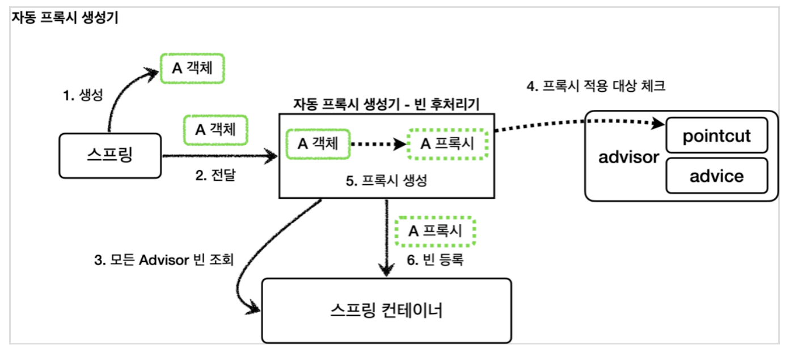<br>

**자동 프록시 생성기의 작동 과정을 알아보자**<br>
1. **생성:** 스프링이 스프링 빈 대상이 되는 객체를 생성한다. (`@Bean`, 컴포넌트 스캔 모두 포함)
2. **전달:** 생성된 객체를 빈 저장소에 등록하기 전에 빈 후처리기에 전달한다.
3. **모든 Advisor 빈 조회:** 자동 프록시 생성기 - 빈 후처리기는 스프링 컨테이너에서 모든 `Advisor`를 조회한다.
4. **프록시 적용 대상 체크:** 앞서 조회한 `Advisor`에 포함되어 있는 포인트컷을 사용해서 해당 객체가 프록시를 적용할 대상인지 아닌지 판단한다. 이때 객체의 클래스 정보는 물론이고, 해당 객체의 모든 메서드를 포인트컷에 하나하나 모두 매칭해본다. 그래서 조건이 하나라도 만족하면 프록시 적용 대상이 된다. 예를 들어서 10개의 메서드 중에 하나만 포인트컷 조건에 만족해도 프록시 적용 대상이 된다.
5. **프록새 생성:** 프록시 적용 대상이면 프록시를 생성하고 반환해서 프록시를 스프링 빈으로 등록한다. 만약 프록시 적용 대상이 아니라면 원본 객체를 반환해서 원본 객체를 스프링 빈으로 등록한다.
6. **빈 등록:** 반환된 객체는 스프링 빈으로 등록된다.

**생성된 프록시**

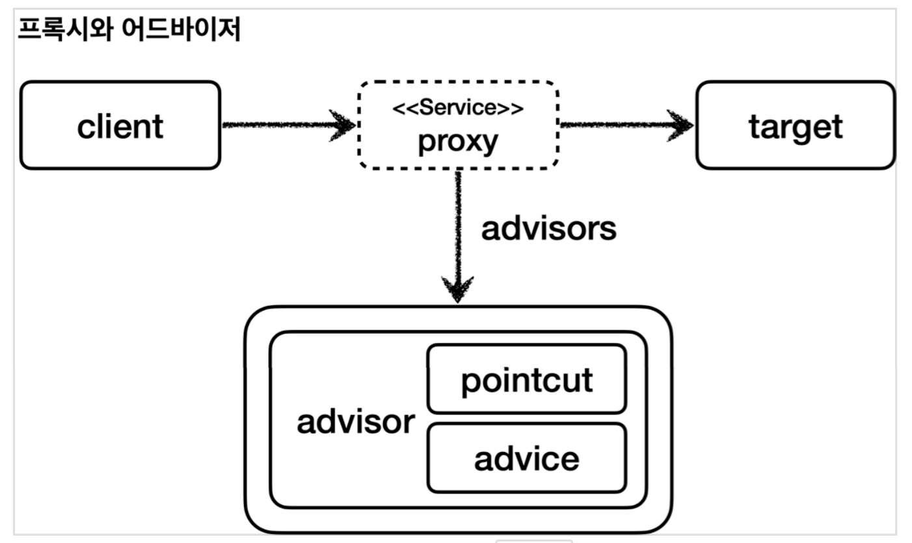<br>

프록시는 내부에서 어드바이저와 실제 호출해야할 대상 객체(`target`)을 알고 있다.

코드를 통해 바로 적용해보자.

**AutoProxyConfig**

```java
package hello.proxy.config.v5_autoproxy;

import hello.proxy.config.AppV1Config;
import hello.proxy.config.AppV2Config;
import hello.proxy.config.v3_proxyfactory.advice.LogTraceAdvice;
import hello.proxy.trace.logtrace.LogTrace;
import org.springframework.aop.Advisor;
import org.springframework.aop.support.DefaultPointcutAdvisor;
import org.springframework.aop.support.NameMatchMethodPointcut;
import org.springframework.context.annotation.Bean;
import org.springframework.context.annotation.Configuration;
import org.springframework.context.annotation.Import;

@Configuration
@Import({AppV1Config.class, AppV2Config.class})
public class AutoProxyConfig {

    @Bean
    public Advisor advisor1(LogTrace logTrace) {
        NameMatchMethodPointcut pointcut = new NameMatchMethodPointcut();
        pointcut.setMappedNames("request*", "order*", "save*");
        LogTraceAdvice advice = new LogTraceAdvice(logTrace);
        //advisor = pointcut + advice
        return new DefaultPointcutAdvisor(pointcut, advice);
    }
}
```

- `AutoProxyConfig`코드를 보면 `advisor1`이라는 어드바이저 하나만 등록했다.
- 빈 후처리기는 이제 등록하지 않아도 된다. 스프링은 자동 프록시 생성기라는 (`AnnotationAwareAspectJAutoProxyCreator`)빈 후처리기를 자동으로 등록해준다.

```java
@Import(AutoProxyConfig.class)
@SpringBootApplication(scanBasePackages = "hello.proxy.app") //주의
public class ProxyApplication {

	public static void main(String[] args) {
		SpringApplication.run(ProxyApplication.class, args);
	}

	@Bean
	public LogTrace logTrace() {
		return new ThreadLocalLogTrace();
	}
}
```

**실행**

- http://localhost:8080/v1/request?itemId=hello
- http://localhost:8080/v2/request?itemId=hello
- http://localhost:8080/v3/request?itemId=hello

실행하면 모두 프록시 적용된 결과가 나오는 것을 확인할 수 있다.

**실행하면 로그가 나오면 안됨**

- http://localhost:8080/v1/no-log

로그가 출력되지 않는 것을 확인할 수 있다.

> [!IMPORTANT]
> 포인트컷은 2가지에 사용된다.

- **1. 프록시 적용 여부 판단 - 생성 단계**
  - 자동 프록시 생성기는 포인트컷을 사용해서 해당 빈이 프록시를 생성할 필요가 있는지 없는지 체크한다.
  - 클래스 + 메서드 조건을 모두 비교한다. 이때 모든 메서드를 체크하는데, 포인트컷 조건에 하나하나 매칭해본다. 만약 조건에 맞는 것이 하나라도 있으면 프록시를 생성한다.
    - 예) `orderControllerV1`은 `request()`m `noLog()`가 있다. 여기에서 `request()`가 조건에 만족하므로 프록시를 생성한다.
  - 만약 조건에 맞는 것이 하나도 없으면 프록시를 생성할 필요가 없으므로 프록시를 생성하지 않는다.
- **2. 어드바이스 적용 여부 판단 - 사용 단계**
  - 프록시가 호출되었을 때 부가 기능인 어드바이스를 적용할지 말지 포인트컷을 보고 판단한다.
  - 앞서 설명한 예에서 `orderControllerV1`은 이미 프록시가 걸려있다.
  - `orderControllerV1`의 `request()`는 현재 포인트컷 조건에 만족하므로 프록시는 어드바이스를 먼저 호출하고, `target`을 호출한다.
  - `orderControllerV1`의 `nolog()`는 현재 포인트컷 조건에 만족하지 않으므로 어드바이스를 호출하지 않고 바로 `target`만 호출한다.

> [!TIP]
> 프록시를 모든 곳에 생성하는 것은 비용 낭비이다. 꼭 필요한 곳에 최소한의 프록시를 적용해야 한다. 그래서 자동 프록시 생성기는 모든 스플이 빈에 프록시를 적용하는 것이 아니라 포인트컷으로 한번 필터링해서 어드바이스가 사용될 가능성이 있는 곳에만 프록시를 생성한다.

## 스프링이 제공하는 빈 후처리기2

**애플리케이션 로딩 로그**

```
EnableWebMvcConfiguration.requestMappingHandlerAdapter()
EnableWebMvcConfiguration.requestMappingHandlerAdapter() time=65ms
```

애플리케이션 서버를 실행해보면, 스프링이 초기화 되면서 기대하지 않은 이러한 로그들이 올라온다. 그 이유는 지금 사용한 포인트컷이 단순히 메서드 이름에 `"request*", "order*", "save*"`만 포함되어 있으면 매칭 된다고 판단하기 때문이다.<br>
결국 스프링이 내부에서 사용하는 빈에도 메서드 이름에 `request`라는 단어만 들어가 있으면 프록시가 만들어지고, 어드바이스도 적용되는 것이다.

결론적으로 패키지에 메서드 이름까지 함께 지정할 수 있는 매우 정밀한 포인트컷이 필요하다.

**AspectJExpressionPointcut**<br>
AspectJ라는 AOP에 특화된 포인트컷 표현식을 적용할 수 있다. AspectJ포인트컷 표현식과 AOP는 조금 뒤에서 자세히 설명하겠다. 지금은 특별한 표현식으로 복잡한 포인트컷을 만들 수 있구나 라고 대략 이해하면 된다.

**AutoProxyConfig - advisor2 추가**

```java
@Bean
public Advisor advisor2(LogTrace logTrace) {
    AspectJExpressionPointcut pointcut = new AspectJExpressionPointcut();
    pointcut.setExpression("execution(* hello.proxy.app..*(..))");
    LogTraceAdvice advice = new LogTraceAdvice(logTrace);
    //advisor = pointcut + advice
    return new DefaultPointcutAdvisor(pointcut, advice);
}
```

> [!CAUTION]
> `advisor1`에 있는 `@Bean`은 꼭 주석처리해주어야 한다. 그렇지 않으면 어드바이저가 중복 등록된다.

- `AspectJexpressionPointcut`: AspectJ 포인트컷 표현식을 적용할 수 있다.
- `execution(* hello.proxy.app..*(..))`: AspectJ가 제공하는 포인트컷 표현식이다. 이후 자세히 설명하겠다. 지금은 간단히 알아보자.
  - `*`: 모든 반환 타입
  - `hello.proxy.app..`: 해당 패키지와 그 하위 타입
  - `*(..)`: `*`모든 메서드 이름, `(..)`파라미터는 상관 없음

쉽게 이야기해서 `hello.proxy.app` 패키지와 그 하위 패키지의 모든 메서드는 포인트컷의 매칭 대상이 된다.

**실행**<br>
- http://localhost:8080/v1/request?itemId=hello
- http://localhost:8080/v2/request?itemId=hello
- http://localhost:8080/v3/request?itemId=hello

실행하면 모두 동일한 결과가 나오는 것을 확인할 수 있다.

**실행하면 로그가 나오면 안됨**
- http://localhost:8080/v1/no-log
그런데 문제는 이 부분에 로그가 출력된다. `advisor2`에서는 단순히 `package`를 기준으로 포인트컷 매칭을 했기 때문이다.

**AutoProxyConfig advisor3 추가**

```java
@Bean
public Advisor advisor3(LogTrace logTrace) {
    AspectJExpressionPointcut pointcut = new AspectJExpressionPointcut();
    pointcut.setExpression("execution(* hello.proxy.app..*(..)) && " +
            "!execution(* hello.proxy.app..noLog(..))");
    LogTraceAdvice advice = new LogTraceAdvice(logTrace);
    //advisor = pointcut + advice
    return new DefaultPointcutAdvisor(pointcut, advice);
}
```

> [!CAUTION]
> `advisor1`, `advisor2`에 있는 `@Bean`은 꼭 주석처리해주어야 한다. 그렇지 않으면 어드바이저가 중복 등록된다.

**표현식을 다음과 같이 수정했다.**

```
execution(* hello.proxy.app..*(..)) && !execution(* hello.proxy.app..noLog(..))
```

- `&&`: 두 조건을 모두 만족해야 함
- `!`: 반대

`hello.proxy.app`패키지와 하위 패키지의 모든 메서드는 포인트컷의 매칭하되, `noLog()`메서드는 제외하라는 뜻이다.

**실행하면 로그가 나오면 안됨**<br>
- http://localhost:8080/v1/no-log

이제 로그가 남지 않는 것을 확인할 수 있다.

> [!TIP]
> AspectJ, AOP는 이후에 자세히 설명한다. 지금은 이런 포인트컷도 있구나 정도 알고 넘어가면 된다.

## 하나의 프록시, 여러 Advisor 적용

예를 들어서 어떤 스프링 빈이 `advisor1`, `advisor2`가 제공하는 포인트컷의 조건을 모두 만족하면 프록시 자동 생성기는 프록시를 몇 개 생성할까?<br>
프록시 자동 생성기는 프록시를 하나만 생성한다. 왜냐하면 프록시 팩토리가 생성하는 프록시는 내부에 여러 `advisor`들을 포함할 수 있기 때문이다. 따라서 프록시를 여러 개 생성해서 비용을 낭비할 이유가 없다.

**프록시 자동 생성기 상황별 정리**<br>
- `advisor1`의 포인트컷만 만족 -> 프록시1개 생성, 프록시에 `advisor1`만 포함
- `advisor1`, `advisor2`의 포인트컷을 모두 만족 -> 프록시 1개 생성, 프록시에 `advisor1`, `advisor2`모두 포함
- `advisor1`, `advisor2`의 포인트컷을 모두 만족하지 않음 -> 프록시가 생성되지 않음

**이후에 설명한 스프링 AOP도 동일한 방식으로 동작한다.**

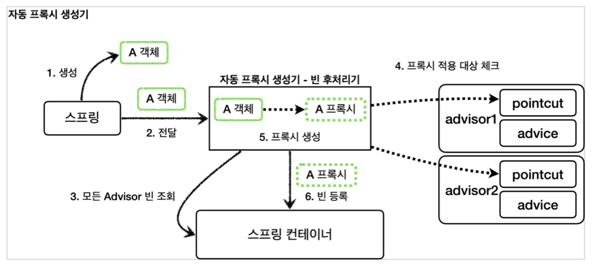<br>

<br>

> [!NOTE]
> 자동 프록시 생성기인 `AnnotationAwareAspectJAutoProxyCreator`덕분에 개발자는 매우 편리하게 프록시를 적용할 수 있다. 이제 `Advisor`만 스프링 빈으로 등록하면 된다.
> <br><br>
> `Advisor` = `Pointcut`+`Adice`
> <br><br>
> 다음 시간에는 `@Aspect`애노테이션을 사용해서 더 편리하게 포인트컷과 어드바이스를 만들고 프록시를 적용해보자.

# @Aspect AOP

## @Aspect 프록시 - 적용

스프링 애플리케이션에 프록시를 적용하려면 포인트컷과 어드바이스로 구성되어 잇는 어드바이저 (`Advisor`)를 만들어서 스프링 빈으로 등록하면 된다. 그러면 나머지는 앞서 배운 자동 프록시 생성기가 모두 자동으로 처리해준다. 자동 프록시 생성기는 스프링 빈으로 등록된 어드바이저들을 찾고, 스프링 빈들에 자동으로 프록시를 적용해준다. (물론 포인트컷이 매칭되는 경우에 프록시를 생성한다.)

스프링은 `@Aspect`애노테이션으로 매우 편리하게 포인트컷과 어드바이스로 구성되어 있는 어드바이저 생성 기능을 지원한다.

지금까지 어드바이저를 직접 만들었던 부분을 `@Aspect`애노테이션을 사용해서 만들어보자.

> [!TIP] `@Aspect`는 관전 지향 프로그래밍(AOP)을 가능하게 하는 AspectJ 프로젝트에서 제공하는 애노테이션이다. 스프링은 이것을 차용해서 프록시를 통한 AOP를 가능하게 한다. AOP와 AspectJ관련된 자세한 내용은 다음에 설명한다. 지금은 프록시에 초점을 맞추자 우선 이 애노테이션을 사용해서 스프링이 편리하게 프록시를 만들어준다고 생각하면 된다.

**LogTraceAspect**

```java
package hello.proxy.config.v6_aop.aspect;

import hello.proxy.trace.TraceStatus;
import hello.proxy.trace.logtrace.LogTrace;
import lombok.extern.slf4j.Slf4j;
import org.aspectj.lang.ProceedingJoinPoint;
import org.aspectj.lang.annotation.Around;
import org.aspectj.lang.annotation.Aspect;

@Slf4j
@Aspect
public class LogTraceAspect {

    private final LogTrace logTrace;

    public LogTraceAspect(LogTrace logTrace) {
        this.logTrace = logTrace;
    }

    @Around("execution(* hello.proxy.app..*(..))")
    public Object execute(ProceedingJoinPoint joinPoint) throws Throwable {
        TraceStatus status = null;

        log.info("target={}", joinPoint.getTarget()); //실제 호출 대상
        log.info("getArgs={}", joinPoint.getArgs()); //전달인자
        log.info("getSignature={}", joinPoint.getSignature()); //join point 시그니처

        try {
            String message = joinPoint.getSignature().toShortString();
            status = logTrace.begin(message);

            //로직 호출
            Object result = joinPoint.proceed();

            logTrace.end(status);
            return result;
        } catch (Exception e) {
            logTrace.exception(status, e);
            throw e;
        }
    }
}
```

- `@Aspect`: 애노테이션 기반 프록시를 적용할 때 필요하다
- `@Around("execution(* hello.proxy.app..*(..))")`
  - `@Around`의 값에 포인트컷 표현식을 넣는다. 표현식은 AspectJ 표현식을 사용한다.
  - `@Around`의 메서드는 어드바이스(`Advice`)가 된다.
  - `ProceedingJoinPoint joinPoint`: 어드바이스에서 살펴본 `MethodInvocation invocation`과 유사한 기능이다. 내부에 실제 호출 대상, 전달 인자, 그리고 어떤 객체와 어떤 메서드가 호출되었는지 정보가 포함되어 있다.
  - `joinPoint.proceed()`: 실제 호출 대상(`target`)을 호출한다.

**AopConfig**

```java
package hello.proxy.config.v6_aop;

import hello.proxy.config.AppV1Config;
import hello.proxy.config.AppV2Config;
import hello.proxy.config.v6_aop.aspect.LogTraceAspect;
import hello.proxy.trace.logtrace.LogTrace;
import org.springframework.context.annotation.Bean;
import org.springframework.context.annotation.Configuration;
import org.springframework.context.annotation.Import;

@Configuration
@Import({AppV1Config.class, AppV2Config.class})
public class AopConfig {

    @Bean
    public LogTraceAspect logTraceAspect(LogTrace logTrace) {
        return new LogTraceAspect(logTrace);
    }
}
```

- `@Import({AppV1Config.class, AppV2Config.class})`: V1, V2 애플리케이션은 수동으로 스프링 빈으로 등록해야 동작한다.
- `@Bean logTraceAspect()`: `@Aspect`가 있어도 스프링 빈으로 등록을 해줘야 한다. 물론 `LogTraceAspect`에 `@Component`애노테이션을 붙여서 컴포넌트 스캔을 사용해서 스프링 빈으로 등록해도 된다.

**ProxyApplication에 추가**

```java
@Import(AopConfig.class)
```

**실행**<br>
- http://localhost:8080/v1/request?itemId=hello
- http://localhost:8080/v2/request?itemId=hello
- http://localhost:8080/v3/request?itemId=hello

실행해보면 모두 프록시가 잘 적용된 것을 확인할 수 있다.

## @Aspect 프록시 - 설명

앞서 자동 프록시 생성기를 학습할 때, 자동 프록시 생성기 (`AnnotationAwareJAutoProxyCreator`)는 `Advisor`를 자동으로 찾아와서 필요한 곳에 프록시를 생성하고 적용해준다고 했다. 자동 프록시 생성기는 여기에 추가로 하나의 역할을 더 하는데, 바로 `@Aspect`를 찾아서 이것을 `Advisor`로 만들어준다. 쉽게 이야기해서 지금까지 학습한 기능에 `@Aspect`를 `Advisor`로 변환해서 저장하는 기능도 하낟. 그래서 이름 앞에 `AnnotationAware`(애노테이션을 인식하는)가 붙어 있는 것이다.

<br>

**자동 프록시 생성기는 2가지 일을 한다.**<br>
1. `@Aspect`를 보고 어드바이저(`Advisor`)로 변환해서 저장한다.
2. 어드바이저를 기반으로 프록시를 생성한다.

<br>

### 1. `@Aspect`를 어드바이저로 변환해서 저장하는 과정

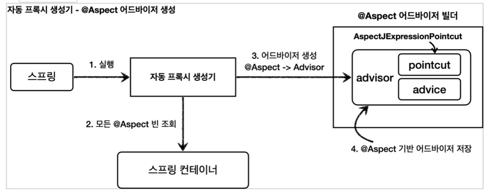<br>

**@Aspect를 어드바이저로 변환해서 저장하는 과정을 알아보자**

1. **실행**: 스프링 애플리케이션 로딩 시점에 자동 프록시 생성기를 호출한다.
2. **모든 @Aspect 빈 조회**: 자동 프록시 생성기는 스프링 컨테이너에서 `@Aspect`애노테이션이 붙은 스프링 빈을 모두 조회한다.
3. **어드바이저 생성**: `@Aspect`어드바이저 빌더를 통해 `@Aspect`애노테이션 정보를 기반으로 어드바이저를 생성한다.
4. **@Aspect 기반 어드바이저 저장**: 생성한 어드바이저를 `@Aspect`어드바이저 빌더 내부에 저장한다.

**@Aspect 어드바이저 빌더**<br>
`BeanFactoryAspectJAdvisorsBuilder`클래스이다. `@Aspect`의 정보를 기반으로 포인트컷, 어드바이스, 어드바이저를 생성하고 보관하는 것을 담당한다. `@Aspect`의 정보를 기반으로 어드바이저를 만들고, @Aspect 어드바이저 빌더 내부 저장소에 캐시한다. 캐시에 어드바이저가 이미 만들어져 있는 경우 캐시에 저장된 어드바이저를 반환한다.

### 2. 어드바이저를 기반으로 프록시 생성

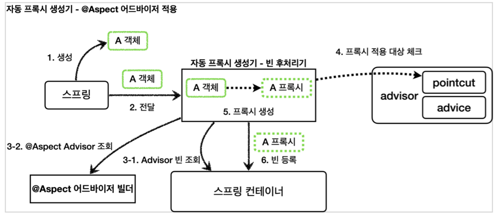<br>

**자동 프록시 생성기의 작동 과정을 알아보자**<br>
**1. 생성**: 스프링 빈 대상이 되는 객체를 생성한다. (`@Bean`, 컴포넌트 스캔 모두 포함)<Br>
**2. 전달**: 생성된 객체를 빈 저장소에 등록하기 직전에 빈 후처리기에 전달한다.<br>
**3-1. Advisor빈 조회**: 스프링 컨테이너에서 `Advisor`빈을 모두 조회한다.<br>
**3-2. @Aspect Advisor조회**: `@Aspect`어드바이저 빌더 내부에 저장된 `Advisor`를 모두 조회한다.<br>
**4. 프록시 적용 대상 체크**: 앞서 3-1, 3-2에서 조회한 `Advisor`에 포함되어 있는 포인트컷을 사용해서 해당 객체가 프록시를 적용할 대상인지 아닌지 판단한다. 이때 객체의 클래스 정보는 물론이고, 해당 객체의 모든 메서드를 포인트컷에 하나하나 모두 매칭해본다. 그래서 조건이 하나라도 만족하면 프록시 적용 대상이 된다. 예를 들어서 메서드 하나만 포인트컷 조건에 만족해도 프록시 적용 대상이 된다.<br>
**5. 프록시 생성**: 프록시 적용 대상이면 프록시를 생성하고 프록시를 반환하다. 그래서 프록시를 스프링 빈으로 등록한다. 만약 프록시 적용 대상이 아니라면 원본 객체를 반화해서 원본 객체를 스프링 빈으로 등록한다.<br>
**6. 빈 등록**: 반환된 객체는 스프링 빈으로 등록된다.

## 정리

`@Aspect`를 사용해서 애노테이션 기반 프록시를 매우 편리하게 적용해보았다. 실무에서 프록시를 적용할때는 대부분이 이 방식을 사용한다.

지금까지 우리가 진행한 애플리케이션 전반에 로그를 남기는 기능은 특정 기능 하나에 관심이 있는 기능이 아니다. 애플리케이션의 여러 기능들 사이에 걸쳐서 들어가는 관심사이다.<br>이것을 바로 **횡단 관심사(cross-cutting concerns)**라고 한다. 지금까지 진행한 방법이 이렇게 여러곳에 걸쳐 잇는 횡단 관심사의 문제를 해결하는 방법이었다.

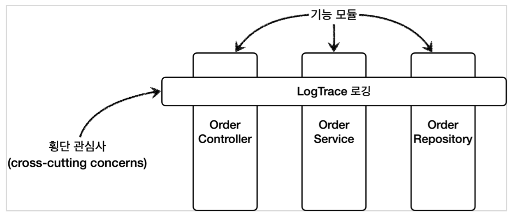<br>

지금까지 프록시를 사용해서 이러한 횡단 관심사를 어떻게 해결하는지 점진적으로 매우 깊이있게 학습하고 기반을 다져두었다.<br>
이제 이 기반을 바탕으로 이러한 횡단 관심사를 전문으로 해결하는 스프링 AOP에 대해 본격적으로 알아보자.

# 스프링 AOP 개념

## AOP소개 - 핵심 기능과 부가 기능

애플리케이션 로직은 크게 **핵심 기능**과 **부가 기능**으로 나눌 수 있다. <br>
- **핵심 기능**은 해당 객체가 제공하는 고유의 기능이다. 예를 들어서 `OrderService`의 핵심 기능은 주문 로직이다.
- **부가 기능**은 핵심 기능을 보조하기 위해 제공하는 기능이다. 예를 들어서 로그 추적 로직, 트랜잭션 기능이 있다. 이러한 부가 기능은 단독으로 사용되지 않고, 핵심 기능과 함께 사용된다. 예를 들어서 로그 추적 기느은 어떤 핵심 기능이 호출되었는지 로그를 남기기 위해 사용된다. 그러니까 부가 기능은 이름 그대로 핵심 기능을 보조하기 위해 존재한다.

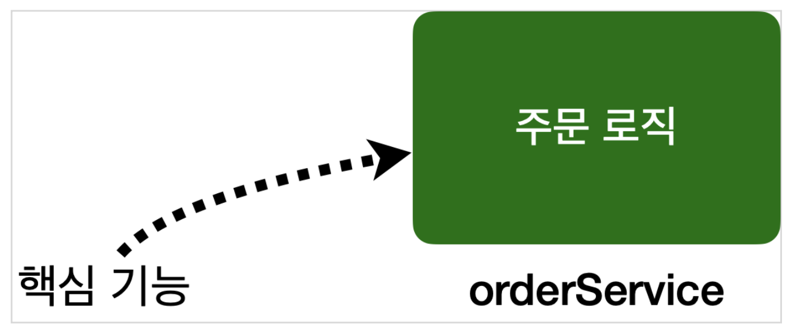<br>

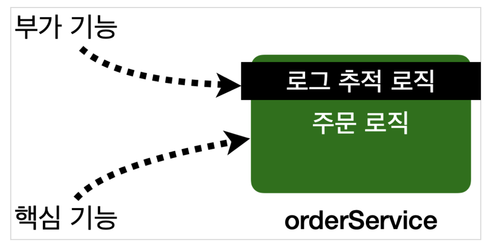<br>

주문 로직을 실행하기 직전에 로그 추적 기능을 사용해야 하면, 핵심 기능인 주문 로직과 부가 기능인 로그 추적 로직이 하나의 객체 안에 섞여 들어가게 된다.

**여러 곳에서 공통으로 사용하는 부가 기능**

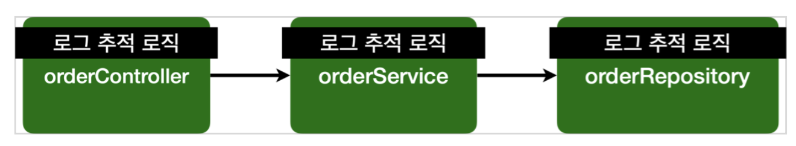<br>

보통 부가 기능은 여러 클래스에 걸쳐서 함께 사용된다. 예를 들어서 모든 애플리케이션 호출을 로깅 해야 하는 요구사항을 생각해보자. 이러한 부가 기능은 횡단 관심사(cross-cutting concerns)가 된다. 쉽게 이야기해서 하나의 부가 기능이 여러 곳에 동일하게 사용된다는 뜻이다.

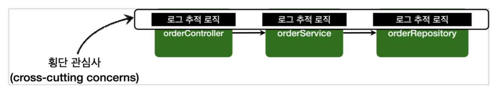<br>

**부가 기능 적용 문제**<br>
그런데 이런 부가 기능을 여러 곳에 적용하려면 너무 번거롭다. 예를 들어서 부가 기능을 적용해야 하는 클래스가 100개면 100개 모두 동일한 코드를 추가해야 한다.<br>
부가 기능을 별도의 유틸리티 클래스로 만든다고 해도, 해당 유틸리티 클래스를 호출하는 코드가 결국 필요하다. 그리고 부가 기능이 구조적으로 단순 호출이 아니라 `try~catch~finally`같은 구조가 필요하다면 더욱 복잡해진다.(예: 실행 시간 측정)<br>
더 큰 문제는 수정이다. 만약 부가 기능에 수정이 발생하면, 100개의 클래스 모두를 하나씩 찾아가면서 수정해야 한다. 여기에 추가로 부가 기능이 적용되는 위치를 변경한다면 어떻게 될까? 예를 들어서 부가 기능을 모든 컨트롤러, 서비스, 리포지토리에 적용했다가, 로그가 너무 많이 남아서 서비스 계층에만 적용한다고 수정해야하면 어떻게 될까? 또 수 많은 코드를 고쳐야 할 것이다.

**부가 기능 적용 문제를 정리하면 다음과 같다.**<br>
- 부가 기능을 적용할 때 아주 많은 반복이 필요하다
- 부가 기능이 여러 곳에 퍼져서 중복 코드를 만들어낸다.
- 부가 기능을 변경할 때 중복 때문에 많은 수정이 필요하다.
- 부가 기능의 적용 대상을 변경할 때 많은 수정이 필요하다.

소프트웨어 개발에서 변경 지점은 하나가 될 수 있도록 잘 모듈화 되어야 한다. 그런데 부가 기능처럼 특정 로직을 애플리케이션 전반에 적용하는 문제는 일반적으로 OOP방식으로는 해결이 어렵다.

## AOP소개 - 애스펙트

**핵심 기능과 부가 기능을 분리**<br>
누군가는 이러한 부가 기능 도입의 문제점들을 해결하기 위해 오랜기간 고민해왔다.<br>
그 결과 부가 기능을 핵심 기능에서 분리하고 한 곳에서 관리하도록 했다. 그리고 해당 부가 기능을 어디에 적용할지 선택하는 기능도 만들었다. 이렇게 부가 기능과 부가 기능을 어디에 적용할지 선택하는 기능을 합해서 하나의 모듈로 만들었는데 이것이 바로 애스펙트(aspect)이다. 애스펙트는 쉽게 이야기해서 부가 기능과, 해당 부가 기능을 어디에 적용할지 정의한 것이다. 예를 들어서 로그 출력 기능을 모든 컨트롤러에 적용해라 라는 것이 정의되어 있다.

그렇다 바로 우리가 이전에 알아본 `@Aspect`바로 그것이다. 그리고 스프링이 제공하는 어드바이저도 어드바이스(부가 기능)과 포인트컷(적용 대상)을 가지고 있어서 개념상 하나의 애스펙트이다.

애스펙트는 우리말로 해석하면 관점이라는 뜻인데, 이름 그대로 애플리케이션을 바라보는 관점을 하나하나의 기능에서 횡단 관심사(cross-cutting concerns)관점으로 달리 보는 것이다.<br>
이렇게 **애스펙트를 사용한 프로그래밍 방식을 관점 지향 프로그래밍 AOP(Aspect-Oriented-Programming)**이라 한다.

**참고로 AOP는 OOP를 대체하기 위한 것이 아니라 횡단 관심사를 깔끔하게 처리하기 어려운 OOP의 부족한 부분을 보조하는 목적으로 개발되었다.**

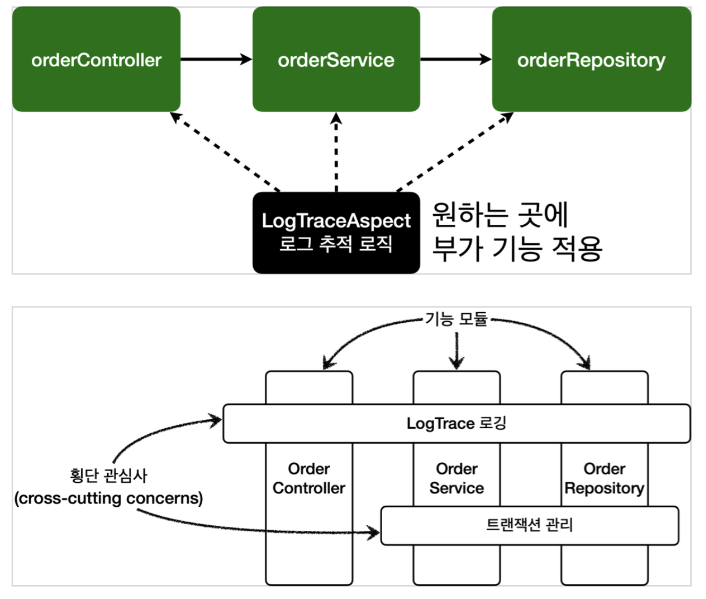<br>

**AspectJ 프레임워크**<br>
AOP의 대표적인 구현으로 AspectJ 프레임워크(https://eclipse.dev/aspectj/)가 있다. 물론 스프링도 AOP를 지원하지만 대부분 AspectJ의 문법을 차용하고, AspectJ가 제공하는 기능의 일부만 제공한다.

AspectJ 프레임워크는 스스로를 다음과 같이 설명한다.<br>
- 자바 프로그래밍 언어에 대한 완벽한 관점 지향 확장
- 횡단 관심사의 깔끔한 모듈화
  - 오류 검사 및 처리
  - 동기화
  - 성능 최적화(캐싱)
  - 모니터링 및 로깅

## AOP 적용 방식

AOP를 사용하면 핵심 기능과 부가 기능이 코드상 완전히 분리되어 관리된다.<br>
그렇다면 AOP를 사용할 때 부가 기능 로직은 어떤 방식으로 실제 로직에 추가될 수 있을까?

**크게 3가지 방법이 있다.**<br>
- 컴파일 시점
- 클래스 로딩 시점
- 런타임 시점(프록시)

### 컴파일 시점

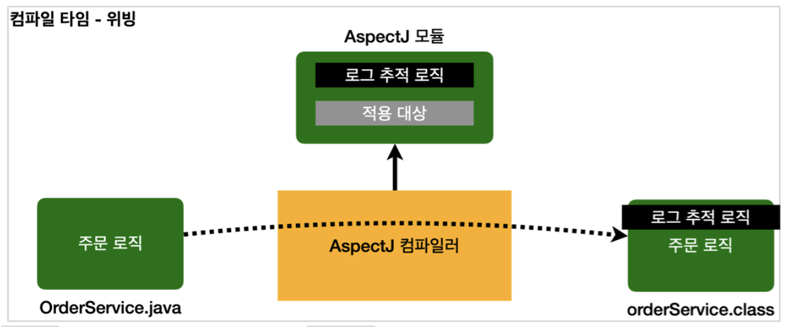<br>

`.java`소스코드를 컴파일러를 사용해서 `.class`를 만드는 시점에 부가 기능 로직을 추가할 수 있다.<br>
이때는 AspectJ가 제공하는 특별한 컴파일러를 사용해야 한다. 컴파일 될 `.class`를 디컴파일 해보면 애스펙트 관련 호출 코드가 들어간다. 이해하기 쉽게 풀어서 이야기하면 부가 기능 코드가 핵심 기능이 있는 컴파일된 코드 주변에 실제로 붙어 버린다고 생각하면 된다. AspectJ 컴파일러는 Aspect를 확인해서 해당 클래스가 적용 대상인지 먼저 확인하고, 적용대상인 경우에 부가 기능 로직을 적용한다.

- 위빙(Weaving): 옷감을 짜다. 직조하다. 애스펙트와 실제 코드를 연결해서 붙이는 것

**컴파일 시점 - 단점**<br>
컴파일 시점에 부가 기능을 적용하면 특별한 컴파일러도 필요하고 복잡하다.

### 클래스 로딩 시점

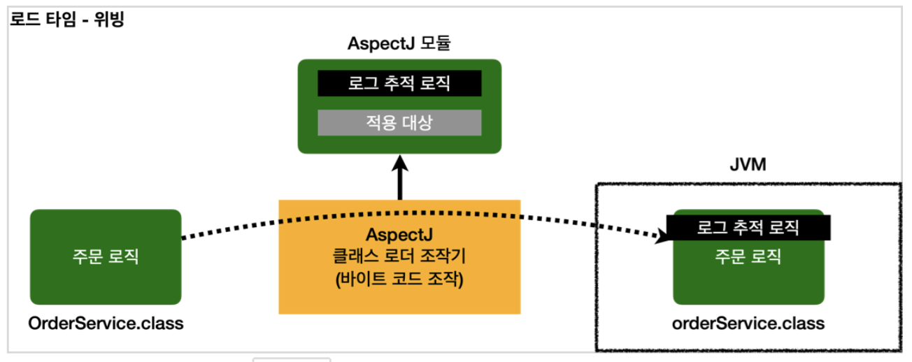<br>

자바를 실행하면 자바 언어는 `.class`파일을 JVM내부의 클래스 로더에 보관한다. 이때 중간에서 `.class`파일을 조작한 다음 JVM에 올릴 수 있다. 자바 언어는 `.class`를 JVM에 저장하기 전에 조작할 수 있는 기능을 제공한다. 참고로 수 많은 모니터링 툴들이 이 방식을 사용한다. 이 시저멩 애스펙트를 적용하는 것을 로드 타입 위빙이라 한다.

**클래스 로딩 시점 - 단점**<br>
로드 타입 위빙은 자바를 실행할 때 특별한 옵션(`java -javaagent`)을 통해 클래스 로더 조작기를 지정해야 하는데, 이 부분이 번거롭고 운영하기 어렵다.

### 런타임 시점

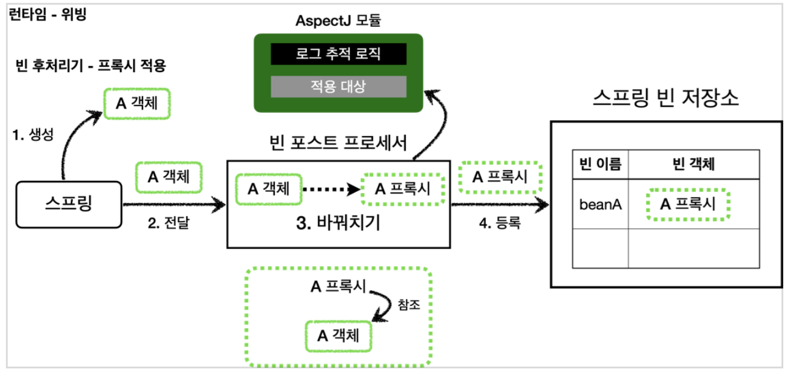<br>

런타임 시점은 컴파일도 다 끝나고, 클래스 로더에 클래스도 다 올라가서 이미 자바가 실행되고 난 다음을 말한다. 자바의 메인(`main`) 메서드가 이미 실행된 다음이다. 따라서 자바 언어가 제공하는 범위 안에서 부가 기능을 적용해야 한다. 스프링과 같은 컨테이너의 도움을 받고 프록시와 DI, 빈 포스트 프로세서 같은 개념들을 총 동원해야 한다. 이렇게 하면 최종적으로 프록시를 통해 스프링 빈에 부가 기능을 적용할 수 있다. 지금까지 학습한 것이 바로 프록시 방식의 AOP이다.

프록시를 사용하기 때문에 AOP 기능에 일부 제약이 있다. 하지만 특별한 컴파일러나, 자바를 실행할 때 복잡한 옵션과 클래스 로더 조작기를 설정하지 않아도 된다. 스프링만 있으면 얼마든지 AOP를 적용할 수 있다.

**부가 기능이 적용되는 차이를 정리하면 다음과 같다.**<br>
- 컴파일 시점: 실제 대상 코드에 애스팩트를 통한 부가 기능 호출 코드가 포함된다. AspectJ를 직접 사용해야 한다.
- 클래스 로딩 시점: 실제 대상 코드에 애스팩트를 통한 부가 기능 호출 코드가 포함된다. AspectJ를 직접 사용해야 한다.
- 런타임 시점: 실제 대상 코드는 그대로 유지된다. 대신에 프록시를 통해 부가 기능이 적용된다. 따라서 항상 프록시를 통해야 부가 기능을 사용할 수 있다. 스프링 AOP는 이 방식을 사용한다.

**AOP 적용 위치**<br>
AOP는 지금까지 학습한 메서드 실행 위치 뿐만 아니라 다음과 같은 다양한 위치에 적용할 수 있다.<br>
- 적용 가능 시점(조인 포인트): 생성자, 필드 값 접근, static 메서드 접근, 메서드 실행
  - 이렇게 AOP를 적용할 수 있는 지점을 포인트(Join point)라 한다.
- AspectJ를 사용해서 컴파일 시점과 클래스 로딩 시점에 적용하는 AOP는 바이트코드를 실제 조작하기 때문에 해당 기능을 모든 지점에 다 적용할 수 있다.
- 프록시 방식을 사용하는 스프링 AOP는 메서드 실행 지점에만 AOP를 적용할 수 있다.
  - 프록시는 메서드 오버라이딩 개념으로 동작한다. 따라서 생성자나 static 메서드, 필드 값 접근에는 프록시 개념이 적용될 수 없다.
  - 프록시를 사용하는 **스프링 AOP의 조인 포인트는 메서드 실행으로 제한**된다.
- 프록시 방식을 사용하는 스프링 AOP는 스프링 컨테이너가 관리할 수 있는 **스프링 빈에만 AOP를 적용**할 수 있다.

> [!TIP]
> 스프링은 AspectJ의 문법을 차용하고 프록시 방식의 AOP를 적용한다. AspectJ를 직접 사용하는 것이 아니다.

> [!IMPORTANT]
> 스프링이 제공하는 AOP는 프록시를 사용한다. 따라서 프록시를 통해 메서드를 실행하는 시점에만 AOP가 적용된다. AspectJ를 사용하면 앞서 설명한 것 처럼 더 복잡하고 더 다양한 기능을 사용할 수 있다.<br>
> 그렇다면 스프링 AOP 보다는 더 기능이 많은 AspectJ를 직접 사용해서 AOP를 적용하는 것이 더 좋지 않을까?<br>
> AspectJ를 사용하려면 공부할 내용도 많고, 자바 관련 설정(특별한 컴파일러, AspectJ 전용 문법, 자바 실행 옵션)도 복잡하다. 반면에 스프링 AOP는 별도의 추가 자바 설정 없이 스프링만 있으면 편리하게 AOP를 사용할 수 있다. 실무에서는 스프링이 제공하는 AOP 기능만 사용해도 대부분의 문제를 해결할 수 있다.<br>
> 따라서 스프링 AOP가 제공하는 기능을 학습하는 것에 집중하자.

## AOP 용어 정리

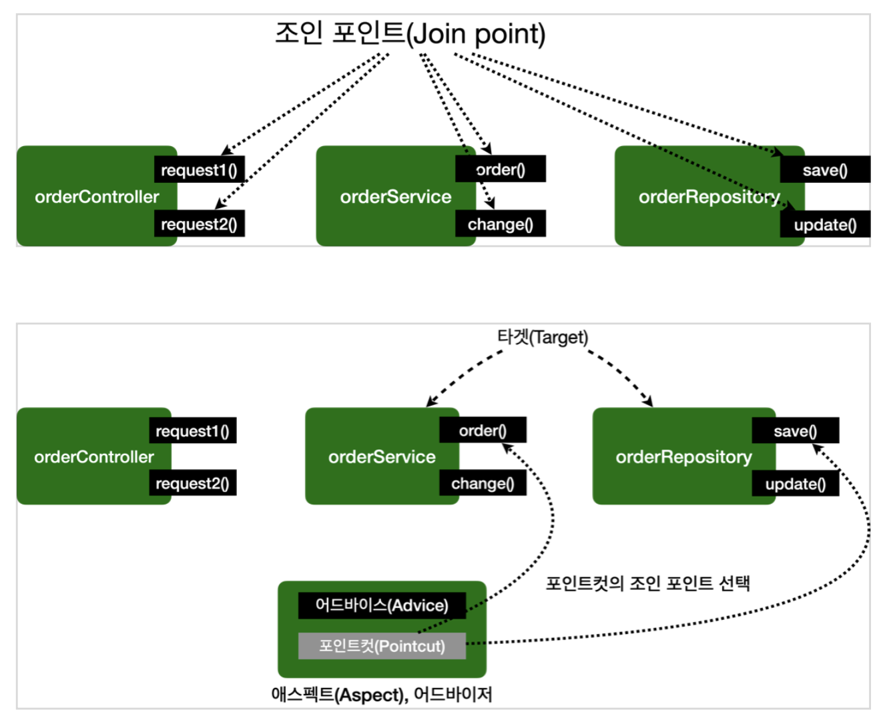<br>

- **조인 포인트(Join point)**
  - 어드바이스가 적용될 수 있는 위치, 메소드 실행, 생성자 호출, 필드 값 접근, static 메서드 접근 같은 프로그램 실행 중 지점
  - 조인 포인트는 추상적인 개념이다. AOP를 적용할 수 있는 모든 지점이라 생각하면 된다.
  - 스프링 AOP는 프록시 방식을 사용하므로 조인 포인트는 항상 메소드 실행 지점으로 제한된다.
- **포인트컷(Pointcut)**
  - 조인 포인트 중에서 어드바이스가 적용될 위치를 선별하는 기능
  - 주로 AspectJ 표현식을 사용해서 지정
  - 프록시를 사용하는 스프링 AOP는 메서드 실행 지점만 포인트컷으로 선별 가능
- **타켓(Target)**
  - 어드바이스를 받는 객체, 포인트컷으로 결정
- **어드바이스(Advice)**
  - 부가 기능
  - 특정 조인 포인트에서 Aspect에 의해 취해지는 조치
  - Around(주변), Before(전), After(후)와 같은 다양한 종류의 어드바이스가 있음
- **에스펙트(Aspect)**
  - 어드바이스 + 포인트컷을 모듈화 한 것
  - `@Aspect`를 생각하면 됨
  - 여러 어드바이스와 포인트 컷이 함께 존재
- **어드바이저(Advisor)**
  - 하나의 어드바이스와 하나의 포인트컷으로 구성
  - 스프링 AOP에서만 사용되는 특별한 용어
- **위빙(Weaving)**
  - 포인트컷으로 결정한 타켓의 조인 포인트에 어드바이스를 적용하는 것
  - 위빙을 통해 핵심 기능 코드에 영향을 주지 않고 부가 기능을 추가 할 수 있음
  - AOP 적용을 위해 애스펙트를 객체에 연결한 상태
    - 컴파일 타임(AspectJ compiler)
    - 로드 타임
    - 런타임, 스프링 AOP는 런타임, 프록시 방식
- **AOP 프록시**
  - AOP 기능을 구현하기 위해 만든 프록시 객체, 스프링에서 AOP 프록시는 JDK 동적 프록시 또는 CGLIB 프록시이다.

# 스프링 AOP 구현

## 프로젝트 생성

- Project Metadata
  - Group: hello
  - Artifact: aop
  - Name: aop
  - Package name: hello.aop
- Dependencies: Lombok

이번에는 스프링 웹 기술은 사용하지 않는다. Lombok만 추가하면 된다. 참고로 스프링 프레임워크의 핵심 모듈들은 별도의 설정이 없어도 자동으로 추가된다. 추가로 AOP 기능을 사용하기 위해서 다음을 `build.gradle`에 직접 추가하자.

```gradle
implementation 'org.springframework.boot:spring-boot-starter-aop'
```

`build.gradle`에 테스트 코드에서도 lombok을 사용할 수 있도록 다음 코드를 추가하자

```gradle
//테스트에서 lombok 사용
testCompileOnly 'org.projectlombok:lombok'
testAnnotationProcessor 'org.projectlombok:lombok'
```

> [!TIP]
> `@Aspect`를 사용하려면 `@EnableAspectJAutoProxy`를 스프링 설정에 추가해야 하지만, 스프링 부트를 사용하면 자동으로 추가된다.

## 예제 프로젝트 만들기

AOP를 적용할 예제 프로젝트를 만들어보자. 지금까지 학습 했던 내용과 비슷해서 큰 어려움은 없을것이다.

**OrderRepository**

```java
package hello.aop.order;

import lombok.extern.slf4j.Slf4j;
import org.springframework.stereotype.Repository;

@Slf4j
@Repository
public class OrderRepository {

    public String save(String itemId) {
        log.info("[orderRepository] 실행");
        //저장 로직
        if (itemId.equals("ex")) {
            throw new IllegalStateException("예외 발생!");
        }
        return "ok";
    }
}
```

**OrderService**

```java
package hello.aop.order;

import lombok.extern.slf4j.Slf4j;
import org.springframework.stereotype.Service;

@Slf4j
@Service
public class OrderService {

    private final OrderRepository orderRepository;

    public OrderService(OrderRepository orderRepository) {
        this.orderRepository = orderRepository;
    }

    public void orderItem(String itemId) {
        log.info("[orderService] 실행");
        orderRepository.save(itemId);
    }
}
```

**AopTest**

```java
package hello.aop;

import hello.aop.order.OrderRepository;
import hello.aop.order.OrderService;
import lombok.extern.slf4j.Slf4j;
import org.assertj.core.api.Assertions;
import org.junit.jupiter.api.Test;
import org.springframework.aop.support.AopUtils;
import org.springframework.beans.factory.annotation.Autowired;
import org.springframework.boot.test.context.SpringBootTest;

@Slf4j
@SpringBootTest
public class AopTest {

    @Autowired
    OrderService orderService;

    @Autowired
    OrderRepository orderRepository;

    @Test
    void aopInfo() {
        log.info("isAopProxy, orderService={}", AopUtils.isAopProxy(orderService));
        log.info("isAopProxy, orderRepository={}", AopUtils.isAopProxy(orderRepository));
    }

    @Test
    void success() {
        orderService.orderItem("itemA");
    }

    @Test
    void exception() {
        Assertions.assertThatThrownBy(() -> orderService.orderItem("ex"))
                .isInstanceOf(IllegalStateException.class);
    }
}
```

`AopUtils.isAopProxy(...)`을 통해서 AOP 프록시가 적용 되었는지 확인할 수 있다. 현재 AOP 관련 코드를 작성하지 않았으므로 프록시가 적용되지 않고, 결과도 `false`를 반환해야 정상이다.

여기서는 실제 결과를 검증하는 테스트가 아니라 학습 테스트를 진행한다. 앞으로 로그를 직접 보면서 AOP가 잘 작동하는지 확인해볼 것이다. 테스트를 실행해서 잘 동작하면 다음으로 넘어가자.

**실행 - success()**

```
[orderService] 실행
[orderRepository] 실행
```

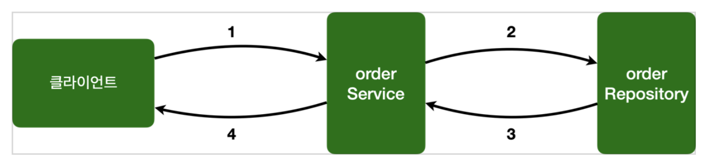<br>

## 스프링 AOP 구현1 - 시작

스프링 AOP를 구현하는 일반적인 방법은 앞서 학습한 `@Aspect`를 사용하는 방법이다.<br>
이번에는 `@Aspect`를 사용해서 가장 단순한 AOP를 구현해보자.

**AspectV1**

```java
package hello.aop.order.aop;

import lombok.extern.slf4j.Slf4j;
import org.aspectj.lang.ProceedingJoinPoint;
import org.aspectj.lang.annotation.Around;
import org.aspectj.lang.annotation.Aspect;

@Slf4j
@Aspect
public class AspectV1 {

    //hello.aop.order 패지지와 하위 패키지
    @Around("execution(* hello.aop.order..*(..))")
    public Object doLog(ProceedingJoinPoint joinPoint) throws Throwable {
        log.info("[log] {}", joinPoint.getSignature()); //join point 시그니처
        return joinPoint.proceed();
    }
}
```

- `@Around`애노테이션의 값인 `execution(* hello.aop.order..*(..))`는 포인트컷이 된다.
- `@Around`애노테이션의 메서드인 `doLog`는 어드바이스(`Advice`)가 된다.
- `execution(* hello.aop.order..*(..))`는 `hello.aop.order`패키지와 그 하위 패키지(`..`)를 지정하는 AspectJ 포인트컷 표현식이다. 앞으로는 간단히 포인트컷 표현식이라 하겠다. 참고로 포인트컷 표현식은 뒤에서 자세히 설명하겠다.
- 이제 `OrderService`, `OrderRepository`의 모든 메서드는 AOP적용 대상이 된다. 참고로 스프링은 프록시 방식의 AOP를 사용하므로 프록시를 통하는 메서드만 적용 대상이 된다.

> [!TIP]
> 스프링 AOP는 AspectJ의 문법을 사용하고, 프록시 방식의 AOP를 제공한다. AspectJ를 직접 사용하는것이 아니다.<br>스프링 AOP를 사용할 때는 `@Aspect`애노테이션을 주로 사용하는데, 이 애노테이션도 AspectJ가 제공하는 애노테이션이다.

> [!TIP]
> `@Aspect`를 포함한 `org.aspectj`패키지 관련 기능은 `aspectjweaver.jar`라이브러리가 제공하는 기능이다. 앞서 `build.gradle`에 `spring-boot-starter-aop`를 포함했는데, 이렇게 하면 스프링의 AOP 관련 기능과 함께 `aspectjweaver.jar`도 함께 사용할 수 있게 의존 관계에 포함된다.<br>그런데 스프링에서 AspectJ가 제공하는 애노테이션이나 관련 인터페이스만 사용하는 것이고, 실제 AspectJ가 제공하는 컴파일, 로드타임 위버 등을 사용하는 것은 아니다. 스프링은 지금까지 학습한것 처럼 프록시 방식의 AOP를 사용한다.

**AopTest - 추가**

```java
package hello.aop;

import hello.aop.order.OrderRepository;
import hello.aop.order.OrderService;
import hello.aop.order.aop.AspectV1;
import lombok.extern.slf4j.Slf4j;
import org.assertj.core.api.Assertions;
import org.junit.jupiter.api.Test;
import org.springframework.aop.support.AopUtils;
import org.springframework.beans.factory.annotation.Autowired;
import org.springframework.boot.test.context.SpringBootTest;
import org.springframework.context.annotation.Import;

@Slf4j
@Import(AspectV1.class) //추가
@SpringBootTest
public class AopTest {

    @Autowired
    OrderService orderService;

    @Autowired
    OrderRepository orderRepository;

    @Test
    void aopInfo() {
        log.info("isAopProxy, orderService={}", AopUtils.isAopProxy(orderService));
        log.info("isAopProxy, orderRepository={}", AopUtils.isAopProxy(orderRepository));
    }

    @Test
    void success() {
        orderService.orderItem("itemA");
    }

    @Test
    void exception() {
        Assertions.assertThatThrownBy(() -> orderService.orderItem("ex"))
                .isInstanceOf(IllegalStateException.class);
    }
}
```

`@Aspect`는 애스펙트라는 표식이지 컴포넌트 스캔이 되는 것은 아니다. 따라서 `AspectV1`를 AOP로 사용하려면 스프링 빈으로 등록해야 한다.

스프링 빈으로 등록하는 방법은 다음과 같다.<br>
- `@Bean`을 사용해서 직접 등록
- `@Component`컴포넌트 스캔을 사용해서 자동 등록
- `@Import` 주로 설정 파일을 추가할 때 사용(`@Configuration`)

`@Import`는 주로 설정 파일을 추가할 때 사용하지만, 이 기능으로 스프링 빈도 등록할 수 있다.<br>
테스트에서는 버전을 올려가면서 변경할 예정이어서 간단하게 `@Import`기능을 사용하자.

`AopTest`에 `@Import(AspectV1.class`)로 스프링 빈을 추가했다.

`AopUtils.isAopProxy(...)`도 프록시가 적용되었으므로 `true`를 반환한다.

**실행 - sucess()**<br>
테스트를 실행해보면 다음과 같이 로그가 잘 출력되는 것을 확인할 수 있다.

```
[log] void hello.aop.order.OrderService.orderItem(String)
[orderService] 실행
[log] String hello.aop.order.OrderRepository.save(String)
[orderRepository] 실행
```

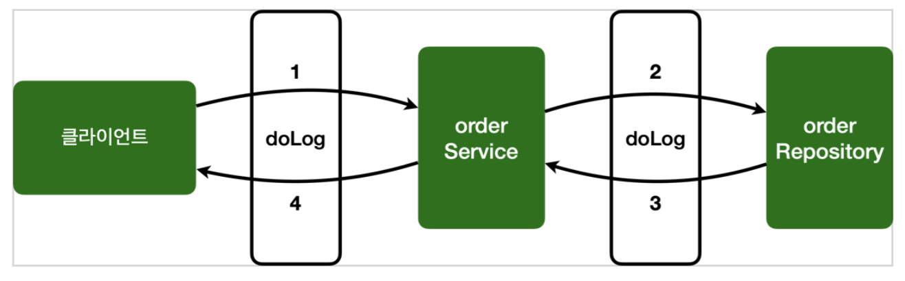<br>

## 스프링 AOP 구현2 - 포인트컷 분리

`@Around`에 포인트컷 표현식을 직접 넣을 수 도 있지만, `@Pointcut`애노테이션을 사용해서 별도로 분리할 수 도 있다.

**AspectV2**

```java
package hello.aop.order.aop;

import lombok.extern.slf4j.Slf4j;
import org.aspectj.lang.ProceedingJoinPoint;
import org.aspectj.lang.annotation.Around;
import org.aspectj.lang.annotation.Aspect;
import org.aspectj.lang.annotation.Pointcut;

@Slf4j
@Aspect
public class AspectV2 {

    //hello.aop.order 패키지와 하위 패키지
    @Pointcut("execution(* hello.aop.order..*(..))") //pointcut expression
    private void allOrder() {
    } //pointcut signature

    @Around("allOrder()")
    public Object doLog(ProceedingJoinPoint joinPoint) throws Throwable {
        log.info("[log] {}", joinPoint.getSignature());
        return joinPoint.proceed();
    }
}
```

**@Pointcut**<br>
- `@Pointcut`에 포인트컷 표현식을 사용한다.
- 메서드 이름과 파라미터를 합쳐서 포인트컷 시그니처(signature)라 한다.
- 메서드의 반환 타입은 `void`여야 한다.
- 코드 내용은 비워둔다.
- 포인트컷 시그니처는 `allOrder()`이다. 이름 그대로 주문과 관련된 모든 기능을 대상으로 하는 포인트컷이다.
- `@Around`어드바이스에서는 포인트컷을 직접 지정해도 되지만, 포인트컷 시그니처를 사용해도 된다. 여기서는 `@Around("allOrder()")`를 사용한다.
- `private`, `public`같은 접근 제어자는 내부에서만 사용하면 `private`을 사용해도 되지만, 다름 애스팩트에서 참고하려면 `publice`을 사용해야 한다.

**AopTest - 수정**

```java
//@Import(AspectV1.class)
@Import(AspectV2.class)
@SpringBootTest
public class AopTest {
}
```

`AspectV2`를 실행하기 위해서 다음 처리를 하자.
- `@Import(AspectV1.class)` 주석처리
- `@Import(AspectV2.class)` 추가

실행해보면 이전과 동일하게 동작하는 것을 확인할 수 있다.

**실행 - success()**<br>
테스트를 실행해보면 다음과 같이 로그가 잘 출력되는 것을 확인할 수 있다.

```
[log] void hello.aop.order.OrderService.orderItem(String)
[orderService] 실행
[log] String hello.aop.order.OrderRepository.save(String)
[orderRepository] 실행
```

## 스프링 AOP 구현3 - 어드바이스 추가

이번에는 조금 복잡한 예제를 만들어보자<br>
앞서 로그를 출력하는 기능에 추가로 트랜잭션을 적용하는 코드도 추가해보자. 여기서는 진짜 트랜잭션을 실행하는 것은 아니다. 기능이 동작한 것 처럼 로그만 남기겠다.

트랜잭션 기능은 보통 다음과 같이 동작한다.<br>
- 핵심 로직 실행 직전에 트랜잭션을 시작
- 핵심 로직 실행
- 핵심 로직 실행에 문제가 없으면 커밋
- 핵심 로직 실행에 예외가 발생하면 롤백

**AspectV3**

```java
package hello.aop.order.aop;

import lombok.extern.slf4j.Slf4j;
import org.aspectj.lang.ProceedingJoinPoint;
import org.aspectj.lang.annotation.Around;
import org.aspectj.lang.annotation.Aspect;
import org.aspectj.lang.annotation.Pointcut;

@Slf4j
@Aspect
public class AspectV3 {

    //hello.aop.order 패키지와 하위 패키지
    @Pointcut("execution(* hello.aop.order..*(..))")
    public void allOrder() {
    }

    //클래스 이름 패턴이 *Service
    @Pointcut("execution(* *..*Service.*(..))")
    private void allService() {}

    @Around("allOrder()")
    public Object doLog(ProceedingJoinPoint joinPoint) throws Throwable {
        log.info("[log] {}", joinPoint.getSignature());
        return joinPoint.proceed();
    }

    //hello.aop.order 패키지와 하위 패키지 이면서 클래스 이름 패턴이 *Service
    @Around("allOrder() && allService()")
    public Object doTransaction(ProceedingJoinPoint joinPoint) throws Throwable {
        try {
            log.info("[트랜잭션 시작] {}", joinPoint.getSignature());
            Object result = joinPoint.proceed();
            log.info("[트랜잭션 커밋] {}", joinPoint.getSignature());
            return result;
        } catch (Throwable e) {
            log.info("[트랜잭션 롤백] {}", joinPoint.getSignature());
            throw e;
        } finally {
            log.info("[리소스 릴리즈] {}", joinPoint.getSignature());
        }
    }
}
```

- `allOrder()` 포인트컷은 `hello.aop.order`패키지와 하위 패키지를 대상으로 한다.
- `allService()` 포인트컷은 타입 이름 패턴이 `*Service`를 대상으로 하는데 쉽게 이야기해서 `XxxService`처럼 `Service`로 끝나는 것을 대상으로 한다. `*Servi*`과 같은 패턴도 가능하다.
- 여기서 타입 이름 패턴이라고 한 이유는 클래스, 인터페이스에 모두 적용되기 때문이다.

`@Around("allOrder() && allService()")`<br>
- 포인트컷은 이렇게 조합할 수 있다. `&&`(AND), `||`(OR), `!`(NOT) 3가지 조합이 가능하다.
- `hello.aop.order`패키지와 하위 패키지 이면서 타입 이름 패턴이 `*Service`인 것을 대상으로 한다.
- 결과적으로 `doTransaction()`어드바이스는 `OrderService`에만 적용된다.
- `doLog()` 어드바이스는 `OrderService`, `OrderRepository`에 모두 적용된다.

**포인트컷이 적용된 AOP결과는 다음과 같다**.<br>
- `orderService`: `doLog()`, `doTransaction()`어드바이스 적용
- `orderReposiroty`: `doLog()` 어드바이스 적용

**AopTest - 수정**

```java
@Import(AspectV3.class)
@SpringBootTest
public class AopTest {
}
```

**실행 - success()**

```

[log] void hello.aop.order.OrderService.orderItem(String)
[트랜잭션 시작] void hello.aop.order.OrderService.orderItem(String)
[orderService] 실행
[log] String hello.aop.order.OrderRepository.save(String)
[orderRepository] 실행
[트랜잭션 커밋] void hello.aop.order.OrderService.orderItem(String)
[리소스 릴리즈] void hello.aop.order.OrderService.orderItem(String)
```

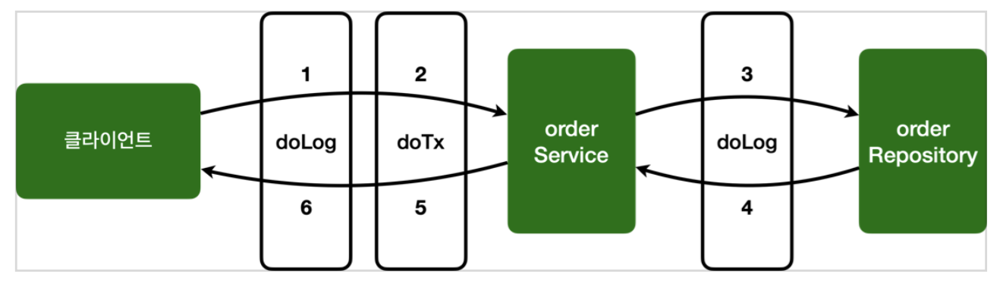<br>

전체 실행 순서를 분석해보자.

**AOP 적용 전**<br>
클라이언트 -> `orderService.orderItem()` -> `orderRepository.save()`

**AOP 적용 후**<br>
- 클라이언트 -> [`doLog()` -> `doTracsaction()`] -> `orderService.orderItem()`
- -> [`doLog()`] -> `orderRepository.save()`

`orderService`에는 `doLog()`, `doTransaction()` 두가지 어드바이스가 적용되어 있고, `orderRepository`에는 `doLog()`하나의 어드바이스만 적용된 것ㅇ르 확인할 수 있다.

**실행 - eeception()**

```
[log] void hello.aop.order.OrderService.orderItem(String)
[트랜잭션 시작] void hello.aop.order.OrderService.orderItem(String)
[orderService] 실행
[log] String hello.aop.order.OrderRepository.save(String)
[orderRepository] 실행
[트랜잭션 롤백] void hello.aop.order.OrderService.orderItem(String)
[리소스 릴리즈] void hello.aop.order.OrderService.orderItem(String)
```

예외 상황에서는 트랜잭션 커밋 대신에 트랜잭션 롤백이 호출되는 것을 확인할 수 있다.

그런데 여기에 로그를 남기는 순서가 [`doLog()` -> `doTracsaction()`] 순서로 작동한다. 만약 어드바이스가 적용되는 순서를 변경하고 싶으면 어떻게 하면 될까? 예를 들어서 실행 시간을 측정해야 하는데 트랜잭션과 관련된 시간을 제외하고 측정하고 싶다면 [`doTracsaction()` -> `doLog()`]이렇게 트랜잭션 이후에 로그를 남겨야 할 것이다.

그 전에 잠깐 포인트컷을 외부로 빼서 사용하는 방법을 먼저 알아보자.

## 스프링 AOP 구현4 - 포인트컷 참조

다음과 같이 포인트컷을 공용으로 사용하기 위해 별도의 외부 클래스에 모아두어도 된다. 참고로 외부에서 호출할 때는 포인트컷의 접근 제어자를 `public`으로 열어두어야 한다.

**Pointcuts**

```java
package hello.aop.order.aop;

import org.aspectj.lang.annotation.Pointcut;

public class Pointcuts {

    //hello.aop.order 패키지와 하위 패키지
    @Pointcut("execution(* hello.aop.order..*(..))")
    public void allOrder() {}

    //타입 패턴이 *Service
    @Pointcut("execution(* *..*Service.*(..))")
    private void allService() {}

    //allOrder && allService
    @Pointcut("allOrder() && allService()")
    public void orderAndService() {}
}
```

`orderAndService()`: `allOrder()`포인트컷와 `allService()`포인트컷을 조합해서 새로운 포인트컷을 만들었다.

**AspectV4Pointcut**

```java
package hello.aop.order.aop;

import lombok.extern.slf4j.Slf4j;
import org.aspectj.lang.ProceedingJoinPoint;
import org.aspectj.lang.annotation.Around;
import org.aspectj.lang.annotation.Aspect;

@Slf4j
@Aspect
public class AspectV4Pointcut {

    @Around("hello.aop.order.aop.Pointcuts.allOrder()")
    public Object doLog(ProceedingJoinPoint joinPoint) throws Throwable {
        log.info("[log] {}", joinPoint.getSignature());
        return joinPoint.proceed();
    }

    @Around("hello.aop.order.aop.Pointcuts.orderAndService()")
    public Object doTransaction(ProceedingJoinPoint joinPoint) throws Throwable {
        try {
            log.info("[트랜잭션 시작] {}", joinPoint.getSignature());
            Object result = joinPoint.proceed();
            log.info("[트랜잭션 커밋] {}", joinPoint.getSignature());
            return result;
        } catch (Throwable e) {
            log.info("[트랜잭션 롤백] {}", joinPoint.getSignature());
            throw e;
        } finally {
            log.info("[리소스 릴리즈] {}", joinPoint.getSignature());
        }
    }
}
```

사용하는 방법은 패키지명을 포함한 클래스 이름과 포인트컷 시그니처를 모두 지정하면 된다.<br>
포인트컷을 여러 어드바이스에서 함께 사용할 때 이 방법을 사용하면 효과적이다.

**AopTest - 수정**

```java
@Import(AspectV4Pointcut.class)
@SpringBootTest
public class AopTest {
}
```

**실행**<br>
기존과 결과는 같다.

## 스프링 AOP 구현5 - 어드바이스 순서

어드바이스는 기본적으로 순서를 보장하지 않는다. 순서를 지정하고 싶으면 `@Aspect`적용 단위로 `org.springframework.core.annotation.@Order`애노테이션을 적용해야 한다. 문제는 이것을 어드바이스 단위가 아니라 클래스 단위로 적용할 수 있다는 점이다. 그래서 지금처럼 하나의 애스펙트에 여러 어드바이스가 있으면 순서를 보장 받을 수 없다. 따라서 **애스펙트를 별도의 클래스로 분리**해야 한다.

로그를 남기는 순서를 바꾸어서 [`doLog()` -> `doTracsaction()`] 트랜잭션이 먼저 처리되고, 이후에 로그가 남도록 변경해보자.

**AspectV5Order**

```java
package hello.aop.order.aop;

import lombok.extern.slf4j.Slf4j;
import org.aspectj.lang.ProceedingJoinPoint;
import org.aspectj.lang.annotation.Around;
import org.aspectj.lang.annotation.Aspect;
import org.springframework.core.annotation.Order;

@Slf4j
public class AspectV5Order {

    @Aspect
    @Order(2)
    public static class LogAspect {
        @Around("hello.aop.order.aop.Pointcuts.allOrder()")
        public Object doLog(ProceedingJoinPoint joinPoint) throws Throwable {
            log.info("[log] {}", joinPoint.getSignature());
            return joinPoint.proceed();
        }
    }

    @Aspect
    @Order(1)
    public static class TxAspect {
        @Around("hello.aop.order.aop.Pointcuts.orderAndService()")
        public Object doTransaction(ProceedingJoinPoint joinPoint) throws Throwable {
            try {
                log.info("[트랜잭션 시작] {}", joinPoint.getSignature());
                Object result = joinPoint.proceed();
                log.info("[트랜잭션 커밋] {}", joinPoint.getSignature());
                return result;
            } catch (Throwable e) {
                log.info("[트랜잭션 롤백] {}", joinPoint.getSignature());
                throw e;
            } finally {
                log.info("[리소스 릴리즈] {}", joinPoint.getSignature());
            }
        }
    }
}
```

하나의 애스펙트 안에 있던 어드바이스를 `LogAspect`, `TxAspect` 애스펙트로 각각 분리했다. 그리고 각 애스펙트에 `@Order` 애노테이션을 통해 실행 순서를 적용했다. 참고로 숫자가 작을 수록 먼저 실행된다.

**Aoptest - 변경**

```java
@Import({AspectV5Order.LogAspect.class, AspectV5Order.TxAspect.class})
@SpringBootTest
public class AopTest {
}
```

**실행**<br>
실행 결과를 보면 트랜잭션 어드바이스가 먼저 실행되는 것을 확인할 수 있다.

```
[트랜잭션 시작] void hello.aop.order.OrderService.orderItem(String)
[log] void hello.aop.order.OrderService.orderItem(String)
[orderService] 실행
[log] String hello.aop.order.OrderRepository.save(String)
[orderRepository] 실행
[트랜잭션 커밋] void hello.aop.order.OrderService.orderItem(String)
[리소스 릴리즈] void hello.aop.order.OrderService.orderItem(String)
```

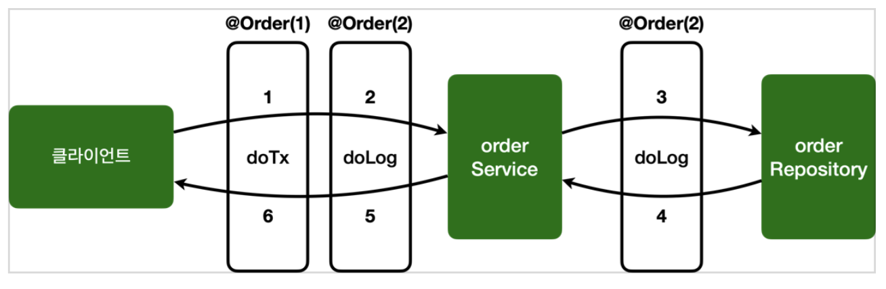<br>

## 스프링 AOP 구현6 - 어드바이스 종류

어드바이스는앞서 살펴본 `@Around`외에도 여러가지 종류가 있다.

**어드바이스 종류**<br>
- `@Around`: 메서드 호출 전후에 수행, 가장 강력한 어드바이스, 조인 포인트 실행 여부 선택, 반환 값 변환, 예외 변환 등이 가능
- `@Before`: 조인 포인트 실행 이전에 실행
- `@AfterReturning`: 조인 포인트가 정상 완료 후 실행
- `@AfterThrowing`: 메서드가 예외를 던지는 경우 실행
- `@After`: 조인 포인트가 정상 또는 예외에 관계없이 실행(finally)

예제를 만들어서 학습해보자.

**AspectV6Advice**

```java
package hello.aop.order.aop;

import lombok.extern.slf4j.Slf4j;
import org.aspectj.lang.JoinPoint;
import org.aspectj.lang.ProceedingJoinPoint;
import org.aspectj.lang.annotation.*;

@Slf4j
@Aspect
public class AspectV6Advice {

    @Around("hello.aop.order.aop.Pointcuts.orderAndService()")
    public Object doTransaction(ProceedingJoinPoint joinPoint) throws Throwable {
        try {
            //@Before
            log.info("[트랜잭션 시작] {}", joinPoint.getSignature());
            Object result = joinPoint.proceed();
            //@AfterReturning
            log.info("[트랜잭션 커밋] {}", joinPoint.getSignature());
            return result;
        } catch (Throwable e) {
            //@AfterThrowing
            log.info("[트랜잭션 롤백] {}", joinPoint.getSignature());
            throw e;
        } finally {
            //@After
            log.info("[리소스 릴리즈] {}", joinPoint.getSignature());
        }
    }

    //@Before: 조인 포인트 실행 이전에 실행
    @Before("hello.aop.order.aop.Pointcuts.orderAndService()")
    public void doBefore(JoinPoint joinPoint) {
        log.info("[before] {}", joinPoint.getSignature());
    }

    // @AfterReturning: 조인 포인트가 정상 완료후 실행
    @AfterReturning(value = "hello.aop.order.aop.Pointcuts.orderAndService()", returning = "result")
    public void doReturn(JoinPoint joinPoint, Object result) {
        log.info("[return] {} return={}", joinPoint.getSignature(), result);
    }

    //@AfterThrowing: 메서드가 예외를 던지는 경우 실행
    @AfterThrowing(value = "hello.aop.order.aop.Pointcuts.orderAndService()", throwing = "ex")
    public void doThrowing(JoinPoint joinPoint, Exception ex) {
        log.info("[ex] {} message={}", joinPoint.getSignature(), ex.getMessage());
    }

    //@After: 조인 포인트가 정상 또는 예외에 관계없이 실행(finally)
    @After(value = "hello.aop.order.aop.Pointcuts.orderAndService()")
    public void doAfter(JoinPoint joinPoint) {
        log.info("[after] {}", joinPoint.getSignature());
    }
}
```

`doTransaction()`메서드에 남겨둔 주석을 보자.<br>
복잡해 보이지만 사실 `@Around`를 제외한 나머지 어드바이스들은 `@Around`가 할 수 있는 일의 일부만 제공할 뿐이다. 따라서 `@Around`어드바이스만 사용해도 필요한 기능을 모두 수행할 수 있다.

### 참고 정보 획득

모든 어드바이스는 `org.aspectj.lang.JoinPorint`를 첫번째 파라미터에 사용할 수 있다. (생략해도 된다.)<br>
단 `@Around`는 `ProceedingJoinPoint`을 사용해야 한다.

참고로 `ProceedingJoinPoint`는 `org.aspectj.lang.JoinPoint`의 하위 타입이다.

**JoinPoint 인터페이스의 주요 기능**<br>
- `getArgs()`: 메서드 인수를 반환합니다.
- `getThis()`: 프록시 객체를 반환합니다.
- `getTarget()`: 대상 객체를 반환합니다.
- `getSignature()`: 조인되는 메서드에 대한 설명을 반환합니다.
- `toString()`: 조인되는 방법에 대한 유용한 설명을 인쇄합니다.

**ProceedingJoinPoint 인터페이스의 주요 기능**<br>
- `proceed()`: 다음 어드바이스나 타겟을 호출한다.

추가로 호출시 전달한 매개변수를 파라미터를 통해서도 전달 받을 수도 있는데, 이 부분은 뒤에서 설명한다.

### 어드바이스 종류

**@Before**<br>
조인 포인트 실행 전

```java
@Before("hello.aop.order.aop.Pointcuts.orderAndService()")
public void doBefore(JoinPoint joinPoint) {
    log.info("[before] {}", joinPoint.getSignature());
}
```

`@Around`와 다르게 작업 흐름을 변경할 수는 없다.<br>
`@Around`는 `ProceedingJoinPoint.proceed()`를 호출해야 다음 대상이 호출된다. 만약 호출하지 않으면 다음 대상이 호출되지 않는다. 반면에 `@Before`는 `ProceedingJoinPoint.proceed()`자체를 사용하지 않는다. 메서드 종료시 자동으로 다음 타켓이 호출된다. 물론 예외가 발생하면 다음 코드가 호출되지는 않는다.

**@AfterReturning**<br>
메서드 실행이 정상적으로 반환될 때 실행

```java
// @AfterReturning: 조인 포인트가 정상 완료후 실행
@AfterReturning(value = "hello.aop.order.aop.Pointcuts.orderAndService()", returning = "result")
public void doReturn(JoinPoint joinPoint, Object result) {
    log.info("[return] {} return={}", joinPoint.getSignature(), result);
}
```

- `returning`속성에 사용된 이름은 어드바이스 메서드의 매개변수 이름과 일치해야 한다.
- `returning`절에 지정된 타입의 값을 반환하는 메서드만 대상으로 실행한다. (부모 타입을 지정하면 모든 자식 타입은 인정된다.)
- `@Around`와 다르게 반환되는 객체를 변경할 수는 없다. 반환 객체를 변경하려면 `@Around`를 사용해야 한다. 참고로 반환 객체를 조작할 수는 있다.

**@AfterThrowing**<br>
메서드 실행이 예외를 던져서 종료될 때 실행

```java
//@AfterThrowing: 메서드가 예외를 던지는 경우 실행
@AfterThrowing(value = "hello.aop.order.aop.Pointcuts.orderAndService()", throwing = "ex")
public void doThrowing(JoinPoint joinPoint, Exception ex) {
    log.info("[ex] {} message={}", joinPoint.getSignature(), ex.getMessage());
}
```

- `throwing`속성에 사용된 이름은 어드바이스 메서드의 매개변수 이름과 일치해야 한다.
- `throwing`절에 지정된 타입과 맞은 예외를 대상으로 실행한다. (부모 타입을 지정하면 모든 자식 타입은 인전된다.)

**@After**<br>
- 메서드 실행이 종료되면 실행딘다. (finally를 생각하면 된다.)
- 정상 및 예외 반환 조건을 모두 처리한다.
- 일반적으로 리소스를 해제하는 데 사용한다.

**@Around**<br>
- 메서드의 실행의 주변에서 실행된다. 메서드 실행 전후에 작업을 수행한다.
- 가장 강력한 어드바이스
  - 조인 포인트 실행 여부 선택 `joinPoint.proceed() 호출 여부 선택`
  - 전달 값 변환: `joinPoint.proceed(args [])`
  - 반환 값 변환
  - 예외 변환
  - 트랜잭션 처럼 `try ~ catch ~ finally`모두 들어가는 구문 처리 가능
- 어드바이스의 첫 번째 파라미터는 `ProceedingJoinPoint`를 사용해야 한다.
- `proceed()`를 통해 대상을 실행한다.
- `proceed()`를 여러번 실행할 수도 있음(재시도)

**AopTest - 변경**

```java
@Import(AspectV6Advice.class)
@SpringBootTest
public class AopTest {
}
```

**실행**

```
[around][트랜잭션 시작] void hello.aop.order.OrderService.orderItem(String)
[before] void hello.aop.order.OrderService.orderItem(String)
[orderService] 실행
[orderRepository] 실행
[return] void hello.aop.order.OrderService.orderItem(String) return=null
[after] void hello.aop.order.OrderService.orderItem(String)
[around][트랜잭션 커밋] void hello.aop.order.OrderService.orderItem(String)
[around][리소스 릴리즈] void hello.aop.order.OrderService.orderItem(String)
```

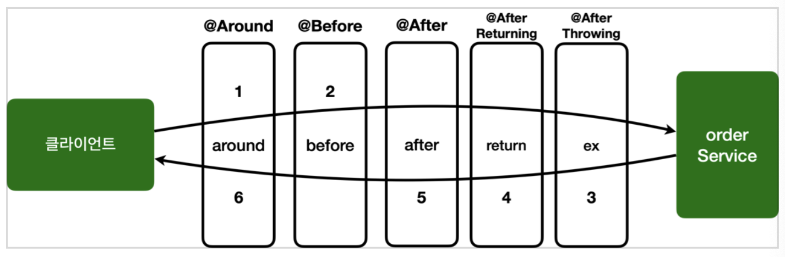<br>

**순서**<br>
- 스프링은 5.2.7 버전부터 동일한 `@Aspect`안에서 동일한 조인포인트의 우선순위를 정했다.
- 실행순서: `@Around`, `@Before`, `@After`, `@AfterReturning`, `@AfterThrowing`
- 어드바이스가 적용되는 순서는 이렇게 적용되지만, 호출 순서와 리턴 순서는 반대라는 점을 알아두자.
- 물론 `@Aspect`안에 동일한 종류의 어드바이스가 2개 있으면 순서가 보장되지 않는다. 이 경우 앞서 배운 것 처럼 `@Aspect`를 분리하고 `@Order`를 적용하자.

**@Around외에 다른 어드바이스가 존재하는 이유**<br>
`@Around`하나만 있어도 모든 기능을 수행할 수 있다. 그런데 다른 어드바이스들이 존재하는 이유는 무엇일까?

다음 코드를 보자

```java
@Around("hello.aop.order.aop.Pointcuts.orderAndService()")
public void doBefore(ProceedingJoinPoint joinPoint) {
    log.info("[before] {}", joinPoint.getSignature());
}
```

이 코드의 문제점을 찾을 수 있겠는가? 이 코드는 타겟을 호출하지 않는 문제가 있다.<br>
이 코드를 개발한 의도는 타겟 실행 전에 로그를 출력하는 것이다. 그런데 `@Around`는 항상 `joinPoint.proceed()`를 호출해야 한다. 만약 실수로 호출하지 않으면 타겟이 호출되지 않는 치명적인 버그가 발생한다.

다음 코드를 보자.<br>
```java
@Before("hello.aop.order.aop.Pointcuts.orderAndService()")
public void doBefore(JoinPoint joinPoint) {
    log.info("[before] {}", joinPoint.getSignature());
}
```

`@Before`는 `joinPoint.proceed()`를 호출하는 고민을 하지 않아도 된다.

`@Around`가 가장 넓은 기능을 제공하는 것은 맞지만, 실수할 가능성이 있다. 반변에 `@Before`, `@After` 같은 어드바이스는 기능은 적지만 실수할 가능성이 낮고, 코드도 단순하다. 그리고 가장 중요한 점이 있는데, 바로 이 코드를 작성한 의도가 명확하게 들어난다는 점이다. `@Before`라는 애노테이션을 보는 순간 "이 코드는 타겟 실행 전에 한정해서 어떤 일을 하는 코드구나" 라는 것이 들어난다.

**좋은 설계는 제약이 있는 것이다.**<br>
좋은 설계는 제약이 있는 것이다. `@Around`만 있으면 되는데 왜? 이렇게 제약을 두는가? 제약은 실수를 미연에 방지한다. 일종에 가이드 역할을 한다. 만약 `@Around`를 사용했는데, 중간에 다른 개발자가 해당 코드를 수정해서 호출하지 않았다면? 큰 장애가 발생했을 것이다. 처음부터 `@Before`를 사용했다면 이런 문제 자체가 발생하지 않는다.<br>
제약 덕분에 역할이 명확해진다. 다른 개발자도 이 코드를 보고 고민해야 하는 범위가 줄어들고 코드의 의도도 파악하기 쉽다.

# 스프링 AOP - 포인트컷

# 스프링 AOP - 실전 예제

# 스프링 AOP - 실무 주의사항