# 예제 

## 프로젝트 생성

- `Project Metadata`
  - Group: hello
  - Artifact: advanced
  - Name: advanced
  - Package name: hello.advanced
  - Packaging: jar
- `Dependencies`
  - Spring Web
  - Lombok


## 예제 프로젝트 만들기 - V0

학습을 위한 간단한 예제 프로젝트를 만들어보자.<br>상품을 주문하는 프로세스로 가정하고, 일반적인 웹 애플리케이션에서 사용하는 `Controller` -> `Service` -> `Repository`로 이어지는 흐름을 최대한 단순하게 만들어보자.

**OrderRepositoryV0 생성**

```java
package hello.advanced.app.v0;

import lombok.RequiredArgsConstructor;
import org.springframework.stereotype.Repository;

@Repository
@RequiredArgsConstructor
public class OrderRepositoryV0 {

    public void save(String itemId) {
        //저장로직
        if (itemId.equals("ex")) {
            throw new IllegalStateException("예외 발생!");
        }

        sleep(1000);
    }

    private void sleep(int millis) {
        try {
            Thread.sleep(millis);
        } catch (InterruptedException e) {
            e.printStackTrace();
        }
    }
}
```

- `@Repository`: 컴포넌트 스캔의 대상이 된다. 따라서 스프링 빈으로 자동 등록된다.
- `sleep(1000)`: 리포지토리는 상품을 저장하는데 약 1초 정도 걸리는 것으로 가정하기 위해 1초 지연을 주었다.(1000ms)
- 예외가 발생하는 상황도 확인하기 위해 파라미터 `itemId`의 값이 `"ex"`로 넘어온면 `IllegalStateException`예외가 발생하도록 했다.

**OrderServiceV0 생성**

```java
package hello.advanced.app.v0;

import lombok.RequiredArgsConstructor;
import org.springframework.stereotype.Service;

@Service
@RequiredArgsConstructor
public class OrderServiceV0 {

    private final OrderRepositoryV0 orderRepositoryV0;

    public void orderItem(String itemId) {
        orderRepositoryV0.save(itemId);
    }
}
```

- `@Service`: 컴포넌트 스캔의 대상이 된다

> [!NOTE]
> 실무에서는 복잡한 비즈니스 로직이 서비스 계층에 포함되지만, 예제에서는 단순함을 위해서 리포지토리에 저장을 호출하는 코드만 있다.

**OrderControllerV0 생성**

```java
package hello.advanced.app.v0;

import lombok.RequiredArgsConstructor;
import org.springframework.web.bind.annotation.GetMapping;
import org.springframework.web.bind.annotation.RestController;

@RestController
@RequiredArgsConstructor
public class OrderControllerV0 {

    private final OrderServiceV0 orderService;

    @GetMapping("/v0/request")
    public String request(String itemId) {
        orderService.orderItem(itemId);
        return "ok";
    }
}
```

- `@RestController`: 컴포넌트 스캔과 스프링 Rest 컨트롤러로 인식된다
- `/v0/request`메서드는 HTTP파라미터로 `itemId`를 받을 수 있다.

- `http://localhost:8080/v0/request?itemId=hello`실행시 정상작동
- `http://localhost:8080/v0/request?itemId=ex` 정상적으로 예외가 발생

이렇게 실무적으로 사용하는 `Controller` -> `Service` -> `Repository`의 기본 흐름을 만들었다.<br>지금부터 이 흐름을 기반으로 예제를 점진적으로 발전시켜 나가면서 학습을 진행해보자.

## 로그 추적기 - 요구사항 분석

**요구사항**

- 모든 PUBLIC 메서드의 호출과 응답 정보를 로그로 출력
- 애플리케이션의 흐름을 변경하면 안됨
  - 로그를 남긴다고 해서 비즈니스 로직의 동작에 영향을 주면 안됨
- 메서드 호출에 흐름 구분
  - 예외 발생시 예외 정보가 남아야 함
- 메서드 호출의 깊이 표현
- HTTP요청을 구분
  - HTTP요청 단위로 특정 ID를 남겨서 어떤 HTTP요청에서 시작된 것인지 명확하게 구분이 가능해야 함
  - 트랜잭션 ID(DB 트랜잭션X), 여기서는 하나의 HTTP요청이 시작해서 끝날 때 까지를 하나의 트랜잭션이라 함

예시<br>

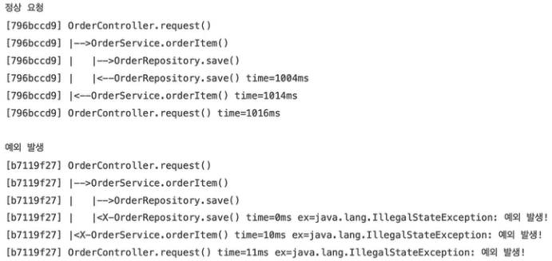<br>

> [!NOTE]
> 물론 모니터링 툴을 도입하면 많은 부분이 해결된다. 하지만 지금은 학습이 목적이기에 참고하자.

## 로그 추적기 V1 - 프로토타입 개발

애플리케이션의 모든 로직에 직접 로그를 남겨도 되지만, 그것보다는 더 효율적인 개발 방법이 필요하다.<br>특히 트랜잭션 ID와 깊이를 표현하는 방법은 기존 정보를 이어 받아야 하기 때문에 단순히 로그만 남긴다고 해결할 수 있는 것은 아니다.

따라서 요구사항에 맞추어 애플리케이션에 효과적으로 로그를 남기기 위한 로그 추적기를 개발해보자.<br>(먼저 프로토타입 버전을 개발해보자. 아마 코드를 모두 작성하고 테스트 코드까지 실행해보아야 어떤것을 하는지 감이 올 것이다.)

먼저 로그 추적기를 위한 기반 데이터를 가지고 있는 `TraceId`, `TraceStatus`클래스를 만들어보자.

### TraceId 생성

```java
package hello.advanced.trace;

import java.util.UUID;

public class TraceId {
    private String id;
    private int level;

    public TraceId() {
        this.id = createId();
        this.level = 0;
    }

    private TraceId(String id, int level) {
        this.id = id;
        this.level = level;
    }

    private String createId() {
        return UUID.randomUUID().toString().substring(0, 8);
    }

    public TraceId createNextId() {
        return new TraceId(id, level + 1);
    }

    public TraceId createPreviousId() {
        return new TraceId(id, level - 1);
    }

    public boolean isFirstLevel() {
        return level == 0;
    }

    public String getId() {
        return id;
    }

    public int getLevel() {
        return level;
    }
}
```

**TraceId 클래스 분석**

- 로그 추적기는 트랜잭션ID와 깊이를 표현하는 방법이 필요하다. 여기서는 트랜잭션ID와 깊이를 표현하는 level을 묶어서 `TraceId`라는 개념을 만들었다.

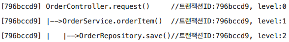<br>

`TraceId`는 `id(트랜잭션ID)`와 `level`정보를 가지고 있다.

**UUID**

`TraceId`를 처음 생성하면 `createId()`를 사용해서 UUID를 만들어낸다. UUID가 너무 길어서 여기서는 앞 8자리만 사용한다. 이 정도면 로그를 충분히 구분할 수 있다. 여기서는 이렇게 만들어진 값을 트랜잭션ID로 사용한다. (참고로 물론 이렇게하면 트랜잭션 ID가 중복될 수도 있다. 그래도 로그를 남기는 용도이기 때문에, 어쩌다 중복이 되더라도 크게 문제가 되거나 하진 않는다.)

**createNextId()**

- 다음 `TraceId`를 만든다. 예제 로그를 잘 보면 깊이가 증가해도 트랜잭션ID는 같다. 대신에 깊이가 하나 증가한다.
- (참고) 실행코드: `new TraceId(id, level + 1)`

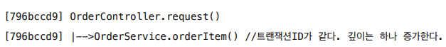<br>

`createNextId()`를 사용해서 현재 `TraceId`를 기반으로 다음 `TraceId`를 만들면, `id`는 기존과 같고, `level`은 하나 증가한다.

**createPreviousId()**

- `createNextId()`의 반대 역할을 한다. (`id`는 기존과 같고, `level`은 하나 감소한다.)

**isFirstLevel()**

- 첫 번째 레벨 여부를 편리하게 확인할 수 있는 메서드

**로그의 상태 정보를 나타내는 `TraceStatus`도 생성해보자**

### TraceStatus 생성

```java
package hello.advanced.trace;

public class TraceStatus {

    private TraceId traceId;
    private Long startTimeMs;
    private String message;

    public TraceStatus(TraceId traceId, Long startTimeMs, String message) {
        this.traceId = traceId;
        this.startTimeMs = startTimeMs;
        this.message = message;
    }

    public TraceId getTraceId() {
        return traceId;
    }

    public Long getStartTimeMs() {
        return startTimeMs;
    }

    public String getMessage() {
        return message;
    }
}
```

**TraceStatus 클래스 분석**

- 로그의 상태 정보를 나타낸다
- 로그를 시작하면 끝이 있어야 한다.

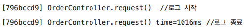<br>

- `TraceStatus`는 로그를 시작할 때의 상태 정보를 가지고 있다. 이 상태 정보는 로그를 종료할때 사용된다.

<br>

- `traceId`: 내부에 트랜잭션ID와 level을 가지고 있다.
- `startTimeMs`: 로그 시작시간이다. 로그 종료시 이 시작 시간을 기준으로 시작~종료까지 전체 수행 시간을 구한다.
- `message`: 시작시 사용한 메시지이다. 이후 로그 종료시에도 이 메시지를 사용해서 출력한다.

`TraceId`, `TraceStatus`를 사용해서 실제 로그를 생성하고, 처리하는 기능을 개발해보자

### HelloTraceV1 생성

```java
package hello.advanced.trace.hellotrace;

import hello.advanced.trace.TraceId;
import hello.advanced.trace.TraceStatus;
import lombok.extern.slf4j.Slf4j;
import org.springframework.stereotype.Component;

@Slf4j
@Component
public class HelloTraceV1 {

    private static final String START_PREFIX = "-->";
    private static final String COMPLETE_PREFIX = " <--";
    private static final String EX_PREFIX = "<X-";

    public TraceStatus begin(String message) {
        TraceId traceId = new TraceId();
        Long startTimeMs = System.currentTimeMillis();
        log.info("[{}] {}{}", traceId.getId(), addSpace(START_PREFIX, traceId.getLevel()), message);
        return new TraceStatus(traceId, startTimeMs, message);
    }

    public void end(TraceStatus status) {
        complete(status, null);
    }

    public void exception(TraceStatus status, Exception e) {
        complete(status, e);
    }

    private void complete(TraceStatus status, Exception e) {
        Long stopTimeMs = System.currentTimeMillis();
        Long resultTimeMs = stopTimeMs - status.getStartTimeMs();
        TraceId traceId = status.getTraceId();
        if (e == null) {
            log.info("[{}] {}{} time={}ms", traceId.getId(),
                    addSpace(COMPLETE_PREFIX, traceId.getLevel()), status.getMessage(), resultTimeMs);
        } else {
            log.info("[{}] {}{} time={}ms ex={}", traceId.getId(),
                    addSpace(EX_PREFIX, traceId.getLevel()), status.getMessage(), resultTimeMs, e.toString());
        }
    }

    private static String addSpace(String prefix, int level) {
        StringBuilder sb = new StringBuilder();
        for (int i = 0; i < level; i++) {
            sb.append((i == level - 1) ? "|" + prefix : "| ");
        }
        return sb.toString();
    }
}
```

- `HelloTraceV1`을 사용해서 실제 로그를 시작하고 종료할 수 있다. 그리고 로그를 출력하고 실행시간도 측정할 수 있디.
- `@Component`: 싱글톤으로 사용하기 위해 스프링 빈으로 등록한다. 컴포넌트 스캔의 대상이 된다.

**HelloTraceV1클래스 분석**

- **공개 메서드**: 로그 추적기에서 사용되는 공개 메서드는 다음 3가지이다.(`begin(..)`, `end(..)`, `exception(..)`)
  - `TraceStatus begin(String message)`
    - 로그를 시작한다.
    - 로그 메시지를 파라미터로 받아서 시작 로그를 출력한다.
    - 응답 결과로 현재 로그의 상태인 `TraceStatus`를 반환한다.
  - `void end(TraceStatus status)`
    - 로그를 정상 종료한다.
    - 파라미터로 시작 로그의 상태(`TraceStatus`)를 전달 받는다. 이 값을 활용해서 실행 시간을 계산하고, 종료시에도 시작할 때와 동일한 로그 메시지를 출력할 수 있다.
    - 정상 흐름에서 호출한다.
  - `void exception(TraceStatus status, Exception e)`
    - 로그를 예외 상황으로 종료한다.
    - `TraceStatus`, `Exception`정보를 함께 전달 받아서 실행시간, 예외 정보를 포함한 결과 로그를 출력한다.
    - 예외가 발생했을 때 호출한다.
- **비공개 메서드**
  - `complete(TraceStatus status, Exception e)`
    - `end()`, `exception()`의 흐름을 한곳에서 편리하게 처리한다. 실행 시간을 측정하고 로그를 남긴다.
  - `String addSpace(String prefix, int level)`: 다음과 같은 결과를 출력한다.
    - prefix: `-->`
      - level 0: 
      - level 1: `|-->`
      - level 2: `| |-->`
    - prefix: `<--`
      - level 0:
      - level 1: `|<--`
      - level 2: `| |<--`
    - prefix: `<X-`
      - level 0:
      - level 1: `|<X-`
      - level 2: `| |<X-`

참고로 `HelloTraceV1`는 아직 모든 요구사항을 만족하지는 못한다. 이후에 기능 하나씩 추가할 예정이다.

정상적으로 동작하는지 테스트를 작성해보자

### HelloTraceV1Test 생성

```java
package hello.advanced.trace.hellotrace;

import hello.advanced.trace.TraceStatus;
import org.junit.jupiter.api.Test;

class HelloTraceV1Test {

    @Test
    void begin_end() {
        HelloTraceV1 trace = new HelloTraceV1();
        TraceStatus status = trace.begin("hello");
        trace.end(status);
    }

    @Test
    void begin_exception() {
        HelloTraceV1 trace = new HelloTraceV1();
        TraceStatus status = trace.begin("hello");
        trace.exception(status, new IllegalStateException());
    }

}
```

- 테스트 코드를 보면 로그 추적기를 어떻게 실행해야 하는지, 그리고 어떻게 동작하는지 이해가 될 것이다.

<br>

- **begin_end() - 실행 로그**

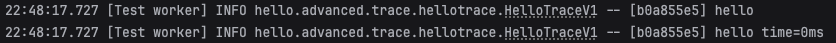<br>

- **begin_exception() - 실행 로그**

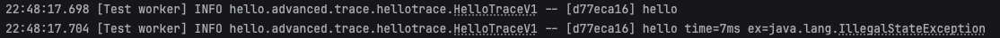<br>


> [!NOTE]
> 참고로 이것은 온전한 테스트 코드가 아니다. 일반적으로 테스트라고 하면 자동으로 검증하는 과정이 필요하다. 이 테스트는 검증하는 과정이 없고 결과를 콘솔로 직접 확인해야 한다. 이렇게 응답값이 없는 경우를 자동으로 검증하려면 여러가지 테스트 기법이 필요하다. 이번에는 예제를 최재한 단순화 하기 위해 검증 테스트를 생략했다.

## 로그 추적기 V1 - 적용

이번에는 지금까지 만든 로그 추적기를 실제 애플리케이션에 적용해보자.<br>먼저 기존 코드를 유지하기 위해서 `hello.advanced.app.v1`패키지를 새로 만들고, 기존 `hello.advanced.app.v0`코드를 복사하자.

- 추가로 각 코드 내부 의존관계를 V1으로 변경하자
- `OrderControllerV1`의 매핑 정보도 다음과 같이 변경하자.(`@GetMappring("/v1/request")`)

v1(`OrderControllerV1`, `OrderServiceV1`, `OrderRepositoryV1`)에 로그 추적기를 적용해보자. 먼저 컨트롤러에 `HelloTraceV1`을 적용해보자.

### OrderControllerV1 수정

```java
@RestController
@RequiredArgsConstructor
public class OrderControllerV1 {

    private final OrderServiceV1 orderService;
    private final HelloTraceV1 trace;

    @GetMapping("/v1/request")
    public String request(String itemId) {
        TraceStatus status = null;
        try {
            status = trace.begin("OrderController.request()");
            orderService.orderItem(itemId);
            trace.end(status);
            return "ok";
        } catch (Exception e) {
            trace.exception(status, e);
            throw e;
        }
    }
}
```

- `HelloTraceV1 trace`: `HelloTraceV1`을 주입 받는다. 참고로 `HelloTraceV1`은 `@Component`애노테이션을 가지고 있기 때문에 컴포넌트 스캔의 대상이 된다. 따라서 자동으로 스프링 빈으로 등록된다.
- `trace.begin("OrderController.request()")`: 로그를 시작할 때 메시지 이름으로 (컨트롤러 이름 + 메서드 이름)을 주었다. 이렇게 하면 어떤 컨트롤러와 메서드가 호출되었는지 로그로 편리하게 확인할 수 있다.(물론 수작업이다.)
- 단순하게 `trace.begin()`, `trace.end()`코드 두 줄만 적용하면 될 줄 알았지만, 실상은 그렇지 않다. `trace.exception()`으로 예외까지 처리해야 하므로 지저분한 `try`, `catch`코드가 추가된다.
- `begin()`의 결과 값으로 받은 `TraceStatus status`값을 `end()`, `exception()`에 넘겨야 한다. 결국 `try`, `catch`블록 모두에 이 값을 넘겨야한다. 따라서 `try`상위에 `TraceStatus status`코드를 선언해야 한다. 만약 `try`안에서 `TraceStatus status`를 선언하면 `try`블록안에서만 해당 변수가 유효하기 때문에 `catch`블록에 넘길 수 없다. 따라서 컴파일 오류가 발생한다.
- `throw e`: 예외를 꼭 다시 던져주어야 한다. 그렇지 않으면 여기서 예외를 먹어버리고, 이후에 정상 흐름으로 동작한다. 로그는 애플리케이션에 흐름에 영향을 주면 안된다. 로그 때문에 예외가 사라지면 안된다.

`http://localhost:8080/v1/request?itemId=hello`

`http://localhost:8080/v1/request?itemId=ex`

### OrderServiceV1 수정

```java
package hello.advanced.app.v1.v0;

@Service
@RequiredArgsConstructor
public class OrderServiceV1 {

    private final OrderRepositoryV1 orderRepository;
    private final HelloTraceV1 trace;

    public void orderItem(String itemId) {
        TraceStatus status = null;
        try {
            status = trace.begin("OrderService.orderItem()");
            orderRepository.save(itemId);
            trace.end(status);
        } catch (Exception e) {
            trace.exception(status, e);
            throw e;
        }
    }
}
```

### OrderRepositoryV1 수정

```java
package hello.advanced.app.v1.v0;

@Repository
@RequiredArgsConstructor
public class OrderRepositoryV1 {

    private final HelloTraceV1 trace;

    public void save(String itemId) {

        TraceStatus status = null;

        try {
            status = trace.begin("OrderRepository.save()");

            //저장 로직
            if (itemId.equals("ex")) {
                throw new IllegalStateException("예외 발생!");
            }
            sleep(1000);

            trace.end(status);
        } catch (Exception e) {
            trace.exception(status, e);
            throw e;
        }
    }

    private void sleep(int millis) {
        try {
            Thread.sleep(millis);
        } catch (InterruptedException e) {
            e.printStackTrace();
        }
    }
}
```

`http://localhost:8080/v1/request?itemId=hello`

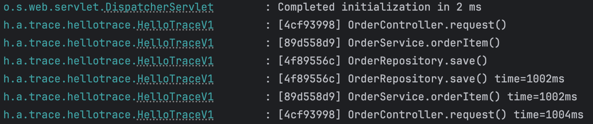<br>

> [!NOTE]
> 아직 level 관련 기능을 개발하지 않았다. 따라서 level값은 항상 0이다. 그리고 트랜잭션ID 값도 다르다. 이 부분은 아직 개발하지 않았다.

`http://localhost:8080/v1/request?itemId=ex`

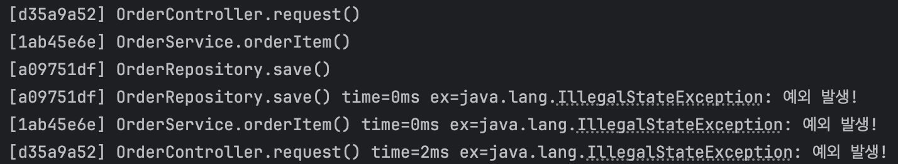<br>

`HelloTraceV1`덕분에 직접 로그를 하나하나 남기는 것보다는 편하게 여러가지 로그를 남길 수 있었다.<br>하지만 로그를 남기기 위한 코드가 생각보다 너무 복잡하다. 지금은 우선 요구사항과 동작하는 것에만 집중하자.

### 남은 문제

**요구사항**

- 모든 PUBLIC메서드의 호출과 응답 정보를 로그로 출력 => (O)
- 애플리케이션의 흐름을 변경하면 안됨 => (O)
  - 로그를 남긴다고 해서 브즈니스 로직의 동작에 영향을 주면 안됨 => (O)
- 메서드 호출에 걸린 시간 => (O)
- 정상 흐름과 예외 흐름 구분 => (O)
  - 예외 발생시 예외 정보가 남아야 함 => (O)
- 메서드 호출의 깊이 표현 => (X)
- HTTP요청을 구분 => (X)
  - HTTP요청 단위로 특정 ID를 남겨서 어떤 HTTP 요청에서 시작된 것인지 명확하게 구분이 가능해야 함.
  - 트랜잭션 ID(DB트랜잭션X), 여기서는 하나의 HTTP요청이 시작해서 끝날 때 까지를 하나의 트랜잭션이라 함.

아직 구현하지 못한 요구사항은 메서드 호출의 깊이를 표현하고, 같은 HTTP 요청이면 같은 트랜잭션ID를 남기는 것이다.<br>그런데 이 기능은 직전 로그의 깊이와 트랜잭션ID가 무엇인지 알아야 할 수 있는 일이다. 예를 들어서 `OrderController.request()`에서 로그를 남길 때 어떤 깊이와 어떤 트랜잭션ID를 사용했는지 그 다음에 로그를 남기는 `OrderService.orderItem()`에서 로그를 남길 때 알아야한다. 결국 현재 로그의 상태 정보인 `트랜잭션ID`와 `level`이 다음으로 전달되어야 한다. 정리하면 로그에 대한 문맥(`Context`)정보가 필요하다.

이전 로그에 남긴 트랜잭션ID와 level을 다음 로그에서 어떻게 알 수 있을까?<br>이를 동기화하기 위한 가장 간단한 방법으로는 파라미터로 넘기면 된다.

## 로그 추적기 V2 - 파라미터로 동기화 개발

트랜잭션ID와 메서드 호출의 깊이를 표현하는 가장 단순한 방법은 첫 로그에서 사용한 `트랜잭션ID`와 `level`을 다음 로그에 넘겨주면 된다.

현재 로그의 상태 정보인 `트랜잭션ID`와 `level`은 `TraceId`에 포함되어 있다.<br>따라서 `TraceId`를 다음 로그에 넘겨주면 된다.

이 기능을 추가한 `HelloTraceV2`를 개발해보자.

### HelloTraceV2 생성

`trace`의 `hellotrace`패키지 내부에 `HelloTraceV2`클래스를 생성하자. (기존 HelloTraceV1클래스를 복사하자)

```java
public TraceStatus beginSync(TraceId beforeTraceId, String message) {
    TraceId nextId = beforeTraceId.createNextId();
    Long startTimeMs = System.currentTimeMillis();
    log.info("[{}] {}{}", nextId.getId(), addSpace(START_PREFIX, nextId.getLevel()), message);
    return new TraceStatus(nextId, startTimeMs, message);
}
```

- (참고) 기존 `HelloTraceV1`코드에서 `beginSynv(..)`메서드만 추가되었다.
- 기존 `TraceId`에서 `createNextId()`를 통해 다음 ID를 구한다.
- `createNextId()`의 `TraceId`생성 로직은, 트랜잭션 ID는 기존과 같이 유지하면서, 깊이를 표현하는 Lebel은 하나 증가한다.(`0` -> `1`)

<br>

테스트 코드를 통해 잘 동작하는지 확인해보자

```java
class HelloTraceV2Test {

    @Test
    void begin_end_level2() {
        HelloTraceV2 trace = new HelloTraceV2();
        TraceStatus status1 = trace.begin("hello1");
        TraceStatus status2 = trace.beginSync(status1.getTraceId(), "hello2");
        trace.end(status2);
        trace.end(status1);
    }

    @Test
    void begin_exception_level2() {
        HelloTraceV2 trace = new HelloTraceV2();
        TraceStatus status1 = trace.begin("hello1");
        TraceStatus status2 = trace.beginSync(status1.getTraceId(), "hello2");
        trace.exception(status2, new IllegalStateException());
        trace.exception(status1, new IllegalStateException());
    }
}
```

- 처음에는 `begin(..)`을 사용하고, 이후에는 `beginSync(..)`를 사용하면 된다.
- (주의) `beginSync(..)`를 호출할 때 직전 로그의 `traceId`정보를 넘겨주어야 한다.

begin_end_level2() 실행 결과<br>
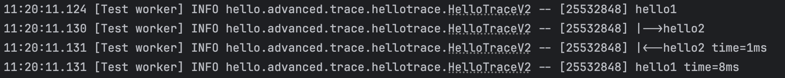<br>

begin_exception_level2() 실행 결과<br>
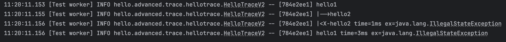<br>

실행 로그를 보면, 드디어 같은 `트랜잭션ID`를 유지하고 `level`을 통해 메서드 호출의 깊이를 표현하는 것을 확인할 수 있다.

## 로그 추적기 V2 - 적용

이제 로그 추적기를 애플리케이션에 적용해보자.<br>먼지 기존 코드를 유지하기 위해서 `hello.advanced.app.v2`패키지를 새로 만들고, 기존 `hello.advanced.app.v1`코드를 복사하자

- 추가로 각 코드 내부 의존관계를 V2로 변경하자.

`http://localhost:8080/v2/request?itemId=hello` 정상 실행이되는지 확인하자

**V2적용하기**

메서드 호출의 깊이를 표현하고, HTTP요청도 구분해보자.<br>이렇게 하려면 처음 로그를 남기는 `OrderController.request()`에서 로그를 남길 때 어떤 깊이와 어떤 트랜잭션 ID를 사용했는지 다음 차례인 `OrderService.orderITem()`에서 로그를 남기는 시점에 알아야한다.

결국 현재 로그의 상태 정보인 `트랜잭션ID`와 `level`이 다음으로 전달되어야 한다.<br>이 정보는 `TraceStatus.traceId`에 담겨있다. 따라서 `traceId`를 컨트롤러에서 서비스를 호출할 때 넘겨주면 된다.

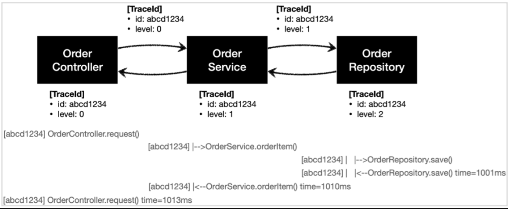<br>

`traceId`를 넘기도록 v2전체 코드를 수정하자

### OrderControllerV2수정

```java
@GetMapping("/v2/request")
public String request(String itemId) {
    TraceStatus status = null;
    try {
        status = trace.begin("OrderController.request()");
        orderService.orderItem(status.getTraceId(), itemId);
        trace.end(status);
        return "ok";
    } catch (Exception e) {
        trace.exception(status, e);
        throw e;
    }
}
```

- `TraceStatus status` = `trace.begin()`에서 받은 `TraceStatus`에는 `트랜잭션ID`와 `level`정보가 있는 `TraceId`가 있다.
- `orderService.orderItem()`을 호출할 때 `TraceId`를 파라미터로 전달한다
- `TraceId`를 파라미터로 전달하기 위해 `OrderServiceV2.orderItem()`의 파라미터에 `TraceId`를 추가해야 한다.

### OrderServiceV2 수정

```java
public void orderItem(TraceId traceId, String itemId) {
    TraceStatus status = null;
    try {
        status = trace.beginSync(traceId, "OrderService.orderItem()");
        orderRepository.save(status.getTraceId(), itemId);
        trace.end(status);
    } catch (Exception e) {
        trace.exception(status, e);
        throw e;
    }
}
```

- `orderItem()`은 파라미터로 전달 받은 `traceId`를 사용해서 `trace.beginSync()`를 실행한다.
- `beginSync()`는 내부에서 다음 `traceId`를 생성하면서 트랜잭션ID는 유지하고 `level`은 하나 증가시킨다.
- `beginSync()`가 반환한 새로운 `TraceStatus`를 `orderRepository.save()`를 호출하면서 파라미터로 전달한다.
- `TraceId`를 파라미터로 전달하기 위해 `orderRepository.save()`의 파라미터에 `TraceId`를 추가해야 한다.

### OrderRepositoryV2 수정

```java
public void save(TraceId traceId, String itemId) {

    TraceStatus status = null;
    try {
        status = trace.beginSync(traceId, "OrderRepository.save()");

        //저장 로직
        if (itemId.equals("ex")) {
            throw new IllegalStateException("예외 발생!");
        }
        sleep(1000);

        trace.end(status);
    } catch (Exception e) {
        trace.exception(status, e);
        throw e;
    }
}
```

- `save()`는 파라미터로 전달 받은 `traceId`를 사용해서 `trace.beginSync()`를 실행한다
- `beginSync()`는 내부에서 다음 `traceId`를 생성하면서 트랜잭션ID는 유지하고 `level`은 하나 증가시킨다.
- `beginSync()`는 이렇게 갱신된 `traceId`로 새로운 `TraceStatus`를 반환한다.
- `trace.end(status)`를 호출하면서 반환된 `TraceStatus`를 전달한다.

정상 실행시 `http://localhost:8080/v2/request?itemId=hello`<br>

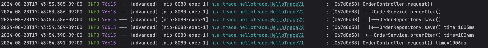<br>

예외 실행시 `http://localhost:8080/v2/request?itemId=ex`<br>

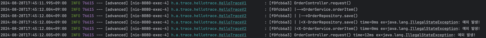<br>

실행 로그를 보면 같은 HTTP요청에 대해서 `트랜잭션ID`가 유지되고, `level`도 잘 표혐되는 것을 확인할 수 있다.

# 쓰레드 로컬 - ThreadLocal

## 필드 동기화 - 개발

앞서 로그 추적기를 만들면서 다음 로그를 출력할 때 `트랜잭션ID`와 `level`을 동기화하는 문제가 있었다.<br>이 문제를 해결하기 위해 `TraceId`를 파라미터로 넘기도록 구현했다.

이렇게 해서 동기화는 성공했지만, 로그를 출력하는 모든 메서드에 `TraceId`파라미터를 추가해야 하는 문제가 발생했다. `TraceId`를 파라미터로 넘기지 않고 이 문제를 해결할 수 있는 방법은 없을까?

이런 문제를 해결할 목적으로 새로운 로그 추적기를 만들어보자.<br>이제 프로토타입 버전이 아닌 정식 버전으로 제대로 개발해보자.<br>향후 다양한 구현체로 변경할 수 있도록, `LogTrace`인터페이스를 먼저 만들고, 구현해보자

### LogTrace 인터페이스 생성

```java
package hello.advanced.trace.logtrace;

import hello.advanced.trace.TraceStatus;

public interface LogTrace {

    TraceStatus begin(String message);

    void end(TraceStatus status);

    void exception(TraceStatus status, Exception e);
}
```

- `LogTrace`인터페이스에는 로그 추적기를 위한 최소한의 기능인 `begin()`, `end()`, `exception()`를 정의했다
- 이제 파라미터를 넘기지 않고 `TraceId`를 동기화 할 수 있는 `FieldLogTrace`구현체를 만들어보자.

### FieldLogTrace

```java
package hello.advanced.trace.logtrace;

import hello.advanced.trace.TraceId;
import hello.advanced.trace.TraceStatus;
import lombok.extern.slf4j.Slf4j;

@Slf4j
public class FieldLogTrace implements LogTrace{

    private static final String START_PREFIX = "-->";
    private static final String COMPLETE_PREFIX = "<--";
    private static final String EX_PREFIX = "<X-";

    private TraceId traceIdHolder; //traceId 동기와, 동시성 이슈 발생

    @Override
    public TraceStatus begin(String message) {
        syncTraceId();
        TraceId traceId = traceIdHolder;
        Long startTimeMs = System.currentTimeMillis();
        log.info("[{}] {}{}", traceId.getId(),
                addSpace(START_PREFIX, traceId.getLevel()), message);

        return new TraceStatus(traceId, startTimeMs, message);
    }

    @Override
    public void end(TraceStatus status) {
        complete(status, null);
    }

    @Override
    public void exception(TraceStatus status, Exception e) {
        complete(status, e);
    }

    private void complete(TraceStatus status, Exception e) {
        Long stopTimeMs = System.currentTimeMillis();
        long resultTimeMs = stopTimeMs - status.getStartTimeMs();
        TraceId traceId = status.getTraceId();
        if (e == null) {
            log.info("[{}] {}{} time={}ms", traceId.getId(),
                    addSpace(COMPLETE_PREFIX, traceId.getLevel()), status.getMessage(), resultTimeMs);
        } else {
            log.info("[{}] {}{} time={}ms ex={}", traceId.getId(),
                    addSpace(EX_PREFIX, traceId.getLevel()), status.getMessage(),
                    resultTimeMs, e.toString());
        }
        releaseTraceId();
    }

    private void syncTraceId() {
        if (traceIdHolder == null) {
            traceIdHolder = new TraceId();
        } else {
            traceIdHolder = traceIdHolder.createNextId();
        }
    }

    private void releaseTraceId() {
        if (traceIdHolder.isFirstLevel()) {
            traceIdHolder = null; //destroy
        } else {
            traceIdHolder = traceIdHolder.createPreviousId();
        }
    }

    private static String addSpace(String prefix, int level) {
        StringBuilder sb = new StringBuilder();
        for (int i = 0; i < level; i++) {
            sb.append((i == level - 1) ? "|" + prefix : "| ");
        }
        return sb.toString();
    }
}
```

`FieldLogTrace`는 기존에 만들었던 `HelloTraceV2`와 거의 같은 기능을 한다.<br>
`TraceId`를 동기화하는 부분만 파라미터를 사용하는 것에서 `TraceId traceHolder`필드를 사용하도록 변경되었다.<br>
이제 직전 로그의 `TraceId`는 파라미터로 전달되는 것이 아니라 `FieldLogTrace`의 필드인 `traceIdHolder`에 저장된다.

여기서 중요한 부분은 로그를 시작할 때 호출하는 `syncTraceId()`와 로그를 종료할 때 호출하는 `releaseTraceId()`이다.

- `syncTraceId()`
  - `TraceId`를 새로 만들거나 앞선 로그의 `TraceId`를 참고해서 동기화하고, `level`도 증가한다.
  - 최초 호출이면 `TracdId`를 새로 만든다.
  - 직전 로그가 있으면 해당 로그의 `TraceId`를 참고해서 동기화하고, `level`도 증가한다
  - 결과를 `traceIdHolder`에 보관한다.
- `releaseTraceId()`
  - 메서드를 추가로 호출할 때는 `level`이 하나 증가해야 하지만, 메서드 호출이 끝나면 `level`이 하나 감소해야 한다.
  - `releaseTraceId()`는 `level`을 하나 감소한다.
  - 만약 최초 호출(`level==0`)이면 내부에서 관리하는 `traceId`를 제거한다.

테스트 코드를 통해서 실행해보자

```java
package hello.advanced.trace.logtrace;

import hello.advanced.trace.TraceStatus;
import org.junit.jupiter.api.Test;

import static org.junit.jupiter.api.Assertions.*;

class FieldLogTraceTest {

    FieldLogTrace trace = new FieldLogTrace();

    @Test
    void begin_end_level2() {
        TraceStatus status1 = trace.begin("hello1");
        TraceStatus status2 = trace.begin("hello2");
        trace.end(status2);
        trace.end(status1);
    }

    @Test
    void begin_exception_level2() {
        TraceStatus status1 = trace.begin("hello1");
        TraceStatus status2 = trace.begin("hello2");
        trace.exception(status2, new IllegalStateException());
        trace.exception(status1, new IllegalStateException());
    }
}
```

**begin_end_level2() - 실행 결과** 

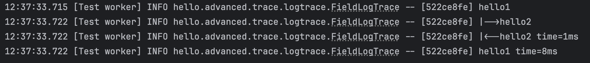<br>

**begin_exception_level2() - 실행 결과**

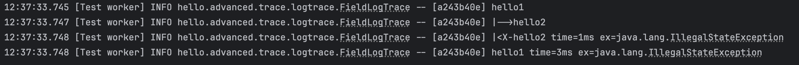<br>

실행 결과를 보면 `트랜잭션ID`도 동일하게 나오고, `level`을 통한 깊이도 잘 표현된다.<br>`FieldLogTrace.traceIdHolder`필드를 사용해서 `TraceId`가 잘 동기화 되는 것을 확인할 수 있다.<br>이제 불필요하게 `TraceId`를 파라미터로 전달하지 않아도 되고, 애플리케이션의 메서드 파라미터도 변경하지 않아도 된다.

## 필드 동기화 - 적용

지금까지 만든 `FieldLogTrace`를 애플리케이션에 적용해보자

**LogTrace**스프링 빈 등록

`FieldLogTrace`를 수동으로 스프링 빈으로 등록하자. 수동으로 등록하면 향후 구현체를 편리하게 변경할 수 있다는 장점이 있다.

### LogTraceConfig

```java
package hello.advanced;

import hello.advanced.trace.logtrace.FieldLogTrace;
import hello.advanced.trace.logtrace.LogTrace;
import org.springframework.context.annotation.Bean;
import org.springframework.context.annotation.Configuration;

@Configuration
public class LogTraceConfig {

    @Bean
    public LogTrace logTrace() {
        return new FieldLogTrace();
    }
}
```

**V2 -> V3 복사**

로그 추적기 V3를 적용하기 전에 먼저 기존 코드를 복사하자. 또한 매핑 정보도 수정하자


`HelloTraceV2` -> `LogTrace`인터페이스 사용<br>
`TraceId traceId` 파라미터를 모두 제거<br>
`beginSync()` -> `begin`으로 사용하도록 변경

전체 코드는 다음과 같다

### OrderControllerV3

```java
package hello.advanced.app.v3;

@RestController
@RequiredArgsConstructor
public class OrderControllerV3 {

    private final OrderServiceV3 orderService;
    private final LogTrace trace;

    @GetMapping("/v3/request")
    public String request(String itemId) {
        TraceStatus status = null;
        try {
            status = trace.begin("OrderController.request()");
            orderService.orderItem(itemId);
            trace.end(status);
            return "ok";
        } catch (Exception e) {
            trace.exception(status, e);
            throw e;
        }
    }
}
```

### OrderServiceV3

```java
package hello.advanced.app.v3;

@Service
@RequiredArgsConstructor
public class OrderServiceV3 {

    private final OrderRepositoryV3 orderRepository;
    private final LogTrace trace;

    public void orderItem(String itemId) {
        TraceStatus status = null;
        try {
            status = trace.begin("OrderService.orderItem()");
            orderRepository.save(itemId);
            trace.end(status);
        } catch (Exception e) {
            trace.exception(status, e);
            throw e;
        }
    }
}
```

### OrderRepositoryV3

```java
package hello.advanced.app.v3;

@Repository
@RequiredArgsConstructor
public class OrderRepositoryV3 {

    private final LogTrace trace;

    public void save(String itemId) {

        TraceStatus status = null;
        try {
            status = trace.begin("OrderRepository.save()");

            //저장 로직
            if (itemId.equals("ex")) {
                throw new IllegalStateException("예외 발생!");
            }
            sleep(1000);

            trace.end(status);
        } catch (Exception e) {
            trace.exception(status, e);
            throw e;
        }
    }

    private void sleep(int millis) {
        try {
            Thread.sleep(millis);
        } catch (InterruptedException e) {
            e.printStackTrace();
        }
    }
}
```

**정상 실행**

- `http://localhost:8080/v3/request?itemId=hello`

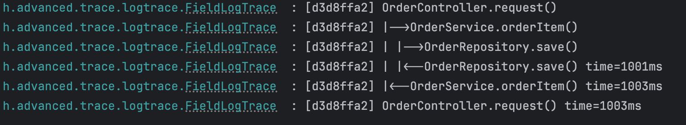<br>

**예외 실행**

- `http://localhost:8080/v3/request?itemId=ex`

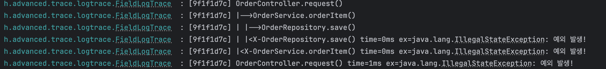<br>

`traceIdHolder`필드를 사용한 덕분에 파라미터 추가 없는 깔끔한 로그 추적기를 완성했다. 이제 실제 서비스에 배포한다고 가정해보자.

## 필드 동기화 - 동시성 문제

잘 만든 로그 추적기를 실제 서비스에 배포했다 가정해보자.<br>
테스트 할 때는 문제가 없는 것 처럼 보인다. 사실 직전에 만든 `FieldLongTrace`는 심각한 동시성 문제를 가지고 있다.<br>
동시성 문제를 확인하려면 다음과 같이 동시에 여러번 호출해보면 된다.

**동시성 문제 확인**

다음 로직을 1초 안에 2번 실행해보자

결과를 수행하면 기다한 것과 전혀 다른 문제가 발생한다. `트랜잭션ID`도 동일하고, `level`도 뭔가 많이 꼬인것 같다. 무엇이 문제일까?

**동시성 문제**

사실 이 문제는 동시성 문제이다.<br>`FieldLogTrace`는 싱글톤으로 등록된 스프링 빈이다. 이 객체의 인스턴스가 애플리케이션에 딱 1개 존재한다는 뜻이다. 이렇게 하나만 있는 인스턴스의 `FieldLogTrace.traceIdHolder`필드를 여러 쓰레드가 동시에 접근하기 때문에 문제가 발생한다.<br>실무에서 한번 나타나면 개발자를 가장 괴롭히는 문제도 바로 이러한 동시성 문제이다.

## 동시성 문제 - 예제 코드

동시성 문제가 어떻게 발생하는지 단순화해서 알아보자

테스트에서도 lombok을 사용하기 위해 다음 코드를 추가하자

```gradle
dependencies {
    ...
    //테스트에서 lombok 사용
    testCompileOnly 'org.projectlombok:lombok' 
    testAnnotationProcessor 'org.projectlombok:lombok'
}
```

이렇게 해야 테스트 코드에서 `@Slf4j`같은 애노에티션이 작동한다.


### FieldService
> [!CAUTION]
> 테스트코드(src/test)에 위치한다.

```java
package hello.advanced.trace.threadlocal.code;

import lombok.extern.slf4j.Slf4j;

@Slf4j
public class FieldService {

    private String nameStore;

    public String logic(String name) {
        log.info("저장 name={} -> nameStore={}", name, nameStore);
        nameStore = name;
        sleep(1000);
        log.info("조회 nameStore={}", nameStore);
        return nameStore;
    }

    private void sleep(int millis) {
        try {
            Thread.sleep(millis);
        } catch (InterruptedException e) {
            e.printStackTrace();
        }
    }
}
```

매우 단순한 로직이다. 파라미터로 넘어온 `name`을 필드인 `nameStore`에 저장한다. 그리고 1초간 쉰 다음 필드에 저장된 `nameStore`를 반환한다.

### FieldServiceTest

```java
package hello.advanced.trace.threadlocal;

import hello.advanced.trace.threadlocal.code.FieldService;
import lombok.extern.slf4j.Slf4j;
import org.junit.jupiter.api.Test;

@Slf4j
public class FieldServiceTest {

    private FieldService fieldService = new FieldService();

    @Test
    void field() {
        log.info("main start");

        Runnable userA = () -> {
            fieldService.logic("userA");
        };

        Runnable userB = () -> {
            fieldService.logic("userB");
        };

        Thread threadA = new Thread(userA);
        threadA.setName("thread-A");
        Thread threadB = new Thread(userB);
        threadA.setName("thread-B");

        threadA.start();
        sleep(2000); //동시성 문제 발생X
        //sleep(100); //동시성 문제 발생O
        threadB.start();


        sleep(3000); //메인 쓰레드 종료 대기
        log.info("main exit");
    }

    private void sleep(int millis) {
        try {
            Thread.sleep(millis);
        } catch (InterruptedException e) {
            e.printStackTrace();
        }
    }
}
```

**순서대로 실행**

`sleep(2000)`을 설정해서 `thread-A`의 실행이 끝나고 나서 `thread-B`가 실행되도록 해보자.<br>참고로 `FieldService.logic()`매서드는 내부에 `sleep(1000)`으로 1초의 지연이 있다. 따라서 1초 이후헤 호출하면 순서대로 실행할 수 있다. 여기서는 넉넉하게 2초(2000ms)를 설정했다.

```java
sleep(2000); //동시성 문제 발생X
//sleep(100); //동시성 문제 발생O
```

**실행 결과**

```
[Test worker] main start
[Thread-A] 저장 name=userA -> nameStore=null
[Thread-A] 조회 nameStore=userA
[Thread-B] 저장 name=userB -> nameStore=userA
[Thread-B] 조회 nameStore=userB
[Test worker] main exit
```

<br>
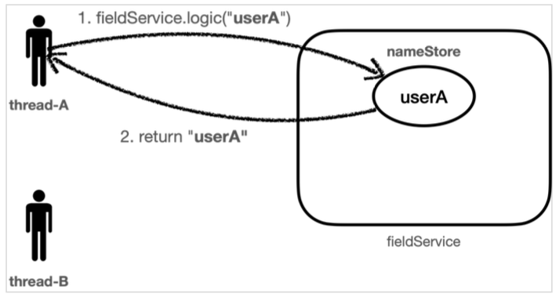<br>

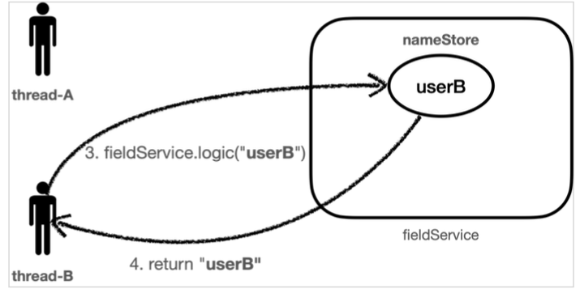<br>

실행 결과를 보면 문제가 없다

- `Thread-A`는 `userA`를 `nameStore`에 저장했다.
- `Thread-A`는 `userA`를 `nameStore`에서 조회했다.
- `Thread-B`는 `userB`를 `nameStore`에 저장했다.
- `Thread-B`는 `userB`를 `nameStore`에서 조회했다.

### 동시성 문제 발생 코드

이번에는 `sleep(100)`을 설정해서 `thread-A`의 작업이 끝나기 전에 `thread-B`가 실행되도록 해보자.<br>참고로 `FieldService.logic()`메서드는 내부에 `sleep(1000)`으로 1초의 지연이 있다. 따라서 1초 이후에 호출하면 순서대로 실행할 수 있다. 다음에 설정할 100(ms)는 0.1초이기 때문에 `thread-A`의 작업이 끝나기 전에 `thread-B`가 실행된다

```java
//sleep(2000); //동시성 문제 발생X
sleep(100); //동시성 문제 발생O        
```

**실행 결과**

```
[Test worker] main start
[Thread-A] 저장 name=userA -> nameStore=null
[Thread-B] 저장 name=userB -> nameStore=userA
[Thread-A] 조회 nameStore=userB
[Thread-B] 조회 nameStore=userB
[Test worker] main exit
```

실행 결과를 보자. 저장하는 부분은 문제가 없다. 문제는 조회하는 부분에서 발생한다.

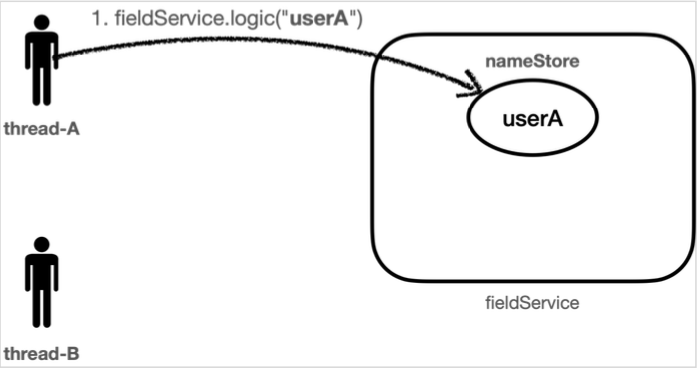<br>

- 먼저 `thread-A`가 `userA`값을 `nameStore`에 보관한다.

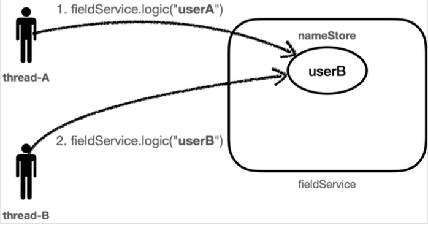<br>

- 0.1초 이후에 `thread-B`가 `userB`의 값을 `nameStore`에 보관한다. 기존에 `nameStore`에 보관되어있던 `userA`값은 제거되고 `userB`값이 저장된다.

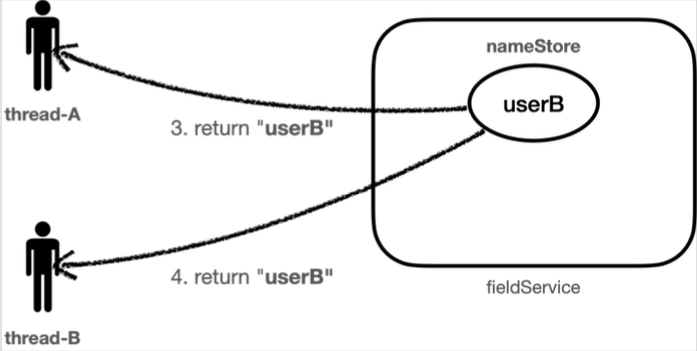<br>

- `thread-A`의 호출이 끝나면서 `nameStore`의 결과를 반환받는데, 이때 `nameStore`는 앞의 2번에서 `userB`의 값으로 대체되었다. 따라서 기대했던 `userA`의 값이 아니라 `userB`의 값이 반환된다.
- `thread-B`의 호출이 끝나면서 `nameStore`의 결과인 `userB`를 반환받는다.

정리하면 다음과 같다

1. `Thread-A`는 `userA`를 `nameStore`에 저장했다.
2. `Thread-B`는 `userB`를 `nameStore`에 저장했다.
3. `Thread-A`는 `userB`를 `nameStore`에서 조회했다.
4. `Thread-B`는 `userB`를 `nameStore`에서 조회했다.

### 동시성 문제

결과적으로 `Thread-A`입장에서 저장한 데이터와 조회한 데이터가 다른 문제가 발생한다. 이처럼 여러 쓰레드가 동시에 같은 인스턴스의 필드 값을 변경하면서 발생하는 문제를 동시성 문제라 한다. 이런 동시성 문제는 여러 쓰레드가 같은 인스턴스의 필드에 접근해야 하기 때문에 트래픽이 적은 상황에서는 확률상 잘 나타나지 않고, 트래픽이 점점 많아질 수 록 자주 발생한다.<br>특히 스프링 빈 처럼 싱글톤 객체의 필드를 변경하며 사용할 때 이러한 동시성 문제를 조심해야 한다.

> [!NOTE]
> 이런 동시성 문제는 지역 변수에서는 발생하지 않는다. 지역 변수는 쓰레드마다 각각 다른 메모리 영역이 할당된다.<br>동시성 문제가 발생하는 곳은 같은 인스턴스의 필드(주로 싱글톤에서 자주 발생), 또는 static 같은 공용 필드에 접근할 때 발생한다.<br>동시성 문제는 값을 읽기만 하면 발생하지 않는다. 어디선가 값을 변경하기 때문에 발생한다.

그렇다면 지금처럼 싱글톤 객체의 필드를 사용하면서 동시성 문제를 해결하려면 어떻게 해야할까? 다시 파라미터를 전달하는 방식으로 돌아가야 할까? 이럴 때 사용하는 것이 바로 쓰레드 로컬이다.

## ThreadLocal - 소개

쓰레드 로컬은 해당 쓰레드만 접근할 수 있는 특별한 저장소를 말한다. 쉽게 이야기해서 물건 보관 창구를 떠올리면 된다. 여러 사람이 같은 물건 보관 창구를 사용하더라도 창구 직원은 사용자를 인식해서 사용자별로 확실하게 불건을 구분해준다.<br>사용자A, 사용자B 모두 창구 직원을 통해서 물건을 보관하고, 꺼내지만 창구 지원이 사용자에 따라 보관한 물건을 구분해주는 것이다.

### 일반적인 변수 필드

여러 쓰레드가 같은 인스턴스의 필드에 접근하면 처음 쓰레드가 보관한 데이터가 사라질 수 있다.

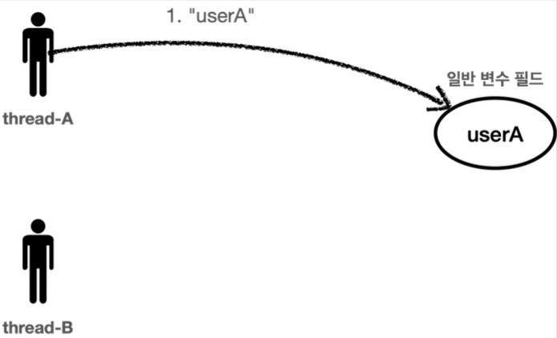<br>

`thread-A`가 `userA`라는 값을 저장하고

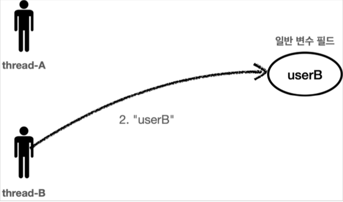<br>

`thread-B`가 `userB`라는 값을 저장하면 직접에 `thread-A`가 저장한 `userA`값은 사라진다.

### 쓰레드 로컬

쓰레드 로컬을 사용해서 각 쓰레드마다 별도의 내부 저장소를 제공한다. 따라서 같은 인스턴스 쓰레드 로컬 필드에 접근해도 문제가 없다.

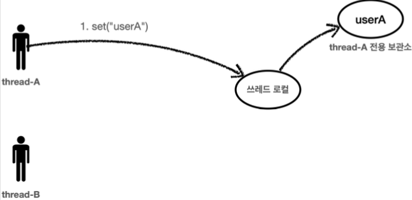<br>

`thread-A`가 `userA`라는 값을 저장하면 쓰레드 로컬은 `thread-A`전용 보관소에 데이터를 안전하게 보관한다.

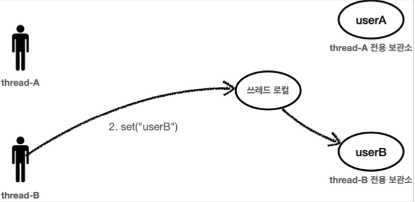<br>

`thread-B`가 `userB`라는 값을 저장하면 쓰레드 로컬은 `thread-B`전용 보관소에 데이터를 안전하게 보관한다.

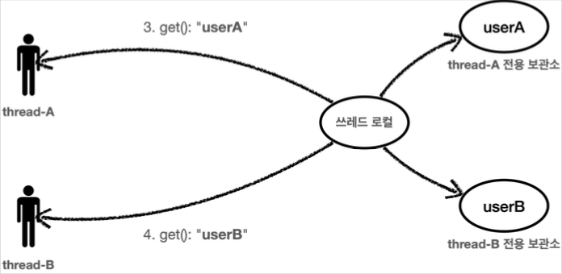<br>

쓰레드 로컬을 통해서 데이터를 조회할 때도 `thread-A`가 조회하면 쓰레드 로컬은 `thread-A`전용 보관소에서 `userA`데이터를 반환해준다. 물론 `thread-B`가 조회하면 `thread-B`전용 보관소에서 `userB`데이터를 반환해준다.

자바는 언어차원에서 쓰레드 로컬을 지원하기 위한 `java.lang.ThreadLocal`클래스를 제공한다.

## ThreadLocal - 예제 코드

예제 코드를 통해서 `ThreadLocal`을 학습해보자.

### ThreadLocalService

> [!CAUTION]
> 테스트 코드(src/test)에 위치한다.

```java
package hello.advanced.trace.threadlocal.code;

import lombok.extern.slf4j.Slf4j;

@Slf4j
public class ThreadLocalService {

    private ThreadLocal<String> nameStore = new ThreadLocal<>();

    public String logic(String name) {
        log.info("저장 name={} -> nameStore={}", name, nameStore.get());
        nameStore.set(name);
        sleep(1000);
        log.info("조회 nameStore={}", nameStore.get());
        return nameStore.get();
    }

    private void sleep(int millis) {
        try {
            Thread.sleep(millis);
        } catch (InterruptedException e) {
            e.printStackTrace();
        }
    }
}
```

기존에 있던 `FieldService`와 거의 같은 코드인데, `nameStore`필드가 일반 `String`타입에서 `ThreadLocal`을 사용하도록 변경되었다.

**ThreadLocal 사용법**

- 값 저장: `ThreadLocal.set(xxx)`
- 값 조회: `ThreadLocal.get()`
- 값 제거: `ThreadLocal.remove()`

> [!CAUTION]
> 해당 쓰레드가 쓰레드 로컬을 모두 사용하고 나면 `ThreadLocal.remove()`를 호출해서 쓰레드 로컬에 저장된 값을 제거해주어야 한다. 제거하는 구체적인 예제는 조금 뒤에 설명하겠다.

### ThreadLocalServiceTest

```java
package hello.advanced.trace.threadlocal;

import hello.advanced.trace.threadlocal.code.ThreadLocalService;
import lombok.extern.slf4j.Slf4j;
import org.junit.jupiter.api.Test;

@Slf4j
public class ThreadLocalServiceTest {

    private ThreadLocalService service = new ThreadLocalService();

    @Test
    void threadLocal() {
        log.info("main start");

        Runnable userA = () -> {
            service.logic("userA");
        };

        Runnable userB = () -> {
            service.logic("userB");
        };

        Thread threadA = new Thread(userA);
        threadA.setName("thread-A");
        Thread threadB = new Thread(userB);
        threadB.setName("thread-B");

        threadA.start();
        sleep(100);
        threadB.start();

        sleep(2000);
        log.info("main exit");
    }

    private void sleep(int millis) {
        try {
            Thread.sleep(millis);
        } catch (InterruptedException e) {
            e.printStackTrace();
        }
    }
}
```

**실행 결과**

```
[Test worker] main start
[Thread-A] 저장 name=userA -> nameStore=null
[Thread-B] 저장 name=userB -> nameStore=null
[Thread-A] 조회 nameStore=userA
[Thread-B] 조회 nameStore=userB
[Test worker] main exit
```

쓰레드 로컬 덕분에 쓰레드 마다 각각 별도의 데이터 저장소를 가지게 되었다. 결과적으로 동시성 문제도 해결되었다.

## 쓰레드 로컬 동기화 - 개발

## 쓰레드 로컬 동기화 - 적용

## 쓰레드 로컬 - 주의사항


# 템플릿 메서드 패턴과 콜백 패턴

# 프록시 패턴과 데코레이터 패턴

# 동적 프록시 기술

# 스프링이 지원하는 프록시

# 빈 후처리기

# @Aspect AOP

# 스프링 AOP 개념

# 스프링 AOP 구현

# 스프링 AOP - 포인트컷

# 스프링 AOP - 실전 예제

# 스프링 AOP - 실무 주의사항