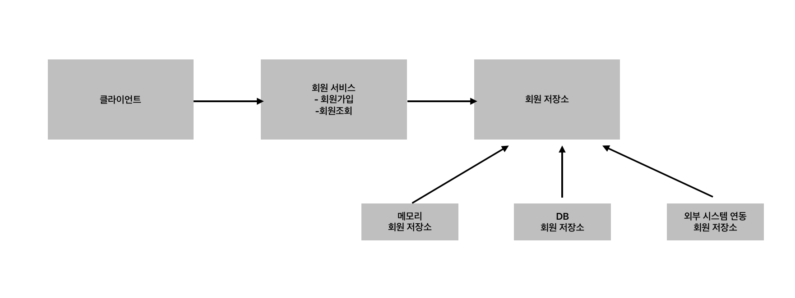
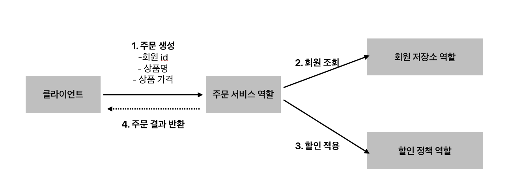
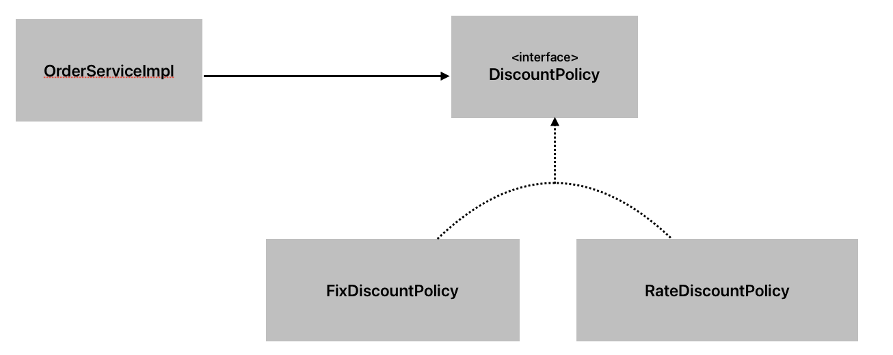
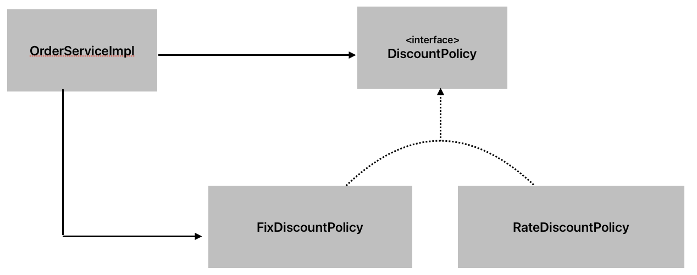
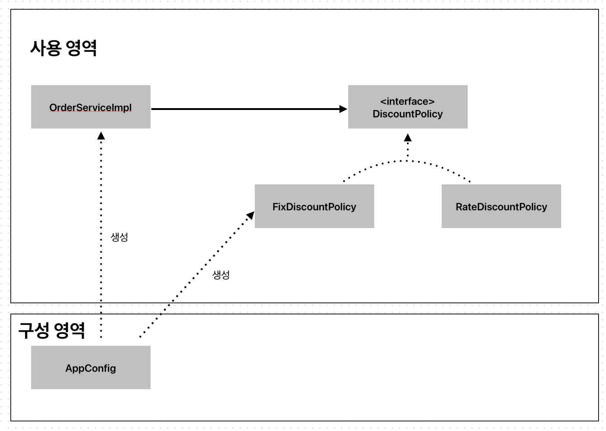

# 주문서비스

## 프로젝트 비즈니스 요구사항과 설계

**회원**

- 회원을 가입하고 조회할 수 있다
- 회원은 일반과 VIP 두가지 등급이 있다
- 회원 데이터는 자체 DB를 구축할 수 있고, 외부 시스템과 연동할 수 있다(미확정)

**주문**과 **할인**정책

- 회원은 상품을 주문할 수 있다
- 회원 등급에 따라 할인 정책을 적용할 수 있다.
- 할인 정책은 모든 VIP는 1000원을 할인해주는 고정 금액 할인을 적용해달라(나중에 변경될 수도 있음)

## 회원 도메인 설계

### **회원 도메인 협력 관계**



- 클라이언트는 회원 서비스를 호출한다.
- 회원 서비스는 두가지 지능(회원가입, 회원조회)을 제공한다
- 회원 저장소는 자체 DB를 사용할 수도 있고, 외부 시스템과 연동할수도 있기에 별도로 구축한다. (= 회원 데이터에 접근하는 계층을 따로 만들어서 역할과 구현을 분리한다. 나중에 저장소가 정해지면, 그 구현체만 개발해서 교체한다.)

### **회원 클래스 다이어 그램**


- MemberService(회원 서비스)라는 역할을 인터페이스로 만들고, 그 구현체로 MemberServiceImpl를 생성한다
- MemberRepository(회원 저장소)라는 역할을 인터페이스로 만들고, 그 구현체로 MemoryMemberRepository클래스와 DbMemberRepository클래스를 생성한다

### **회원 객체 다이어그램**


- 클라이언트는 회원 서비스(MemberServiveImpl)를 바라보고,
- 회원 서비스(MemberServiveImpl)은 메모리 회원 저장소(MemoryMemberRepository)를 바라본다.

## 회원 도메인 개발

```java
package hello.core.member;

public enum Grade {
    BASIC,
    VIP
}

```

```java
package hello.core.member;

public class Member {
    private Long id;
    private String name;
    private Grade grade;

    public Member(Long id, String name, Grade grade) {
        this.id = id;
        this.name = name;
        this.grade = grade;
    }

    public Long getId() {
        return id;
    }

    public void setId(Long id) {
        this.id = id;
    }

    public String getName() {
        return name;
    }

    public void setName(String name) {
        this.name = name;
    }

    public Grade getGrade() {
        return grade;
    }

    public void setGrade(Grade grade) {
        this.grade = grade;
    }
}


```

```java
package hello.core.member;

// 회원 저장소 인터페이스
public interface MemberRepository {
    void save(Member member);

    Member findById(Long memberId);
}

```

```java
package hello.core.member;

// 회원 서비스 인터페이스
public interface MemberService {

    void join(Member member);

    Member findMember(Long memberId);
}


```

```java
package hello.core.member;

import java.util.HashMap;
import java.util.Map;

// 회원 저장소에 대한 메모리 저장소 구현체 클래스
public class MemoryMemberRepository implements MemberRepository {

    private static Map<Long, Member> store = new HashMap<>();

    @Override
    public void save(Member member) {
        store.put(member.getId(), member);
    }

    @Override
    public Member findById(Long memberId) {
        return store.get(memberId);
    }
}
```

```java
package hello.core.member;

// 회원 서비스에 대한 구현체 클래스
public class MemberServiceImpl implements MemberService{

    private final MemberRepository memberRepository = new MemoryMemberRepository();
    @Override
    public void join(Member member) {
        memberRepository.save(member);
    }

    @Override
    public Member findMember(Long memberId) {
        return memberRepository.findById(memberId);
    }
}
```

회원 서비스의 join메소드를 호출해서 save를 호출하면, 다형성에 의해서 MemberRepository 인터페이스가 아닌, MemoryMemberRepository에 있는 오버라이드한 save가 호출된다.

## 테스트 코드

```java
package hello.core.member;

import org.assertj.core.api.Assertions;
import org.junit.jupiter.api.DisplayName;
import org.junit.jupiter.api.Test;

public class MemberServiceTest {

    MemberService memberService = new MemberServiceImpl();
    @DisplayName("join")
    @Test
    void join() {
        // given
        Member member = new Member(1L, "memberA", Grade.VIP);

        // when
        memberService.join(member);
        Member findMember = memberService.findMember(1L);

        // then
        Assertions.assertThat(member).isEqualTo(findMember);
    }
}
```

그런데 이 회원 도메인 설계에는 문제점이 있다

- 다른 저장소로 변경할 때 OCP원칙을 잘 준수할까?
  - DIP를 잘 지키고 있을까?
  - 의존관계가 인터페이스 뿐만 아니라 구현까지 모두 의존하는 문제점이 있다
  ```java
    public class MemberServiceImpl implements MemberService {
        private final MemberRepository memberRepository = new MemoryMemberRepository();
    }
  ```
  - MemberServiceImpl은 MemberRepository 인터페이스를 의존하지만, 실제 할당하는 부분에서 구현체(MemoryMemberRepository)도 의존하고 있다. (=추상화에도 의존하고, 구현체에도 의존하고 있음.) 따라서 나중에 변경이 있을 때 문제가 될 수 있다.

> 주문 도메인작성후 수정 예정

## 주문과 할인 도메인 설계



1. 주문 생성: 클라이언트는 주문 서비스에 주문 생성을 요청한다
2. 회원 조회: 할인을 위해서는 회원 등급이 필요하다. 그래서 주문 서비스는 회원 저장소에서 회원을 조회한다.
3. 할인 적용: 주문 서비스는 회원 등급에 따라 할인 가능 여부를 할인 정책에 위임한다.(할인 가능하면 할인해서 결과를 알려달라)
4. 주문 결과 반환: 주문 서비스는 할인 결과를 포함한 주문 결과를 반환한다.

## 주문과 할인 도메인 개발

### 할인 도메인 개발

```java
package hello.core.discount;

import hello.core.member.Member;

public interface DiscountPolicy {

    /**
     * @return 할인 대상 금액
     */
    int discount(Member member, int price);
}
```

```java
package hello.core.discount;

import hello.core.member.Grade;
import hello.core.member.Member;

public class FixDiscountPolicy implements DiscountPolicy {

    private int discountFixAmount = 1000; // 1000원 할인

    @Override
    public int discount(Member member, int price) {
        if (member.getGrade() == Grade.VIP) {
            return discountFixAmount;
        }
        return 0;
    }
}
```

### 주문 도메인 개발

```java
package hello.core.order;

public class Order {

    private Long memberId;
    private String itemName;
    private int itemPrice;
    private int discountPrice;

    public Order(Long memberId, String itemName, int itemPrice, int discountPrice) {
        this.memberId = memberId;
        this.itemName = itemName;
        this.itemPrice = itemPrice;
        this.discountPrice = discountPrice;
    }

    public Long getMemberId() {
        return memberId;
    }

    public void setMemberId(Long memberId) {
        this.memberId = memberId;
    }

    public String getItemName() {
        return itemName;
    }

    public void setItemName(String itemName) {
        this.itemName = itemName;
    }

    public int getItemPrice() {
        return itemPrice;
    }

    public void setItemPrice(int itemPrice) {
        this.itemPrice = itemPrice;
    }

    public int getDiscountPrice() {
        return discountPrice;
    }

    public void setDiscountPrice(int discountPrice) {
        this.discountPrice = discountPrice;
    }

    @Override
    public String toString() {
        return "Order{" +
                "memberId=" + memberId +
                ", itemName='" + itemName + '\'' +
                ", itemPrice=" + itemPrice +
                ", discountPrice=" + discountPrice +
                '}';
    }

    /**
     * @return 최종 계산된 금액
     */
    public int calculatePrice() {
        return itemPrice - discountPrice;
    }
}

```

```java
package hello.core.order;

public interface OrderService {
    Order createOrder(Long memberId, String itemName, int itemPrice);
}

```

```java
package hello.core.order;

import hello.core.discount.DiscountPolicy;
import hello.core.discount.FixDiscountPolicy;
import hello.core.member.Member;
import hello.core.member.MemberRepository;
import hello.core.member.MemoryMemberRepository;

public class OrderServiceImpl implements OrderService {

    private final MemberRepository memberRepository = new MemoryMemberRepository();
    private final DiscountPolicy discountPolicy = new FixDiscountPolicy();

    @Override
    public Order createOrder(Long memberId, String itemName, int itemPrice) {
        Member member = memberRepository.findById(memberId);
        int discountPrice = discountPolicy.discount(member, itemPrice);

        return new Order(memberId, itemName, itemPrice, discountPrice);
    }
}

```

_참고:_ 주문서비스 입장에서 보면, 회원 조회나 할인 금액에 대해서는 알지 못한다. 할인에 대한 것은 discountPolicy에 역할을 위임하고, 회원에 대한 것은 memberRepository에 역할을 위임한다. 따라서 단일 책임의 원칙이 잘 지켜졌다고 볼 수 있다. (추후 할인에 대한 수정이 있을 때는, 할인쪽만 수정하면 된다. 주문쪽의 수정은 불필요하다. 만약, 단일 책임의 원칙을 잘 지키지 않아 discountPolicy라는게 없었다면, 할인과 관련된 변경을 해야할 때 주문 서비스의 변경이 필요하게 된다.)

## 새로운 할인 정책 개발

이번에는 주문한 금액의 %를 할인해주는 새로운 정률 할인 정책을 추가하자.

- 이전에 역할과 구현으로 분리하였기 때문에, RateDiscountPolicy 구현체를 추가하자

```java
package hello.core.discount;

import hello.core.member.Grade;
import hello.core.member.Member;

public class RateDiscountPolicy implements DiscountPolicy {

    private int discountPercent = 10; // 10% 할인
    @Override
    public int discount(Member member, int price) {
        if (member.getGrade() == Grade.VIP) {
            return price * discountPercent / 100;
        } else {
            return 0;
        }
    }
}
```

### Test 코드

```java
package hello.core.discount;

import hello.core.member.Grade;
import hello.core.member.Member;
import org.assertj.core.api.Assertions;
import org.junit.jupiter.api.DisplayName;
import org.junit.jupiter.api.Test;

import static org.junit.jupiter.api.Assertions.*;

class RateDiscountPolicyTest {
    DiscountPolicy discountPolicy = new RateDiscountPolicy();

    @Test
    @DisplayName("vip는 10%할인")
    void vip() {
        // given
        Member member = new Member(1L, "memberVIP", Grade.VIP);

        // when
        int discount = discountPolicy.discount(member, 10000);

        // then
        Assertions.assertThat(discount).isEqualTo(1000);
    }

    @Test
    @DisplayName("vip가 아니면 할인x")
    void normal() {
        // given
        Member member = new Member(1L, "memberBASIC", Grade.BASIC);

        // when
        int discount = discountPolicy.discount(member, 10000);

        // then
        Assertions.assertThat(discount).isEqualTo(0);
    }
}
```

## 문제점 발견

- 우리는 역할과 구현을 충실하게 분리했다. -> **OK**
- 다형성도 활용하고, 인터페이스와 구현 객체를 분리했다. -> **OK**
- OCP, DIP 같은 객체지향 설계 원칙을 충실히 준수했다. -> **그렇게 보이지만 사실은 아니다.**
  - DIP: 주문서비스 클라이언트( OrderServiceImpl )는 DiscountPolicy 인터페이스에 의존하면서 DIP를 지킨 것 같은데?
    - 클래스 의존관계를 분석해 보자. 추상(인터페이스) 뿐만 아니라 **구체(구현) 클래스에도 의존**하고 있다.
      - 추상(인터페이스) 의존: DiscountPolicy
      - 구체(구현) 클래스: FixDiscountPolicy , RateDiscountPolicy
    - OCP: 변경하지 않고 확장할 수 있다고 했는데?
      - 지금 코드는 기능을 확장해서 변경하면, 클라이언트 코드에 영향을 준다! 따라서 "OCP를 위반"한다.

클래스 다이어그램으로 의존관계를 분석해보자

- 기대했던 의존관계
  

  - 지금까지는 단순히 **DiscountPolicy**인터페이스에만 의존한다고 생각했다.

- 실제 의존관계
  

  - 하지만, 실제 코드를 보면 클라이언트인 **OrderServiceImpl**이 **DiscountPolicy**인터페이스 뿐만아니라, **FixDiscountPolicy**인 구체 클래스도 함께 의존하고 있다. **(DIP위반)**
  - 이렇게 DIP를 위반하게 되면, **FixDiscountPolicy** 를 **RateDiscountPolicy** 로 변경하는 순간 **OrderServiceImpl** 의 소스 코드도 함께 변경해야 한다! (OCP 위반)

이 문제를 어떻게 해결할 수 있을까?

- 클라이언트 코드인 **OrderServiceImpl**은 **DiscountPolicy**의 인터페이스 뿐만 아니라 구체 클래스도 함께 의존한다. (그래서 구체 클래스를 변경할 때 클라이언트 코드도 함께 변경해햐 한다.)
- DIP 위반 -> 추상에만 의존하도록 변경(인터페이스에만 의존)
- DIP를 위반하지 않도록 인터페이스에만 의존하도록 의존관계를 변경하면 된다.
  - 인터페이스에만 의존하도록 설계를 변경하자.

## AppConfig

애플리케이션의 전체 동작 방식을 설정-구성(config)하기 위해, 구현 객체를 생성하고 연결하는 책임을 가지는 별도의 설정 클래스를 만들자

AppConfig클래스 생성

```java
package hello.core;

import hello.core.discount.FixDiscountPolicy;
import hello.core.member.MemberService;
import hello.core.member.MemberServiceImpl;
import hello.core.member.MemoryMemberRepository;
import hello.core.order.OrderService;
import hello.core.order.OrderServiceImpl;

public class AppConfig {

    public MemberService memberService(){
        return new MemberServiceImpl(new MemoryMemberRepository());
    }

    public OrderService orderService() {
        return new OrderServiceImpl(new MemoryMemberRepository(), new FixDiscountPolicy());
    }
}
```

- AppConfig는 애플리케이션의 실제 동작에 필요한 구현 객체를 생성

  (MemberServiceImpl, MemoryMemberRepository, OrderServiceImpl, FixDiscountPolicy)

- AppConfig는 생성한 객체 인스턴스의 참조(레퍼런스)를 생성자를 통해서 주입(연결)해준다

  MemberServiceImpl -> MemoryMemberRepository
  OrderServiceImpl -> MemoryMemberRepository, FixDiscountPolicy

MemberServieImpl를 수정

```java
package hello.core.member;

// 회원 서비스에 대한 구현체 클래스
public class MemberServiceImpl implements MemberService{

    private final MemberRepository memberRepository;

    public MemberServiceImpl(MemberRepository memberRepository) {
        this.memberRepository = memberRepository;
    }

    @Override
    public void join(Member member) {
        memberRepository.save(member);
    }

    @Override
    public Member findMember(Long memberId) {
        return memberRepository.findById(memberId);
    }
}
```

- 설계변경으로 MemberServiceImpl은 MemoryMemberRepository를 의존하지 않는다. 단지 MemberRepository 인터페이스만 의존한다. (= 추상화에만 읜존한다. DIP를 지킴)
- MemberServiceImpl입장에서, 생성자를 통해 어떤 구현 객체가 들어올지(주입될지)는 알 수 없다. MemberServiceImpl의 생성자를 통해서 어떤 구현 객체를 주입할지는 오직 외부(AppConfig)에서 결정된다.
- MemberServiceImpl은 이제부터 의존관계에 대한 고민은 외부에 맡기고 실행에만 집중하면 된다.

<br> </br>

객체의 생성과 연결을 AppConfig가 담당

appConfig 객체는 memoryMemberRepository 객체를 생성하고 그 참조값을 memberServiceImpl 을 생성하면서 생성자로 전달한다.

클라이언트인 memberServiceImpl 입장에서 보면 의존관계를 마치 외부에서 주입해주는 것 같다고 해서 DI(Dependency Injection) 우리말로 의존관계 주입 또는 의존성 주입이라 한다.

<br> </br>

OrderServiceImpl수정

```java
package hello.core.order;

import hello.core.discount.DiscountPolicy;
import hello.core.discount.FixDiscountPolicy;
import hello.core.member.Member;
import hello.core.member.MemberRepository;
import hello.core.member.MemoryMemberRepository;

public class OrderServiceImpl implements OrderService {

    private final MemberRepository memberRepository;
    // private final DiscountPolicy discountPolicy = new FixDiscountPolicy();
    private final DiscountPolicy discountPolicy;

    public OrderServiceImpl(MemberRepository memberRepository, DiscountPolicy discountPolicy) {
        this.memberRepository = memberRepository;
        this.discountPolicy = discountPolicy;
    }
    @Override
    public Order createOrder(Long memberId, String itemName, int itemPrice) {
        Member member = memberRepository.findById(memberId);
        int discountPrice = discountPolicy.discount(member, itemPrice);

        return new Order(memberId, itemName, itemPrice, discountPrice);
    }
}

```

- 설계변경으로 OrderServiceImpl은 FixDiscountPolicy를 의존하지 않는다! 단지 DiscountPolicy인터페이스만 의존한다. (DIP를 지킴)
- OrderServiceImpl입장에서 생성자를 통해 어떤 구현 객체가 들어올지(주입될지)는 알 수 없다.
- OrderServiceImpl 의 생성자를 통해서 어떤 구현 객체을 주입할지는 오직 외부( AppConfig )에서 결정 한다. OrderServiceImpl 은 이제부터 실행에만 집중하면 된다.
- OrderServiceImpl 에는 MemoryMemberRepository , FixDiscountPolicy 객체의 의존관계가 주입 된다.

<br> </br>
OrderApp 수정

```java
package hello.core;

import hello.core.member.Grade;
import hello.core.member.Member;
import hello.core.member.MemberService;
import hello.core.member.MemberServiceImpl;
import hello.core.order.Order;
import hello.core.order.OrderService;
import hello.core.order.OrderServiceImpl;

public class OrderApp {

    public static void main(String[] args) {
        // MemberService memberService = new MemberServiceImpl();
        // OrderService orderService = new OrderServiceImpl();

        AppConfig appConfig = new AppConfig();
        MemberService memberService = appConfig.memberService();
        OrderService orderService = appConfig.orderService();

        Long memberId = 1L;
        Member member = new Member(memberId, "memberA", Grade.VIP);
        memberService.join(member);

        Order order = orderService.createOrder(memberId, "itemA", 10000);
        System.out.println("order = " + order);
    }
}
```

**정리**

- AppConfig를 통해서 관심사를 확실하게 분리했다. 배역, 배우를 생각해보자.
  - AppConfig는 공연 기획자다.
  - AppConfig는 구체 클래스를 선택한다. 배역에 맞는 담당 배우를 선택한다. 애플리케이션이 어떻게 동작해야 할지 전체 구성을 책임진다.
  - 이제 각 배우들은 담당 기능을 실행하는 책임만 지면 된다.
- MemberServiceImpl, OrderServiceImpl 은 기능을 실행하는 책임만 지면 된다.

### AppConfig 리펙터링

```java
public class AppConfig {

    public MemberService memberService(){
        return new MemberServiceImpl(memberRepository());
    }

    public MemberRepository memberRepository() {
        return new MemoryMemberRepository();
    }

    public OrderService orderService() {
        return new OrderServiceImpl(memberRepository(), discountPolicy());
    }

    public DiscountPolicy discountPolicy() {
        return new FixDiscountPolicy();
    }
}
```

- new MemoryMemberRepository()이 부분이 중복 제거되었다 이제 MemoryMemberRepository를 다른 구현체로 변경할 때 한 부분만 변경하면 된다.
- AppConfig를 보면 역활과 구현 클래스가 한눈에 들어온다. 애플리케이션 전체 구성이 어떻게 되어있는지 빠르게 파악할 수 있다.

## 새로운 구조와 할인 정책 적용

이제 변경된 구조에서 정률 할인 정책(RateDiscountPolicty)을 적용해보자

- 먼저 앞선 AppConfig의 등장으로, 애플리케이션이 크게 사용 영역과, 객체를 생성하고 구성(Configuration)하는 영역으로 분리되었다.



- 따라서, 할인 정채이 변경된다면 AppConfig만 수정하면 된다. (**구성 영역의 코드만 수정하면 된다. 사용 영역의 코드는 전혀 수정할 필요가 없다.**)

이렇게 변경함으로써 클라이언트는 추상화에 의존하도록 DIP를 만족하였고, 확장에는 열러있고 변경에는 닫혀있도록 OCP도 만족하는 것을 확인할 수 있다.

## 전체 흐름 정리

1. 새로운 할인 정책 개발(정액 -> 정률)
   - 다형성 덕분에 새로운 정률 할인 정책 코드를 추갛로 개발하는 것 자체는 아무 문제가 없었다
2. 새로운 할인 정책 적용과 문제점

   - 새로 개발한 정률 할인 정책을 적용하려고 하니, 클라이언트 코드인 주문 서비스 구현체도 함께 변경해야했다. (OCP 위한) 왜냐하면, 주문 서비스 클라이언트가 인터페이스인 DiscountPolicy뿐만 아니라, 구체 클래스인 FixDiscountPolicy도 함께 의존하고 있었기 때문이다. (DIP위반)

3. 관심사 분리

   - 애플리케이션을 하나의 공연으로 생각
   - 기존에는 클라이언트가, 의존하는 서버 구현 객체를 직접 생성하고, 실행함
   - 비유를 하면 기존에는 남자 주인공 배우가 공연도하고, 동시에 여자 주인공도 직접 초빙하는 다양한 책임을 가지고 있음
   - 공연을 구성하고, 담당 배우를 섭외하고, 지정하는 책임을 담당하는 별도의 **공연 기획자**가 나올 시점
   - 공연 기획자인 AppConfig가 등장
   - AppConfig는 애플리케이션의 전체 동작 방식을 구성(Config)하기 위해, 구현객체를 생성하고, 연결하는 책임
   - 이제부터 클라이언트 객체는 자신의 역활을 실행하는 것만 집중하면 된다(권한이 줄어들고, 책임이 명확해짐)

4. AppConfig 리펙터링

   - 구성 정보에서 역할과 구현을 명확하게 분리
   - 역할이 잘 드러남
   - 중복 제거

5. 새로운 구조와 할인 정책 적용

- 정액 할인 정책 -> 정률%할인 정책으로 변경
- AppConfig의 등장으로, 애플리케이션이, 크게 사용영역과, 객체를 생상하고 구성(configuration)하는 영역으로 분리
  - 따라서, 할인 정책을 변경해도 Appconfig가 있는 구성 영역만 변경하면 됨, 사용 영역은 변경할 필요가 없음. 물론 클라이언트 코드인 주문 서비스 코드도 변경하지 않음

이렇게 AppConfig의 등장으로, 우리는 DIP, OCP를 모두 만족할 수 있었다.

## 스프링으로 전환

지금까지는 순수한 자바코드만으로 DI를 적용했다.
이제는 스프링을 사용해보자

```java
@Configuration
public class AppConfig {

    @Bean
    public MemberService memberService(){
        return new MemberServiceImpl(memberRepository());
    }

    @Bean
    public MemberRepository memberRepository() {
        return new MemoryMemberRepository();
    }

    @Bean
    public OrderService orderService() {
        return new OrderServiceImpl(memberRepository(), discountPolicy());
    }

    @Bean
    public DiscountPolicy discountPolicy() {
        // return new FixDiscountPolicy();
        return new RateDiscountPolicy();
    }
}
```

- AppConfig에 설정을 구성한다는 뜻의 **@Configuration**을 붙여준다
- 각 메서드에 **@Bean**을 붙여준다. 이렇게 하면 스프링 컨테이너에 스프링 빈으로 등록한다

**스프링 컨테이너**

- **ApplicationContext**스프링 컨테이너라 한다
- 기존에는 개발자가 **AppConfig**를 사용해서 직접 객체를 생성하고 Di를 했지만 이제부터는 스프링컨테이너를 통해서 사용한다.
- 스프링 컨테이너는 **@Configuration**이 붙은 **AppConfig**를 설정(구성)정보를 사용한다. 여기서 **@Bean**이라 적힌 메서드를 모두 호출해서 반환된 객체를 스프링 컨테이너에 등록한다. 이렇게 스프링 컨테이너에 등록된 객체를 **스프링 빈**이라 한다.
- 스프링 빈은 **@Bean**이 붙은 메서드의 명을 스프링 빈의 이름으로 사용한다.(**memberSercie**, **orderService**)
- 이전에는 개발자가 필요한 객체를 **Appconfig**를 사용해서 직접 조회했지만, 이제부터는 스프링 컨테이너를 통해서 필요한 스프링 빈(객체)를 찾아야한 다. 스프링 빈은 **applicationContext.getBean()**메서드를 사용해서 찾을 수 있다.
- 기존에는 개발자가 직접 자바코드로 모든 것을 했다면 이제부터는 스프링 컨테이너에 객체를 스프링 빈으로 등록하고, 스프링 컨테이너에서 스프링 빈을 찾아서 사용하도록 변경되었다.

## 스프링 컨테이너 생성

먼저 스프링 컨테이너가 어떤식으로 생성되는지 알아보자

- 스프링 컨테이너 생성
  ```java
    // 스프링 컨테이너 생성
    ApplicationContext applicationContext = new AnnotationConfigApplicationContext(AppConfig.class);
  ```
  - **ApplicationContext**를 스프링 컨테이너라 한다
  - **ApplicationContext**는 인테페이스이다. (**ApplicationContext**를 구현한 것 중 하나가 **AnnotationConfigApplicationContext**이다.)
  - 스프링 컨테이너는 XML을 기반으로 만들 수 있고, 애노테이션 기반의 자바 설정 클래스로 만들 수 있다.
  - 직전에 **AppConfig**를 사용했던 방식이 애노테이션 기반의 자바 설정 클래스로 스프링 컨테이너를 만든 것이다.

스프링 컨테이너의 생성 과정

1. 스프링 컨테이너 생성

- **new AnnotationConfigApplicationContext(AppConfig.class);**
- 스프링 컨테이너를 생성할 때는 구성 정보를 지정해줘야 한다.(여기서는 **AppConfig.class**를 구성 정보로 지정했다.)

2. 스프링 빈 등록

   - 다음에는 스프링 컨테이너가 본인을 생성하면서 파라미터로 넘어온 설정 클래스 정보를 확인하여 스프링 빈 저장소에 빈을 등록한다
     - AppConfig의 @Bean이 붙은 것을 전부 호출해서, 메서드 이름을 빈 이름으로, 리턴되어 반환되는 객체를 빈 객체로 등록한다
     - 빈 이름
       - 빈 이름은 메서드 이름으로 사용한다
       - 빈 이름은 직접 부여할 수도 있다 (ex. @Bean(name="memberService2"))
       - 주의
         - **빈 이름은 항상 다른이름으로 부여해야 한다.** 같은 이름을 부여하면 다른 빈이 무시되거나, 기존 빈을 덮어버리거나 설정에 따라 오류가 발생함

3. 스프링 빈 의존관계 설정 - 준비

   - 스프링 빈을 등록한 다음에는 의존관계 설정을 준비한다.

4. 스프링 빈 의존관계 설정 - 완료

   - 스프링 컨테이너는 설정 정보를 참고해서 의존관계를 주입(DI)한다
   - 단순히 자바 코드를 호출하는 것 같지만 차이가 있다. 자세한 차이는 뒤에 싱글톤 컨테이너에서 설명한다.

**참고**

- 스프링은 빈을 생성하고, 의존관계를 주입하는 단계가 나누어져 있다.(스프링 빈을 먼저 다 생성하고, 그 다음 의존관계 주입) 그런데 위의 코드처럼 자바 코드로 스프링 빈을 등록하면 생성자를 호출하면서 의존관계 주입도 한번에 처리된다.

## 컨테이너에 등록된 모든 빈 조회

이번에는 스프링 컨테이너에 실제 스프링 빈들이 잘 등록 되어 있는지 확인해보자

test > java > hello > core 아래 beanfind 패키지를 생성하고, 내부에 ApplicationContextInfoTest 파일을 생성하자.

```java
package hello.core.beanfind;

import hello.core.AppConfig;
import org.junit.jupiter.api.DisplayName;
import org.junit.jupiter.api.Test;
import org.springframework.beans.factory.config.BeanDefinition;
import org.springframework.context.ApplicationContext;
import org.springframework.context.annotation.AnnotationConfigApplicationContext;

public class ApplicationContextInfoTest {

    AnnotationConfigApplicationContext ac = new AnnotationConfigApplicationContext(AppConfig.class);

    @Test
    @DisplayName("모든 빈 출력")
    void findAllBean() {
        String[] beanDefinitionNames = ac.getBeanDefinitionNames();
        for (String beanDefinitionName : beanDefinitionNames) {
            Object bean = ac.getBean(beanDefinitionName);
            System.out.println("name = " + beanDefinitionName + " object = " + bean);
        }
    }

    @Test
    @DisplayName("애플리케이션 빈 출력하기")
    void findApplicationBean() {
        String[] beanDefinitionNames = ac.getBeanDefinitionNames();
        for (String beanDefinitionName : beanDefinitionNames) {
            BeanDefinition beanDefinition = ac.getBeanDefinition(beanDefinitionName);
            if (beanDefinition.getRole() == BeanDefinition.ROLE_APPLICATION) {
                Object bean = ac.getBean(beanDefinitionName);
                System.out.println("name = " + beanDefinitionName + " object = " + bean);
            }
        }
    }
}
```

- 정상적으로 실행되어 등록된 빈들이 조회됨을 확인함
- 참고
  - 모든 빈 출력하기
    - 실행하면 스프링에 등록된 모든 빈 정보를 출력할 수 있다.
    - `ac.getBeanDefinitionNames()`: 스프링에 등록된 모든 빈 이름을 조회함
    - `ac.getBean()`: 빈 이름으로 빈 객체(인스턴스)를 조회한다
  - 애플리케이션 빈 출력하기
    - 스프링이 내부에서 사용하는 빈은 제외하고, 내가 등록한 빈만 출력하자
    - 스프링이 내부에서 사용하는 빈은 `getRole()`로 구분할 수 있다.
      - `ROLE_APPLICATION`: 일반적으로 사용자가 정의한 빈
      - `ROLE_INFRASTRUCTURE`: 스프링이 내부에서 사용하는 빈

## 스프링 빈 조회 - 기본

이번에는 스프링 컨테이너에서 스프링 빈을 조회하는 가장 기본적인 방법에 대해 알아보자

> [!NOTE]
>
> - `ac.getBean(빈이름)`
> - `ac.getBean(타입)`
> - `ac.getBean(빈이름, 타입)`
> - 조회 대상 스프링 빈이 없으면 예외 발생 ( NoSuchBeanDefinitionException: No bean named 'xxxxx' available)

- test > java > hello > core > beanfind 패키지 아래 ApplicationContextBasicFindTest 클래스를 생성하자.

```java
package hello.core.beanfind;

import hello.core.AppConfig;
import hello.core.member.Member;
import hello.core.member.MemberService;
import hello.core.member.MemberServiceImpl;
import org.junit.jupiter.api.DisplayName;
import org.junit.jupiter.api.Test;
import org.springframework.beans.factory.NoSuchBeanDefinitionException;
import org.springframework.context.annotation.AnnotationConfigApplicationContext;

import static org.assertj.core.api.AssertionsForClassTypes.assertThat;
import static org.junit.jupiter.api.Assertions.assertThrows;

public class ApplicationContextBasicFindTest {

    AnnotationConfigApplicationContext ac = new AnnotationConfigApplicationContext(AppConfig.class);

    @Test
    @DisplayName("빈 이름으로 조회")
    void findBeanByName() {
        MemberService memberService = ac.getBean("memberService", MemberService.class);
        assertThat(memberService).isInstanceOf(MemberServiceImpl.class);
    }

    @Test
    @DisplayName("이름 없이 타입으로만 조회")
    void findBeanByType() {
        MemberService memberService = ac.getBean(MemberService.class);
        assertThat(memberService).isInstanceOf(MemberServiceImpl.class);
    }

    @Test
    @DisplayName("구체 타입으로 조회")
    void findBeanByNmae2() {
        MemberService memberService = ac.getBean("memberService", MemberServiceImpl.class);
        assertThat(memberService).isInstanceOf(MemberServiceImpl.class);
    }

    @Test
    @DisplayName("빈 이름으로 조회 x")
    void findBeanByNameX() {
        assertThrows(NoSuchBeanDefinitionException.class,
                () -> ac.getBean("xxx", MemberService.class));
    }
}
```

> [!TIP]
> 구체 타입으로 조회하면 변경시 유연성이 떨어진다

## 스프링 빈 조회 - 동일한 타입이 둘 이상

이번에는 스프링 빈을 조회할때, 동일한 타입이 둘 이상인 경우에는 이떻게 하는지 알아보자

> [!NOTE]
> 타입으로 조회시 같은 타입의 스프링 빈이 둘 이상이면 오류가 발생한다. 이때는 빈 이름을 지정하자
> `ac.getBeanOfType()`을 사용하면 해당 타입의 모든 빈을 조회할 수 있다.

test > java > hello > core > beanfind 패키지 아래 ApplicationContextSameBeanFindTest 클래스를 생성하자.

```java
package hello.core.beanfind;

import hello.core.member.MemberRepository;
import hello.core.member.MemberService;
import hello.core.member.MemoryMemberRepository;
import org.junit.jupiter.api.DisplayName;
import org.junit.jupiter.api.Test;
import org.springframework.beans.factory.NoUniqueBeanDefinitionException;
import org.springframework.context.annotation.AnnotationConfigApplicationContext;
import org.springframework.context.annotation.Bean;
import org.springframework.context.annotation.Configuration;

import java.util.Map;

import static org.assertj.core.api.AssertionsForClassTypes.assertThat;
import static org.junit.jupiter.api.Assertions.assertThrows;

public class ApplicationContextSameBeanFindTest {

    AnnotationConfigApplicationContext ac = new AnnotationConfigApplicationContext(SameBeanConfig.class);

    @Test
    @DisplayName("타입으로 조회시 같은 타입이 둘 이상 있으면, 중복 오류가 발생함")
    void findBeanByTypeDuplicate() {
        assertThrows(NoUniqueBeanDefinitionException.class, () -> ac.getBean(MemberRepository.class));
    }

    @Test
    @DisplayName("타입으로 조회시 같은 타입이 둘 이상 있으면, 빈 이름을 지정하면 됨")
    void findBeanByName() {
        MemberRepository memberRepository = ac.getBean("memberRepository1", MemberRepository.class);
        assertThat(memberRepository).isInstanceOf(MemberRepository.class);
    }

    @Test
    @DisplayName("특정 타입을 모두 조회하기")
    void findAllBeanByType() {
        Map<String, MemberRepository> beansOfType = ac.getBeansOfType(MemberRepository.class);
        for (String key : beansOfType.keySet()) {
            System.out.println("key = " + key + " value = " + beansOfType.get(key));
        }
        System.out.println("beansOfType = " + beansOfType);
        assertThat(beansOfType.size()).isEqualTo(2);
    }


    @Configuration
    static class SameBeanConfig {
        @Bean
        public MemberRepository memberRepository1() {
            return new MemoryMemberRepository();
        }

        @Bean
        public MemberRepository memberRepository2() {
            return new MemoryMemberRepository();
        }
    }
}
```

## 스프링 빈 조회 - 상속 관계

이번에는 상속관계에서의 스프링 빈 조회에 대해 알아보자

> [!NOTE]
>
> - 부모타입으로 조회하면, 자식 타입도 함께 조회된다
> - 그래서 모든 자바객체의 최고 부모인 `Object`타입으로 조회하면, 모든 스프링 빈을 조회한다.

```java
package hello.core.beanfind;

import hello.core.discount.DiscountPolicy;
import hello.core.discount.FixDiscountPolicy;
import hello.core.discount.RateDiscountPolicy;
import org.junit.jupiter.api.DisplayName;
import org.junit.jupiter.api.Test;
import org.springframework.beans.factory.NoUniqueBeanDefinitionException;
import org.springframework.context.annotation.AnnotationConfigApplicationContext;
import org.springframework.context.annotation.Bean;
import org.springframework.context.annotation.Configuration;

import java.util.Map;

import static org.assertj.core.api.AssertionsForClassTypes.assertThat;
import static org.junit.jupiter.api.Assertions.assertThrows;

public class ApplicationContextExtendsFindTest {

    AnnotationConfigApplicationContext ac = new AnnotationConfigApplicationContext(TestConfig.class);

    @Test
    @DisplayName("부모 타임으로 조회시, 자식 둘 이상 있으면, 중복 오류가 발생함")
    void findBeanByParentTypeDuplicate() {
        assertThrows(NoUniqueBeanDefinitionException.class, () -> ac.getBean(DiscountPolicy.class));
    }

    @Test
    @DisplayName("부모 타입으로 조회시, 자식 둘 이상 있으면, 빈 이름을 지정하면 된다")
    void findBeanByParentTypeBeanName() {
        DiscountPolicy rateDiscountPolicy = ac.getBean("rateDiscountPolicy", DiscountPolicy.class);
        assertThat(rateDiscountPolicy).isInstanceOf(RateDiscountPolicy.class);
    }

    @Test
    @DisplayName("특정 하위 타입으로 조회")
    void findBeansBySubType() {
        RateDiscountPolicy bean = ac.getBean(RateDiscountPolicy.class);
        assertThat(bean).isInstanceOf(RateDiscountPolicy.class);
    }

    @Test
    @DisplayName("부모 타임으로 모두 조회")
    void findAllBeanByParentType() {
        Map<String, DiscountPolicy> beansOfType = ac.getBeansOfType(DiscountPolicy.class);
        assertThat(beansOfType.size()).isEqualTo(2);
        for (var key : beansOfType.keySet()){
            System.out.println("key = " + key + " values = " + beansOfType.get(key));
        }
    }

    @Test
    @DisplayName("부모 타입으로 모두 조회하기 - object")
    void findAllBeanByObjectType() {
        Map<String, Object> beansOfType = ac.getBeansOfType(Object.class);
        for (String key : beansOfType.keySet()) {
            System.out.println("key = " + key + " value = " + beansOfType.get(key));
        }
    }

    @Configuration
    static class TestConfig {

        @Bean
        public DiscountPolicy rateDiscountPolicy() {
            return new RateDiscountPolicy();
        }

        @Bean
        public DiscountPolicy fixDiscountPolicy() {
            return new FixDiscountPolicy();
        }
    }
}
```

## BeanFactory와 ApplicationContext


- BeanFactory
  - 스프링 컨테이너의 최상위 인터페이스이다
  - 스프링 빈을 관리하고 조회하는 역활을 담당한다
  - `getBean()`을 제공한다
  - 지금까지 사용했던 대부분의 기능은 BeanFactory가 제공하는 기술이다.
- ApplicationContext

  - BeanFactory 기능을 모두 상속방아서 제공한다(BeanFactory에 부가 기능을 더한 것)
  - 빈을 관리하고 검색하는 기능을 BeanFactory가 제공해주는데, 그러면 둘의 차이가 뭘까?
  - 애플리케이션을 개발할 때는 빈을 관리하고 조회하는 기능을 물론이고, 수 많은 부가기능이 필요하다.

- ApplicatonContext가 제공하는 부가기능
  
  - `MessageSource`: **메시지소스를 활용한 국제화 기능**
    - 예를 들어서 한국에서 들어오면 한국어로, 영어권에서 들어오면 영어로 출력
  - `EnvironmentCapable`: 환경변수
    - 로컬, 개발, 운영 등을 구분해서 처리
  - `ApplicationEventPublisher`: 애플리케이션 이벤트
    - 이벤트를 발행하고 구독하는 모델을 편리하게 지원
  - `ResourceLoader`: 편리한 리소스 조회
    - 파일, 클래스패스, 외부 등에서 리소스를 편리하게 조회

> [!NOTE]
>
> - ApplicationContext는 BeanFactory의 기능을 상속받는다.
> - ApplicationContext는 빈 관리기능 + 편리한 부가 기능을 제공한다
> - BeanFactory를 직접 사용할 일은 거의 없다. 부가기능이 포함된 ApplicationContext를 사용한다
> - BeanFactory나 ApplicationContext를 스프링 컨테이너 한다.

## 다양한 설정 형식 지원 - 자바 코드, XML

스프링 컨테이너는 다양한 형식의 설정 정보를 받아들일 수 있도록 유연하게 설계되어 있다. (자바 코드, XML, Groovy등등 )

- 애노테이션 기반 자바 코드 설정
  - 지금까지 했던것
  - `new AnnotationConfigApplicationContext(AppConfig.class);`
  - `AnnotationConfigApplictionContext` 클래스를 사용하면서 자바 코드로된 설정 정보를 넘기면 됨
- XML사용

  - 최근에는 스프링 부트를 많이 사용하면서 XML기반의 설정은 잘 사용하지 않음.
  - 그러나 아직 많은 레거시 프로젝트들이 XML로 되어있고 XML을 사용하면 컴파일 없이 빈 설정 정보를 변경할 수 있는 장점도 있으므로 한번쯤 배워부는 것도 괜찮다
  - `GenericXmlApplicationContext`를 사용하면서 `xml`설정 파일을 넘기면 된다

    ```xml
    <?xml version="1.0" encoding="UTF-8"?>
    <beans xmlns="http://www.springframework.org/schema/beans"
        xmlns:xsi="http://www.w3.org/2001/XMLSchema-instance"
        xsi:schemaLocation="http://www.springframework.org/schema/beans http://www.springframework.org/schema/beans/spring-beans.xsd">

        <bean id="memberService" class="hello.core.member.MemberServiceImpl">
            <constructor-arg name="memberRepository" ref="memberRepository" />
        </bean>

        <bean id="memberRepository" class="hello.core.member.MemoryMemberRepository"/>

        <bean id="orderService" class="hello.core.order.OrderServiceImpl">
            <constructor-arg name="memberRepository" ref="memberRepository"/>
            <constructor-arg name="discountPolicy" ref="discountPolicy"/>
        </bean>

        <bean id="discountPolicy" class="hello.core.discount.RateDiscountPolicy"/>

    </beans>
    ```

    ```java
    package hello.core.xml;

    import hello.core.member.MemberService;
    import hello.core.member.MemberServiceImpl;
    import org.assertj.core.api.Assertions;
    import org.junit.jupiter.api.Test;
    import org.springframework.context.ApplicationContext;
    import org.springframework.context.support.GenericXmlApplicationContext;

    public class XmlAppContext {

        @Test
        void xmlAppContext() {
            ApplicationContext ac = new GenericXmlApplicationContext("appConfig.xml");
            MemberService memberService = ac.getBean("memberService", MemberService.class);
            Assertions.assertThat(memberService).isInstanceOf(MemberServiceImpl.class);
        }
    }

    ```

    - 정상적으로 수행된 것을 볼 수 있다. (GenericXmlApplicationContext를 만들고, 설정 정보만 클래스 파일에서 XML로만 변경되었을 뿐 그 외에는 똑같다.)

## 스프링 빈 설정 메타 정보 - BeanDefinition

이번에는 스프링 빈 설정 메타 정보 - BeanDefinition에 대해서 알아보자

- 스프링은 이렇게 다양한 설정 형식을 지원할까?
  - 그 중심에는 `BeanDefinition`이라는 추상화가 있다.
- 쉽게 이야기해서 **역활**과 **구현**을 개념적으로 나눈 것이다
  - XML을 읽어서 BeanDefinition을 만들면 된다
  - 자바 코드를 읽어서 BeanDefinition을 만들면 된다
  - 스프링 컨테이너는 자바 코드인지, XML인지 몰라도 된다. 오직 BeanDefinition만 알면 된다. (이것을 기반으로 스프링 빈을 생성한다.)
- `BeanDefinition` 을 빈 설정 메타정보라 한다.
  - `@Bean` , `<bean>`당 각각 하나씩 메타 정보가 생성된다
- 스프링 컨테이너는 이 메타 정보를 기반으로 스프링 빈을 생성한다

스프링 컨테이너 자체는 BeanDefinition(인터페이스)에만 의존한다. (구성 정보가 클래스로 설정된 정보인지 XML로 설정된 정보인지 임의로 설정된 정보인지 상관하지 않음. -> 추상화에만 의존하도록 설계한 것.)

**코드레벨로 들어가보면...**

- `AnnotationConfigApplicationContext` 는 `AnnotatedBeanDefinitionReader` 를 사용해서 `AppConfig.class` 를 읽고 `BeanDefinition` 을 생성한다. (`AnnotatedBeanDefinitionReader` 는 설정 정보를 읽어서 빈 메타 정보를 생성한다.)
- `GenericXmlApplicationContext` 는 `XmlBeanDefinitionReader` 를 사용해서 `appConfig.xml` 설정 정보를 읽고 `BeanDefinition` 을 생성한다.
- 새로운 형식의 설정 정보가 추가되면, `XxxBeanDefinitionReader`를 만들어서 `BeanDefinition` 을 생성 하면 된다.

**BeanDefinition 정보**

- BeanClassName: 생성할 빈의 클래스 명(자바 설정 처럼 팩토리 역할의 빈을 사용하면 없음)
- factoryBeanName: 팩토리 역할의 빈을 사용할 경우 이름, 예) appConfig
- factoryMethodName: 빈을 생성할 팩토리 메서드 지정, 예) memberService
- Scope: 싱글톤(기본값)
- lazyInit: 스프링 컨테이너를 생성할 때 빈을 생성하는 것이 아니라, 실제 빈을 사용할 때 까지 최대한 생성을 지연처리 하는지 여부
- InitMethodName: 빈을 생성하고, 의존관계를 적용한 뒤에 호출되는 초기화 메서드 명
- DestroyMethodName: 빈의 생명주기가 끝나서 제거하기 직전에 호출되는 메서드 명
- Constructor arguments, Properties: 의존관계 주입에서 사용한다. (자바 설정 처럼 팩토리 역할의 빈을 사용하면 없음)

코드를 통해 확인

```java
package hello.core.beandefinition;

import hello.core.AppConfig;
import org.junit.jupiter.api.DisplayName;
import org.junit.jupiter.api.Test;
import org.springframework.beans.factory.config.BeanDefinition;
import org.springframework.context.annotation.AnnotationConfigApplicationContext;

public class BeanDefinitionTest {

    AnnotationConfigApplicationContext ac = new AnnotationConfigApplicationContext(AppConfig.class);

    @Test
    @DisplayName("빈 설정 메타정보 확인 (BeanDefinition 확인)")
    void findApplicationBean() {
        String[] beanDefinitionNames = ac.getBeanDefinitionNames();
        for (String beanDefinitionName : beanDefinitionNames) {
            BeanDefinition beanDefinition = ac.getBeanDefinition(beanDefinitionName);

            if (beanDefinition.getRole() == BeanDefinition.ROLE_APPLICATION) {
                System.out.println("beanDefinitionName = " + beanDefinitionName + " beanDefinition = " + beanDefinition);
            }
        }
    }
}
```

> [!NOTE]
> BeanDefinition을 직접 생성해서 스프링 컨테이너에 등록할 수도 있다. 하지만 실무에서 BeanDefinition을 직접 정의하거나 사용할 일은 거의 없다.
>
> BeanDefinition에 대해서는 너무 깊이있게 이해하기 보다는, 스프링이 다양한 형태의 설정 정보를 BeanDefinition으로 추상화해서 사용하는 것 정도만 이해하면 된다
>
> 가끔 스프링 코드나 스프링 관련 오픈 소스의 코드를 볼때, BeanDefinition이라는 것이 보일 때가 있다. 이때 이러한 매커니즘을 떠올리면 된다.

## 웹 어플리케이션과 싱글톤

> [!NOTE]
>
> - 스프링은 태생이 기업용 온라인 서비스 기술을 지원하기 위해 탄생했다
> - 대부분의 스프링 애플리케이션은 웹 애플리케이션이다. 물론 웹이 아닌 애프리케이션 개발도 얼마든지 할 수 있다.(ex 배치 애플리케이션, 데몬 애플리케이션 등)
> - 웹 애플리케이션은 보통 여러 고객이 동시에 요청을 한다

(이전에 만들었던 AppConfig를 보면) 만약 클라이언트 A,B, C가 memberService에 대해 요청을 한다, DI 컨테이너(AppConfig)는 A, B, C에게 각각 memberService 객체를 반환해준다. -> 요청이 올때마다 객체를 만들고 있다.

```java

package hello.core.singleton;

import hello.core.AppConfig;
import hello.core.member.MemberService;
import org.assertj.core.api.Assertions;
import org.junit.jupiter.api.DisplayName;
import org.junit.jupiter.api.Test;

public class SingletonTest {

    @Test
    @DisplayName("스프링은 없는 순수한 DI 컨테이너")
    void pureContainer() {
        AppConfig appConfig = new AppConfig();

        // 1. 조회: 호출할 때 마다 객체를 생성
        MemberService memberService1 = appConfig.memberService();

        // 2. 조회: 호출할 때 마다 객체를 생서
        MemberService memberService2 = appConfig.memberService();

        // 참조값이 다른 것을 확인
        System.out.println("memberService1 = " + memberService1);
        System.out.println("memberService2 = " + memberService2);

        // memberService1 != memberService2
        Assertions.assertThat(memberService1).isNotSameAs(memberService2);
    }
}
```

- 다음 코드를 실행해 보면 memberService를 요청할 때마다 객체를 생성하고 있음을 확일할 수 있다.

> [!NOTE]
>
> - 여태 만들었던 스프링 없는 순수한 DI컨테이너인 AppConfig는 요청을 할 때마다 객체를 새로 생성한다
> - 고객 트래픽이 초당 100이 나오면 초당 100개 객체가 생성되고 소멸된다! -> 메모리 낭비가 삼함
> - 해결방안은 해당 객체가 딱 1개만 생성되고, 공유하도록 설걔하면 된다 -> 싱글톤 패턴

## 싱글톤 패턴

- 클래스의 인스턴스가 딱 1개만 생성되는 것을 보장하는 디자인 패턴이다
- 그래서 객체 인스턴스를 2개 이상 생성하지 못하도록 막아야 한다.

```java
package hello.core.singleton;

public class SingletonService {

    // 1. static 영억에 객체를 딱 1개만 생성해준다
    private static final SingletonService instance = new SingletonService();

    // 2. public으로 열어서 객체 인스턴스가 필요하면 이 static 메서드를 통해서만 조회하도록 허용한다
    public static SingletonService getInstance() {
        return instance;
    }

    // 3. 생성자를 private으로 선억해서 외부에서 new 키워드를 사용한 객체 생성을 못하게 막는다
    private SingletonService() {

    }

    public void logic() {
        System.out.println("싱글톤 객체 로직 호출");
    }
}
```

1. static 영역에 객체 instance를 미리 하나 생성해서 올려둔다
2. 이 객체 인스턴스가 필요하면 오직 `getInstance()` 메서드를 통해서만 조회할 수 있다.<br> 이 메서드를 호출하면 항상 같은 인스턴스를 반환한다
3. 딱 1개의 객체 인스턴스만 존재해야 하므로, 생성자를 private으로 막아서 혹시라도 외부에서 new 키워드로 객체 인스턴스가 생성되는 것을 막는다.

테스트를 위해 SingletonTest 클래스 아래에 추가한다

```java
    @Test
    @DisplayName("싱글톤 패턴을 적용한 객체 사용")
    void singletonServiceTest() {
        // private으로 생성자를 막아두었기에 아래 코드는 컴파틸 오류가 발생
        // new SingletonService();

        // 1. 조회: 호출할 때 마다 같은 객체를 반환
        SingletonService singletonService1 = SingletonService.getInstance();
        // 2. 조회: 호출할 때 마다 같은 객체를 반환
        SingletonService singletonService2 = SingletonService.getInstance();

        // 참조값이 같은 것을 확인
        System.out.println("singletonService1 = " + singletonService1);
        System.out.println("singletonService2 = " + singletonService2);

        // singletonService1 == singletonService2
        Assertions.assertThat(singletonService1).isSameAs(singletonService2);
    }
```

- 정상적으로 실행되어, 호출할 때 마다 같은 객체 인스턴스를 반환하는 것을 확인할 수 있다.

> [!TIP]
> 싱글톤 패턴을 구현하는 방법은 여러가지가 있다. 여기서는 객체를 미리 생성해두는 가장 단순하고 안전한 방법을 선택했다.

> [!WARNING]
> 싱글톤 패턴을 적용하면 고객의 요청이 올 때 마다 객체를 생성하는 것이 아니라, 이미 만들어진 객체를 공유해서 효율적으로 사용할 수 있다. 하지만 싱글톤 패턴은 다으모가 같은 수 많은 문제점들을 가지고 있다.
>
> - 싱글톤 패턴을 구현하는 코드 자체가 많이 들어간다
> - 의존관계상 클라이언트가 구체 클래스에 의존한다. (ex. 구체클래스.getInstance()) -> DIP를 위반한다
> - 클라이언트가 구체 클래스에 의존해서 OCP원칙을 위한할 가능성이 높다
> - 테스트하기 어렵다
> - 내부 속성을 변경하거나 초기화 하기 어렵다
> - private 생성자로 자식 클래스를 만들기 어렵다
> - 결록적으로 유연성이 떨어진다
> - 안티패턴으로 불리기도 한다

## 싱글톤 컨테이너

스프링 컨테이너는 싱글톤 패턴의 문제점을 해결하면서, 객체 인스턴스를 싱글톤(1개만 생성)으로 관리한다. 지금가지 우리가 학습한 스프링 빈이 바로 싱글톤으로 관리되는 빈이다

싱글톤 컨테이너

> [!NOTE]
>
> - 스프링 컨테이너는 싱글톤 패턴을 적용하지 않아도, 객체 인스턴스를 싱글톤으로 관리한다
>   - 이전에 설명한 컨테이너 생성 과정을 자세히 보자. 컨테이너는 객체를 하나만 생성해서 관리한다
> - 스프링 컨테이너는 싱글톤 컨테이너 역활을 한다. 이렇게 싱글톤 객체를 생성하고 관리하는 기능을 싱글톤 레지스트리라 한다.
> - 스프링 컨테이너의 이런 기능 덕분에 싱근톤 패턴의 모든 단점을 해결하면서 객체를 싱글톤으로 유지할 수 있다
>   - 싱글톤 패턴을 위한 지저분한 코드가 들어가지 않아도 된다
>   - DIP, OCP, 테스트, private 생성자로부터 자유롭게 싱글톤을 사용할 수 있다.

테스트를 통해 확인

```java
    @Test
    @DisplayName("스프링 컨테이너와 싱글톤")
    void springContainer() {
        ApplicationContext ac = new AnnotationConfigApplicationContext(AppConfig.class);
        MemberService memberService1 = ac.getBean("memberService", MemberService.class);
        MemberService memberService2 = ac.getBean("memberService", MemberService.class);

        // 참조값이 같은 것을 확인해보자
        System.out.println("memberService1 = " + memberService1);
        System.out.println("memberService2 = " + memberService2);

        // memberService1 = memberService2
        Assertions.assertThat(memberService1).isSameAs(memberService2);
```

- 호출할 때 마다 같은 객체를 반환하는 것을 볼 수 있다.

> [!TIP]
>
> - 스프링 컨테이너 덕분에 고객의 요청이 올 때 마다 객체를 생성하는 것이 아니라, 이미 만들어진 객체를 공유해서 효율적으로 재사용할 수 있다.
> - 스프링의 기본 빈 등록 방식은 싱글톤이지만, 싱글톤 방식만 지원하는 것은 아니다. 요청할 때 마다 새로운 객체를 생성해서 반환하는 기능도 제공한다

## 싱글톤 방식의 주의점

> [!CAUTION]
>
> - 싱글톤 패턴이든, 스프링 같은 싱글톤 컨테이너를 사용하든, 객체 인스턴스를 공유하기 때문에 싱글톤 객체는 상태를 유지(stateful)하게 설계하면 안된다.
> - 무상태(stateless)로 설계해야 한다
>   - 특정 클라이언트에 의존적인 필드가 있으면 안된다.
>   - 특정 클라이언트가 값을 변경할 수 있는 필드가 있으면 안된다.
>   - 가급적 읽기만 가능해야 한다.(가급적 값을 수정하면 안된다.)
>   - 필드 대신에 자바에서 공유되지 않는, 지역변수, 파리미터, ThreadLocal등을 사용해야 한다
> - 스프링 빈의 필드에 공유 값을 설정하면 정말 큰 장애가 발생할 수 있다.

상태를 유지할 경우 발생하는 문제점을 예시를 통해 알아보자.

```java
package hello.core.singleton;

import org.junit.jupiter.api.Test;
import org.springframework.context.ApplicationContext;
import org.springframework.context.annotation.AnnotationConfigApplicationContext;
import org.springframework.context.annotation.Bean;

import static org.assertj.core.api.AssertionsForClassTypes.assertThat;

public class StatefulServiceTest {

    @Test
    void statefulServiceSingleton() {
        ApplicationContext ac = new AnnotationConfigApplicationContext(TestConfig.class);
        StatefulService statefulService1 = ac.getBean(StatefulService.class);
        StatefulService statefulService2 = ac.getBean(StatefulService.class);

        // ThreadA: A사용자가 10000원 주문
        statefulService1.order("userA", 10000);
        // ThreadB: B사용자가 10000원 주문
        statefulService2.order("userB", 20000);

        // ThreadA: A사용자가 주문 금액 조회
        int price = statefulService1.getPrice();

        // ThreadA: A사용자가 10000원을 기대했지만, 기대와 다르게 20000원 출력
        System.out.println("price = " + price);

        assertThat(price).isEqualTo(20000);

    }

    static class TestConfig{
        @Bean
        public StatefulService statefulService() {
            return new StatefulService();
        }
    }
}
```

- (참고) 최대한 단순히 설명하기 위해, 실제 쓰레드는 사용하지 않았다
- ThreadA가 사용자A 코드를 호출하고 ThreadB가 사용자B 코들르 호출한다 가정하자
- `StatefulService`의 `price`필드는 공유되는 필드인데, 특정 클라이언트 값을 변경한다
- 사용자A의 주문금액은 10000원이 되어야 하는데, 20000원이라는 결과가 나왔다
- 실무에서 이런 경우를 종종 보는데, 이로 인해 정말 해결하기 어려운 큰 문제들이 터진다.
- 진짜 공유 필드는 조심해야 한다! 스프링 빈은 항상 무상태(stateless)로 설계하자

## @Configuration과 싱글톤

이번에는 @Configuration의 비밀에 대해 파헤쳐보자.

이전에 만들었던 AppConfig를 보면, 의문점이 한가지 있다.

```java
package hello.core;

import hello.core.discount.DiscountPolicy;
import hello.core.discount.FixDiscountPolicy;
import hello.core.discount.RateDiscountPolicy;
import hello.core.member.MemberRepository;
import hello.core.member.MemberService;
import hello.core.member.MemberServiceImpl;
import hello.core.member.MemoryMemberRepository;
import hello.core.order.OrderService;
import hello.core.order.OrderServiceImpl;
import org.springframework.context.annotation.Bean;
import org.springframework.context.annotation.Configuration;

@Configuration
public class AppConfig {

    @Bean
    public MemberService memberService(){
        return new MemberServiceImpl(memberRepository());
    }

    @Bean
    public MemberRepository memberRepository() {
        return new MemoryMemberRepository();
    }

    @Bean
    public OrderService orderService() {
        return new OrderServiceImpl(memberRepository(), discountPolicy());
    }

    @Bean
    public DiscountPolicy discountPolicy() {
        // return new FixDiscountPolicy();
        return new RateDiscountPolicy();
    }
}
```

- memberService 빈을 만드는 코드를 보면 `memberRepository()`를 호출한다
  - 이 메서드를 호출하면 `new MemoryMemberRepository()`를 호출한다
- orderService빈을 만드는 코드도 동일하게 `memberRepository()`를 호출한다
  - 이 메서드를 호출하면 `new MemoryMemberRepository()`를 호출한다

결과적으로 각각 다른 2개의 MemoryMemberRepository 가 생성되면서 싱글톤이 깨지는 것 처럼 보인다. (분명 스프링 컨테이너는 싱글톤을 보장해준다고 했는데..) 스프링 컨테이너는 이 문제를 어떻게 해결할까?

직접 확인해보자.

- 검증용도로 MemberServiceImpl과 OrderServiceImpl에 코드를 추가해보자

```java
package hello.core.member;

// 회원 서비스에 대한 구현체 클래스
public class MemberServiceImpl implements MemberService{

    private final MemberRepository memberRepository;

    public MemberServiceImpl(MemberRepository memberRepository) {
        this.memberRepository = memberRepository;
    }

    @Override
    public void join(Member member) {
        memberRepository.save(member);
    }

    @Override
    public Member findMember(Long memberId) {
        return memberRepository.findById(memberId);
    }

    // 테스트 용도
    public MemberRepository getMemberRepository() {
        return memberRepository;
    }
}
```

- 테스트를 위해 MemberRepository를 조회할 수 있는 기능을 추가한다. 기능 검증을 위해 잠깐 사용하는 것이니 인터페이스에 조회기능까지 추가하지는 말자.

```java
package hello.core.singleton;

import hello.core.AppConfig;
import hello.core.member.MemberRepository;
import hello.core.member.MemberServiceImpl;
import hello.core.order.OrderServiceImpl;
import org.assertj.core.api.Assertions;
import org.junit.jupiter.api.Test;
import org.springframework.context.annotation.AnnotationConfigApplicationContext;

public class ConfigurationSingletonTest {

    @Test
    void configurationTest() {
        AnnotationConfigApplicationContext ac = new AnnotationConfigApplicationContext(AppConfig.class);

        MemberServiceImpl memberService = ac.getBean("memberService", MemberServiceImpl.class);
        OrderServiceImpl orderService = ac.getBean("orderService", OrderServiceImpl.class);
        MemberRepository memberRepository = ac.getBean("memberRepository", MemberRepository.class);

        MemberRepository memberRepository1 = memberService.getMemberRepository();
        MemberRepository memberRepository2 = orderService.getMemberRepository();

        System.out.println("memberRepository1 = " + memberRepository1);
        System.out.println("memberRepository2 = " + memberRepository2);
        System.out.println("memberRepository = " + memberRepository);

        Assertions.assertThat(memberService.getMemberRepository()).isSameAs(memberRepository);
        Assertions.assertThat(orderService.getMemberRepository()).isSameAs(memberRepository);
    }
}
```

- 실행된 것을 확인해보면, memberRepository인스턴스는 모든 같은 인스턴스가 공유되어 사용된다
- AppConfig의 자바 코들를 보면 분명히 각각 2번 `new MemoryMemberRepository` 호출해서 다른 인스턴스가 생성되어야 하는데?
- 어떻게 된 일일까? 혹시 두 번 호출이 안되는 것일까? 실험을 통해 알아보자.

AppConfig에 각각 출력을 남긴 후 실행해보자

```java
package hello.core;

import hello.core.discount.DiscountPolicy;
import hello.core.discount.FixDiscountPolicy;
import hello.core.discount.RateDiscountPolicy;
import hello.core.member.MemberRepository;
import hello.core.member.MemberService;
import hello.core.member.MemberServiceImpl;
import hello.core.member.MemoryMemberRepository;
import hello.core.order.OrderService;
import hello.core.order.OrderServiceImpl;
import org.springframework.context.annotation.Bean;
import org.springframework.context.annotation.Configuration;

@Configuration
public class AppConfig {

    @Bean
    public MemberService memberService(){
        System.out.println("call AppConfig.memberService");
        return new MemberServiceImpl(memberRepository());
    }

    @Bean
    public MemberRepository memberRepository() {
        System.out.println("call AppConfig.memberRepository");
        return new MemoryMemberRepository();
    }

    @Bean
    public OrderService orderService() {
        System.out.println("call AppConfig.orderService");
        return new OrderServiceImpl(memberRepository(), discountPolicy());
    }

    @Bean
    public DiscountPolicy discountPolicy() {
        // return new FixDiscountPolicy();
        return new RateDiscountPolicy();
    }
}
```

- 스프링 컨테이너가 각각 @Bean을 호출해서 스프링 빈을 생성한다. 그래서 memberRepository() 는 다음과 같이 총 3번이 호출되어야 하는 것 아닐까?
  - 스프링 컨테이너가 스프링 빈에 등록하기 위해 @Bean이 붙어있는 memberRepository() 호출
  - memberService() 로직에서 memberRepository() 호출
  - orderService() 로직에서 memberRepository() 호출
- 그런데 실행해보면(위에서 만든 ConfigurationSingletonTest 실행) 아래와 같이 1번만 호출된다.

## @Configuration과 바이트코드 조작의 마법

> [!NOTE]
> 스프링 컨테이너는 싱글톤 레지스트리다.
> 따라서 스프링 빈이 싱글톤이 되도록 보장해주어야 한다. <br>
> 그런데 스프링이 자바 코드까지 어떻게 하기는 어렵다. 위 자바 코드를 보면 분명 3번 호출되어야 하는 것이 맞다.
> 그래서 스프링은 클래스의 바이트코드를 조작하는 라이브러리를 사용한다
> 모든 비밀은 @Configuration을 적용한 AppConfig에 있다.

test > java > hello > core > singleton 패키지 내부 ConfigurationSingletonTest 클래스에 아래 코드를 추가 후 실행(`AppConfig` 스프링 빈을 조회해서 클래스 정보를 출력해보자.)

```java
@Test
    void configurationDeep() {
        AnnotationConfigApplicationContext ac = new AnnotationConfigApplicationContext(AppConfig.class);
        AppConfig bean = ac.getBean(AppConfig.class);

        System.out.println("bean = " + bean.getClass());
    }
```

- `AnnotationConfigApplicationContext` 에 파라미터로 넘긴 구성 정보도 스프링 빈으로 등록된다. 그래서 `AppConfig` 도 스프링 빈이 된다.
- 그런데 순수한 클래스라면 `class hello.core.AppConfig`와 같이 출력되어야 하지만, 뒤에 뭔가 붙어있다. (`$$EnhancerBySpringCGLIB$$68989ba6`)

예상과는 다르게 클래스 명에 xxxCGLIB가 붙으면서 상당히 복잡해진 것을 볼 수 있다. 이것은 내가 만든 클래스가 아니라 스프링이 CGLIB라는 바이트코드 조작 라이브러리를 사용해서 AppConfig클래스를 상속받은 임이의 다른 클래스를 만들고, 그 다른 클래스를 스프링 빈으로 등록한 것이다! (그 임의의 다른 클래스가 바로 싱글톤이 보장되도록 해준다.)

> [!NOTE]
> 만약 `@Configuration`을 적용하지 않고, `@Bean`만 적용하면 어떻게 될까?
>
> - Appconfig에 @Configuration을 지워보자
>   - `bean = class hello.core.AppConfig`
>     - 이 출력 결과를 통해서 AppConfig가 CGLIB 기술 없이 순수한 AppConfig로 스프링 빈에 등록된 것을 확인할 수 있다.
>   - `call AppConfig.memberService` `call AppConfig.memberRepository` `call AppConfig.memberRepository` `call AppConfig.orderService` `call AppConfig.memberRepository`
>     - 이 출력 결과를 통해서 MemberRepository가 총 3번 호출된 것을 알 수 있다. 한번은 @Bean에 의해 스프링 컨테이너에 등록하기 위해서이고, 두번은 각각 `memberRepository()` 를 호출하면서 발생한 코드다.

> [!NOTE]
>
> - @Bean만 사용해도 스프링 빈으로 등록되지만, 싱글톤을 보장하지 않는다.
>   - `@Configuration` 없이 @Bean만 사용해서 스프링 빈을 등록해도 싱글톤으로 등록된다. 싱글톤이 안되고, 문제가 되는 부분은 @Bean으로 수동 등록할 때, 내부의 의존관계를 직접 메서드 호출로 주입할 때만 발생한다. 이때 문제를 해결해주는 것이 `@Configuration`애노테이션이다. (`memberRepository()` 처럼 의존관계 주입이 필요해서 메서드를 직접 호출할 때 싱글톤을 보장하지 않는다.)
>   - 크게 고민할 것이 없다. 스프링 설정 정보는 항상 `@Configuration` 을 사용하자.

## 컴포넌트 스캔과 의존관계 자동 주입

먼저 컴포넌트 스캔과 의존관계 자동 주입에 대해 알아보자

- 지금까지 스프링 빈을 등록할 때는 자바 코드의 `@Bean`이나 XML의 `<bean>`등을 통해서 설정 정보에 직접 등록할 스프링 빈을 나열했다.
- 이렇게 등록해야 할 스프링 빈이 수십, 수백개가 되면 일일이 등록하기도 귀찮고, 설정 정보도 커지고, 누락하는 문제도 발생한다
- 그래서 스프링은 설정 정보가 없어도 자동으로 스프링 빈을 등록하는 컴포넌트 스캔이라는 기능을 제공한다
- 또 의존관계도 자동으로 주입하는 @Autowired 라는 기능도 제공한다.

코드로 컴포넌트 스캔과 의존관계 자동 주입에 대해 알아보자 <br>
(먼저, 기존 AppConfig.java는 과거 코드와 테스트를 유지하기 위해 남겨두고, 새로운 AutoAppConfig.java를 만들자.)

- core패키지 아래 AutoAppConfig 클래스를 생성

```java
package hello.core;

import org.springframework.context.annotation.ComponentScan;
import org.springframework.context.annotation.Configuration;
import org.springframework.context.annotation.FilterType;

@Configuration
@ComponentScan(
        excludeFilters = @ComponentScan.Filter(type = FilterType.ANNOTATION, classes = Configuration.class)
)
public class AutoAppConfig {
}
```

- 컴포넌트 스캔을 사용하려면 먼저 `@Component`을 설정 정보에 붙여주면 된다. (`@ComponentScan` 은 `@Component` 가 붙은 모든 클래스를 스프링 빈으로 등록한다. )
- 기존의 AppConfig와는 다르게 `@Bean`으로 등록한 클래스가 하나도 없다.
- (참고) 컴포넌트 스캔을 사용하면 `@Configuration`이 붙은 설정 정보도 자동으로 스프링 빈으로 등록되기 때문에
  (@Configuration 소스코드를 열어보면 @Component 애노테이션이 붙어있기 때문에 컴포넌트 스캔의 대상이 된다.),
  AppConfig, TestConfig등 앞서 만들어두었던 설정 정보도 함께 등록되고, 실행되어 버린다. 그래서 `excludeFilters`를 이용해서 설정정보는 컴포넌트 스캔 대상에서 제외했다. 보통 설정 정보를 컴포넌트 스캔 대상에서 제외하지는 않지만, 기존 예제 코드를 최대한 남기고 유지하기 위해서 이 방법을 선택했다

이제 각 클래스가 컴포넌트 스캔의 대상이 되도록 `@Component`애노테이션을 붙여주자

- 이전에 AppConfig에서는 `@Bean`으로 직접 설정 정보를 작성했고, 의존관계도 직접 명시했다.
  이제는 이런 설정 정보 자체가 없기 때문에, 의존관계 주입도 이 클래스 안에서 해결해야 한다
- `@Autowired`는 의존관계를 자동으로 주입해준다.

테스트 코드

```java
package hello.core.scan;

import hello.core.AutoAppConfig;
import hello.core.member.MemberService;
import org.assertj.core.api.Assertions;
import org.junit.jupiter.api.Test;
import org.springframework.context.ApplicationContext;
import org.springframework.context.annotation.AnnotationConfigApplicationContext;

public class AutoAppConfigTest {

    @Test
    void basicScan() {
        ApplicationContext ac = new AnnotationConfigApplicationContext(AutoAppConfig.class);

        MemberService memberService = ac.getBean(MemberService.class);
        Assertions.assertThat(memberService).isInstanceOf(MemberService.class);
    }
}
```

- 실행해보면 기존과 같이 잘 동작하는 것을 확인할 수 있다.
- AnnotationConfigApplicationContext 를 사용하는 것은 기존과 동일하다. (설정 정보로 AutoAppConfig 클래스를 넘겨준다.)
- 로그를 잘 보면 컴포넌트 스캔이 잘 동작하는 것을 확인할 수 있다.

컴포넌트 스캔과 자동 ㅢ존관계 주입이 어떻게 동작하는지 설명한다

**`@ComponentScan`**

- `@ComponentScan`은 `@Component`가 붙은 모든 클래스를 스프링 빈으로 등록한다
- 이때 스프링 빈의 기본이름은 클래스명을 사용하되 맨 앞글자만 소문자를 사용한다
  - 빈 이름 전략: MemberServiceImpl 클래스 -> memberServiceImpl
  - 빈 이름 직접 지정: 만약 스프링 빈의 이름을 직접 지정하고 싶으면 @Component("memberService2") 이런식으로 이름을 부여하면 된다.

**`@Autowired의존관계 자동 주입`**

- 생성자에 `@Autowird`를 지정하면, 스프링 컨테이너가 자동으로 해당 스프링 빈을 찾아서 주입한다.
- 이때 기본 조회 전략은 타입이 같은 빈을 찾아서 주입한다

> [!NOTE]
> 지금까지는 스프링 빈 등록 대상을 다 설정 정보(AppConfig)에 나열했다.<br>
> 이렇게 등록해야 할 스프링 빈이 수십, 수백개가 되면 일일이 등록하기도 귀찮고, 설정 정보도 커지고, 누락하는 문제도 발생한다. <br>
> 그래서 스프링은 설정 정보가 없어도 자동으로 스프링 빈을 등록하는 컴포넌트 스캔이라는 기능을 제공한다.
> 그래서 대상이 되는 클래스에 @Component만 붙여주면 컴포넌트 스캔의 대상이 된다.
> 그런데 그러다보니 의존관계를 주입할 방법이 없어진다. (이전에 직접 수동으로 설정할때는 생성자 파라미터를 통해 서로 연결해줬다.)
> 그래서 의존관계 주입도 해당 클래스 안에서 자동으로 주입해준다. ( @Autowired )

## 탐색 위치와 기본 스캔 대상

이번에는 컴포넌트 스캔의 탐색 위치와 기본 스캔 대상에 대해 알아보자

탐색할 퍀지의 시작 위치 지정

- 모든 자바 클래스를 다 컴포넌트 스캔하면 시간이 오래 걸린다. 그래서 꼭필요한 위치 부터 탐색하도록 시작 위치를
  지정할 수 있다.
  - `basePackages`: 탐색할 패키지의 시작 위치를 지정한다. 이 패키지를 포함해서 하위 패키지를 모두 탐색한다
    - `basePackages = {"hello.core", "hello.service"}` 이렇게 여러 시작 위치를 지정할 수도 있다.
  - `basePackageClasses`: 지정한 ㅋ클래스의 패키지를 탐색 시작 위치로 지정한다
  - 만약 지정하지 않으면 `@ComponentScan`이 붙은 설정 정보 클래스의 패키지가 시작 위치가 된다

권장하는 방법

- 개인적으로 즐겨 사용하는 방법은, 패키지 위치를 지정하지 않고, 설정 정보 클래스의 위치를 프로젝트 최상 단에 두는 것이다 최근 스프링 부트도 이 방법을 기본으로 제공한다
- 예를 들어서 프로젝트가 다음과 같은 구조가 되어 있으면, <br> `com.hello` <br> `com.hello.service` <br> `com.hello.reposiroty`
  - (`com.hello` -> 프로젝트 시작 루트) 여기에 AppConfig 같은 메인 설정 정보를 두고, @ComponentScan 애노테이션을 붙이고, basePackages 지정은 생략한다.
    이렇게 하면 `com.hello` 를 포함한 하위는 모두 자동으로 컴포넌트 스캔의 대상이 된다.
    그리고 프로젝트 메인 설정 정보는 프로젝트를 대표하는 정보이기 때문에 프로젝트 시작 루트 위치에 두는 것이 좋다 생각한다. 참고로 스프링 부트를 사용하면 스프링 부트의 대표 시작 정보인 `@SpringBootApplication` 를 이 프로젝트 시작 루트 위치에 두는 것이 관례이다. (그리고 이 설정안에 바로 `@ComponentScan` 이 들어있다! 그래서 스프링 부트를 사용하면 사실 @ComponentScan를 사용할 일이 없다.)

컴포넌트 스캔 기본 대상

- 컴포넌트 스캔은 @Component 뿐만 아니라 다음 내용도 추가로 대상에 포함한다
  - `@Component`: 컴포넌트 스캔에서 사용
  - `@Controller`: 스프링MVC 컨트롤러에서 사용
  - `@Service`: 스프링 비즈니스 로직에서 사용
  - `@Repository`: 스프링 데이터 접근 계층에서 사용
  - `@Configuration`: 스프링 설정 정보에서 사용
  - why ? 해당 클래스의 소스 코드를 보면 `@Component`를 포함하고 있는 것을 알 수 있다.
- 컴포넌트 스캔의 용도 뿐만 아니라 다음 애노테이션이 있으면 스프링은 부가 기능을 수행한다.
  - `@Controller`: 스프링 MVC 컨트롤러로 인식하고 그 매커니즘에 맞춰 동작
  - `@Repository`: 스프링 데이터 접근 계충으로 인식하고, 데이터 계층의 예외를 스프링 예외로 반환해준다
  - `@Configuration`: 앞서 보았듯이 스프링 설정 정보로 인식하고, 스프링 빈이 싱글토늘 유지하도록 추가 처리를 한다
  - `@Serrvice`: 사실 @Service는 특별한 처리를 하지 않는다. 대산 개발자들이 핵심 비즈니스 로직이 여기에 있구나라고 비즈니스 계층을 인식하는데 도움이 된다.

> [!TIP]
>
> - 사실 애노테이션에는 상속관계라는 것은 없다. 그래서 이렇게 애노테이션이 특정 애노테이션을 들고 있는 것을 인식할
>   수 있는 것은 자바 언어가 지원하는 기능은 아니고, 스프링이 지원하는 기능이다
>
> - `useDefaultFilters`옵션은 기본으로 켜져있는데, 이 옵션을 끄면 기본 스캔 대상들이 제외된다

## 필터

이번에는 필터에 대해 알아보자

- `includeFilters`: 컴포넌트 스캔 대상을 추가로 지정한다
- `excludeFilters`: 컴포넌트 스캔에서 제외할 대상을 지정한다

예제로 확인하자

- test > java > hello > core > scan > filter 패키지 생성 후, MyIncludeComponent(컴포넌트 스캔 대상에 추가할 애노테이션)과 MyExcludeComponent(컴포넌트 스캔 대상에서 제외할 애노테이션) 애노테이션을 생성

```java
package hello.core.scan.filter;

import java.lang.annotation.*;

@Target(ElementType.TYPE)
@Retention(RetentionPolicy.RUNTIME)
@Documented
public @interface MyExcludeComponent {
}
```

```java
package hello.core.scan.filter;

import java.lang.annotation.*;

@Target(ElementType.TYPE)
@Retention(RetentionPolicy.RUNTIME)
@Documented
public @interface MyIncludeComponent {
}
```

```java
package hello.core.scan.filter;

@MyIncludeComponent
public class BeanA {
}
```

```java
package hello.core.scan.filter;

@MyExcludeComponent
public class BeanB {
}
```

```java
package hello.core.scan.filter;

import org.assertj.core.api.Assertions;
import org.junit.jupiter.api.Test;
import org.springframework.beans.factory.NoSuchBeanDefinitionException;
import org.springframework.context.ApplicationContext;
import org.springframework.context.annotation.AnnotationConfigApplicationContext;
import org.springframework.context.annotation.ComponentScan;
import org.springframework.context.annotation.Configuration;
import org.springframework.context.annotation.FilterType;

import static org.junit.jupiter.api.Assertions.assertThrows;

public class ComponentFilterAppConfigTest {

    @Test
    void filterScan() {
        ApplicationContext ac = new AnnotationConfigApplicationContext(ComponentFilterAppConfig.class);
        BeanA beanA = ac.getBean("beanA", BeanA.class);
        Assertions.assertThat(beanA).isNotNull();

        assertThrows(NoSuchBeanDefinitionException.class, () -> ac.getBean("beanB", BeanB.class));
    }

    @Configuration
    @ComponentScan(
            includeFilters = @ComponentScan.Filter(type = FilterType.ANNOTATION, classes = MyIncludeComponent.class),
            excludeFilters = @ComponentScan.Filter(type = FilterType.ANNOTATION, classes = MyExcludeComponent.class)
    )
    static class ComponentFilterAppConfig {

    }
}
```

- 정상적으로 실행 된 것을 확인할 수 있다
- `includeFilters`에 `MyIncludeComponent`애노테이션을 추가해서 BeanA가 스프링 빈에 등록된다
- `excludeFilters`에 `MyExcludeComponent`에노테이션을 추가해서 BeanB는 스프링 빈에 등록되지 않는다.

FilterType옵션

- FilterType은 5가지 옵션이 있다
  - ANNOTATION: 기본값, 애노테이션을 인식해서 동작한다
    - ex) `org.example.SomeAnnotation`
  - ASSIGNABLE_TYPE: 지정한 타입과 자식 타입을 인식해서 동작한다.
    - ex) `org.example.SomeClass`
  - ASPECTJ: AspectJ 패턴 사용
    - ex) `org.example..*Service*`
  - REGEX: 정규 표현식
    - ex) `org\.example\.Default.*`
  - CUSTOM: TypeFilter 이라는 인터페이스를 구현해서 처리
    - ex) `org.example.MyTypeFilter`

> [!TIP]
>
> `@Component`면 충분하기 때문데, `includeFilters`를 사용할 일은 거의 없다
> `excludeFilters`는 여러가지 이유로 간혹 사용할 때가 있지만 많지는 않다. 특히 최근 스프링부트는
> 컴포넌트 스캔을 기본으로 제공하는데, 개인적으로는 옵션을 변경하면서 사용하기 보다는
> 스프링의 기본 설정에 최대한 맞추어 사용하는 것을 권장하고, 선호하는 편이다.

## 중복 들록과 충돌

이번에는 중복 들록과 충돌에 대해 알아보자

컴포넌트 스캔에서 같은 빈 이름을 등록하면 어떻게 될까? 다음 두가지 상황이 있다

- 자동 빈 등록 vs 자동 빈 등록
- 수동 빈 등록 vs 자동 빈 등록


1. 자동 빈 등록 vs 자동 빈 등록
   - 컴포넌트 스캔에 의해 자동으로 스프링 빈이 등록되는데, 그 이름이 같은 경우 스프링은 오류를 발생시킨다
     - `ConflictingBeanDefinitionException`예외 발생
     - 이름을 직접 입력해주지 않는 이상, 자동 빈 등록끼리 충돌나는 경우는 거의 없다.
2. 수동 빈 등록 vs 자동 빈 등록
   - 수동 빈 등록이 우선권을 가진다. (수동 빈이 자동 빈을 오버라이딩 해버린다.)

> [!TIP]
> 물론 개발자가 의도적으로 이런 결과를 기대했다면, 자동보다는 수동이 우선권을 가지는 것이 좋다. <br> 
> 하지만 현실은 개발자가 의도적으로 설정해서 이런 결과가 만들어지기 보다는 여러 설정들이 꼬여서 이런 결과가 만들어지는 경우가 대부분이다!
> 그러면 정말 잡기 어려운 버그가 만들어진다. 항상 잡기 어려운 버그는 애매한 버그다.
> 그래서 최근 스프링 부트에서는 수동 빈 등록과 자동 빈 등록이 충돌나면 오류가 발생하도록 기본 값을 바꾸었다.


## 다양한 의존관계 주입 방법
> [!NOTE]
> - 생성자 주입
> - 수정자 주입 (setter 주입)
> - 필드 주입
> - 일반 메서드 주입

- 생성자 주입
  ```java
    @Component
    public class OrderServiceImpl implements OrderService {

    private final MemberRepository memberRepository;
    private final DiscountPolicy discountPolicy;

    @Autowired
    public OrderServiceImpl(MemberRepository memberRepository, DiscountPolicy discountPolicy) {
        this.memberRepository = memberRepository;
        this.discountPolicy = discountPolicy;
    }
  ```
  - 이름 그대로 생성자를 통해서 의존 관계를 주입 받는 방법
  - 지금까지 진행했던 방법이 바로 생성자 주입이다
  - 특징
    - 생성자 호출시점에 딱 1번만 호출되는 것이 보장된다
    - 불변, 필수 의존관계에 사용
    - 생성자 주입은 빈을 등록하면서 의존관계 주입도 같이 일어난다
  - **생성자가 딱 1개만 있으면 `@Autowired`를 생략해도 자동 주입된다. 물론 스프링빈에만 해당한다**

- 수정자 주입 (setter 주입)
    ```java
    @Component
    public class OrderServiceImpl implements OrderService {

        private MemberRepository memberRepository;
        private DiscountPolicy discountPolicy;

        @Autowired
        public void setMemberRepository(MemberRepository memberRepository){
            this.memberRepository = memberRepository;
        }

        @Autowired
        public void setDiscountPolicy(DiscountPolicy discountPolicy) {
            this.discountPolicy = discountPolicy;
        }
    }
    ```
    - setter라 불리는 필드의 값을 변경하는 수정자 메서드를 통해서 의존관계를 주입하는 방법이다.
    - 특징
      - **선택적이거나, 변경 가능성**이 있는 의존관계에 사용
      - 자바빈 프로퍼티 규약의 수정자 메서드 방식을 사용하는 방법이다
      - 빈이 등록된 이후 의존관계가 주입된다
    - 참고 
      - `@Autowired`의 기본 동작은 주입할 대상이 없으면 오류가 발생한다 주입할 대상이 없어도 동작하게 하려면
        `@Autowired(required = false)`로 지정하면 된다
      - 자바빈 프로퍼티 규약 예시
        ```java
        class Data {
            private int age;
            public void SetAge(int age) {
                this.age = age;
            } 

            public int getAge() {
                return age;
            }
        }
        ```   
      - 자바빈 프로퍼티, 자바에서는 과거부터 필드의 값을 직접 변경하지 않고, setXxx, geteXxx라는 
        메서드를 통해서 값을 읽거나 수정하는 규칙을 만들었는데, 그것이 자바빈 프로퍼티 규약이다.

- 필드 주입
  ```java
  @Component
  public class OrderServiceImpl implements OrderService {

    @Autowired
    private MemberRepository memberRepository;

    @Autowired
    private DiscountPolicy discountPolicy;
  }
  ```
  - 이름 그대로 필드에 바로 주입하는 방법이다
  - 특징
    - 코드가 간결하지만 외부에서 변경이 불가능해서 테스트 하기 힘들다는 치명적인 단점 존재
    - DI 프레임워크가 없으면 아무것도 할 수 없다
    - (아래와 같은 용도 외) 사용 금지!
      - 애플리케이션의 실제 코드와 관계없는 테스트 코드
      - 스프링 설정을 목정으로 하는 @Configuration같은 곳에서만 특별한 용도로 사용
    - 참고
      - 다음 코드와 같이 @Bean에서 파라미터에 의존관계는 자동 주입된다. 수동 등록시 자동 등록된 빈의 의존관계가 필요할 때 문제를 해결할 수 있다.
        ```java 
        @Bean
        OrderService orderService(MemberRepository memberRepository, DiscountPolicy discountPolicy) {
            return new OrderServiceInpl(memberRepository, discountPolicy);
        }
        
        ```

- 일반 메서드 주입
  ```java
  @Component
  public class OrderServiceImpl implements OrderService {
    private MemberRepository memberRepository;
    private DiscountPolicy discountPolicy;

    @Autowired
    public void init(MemberRepository memberRepository, DiscountPolict discountPolicy) {
        this memberRepository = memberRepository;
        this.discountPolicy = discountPolicy;
    }
  }
  ```
  - 일반 메서드를 통해서 주입 받을 수 있다
  - 특징
    - 한번에 여러 필드를 주입 받을 수 있다
    - 일반적으로 잘 사용하진 않음
  - 참고
    - 어쩌면 당연한 이야기지만 의존관계 자동주입은 스프링 컨테이너가 관리하는 스프링 빈이어야 동작한다
      스프링 빈이 아닌 `Member`같은 클래서에서 `@Autowird`코드를 적용해도 아무 기능도 동작하지 않는다.

## 옵션 처리
이번에는 옵션처리에 대해서 알아보자

예를 들어, 주입할 스프링 빈이 없어도 동작해야 할 때가 있다. 글너데 `@Autowired`만 사용하면 `required` 옵션의 기본값이 true로 되어잇어서 자동 주입 대상이 없으면 오류가 발생한다.

**자동 주입 대상을 옵션으로 처리하는 방법은 다음과 같다**
> [!NOTE]
> - `@Autowired(required=false)`: 자동 주입할 대상이 없으면 수정자 메서드 자체가 호출 안됨
> - `org.springframework.lang.@Nullable`: 자동 주입할 대상이 없으면 null이 입력된다
> - `Optional<>`: 자동 주입할 대상이 없으면 `Optional.empty`가 입력된다

예제로 확인하자
test > java > hello > core > autowired 패키지를 생성하고 내부에 AutowiredTest 클래스를 생성
```java
public class AutowiredTest {

    @Test
    void AutowiredOption() {
        new AnnotationConfigApplicationContext(TestBean.class);
    }

    static class TestBean {

        @Autowired(required = false)
        public void setNoBean1(Member noBean1) {
            System.out.println("noBean1 = " + noBean1);
        }

        @Autowired
        public void setNoBean2(@Nullable Member noBean2) {
            System.out.println("noBean2 = " + noBean2);
        }

        @Autowired
        public void SetNoBean3(Optional<Member> noBean3) {
            System.out.println("noBean3 = " + noBean3);
        }
    }
}
```
  - member는 스프링 빈이 아니다. 따라서 `setNoBean1()` 은 `@Autowired(required=false)` 이므로 호출 자체가 안된다. (의존관계가 없으면 메서드 자체 호출이 아예 안됨.)
  - (참고) @Nullable, Optional은 스프링 전반에 걸쳐서 지원된다. 예를 들어서 생성자 자동 주입에서 특정 필드에만 사용해도 된다.

## 생성자 주입을 선택해라

이번에는 생성자 주입을 선택해라에 대해서 알아보자

과거에는 수정자 주입과 필드 주입을 많이 사용했지만, 최근에는 스프링을 포함한 DI 프레임워크 대부분이 생성자 주입을 권장한다. 그 이유는 다음과 같다.

**불변**
  - 대부분의 의존관계 주입은 한번 일어나면 애플리케이션 종료시점까지 의존관계를 변경할 일이 없다.<br>
    오히려 대부분의 의존관계는 애플리케이션 종료 전가지 변하면 안된다(불변해야한다)
  - 수정자 주입을 사용하면, setXxx메서드를 public으로 열어두어야 한다.(누군가 실수로 변경할 수 도 있고, 변경하면 안되는 메서드를 열어두는 것은 좋은 설계 방법이 아니다)
  - 생성자 주입은 객체를 생성할 때 딱 1번만 호출되므로 이후에 호출되는 일이 없다. 따라서 불변하게 설계할 수 있다
**누락을 막을 수 있다.**
  - 프레임워크 없이 순수한 자바 코드를 단위 테스트 하는 경우에, 다음과 같이 수정자 의존관계인 경우, `@Autowired`가 프레임워크안에서 동작할 때는 의존관계가 없으면 오류가 발생하지만, 지금은 프레임워크 없이 순수한 자바 코드로만 단위테스트를 수행하고 있다.
  ```java
  @Component
  public class OrderServiceImpl implements OrderService {
    private MemberRepository memberRepository;
    private DiscountPolicy discountPolicy;

    @Autowired
    public void setMemberRepository(MemberRepository memberRepository) {
        this.memberRepository = memberRepository;
    }

    @Autowired
    public void setDiscountPolicy(DiscountPolicy discountPolicy) {
        this.discountPolicy = discountPolicy;
    }
  }
  ```
  **final키워드**
    - 생성자 주입을 사용하면 필드에 final키워드를 사용할 수 잇다. 그래서 생성자에서 혹시라도 값이 설정되지 않는 오류를 컴파일 시점에서 막아준다

> [!TIP]
> 수정자 주입을 포함한 나머지 주입 방식은 모두 생성자 이후에 호출되므로, 필드에 final 키워드를 사용할 수 없다. 오직 생성자 주입 방식만 final 키워드를 사용할 수 있다.


> [!NOTE]
> - 생성자 주입 방식을 선택하는 이유는 여러가지가 있지만, 프레임워크에 의존하지 않고, 순수한 자바 언어의 특징을 잘 살리는 방법이기도 하다
> - 기본으로 생성자 주입을 사용하고, 필수 값이 아는 경우에는 수정자 주입 방식을 옵션으로 부여하면 된다. 생성자 주입과 수정자 주입을 동시에 사용할 수 있다.
>  - 항상 생성자 주입을 선택해라. 그리고 가끔 옵션이 필요하면 수정자 주입을 선택해라. 필드 주입은 사용하지 않는게 좋다.


## 롬복과 최신 트렌드
이번에는 롬복과 최신 트랜드에 대해 알아보자

막상 개발을 해보면, 대부분이 다 불변이여서 필드에 final 키워드를 사용하게 된다. <br>
그런데 생성자도 만들어야 하고, 주입받은 값을 대입하는 코드도 만들어야 하고 ... <Br>
필드 주입처럼 좀 편리하게 사용하는 방법은 없을까?

다음 기본 코드를 최적화 해보자
- 기본 코드
    ```java
    @Component
    public class OrderServiceImpl implements OrderService {
        private final MemberRepository memberRepository;
        private final DiscountPolicy discountPolicy;

        @Autowired
        public OrderServiceImpl (MemberRepository, memberRepository, DiscountPolicy discountPolicy) {
            this.memberRepository = memberRepository;
            this.discountPolicy = discountPolicy;
        }
    }
    ```
- 생성자가 하나인 경우, @Autowired를 생략할 수 있다
    ```java
    @Component
    public class OrderServiceImpl implements OrderService {
        private final MemberRepository memberRepository;
        private final DiscountPolicy discountPolicy;

        public OrderServiceImpl (MemberRepository, memberRepository, DiscountPolicy discountPolicy) {
            this.memberRepository = memberRepository;
            this.discountPolicy = discountPolicy;
        }
    }
    ```
- 이제 여기에 롬복이라는 라이브러리를 적용해보자
  - build.gradle에 라이브러리 및 환경 추가
    ```gradle
    // lombook 설정 추가 시작
    configurations {
        compileOnly {
            extendsFrom annotationProcessor
        }
    }
    // lombook 라이브러리 추가 끝

    repositories {
        mavenCentral()
    }

    dependencies {
        implementation 'org.springframework.boot:spring-boot-starter'

        // lombook 라이브러리 추가 시작
        compileOnly 'org.projectlombok:lombok'
        annotationProcessor 'org.projectlombok:lombok'
        testCompileOnly 'org.projectlombok:lombok'
        testAnnotationProcessor 'org.projectlombok:lombok'
        // lombook 라이브러리 추가 끝

        testImplementation 'org.springframework.boot:spring-boot-starter-test'
    }
    ```
    - 롬복 라이브러리가 제공하는 `@RequiredArgsConstructor` 기능을 사용하면 final이 붙은 필드를 모아서 생성자를 자동으로 만들어 준다
    ```java
    @Component
    @RequiredArgsConstructor
    public class OrderServiceImpl implements OrderService {
        private final MemberRepository memberRepository;
        private final DiscountPolicy discountPolicy;
    }
    ```

> [!NOTE]
>  최근에는 생성자를 딱 1개 두고, `@Autowired` 를 생략하는 방법을 주로 사용한다. 여기에 Lombok 라이브 러리의`@RequiredArgsConstructor` 함께 사용하면 기능은 다 제공하면서, 코드는 깔끔하게 사용할 수 있다.


## 조회 빈이 2개 이상 - 문제
- `@Autowired`는 타입(Type)으로 조회한다
  - `@Autowired private DiscountPolicy discountPolicy`
  - 타입으로 조회하기 때문에 마치 아리 코드와 유사하게 동작한다.(실제로는 더 많은 기능을 제공한다)
    - `ac.getBean(Discountpolicy.class)`
  - 스프링 빈 조회에서 배웠듯이 타입으로 조회하면 선택된 빈이 2개 이상일 때 문제가 발생한다. `DiscountPoicy`의 하위 타입인 `FixDiscountPolicy`, `RateDiscountPolicy` 둘다 스프링 빈으로 선언해보자 
   ```java
    @Component
    public class FixDiscountPilicy implements DiscountPolicy {

    }
  ```
  ```java
    @Component
    public class RateDiscountPilicy implements DiscountPolicy {

    }
  ```

  - 그리고 아래와 같이 의존관계 자동 주입을 실행하면 `NoUniqueBeanDefinitionException` 오류가 발생한다. ( NoUniqueBeanDefinitionException: No qualifying bean of type 'hello.core.discount.DiscountPolicy' available: expected single matching bean but found 2: fixDiscountPolicy,rateDiscountPolicy )
    ```java
    @Component
    @RequiredArgsConstructor
    public class OrdeerServiceimpl implements OrderService {
        private final MemberRepository memberRepository;
        private final DisocuntPolicy discountPolicy;
    }
    ```
  -  이때 하위 타입으로 지정할 수도 있지만, 하위 타입으로 지정하는 것은 DIP에 위배하고 유연성이 떨어진다. 그리고 이름만 다르고, 완전히 똑같은 타입이 스프링 빈이 2개 있을때 해결이 안된다. 스프링 빈을 수동등록해서 문제를 해결해도 되지만, 의존관계 자동주입에서 해결하는 방법이 있다.

## @Autowired 필드 명, @Qualifier, @Primary
해결 방법을 하나씩 알아보자

조회 대상 빈이 2개 이상일 때 해결 방법

> [!NOTE]
>  - @Autowired 필드 명 매칭
>  - @Qualifier -> @Qualifier끼리 매칭 -> 빈 이름 매칭
>  - @Primary 사용

- **@Autowired 필드 명 매칭**
  - `@Autowired`는 타입 매칭을 시동하고 이때 여러 빈이 있으면 필드 이름, 파라미터 이름으로 빈 이름을 추가 매칭 한다.
    - 기존코드 
        ```java
        @Component
        @RequiredArgsConstructor
        public class OrderServiceImpl implements OrderService {
            private final MemberRepository memberRepository;
            private final DiscountPolicty discountPolicy;
        }
        ```

    - 필드 명을 빈 이름으로 변경 (필드 명이 rateDiscountPolicy 이므로 정상 주입된다.)
        ```java
        @Component
        @RequiredArgsConstructor
        public class OrderServiceImpl implements OrderService {
            private final MemberRepository memberRepository;
            private final DiscountPolicty rateDiscountPolicy;
        }
        ```

  - 파라미터 명을 예시로 들어보자
    - 기존 코드
        ```java
        @Component
        public class OrderServiceImpl implements OrderService {
            private final MemberRepository memberRepository;
            private final DiscountPolicty discountPolicy;

            public OrderServiceImpl(MemberRepository memberRepository, DiscountPolicty discountPolicy) {
                this.memberRepository = memberRepository;
                this.discountPolicy = discountPolicy;
            }
        }
        ```
    - 파라미터 명을 빈 이름으로 변경 (파라미터 명이 rateDiscountPolicy 이므로 정상 주입된다.)
        ```java
        @Component
        public class OrderServiceImpl implements OrderService {
            private final MemberRepository memberRepository;
            private final DiscountPolicty rateDiscountPolicy;

            public OrderServiceImpl(MemberRepository memberRepository, DiscountPolicty rateDiscountPolicy) {
                this.memberRepository = memberRepository;
                this.discountPolicy = rateDiscountPolicy;
            }
        }
        ```
- 정리
  - 타입 매칭: 타입으로 매칭한다. 타입이 하나면 빈 이름 등 아무것도 안보고, 무조건 해당하는 것으로 주입
  - 타입 매칭의 결과가 2개 이상일때 필드 명, 파라미터 명으로 빈 이름 매칭 

- **@Qualifier 매칭**
  - `@Qualifier`는 추가 구분자를 붙여주는 방법이다. 주입시 추가적인 방법을 제공하는 것이자 빈 이름을 변경하는 것은 아니다
    - 빈 등록시 @Qualifier를 붙여주낟
        ```java
        @Component
        @Qualifier("fixDiscountPolicy")
        public class FixDiscountPolicy implements DiscountPolicy {
        }
        ```
        ```java
        @Component
        @Qualifier("mainDiscountPolicy")
        public class RateDiscountPolicy implements DiscountPolicy {
        }
        ```
    -  주입시 @Qualifier를 붙여주고 등록한 이름을 적어준다. (수정자, 필드 주입도 가능)
        ```java
        @Component
        public class OrderServiceImpl implements OrderService {
            private final MemberRepository memberRepository;
            private final Discountpolicy discountPolicy;

            public OrderServiceImpl(MemberRepository memberRepository, @Qualifier("mainDiscountPolicy") DiscountPolicy discountPolicy){
                this.memberRepository = memberRepository;
                this.discountPolicy = discountPolicy;
            }
        }
        ```
- `@Qualifier` 로 주입할 때 `@Qualifier("mainDiscountPolicy")` 를 못찾으면 어떻게 될까?<br>
: 그러면 mainDiscountPolicy라는 이름의 스프링 빈을 추가로 찾는다. 하지만 경험상 @Qualifier 는 @Qualifier 를 찾는 용도로만 사용하는게 명확하고 좋다.

> [!TIP]
> - 다음과 같이 직접 빈 등록시에도 @Qualifier를 동일하게 사용할 수 있다
> ```java
> @Bean
> @Qualifier("mainDiscountPOlicy")
> public DiscountPolicy discountPolicy() {
>     return new ...
> }
> ```

- 정리
  - @Qualifier끼리 매칭
  - 빈 이름 매칭
  - `NoSuchBeanDefinitionException` 예외 발생

- **@Primary 사용**
  - `@Primary`는 우선순위를 정하는 방법이다. @Autowired시에 여러번 매칭되면 `@Primary`가 우선권을 가진다. 
    - rateDiscountPolicy(정률 할인 정책)가 우선권을 갖도록 하자
        ```java
        @Component
        public class FixDiscountpolicy implements DiscountPolicy{
        }
        ```
        ```java
        @Component
        @Primary
        public class RateDiscountpolicy implements DiscountPolicy{
        }
        ```
    - 사용 코드
        ```java
        @Component
        public class OrderServiceImpl implements OrderService {
            private final MemberRepository memberRepository;
            private final DiscountPolicy discountPolicy;

            public OrderServiceImpl(MemberRepository memberRepository, DiscountPolicy discountPolicy) {
                this.memberRepository = memberRepository;
                this.discountPolicy = discountPolicy;
            }
        }
        ```
        - 코드를 실행해보면 문제없이 `@Primary`가 잘 동작하는 것을 확인할 수 있다.


여기까지 보면 `@Primary`와 `@Qualifier`중에 어떤 것을 사용하면 좋을지 고민이 될 것이다. `@Qualifier` 의 단점은 주입 받을 때 다음과 같이 모든 코드에 `@Qualifier`를 붙여주어야 한다는 점이다. (반면에 @Primary 를 사용하면 @Qualifier를 붙일 필요가 없다.)  

- 우선순위
  - `@Primary`는 기본값 처럼 동작하는 것이고, `@Qualifier`는 매우 상세하게 동작한다. 이런 경우 어떤 것이 우선권을 가져갈까? 스프링은 자동보다는 수동이, 넒은 범위의 선택권 보다는 좁은 범위의 선택권이 우선 순위가 높다. 따라서 여기서도 `@Qualifier`가 우선권이 높다.

## 애노테이션 직접 만들기
`@Qualifier("mainDiscountPolicy")` 이렇게 문자를 적으면 컴파일시 타입 체크가 안된다. 다음과 같은 애노테이션을 만들어서 문제를 해결할 수 있다.

- java > hello > core 아래 annotation 패키지를 생성하고, 내부에 MainDiscountPolicy 애노테이션을 생성하자.
    ```java
    package hello.core.annotation;

    import org.springframework.beans.factory.annotation.Qualifier;

    import java.lang.annotation.*;

    @Target({ElementType.FIELD, ElementType.METHOD, ElementType.PARAMETER, ElementType.TYPE, ElementType.ANNOTATION_TYPE})
    @Retention(RetentionPolicy.RUNTIME)
    @Inherited
    @Documented
    @Qualifier("mainDiscountPolicy")
    public @interface MainDiscountPolicy {
    }
    ```
- RateDiscountPolicy 클래스를 수정하자.
    ```java
    @Component
    @MainDiscountPolicy
    public class RateDiscountPolicy implements DiscountPolicy {
    }
    ```
- 사용코드(OrderServiceImpl)를 수정하자.
    ```java 
    @Component
    public class OrderServiceImpl implements OrderService {

        private final MemberRepository memberRepository;
        private final DiscountPolicy discountPolicy;
  
        public OrderServiceImpl(MemberRepository memberRepository, @MainDiscountPolicy DiscountPolicy discountPolicy) {
            this.memberRepository = memberRepository;
            this.discountPolicy = discountPolicy;
        }
    }
    ```
- 애노테이션에는 상속이라는 개념이 없다. 이렇게 여러 애노테이션을 모아서 사용하는 기능은 스프링이 지원해주는 기능이다. `@Qualifier`뿐만 아니라 다른 애노테이션들도 함께 조합해서 사용할 수 있다. <br> 단적으로 `@Autowired`도 재정의 할 수 있다. 물론 스프링이 제공하는 기능을 뚜렷한 목적없이 무분별하게 재정의하는 것은 유지보수에 더 혼란만 가중할 수 있다.